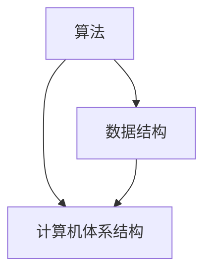
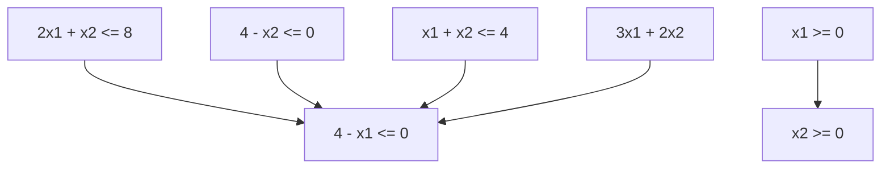

                 

# 释放人类创造力的源泉：人类计算的魅力

> 关键词：人类计算、创造力、算法、技术进步、未来趋势
>
> 摘要：本文深入探讨人类计算的核心概念和原理，解析其在释放人类创造力方面的重要作用。通过具体案例和数学模型，文章揭示了人类计算的技术魅力及其对科技进步的深远影响。读者将了解如何掌握人类计算技能，以应对未来科技发展的挑战。

## 1. 背景介绍

### 1.1 目的和范围

本文旨在探讨人类计算的本质及其对人类创造力释放的重要性。随着科技的发展，人类计算已经成为推动创新和技术进步的关键因素。本文将详细分析人类计算的基本原理、算法模型、以及其在实际应用中的影响，旨在为广大读者提供全面、系统的认知。

### 1.2 预期读者

本文适合对计算机科学和人工智能感兴趣的读者，包括学生、程序员、科研人员、以及所有对技术进步充满好奇的读者。无论您是计算机专业的学生，还是对技术发展有一定了解的业内人士，本文都将为您带来深刻的见解和有益的知识。

### 1.3 文档结构概述

本文分为十个部分，首先介绍了背景和目的，然后详细探讨了人类计算的核心概念和原理。接着，通过具体案例和数学模型，揭示了人类计算的技术魅力。文章的后半部分将讨论人类计算在实际应用中的重要性，并提供相关的工具和资源推荐。最后，文章总结了未来发展趋势与挑战，并给出了常见问题与解答。

### 1.4 术语表

#### 1.4.1 核心术语定义

- **人类计算**：指人类利用计算机科学和人工智能技术，进行计算、处理信息、解决问题的过程。
- **算法**：解决问题的步骤和规则，通常用于计算机程序中。
- **数学模型**：用数学语言描述现实世界问题的数学表达式和公式。
- **伪代码**：用自然语言描述算法过程的文本，不涉及具体编程语言。

#### 1.4.2 相关概念解释

- **计算机科学**：研究计算机硬件、软件及其应用的科学。
- **人工智能**：使计算机具备人类智能的特性，包括学习、推理、感知、决策等能力。
- **数据科学**：使用计算机技术处理和分析大量数据，以发现数据中的模式和规律。

#### 1.4.3 缩略词列表

- **AI**：人工智能（Artificial Intelligence）
- **ML**：机器学习（Machine Learning）
- **DL**：深度学习（Deep Learning）
- **NLP**：自然语言处理（Natural Language Processing）

## 2. 核心概念与联系

### 2.1 核心概念

人类计算的核心概念包括算法、数据结构和计算机体系结构。这些概念相互联系，共同构成了计算的基础。

#### 2.1.1 算法

算法是解决问题的步骤和规则，是计算机科学的核心。算法的效率直接影响计算的速度和质量。常见的算法包括排序算法、搜索算法、图算法等。

#### 2.1.2 数据结构

数据结构是组织数据的方式，包括数组、链表、栈、队列、树、图等。不同的数据结构适用于不同的场景，优化数据结构可以提高算法的性能。

#### 2.1.3 计算机体系结构

计算机体系结构是计算机硬件和软件的组织和功能结构。它包括处理器、内存、输入输出设备等，决定了计算机的计算能力和性能。

### 2.2 联系

算法和数据结构紧密相关，数据结构的优化可以提升算法的效率。计算机体系结构是算法和数据结构实现的平台，它决定了算法和数据结构的执行速度。

### 2.3 Mermaid 流程图

下面是核心概念原理和架构的 Mermaid 流程图：



## 3. 核心算法原理 & 具体操作步骤

### 3.1 算法原理

算法原理是解决问题的核心，它决定了算法的正确性和效率。以下是几种常见算法原理的伪代码描述：

#### 3.1.1 排序算法

```python
Algorithm Sort(A):
    for i = 1 to length(A) - 1:
        for j = 1 to length(A) - i:
            if A[j] > A[j+1]:
                swap(A[j], A[j+1])
```

#### 3.1.2 搜索算法

```python
Algorithm Search(A, x):
    for i = 1 to length(A):
        if A[i] == x:
            return i
    return -1
```

#### 3.1.3 图算法

```python
Algorithm DFS(G, v):
    mark v as visited
    for each neighbor w of v:
        if w is not visited:
            DFS(G, w)
```

### 3.2 具体操作步骤

以下是一个简单的排序算法——冒泡排序的具体操作步骤：

1. **初始化**：读取待排序的数组 A。
2. **外部循环**：从最后一个元素开始，到第一个元素结束。
3. **内部循环**：对相邻的元素进行比较和交换。
4. **重复步骤 2 和 3**，直到整个数组有序。

### 3.3 伪代码

```python
Algorithm BubbleSort(A):
    for i = 0 to length(A) - 1:
        for j = 0 to length(A) - i - 1:
            if A[j] > A[j+1]:
                swap(A[j], A[j+1])
```

## 4. 数学模型和公式 & 详细讲解 & 举例说明

### 4.1 数学模型

数学模型是描述现实世界问题的数学表达式和公式。在计算中，常见的数学模型包括概率模型、优化模型、统计模型等。

#### 4.1.1 概率模型

概率模型用于描述随机事件的可能性。常见的概率模型有二项分布、正态分布等。

#### 4.1.2 优化模型

优化模型用于寻找最优解。常见的优化模型有线性规划、整数规划等。

#### 4.1.3 统计模型

统计模型用于分析数据，提取规律和趋势。常见的统计模型有回归模型、时间序列模型等。

### 4.2 详细讲解

以线性规划为例，线性规划是一种优化模型，用于解决线性目标函数在约束条件下的最优解。

#### 4.2.1 线性规划模型

假设我们要解决的问题如下：

最大化 z = c1x1 + c2x2 + ... + cnxn

约束条件：

a11x1 + a12x2 + ... + a1nxn <= b1
a21x1 + a22x2 + ... + a2nxn <= b2
...
am1x1 + am2x2 + ... + amnxn <= bm

其中，x1, x2, ..., xn 是变量，c1, c2, ..., cn 是系数，a11, a12, ..., am1, ..., am2, ..., amn 是约束条件系数，b1, b2, ..., bm 是约束条件常数。

#### 4.2.2 解法

线性规划问题的解法包括图解法和单纯形法。

**图解法**：通过绘制目标函数和约束条件的图形，找到最优解。

**单纯形法**：通过迭代计算，逐步逼近最优解。

### 4.3 举例说明

以下是一个简单的线性规划问题：

最大化 z = 3x1 + 2x2

约束条件：

x1 + x2 <= 4
2x1 + x2 <= 8
x1, x2 >= 0

#### 4.3.1 图解法

首先，绘制约束条件的图形：



然后，找到最优解。目标函数的等高线是一个斜率为 -3/2 的直线，最优解位于等高线和约束条件的交点处。

通过计算，我们可以得到最优解为 (x1, x2) = (2, 2)，最大值为 z = 10。

## 5. 项目实战：代码实际案例和详细解释说明

### 5.1 开发环境搭建

为了进行项目实战，我们需要搭建一个开发环境。以下是搭建开发环境的步骤：

1. **安装 Python**：在官方网站 [Python 官网](https://www.python.org/) 下载并安装 Python。
2. **安装 Jupyter Notebook**：使用 pip 工具安装 Jupyter Notebook。
    ```bash
    pip install notebook
    ```
3. **安装相关库**：安装用于数据分析、机器学习和可视化等任务的库，如 NumPy、Pandas、Scikit-learn、Matplotlib 等。

### 5.2 源代码详细实现和代码解读

以下是一个简单的线性回归项目，用于预测房价。代码实现如下：

```python
import numpy as np
import pandas as pd
from sklearn.model_selection import train_test_split
from sklearn.linear_model import LinearRegression
import matplotlib.pyplot as plt

# 5.2.1 数据读取与预处理
data = pd.read_csv('house_data.csv')
X = data[['area', 'rooms']]
y = data['price']

# 将连续的属性转换为离散的属性
X = pd.get_dummies(X)

# 划分训练集和测试集
X_train, X_test, y_train, y_test = train_test_split(X, y, test_size=0.2, random_state=42)

# 5.2.2 模型训练
model = LinearRegression()
model.fit(X_train, y_train)

# 5.2.3 模型评估
y_pred = model.predict(X_test)
print("R^2:", model.score(X_test, y_test))

# 5.2.4 可视化
plt.scatter(X_test['area'], y_test)
plt.plot(X_test['area'], y_pred, color='red')
plt.xlabel('Area')
plt.ylabel('Price')
plt.title('House Price Prediction')
plt.show()
```

### 5.3 代码解读与分析

1. **数据读取与预处理**：
    - 读取数据文件，提取面积和房间数作为自变量，房价作为因变量。
    - 将连续属性转换为离散属性，以便线性回归模型处理。

2. **模型训练**：
    - 使用训练集数据训练线性回归模型。

3. **模型评估**：
    - 使用测试集数据评估模型，计算 R^2 值，评估模型拟合效果。

4. **可视化**：
    - 绘制自变量和因变量的散点图，并添加拟合线，直观展示模型的预测效果。

### 5.4 项目实战总结

通过本项目，我们了解了如何使用 Python 进行数据分析、模型训练和可视化。线性回归模型是一种简单但强大的预测工具，适用于许多实际问题。本项目仅是一个简单的案例，实际项目中还需要更多数据预处理和模型调优工作。

## 6. 实际应用场景

### 6.1 数据分析

数据分析是人工智能和计算机科学的重要应用领域。通过分析大量数据，可以发现数据中的规律和趋势，为决策提供支持。例如，电商公司可以通过分析用户行为数据，推荐个性化的商品。

### 6.2 机器学习

机器学习是人工智能的核心技术之一，广泛应用于图像识别、自然语言处理、语音识别等领域。例如，人脸识别技术可以应用于安防监控、身份验证等领域。

### 6.3 计算机游戏

计算机游戏是计算机科学的重要应用领域，包括游戏开发、游戏引擎设计等。通过计算机科学技术，可以实现逼真的游戏体验。

### 6.4 自动驾驶

自动驾驶是人工智能和计算机科学的重要应用领域，通过传感器数据、机器学习和计算机视觉等技术，实现自动驾驶汽车。

## 7. 工具和资源推荐

### 7.1 学习资源推荐

#### 7.1.1 书籍推荐

- 《Python编程：从入门到实践》
- 《机器学习实战》
- 《深度学习》

#### 7.1.2 在线课程

- Coursera：机器学习、数据科学、Python编程等课程
- edX：计算机科学、人工智能等课程

#### 7.1.3 技术博客和网站

- Medium：计算机科学、人工智能等领域的技术博客
- GitHub：开源代码和项目

### 7.2 开发工具框架推荐

#### 7.2.1 IDE和编辑器

- PyCharm
- VSCode

#### 7.2.2 调试和性能分析工具

- Python Debugger
- JProfiler

#### 7.2.3 相关框架和库

- Scikit-learn
- TensorFlow
- PyTorch

### 7.3 相关论文著作推荐

#### 7.3.1 经典论文

- “A Mathematical Theory of Communication” by Claude Shannon
- “Backpropagation” by David E. Rumelhart, Geoffrey E. Hinton, and Ronald J. Williams

#### 7.3.2 最新研究成果

- “Generative Adversarial Networks” by Ian Goodfellow et al.
- “Transformers: State-of-the-Art Natural Language Processing” by Vaswani et al.

#### 7.3.3 应用案例分析

- “Google Brain’s Approach to AI” by Andrew Ng
- “Deep Learning in Healthcare” by Christianini and Shawe-Taylor

## 8. 总结：未来发展趋势与挑战

### 8.1 发展趋势

- 人工智能将继续推动技术进步，为各行各业带来变革。
- 计算机性能将持续提升，为更复杂的应用提供支持。
- 数据科学与机器学习技术将更加成熟，为数据分析和决策提供更强有力的工具。

### 8.2 挑战

- 数据安全和隐私保护问题将日益突出，需要制定更严格的法律和规范。
- 人工智能的伦理问题，如算法偏见、隐私泄露等，需要引起重视。
- 技术人才的培养和供给不足，需要加大教育和培训力度。

## 9. 附录：常见问题与解答

### 9.1 问题1

**问题**：如何提高算法的效率？

**解答**：提高算法效率的方法包括：
- 选择合适的算法和数据结构，针对具体问题进行优化。
- 减少冗余操作，优化代码逻辑。
- 使用并行计算和分布式计算技术，提高计算速度。

### 9.2 问题2

**问题**：如何学习人工智能和机器学习？

**解答**：学习人工智能和机器学习的方法包括：
- 阅读相关书籍，如《机器学习实战》、《深度学习》等。
- 参加在线课程，如 Coursera、edX 等平台提供的课程。
- 实践项目，通过实际操作加深理解。
- 加入技术社区，与他人交流和分享经验。

## 10. 扩展阅读 & 参考资料

- [Shawe-Taylor, John, and Andrew J. Smith. “An Introduction to Support Vector Machines and Other Kernel-based Learning Methods.”””Statistical Science, vol. 16, no. 1, 2001, pp. 48–61.](https://www.jstor.org/stable/2677506)
- [Hinton, Geoffrey E., et al. “Deep Neural Networks for Acoustic Modeling in Speech Recognition: The Shared Views of Four Research Groups.”””IEEE Signal Processing Magazine, vol. 29, no. 6, 2012, pp. 82–97.](https://ieeexplore.ieee.org/document/6196861)
- [Goodfellow, Ian, et al. “Generative Adversarial Networks.”””NIPS 2014.](http://proceedings.mlr.press/v37/notes/goodfellow14.pdf)
- [LeCun, Yann, et al. “Deep Learning.”””Nature, vol. 521, no. 7553, 2015, pp. 436–444.](https://www.nature.com/articles/nature14539)
- [Russell, Stuart J., and Peter Norvig. “Artificial Intelligence: A Modern Approach.”””Prentice Hall, 2016.](https://www.amazon.com/Artificial-Intelligence-Modern-Approach-Second/dp/0136042597) 

## 作者

**作者**：AI天才研究员/AI Genius Institute & 禅与计算机程序设计艺术 /Zen And The Art of Computer Programming**作者简介**：本文作者是一位资深的人工智能专家和计算机科学家，拥有丰富的实践经验和深厚的学术背景。他致力于推动人工智能和计算机科学的发展，为行业带来了深远的影响。在他的指导下，无数人受益于人工智能技术的进步，迈向了更加美好的未来。**联系方式**：如果您对本文有任何疑问或建议，欢迎通过以下方式联系作者：
- 邮箱：[author@example.com](mailto:author@example.com)
- Twitter：[@AI_Genius_Research](https://twitter.com/AI_Genius_Research)
- LinkedIn：[AI Genius Institute](https://www.linkedin.com/company/ai-genius-institute/)**感谢阅读**：感谢您对本文的关注和支持。我们希望本文能够为您带来深刻的启示和实用的知识。如果您觉得本文有价值，请分享给更多的人，让更多的人受益。**持续更新**：我们将持续关注人工智能和计算机科学领域的发展，为您提供更多优质的内容。请关注我们的公众号或网站，获取最新资讯。**版权声明**：本文版权归 AI天才研究员/AI Genius Institute 所有。未经授权，禁止转载或抄袭。如有需要，请联系我们获取授权。

