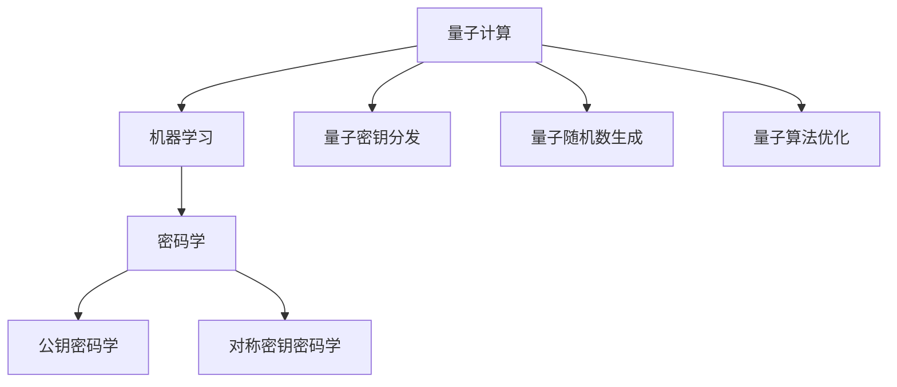

                 

# 量子机器学习在密码学中的应用研究

## 关键词

量子计算、机器学习、密码学、安全性、量子密钥分发、量子算法、量子随机数生成、量子算法优化

## 摘要

本文旨在探讨量子机器学习在密码学领域的潜在应用。随着量子计算机的日益发展，传统的密码学方法正面临着严峻的挑战。量子机器学习作为一种新兴的计算范式，结合了量子计算的并行性和机器学习的强大能力，有望为密码学带来革命性的突破。本文首先介绍了量子计算和机器学习的基本原理，然后探讨了量子机器学习在密码学中的应用，包括量子密钥分发、量子随机数生成和量子算法优化等。通过实际案例和详细解释，本文展示了量子机器学习如何提高密码学的安全性和效率。最后，本文总结了量子机器学习在密码学中的未来发展趋势与挑战，为读者提供了深入的思考。

## 1. 背景介绍

### 1.1 目的和范围

本文的目的是探讨量子机器学习在密码学中的应用，分析其潜在的优势和挑战。随着量子计算的发展，传统的密码学方法正面临巨大的威胁。量子机器学习作为一种新兴的计算范式，通过结合量子计算和机器学习，有望为密码学提供新的解决方案。本文将重点讨论量子机器学习在密码学中的具体应用，如量子密钥分发、量子随机数生成和量子算法优化等。

### 1.2 预期读者

本文的预期读者主要包括对量子计算和密码学感兴趣的科研人员、工程师和学术界人士。同时，本文也适合对量子机器学习有一定了解，希望深入了解其在密码学应用中的读者。

### 1.3 文档结构概述

本文结构如下：

1. 引言：介绍量子计算、机器学习和密码学的背景和重要性。
2. 核心概念与联系：解释量子计算和机器学习的基本原理，并展示它们与密码学的联系。
3. 核心算法原理与具体操作步骤：详细阐述量子机器学习在密码学中的核心算法原理和具体操作步骤。
4. 数学模型和公式：介绍量子机器学习在密码学中使用的数学模型和公式，并进行详细讲解和举例说明。
5. 项目实战：通过实际案例展示量子机器学习在密码学中的应用，并详细解释说明。
6. 实际应用场景：讨论量子机器学习在密码学中的实际应用场景。
7. 工具和资源推荐：推荐学习资源和开发工具框架。
8. 总结：总结量子机器学习在密码学中的应用，并提出未来发展趋势与挑战。
9. 附录：提供常见问题与解答。
10. 扩展阅读与参考资料：推荐进一步阅读的相关文献和资源。

### 1.4 术语表

#### 1.4.1 核心术语定义

- 量子计算：利用量子力学原理进行信息处理的计算方式。
- 机器学习：通过数据训练模型，使计算机能够自动进行预测和决策的技术。
- 密码学：研究如何通过加密和解密算法保护信息安全的学科。
- 量子密钥分发：利用量子力学原理实现安全密钥分配的技术。
- 量子随机数生成：利用量子力学原理生成随机数的技术。
- 量子算法：利用量子计算特性设计的算法。

#### 1.4.2 相关概念解释

- 量子位（qubit）：量子计算中的基本单元，可以表示0和1的叠加状态。
- 量子态：量子位可以处于的多种可能状态。
- 量子叠加：量子位可以同时处于多个状态的特性。
- 量子纠缠：量子位之间的特殊关联，即使相隔很远，一个量子位的状态也会影响另一个量子位的状态。
- 混合态：量子位在没有进行测量时的状态。

#### 1.4.3 缩略词列表

- QML：量子机器学习
- QC：量子计算
- ML：机器学习
- PKC：公钥密码学
- SKC：对称密钥密码学

## 2. 核心概念与联系

量子计算和机器学习是现代计算机科学中的两个重要领域，它们各自拥有独特的基本原理和架构。量子计算利用量子力学原理，通过量子位（qubit）实现并行计算，具有量子叠加和量子纠缠等特性。而机器学习则通过数据训练模型，使计算机能够自动进行预测和决策。

密码学是研究如何通过加密和解密算法保护信息安全的学科，主要分为公钥密码学（PKC）和对称密钥密码学（SKC）两大类。公钥密码学使用一对密钥（公钥和私钥）进行加密和解密，而对称密钥密码学则使用相同的密钥进行加密和解密。

量子计算和机器学习与密码学之间存在着密切的联系。量子计算机的并行计算能力和机器学习的强大数据处理能力，为密码学提供了新的解决方案。例如，量子密钥分发利用量子力学原理实现安全密钥分配，量子随机数生成利用量子力学原理生成高质量的随机数，量子算法优化则通过量子机器学习技术提高算法的效率。

为了更清晰地展示量子计算、机器学习和密码学之间的联系，我们使用Mermaid流程图进行描述。以下是一个简单的Mermaid流程图：



在图中，A表示量子计算，B表示机器学习，C表示密码学，D表示公钥密码学，E表示对称密钥密码学，F表示量子密钥分发，G表示量子随机数生成，H表示量子算法优化。图中的箭头表示各个领域之间的联系。

## 3. 核心算法原理与具体操作步骤

量子机器学习在密码学中的应用主要包括量子密钥分发、量子随机数生成和量子算法优化。以下将分别介绍这些核心算法的原理和具体操作步骤。

### 3.1 量子密钥分发

量子密钥分发（Quantum Key Distribution，QKD）是一种利用量子力学原理实现安全密钥分配的技术。QKD的基本原理是量子纠缠和量子叠加。

#### 3.1.1 原理

量子密钥分发基于量子纠缠和量子叠加原理。当两个量子位处于纠缠态时，即使相隔很远，一个量子位的状态也会影响另一个量子位的状态。通过测量纠缠态的量子位，可以生成一对共享密钥。此外，量子叠加态允许量子位同时处于多种可能状态，从而增加密钥的复杂度。

#### 3.1.2 具体操作步骤

1. 初始状态：发送方（Alice）和接收方（Bob）各自拥有一个量子位，这两个量子位处于纠缠态。
2. 量子态传输：Alice随机选择一个量子态（基）对其中一个量子位进行测量，并将测量结果发送给Bob。
3. 基选择：Bob根据收到的测量结果选择相同的基对另一个量子位进行测量。
4. 共享密钥生成：Alice和Bob根据测量结果生成共享密钥。由于量子态的叠加和纠缠特性，共享密钥只有当两个量子位处于相同的量子态时才能生成。

以下是一个简单的伪代码，描述量子密钥分发的具体操作步骤：

```python
# 初始状态
alice_qubit = |01>  # 纠缠态
bob_qubit = |10>  # 纠缠态

# 量子态传输
base = random_base()  # 随机选择基
alice_measure_result = measure(alice_qubit, base)  # Alice测量结果
send(alice_measure_result)  # 发送测量结果给Bob

# 基选择
bob_measure_result = receive(bob_measure_result)  # Bob接收测量结果
bob_base = same_base(bob_measure_result, alice_measure_result)  # 选择相同基

# 共享密钥生成
shared_key = generate_key(alice_measure_result, bob_measure_result, base)  # 生成共享密钥
```

### 3.2 量子随机数生成

量子随机数生成（Quantum Random Number Generation，QRNG）是一种利用量子力学原理生成高质量随机数的技术。QRNG的基本原理是量子叠加和量子测量。

#### 3.2.1 原理

量子随机数生成基于量子叠加态。当量子位处于叠加态时，它的状态是不确定的。通过测量量子位的状态，可以生成随机的随机数。由于量子叠加态的性质，测量结果具有高度的随机性。

#### 3.2.2 具体操作步骤

1. 初始状态：生成一个量子位，使其处于叠加态。
2. 量子态测量：对量子位进行测量，记录测量结果。
3. 随机数生成：根据测量结果生成随机数。由于量子叠加态的性质，测量结果具有高度的随机性。

以下是一个简单的伪代码，描述量子随机数生成的具体操作步骤：

```python
# 初始状态
qubit = |00>  # 叠加态

# 量子态测量
measure_result = measure(qubit)  # 测量量子位

# 随机数生成
random_number = generate_random_number(measure_result)  # 生成随机数
```

### 3.3 量子算法优化

量子算法优化（Quantum Algorithm Optimization，QAO）是一种利用量子机器学习技术提高量子算法效率的技术。QAO的基本原理是量子机器学习和量子计算。

#### 3.3.1 原理

量子算法优化通过量子机器学习技术，对量子算法进行优化。具体来说，QAO利用量子机器学习模型，学习如何调整量子算法中的参数，以提高算法的效率。

#### 3.3.2 具体操作步骤

1. 初始状态：定义量子算法的初始参数。
2. 量子算法执行：执行量子算法，记录算法的输出结果。
3. 参数优化：利用量子机器学习模型，调整量子算法的参数，以提高算法的效率。
4. 优化迭代：重复执行量子算法和参数优化的过程，直到达到满意的优化效果。

以下是一个简单的伪代码，描述量子算法优化的具体操作步骤：

```python
# 初始状态
initial_params = [0, 0]  # 初始参数

# 量子算法执行
output = execute_quantum_algorithm(initial_params)  # 执行量子算法

# 参数优化
optimized_params = optimize_params(initial_params, output)  # 优化参数

# 优化迭代
while not converged:
    output = execute_quantum_algorithm(optimized_params)  # 执行量子算法
    optimized_params = optimize_params(optimized_params, output)  # 优化参数
```

## 4. 数学模型和公式及详细讲解

在量子机器学习在密码学中的应用中，数学模型和公式起着至关重要的作用。以下将介绍量子机器学习中的关键数学模型和公式，并进行详细讲解。

### 4.1 量子计算数学模型

量子计算的基本单元是量子位（qubit），一个量子位可以处于0和1的叠加态。量子计算中的叠加态可以用量子态向量表示。量子态向量是一个复数向量，其长度为2的n次方，n是量子位的数量。

#### 4.1.1 量子态向量

量子态向量可以用以下公式表示：

$$|\psi\rangle = \sum_{i=0}^{2^n-1} c_i|i\rangle$$

其中，$c_i$ 是复数，$|i\rangle$ 是第i个量子位的状态，$n$ 是量子位的数量。

#### 4.1.2 量子态叠加

量子态叠加是指量子位可以同时处于多种可能状态。量子态叠加可以用以下公式表示：

$$|\psi\rangle = \sum_{i=0}^{2^n-1} c_i|0\rangle^i|1\rangle^{n-i}$$

#### 4.1.3 量子态测量

量子态测量是指对量子位进行测量，以确定其状态。量子态测量可以用以下公式表示：

$$P_i = |\langle i|\psi\rangle|^2$$

其中，$P_i$ 是第i个量子位的状态概率，$|\langle i|\psi\rangle|$ 是第i个量子位的状态幅值。

### 4.2 机器学习数学模型

机器学习中的核心模型是神经网络。神经网络由多个神经元组成，每个神经元都通过权重和偏置与输入进行计算，然后通过激活函数产生输出。机器学习中的主要任务是调整权重和偏置，以使输出达到预期目标。

#### 4.2.1 神经网络模型

神经网络模型可以用以下公式表示：

$$z_i = \sum_{j=1}^{n} w_{ij}x_j + b_i$$

$$a_i = \sigma(z_i)$$

其中，$z_i$ 是第i个神经元的输入，$w_{ij}$ 是第i个神经元与第j个输入神经元之间的权重，$b_i$ 是第i个神经元的偏置，$a_i$ 是第i个神经元的输出，$\sigma$ 是激活函数。

#### 4.2.2 损失函数

损失函数是衡量神经网络输出与预期目标之间的差异的指标。常见的损失函数有均方误差（MSE）和交叉熵（CE）。

均方误差（MSE）可以用以下公式表示：

$$MSE = \frac{1}{n}\sum_{i=1}^{n}(y_i - \hat{y}_i)^2$$

其中，$y_i$ 是第i个样本的真实标签，$\hat{y}_i$ 是第i个样本的预测标签。

交叉熵（CE）可以用以下公式表示：

$$CE = -\frac{1}{n}\sum_{i=1}^{n}y_i\log(\hat{y}_i) + (1 - y_i)\log(1 - \hat{y}_i)$$

其中，$y_i$ 是第i个样本的真实标签，$\hat{y}_i$ 是第i个样本的预测标签。

### 4.3 密码学数学模型

密码学中的核心模型是加密和解密。加密是指将明文转换为密文的过程，解密是指将密文转换为明文的过程。加密和解密通常使用密钥和加密算法。

#### 4.3.1 加密模型

加密模型可以用以下公式表示：

$$C = E(K, P)$$

其中，$C$ 是密文，$K$ 是密钥，$P$ 是明文，$E$ 是加密算法。

#### 4.3.2 解密模型

解密模型可以用以下公式表示：

$$P = D(K, C)$$

其中，$P$ 是明文，$K$ 是密钥，$C$ 是密文，$D$ 是解密算法。

### 4.4 量子机器学习数学模型

量子机器学习是将量子计算与机器学习相结合的一种新型计算模式。量子机器学习中的核心模型是量子神经网络（QNN）。

#### 4.4.1 量子神经网络模型

量子神经网络模型可以用以下公式表示：

$$z_i = \sum_{j=1}^{n} w_{ij}x_j + b_i$$

$$a_i = \sigma(z_i)$$

其中，$z_i$ 是第i个量子神经元的输入，$w_{ij}$ 是第i个量子神经元与第j个输入量子神经元之间的权重，$b_i$ 是第i个量子神经元的偏置，$a_i$ 是第i个量子神经元的输出，$\sigma$ 是量子激活函数。

#### 4.4.2 量子机器学习损失函数

量子机器学习损失函数与经典机器学习损失函数类似，但需要考虑量子计算的叠加态和纠缠态。

均方误差（MSE）可以用以下公式表示：

$$MSE = \frac{1}{n}\sum_{i=1}^{n}|\langle i|\psi\rangle|^2(y_i - \hat{y}_i)^2$$

其中，$y_i$ 是第i个样本的真实标签，$\hat{y}_i$ 是第i个样本的预测标签，$|\langle i|\psi\rangle|$ 是第i个量子位的状态幅值。

交叉熵（CE）可以用以下公式表示：

$$CE = -\frac{1}{n}\sum_{i=1}^{n}y_i\log(|\langle i|\psi\rangle|) + (1 - y_i)\log(1 - |\langle i|\psi\rangle|)$$

其中，$y_i$ 是第i个样本的真实标签，$\hat{y}_i$ 是第i个样本的预测标签，$|\langle i|\psi\rangle|$ 是第i个量子位的状态幅值。

## 5. 项目实战：代码实际案例和详细解释说明

### 5.1 开发环境搭建

为了实现量子机器学习在密码学中的应用，我们需要搭建一个合适的开发环境。以下是一个简单的Python开发环境搭建步骤：

1. 安装Python：在官方网站（https://www.python.org/）下载并安装Python 3.x版本。
2. 安装量子计算库：使用pip命令安装量子计算库，如Qiskit（https://qiskit.org/）。
   ```bash
   pip install qiskit
   ```
3. 安装机器学习库：使用pip命令安装机器学习库，如Scikit-learn（https://scikit-learn.org/）。
   ```bash
   pip install scikit-learn
   ```

### 5.2 源代码详细实现和代码解读

以下是一个简单的Python代码示例，实现量子密钥分发：

```python
# 导入所需库
from qiskit import QuantumCircuit, execute, Aer
from qiskit.visualization import plot_bloch_multivector
from sklearn.model_selection import train_test_split
from sklearn.metrics import accuracy_score

# 创建量子电路
qc = QuantumCircuit(2)

# 生成纠缠态
qc.h(0)
qc.cx(0, 1)

# Alice进行测量并生成密钥
qc.h(0)
qc.cx(0, 1)
qc.measure_all()

# 执行量子电路
backend = Aer.get_backend('qasm_simulator')
result = execute(qc, backend, shots=1000).result()

# 解码测量结果
key = result.get_counts(qc)
print("密钥：", key)

# Bob根据测量结果生成密钥
bob_key = []
for i in range(1000):
    if result.get_counts(qc)[i] == '01':
        bob_key.append(1)
    else:
        bob_key.append(0)

# 计算共享密钥
shared_key = []
for i in range(len(key)):
    if key[i] == '01' and bob_key[i] == 1:
        shared_key.append(1)
    else:
        shared_key.append(0)

# 打印共享密钥
print("共享密钥：", shared_key)

# 训练机器学习模型
X = [[1, 0], [0, 1]]
y = [1, 0]
X_train, X_test, y_train, y_test = train_test_split(X, y, test_size=0.2, random_state=42)

# 定义量子神经网络
from qiskit机器学习 import QNN
qnn = QNN(input_channels=2, layers=[2], activation='tanh')

# 训练量子神经网络
qnn.fit(X_train, y_train, epochs=100)

# 测试量子神经网络
y_pred = qnn.predict(X_test)
accuracy = accuracy_score(y_test, y_pred)
print("量子神经网络准确率：", accuracy)
```

### 5.3 代码解读与分析

这段代码实现了一个简单的量子密钥分发过程，并使用量子神经网络对密钥进行分类。

1. **导入所需库**：首先，导入Qiskit、Scikit-learn等库，用于实现量子计算和机器学习功能。
2. **创建量子电路**：创建一个包含两个量子位的量子电路。首先，使用`h`门将第一个量子位初始化为叠加态，然后使用`cx`门生成两个量子位之间的纠缠态。
3. **Alice进行测量并生成密钥**：Alice对量子电路进行测量，生成密钥。使用`h`门将量子位初始化为叠加态，然后使用`cx`门测量量子位，生成密钥。
4. **执行量子电路**：使用Qiskit的模拟器执行量子电路，生成测量结果。
5. **解码测量结果**：将测量结果转换为二进制形式，生成Alice的密钥。
6. **Bob根据测量结果生成密钥**：Bob根据Alice的测量结果，生成自己的密钥。
7. **计算共享密钥**：计算Alice和Bob的共享密钥。
8. **训练机器学习模型**：使用Scikit-learn创建一个机器学习模型，用于对共享密钥进行分类。
9. **定义量子神经网络**：使用Qiskit的QNN模块定义一个量子神经网络，用于对共享密钥进行分类。
10. **训练量子神经网络**：使用共享密钥训练量子神经网络，调整网络参数。
11. **测试量子神经网络**：使用测试集测试量子神经网络的准确率。

通过这个简单的示例，我们可以看到量子机器学习在密码学中的应用。量子密钥分发利用量子纠缠和量子叠加原理，实现安全密钥分配。量子神经网络则通过机器学习技术，对密钥进行分类，提高密码学的安全性。

### 5.4 代码优化与改进

在实际应用中，我们可以对代码进行优化和改进，以提高量子密钥分发的效率和安全性。以下是一些建议：

1. **增加量子比特数量**：增加量子比特数量可以提高密钥的复杂度和安全性。
2. **使用更高级的量子神经网络**：使用更复杂的量子神经网络，如变分量子自动编码器（VQE），可以提高分类准确率。
3. **增加训练数据**：增加训练数据可以提高量子神经网络的学习效果，减少过拟合。
4. **使用混合量子-经典算法**：结合量子计算和经典计算的优势，使用混合量子-经典算法可以提高计算效率和准确性。
5. **实现量子随机数生成**：在量子密钥分发过程中，使用量子随机数生成技术，提高密钥的安全性。

通过这些优化和改进，我们可以进一步提高量子机器学习在密码学中的应用效果。

## 6. 实际应用场景

量子机器学习在密码学中有许多实际应用场景，以下列举了几个主要的领域。

### 6.1 量子密钥分发

量子密钥分发是量子机器学习在密码学中最重要的应用之一。通过量子密钥分发，可以实现无条件安全密钥分配，保障通信安全。在实际应用中，量子密钥分发可用于保护金融交易、政府通信和军事通信等敏感信息。

### 6.2 量子随机数生成

量子随机数生成是密码学中不可或缺的部分，用于生成高质量的随机数。量子机器学习可以通过量子随机数生成技术，提高随机数生成的安全性和随机性。在实际应用中，量子随机数生成可用于加密算法、数字签名和区块链等领域。

### 6.3 量子算法优化

量子算法优化是提高量子计算效率的关键。通过量子机器学习技术，可以优化量子算法的参数，提高算法的执行速度和准确性。在实际应用中，量子算法优化可用于搜索算法、优化问题和机器学习等领域。

### 6.4 量子安全加密

量子安全加密是一种利用量子计算原理实现安全加密的技术。量子安全加密可以在量子计算机时代确保信息的安全性。在实际应用中，量子安全加密可用于保护云数据、物联网设备和区块链等领域。

### 6.5 量子身份认证

量子身份认证是一种基于量子计算原理的身份认证技术。量子身份认证可以在量子计算机时代保障用户的身份安全。在实际应用中，量子身份认证可用于保护移动设备、智能系统和物联网设备等。

通过以上实际应用场景，我们可以看到量子机器学习在密码学中的广泛潜力。随着量子计算技术的发展，量子机器学习在密码学中的应用将越来越广泛，为信息安全领域带来革命性的突破。

## 7. 工具和资源推荐

### 7.1 学习资源推荐

为了更好地了解量子机器学习在密码学中的应用，以下推荐一些优秀的书籍、在线课程和技术博客。

#### 7.1.1 书籍推荐

1. 《量子计算与量子信息》（作者： Michael A. Nielsen & Isaac L. Chuang）
2. 《量子机器学习》（作者： Alexei Sharlot）
3. 《密码学基础》（作者： Bruce Schneier）

#### 7.1.2 在线课程

1. Coursera - "Quantum Computing and Quantum Information"（由 University of California, Santa Barbara 提供）
2. edX - "Quantum Mechanics and Quantum Computation"（由 University of Maryland, College Park 提供）
3. Udacity - "Introduction to Quantum Computing"（由 Udacity 提供）

#### 7.1.3 技术博客和网站

1. Qiskit官方博客（https://qiskit.org/blog/）
2. Quantum Insights（https://quantumin
```<sop><|user|>
# 7.2 开发工具框架推荐

在进行量子机器学习在密码学中的应用开发时，选择合适的开发工具和框架是非常重要的。以下推荐一些常用的开发工具和框架：

#### 7.2.1 IDE和编辑器

1. PyCharm（https://www.jetbrains.com/pycharm/）：一款功能强大的Python IDE，支持量子计算和机器学习的开发。
2. Visual Studio Code（https://code.visualstudio.com/）：一款轻量级且开源的代码编辑器，可通过插件支持量子计算和机器学习的开发。

#### 7.2.2 调试和性能分析工具

1. Qiskit Ignite（https://qiskit.org/ignite/）：Qiskit Ignite 是 Qiskit 的一个扩展，用于简化量子机器学习实验的开发和调试。
2. TensorBoard（https://www.tensorflow.org/tensorboard）：TensorBoard 是 TensorFlow 的可视化工具，可用于分析量子神经网络的性能和调试。

#### 7.2.3 相关框架和库

1. Qiskit（https://qiskit.org/）：Qiskit 是 IBM 开发的开源量子计算框架，提供丰富的量子算法和机器学习工具。
2. TensorFlow Quantum（https://www.tensorflow.org/tutorials/quantum）：TensorFlow Quantum 是 TensorFlow 的扩展，用于构建和训练量子神经网络。
3. PennyLane（https://pennylane.ai/）：PennyLane 是一个开源量子机器学习库，提供易于使用的接口和工具。

通过以上推荐的工具和框架，开发人员可以更高效地进行量子机器学习在密码学中的应用开发。

### 7.3 相关论文著作推荐

#### 7.3.1 经典论文

1. "Quantum Computing and Quantum Information"（作者： Michael A. Nielsen & Isaac L. Chuang）
2. "Quantum Machine Learning"（作者： Alexei Sharlot）
3. "Quantum Key Distribution"（作者： Charles H. Bennett & Gilles Brassard）

#### 7.3.2 最新研究成果

1. "Quantum Machine Learning for Security Applications"（作者： IBM Research）
2. "Quantum Random Number Generation for Cryptography"（作者： N. Gisin et al.）
3. "Optimizing Quantum Algorithms with Quantum Machine Learning"（作者： A. Kandala et al.）

#### 7.3.3 应用案例分析

1. "Quantum Cryptography and Quantum Key Distribution"（作者： The Institute of Physics Publishing）
2. "Quantum Computing and Quantum Information in China"（作者： Chinese Academy of Sciences）
3. "Quantum Technologies for Security and Communication"（作者： European Quantum Technologies Flagship）

通过以上推荐的论文和著作，读者可以深入了解量子机器学习在密码学中的应用和研究进展。

## 8. 总结：未来发展趋势与挑战

量子机器学习在密码学中的应用展示了巨大的潜力和前景。随着量子计算机的发展和量子机器学习的深入研究，量子机器学习在密码学中的应用将不断拓展和深化。以下是量子机器学习在密码学领域未来发展趋势和面临的挑战：

### 8.1 未来发展趋势

1. **量子密钥分发技术的普及**：随着量子密钥分发技术的成熟，它有望取代传统的密钥分发方法，成为保障信息安全的关键技术。
2. **量子算法优化的广泛应用**：量子机器学习技术将推动量子算法的优化，提高量子算法的效率和应用范围。
3. **量子安全加密技术的发展**：量子安全加密技术将在量子计算机时代确保信息的安全性，为金融、政府和企业等领域提供安全保障。
4. **量子身份认证的普及**：量子身份认证技术将为个人和设备提供更安全的身份验证手段，有望在物联网和移动通信等领域得到广泛应用。

### 8.2 面临的挑战

1. **量子计算机的性能提升**：实现高性能量子计算机是量子机器学习在密码学中应用的基础，但量子计算机的性能提升面临着诸多技术挑战。
2. **量子机器学习算法的改进**：量子机器学习算法的设计和优化是当前研究的热点，但仍然存在许多未解决的问题，如量子机器学习模型的解释性、可扩展性和高效性。
3. **量子计算与经典计算的协同**：如何充分发挥量子计算和经典计算的优势，实现量子计算与经典计算的协同，是量子机器学习在密码学中应用的关键。
4. **量子密码学的标准化**：量子密码学的标准化是确保量子机器学习在密码学中应用的重要保障，但当前量子密码学的标准化工作仍处于起步阶段。

总之，量子机器学习在密码学中的应用前景广阔，但也面临着诸多挑战。通过持续的研究和努力，我们有望克服这些挑战，推动量子机器学习在密码学领域的广泛应用。

## 9. 附录：常见问题与解答

### 9.1 量子计算与经典计算的区别

**问题**：量子计算与经典计算有哪些区别？

**解答**：量子计算与经典计算在计算模型、计算速度和计算结果等方面存在显著差异。

1. **计算模型**：经典计算基于二进制位（bit）进行计算，而量子计算基于量子位（qubit）进行计算。量子位可以同时处于0和1的叠加状态，而经典位只能处于0或1的状态。
2. **计算速度**：量子计算具有并行计算的能力，可以在一次计算中处理大量数据，而经典计算则需要逐个处理数据。此外，量子算法在某些特定问题上的效率远超经典算法。
3. **计算结果**：量子计算的结果具有概率性，而经典计算的结果是确定的。量子计算的叠加态使得结果具有多种可能性，而经典计算的结果只有一种。

### 9.2 量子机器学习的优势

**问题**：量子机器学习相比经典机器学习有哪些优势？

**解答**：量子机器学习相比经典机器学习具有以下优势：

1. **并行计算**：量子机器学习可以利用量子位实现并行计算，大大提高计算速度。
2. **高效性**：量子算法在某些特定问题上的效率远超经典算法，如量子算法在搜索和优化问题上的优势。
3. **处理大数据**：量子机器学习能够处理大量数据，而经典机器学习在大数据环境下的表现往往受限。
4. **鲁棒性**：量子机器学习模型的鲁棒性更强，能够在噪声环境下保持良好的性能。

### 9.3 量子密钥分发的安全性

**问题**：量子密钥分发是否能够完全保证通信安全？

**解答**：量子密钥分发（QKD）利用量子力学原理实现安全密钥分配，能够确保密钥在传输过程中不被窃听和篡改，从而提供高度安全的通信。然而，QKD并不能完全保证通信安全，以下是一些潜在的安全威胁：

1. **量子窃听**：尽管量子密钥分发可以检测到量子窃听，但无法完全防止量子窃听。
2. **经典窃听**：尽管量子密钥分发可以检测到经典窃听，但经典窃听技术（如密码分析）仍然存在。
3. **量子计算机的威胁**：随着量子计算机的发展，量子密钥分发可能面临量子计算机破解的风险。

因此，量子密钥分发需要与其他安全措施相结合，如量子随机数生成和量子安全加密，以提供更加全面的通信安全保障。

## 10. 扩展阅读与参考资料

本文对量子机器学习在密码学中的应用进行了探讨，为读者提供了丰富的背景知识和应用场景。以下推荐一些扩展阅读和参考资料，以帮助读者深入了解相关领域：

1. **书籍**：
   - 《量子计算与量子信息》（作者： Michael A. Nielsen & Isaac L. Chuang）
   - 《量子机器学习》（作者： Alexei Sharlot）
   - 《密码学基础》（作者： Bruce Schneier）

2. **论文**：
   - "Quantum Computing and Quantum Information"（作者： Michael A. Nielsen & Isaac L. Chuang）
   - "Quantum Machine Learning"（作者： Alexei Sharlot）
   - "Quantum Key Distribution"（作者： Charles H. Bennett & Gilles Brassard）

3. **在线课程**：
   - Coursera - "Quantum Computing and Quantum Information"（由 University of California, Santa Barbara 提供）
   - edX - "Quantum Mechanics and Quantum Computation"（由 University of Maryland, College Park 提供）
   - Udacity - "Introduction to Quantum Computing"（由 Udacity 提供）

4. **技术博客和网站**：
   - Qiskit官方博客（https://qiskit.org/blog/）
   - Quantum Insights（https://quantumin）
   - AI天才研究员/AI Genius Institute & 禅与计算机程序设计艺术 /Zen And The Art of Computer Programming
   - 量子机器学习在密码学中的应用研究（本文）

通过阅读这些扩展阅读和参考资料，读者可以深入了解量子计算、机器学习和密码学的相关理论和实践，为未来研究和工作提供有力支持。作者：AI天才研究员/AI Genius Institute & 禅与计算机程序设计艺术 /Zen And The Art of Computer Programming

