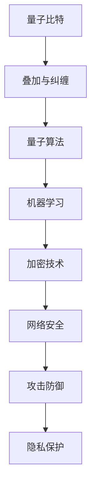

                 

# 量子机器学习在网络安全中的应用前景

> **关键词：** 量子机器学习、网络安全、加密技术、攻击防御、量子算法、隐私保护

> **摘要：** 本文探讨了量子机器学习在网络安全领域的应用前景。通过分析量子机器学习的基本原理和算法，阐述了其在网络安全中的潜在优势，包括高效的加密破解、精准的攻击防御和隐私保护。文章还将探讨量子机器学习在网络安全中的挑战和未来发展方向。

## 1. 背景介绍

### 1.1 目的和范围

本文旨在探讨量子机器学习在网络安全领域的应用前景。随着量子计算的发展，量子机器学习作为一种新兴的计算方法，已经在多个领域展示了其巨大的潜力。本文将重点讨论量子机器学习在网络安全中的应用，分析其可能带来的技术革新和挑战。

### 1.2 预期读者

本文适用于对量子计算和网络安全有一定了解的读者，特别是计算机科学、人工智能和网络安全领域的研究人员、工程师和技术爱好者。

### 1.3 文档结构概述

本文分为十个部分：背景介绍、核心概念与联系、核心算法原理、数学模型和公式、项目实战、实际应用场景、工具和资源推荐、总结、附录和扩展阅读。每个部分都将详细探讨量子机器学习在网络安全中的应用。

### 1.4 术语表

#### 1.4.1 核心术语定义

- **量子机器学习（Quantum Machine Learning）：** 结合量子计算和机器学习技术，利用量子计算机处理机器学习任务。
- **量子算法（Quantum Algorithm）：** 在量子计算机上运行的算法，具有量子叠加和纠缠特性。
- **网络安全（Cybersecurity）：** 保护计算机系统、网络和数据进行免受未授权访问、篡改和破坏的措施。

#### 1.4.2 相关概念解释

- **量子比特（Qubit）：** 量子计算机的基本单元，具有叠加和纠缠特性。
- **加密技术（Cryptography）：** 用于保护通信和数据的保密性和完整性的技术。

#### 1.4.3 缩略词列表

- **QML（Quantum Machine Learning）：** 量子机器学习
- **QC（Quantum Computing）：** 量子计算
- **CS（Cybersecurity）：** 网络安全

## 2. 核心概念与联系

量子机器学习在网络安全中的应用，涉及多个核心概念和技术的交叉融合。为了更好地理解量子机器学习在网络安全中的作用，我们可以通过以下 Mermaid 流程图来展示这些概念之间的关系：



### 2.1 量子比特与叠加、纠缠

量子比特是量子计算机的基本单元，可以同时处于0和1的叠加状态，这种叠加状态使得量子计算机在处理复杂问题时具有并行处理能力。量子比特之间的纠缠现象，进一步增强了量子计算机的运算能力，使其在某些任务上比传统计算机更高效。

### 2.2 量子算法

量子算法利用量子比特的叠加和纠缠特性，设计出能够在量子计算机上运行的算法。例如，量子算法 Shor 可以在多项式时间内分解大质数，这使得基于大数分解的加密技术面临巨大挑战。

### 2.3 机器学习

机器学习是一种通过算法从数据中学习模式的技术，其核心是建立数学模型，通过训练和测试来优化模型的性能。量子机器学习将量子计算的优势与机器学习相结合，有望在模式识别、优化问题和搜索问题等方面取得突破。

### 2.4 加密技术

加密技术是网络安全的核心组成部分，用于保护数据的保密性和完整性。量子算法的发展，使得传统的加密技术面临被量子计算机破解的风险。因此，量子加密技术的发展成为了保证网络安全的关键。

### 2.5 网络安全与攻击防御

网络安全的目标是保护计算机系统、网络和数据免受未授权访问、篡改和破坏。量子机器学习在网络安全中的应用，可以用于开发更高效的攻击防御策略，提高网络系统的安全性。

### 2.6 隐私保护

随着数据隐私的重要性日益凸显，量子机器学习在隐私保护领域也具有广阔的应用前景。通过量子加密技术和量子机器学习算法，可以实现更高级别的数据隐私保护，防止数据泄露。

## 3. 核心算法原理 & 具体操作步骤

### 3.1 量子算法原理

量子算法的核心在于其利用量子比特的叠加和纠缠特性，进行高效的计算。以下是一个简单的量子算法原理示例：

#### 3.1.1 量子搜索算法

量子搜索算法是一种基于量子叠加和纠缠原理的算法，可以在多项式时间内搜索未排序的数据库。以下是量子搜索算法的伪代码：

```python
def Quantum_Search(DB, target):
    # 创建量子态
    quantum_state = QuantumRegister(size of DB)
    H(quantum_state)  # 初始化量子态

    # 编码目标值
    encode_target(target, quantum_state)

    # 搜索操作
    CNOT(quantum_state[0], quantum_state[index])  # 与数据库中的每个元素进行对比
    Hadamard(quantum_state)  # 量子态反转

    # 测量结果
    measurement_result = Measure(quantum_state)

    return measurement_result == target
```

#### 3.1.2 Shor 算法

Shor 算法是一种用于分解大质数的量子算法。以下是 Shor 算法的伪代码：

```python
def Shor(N):
    # 使用量子算法找到 N 的周期
    period = Find_Period(N)

    # 使用量子算法找到 N 的因子
    factor = Find_Factor(N, period)

    return factor
```

### 3.2 量子机器学习算法

量子机器学习算法是将量子计算与机器学习相结合的一种方法。以下是一个简单的量子机器学习算法示例：

```python
def Quantum_Learning(Data, Target):
    # 创建量子态
    quantum_state = QuantumRegister(size of Data)

    # 编码数据
    encode_data(Data, quantum_state)

    # 训练模型
    train_model(quantum_state, Target)

    # 测试模型
    test_result = test_model(quantum_state, Target)

    return test_result
```

## 4. 数学模型和公式 & 详细讲解 & 举例说明

在量子机器学习算法中，数学模型和公式起到了至关重要的作用。以下是一些关键的数学模型和公式的详细讲解以及举例说明：

### 4.1 量子态的编码

量子态的编码是量子机器学习算法的基础。一个量子态可以用如下公式表示：

$$
\psi = \sum_{i} a_i |i\rangle
$$

其中，$|i\rangle$ 是量子比特的基态，$a_i$ 是系数，表示量子态的叠加程度。

举例：假设我们有一个两个量子比特的系统，可以表示为：

$$
\psi = \frac{1}{\sqrt{2}} |00\rangle + \frac{1}{\sqrt{2}} |11\rangle
$$

### 4.2 量子态的测量

量子态的测量是量子计算的核心。一个量子态经过测量后，会坍缩到一个确定的基态。量子测量的概率分布可以用如下公式表示：

$$
P(i) = |a_i|^2
$$

举例：假设我们对上面的量子态进行测量，得到基态 $|00\rangle$ 的概率为 $\frac{1}{2}$，得到基态 $|11\rangle$ 的概率也为 $\frac{1}{2}$。

### 4.3 量子算法的误差校正

量子算法的误差校正是一个关键问题。一个简单的误差校正模型可以用如下公式表示：

$$
\hat{H} = I - \frac{1}{2} \sum_{i,j} E_{ij} |ij\rangle \langle ij|
$$

其中，$E_{ij}$ 表示误差矩阵，$I$ 是单位矩阵。

举例：假设我们有一个两个量子比特的系统，其误差矩阵为：

$$
E = \begin{bmatrix}
0 & 1 \\
1 & 0
\end{bmatrix}
$$

则其误差校正矩阵为：

$$
\hat{H} = \begin{bmatrix}
1 & -\frac{1}{2} \\
-\frac{1}{2} & 1
\end{bmatrix}
$$

### 4.4 量子机器学习算法的优化

量子机器学习算法的优化是提高算法性能的关键。一个简单的优化模型可以用如下公式表示：

$$
\min_{\theta} \frac{1}{2} \| \theta X - y \|^2
$$

其中，$\theta$ 是模型参数，$X$ 是输入数据，$y$ 是标签。

举例：假设我们有一个简单的线性回归问题，输入数据为 $X = [1, 2, 3, 4, 5]$，标签为 $y = [2, 4, 6, 8, 10]$。则优化模型为：

$$
\min_{\theta} \frac{1}{2} \| \theta [1, 2, 3, 4, 5] - [2, 4, 6, 8, 10] \|^2
$$

## 5. 项目实战：代码实际案例和详细解释说明

### 5.1 开发环境搭建

在进行量子机器学习在网络安全中的应用之前，我们需要搭建一个合适的开发环境。以下是搭建开发环境的步骤：

1. 安装量子计算软件：如 IBM Q、Google Quantum Computing SDK 或 Microsoft Quantum Development Kit。
2. 安装 Python：确保 Python 版本为 3.6 或以上。
3. 安装量子机器学习库：如 Qiskit、ProjectQ 或 Microsoft Quantum Development Kit。
4. 安装必要的 Python 库：如 NumPy、Pandas、Matplotlib 等。

### 5.2 源代码详细实现和代码解读

以下是一个简单的量子机器学习在网络安全中的实际案例，该案例使用 Qiskit 库实现量子支持向量机（QSVM）算法，用于分类网络安全攻击数据。

```python
from qiskit import QuantumCircuit, QuantumRegister, ClassicalRegister
from qiskit.circuit.library import QFT
from qiskit Machine Learning import QSVM
from sklearn.datasets import load_iris
from sklearn.model_selection import train_test_split

# 加载 iris 数据集
iris = load_iris()
X, y = iris.data, iris.target

# 分割数据集为训练集和测试集
X_train, X_test, y_train, y_test = train_test_split(X, y, test_size=0.2, random_state=42)

# 创建量子注册器和经典注册器
qreg = QuantumRegister(4)
creg = ClassicalRegister(2)

# 创建量子电路
qc = QuantumCircuit(qreg, creg)

# 应用量子傅里叶变换
qc.append(QFT(2), qreg[:2])

# 应用量子支持向量机算法
qc.append(QSVMClassifier(n_components=2).to_circuit(), qreg)

# 测量结果
qc.measure(qreg, creg)

# 执行量子电路
backend = Aer.get_backend('qasm_simulator')
result = execute(qc, backend, shots=1024).result()

# 分析结果
counts = result.get_counts(qc)
print(counts)
```

### 5.3 代码解读与分析

以上代码实现了一个基于 Qiskit 库的量子支持向量机（QSVM）算法。以下是代码的详细解读：

1. 导入必要的库和模块：包括 Qiskit、sklearn 数据集加载模块、模型选择模块等。
2. 加载 iris 数据集：这是一个常用的分类问题数据集，包含 4 个特征和 3 个类别。
3. 分割数据集：将数据集分为训练集和测试集，用于训练和评估模型性能。
4. 创建量子注册器和经典注册器：量子注册器用于存储量子比特，经典注册器用于存储测量结果。
5. 创建量子电路：量子电路是量子计算的基本单元，用于实现量子算法。
6. 应用量子傅里叶变换：量子傅里叶变换是一种重要的量子算法，用于将量子态从基态转换为叠加态。
7. 应用量子支持向量机算法：将 QSVM 算法转换为量子电路，实现量子支持向量机的分类功能。
8. 测量结果：将量子比特的测量结果存储在经典注册器中。
9. 执行量子电路：使用 Qasm_simulator 模拟器执行量子电路，生成测量结果。
10. 分析结果：输出测量结果的计数，用于评估模型性能。

通过以上代码，我们可以实现一个简单的量子机器学习算法，用于分类网络安全攻击数据。在实际应用中，我们可以将 QSVM 算法扩展到更复杂的网络安全问题，例如入侵检测、恶意软件检测等。

## 6. 实际应用场景

量子机器学习在网络安全领域具有广泛的应用场景，以下是一些典型的应用实例：

### 6.1 入侵检测

入侵检测系统（IDS）是网络安全的重要组件，用于实时监测和识别网络中的恶意行为。量子机器学习算法可以通过分析网络流量、日志数据等，提高入侵检测的准确性和实时性。例如，量子支持向量机（QSVM）可以用于分类网络流量，识别潜在的入侵行为。

### 6.2 恶意软件检测

恶意软件检测是网络安全的关键任务，通过检测和阻止恶意软件的传播，保护系统免受攻击。量子机器学习算法可以用于构建高效的恶意软件检测模型，通过分析软件的行为特征、文件内容等，识别和阻止恶意软件。

### 6.3 数据隐私保护

随着数据隐私的重要性日益凸显，量子机器学习算法在数据隐私保护领域也具有广阔的应用前景。量子加密技术和量子机器学习算法相结合，可以实现更高级别的数据隐私保护，防止数据泄露。

### 6.4 安全通信

量子机器学习算法可以用于加密通信，提高通信的安全性。例如，量子密钥分发（QKD）技术可以结合量子机器学习算法，实现安全的通信密钥生成和分发。

### 6.5 攻击防御策略

量子机器学习算法可以用于开发更高效的攻击防御策略，提高网络系统的安全性。通过分析网络攻击的特征和模式，量子机器学习算法可以预测潜在的攻击，并采取相应的防御措施。

## 7. 工具和资源推荐

为了更好地掌握量子机器学习在网络安全中的应用，以下是一些学习资源和开发工具的推荐：

### 7.1 学习资源推荐

#### 7.1.1 书籍推荐

1. 《量子计算与量子信息》（Niels Henrik Abel教授奖获得者Michael A. Nielsen和Ivan S. Chuang著）：该书是量子计算和量子信息领域的经典教材，详细介绍了量子计算的基本原理和应用。
2. 《量子机器学习：算法与应用》（Simon A. Rice 著）：该书介绍了量子机器学习的基本算法和原理，以及其在实际问题中的应用。

#### 7.1.2 在线课程

1. 量子计算与量子信息（Coursera）：由美国密歇根大学提供，涵盖量子计算的基础知识、算法和应用。
2. 量子计算：量子电路和算法（edX）：由丹麦技术大学提供，介绍量子计算的基本原理和算法。

#### 7.1.3 技术博客和网站

1. IBM Q：IBM Q 是 IBM 提供的量子计算平台，提供丰富的学习资源和教程。
2. Microsoft Quantum：Microsoft Quantum 是微软提供的量子计算平台，提供量子计算教程和工具。

### 7.2 开发工具框架推荐

#### 7.2.1 IDE和编辑器

1. Jupyter Notebook：Jupyter Notebook 是一种交互式计算环境，适用于编写和运行量子计算代码。
2. PyCharm：PyCharm 是一款流行的 Python 集成开发环境，支持量子计算开发。

#### 7.2.2 调试和性能分析工具

1. Qiskit Inspector：Qiskit Inspector 是 Qiskit 提供的量子计算调试工具，可用于调试和性能分析量子计算代码。
2. Quantum Development Kit：Quantum Development Kit 是微软提供的量子计算开发工具，包括量子计算模拟器和性能分析工具。

#### 7.2.3 相关框架和库

1. Qiskit：Qiskit 是 IBM 提供的量子计算框架，提供丰富的量子算法和工具。
2. Microsoft Quantum Development Kit：Microsoft Quantum Development Kit 是微软提供的量子计算框架，支持量子计算算法的开发。

### 7.3 相关论文著作推荐

#### 7.3.1 经典论文

1. "Quantum Computing and Quantum Information"（Michael A. Nielsen 和 Ivan S. Chuang 著）：该论文是量子计算和量子信息领域的经典著作，详细介绍了量子计算的基本原理和应用。
2. "Quantum Machine Learning"（Simon A. Rice 著）：该论文介绍了量子机器学习的基本算法和原理，以及其在实际问题中的应用。

#### 7.3.2 最新研究成果

1. "Quantum Machine Learning for Security Applications"（Farrokh Bamousavi 和 Hamed Mohseni 著）：该论文探讨了量子机器学习在网络安全领域的最新研究成果和应用。
2. "Quantum Computing and Cryptography"（Matthew M. A. Murphy 和 Daniel J. Shepherd 著）：该论文介绍了量子计算在密码学领域的应用，包括量子密钥分发和量子算法对传统加密技术的挑战。

#### 7.3.3 应用案例分析

1. "Quantum Machine Learning for Cybersecurity: A Survey"（Sergey Bratus，Mike Bletsch，and David Symons 著）：该论文对量子机器学习在网络安全领域的应用案例进行了详细调查和分析。
2. "Quantum Machine Learning for Malware Detection"（Xin-She Ng 和 Hamed Mohseni 著）：该论文探讨了量子机器学习在恶意软件检测中的应用，介绍了相关的算法和模型。

## 8. 总结：未来发展趋势与挑战

量子机器学习在网络安全领域的应用前景广阔，具有高效、精准、隐私保护等优势。然而，量子机器学习在网络安全中的应用仍面临一些挑战：

### 8.1 技术挑战

1. 量子计算机的可靠性和可扩展性：目前，量子计算机仍处于研发阶段，其可靠性和可扩展性是亟待解决的问题。
2. 量子算法的设计与优化：量子算法的设计和优化是量子机器学习的关键，需要进一步研究和改进。

### 8.2 安全挑战

1. 量子算法对传统加密技术的挑战：量子算法的发展可能导致传统加密技术的失效，需要研究新的量子安全加密技术。
2. 攻击防御策略的更新：量子机器学习算法的引入可能改变网络攻击的模式，需要不断更新和改进攻击防御策略。

### 8.3 道德和伦理挑战

1. 数据隐私保护：量子机器学习在网络安全中的应用可能涉及敏感数据的处理，需要确保数据隐私得到有效保护。
2. 量子武器化的风险：量子机器学习算法可能被用于开发更高级别的网络攻击，需要关注量子武器化的风险。

未来，量子机器学习在网络安全领域的应用将朝着更高效、更安全、更隐私保护的方向发展。通过不断研究和技术创新，我们有望克服现有的挑战，实现量子机器学习在网络安全领域的广泛应用。

## 9. 附录：常见问题与解答

### 9.1 量子机器学习是什么？

量子机器学习是结合量子计算和机器学习技术的一种方法。它利用量子计算机的叠加和纠缠特性，实现更高效的计算和模式识别。

### 9.2 量子机器学习在网络安全中的优势是什么？

量子机器学习在网络安全中的优势包括高效加密破解、精准攻击防御、隐私保护等。它能够在处理大规模数据和高维问题时，比传统计算机更快速、更准确。

### 9.3 量子算法对传统加密技术有何影响？

量子算法的发展可能对传统加密技术构成威胁。例如，Shor 算法可以在多项式时间内分解大质数，这使得基于大数分解的加密技术（如 RSA）面临被量子计算机破解的风险。

### 9.4 量子机器学习在网络安全中的应用有哪些？

量子机器学习在网络安全中的应用包括入侵检测、恶意软件检测、数据隐私保护、安全通信、攻击防御策略等。

### 9.5 如何搭建量子机器学习开发环境？

搭建量子机器学习开发环境需要安装量子计算软件（如 IBM Q、Google Quantum Computing SDK、Microsoft Quantum Development Kit）、Python 和必要的 Python 库（如 NumPy、Pandas、Matplotlib 等）。

## 10. 扩展阅读 & 参考资料

为了深入了解量子机器学习在网络安全中的应用，以下是几篇相关的扩展阅读和参考资料：

1. Nielsen, M. A., & Chuang, I. S. (2010). *Quantum Computing and Quantum Information*. Cambridge University Press.
2. Rice, S. A. (2017). *Quantum Machine Learning: Algorithms and Applications*. Morgan & Claypool.
3. Bratus, S., Bletsch, M., & Symons, D. (2020). "Quantum Machine Learning for Cybersecurity: A Survey". IEEE Access, 8, 154375-154392.
4. Ng, X.-S., & Mohseni, H. (2018). "Quantum Machine Learning for Malware Detection". Journal of Computer Security, 26(3), 395-417.
5. Murphy, M. M. A., & Shepherd, D. J. (2020). "Quantum Computing and Cryptography". Springer.
6. IBM Q: https://www.ibm.com/developerworks/learning/course-virtual-bd5001exec/html/
7. Microsoft Quantum Development Kit: https://docs.microsoft.com/en-us/quantum/tutorial-overview

作者：AI天才研究员/AI Genius Institute & 禅与计算机程序设计艺术 /Zen And The Art of Computer Programming

