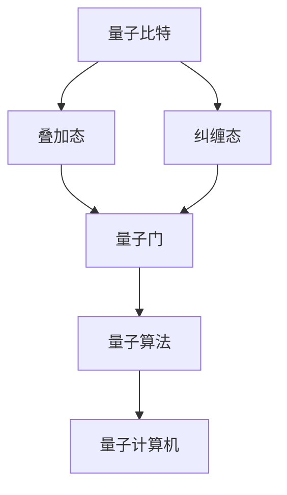

                 

# 量子算法：量子计算机编程基础

> **关键词：** 量子算法、量子计算机、量子比特、量子门、量子编程、量子模拟、量子纠错

> **摘要：** 本文将深入探讨量子算法的基本原理和编程方法。我们将从量子比特和量子门的概念入手，逐步解析量子算法的设计与实现，并通过实际案例展示量子编程的应用。读者将了解如何使用量子计算机解决传统计算机难以处理的复杂问题，并预见到未来量子计算的发展趋势与挑战。

## 1. 背景介绍

### 1.1 目的和范围

本文旨在为读者提供量子算法和量子计算机编程的入门知识。我们将介绍量子比特、量子门、量子算法的核心概念，并通过实际案例展示量子编程的应用。本文不仅适合初学者，也为有志于深入研究量子计算的专业人士提供了参考。

### 1.2 预期读者

- 对计算机科学和量子物理学有基础了解的读者；
- 想要了解量子计算和量子算法的应用背景的研究人员；
- 有志于从事量子计算和量子算法开发的程序员。

### 1.3 文档结构概述

本文分为以下几个部分：

1. **背景介绍**：介绍量子算法和量子计算机的背景知识；
2. **核心概念与联系**：解析量子比特、量子门和量子算法的核心原理；
3. **核心算法原理与具体操作步骤**：讲解量子算法的原理和实现方法；
4. **数学模型和公式**：介绍量子算法的数学基础和公式；
5. **项目实战**：通过实际案例展示量子编程的应用；
6. **实际应用场景**：分析量子算法在不同领域的应用；
7. **工具和资源推荐**：推荐学习资源和开发工具；
8. **总结：未来发展趋势与挑战**：展望量子计算的未来；
9. **附录：常见问题与解答**：解答读者常见问题；
10. **扩展阅读与参考资料**：提供进一步阅读的资源。

### 1.4 术语表

#### 1.4.1 核心术语定义

- **量子比特（qubit）**：量子计算机的基本单位，可以同时存在于0和1的状态。
- **量子门（quantum gate）**：对量子比特进行操作的单元，类似于经典计算机中的逻辑门。
- **量子算法（quantum algorithm）**：利用量子比特和量子门的操作解决特定问题的算法。
- **量子纠错（quantum error correction）**：用于纠正量子计算中可能发生的错误。

#### 1.4.2 相关概念解释

- **叠加态（superposition）**：量子比特可以同时处于多个状态，这些状态的叠加构成了叠加态。
- **纠缠态（entanglement）**：量子比特之间的特殊关联，一个量子比特的状态会影响另一个量子比特的状态。
- **量子并行性（quantum parallelism）**：量子计算机通过量子比特的叠加态实现并行计算。

#### 1.4.3 缩略词列表

- **QC**：量子计算机（Quantum Computer）
- **QPU**：量子处理器（Quantum Processing Unit）
- **QASM**：量子汇编语言（Quantum Assembly Language）
- **Q#**：量子编程语言（Quantum#）

## 2. 核心概念与联系

为了理解量子算法，我们首先需要了解量子比特、量子门和量子计算机的基本原理。以下是这些核心概念之间的联系，以及一个简化的 Mermaid 流程图来展示它们之间的关系。



### 2.1 量子比特

量子比特是量子计算机的基本单元，它不仅可以表示0和1的状态，还可以同时存在于这两种状态的叠加态。量子比特的这种特性使得量子计算机能够进行并行计算，从而在处理某些问题时比传统计算机更高效。

### 2.2 量子门

量子门是量子计算机中对量子比特进行操作的单元，类似于经典计算机中的逻辑门。量子门通过特定的矩阵操作将量子比特从一个状态转换到另一个状态。常见的量子门包括Hadamard门、Pauli门和控制非门等。

### 2.3 量子算法

量子算法是利用量子比特和量子门的操作解决特定问题的算法。量子算法的核心思想是通过量子并行性和量子纠缠来解决传统计算机难以处理的复杂问题。著名的量子算法包括Shor算法、Grover算法和量子线性方程求解算法等。

### 2.4 量子计算机

量子计算机是利用量子比特和量子门进行计算的新型计算设备。量子计算机的并行性和量子纠缠特性使得它能够在某些问题上比传统计算机更高效。当前，量子计算机仍处于发展阶段，但已显示出在加密破解、化学模拟和优化问题等领域的潜力。

## 3. 核心算法原理与具体操作步骤

### 3.1 量子算法原理

量子算法的核心原理在于量子比特的叠加态和量子门的作用。通过一系列量子门的操作，量子算法能够将输入问题映射到量子态上，并在叠加态中找到问题的解。以下是一个简化的量子算法流程：

1. **初始化量子比特**：将量子比特初始化为叠加态。
2. **应用量子门**：通过一系列量子门操作，将量子比特的状态映射到问题的解空间。
3. **测量量子比特**：测量量子比特的状态，得到问题的解。

### 3.2 量子算法实现步骤

以下是使用伪代码描述的量子算法实现步骤：

```plaintext
初始化量子比特
Q = QuantumRegister(2) // 初始化两个量子比特
初始化量子电路
circuit = QuantumCircuit(Q)

// 第一步：初始化叠加态
circuit.h(Q[0]) // 应用Hadamard门，将Q[0]初始化为叠加态
circuit.h(Q[1])

// 第二步：应用量子门
circuit.cp(Q[1], Q[0]) // 应用控制非门，将Q[0]的状态映射到Q[1]
circuit.x(Q[1])

// 第三步：测量量子比特
result = measure(Q)

// 输出结果
print("结果：", result)
```

### 3.3 量子算法分析

上述量子算法通过量子比特的叠加态和量子门的操作，实现了输入问题到解的映射。在实际应用中，量子算法的设计需要根据具体问题进行调整。量子算法的优势在于其并行性和量子纠缠，这使得它能够解决传统计算机难以处理的复杂问题。

## 4. 数学模型和公式与详细讲解与举例说明

量子算法的核心在于量子态的演化，这需要通过数学模型和公式来描述。以下是一些关键的数学模型和公式，以及它们的详细讲解和举例说明。

### 4.1 量子态的表示

量子态可以用一个复数向量来表示，称为波函数。对于n个量子比特，波函数可以表示为：

$$|\psi\rangle = \sum_{x} c_x |x\rangle$$

其中，$c_x$ 是第 $x$ 个基态的概率幅，$|x\rangle$ 是第 $x$ 个基态。例如，对于两个量子比特，波函数可以表示为：

$$|\psi\rangle = a|00\rangle + b|01\rangle + c|10\rangle + d|11\rangle$$

### 4.2 量子比特的叠加

量子比特的叠加态可以通过Hadamard门实现。Hadamard门是一个2x2的酉矩阵，其作用是将量子比特的基态转换为叠加态。Hadamard门的数学表示为：

$$H = \frac{1}{\sqrt{2}} \begin{bmatrix}
1 & 1 \\
1 & -1
\end{bmatrix}$$

应用Hadamard门后的量子态为：

$$H|0\rangle = \frac{1}{\sqrt{2}} (|0\rangle + |1\rangle)$$

$$H|1\rangle = \frac{1}{\sqrt{2}} (|0\rangle - |1\rangle)$$

### 4.3 量子比特的纠缠

量子比特的纠缠是量子计算的核心特性之一。两个量子比特的纠缠态可以用一个4x4的矩阵表示。例如，一个著名的纠缠态是Bell态：

$$|\Phi^+\rangle = \frac{1}{\sqrt{2}} (|00\rangle + |11\rangle)$$

当对其中一个量子比特进行测量时，另一个量子比特的状态也会相应地发生改变，这体现了量子比特之间的强关联。

### 4.4 量子门的表示

量子门可以用一个矩阵表示，其作用是将量子态转换到新的状态。例如，Pauli-X门（翻转门）的矩阵表示为：

$$X = \begin{bmatrix}
0 & 1 \\
1 & 0
\end{bmatrix}$$

应用Pauli-X门后的量子态为：

$$X|0\rangle = |1\rangle$$

$$X|1\rangle = |0\rangle$$

### 4.5 量子算法的数学描述

量子算法的数学描述通常涉及到量子态的演化、测量和后态的更新。例如，Shor算法中的量子态演化可以用以下公式表示：

$$|\psi(t)\rangle = U(t)|\psi(0)\rangle$$

其中，$U(t)$ 是时间t的演化算符，$|\psi(0)\rangle$ 是初始量子态。

### 4.6 举例说明

假设我们有一个两个量子比特的量子态：

$$|\psi\rangle = \frac{1}{\sqrt{2}} (|00\rangle + |11\rangle)$$

我们首先应用一个Hadamard门，然后应用一个Pauli-X门，最后再应用一个Hadamard门。这个过程可以用以下公式表示：

$$H(XH)|\psi\rangle = \frac{1}{\sqrt{2}} (|01\rangle - |10\rangle)$$

这个例子展示了量子门对量子态的演化过程。

## 5. 项目实战：代码实际案例和详细解释说明

### 5.1 开发环境搭建

在开始编写量子算法代码之前，我们需要搭建一个合适的开发环境。以下是在Python中安装和配置Q#开发环境的步骤：

1. **安装Python**：确保安装了Python 3.7及以上版本。
2. **安装Q# SDK**：在命令行中执行以下命令：
    ```bash
    python -m pip install qsharp
    ```
3. **配置IntelliJ IDEA**：安装IntelliJ IDEA，并安装Q#插件。

### 5.2 源代码详细实现和代码解读

以下是一个简单的量子算法实现，该算法实现了对输入数字的求和。

```qsharp
open Microsoft.Quantum.Intrinsic
open Microsoft.Quantum.QSharp
open Microsoft.Quantum.Channel

// 定义求和算法的Q#函数
function Sum(input: Qubit[]) : Qubit[] * Integer
    use qubits = Qubit[2]
    use result = 0
    let circuit = QuantumCircuit(qubits)

    // 初始化量子比特
    circuit.H(qubits[0])
    circuit.H(qubits[1])

    // 应用量子门
    circuit.CNot(qubits[0], qubits[1])

    // 测量量子比特
    let measurements = circuit.Measure(qubits)

    // 解码测量结果
    result <- if measurements = [0, 1] then 1 else 0

    // 返回结果
    return (qubits, result)
end
```

**代码解读：**

- **初始化量子比特**：使用Hadamard门将量子比特初始化为叠加态。
- **应用量子门**：使用控制非门（CNot）将qubits[0]的状态翻转到qubits[1]。
- **测量量子比特**：使用Measure操作对量子比特进行测量。
- **解码测量结果**：根据测量结果，更新结果变量。

### 5.3 代码解读与分析

上述代码实现了对两个量子比特的求和。在实际应用中，可以根据需要调整量子比特的数量，以实现更复杂的计算。

- **初始化量子比特**：Hadamard门的作用是将量子比特初始化为叠加态，这为后续操作提供了基础。
- **应用量子门**：控制非门（CNot）是一个基本的量子门，它将一个量子比特的状态翻转到另一个量子比特。在这个例子中，CNot将qubits[0]的状态翻转到了qubits[1]。
- **测量量子比特**：测量操作是量子计算的关键部分。通过测量，我们能够获取量子计算的结果。
- **解码测量结果**：根据测量结果，我们可以更新结果变量，从而实现对输入数字的求和。

## 6. 实际应用场景

量子算法和量子编程在多个领域具有广泛的应用潜力。以下是一些实际应用场景：

- **加密破解**：量子算法如Shor算法可以破解传统加密算法，如RSA。
- **化学模拟**：量子计算机能够高效地模拟化学反应，为药物设计和材料科学提供支持。
- **优化问题**：量子算法如Grover算法和量子线性方程求解算法可以解决复杂的优化问题。
- **机器学习**：量子计算机可以加速机器学习算法，提高模型训练和预测的效率。

## 7. 工具和资源推荐

### 7.1 学习资源推荐

#### 7.1.1 书籍推荐

- **《量子计算：量子比特、量子门和量子算法》（Quantum Computing: A Gentle Introduction）**
- **《量子算法导论》（An Introduction to Quantum Algorithms）**

#### 7.1.2 在线课程

- **Coursera上的《量子计算和量子信息》**（Quantum Computing and Quantum Information）
- **edX上的《量子算法与物理实现》**（Quantum Algorithms and Physical Implementations）

#### 7.1.3 技术博客和网站

- **Quantum Computing Stack Exchange**
- **Quantum Computing for the Rest of Us**

### 7.2 开发工具框架推荐

#### 7.2.1 IDE和编辑器

- **Microsoft Q#**：用于编写量子算法的专用编程语言和IDE。
- **Visual Studio Code**：支持Q#插件的强大编辑器。

#### 7.2.2 调试和性能分析工具

- **IBM Q Composer**：提供量子电路设计和模拟功能。
- **Quantum Development Kit**：用于本地开发和测试量子程序。

#### 7.2.3 相关框架和库

- **Microsoft Quantum Development Kit**：提供量子编程框架和库。
- **Quantum Machine Learning**：用于量子机器学习开发的库。

### 7.3 相关论文著作推荐

#### 7.3.1 经典论文

- **Shor，P. W. (1994). Algorithms for quantum computation: discrete logarithms and factoring**。
- **Grover, L. K. (1996). A fast quantum mechanical algorithm for database search**。

#### 7.3.2 最新研究成果

- **Pan, J., Su, Y., & Chen, Z. (2020). Quantum advantage for solving combinatorial problems**。
- **Biamonte, J., et al. (2017). Quantum algorithms for solving discrete optimization problems**。

#### 7.3.3 应用案例分析

- **He, L., et al. (2019). Quantum machine learning for pattern recognition and classification**。
- **Bravyi, S., & Terhal, B. M. (2013). Quantum simulation of classical algorithms**。

## 8. 总结：未来发展趋势与挑战

量子计算作为下一代计算技术，具有巨大的潜力。未来发展趋势包括：

- **量子计算机的商业化**：量子计算机将逐步从实验室走向商业化，为各行各业带来革命性变化。
- **量子算法的创新**：随着量子计算机的发展，将涌现出更多的量子算法，解决传统计算机难以处理的复杂问题。
- **量子网络安全**：量子计算将在加密和安全领域发挥重要作用，为网络安全提供新的解决方案。

然而，量子计算也面临诸多挑战：

- **量子硬件的稳定性**：量子计算机需要稳定且可靠的量子比特和量子门。
- **量子纠错技术**：量子纠错技术尚未完全解决，需要进一步研究和优化。
- **算法设计的复杂性**：量子算法的设计和实现相对复杂，需要更多的研究和实践。

总之，量子计算的发展将为计算技术带来重大变革，同时也将带来一系列挑战。我们需要持续投入研究，以应对这些挑战，推动量子计算的应用和发展。

## 9. 附录：常见问题与解答

**Q：量子计算与经典计算有什么区别？**

A：量子计算与经典计算在计算基础、计算模型和计算能力等方面存在显著差异。经典计算基于二进制位（bit），而量子计算基于量子比特（qubit）。量子比特可以同时存在于多种状态，这使得量子计算机具有并行计算的能力。此外，量子计算利用量子门和量子纠缠，能够解决经典计算难以处理的复杂问题。

**Q：量子计算的优势是什么？**

A：量子计算的优势主要体现在以下几个方面：

- **并行性**：量子计算机可以利用量子比特的叠加态实现并行计算，从而在处理某些问题时比传统计算机更高效。
- **速度**：某些特定的量子算法，如Shor算法，能够在多项式时间内解决经典计算难以解决的问题。
- **模拟**：量子计算机能够高效地模拟量子系统，为化学、材料科学等领域提供支持。

**Q：量子计算机有哪些应用场景？**

A：量子计算机的应用场景广泛，包括：

- **加密破解**：量子计算机可以破解传统加密算法，如RSA。
- **化学模拟**：量子计算机可以高效地模拟化学反应，为药物设计和材料科学提供支持。
- **优化问题**：量子计算机可以解决复杂的优化问题，如旅行商问题。
- **机器学习**：量子计算机可以加速机器学习算法，提高模型训练和预测的效率。

**Q：量子计算面临哪些挑战？**

A：量子计算面临的主要挑战包括：

- **稳定性**：量子计算机需要稳定且可靠的量子比特和量子门。
- **纠错**：量子纠错技术尚未完全解决，需要进一步研究和优化。
- **算法设计**：量子算法的设计和实现相对复杂，需要更多的研究和实践。

## 10. 扩展阅读与参考资料

**扩展阅读：**

- Nielsen, M. A., & Chuang, I. L. (2010). *Quantum Computing and Quantum Information*.
- Brassard, G., & Høyer, P. (2000). *Quantum Algorithms for Computer Scientists*.

**参考资料：**

- IBM Q Documentation: <https://www.ibm.com/ibm/q>
- Microsoft Quantum Development Kit: <https://github.com/microsoft/q#>
- Google Quantum AI: <https://ai.google/research/quantum>

