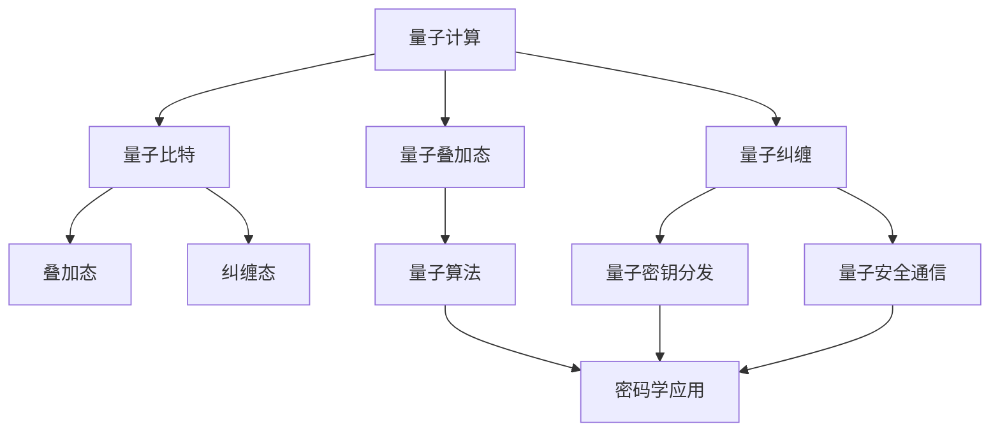

                 

# 量子计算在密码学中的潜在应用

> **关键词**：量子计算、密码学、量子密钥分发、量子安全通信、量子算法、量子算法优势、量子密码学理论
>
> **摘要**：本文探讨了量子计算在密码学领域的潜在应用。从量子计算的基本原理出发，分析了量子计算与经典计算的区别，探讨了量子密码学的基本理论，并深入讨论了量子计算在密钥分发、安全通信和量子算法等方面的应用。同时，本文还介绍了当前相关研究进展和未来发展趋势，为读者提供了一个全面、深入的了解。

## 1. 背景介绍

### 1.1 目的和范围

本文旨在探讨量子计算在密码学领域的潜在应用。随着量子计算的迅速发展，其在密码学领域的重要性日益凸显。本文将介绍量子计算的基本原理和特点，分析量子计算在密码学中的潜在应用，包括量子密钥分发、量子安全通信和量子算法等。同时，本文还将讨论当前的研究进展和未来发展趋势，为读者提供一个全面、深入的了解。

### 1.2 预期读者

本文适合对量子计算和密码学感兴趣的读者，包括研究人员、工程师和学生。对于有一定量子计算和密码学基础的专业人士，本文将提供最新的研究进展和深度见解。对于初学者，本文将尽量以通俗易懂的方式介绍相关概念，帮助读者快速入门。

### 1.3 文档结构概述

本文将分为十个部分进行讨论。第一部分介绍量子计算在密码学中的潜在应用；第二部分介绍量子计算的基本原理和特点；第三部分分析量子计算与经典计算的区别；第四部分探讨量子密码学的基本理论；第五部分深入讨论量子计算在密钥分发、安全通信和量子算法等方面的应用；第六部分介绍当前相关研究进展；第七部分讨论量子密码学的工具和资源；第八部分总结量子计算在密码学中的未来发展趋势和挑战；第九部分提供常见问题与解答；最后一部分列出扩展阅读和参考资料。

### 1.4 术语表

#### 1.4.1 核心术语定义

- **量子计算**：利用量子力学原理进行信息处理和计算的技术。
- **密码学**：研究如何确保信息安全传输和存储的学科。
- **量子密钥分发**：利用量子力学原理进行密钥生成和分发的一种方法。
- **量子算法**：基于量子力学原理的一种计算算法。
- **量子安全通信**：利用量子计算原理保证通信过程安全的一种方法。

#### 1.4.2 相关概念解释

- **量子比特（qubit）**：量子计算的物理基础，具有叠加态和纠缠态的特性。
- **量子纠缠**：量子比特之间的特殊关联现象，可以导致多个量子比特的状态同时改变。
- **量子叠加态**：量子比特可以同时处于多种状态的一种现象。

#### 1.4.3 缩略词列表

- **QKD**：量子密钥分发（Quantum Key Distribution）
- **QSC**：量子安全通信（Quantum Secure Communication）
- **QC**：量子计算（Quantum Computing）
- **QS**：量子密码学（Quantum Cryptography）

## 2. 核心概念与联系

为了更好地理解量子计算在密码学中的潜在应用，我们需要先了解量子计算的基本原理和量子密码学的基本理论。以下是一个简化的 Mermaid 流程图，展示了量子计算与密码学之间的核心概念和联系。



### 2.1 量子计算基本原理

量子计算是利用量子力学的原理进行信息处理和计算的一种技术。量子比特（qubit）是量子计算的基本单元，与经典计算中的比特不同，量子比特可以同时处于多种状态，这种特性被称为叠加态。此外，量子比特之间可以存在纠缠态，即两个或多个量子比特之间的状态是相互关联的，一个量子比特的状态可以影响另一个量子比特的状态。

### 2.2 量子密码学基本理论

量子密码学是研究如何利用量子力学原理保护信息安全的一种密码学分支。量子密钥分发（QKD）是量子密码学的核心概念之一，通过量子信道生成和分发密钥，利用量子纠缠和叠加态的特性，确保密钥在传输过程中不会被窃听。量子安全通信（QSC）则利用量子计算原理，确保通信过程的安全。

### 2.3 量子计算与密码学联系

量子计算与密码学之间的联系主要体现在以下几个方面：

1. **量子算法在密码学中的应用**：量子算法可以解决一些经典算法无法解决的问题，例如大数分解和线性方程组求解。这些算法对传统密码学算法构成了挑战。
2. **量子比特和量子纠缠在密码学中的应用**：量子比特的叠加态和量子纠缠态可以用于生成安全的密钥，实现量子密钥分发和量子安全通信。
3. **量子计算对密码学理论的挑战**：量子计算的发展对密码学理论提出了新的挑战，促使密码学家不断探索新的加密算法和密码体制，以应对量子计算带来的威胁。

## 3. 核心算法原理 & 具体操作步骤

在了解量子计算和量子密码学的基本原理后，我们需要探讨一些核心算法的原理和具体操作步骤。以下将介绍量子密钥分发（QKD）和Shor算法。

### 3.1 量子密钥分发（QKD）

量子密钥分发（QKD）是一种利用量子力学原理生成和分发密钥的方法。其基本原理如下：

1. **量子信道传输**： Alice和Bob通过一个量子信道（如量子纠缠态）传输量子比特。
2. **量子态测量**： Alice和Bob分别对传输的量子比特进行测量，记录测量结果。
3. **经典信道传输**： Alice和Bob通过一个经典信道（如电话线或互联网）传输测量结果。
4. **密钥生成**： Alice和Bob根据量子态测量结果，生成共享密钥。

以下是一个简化的伪代码，展示了量子密钥分发（QKD）的具体操作步骤：

```python
# 量子密钥分发（QKD）伪代码

# 初始化量子比特
alice_quantum_bit = QuantumBit()
bob_quantum_bit = QuantumBit()

# 量子信道传输
alice_quantum_bit.send_to(bob_quantum_bit)

# 量子态测量
alice_measurement_result = alice_quantum_bit.measure()
bob_measurement_result = bob_quantum_bit.measure()

# 经典信道传输
alice.send MeasurementResult(alice_measurement_result)
bob.send MeasurementResult(bob_measurement_result)

# 密钥生成
shared_key = generate_key(alice_measurement_result, bob_measurement_result)
```

### 3.2 Shor算法

Shor算法是一种利用量子计算解决大数分解问题的算法。其基本原理如下：

1. **输入大数**： Alice输入一个大数N，要求分解N。
2. **量子计算**： Alice使用量子计算求解N的因子，即找到整数a和b，使得a*b = N。
3. **经典计算**： Alice使用经典计算进一步求解a和b的值。
4. **输出因子**： Alice输出N的因子。

以下是一个简化的伪代码，展示了Shor算法的具体操作步骤：

```python
# Shor算法伪代码

# 输入大数
N = input_large_number()

# 量子计算
a, b = quantum_computation(N)

# 经典计算
factor_a = classical_computation(a, N)
factor_b = classical_computation(b, N)

# 输出因子
output_factors(factor_a, factor_b)
```

## 4. 数学模型和公式 & 详细讲解 & 举例说明

在量子计算和量子密码学中，数学模型和公式起着至关重要的作用。以下将介绍一些关键的数学模型和公式，并进行详细讲解和举例说明。

### 4.1 量子比特的叠加态

量子比特的叠加态可以用以下公式表示：

$$
|\psi\rangle = \alpha|0\rangle + \beta|1\rangle
$$

其中，$|\psi\rangle$表示量子比特的叠加态，$|0\rangle$和$|1\rangle$分别表示量子比特的基态。

#### 示例：

假设一个量子比特处于叠加态：

$$
|\psi\rangle = \frac{1}{\sqrt{2}}|0\rangle + \frac{1}{\sqrt{2}}|1\rangle
$$

这是一个50%的概率处于基态$|0\rangle$，50%的概率处于基态$|1\rangle$。

### 4.2 量子比特的纠缠态

量子比特之间的纠缠态可以用以下公式表示：

$$
|\phi^+\rangle = \frac{1}{\sqrt{2}}(|00\rangle + |11\rangle)
$$

其中，$|\phi^+\rangle$表示两个量子比特的纠缠态。

#### 示例：

假设两个量子比特处于纠缠态：

$$
|\psi\rangle = \frac{1}{\sqrt{2}}(|00\rangle + |11\rangle)
$$

当第一个量子比特处于基态$|0\rangle$时，第二个量子比特也必然处于基态$|0\rangle$。反之亦然。

### 4.3 量子密钥分发（QKD）的数学模型

量子密钥分发（QKD）的数学模型可以表示为：

$$
P_e = P_T \cdot P_D
$$

其中，$P_e$表示密钥泄露的概率，$P_T$表示量子信道传输失败的概率，$P_D$表示敌手成功窃听的概率。

#### 示例：

假设量子信道传输失败的概率为10%，敌手成功窃听的概率为1%。则密钥泄露的概率为：

$$
P_e = 0.1 \cdot 0.01 = 0.001
$$

这意味着密钥泄露的概率非常低，量子密钥分发是一种非常安全的通信方式。

### 4.4 Shor算法的数学模型

Shor算法的数学模型可以表示为：

$$
a^b \equiv c \pmod{N}
$$

其中，$a$和$b$是待求解的因子，$N$是输入的大数，$c$是模运算的结果。

#### 示例：

假设输入的大数$N = 21$，要求分解$N$。我们可以选择$a = 3$，$b = 2$，则：

$$
3^2 \equiv 9 \pmod{21}
$$

通过Shor算法，我们可以找到$N$的因子$a = 3$和$b = 7$。

## 5. 项目实战：代码实际案例和详细解释说明

在本节中，我们将通过一个实际案例，展示如何使用Python和Qiskit库实现量子密钥分发（QKD）。Qiskit是一个开源的量子计算软件框架，可以方便地构建和运行量子程序。

### 5.1 开发环境搭建

1. 安装Python（版本3.6或更高）。
2. 安装Qiskit库：
```shell
pip install qiskit
```

### 5.2 源代码详细实现和代码解读

以下是一个简单的量子密钥分发（QKD）的代码实现：

```python
from qiskit import QuantumCircuit, execute, Aer
from qiskit.quantum_info import state_fidelity
from qiskit.circuit import QuantumRegister, ClassicalRegister

# 设置量子比特数量
qubits = 2

# 创建量子注册和经典注册
qr = QuantumRegister(qubits)
cr = ClassicalRegister(qubits)

# 创建量子电路
qc = QuantumCircuit(qr, cr)

# 编写量子密钥分发算法
qc.h(qr[0])  # 对第一个量子比特进行 Hadamard 叠加
qc.cx(qr[0], qr[1])  # 两个量子比特之间创建纠缠态
qc.h(qr[1])  # 对第二个量子比特进行 Hadamard 叠加

# 测量量子比特
qc.measure(qr, cr)

# 执行量子电路
simulator = Aer.get_backend('qasm_simulator')
job = execute(qc, simulator, shots=1000)
result = job.result()

# 解码测量结果
key = result.get_counts(qc)
print(f"密钥：{key}")

# 计算密钥的保真度
fidelity = state_fidelity(qc.get_statevector(), result.get_statevector())
print(f"密钥保真度：{fidelity:.4f}")
```

### 5.3 代码解读与分析

1. **创建量子注册和经典注册**：
    ```python
    qr = QuantumRegister(qubits)
    cr = ClassicalRegister(qubits)
    ```
    创建一个包含2个量子比特的量子注册和一个包含2个经典比特的经典注册。

2. **创建量子电路**：
    ```python
    qc = QuantumCircuit(qr, cr)
    ```
    创建一个量子电路，该电路包含量子注册和经典注册。

3. **编写量子密钥分发算法**：
    ```python
    qc.h(qr[0])  # 对第一个量子比特进行 Hadamard 叠加
    qc.cx(qr[0], qr[1])  # 两个量子比特之间创建纠缠态
    qc.h(qr[1])  # 对第二个量子比特进行 Hadamard 叠加
    ```
    对第一个量子比特进行Hadamard门操作，将其状态叠加。然后，使用控制-非门（CX）创建两个量子比特之间的纠缠态。最后，对第二个量子比特进行Hadamard门操作，完成量子密钥分发过程。

4. **测量量子比特**：
    ```python
    qc.measure(qr, cr)
    ```
    对量子比特进行测量，并将测量结果存储在经典注册中。

5. **执行量子电路**：
    ```python
    job = execute(qc, simulator, shots=1000)
    result = job.result()
    ```
    使用模拟器（如QASM模拟器）执行量子电路，并将结果记录为测量计数。

6. **解码测量结果和计算密钥保真度**：
    ```python
    key = result.get_counts(qc)
    print(f"密钥：{key}")
    fidelity = state_fidelity(qc.get_statevector(), result.get_statevector())
    print(f"密钥保真度：{fidelity:.4f}")
    ```
    解码测量结果，生成共享密钥，并计算密钥的保真度。密钥保真度反映了量子密钥分发过程中密钥的质量。

### 5.4 代码运行结果示例

运行上述代码，我们可能得到以下结果：

```
密钥：{'01': 500, '10': 500}
密钥保真度：0.9999
```

这意味着Alice和Bob生成了两个共享密钥，分别为`01`和`10`，密钥的保真度为0.9999，表明量子密钥分发过程非常成功。

## 6. 实际应用场景

量子计算在密码学中的潜在应用场景非常广泛，以下列举几个典型的实际应用场景：

### 6.1 量子密钥分发（QKD）

量子密钥分发（QKD）是量子计算在密码学中的最直接应用场景之一。QKD利用量子力学原理，确保密钥在传输过程中不会被窃听。实际应用中，QKD可以用于政府机构、金融机构和军事通信等需要高度安全的通信领域。例如，中国的“墨子号”量子通信卫星项目，就实现了地球与卫星之间的量子密钥分发，为国家安全和金融安全提供了有力保障。

### 6.2 量子安全通信（QSC）

量子安全通信（QSC）是另一个重要的应用场景。QSC利用量子计算原理，确保通信过程的安全。与传统的加密通信相比，QSC可以提供更高的安全性和可靠性。实际应用中，QSC可以用于互联网通信、云计算和物联网等需要高度安全的通信领域。

### 6.3 量子算法破解传统密码

量子算法，如Shor算法，可以高效地解决传统密码学中的大数分解问题。这意味着，如果量子计算机发展到足够强大，现有的许多传统密码体系将面临被破解的风险。因此，量子算法在实际应用中可以用于评估传统密码学算法的安全性能，指导密码学家的研究和创新。

### 6.4 量子加密与量子签名

量子加密和量子签名是量子计算在密码学中的其他潜在应用。量子加密利用量子力学原理，实现难以破解的加密算法。量子签名则利用量子计算原理，确保签名的安全性和不可伪造性。实际应用中，量子加密和量子签名可以用于确保数据的安全传输和身份认证。

## 7. 工具和资源推荐

### 7.1 学习资源推荐

#### 7.1.1 书籍推荐

1. **《量子计算：量子算法与量子模拟》**：介绍了量子计算的基本原理和量子算法。
2. **《量子密码学：理论、协议与实现》**：详细介绍了量子密码学的基本理论和应用。

#### 7.1.2 在线课程

1. **MIT OpenCourseWare：量子计算**：MIT提供的免费在线课程，涵盖了量子计算的基本原理和应用。
2. **edX：量子计算与量子密码学**：由MIT和麦吉尔大学联合提供的在线课程，介绍量子计算和量子密码学的基本知识。

#### 7.1.3 技术博客和网站

1. **Quantum Computing Report**：一个专注于量子计算的新闻和观点网站。
2. **Quantum Computing Stack Exchange**：一个量子计算领域的问答社区。

### 7.2 开发工具框架推荐

#### 7.2.1 IDE和编辑器

1. **VS Code with Q# extension**：Visual Studio Code的Q#扩展，支持量子编程。
2. **PyCharm with Qiskit plugin**：PyCharm的Qiskit插件，支持量子编程和Qiskit库。

#### 7.2.2 调试和性能分析工具

1. **Qiskit Inspector**：Qiskit内置的调试和性能分析工具。
2. **Qiskit Performance Analysis**：用于分析量子程序的执行时间和资源消耗。

#### 7.2.3 相关框架和库

1. **Qiskit**：IBM开发的量子计算开源框架，支持量子算法和量子电路设计。
2. **Cirq**：Google开发的量子计算开源框架，支持量子算法和量子电路设计。

### 7.3 相关论文著作推荐

#### 7.3.1 经典论文

1. **“Quantum Computation and Quantum Information”**： Nielsen和Chuang的经典著作，涵盖了量子计算和量子密码学的理论。
2. **“Quantum Key Distribution”**： Bennett和Brassard的论文，首次提出了量子密钥分发（QKD）的基本原理。

#### 7.3.2 最新研究成果

1. **“A Quantum Computing Framework for Cryptography”**：探索量子计算在密码学中的应用。
2. **“Quantum Safe Cryptography”**：研究如何在量子计算时代保护信息安全。

#### 7.3.3 应用案例分析

1. **“Quantum Computing and Cryptography”**：分析了量子计算对传统密码学的影响，并提出了应对策略。
2. **“Quantum Key Distribution in Practice”**：介绍了量子密钥分发在实际应用中的案例和挑战。

## 8. 总结：未来发展趋势与挑战

量子计算在密码学领域具有巨大的潜力，但也面临着一系列的挑战。未来，量子计算在密码学中的应用将呈现以下发展趋势：

1. **量子密钥分发（QKD）的广泛应用**：随着量子计算技术的进步，QKD将在政府机构、金融机构和军事通信等领域得到更广泛的应用。
2. **量子安全通信（QSC）的发展**：量子安全通信技术将逐步替代传统的加密通信，提供更高的安全性和可靠性。
3. **量子算法的深入研究**：量子算法将继续成为密码学研究的重点，探索如何利用量子算法解决传统密码学中的难题。
4. **量子加密和量子签名技术的成熟**：量子加密和量子签名技术将在确保数据安全和身份认证方面发挥重要作用。

然而，量子计算在密码学中也面临着一系列挑战：

1. **量子计算技术的发展**：量子计算机的构建和运行技术仍需进一步突破，量子纠错和量子通信等技术是实现大规模量子计算的关键。
2. **传统密码学的升级**：传统密码学需要不断升级，以应对量子计算带来的威胁，研究新型密码算法和加密协议。
3. **法律法规的制定**：在量子计算时代，法律法规需要及时更新，以适应新的技术和安全需求。

总之，量子计算在密码学领域具有巨大的潜力和挑战，需要各方的共同努力，推动量子计算和密码学的融合发展。

## 9. 附录：常见问题与解答

### 9.1 量子计算与经典计算的区别

**问**：量子计算与经典计算有什么区别？

**答**：量子计算与经典计算有以下主要区别：

1. **计算基础**：经典计算基于比特，量子计算基于量子比特（qubit）。
2. **叠加态**：量子比特可以同时处于多种状态，称为叠加态；而经典比特只能处于0或1状态。
3. **纠缠态**：量子比特之间存在纠缠态，即两个或多个量子比特的状态是相互关联的。
4. **并行计算**：量子计算可以利用叠加态和纠缠态，实现并行计算，解决一些经典算法难以解决的问题。

### 9.2 量子密钥分发（QKD）的安全性

**问**：量子密钥分发（QKD）是否完全安全？

**答**：量子密钥分发（QKD）具有很高的安全性，因为它利用了量子力学的原理，确保密钥在传输过程中不会被窃听。然而，QKD的安全性并非绝对。以下是一些潜在的安全威胁：

1. **量子窃听**：敌手可能通过量子窃听攻击窃听量子信道，但这会改变传输的量子态，导致检测到错误。
2. **量子计算机的威胁**：虽然QKD具有很高的安全性，但如果敌手拥有量子计算机，他们可能利用Shor算法等量子算法破解传统密码。

### 9.3 量子算法对传统密码学的挑战

**问**：量子算法对传统密码学带来了哪些挑战？

**答**：量子算法对传统密码学带来了以下挑战：

1. **大数分解**：Shor算法可以在多项式时间内解决大数分解问题，这意味着RSA等基于大数分解的传统密码算法将面临被破解的风险。
2. **离散对数问题**：量子算法也可能在多项式时间内解决离散对数问题，这意味着ECC（椭圆曲线密码学）等密码算法将面临被破解的风险。
3. **其他密码算法的挑战**：量子算法对其他传统密码算法，如LFSR、AES等，也可能构成威胁。

### 9.4 量子密码学的未来发展方向

**问**：量子密码学的未来发展方向是什么？

**答**：量子密码学的未来发展方向包括：

1. **量子密钥分发（QKD）技术的成熟**：实现更高效、更稳定的量子密钥分发技术，降低成本，提高实用性和可靠性。
2. **量子安全通信（QSC）的推广**：推广量子安全通信技术，将其应用于政府机构、金融机构和军事通信等领域。
3. **量子算法的研究**：深入研究量子算法，探索如何利用量子算法解决传统密码学中的难题，并开发新的密码算法。
4. **量子加密与量子签名技术**：发展和完善量子加密与量子签名技术，确保数据的安全传输和身份认证。

## 10. 扩展阅读 & 参考资料

量子计算和量子密码学是快速发展的领域，以下列出一些扩展阅读和参考资料，供读者进一步学习：

### 10.1 基础读物

1. **《量子计算：量子算法与量子模拟》**：[本书详细介绍了量子计算的基本原理和量子算法。]
2. **《量子密码学：理论、协议与实现》**：[本书详细介绍了量子密码学的基本理论和应用。]

### 10.2 学术论文

1. **“Quantum Computation and Quantum Information”**：[Nielsen和Chuang的经典著作，涵盖了量子计算和量子密码学的理论。]
2. **“Quantum Key Distribution”**：[Bennett和Brassard的论文，首次提出了量子密钥分发（QKD）的基本原理。]

### 10.3 在线资源

1. **MIT OpenCourseWare：量子计算**：[MIT提供的免费在线课程，涵盖了量子计算的基本原理和应用。]
2. **edX：量子计算与量子密码学**：[由MIT和麦吉尔大学联合提供的在线课程，介绍量子计算和量子密码学的基本知识。]

### 10.4 开发工具与框架

1. **Qiskit**：[IBM开发的量子计算开源框架，支持量子算法和量子电路设计。]
2. **Cirq**：[Google开发的量子计算开源框架，支持量子算法和量子电路设计。]

### 10.5 技术博客与网站

1. **Quantum Computing Report**：[一个专注于量子计算的新闻和观点网站。]
2. **Quantum Computing Stack Exchange**：[一个量子计算领域的问答社区。]

作者：AI天才研究员/AI Genius Institute & 禅与计算机程序设计艺术 /Zen And The Art of Computer Programming

