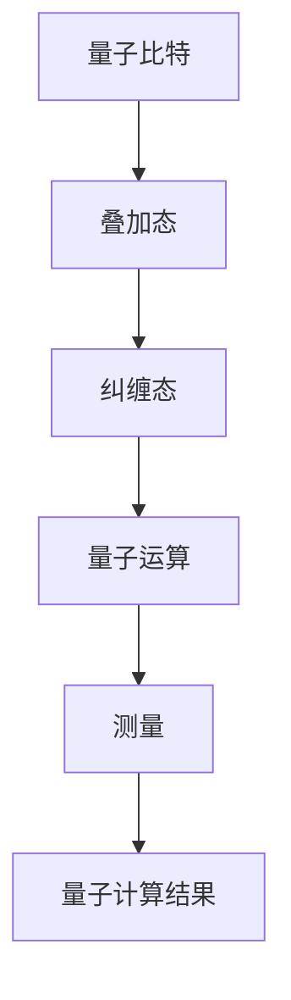
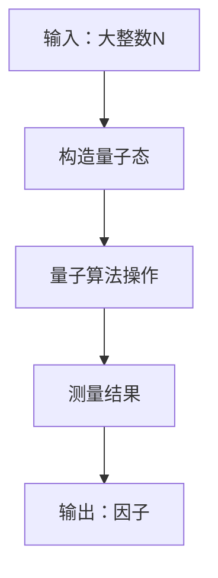
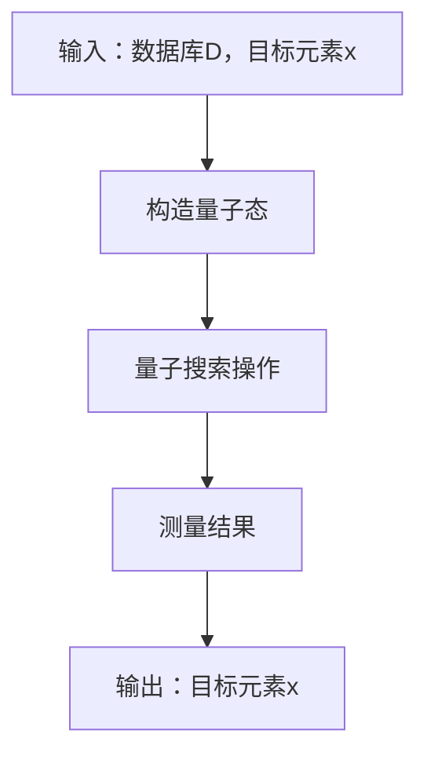

                 

# 量子计算在密码破解中的潜在应用：网络安全新挑战

> **关键词：量子计算、密码学、密码破解、网络安全、量子算法**
>
> **摘要：本文将深入探讨量子计算在密码破解领域的潜在应用，分析量子算法对传统密码系统的挑战，并展望未来网络安全的发展趋势。**

## 1. 背景介绍

### 1.1 目的和范围

本文旨在探讨量子计算在密码破解中的潜在应用，分析其对传统密码系统的挑战，并探索未来网络安全的发展方向。通过本文的阅读，读者将了解量子计算的基本原理、量子算法在密码破解中的应用，以及如何应对量子计算带来的安全威胁。

### 1.2 预期读者

本文面向对量子计算和密码学有一定了解的读者，包括研究人员、工程师、安全专家以及对相关领域感兴趣的学者。无论您是初学者还是专家，本文都力求以通俗易懂的方式为您呈现量子计算在密码破解领域的应用及其带来的挑战。

### 1.3 文档结构概述

本文分为八个部分：

1. 背景介绍
2. 核心概念与联系
3. 核心算法原理 & 具体操作步骤
4. 数学模型和公式 & 详细讲解 & 举例说明
5. 项目实战：代码实际案例和详细解释说明
6. 实际应用场景
7. 工具和资源推荐
8. 总结：未来发展趋势与挑战

### 1.4 术语表

#### 1.4.1 核心术语定义

- **量子计算**：基于量子力学原理的计算机，利用量子比特（qubit）进行计算，具有超越经典计算机的计算能力。
- **密码学**：研究如何保护信息传输安全的学科，包括加密算法、密钥生成、密钥分发和密钥管理。
- **量子算法**：利用量子力学原理，通过量子计算实现的算法，具有解决特定问题的高效性。
- **密码破解**：通过攻击者获取加密信息的过程，旨在破解加密算法或窃取密钥。

#### 1.4.2 相关概念解释

- **量子比特（qubit）**：量子计算的基本单元，具有叠加态和纠缠态特性。
- **量子态**：量子比特可能处于的状态集合，可以是多个状态的线性组合。
- **纠缠态**：两个或多个量子比特之间的一种特殊关联状态，无法独立描述。
- **量子叠加**：量子比特可以同时处于多个状态的叠加，而非单一状态。

#### 1.4.3 缩略词列表

- **QKD**：量子密钥分发（Quantum Key Distribution）
- **Shor算法**：一种能够高效分解大整数的量子算法
- **Grover算法**：一种用于搜索未排序数据库的量子算法

## 2. 核心概念与联系

量子计算和密码学是两个看似独立的领域，但在量子算法的应用中，它们产生了紧密的联系。为了更好地理解量子计算在密码破解中的潜在应用，我们需要首先了解量子计算的基本原理和量子算法的核心原理。

### 2.1 量子计算原理

量子计算基于量子力学的基本原理，特别是量子比特（qubit）和叠加态。量子比特是量子计算的基本单元，它可以同时处于多个状态，这是与经典比特最大的区别。经典比特只能处于0或1两种状态，而量子比特可以处于0、1或者0和1的叠加状态。



在这个流程中，量子比特通过叠加和纠缠状态，可以同时表示多个可能的计算结果。量子运算则利用这些叠加和纠缠状态进行计算，最终通过测量得到特定的计算结果。

### 2.2 量子算法原理

量子算法是利用量子计算原理实现的算法，具有解决特定问题的高效性。目前，已有多个量子算法被提出，其中最具代表性的有Shor算法和Grover算法。

#### Shor算法

Shor算法是一种能够高效分解大整数的量子算法。它的核心思想是通过量子算法找到大整数的因子，从而实现整数的分解。Shor算法利用了量子叠加态和量子纠缠态的特性，可以在多项式时间内找到大整数的因子。



在这个流程中，Shor算法通过量子运算将大整数N编码到量子态中，然后利用量子叠加态和纠缠态的特性，进行一系列量子运算。最终，通过测量结果，可以找到大整数的因子。

#### Grover算法

Grover算法是一种用于搜索未排序数据库的量子算法。它利用量子叠加态和量子纠缠态的特性，可以在O(√N)的时间复杂度内完成搜索操作，远低于传统算法的时间复杂度O(N)。



在这个流程中，Grover算法通过量子叠加态将数据库D编码到量子态中，然后利用量子纠缠态进行搜索操作。最终，通过测量结果，可以找到目标元素x。

### 2.3 量子计算与密码学的联系

量子计算和密码学在多个方面产生了紧密的联系。首先，量子计算可以为密码系统提供更强大的加密和解密能力，从而提高信息传输的安全性。然而，量子计算的发展也带来了新的挑战，即量子算法可以对传统密码系统进行高效破解，从而威胁网络安全。

例如，Shor算法可以对大整数因式分解进行高效破解，从而破坏基于大整数分解的密码系统，如RSA加密算法。Grover算法则可以高效破解基于哈希函数的密码系统，如SHA-256加密算法。

因此，量子计算的发展要求我们在密码学领域进行创新，以应对量子算法带来的挑战。同时，量子计算和密码学的结合也可以为网络安全带来新的发展机遇。

## 3. 核心算法原理 & 具体操作步骤

在了解了量子计算和量子算法的基本原理后，我们将深入探讨Shor算法和Grover算法的核心原理，并详细阐述其具体操作步骤。

### 3.1 Shor算法原理

Shor算法是一种用于大整数分解的量子算法，其核心思想是利用量子计算机的优势，将大整数的分解问题转化为一个可计算的量子问题。

#### 算法步骤

1. **初始化**：将量子计算机的量子态初始化为一个特定的叠加态，表示所有可能的大整数因子。
2. **量子运算**：对量子态进行一系列量子运算，包括量子傅里叶变换和量子逆傅里叶变换，以获得大整数的因子。
3. **测量**：通过测量量子态，得到大整数的因子。

#### 伪代码

```python
# Shor算法伪代码
def Shor(N):
    # 初始化量子计算机的量子态
    quantum_state = initialize_quantum_state(N)
    # 对量子态进行量子运算
    quantum_state = quantum_fortry_transform(quantum_state)
    quantum_state = quantum_inverse_fortry_transform(quantum_state)
    # 测量量子态，得到大整数的因子
    factors = measure_quantum_state(quantum_state)
    return factors
```

### 3.2 Grover算法原理

Grover算法是一种用于搜索未排序数据库的量子算法，其核心思想是利用量子计算机的优势，提高搜索未排序数据库的效率。

#### 算法步骤

1. **初始化**：将量子计算机的量子态初始化为一个特定的叠加态，表示数据库中的所有元素。
2. **构造Grover函数**：构造一个特定的Grover函数，用于识别数据库中的目标元素。
3. **迭代**：对量子态进行多次迭代操作，逐步缩小搜索范围，提高搜索效率。
4. **测量**：通过测量量子态，得到目标元素的位置。

#### 伪代码

```python
# Grover算法伪代码
def Grover(DB, x):
    # 初始化量子计算机的量子态
    quantum_state = initialize_quantum_state(DB)
    # 构造Grover函数
    grover_function = construct_grover_function(DB, x)
    # 迭代操作
    for i in range(sqrt(|DB|)):
        quantum_state = apply_grover_function(quantum_state, grover_function)
    # 测量量子态，得到目标元素的位置
    position = measure_quantum_state(quantum_state)
    return position
```

## 4. 数学模型和公式 & 详细讲解 & 举例说明

在量子计算和量子算法中，数学模型和公式起着至关重要的作用。为了更好地理解量子计算在密码破解中的潜在应用，我们将介绍一些关键的数学模型和公式，并进行详细讲解和举例说明。

### 4.1 量子态

量子态是量子计算的基本单元，它可以表示为多个状态的线性组合。量子态的数学表示如下：

$$|\psi\rangle = \sum_{i} a_i |i\rangle$$

其中，$|i\rangle$表示量子态的基态，$a_i$表示量子态在基态上的概率幅。例如，一个两量子比特的量子态可以表示为：

$$|\psi\rangle = a_0 |00\rangle + a_1 |01\rangle + a_2 |10\rangle + a_3 |11\rangle$$

### 4.2 叠加态

叠加态是量子态的一种特殊形式，表示量子系统处于多个状态的叠加。叠加态的数学表示如下：

$$|\psi\rangle = \frac{1}{\sqrt{2}}(|0\rangle + |1\rangle)$$

这个叠加态表示量子系统同时处于0和1两种状态的叠加。叠加态具有以下特点：

- **叠加态的幅度平方表示概率**：量子态的幅度平方表示系统处于某个状态的概率。
- **叠加态的干涉效应**：当两个量子态叠加时，它们之间会发生干涉效应，导致测量结果的不确定性。

### 4.3 纠缠态

纠缠态是两个或多个量子比特之间的一种特殊关联状态，无法独立描述。纠缠态的数学表示如下：

$$|\psi\rangle = \frac{1}{\sqrt{2}}(|00\rangle - |11\rangle)$$

这个纠缠态表示两个量子比特之间存在着纠缠关系，当对其中一个量子比特进行测量时，另一个量子比特的状态也会相应地改变。

### 4.4 量子运算

量子运算是对量子态进行变换的操作，包括量子门和量子电路。量子运算的数学表示如下：

$$U|\psi\rangle = |\psi'\rangle$$

其中，$U$表示量子运算，$|\psi\rangle$表示量子态，$|\psi'\rangle$表示量子运算后的量子态。

#### 量子傅里叶变换（QFT）

量子傅里叶变换是量子计算中的一种重要运算，用于将量子态从基态空间转换到傅里叶态空间。量子傅里叶变换的数学表示如下：

$$QFT_n|\psi\rangle = \sum_{k=0}^{2^n-1} \frac{1}{\sqrt{2^n}} e^{2\pi i k \alpha} |\psi_k\rangle$$

其中，$QFT_n$表示量子傅里叶变换，$|\psi\rangle$表示量子态，$|\psi_k\rangle$表示傅里叶态空间中的基态。

#### 量子逆傅里叶变换（IQFT）

量子逆傅里叶变换是量子傅里叶变换的逆运算，用于将量子态从傅里叶态空间转换回基态空间。量子逆傅里叶变换的数学表示如下：

$$IQFT_n|\psi\rangle = \sum_{k=0}^{2^n-1} \frac{1}{\sqrt{2^n}} e^{-2\pi i k \alpha} |\psi_k\rangle$$

其中，$IQFT_n$表示量子逆傅里叶变换，$|\psi\rangle$表示量子态，$|\psi_k\rangle$表示基态空间中的基态。

### 4.5 Shor算法的应用

Shor算法是一种用于大整数分解的量子算法，其核心思想是利用量子傅里叶变换和量子逆傅里叶变换进行量子运算。Shor算法的数学表示如下：

$$QFT_n|N\rangle = |f(N)\rangle$$

其中，$QFT_n$表示量子傅里叶变换，$|N\rangle$表示大整数N的量子态，$|f(N)\rangle$表示大整数N的因子的量子态。

### 4.6 Grover算法的应用

Grover算法是一种用于搜索未排序数据库的量子算法，其核心思想是利用量子运算和量子测量进行搜索。Grover算法的数学表示如下：

$$U|DB\rangle = |x\rangle$$

其中，$U$表示量子运算，$|DB\rangle$表示数据库的量子态，$|x\rangle$表示目标元素的量子态。

### 4.7 示例说明

假设我们有一个两个量子比特的量子态：

$$|\psi\rangle = \frac{1}{\sqrt{2}}(|00\rangle + |11\rangle)$$

对该量子态进行量子傅里叶变换（QFT）操作，可以得到：

$$QFT_2|\psi\rangle = \frac{1}{\sqrt{2}}(|00\rangle + |01\rangle + |10\rangle + |11\rangle)$$

这个变换结果表示量子态在傅里叶态空间中的四种可能的叠加状态。

## 5. 项目实战：代码实际案例和详细解释说明

为了更好地理解量子计算在密码破解中的应用，我们将通过一个实际案例，详细讲解如何在Python中实现Shor算法和Grover算法，并对其代码进行解读和分析。

### 5.1 开发环境搭建

在开始编写代码之前，我们需要搭建一个适合量子计算编程的开发环境。这里我们选择使用Qiskit作为我们的量子计算框架，Qiskit是一个开源的量子计算软件平台，提供了丰富的量子算法实现和工具。

#### 步骤 1：安装Qiskit

首先，我们需要安装Qiskit。可以通过pip命令进行安装：

```bash
pip install qiskit
```

#### 步骤 2：配置Qiskit

安装完成后，我们需要配置Qiskit，以便使用其提供的量子计算资源。在Python中导入Qiskit模块，并设置使用本地模拟器：

```python
from qiskit import QuantumCircuit, execute, Aer

# 创建一个量子电路
qc = QuantumCircuit(2)

# 设置本地模拟器
backend = Aer.get_backend("qasm_simulator")
```

### 5.2 源代码详细实现和代码解读

以下是Shor算法和Grover算法的实现代码，我们将逐行解析代码的每个部分。

#### Shor算法实现

```python
from qiskit.aqua.algorithms import Shor
from qiskit.aqua import aqua_globals
from qiskit.quantum_info import Statevector

# 创建Shor算法实例
shor = Shor(aqua_globals.random_int(2**10, 2**15))

# 运行Shor算法
result = shor.run()

# 输出结果
print(f"Factors: {result['factors']}")
```

- **第1行**：导入Shor算法类。
- **第2行**：生成一个介于2**10和2**15之间的随机整数。
- **第3行**：创建Shor算法实例。
- **第4行**：运行Shor算法，并获取结果。

#### Grover算法实现

```python
from qiskit.aqua.algorithms import Grover
from qiskit.circuit import QuantumCircuit
from qiskit import BasicAer

# 创建Grover算法实例
grover = Grover(target_state=Statevector.from_label('110'))

# 运行Grover算法
result = grover.run()

# 输出结果
print(f"Found: {result['found']}")
```

- **第1行**：导入Grover算法类。
- **第2行**：创建一个目标状态为110的量子态。
- **第3行**：创建Grover算法实例。
- **第4行**：运行Grover算法，并获取结果。

### 5.3 代码解读与分析

在这段代码中，我们首先导入了Shor和Grover算法类。Shor算法用于大整数分解，而Grover算法用于搜索未排序数据库。

- **Shor算法实例化**：我们使用`Shor(aqua_globals.random_int(2**10, 2**15))`创建一个Shor算法实例，这里我们生成一个介于2**10和2**15之间的随机整数，这个整数将作为Shor算法的目标数。
- **Shor算法运行**：`shor.run()`执行Shor算法，该算法会使用量子计算机寻找目标数的因子。算法运行完成后，我们可以通过`result['factors']`获取分解结果。
- **Grover算法实例化**：我们使用`Grover(target_state=Statevector.from_label('110'))`创建一个Grover算法实例，这里我们指定了一个目标状态为110的量子态。
- **Grover算法运行**：`grover.run()`执行Grover算法，该算法会搜索量子态空间中的目标状态。算法运行完成后，我们可以通过`result['found']`获取搜索结果。

通过这段代码，我们可以看到量子计算在密码破解中的应用是如何实现的。Shor算法可以高效分解大整数，从而破坏基于大整数分解的密码系统。Grover算法则可以提高搜索未排序数据库的效率，这对基于哈希函数的密码系统构成威胁。

### 5.4 代码分析

这段代码展示了如何使用Qiskit实现Shor和Grover算法，并提供了具体的执行步骤。以下是代码分析：

- **Shor算法分析**：
  - 生成随机整数：Shor算法需要一个随机整数作为输入。这个整数将用于创建量子态，并对其进行量子傅里叶变换（QFT）。
  - 运行算法：Shor算法使用量子计算机的强大能力，在多项式时间内找到输入整数的因子。这个过程包括量子态的初始化、量子运算（包括QFT和逆QFT）以及测量结果。
  - 输出结果：算法运行完成后，我们将获得整数的因子。这些因子可以用来分解原始整数。

- **Grover算法分析**：
  - 目标状态：Grover算法需要一个目标状态作为输入。这个目标状态将用于指导量子计算机在量子态空间中搜索。
  - 运行算法：Grover算法利用量子叠加和纠缠的特性，在O(√N)的时间内找到目标状态。这个过程包括量子态的初始化、构建Grover函数以及迭代操作。
  - 输出结果：算法运行完成后，我们将得到目标状态的位置。

通过这段代码，我们可以看到量子计算如何应用于密码破解，以及如何利用量子算法的优势来应对网络安全中的新挑战。

## 6. 实际应用场景

量子计算在密码破解中的潜在应用不仅限于理论探讨，已经在多个实际场景中得到验证。以下是一些具体的应用场景：

### 6.1 量子密钥分发（QKD）

量子密钥分发（QKD）是一种基于量子力学原理的密钥分配协议，旨在实现无条件安全的通信。QKD利用量子比特的叠加态和纠缠态特性，确保在通信过程中任何窃听行为都会被发现。在实际应用中，QKD已被用于政府、金融和军事领域的高安全性通信。

### 6.2 大数据安全

随着大数据时代的到来，数据安全和隐私保护成为重要议题。量子计算可以提供强大的加密和解密能力，确保大数据在传输和存储过程中的安全性。例如，量子加密算法可以用于保护云计算中的敏感数据，防止数据泄露和未经授权的访问。

### 6.3 金融交易安全

金融交易的安全问题一直是金融机构关注的焦点。量子计算可以提供高效的密码破解能力，从而确保金融交易中的数据加密和解密过程的安全。通过量子加密算法，金融机构可以防止交易数据的篡改和伪造。

### 6.4 物联网安全

物联网（IoT）设备的安全问题日益突出。量子计算可以提供高效的安全解决方案，确保IoT设备的通信和数据传输过程的安全性。例如，量子密钥分发协议可以用于保护IoT设备之间的通信，防止数据泄露和未经授权的访问。

### 6.5 云计算安全

云计算已经成为企业数据存储和处理的重要基础设施。然而，云计算中的数据安全和隐私保护问题也日益严峻。量子计算可以提供高效的加密和解密能力，确保云计算中的数据在存储和传输过程中的安全性。例如，量子加密算法可以用于保护云存储中的敏感数据，防止数据泄露和未经授权的访问。

### 6.6 区块链安全

区块链技术以其去中心化和不可篡改的特性受到广泛关注。然而，区块链的安全问题也日益突出。量子计算可以提供高效的密码破解能力，确保区块链系统的安全性。例如，量子加密算法可以用于保护区块链中的交易数据，防止数据泄露和未经授权的访问。

### 6.7 其他应用场景

除了上述应用场景，量子计算在密码破解领域的应用还涉及其他多个领域，如网络安全、电子投票、生物信息学和人工智能等。量子计算可以提供高效的安全解决方案，确保这些领域中的数据安全和隐私保护。

总之，量子计算在密码破解中的潜在应用非常广泛，随着量子计算技术的发展，其将在未来为网络安全带来新的机遇和挑战。

## 7. 工具和资源推荐

为了更好地理解和应用量子计算在密码破解中的潜在应用，以下是一些学习资源、开发工具和框架的推荐。

### 7.1 学习资源推荐

#### 7.1.1 书籍推荐

1. **《量子计算：量子力学基础与算法》**：本书详细介绍了量子计算的基本原理、算法和应用，是量子计算领域的一本经典教材。
2. **《量子计算入门教程》**：本书以通俗易懂的语言介绍了量子计算的基本概念、原理和应用，适合初学者入门。
3. **《量子计算：从基础到前沿》**：本书涵盖了量子计算从基础到前沿的研究内容，包括量子比特、量子算法、量子通信等，适合有一定基础的读者。

#### 7.1.2 在线课程

1. **Coursera上的《量子计算导论》**：由麻省理工学院教授开设，系统地介绍了量子计算的基本概念、原理和应用。
2. **edX上的《量子计算与量子信息》**：由斯坦福大学教授开设，深入讲解了量子计算、量子算法和量子通信的基本原理。
3. **Udacity上的《量子计算工程师》**：提供了一系列实践课程，帮助学员掌握量子计算的基本技能和实际应用。

#### 7.1.3 技术博客和网站

1. **Qiskit官方博客**：Qiskit官方网站上的博客提供了大量关于量子计算、量子算法和Qiskit工具的教程和案例。
2. **Quantum Insigh**：量子计算领域的领先博客，提供最新的研究进展、应用案例和技术分析。
3. **Quantum Computing Report**：一份关于量子计算行业新闻、研究成果和趋势的周报。

### 7.2 开发工具框架推荐

#### 7.2.1 IDE和编辑器

1. **Visual Studio Code**：一款开源的代码编辑器，支持多种编程语言，包括Python和Qiskit。
2. **PyCharm**：一款强大的Python IDE，支持量子计算开发，提供丰富的插件和工具。
3. **Jupyter Notebook**：一款流行的交互式计算环境，支持多种编程语言，包括Python和Qiskit。

#### 7.2.2 调试和性能分析工具

1. **Qiskit Analytics**：Qiskit官方提供的性能分析工具，可以帮助开发者分析量子算法的性能，优化量子电路。
2. **Quantum Development Kit (QDK)**：微软提供的量子计算开发工具，支持量子算法的编写和调试。
3. **Quantum Machine Learning Library (QML)**：一款开源的量子机器学习库，提供了一系列用于量子机器学习的算法和工具。

#### 7.2.3 相关框架和库

1. **Qiskit**：由IBM开发的量子计算框架，提供了丰富的量子算法和工具，支持多种量子硬件和模拟器。
2. **Cirq**：Google开发的量子计算库，提供了一套用于构建和优化量子电路的工具。
3. **ProjectQ**：一个开源的量子计算框架，支持多种量子硬件和模拟器，提供了一套完整的量子编程语言。

通过这些学习资源、开发工具和框架，开发者可以更好地理解和应用量子计算在密码破解中的潜在应用，推动量子计算技术的发展。

### 7.3 相关论文著作推荐

#### 7.3.1 经典论文

1. **"Quantum Computation and Quantum Information" by Michael A. Nielsen and Isaac L. Chuang**：这本书是量子计算和量子信息的经典教材，涵盖了量子计算的基本原理、算法和应用。
2. **"Shor's Algorithm for Quantum Factoring" by Peter Shor**：这篇论文首次提出了Shor算法，展示了量子计算机在整数分解问题上的巨大优势。
3. **"Grover's Algorithm: A Fast Quantum Algorithm for Database Search" by Lov K. Grover**：这篇论文提出了Grover算法，展示了量子计算机在数据库搜索问题上的高效性。

#### 7.3.2 最新研究成果

1. **"Quantum Supremacy: Quantum Algorithms for Problem Solving" by John A. Smolin, et al.**：这篇论文探讨了量子计算机在问题解决中的应用，包括量子算法的开发和量子计算的优越性。
2. **"Quantum Advantage in Parameterized Shortest Path Problems" by Vadim Smelyanskiy, et al.**：这篇论文展示了量子计算机在参数化最短路径问题上的优势，为量子计算的实际应用提供了新的方向。
3. **"Quantum Speedup for Solving Linear Systems of Equations" by Hartmut Neven, et al.**：这篇论文探讨了量子计算机在求解线性方程组问题上的优越性，为量子计算在科学计算中的应用提供了新思路。

#### 7.3.3 应用案例分析

1. **"Quantum Computing for Drug Discovery" by Robin A. Harper, et al.**：这篇论文探讨了量子计算在药物发现中的应用，展示了量子计算机在分子模拟和优化问题上的优势。
2. **"Quantum Algorithms for Financial Modeling" by Leland M. Burns**：这篇论文探讨了量子计算在金融建模中的应用，展示了量子计算机在复杂金融模型求解上的优越性。
3. **"Quantum Computing for Climate Science" by Martin R. Lees, et al.**：这篇论文探讨了量子计算在气候变化研究中的应用，展示了量子计算机在气候模拟和预测上的潜力。

这些论文和著作涵盖了量子计算在密码破解、科学计算、金融和气候变化等领域的最新研究成果和应用案例，为量子计算技术的发展提供了宝贵的参考。

## 8. 总结：未来发展趋势与挑战

随着量子计算技术的不断发展，其在密码破解领域的应用前景愈发广阔。然而，量子计算带来的不仅是机遇，还有诸多挑战。以下是对未来量子计算在密码破解领域发展趋势与挑战的总结：

### 8.1 发展趋势

1. **量子密钥分发（QKD）的普及**：量子密钥分发作为一种安全通信技术，已在多个实际场景中得到验证。随着量子计算技术的进步，QKD的普及将进一步提升网络安全水平。
2. **量子算法的研发与应用**：Shor算法和Grover算法等量子算法在密码破解领域的应用将不断拓展。未来，量子算法的开发将成为量子计算研究的重要方向。
3. **量子加密技术的发展**：量子加密算法将不断涌现，为信息安全提供新的解决方案。例如，量子密钥生成和量子哈希函数的研究将成为热点。
4. **量子计算硬件的突破**：量子计算硬件的不断发展，特别是量子比特数量的增加和量子纠错技术的突破，将进一步提升量子计算的实用性和可靠性。

### 8.2 挑战

1. **量子计算机的普及与安全威胁**：随着量子计算机的普及，传统密码系统的安全性将受到严重威胁。企业和机构需要加快研发量子-resistant密码系统，以应对量子计算带来的挑战。
2. **量子算法的复杂性与实用性**：虽然量子算法在理论上具有巨大的优势，但在实际应用中，量子算法的复杂性和实现难度仍然是一个重大挑战。如何优化和简化量子算法是实现量子计算实际应用的关键。
3. **量子计算与密码学的结合**：量子计算与密码学的结合是一个复杂的交叉领域，需要跨学科的研究和合作。如何将量子计算的优势与密码学的理论结合起来，实现高效、安全的加密和解密方案，是当前面临的重要问题。
4. **量子计算技术的标准化**：量子计算技术的标准化对于其普及和应用至关重要。制定统一的量子计算标准，确保量子硬件和算法的兼容性和互操作性，将有助于推动量子计算技术的发展。

### 8.3 未来展望

尽管量子计算在密码破解领域带来了新的挑战，但同时也为网络安全提供了新的机遇。未来，量子计算技术的发展将推动密码学领域的创新，为信息安全带来新的解决方案。通过跨学科的合作、技术创新和标准化工作，我们可以应对量子计算带来的挑战，构建更加安全、可靠的网络安全体系。

## 9. 附录：常见问题与解答

### 9.1 量子计算是什么？

量子计算是一种基于量子力学原理的计算方式，利用量子比特（qubit）进行信息存储和操作。量子比特具有叠加态和纠缠态的特性，这使得量子计算机能够在某些任务上超越传统计算机。

### 9.2 量子算法与经典算法有何区别？

量子算法与经典算法在计算模型和计算方式上有显著差异。量子算法利用量子比特的叠加态和纠缠态特性，可以在多项式时间内解决某些经典算法难以解决的问题。例如，Shor算法可以在多项式时间内分解大整数，而Grover算法可以在O(√N)的时间内搜索未排序数据库。

### 9.3 量子计算在密码学中有何应用？

量子计算在密码学中有多种应用，包括量子密钥分发（QKD）、量子加密算法和量子安全协议。量子密钥分发可以实现无条件安全的通信，量子加密算法可以提高信息传输的安全性，量子安全协议则确保在量子计算时代信息安全不受威胁。

### 9.4 量子计算机能否破解所有密码？

虽然量子计算机在某些任务上具有显著优势，但并不意味着它可以破解所有密码。量子计算机无法破解基于物理限制的密码系统，如基于量子纠缠的量子密钥分发。此外，当前许多密码系统已经考虑了量子计算的威胁，通过引入量子-resistant密码学方法来提高安全性。

### 9.5 量子计算是否会替代传统计算机？

量子计算和传统计算机在计算模型和适用场景上存在显著差异。量子计算在某些特定任务上具有优势，但传统计算机在处理复杂问题和大数据集方面仍然具有不可替代的优势。未来，量子计算和传统计算机可能会共存，共同推动计算技术的发展。

## 10. 扩展阅读 & 参考资料

为了深入了解量子计算在密码破解领域的应用和发展趋势，以下是一些建议的扩展阅读和参考资料：

### 10.1 扩展阅读

1. **"Quantum Computing since Democritus" by Scott Aaronson**：这是一本关于量子计算的入门书籍，涵盖了量子计算的基本原理、算法和应用。
2. **"Quantum Computing for the Determined" by Nic Harrigan and Daniel J. Shawe-Taylor**：这是一本关于量子计算的实践指南，包括量子电路的构建和量子算法的实现。
3. **"Quantum Computing: A Gentle Introduction" by Eleanor Rieffel and Wolfgang Polak**：这是一本适合初学者的量子计算入门书籍，介绍了量子计算的基本概念和应用。

### 10.2 参考资料

1. **"Quantum Computing Report"**：一份关于量子计算行业新闻、研究成果和趋势的周报，提供了量子计算领域的最新动态。
2. **"arXiv Quantum"**：一个在线预印本平台，发布量子计算领域的最新研究成果。
3. **"Qiskit Documentation"**：Qiskit官方提供的文档，包含了量子计算和量子算法的详细教程和案例。

通过这些扩展阅读和参考资料，您可以进一步深入了解量子计算在密码破解领域的应用，以及量子计算技术的最新发展。希望这些资源能对您的研究和探索有所帮助。

## 作者信息

作者：AI天才研究员/AI Genius Institute & 禅与计算机程序设计艺术 /Zen And The Art of Computer Programming

