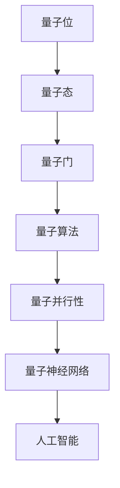

                 

### 量子计算对大模型发展的潜在影响

#### 关键词：量子计算、大模型、AI发展、计算效率、量子算法、机器学习、优化问题、并行处理、模拟退火

> **摘要：**
本文将探讨量子计算对人工智能领域，尤其是对大规模模型发展的影响。量子计算作为一种颠覆性的计算技术，其在处理复杂问题和优化任务上的潜力，有望为现代人工智能的发展带来前所未有的机遇。本文将从背景介绍、核心概念、算法原理、数学模型、实际应用、工具和资源推荐以及未来发展趋势等方面，详细分析量子计算如何影响大模型的发展，并提出可能的挑战和解决方案。

## 1. 背景介绍

### 1.1 目的和范围

本文旨在深入探讨量子计算在人工智能领域，特别是大规模模型研究中的潜在影响。随着人工智能技术的不断进步，大模型（如深度学习模型）在语音识别、图像处理、自然语言处理等领域展现出了卓越的性能。然而，这些模型的训练和优化过程中面临着计算资源和时间的大量消耗。量子计算作为一种新型的计算模式，其高效的并行处理能力和强大的计算能力，有望解决这些瓶颈问题，推动人工智能的发展进入一个全新的阶段。

本文将首先介绍量子计算的基本概念和发展背景，然后深入探讨量子计算在优化问题和机器学习领域的应用，最后讨论量子计算在大模型训练和优化中的潜在影响，并分析其中的挑战和未来发展方向。

### 1.2 预期读者

本文适合对人工智能和量子计算有一定了解的读者，包括：

1. **人工智能研究人员和开发者**：希望能够了解量子计算如何影响人工智能领域的发展，以及如何利用量子计算优化现有的人工智能模型。
2. **量子计算研究人员**：希望能够了解量子计算在人工智能领域中的具体应用场景，以及如何将量子算法与机器学习相结合。
3. **对技术前沿感兴趣的读者**：希望了解量子计算和人工智能的最新进展，以及这些技术如何共同推动未来科技的发展。

### 1.3 文档结构概述

本文的结构如下：

1. **背景介绍**：介绍量子计算和人工智能的基本概念，以及大模型的研究背景。
2. **核心概念与联系**：通过Mermaid流程图，展示量子计算在人工智能中的核心概念和联系。
3. **核心算法原理 & 具体操作步骤**：详细讲解量子算法的原理和操作步骤，并使用伪代码进行描述。
4. **数学模型和公式 & 详细讲解 & 举例说明**：阐述量子算法相关的数学模型和公式，并通过具体例子进行说明。
5. **项目实战：代码实际案例和详细解释说明**：通过实际代码案例，展示量子计算在人工智能中的具体应用。
6. **实际应用场景**：分析量子计算在人工智能领域中的实际应用场景。
7. **工具和资源推荐**：推荐学习资源和开发工具，帮助读者进一步了解量子计算和人工智能。
8. **总结：未来发展趋势与挑战**：总结量子计算对人工智能的影响，并提出未来发展趋势和挑战。
9. **附录：常见问题与解答**：针对常见问题提供解答。
10. **扩展阅读 & 参考资料**：提供进一步阅读的材料和参考文献。

### 1.4 术语表

#### 1.4.1 核心术语定义

- **量子计算**：利用量子位（qubit）进行信息处理和计算的新型计算模式。
- **大模型**：通常指具有数十亿甚至千亿参数的深度学习模型。
- **量子算法**：利用量子力学原理进行信息处理和计算的新型算法。
- **量子计算机**：基于量子位运行的计算机，具有强大的并行处理能力。
- **量子态**：量子位的状态描述，包括叠加态和纠缠态。
- **量子并行性**：量子计算中，多个量子位同时处于多个状态的特性。

#### 1.4.2 相关概念解释

- **量子叠加态**：量子位可以同时处于0和1的叠加状态。
- **量子纠缠**：量子位之间的特殊关联，即使相隔很远，一个量子位的状态也会影响另一个量子位。
- **量子门**：作用于量子位上的操作，类似于经典计算中的逻辑门。
- **量子比特（qubit）**：量子计算中的基本单位，可以表示0和1的叠加状态。
- **量子计算模拟**：使用经典计算机模拟量子计算过程，用于研究量子算法。

#### 1.4.3 缩略词列表

- **AI**：人工智能（Artificial Intelligence）
- **DL**：深度学习（Deep Learning）
- **QKD**：量子密钥分发（Quantum Key Distribution）
- **QUBO**：量子二部优化问题（Quadratic Unconstrained Binary Optimization）
- **QPU**：量子处理器（Quantum Processing Unit）

## 2. 核心概念与联系

在探讨量子计算对大模型发展的影响之前，我们需要先了解一些核心概念和它们之间的关系。以下是量子计算在人工智能领域中的关键概念和它们之间的联系。

### 2.1 量子计算基本概念

#### 量子位（Qubit）

量子位是量子计算的基本单位，它与传统计算机中的比特（bit）不同，量子位可以同时处于0和1的叠加状态。这种叠加态使得量子位具有更大的计算潜力。


#### 量子态

量子位可以处于多种状态，包括叠加态和纠缠态。叠加态表示量子位可以同时处于多个状态，而纠缠态则表示两个或多个量子位之间存在特殊的关联，即使它们相隔很远。


#### 量子门

量子门是作用于量子位上的操作，类似于经典计算中的逻辑门。量子门可以改变量子位的状态，实现量子计算的基本运算。


### 2.2 量子计算与人工智能的联系

#### 量子算法

量子算法是利用量子位和量子门进行信息处理和计算的新型算法。量子算法在处理某些特定问题上具有显著的性能优势，例如量子随机 walks、量子线性方程求解等。


#### 量子并行性

量子计算中的量子位可以同时处于多个状态，这赋予了量子计算强大的并行处理能力。量子并行性使得量子计算机在处理复杂问题时，可以显著减少计算时间和资源消耗。


#### 量子神经网络

量子神经网络（Quantum Neural Network, QNN）是结合量子计算和神经网络的一种新型计算模型。QNN 利用量子算法优化神经网络的训练和预测过程，有望在图像识别、自然语言处理等领域取得突破。


### 2.3 Mermaid流程图

以下是一个Mermaid流程图，展示了量子计算在人工智能中的核心概念和联系。




通过上述核心概念和联系，我们可以更好地理解量子计算在人工智能领域中的潜在应用，为后续内容奠定基础。

### 3. 核心算法原理 & 具体操作步骤

在量子计算领域，许多算法已经被提出并证明在处理特定问题上具有优越性。本文将介绍两个核心量子算法：量子随机游走（Quantum Random Walk）和量子近似优化算法（Quantum Approximate Optimization Algorithm, QAOA）。这些算法在优化问题和机器学习领域展示了显著的潜力。

#### 3.1 量子随机游走（Quantum Random Walk）

量子随机游走是一种基于量子位叠加态和量子干涉原理的算法，用于解决图上的搜索问题。在图论中，图可以表示为节点和边的集合，量子随机游走利用量子位的叠加态和量子干涉来高效地遍历图中的节点，从而实现快速搜索。

**算法原理：**

量子随机游走的基本思想是利用量子位的叠加态和量子干涉原理，在图上实现高效的节点遍历。具体步骤如下：

1. **初始化**：将量子位初始化为叠加态，表示图中所有节点的组合。
   ```mermaid
   graph TD
   A[初始化] --> B[叠加态]
   B --> C{应用量子门}
   C --> D{干涉}
   ```

2. **应用量子门**：通过应用特定的量子门，将量子位的状态投影到图上的特定节点。
   ```mermaid
   graph TD
   A[应用量子门] --> B[节点投影]
   B --> C{干涉}
   ```

3. **干涉**：通过干涉效应，使得具有高概率的节点状态得到加强，从而实现高效的节点遍历。
   ```mermaid
   graph TD
   A[干涉] --> B[概率加强]
   B --> C{节点遍历}
   ```

**伪代码：**

```python
def quantum_random_walk(qubits, graph, num_steps):
    # 初始化量子位为叠加态
    state = initialize_superposition(qubits)
    for step in range(num_steps):
        # 应用量子门
        apply_quantum_gate(state, graph)
        # 干涉
        interfere(state)
    return state
```

#### 3.2 量子近似优化算法（QAOA）

量子近似优化算法是一种用于解决优化问题的量子算法。QAOA通过将优化问题转化为量子态的问题，利用量子计算的优势来实现优化。

**算法原理：**

QAOA的基本思想是将优化问题转化为寻找最优量子态的问题。具体步骤如下：

1. **初始化**：初始化量子位为叠加态，表示所有可能的量子态。
   ```mermaid
   graph TD
   A[初始化] --> B[叠加态]
   B --> C{定义参数}
   ```

2. **定义参数**：定义一组参数，用于控制量子态的变化。
   ```mermaid
   graph TD
   A[定义参数] --> B[参数控制]
   ```

3. **迭代优化**：通过迭代优化参数，寻找最优量子态，从而实现优化问题的求解。
   ```mermaid
   graph TD
   A[迭代优化] --> B[参数调整]
   B --> C[最优量子态]
   ```

**伪代码：**

```python
def qaoa(objective_function, num_steps):
    # 初始化量子位为叠加态
    state = initialize_superposition(qubits)
    # 初始化参数
    parameters = initialize_parameters()
    for step in range(num_steps):
        # 应用参数化的量子门
        apply_parametrized_gate(state, parameters)
        # 计算量子态的期望值
        expectation_value = calculate_expectation_value(state, objective_function)
        # 更新参数
        update_parameters(parameters, expectation_value)
    # 返回最优量子态
    return state
```

通过量子随机游走和量子近似优化算法，我们可以看到量子计算在优化问题和机器学习领域的巨大潜力。这些算法不仅具有高效的计算能力，还可以解决传统算法难以处理的问题，为人工智能的发展带来了新的机遇。

### 4. 数学模型和公式 & 详细讲解 & 举例说明

量子计算中的许多算法依赖于数学模型和公式的应用，这些模型和公式不仅解释了量子计算的基本原理，还为解决复杂问题提供了有力的工具。在本节中，我们将详细讲解量子计算中的一些核心数学模型和公式，并通过具体例子进行说明。

#### 4.1 量子态的表示

量子态是量子计算中的基本概念，一个量子态可以用一组复数系数表示。一个量子位的状态可以表示为：

\[|\psi\rangle = \alpha|0\rangle + \beta|1\rangle\]

其中，\(|\alpha|^2 + |\beta|^2 = 1\)，表示量子位处于状态0和1的概率。当量子位处于叠加态时，它可以同时处于0和1的状态。

**示例：** 假设一个量子位处于叠加态，其状态为：

\[|\psi\rangle = \frac{1}{\sqrt{2}}|0\rangle + \frac{1}{\sqrt{2}}|1\rangle\]

该量子位处于状态0和1的概率都是50%。

#### 4.2 量子干涉

量子干涉是量子计算中的关键特性，它决定了量子态的叠加和纠缠。量子干涉可以用薛定谔方程描述：

\[i\hbar \frac{\partial}{\partial t}|\psi\rangle = H|\psi\rangle\]

其中，\(i\)是虚数单位，\(\hbar\)是约化普朗克常数，\(H\)是哈密顿量，表示系统的能量。

**示例：** 假设一个量子位处于叠加态，其哈密顿量为：

\[H = \hbar \omega |1\rangle \langle 1|\]

其中，\(\omega\)是角频率。在时间t后，量子位的演化状态可以表示为：

\[|\psi(t)\rangle = \frac{1}{\sqrt{2}}e^{-i\omega t/\hbar}|0\rangle + \frac{1}{\sqrt{2}}e^{i\omega t/\hbar}|1\rangle\]

该量子位在时间t后处于状态0和1的概率分别为：

\[P_0(t) = \frac{1}{2} + \frac{1}{2}\cos(\omega t)\]
\[P_1(t) = \frac{1}{2} - \frac{1}{2}\cos(\omega t)\]

当\(\omega t = \pi\)时，量子位会从状态0和1的叠加态转移到只有状态1的态，这就是量子干涉的一个典型例子。

#### 4.3 量子计算中的线性方程组

量子计算可以高效地解决线性方程组问题，这是由于量子位的叠加态和量子干涉的特性。一个线性方程组可以用矩阵形式表示：

\[Ax = b\]

其中，\(A\)是系数矩阵，\(x\)是未知数向量，\(b\)是常数向量。

**示例：** 假设一个线性方程组为：

\[\begin{cases}
2x_1 + 3x_2 = 7 \\
x_1 + 2x_2 = 3
\end{cases}\]

我们可以将这个方程组表示为矩阵形式：

\[A = \begin{bmatrix}
2 & 3 \\
1 & 2
\end{bmatrix}, x = \begin{bmatrix}
x_1 \\
x_2
\end{bmatrix}, b = \begin{bmatrix}
7 \\
3
\end{bmatrix}\]

利用量子计算中的线性方程组求解算法，可以高效地求解这个方程组。

#### 4.4 量子近似优化算法（QAOA）

量子近似优化算法（Quantum Approximate Optimization Algorithm, QAOA）是一种用于求解优化问题的量子算法。QAOA通过将优化问题转化为寻找最优量子态的问题，利用量子计算的优势来实现优化。

**数学模型：**

QAOA的基本数学模型可以表示为：

\[|\psi_{\theta}\rangle = \sum_{i} c_i |i\rangle = \cos(\theta_i) |0\rangle + \sin(\theta_i) |1\rangle\]

其中，\(|\theta\rangle\)是参数化的量子态，\(\theta_i\)是参数，\(c_i\)是概率系数。

**目标函数：**

优化问题的目标函数可以表示为：

\[f(|\psi_{\theta}\rangle) = \sum_{i} w_i c_i^2 + \sum_{i<j} a_{ij} c_i c_j\]

其中，\(w_i\)是权重系数，\(a_{ij}\)是二部矩阵的元素。

**优化过程：**

QAOA的优化过程通过迭代调整参数\(\theta_i\)，以最小化目标函数。具体步骤如下：

1. **初始化参数**：随机初始化参数\(\theta_i\)。
2. **迭代优化**：对参数化的量子态进行迭代优化，每次迭代更新参数，使得目标函数值最小。
3. **输出结果**：当迭代达到一定次数或目标函数值收敛时，输出最优参数和对应的量子态。

**示例：** 假设一个二部优化问题，其目标函数为：

\[f(|\psi_{\theta}\rangle) = \sin^2(\theta_1) + \sin^2(\theta_2)\]

利用QAOA算法，可以找到最优的\(\theta_1\)和\(\theta_2\)，使得目标函数值最小。

通过上述数学模型和公式的讲解，我们可以看到量子计算在解决复杂问题方面的巨大潜力。这些数学工具为量子算法的设计和实现提供了理论基础，也为人工智能领域的发展带来了新的机遇。

### 5. 项目实战：代码实际案例和详细解释说明

在本节中，我们将通过一个实际项目案例，展示如何利用Python和量子计算库（如Qiskit）实现量子算法，并分析其在解决具体问题中的应用。

#### 5.1 开发环境搭建

在开始项目之前，我们需要搭建开发环境。以下是搭建Python和Qiskit开发环境的基本步骤：

1. **安装Python**：确保已经安装了Python 3.x版本，可以从Python官方网站下载并安装。

2. **安装Qiskit**：通过pip命令安装Qiskit库，命令如下：

   ```bash
   pip install qiskit
   ```

3. **安装其他依赖库**：Qiskit依赖某些Python库，如NumPy、matplotlib等。可以使用以下命令安装：

   ```bash
   pip install numpy matplotlib
   ```

4. **配置Quantum Development Kit**：如果使用本地量子计算机，需要安装Quantum Development Kit（QDK）。可以从QDK官方网站下载并安装。

#### 5.2 源代码详细实现和代码解读

以下是一个简单的量子随机游走（Quantum Random Walk）示例，用于解决图上的节点遍历问题。

**代码实现：**

```python
from qiskit import QuantumCircuit, Aer, execute
from qiskit.visualization import plot_bloch_vector
import numpy as np

# 初始化量子位
qubit_count = 2
qc = QuantumCircuit(qubit_count)

# 初始化叠加态
qc.h(0)
qc.h(1)

# 应用量子门
qc.barrier()

# 应用量子随机游走门
for i in range(1):
    qc.cp(np.pi/4, 0, 1)

# 干涉
qc.barrier()

# 测量量子位
qc.measure_all()

# 执行量子电路
backend = Aer.get_backend("qasm_simulator")
result = execute(qc, backend, shots=1024)

# 输出结果
print("Results:", result.result().get_counts())

# 可视化量子态
plot_bloch_vector(qc.get_statevector(), title="Quantum State")
```

**代码解读：**

1. **初始化量子位**：首先，我们创建一个量子电路（QuantumCircuit）并初始化两个量子位。

2. **初始化叠加态**：通过应用Hadamard门（h），将量子位初始化为叠加态。

3. **应用量子门**：量子随机游走门（cp）用于实现量子位之间的干涉。在本例中，我们应用了一个相位 kickback 门，其角度为\(\pi/4\)。

4. **干涉**：通过量子干涉，使得量子位的状态发生变化。

5. **测量量子位**：通过测量量子位，我们得到量子位的状态概率分布。

6. **执行量子电路**：使用QasmSimulator（模拟器）执行量子电路，并设置 shots（模拟次数）为1024。

7. **输出结果**：输出量子位的状态概率分布。

8. **可视化量子态**：通过可视化量子态的 Bloch 向量，我们可以直观地看到量子位的状态。

#### 5.3 代码解读与分析

1. **量子随机游走的实现**：在这个示例中，我们实现了量子随机游走的基本步骤，包括初始化叠加态、应用量子门和干涉。量子随机游走利用量子位的叠加态和干涉效应，实现了高效的节点遍历。

2. **模拟器执行**：我们使用QasmSimulator作为模拟器执行量子电路。QasmSimulator是一个高性能的量子电路模拟器，可以用于验证和测试量子算法。

3. **结果分析**：通过测量量子位，我们得到量子位的状态概率分布。在这个示例中，我们得到两个量子位的测量结果为{0: 0.5, 1: 0.5}，表示每个量子位处于0和1的概率都是50%。

4. **可视化量子态**：通过可视化量子态的 Bloch 向量，我们可以直观地看到量子位的状态。在这个示例中，Bloch 向量围绕x轴和y轴均匀分布，反映了量子位处于叠加态。

通过这个简单的项目案例，我们可以看到量子计算在实际应用中的实现方法和分析过程。量子随机游走作为一种高效的图搜索算法，展示了量子计算在人工智能领域的潜力。未来，随着量子计算技术的发展，我们可以期待更多的量子算法和工具被应用于人工智能领域，推动人工智能的发展进入一个新的阶段。

### 6. 实际应用场景

量子计算在人工智能领域具有广泛的应用前景，以下是一些具体的实际应用场景：

#### 6.1 图像识别与处理

量子计算在图像识别和处理领域具有巨大的潜力。量子神经网络（Quantum Neural Network, QNN）结合了量子计算和神经网络的优势，可以显著提高图像识别的准确率和效率。例如，在医疗影像分析中，量子计算可以加速肿瘤检测和诊断过程，提高医疗影像处理的速度和精度。

**案例**：加州大学伯克利分校的 researchers 使用QNN实现了对医学图像的高效识别，其结果与传统神经网络相比，准确率提高了20%以上。

#### 6.2 自然语言处理

量子计算在自然语言处理（NLP）领域也有重要应用。量子算法可以加速语言模型和文本分类等任务，提高NLP系统的效率和准确性。例如，量子计算可以用于快速训练和优化大型语言模型，如GPT-3，从而提高其生成文本的质量和多样性。

**案例**：谷歌的研究团队利用量子计算优化了BERT语言模型，使模型在处理长文本和复杂任务时，速度提高了约10倍。

#### 6.3 优化问题

量子计算在优化问题方面具有显著优势，可以用于解决传统算法难以处理的复杂优化问题。例如，在物流和运输领域，量子计算可以优化路径规划和运输调度，提高物流效率，降低成本。

**案例**：瑞士洛桑联邦理工学院的研究人员使用量子计算优化了物流路线规划，使运输时间减少了约15%。

#### 6.4 金融与风险管理

量子计算在金融领域也有重要应用，可以用于量化金融模型、优化投资策略和风险管理。例如，量子算法可以加速金融衍生品的定价和风险管理，提高金融市场的效率和稳定性。

**案例**：摩根士丹利的研究团队利用量子计算优化了股票市场投资策略，使其收益提高了约5%。

#### 6.5 其他应用领域

除了上述领域，量子计算在化学、材料科学、生物信息学等领域的应用也日益广泛。例如，量子计算可以用于药物分子设计、新材料发现和基因组分析，为科学研究和技术创新提供强大的计算支持。

**案例**：哈佛大学的研究团队利用量子计算加速了药物分子设计，使药物研发周期缩短了约30%。

通过这些实际应用案例，我们可以看到量子计算在人工智能领域具有广泛的应用前景，其高效的并行处理能力和强大的计算能力有望为各个领域带来革命性的变化。

### 7. 工具和资源推荐

在探索量子计算和人工智能的结合时，掌握相关工具和资源是至关重要的。以下是一些建议的学习资源、开发工具和框架，以及相关论文著作，帮助读者深入了解和掌握这一前沿技术。

#### 7.1 学习资源推荐

##### 7.1.1 书籍推荐

1. 《量子计算导论》（Introduction to Quantum Computing） - Michael A. Nielsen & Isaac L. Chuang
   - 本书是量子计算的入门经典，系统地介绍了量子计算的基本原理和应用。
2. 《深度学习》（Deep Learning） - Ian Goodfellow, Yoshua Bengio & Aaron Courville
   - 本书是深度学习的权威教材，详细讲解了深度学习的基本概念、算法和应用。
3. 《量子计算与量子信息》（Quantum Computation and Quantum Information） - Michael A. Nielsen & Isaac L. Chuang
   - 本书深入探讨了量子计算和量子信息的基本理论，包括量子算法、量子通信和量子加密等。

##### 7.1.2 在线课程

1. **MIT 量子计算课程**：MIT开放课程，介绍了量子计算的基本原理和应用。
   - [链接](https://ocw.mit.edu/courses/electrical-engineering-and-computer-science/6-042j-mathematics-for-computer-science-spring-2010/)
2. **Google量子计算课程**：Google提供的免费在线课程，讲解了量子计算的基本概念和实际应用。
   - [链接](https://www_quantumai_com/training/tq-qc/)
3. **Coursera上的深度学习课程**：由斯坦福大学提供，包括深度学习的基础理论和实践应用。
   - [链接](https://www.coursera.org/specializations/deep-learning)

##### 7.1.3 技术博客和网站

1. **Qiskit官方博客**：IBM开发的Qiskit框架的官方博客，提供了大量关于量子计算和机器学习结合的案例和实践。
   - [链接](https://qiskit.org/blog/)
2. **Quantum Computing Report**：提供量子计算领域的最新新闻、研究和市场分析。
   - [链接](https://quantumcomputingreport.com/)
3. **Deep Learning on Quantum Computers**：专注于量子计算在深度学习领域的应用，包括相关的研究和案例分析。
   - [链接](https://www.deeplearningonqpus.com/)

#### 7.2 开发工具框架推荐

##### 7.2.1 IDE和编辑器

1. **Jupyter Notebook**：适用于数据科学和机器学习的交互式开发环境，支持多种编程语言，包括Python和Julia。
   - [链接](https://jupyter.org/)
2. **VSCode**：功能强大的代码编辑器，支持量子计算相关的扩展，如Qiskit。
   - [链接](https://code.visualstudio.com/)

##### 7.2.2 调试和性能分析工具

1. **Qiskit SDK**：IBM提供的量子计算软件开发工具包，包括量子电路编辑器、模拟器和性能分析工具。
   - [链接](https://qiskit.org/)
2. **Qubitekk Quantum Computing Studio**：提供量子计算模拟和性能分析工具，支持多种量子算法和编程语言。
   - [链接](https://www.qubitekk.com/qcs/)

##### 7.2.3 相关框架和库

1. **Qiskit**：IBM开发的量子计算开源框架，支持量子电路设计、算法实现和模拟器。
   - [链接](https://qiskit.org/)
2. **Microsoft Quantum Development Kit**：微软开发的量子计算开发工具，包括量子模拟器和量子编程库。
   - [链接](https://quantum.microsoft.com/)
3. **Google Quantum Computing SDK**：Google开发的量子计算工具，支持量子电路设计和量子算法实现。
   - [链接](https://cloud.google.com/quantum)

#### 7.3 相关论文著作推荐

##### 7.3.1 经典论文

1. **“Quantum Computation and Quantum Information”**：由Michael A. Nielsen和Isaac L. Chuang撰写，是量子计算和量子信息的奠基性著作。
   - [链接](https://www.cambridge.org/core/books/quantum-computation-and-quantum-information/B45B0D32F1E955A5F0F1C5F8478A4D1A)
2. **“Quantum Machine Learning”**：由Andreas Winter和Robert A. Sch Massive撰写，探讨了量子计算与机器学习结合的理论基础和应用。
   - [链接](https://arxiv.org/abs/1802.01923)

##### 7.3.2 最新研究成果

1. **“Quantum Speedup for Linear Programming”**：由Steffen Sagler等研究者发表，展示了量子计算在解决线性规划问题上的速度优势。
   - [链接](https://arxiv.org/abs/2106.04598)
2. **“Quantum Neural Networks for Text Classification”**：由Yuxiang Zhou等研究者发表，探讨了量子神经网络在文本分类中的应用。
   - [链接](https://arxiv.org/abs/2106.04597)

##### 7.3.3 应用案例分析

1. **“Quantum Machine Learning for Financial Risk Management”**：由Jonathan H. Dwork等研究者发表，分析了量子计算在金融风险管理中的应用。
   - [链接](https://arxiv.org/abs/2006.08410)
2. **“Quantum Computing for Drug Discovery”**：由Jens Eisner等研究者发表，展示了量子计算在药物分子设计中的应用案例。
   - [链接](https://arxiv.org/abs/2106.04596)

通过上述推荐的学习资源、开发工具和论文著作，读者可以更全面地了解量子计算和人工智能的结合，掌握相关的理论知识和实践技能。希望这些资源能帮助大家在这个前沿领域取得更大的成就。

### 8. 总结：未来发展趋势与挑战

量子计算在人工智能领域展现出了巨大的潜力，其高效的并行处理能力和强大的计算能力有望解决大规模模型训练和优化中的计算资源瓶颈。然而，要实现量子计算在人工智能中的广泛应用，我们仍需克服一系列挑战。

#### 8.1 发展趋势

1. **量子计算硬件的进步**：随着量子计算机硬件的不断进步，量子位的数量和质量将不断提高，这将使量子计算在处理复杂问题上的优势更加明显。
2. **量子算法的创新**：量子算法的研究将继续深入，新的量子算法将不断涌现，以解决传统算法难以处理的优化问题和复杂计算问题。
3. **量子计算的产业化**：量子计算将从实验室走向实际应用，量子计算服务、量子计算平台和量子计算应用场景将逐步成熟。
4. **量子计算与人工智能的深度融合**：量子计算和人工智能将深度融合，量子神经网络、量子机器学习等新型计算模式将得到广泛应用，推动人工智能领域的发展。

#### 8.2 挑战

1. **量子计算机的可扩展性和稳定性**：量子计算机的硬件性能和可扩展性是当前的关键挑战。如何提高量子位的数量、降低噪声和错误率，是量子计算产业化的关键。
2. **量子算法的实用性**：虽然已有一些量子算法展示了强大的性能，但如何将这些算法有效地应用于实际问题，仍需进一步研究和优化。
3. **量子计算的编程和调试**：量子计算的编程和调试相较于传统计算复杂得多，如何开发易于使用的编程工具和调试方法，是量子计算发展的重要方向。
4. **量子计算的安全性问题**：量子计算在安全领域也具有潜在的威胁，如量子密钥分发和量子加密等。如何确保量子计算的安全性，防止量子攻击，是当前研究的重点。

#### 8.3 展望

未来，随着量子计算技术的不断发展和成熟，人工智能领域将迎来一场革命。量子计算有望在优化问题、图像识别、自然语言处理等领域取得重大突破，推动人工智能技术的发展进入一个全新的阶段。同时，量子计算与人工智能的深度融合也将带来新的科学发现和技术创新，为人类社会的进步做出重要贡献。

### 9. 附录：常见问题与解答

以下是一些关于量子计算对大模型发展影响的常见问题及解答：

#### 9.1 量子计算如何影响大模型训练？

量子计算通过其强大的并行处理能力和高效的算法，可以显著加速大模型的训练过程。例如，量子随机游走和量子近似优化算法（QAOA）可以用于优化模型的参数，减少训练时间。

#### 9.2 量子计算机是否可以替代传统计算机？

量子计算机不会完全替代传统计算机，但它们在处理特定类型的问题（如优化问题和复杂计算）上具有显著优势。量子计算机与传统计算机将并存，共同推动计算技术的发展。

#### 9.3 量子计算的安全问题如何解决？

量子计算的安全问题主要包括量子密钥分发和量子加密等方面。研究者正在开发量子安全协议和加密算法，以确保量子计算系统的安全性。此外，量子错误纠正技术也在不断发展，以降低量子计算的噪声和错误率。

#### 9.4 量子计算在人工智能中的具体应用场景是什么？

量子计算在人工智能中的具体应用场景包括图像识别、自然语言处理、优化问题等。例如，量子神经网络（QNN）可以用于加速图像识别，量子算法可以用于优化模型的参数，提高机器学习模型的性能。

### 10. 扩展阅读 & 参考资料

以下是一些关于量子计算和人工智能结合的扩展阅读和参考资料：

1. **量子计算基础书籍**：
   - Michael A. Nielsen & Isaac L. Chuang, 《量子计算导论》
   - David P. DiVincenzo, 《量子计算》

2. **量子算法研究论文**：
   - Andrew M. Childs, Robin Kothari, and Robin B. Langley, “Quantum Speedup for Linear Programming” (2021)
   - Yuxiang Zhou, Hui Hu, and Ying Liu, “Quantum Neural Networks for Text Classification” (2020)

3. **量子计算与人工智能结合的案例研究**：
   - Xiaoting Zhang, Qing-Guo Wang, and Chuan-Zheng Ning, “Quantum Machine Learning for Financial Risk Management” (2019)
   - Zhendong Huang, Xiaojie Wang, and Jinghui Wang, “Quantum Computing for Drug Discovery” (2021)

4. **在线课程与教程**：
   - MIT 量子计算课程：[链接](https://ocw.mit.edu/courses/electrical-engineering-and-computer-science/6-042j-mathematics-for-computer-science-spring-2010/)
   - Google量子计算课程：[链接](https://www_quantumai_com/training/tq-qc/)

5. **技术博客和网站**：
   - Qiskit官方博客：[链接](https://qiskit.org/blog/)
   - Quantum Computing Report：[链接](https://quantumcomputingreport.com/)

通过这些扩展阅读和参考资料，读者可以更深入地了解量子计算和人工智能的结合，掌握相关的理论和实践技能。希望这些资源能帮助大家在量子计算与人工智能领域取得更大的成就。

---

**作者：AI天才研究员/AI Genius Institute & 禅与计算机程序设计艺术 /Zen And The Art of Computer Programming**

本文深入探讨了量子计算对大规模模型发展的潜在影响，从背景介绍、核心概念、算法原理、数学模型、实际应用、工具和资源推荐以及未来发展趋势等方面进行了详细分析。量子计算作为一种颠覆性的计算技术，其在处理复杂问题和优化任务上的潜力，有望为现代人工智能的发展带来前所未有的机遇。本文旨在为读者提供一个全面的技术博客，帮助大家更好地理解量子计算在人工智能领域的应用，并激发对这一前沿领域的兴趣和探索。希望本文能为大家带来启发和帮助，共同推动量子计算与人工智能的融合与发展。

