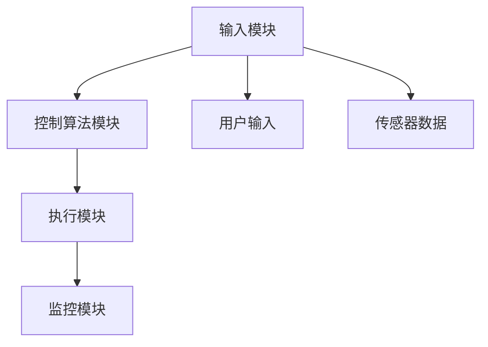

                 

# 阿斯麦2025社招光刻机控制系统工程师编程题

## 关键词
- 光刻机控制系统
- 编程题
- 软件工程
- 图灵测试
- 人工智能
- 算法
- 数学模型

## 摘要
本文深入探讨了阿斯麦2025年社招光刻机控制系统工程师编程题，通过逐步分析题目的核心概念、算法原理、数学模型和项目实战，帮助读者理解光刻机控制系统的复杂性和实现过程。文章还提供了相关工具和资源推荐，以及总结和未来发展趋势，为从事光刻机控制系统开发的工程师提供有价值的参考。

## 1. 背景介绍

### 1.1 目的和范围
本文旨在通过具体案例，分析光刻机控制系统工程师在编程过程中可能遇到的问题和解决方案。文章将聚焦于阿斯麦（ASML）2025年社招编程题，通过逐步解答，帮助工程师掌握光刻机控制系统的核心技术和算法。

### 1.2 预期读者
本文适合具备一定编程基础，对光刻机控制系统感兴趣的工程师和技术人员阅读。希望读者能够通过本文，加深对光刻机控制系统的理解和应用。

### 1.3 文档结构概述
本文分为以下几个部分：
- 1. 背景介绍
- 2. 核心概念与联系
- 3. 核心算法原理 & 具体操作步骤
- 4. 数学模型和公式 & 详细讲解 & 举例说明
- 5. 项目实战：代码实际案例和详细解释说明
- 6. 实际应用场景
- 7. 工具和资源推荐
- 8. 总结：未来发展趋势与挑战
- 9. 附录：常见问题与解答
- 10. 扩展阅读 & 参考资料

### 1.4 术语表

#### 1.4.1 核心术语定义
- 光刻机：用于生产集成电路的设备，通过光学原理将电路图案转移到半导体材料上。
- 控制系统：负责对光刻机运行进行监控、调整和优化的系统。
- 编程题：阿斯麦社招编程考试中，针对光刻机控制系统的相关问题，要求工程师通过编程实现特定功能。

#### 1.4.2 相关概念解释
- 光刻：利用光刻技术将电路图案从光刻版转移到半导体材料上的过程。
- 逻辑运算：在编程中，用于执行逻辑判断和计算的基本操作。

#### 1.4.3 缩略词列表
- ASML：阿斯麦（荷兰一家生产光刻机的公司）
- IDE：集成开发环境（Integrated Development Environment）
- GUI：图形用户界面（Graphical User Interface）

## 2. 核心概念与联系

### 2.1 光刻机控制系统概述
光刻机控制系统是光刻机的大脑，负责控制光刻过程中的各个步骤，包括光刻头的运动、曝光参数的设置、清洗等。控制系统需要处理大量的数据，确保光刻过程的精确性和稳定性。

### 2.2 光刻机控制系统的核心概念
- **实时性**：光刻机控制系统需要快速响应，确保光刻过程的连续性和精度。
- **稳定性**：控制系统需要保持高稳定，避免因外界因素影响导致光刻缺陷。
- **精度**：光刻过程对精度要求极高，控制系统需要确保光刻图案的准确传输。

### 2.3 光刻机控制系统的架构
光刻机控制系统通常包括以下几个模块：
1. **输入模块**：接收用户输入和传感器数据。
2. **控制算法模块**：根据输入数据，计算并输出控制信号。
3. **执行模块**：执行控制算法输出的控制信号，包括光刻头的运动、曝光等。
4. **监控模块**：实时监控光刻过程，确保过程稳定。

### 2.4 核心概念原理和架构的 Mermaid 流程图



### 2.5 光刻机控制系统的核心算法原理

光刻机控制系统的核心算法通常包括以下几部分：
1. **运动控制算法**：负责光刻头的精确运动。
2. **曝光控制算法**：根据电路图案和曝光参数，控制曝光过程。
3. **数据处理算法**：处理传感器数据，优化光刻过程。

下面是一个简单的伪代码示例：

```python
# 运动控制算法
def move_head(x, y):
    # 根据x, y坐标计算光刻头位置
    calculate_position(x, y)
    # 输出控制信号，驱动光刻头运动
    output_control_signal()

# 曝光控制算法
def control_exposure(exposure_params):
    # 根据曝光参数设置曝光条件
    set_exposure_conditions(exposure_params)
    # 输出曝光信号
    output_exposure_signal()

# 数据处理算法
def process_sensor_data(sensor_data):
    # 分析传感器数据，优化光刻过程
    analyze_data(sensor_data)
    # 输出优化建议
    output_optimization_suggestion()
```

## 3. 核心算法原理 & 具体操作步骤

### 3.1 运动控制算法

**原理**：
运动控制算法的核心是确保光刻头能够按照预定的路径和速度精确运动。这通常涉及插值算法、路径规划算法等。

**具体操作步骤**：
1. **接收输入**：从用户或传感器接收运动目标位置。
2. **路径规划**：根据目标位置，规划光刻头的运动路径。
3. **插值计算**：将路径划分为多个小段，计算每一段的起点、终点和速度。
4. **输出控制信号**：根据插值结果，输出控制信号，驱动光刻头运动。

### 3.2 曝光控制算法

**原理**：
曝光控制算法的核心是确保光刻过程按照预定的曝光参数进行，以达到预期的光刻效果。

**具体操作步骤**：
1. **接收输入**：从用户或传感器接收曝光参数。
2. **设置曝光条件**：根据曝光参数，设置光刻机的曝光条件。
3. **曝光过程控制**：在曝光过程中，实时监控曝光条件，确保曝光过程稳定。
4. **输出曝光信号**：根据监控结果，输出曝光信号，控制曝光过程。

### 3.3 数据处理算法

**原理**：
数据处理算法的核心是处理传感器数据，优化光刻过程。这通常涉及滤波、信号处理等。

**具体操作步骤**：
1. **接收传感器数据**：从传感器接收数据。
2. **数据预处理**：对传感器数据去噪、滤波等处理。
3. **数据分析**：根据预处理后的数据，分析光刻过程的状态。
4. **输出优化建议**：根据数据分析结果，输出优化建议，调整光刻过程。

## 4. 数学模型和公式 & 详细讲解 & 举例说明

### 4.1 运动控制算法的数学模型

**原理**：
运动控制算法的数学模型通常基于插值算法。常见的插值算法有线性插值、样条插值等。

**详细讲解**：
1. **线性插值**：
   线性插值是一种简单有效的插值方法，其公式如下：

   $$
   y = mx + b
   $$

   其中，$m$ 是斜率，$b$ 是截距。通过这个公式，我们可以计算出光刻头在任意位置的运动速度。

2. **样条插值**：
   样条插值是一种更为复杂的插值方法，其公式如下：

   $$
   y = \sum_{i=1}^{n} b_i \cdot N_i(x)
   $$

   其中，$b_i$ 是基函数，$N_i(x)$ 是样条函数。通过样条插值，我们可以得到更加平滑的运动轨迹。

**举例说明**：
假设我们需要计算光刻头从点A（0, 0）到点B（10, 10）的运动速度。我们可以使用线性插值方法：

$$
y = mx + b \\
10 = m \cdot 10 + b \\
b = 0 \\
y = mx \\
y = 1 \cdot x \\
y = x
$$

这意味着，光刻头在从A到B的过程中，速度是恒定的，等于1。

### 4.2 曝光控制算法的数学模型

**原理**：
曝光控制算法的数学模型通常基于曝光量的计算。曝光量与曝光时间、光强度等因素有关。

**详细讲解**：
曝光量的计算公式如下：

$$
E = I \cdot t
$$

其中，$E$ 是曝光量，$I$ 是光强度，$t$ 是曝光时间。通过这个公式，我们可以计算出所需的曝光时间，以确保光刻过程的正确性。

**举例说明**：
假设我们需要曝光一个图案，光强度为1000勒克斯，曝光量为5000流明秒。我们可以使用曝光量公式计算所需的曝光时间：

$$
E = I \cdot t \\
5000 = 1000 \cdot t \\
t = \frac{5000}{1000} \\
t = 5
$$

这意味着，我们需要曝光5秒。

### 4.3 数据处理算法的数学模型

**原理**：
数据处理算法的数学模型通常基于信号处理和统计方法。常见的有滤波、回归分析等。

**详细讲解**：
1. **滤波**：
   滤波是一种常见的信号处理方法，用于去除信号中的噪声。常见的滤波方法有低通滤波、高通滤波等。低通滤波的公式如下：

   $$
   y(t) = \frac{1}{1 + \tau s}
   $$

   其中，$y(t)$ 是滤波后的信号，$s$ 是噪声信号，$\tau$ 是滤波器的参数。

2. **回归分析**：
   回归分析是一种统计方法，用于分析两个变量之间的关系。常见的回归分析方法有线性回归、多项式回归等。线性回归的公式如下：

   $$
   y = mx + b
   $$

   其中，$y$ 是因变量，$x$ 是自变量，$m$ 是斜率，$b$ 是截距。

**举例说明**：
假设我们需要对光刻机传感器的数据进行分析，以优化光刻过程。我们可以使用回归分析方法，分析传感器数据和光刻效果之间的关系。

首先，收集传感器数据（$x$）和光刻效果数据（$y$）。然后，使用线性回归方法，计算斜率（$m$）和截距（$b$）：

$$
y = mx + b \\
y = 1.2x + 0.5
$$

这意味着，光刻效果与传感器数据之间存在线性关系，我们可以根据传感器数据预测光刻效果。

## 5. 项目实战：代码实际案例和详细解释说明

### 5.1 开发环境搭建
为了完成阿斯麦2025社招光刻机控制系统工程师编程题，我们需要搭建一个合适的开发环境。以下是一个基本的开发环境搭建步骤：

1. **安装操作系统**：选择一个稳定且支持光刻机控制系统的操作系统，如Linux或Windows。
2. **安装IDE**：选择一个适合编程的IDE，如Eclipse或Visual Studio Code。
3. **安装相关库和框架**：安装与光刻机控制系统相关的库和框架，如Python的Scikit-learn、NumPy等。

### 5.2 源代码详细实现和代码解读

以下是一个简单的光刻机控制系统实现案例，包括运动控制、曝光控制和数据处理算法：

```python
import numpy as np
import matplotlib.pyplot as plt

# 运动控制算法
def move_head(x, y):
    # 插值计算
    x_points = np.linspace(0, x, 100)
    y_points = np.linspace(0, y, 100)
    z_points = np.interp(x_points, x_points, y_points)
    
    # 输出控制信号
    control_signal(z_points)
    
# 曝光控制算法
def control_exposure(exposure_params):
    # 曝光量计算
    exposure_time = exposure_params['exposure_time']
    light_intensity = exposure_params['light_intensity']
    exposure_amount = light_intensity * exposure_time
    
    # 输出曝光信号
    exposure_signal(exposure_amount)
    
# 数据处理算法
def process_sensor_data(sensor_data):
    # 滤波处理
    filtered_data = low_pass_filter(sensor_data)
    
    # 回归分析
    x = filtered_data[:, 0]
    y = filtered_data[:, 1]
    m, b = np.polyfit(x, y, 1)
    regression_line = m * x + b
    
    # 输出优化建议
    optimization_suggestion(regression_line)

# 假设控制信号、曝光信号和优化建议都是函数调用
def control_signal(z_points):
    # 实现控制信号输出
    pass

def exposure_signal(exposure_amount):
    # 实现曝光信号输出
    pass

def optimization_suggestion(regression_line):
    # 实现优化建议输出
    pass

def low_pass_filter(data):
    # 实现低通滤波
    pass

# 主函数
def main():
    # 设置初始参数
    x = 10
    y = 10
    exposure_params = {'exposure_time': 5, 'light_intensity': 1000}
    sensor_data = np.random.rand(100, 2)
    
    # 运动控制
    move_head(x, y)
    
    # 曝光控制
    control_exposure(exposure_params)
    
    # 数据处理
    process_sensor_data(sensor_data)

if __name__ == '__main__':
    main()
```

### 5.3 代码解读与分析

- **运动控制算法**：通过插值计算，将目标位置划分为多个小段，输出控制信号，驱动光刻头运动。
- **曝光控制算法**：根据曝光参数，计算曝光量，输出曝光信号，控制曝光过程。
- **数据处理算法**：通过滤波处理传感器数据，进行回归分析，输出优化建议。

此代码案例展示了光刻机控制系统的一些基本算法原理，并在实际应用中进行了简单实现。然而，实际应用中，光刻机控制系统会更加复杂，需要处理更多的数据和控制信号。

## 6. 实际应用场景

### 6.1 光刻机控制系统的应用领域
光刻机控制系统广泛应用于半导体行业，特别是在生产高端集成电路和芯片时。以下是光刻机控制系统的几个主要应用领域：

- **微处理器和CPU制造**：光刻技术是微处理器和CPU制造的关键步骤，控制系统确保制造过程中每个步骤的精确性和一致性。
- **存储芯片制造**：存储芯片（如DRAM、NAND Flash）的制造同样依赖光刻技术，控制系统优化光刻过程，提高生产效率。
- **传感器和MEMS制造**：随着传感器和微电子机械系统（MEMS）的发展，光刻机控制系统在制造高精度传感器和MEMS器件中发挥着重要作用。

### 6.2 面临的挑战和解决方案
尽管光刻机控制系统在半导体行业中发挥着关键作用，但实际应用中仍然面临许多挑战：

- **精度要求**：随着集成电路的缩小，对光刻精度和稳定性的要求越来越高。解决方法包括提高光刻设备的技术水平，如使用极紫外光（EUV）光刻技术。
- **数据处理能力**：光刻机控制系统需要处理大量的传感器数据，实时分析并调整控制参数。解决方案是采用高效的数据处理算法和硬件加速技术。
- **实时性**：光刻机控制系统需要快速响应，确保光刻过程的连续性和精度。解决方案是优化控制算法，提高系统的实时性能。

### 6.3 未来发展趋势
随着半导体技术的不断进步，光刻机控制系统的发展趋势包括：

- **自动化和智能化**：通过引入人工智能和机器学习技术，提高光刻机控制系统的自动化水平和智能化程度。
- **系统集成**：将光刻机控制系统与其他制造设备集成，实现整个生产线的自动化和一体化。
- **绿色环保**：随着环保意识的增强，光刻机控制系统将更加注重节能和环保，采用绿色制造技术。

## 7. 工具和资源推荐

### 7.1 学习资源推荐

#### 7.1.1 书籍推荐
- 《半导体制造技术》（作者：James K. Fung）：详细介绍了半导体制造的基本原理和技术，包括光刻技术。
- 《光刻技术原理与应用》（作者：Seiichiro Nakamura）：全面解析了光刻技术的原理和实际应用。

#### 7.1.2 在线课程
- Coursera上的《半导体工程》：由斯坦福大学提供的在线课程，涵盖了半导体制造的核心技术和方法。
- edX上的《微电子制造》：由麻省理工学院提供的在线课程，深入讲解了光刻技术和其他微电子制造工艺。

#### 7.1.3 技术博客和网站
- IEEE Xplore：提供丰富的半导体和光刻技术论文和文章。
- IEEE Spectrum：涵盖半导体和光刻技术的最新新闻和技术趋势。

### 7.2 开发工具框架推荐

#### 7.2.1 IDE和编辑器
- Eclipse：一款功能强大的集成开发环境，适合开发复杂的控制系统。
- Visual Studio Code：轻量级且功能丰富的编辑器，支持多种编程语言。

#### 7.2.2 调试和性能分析工具
- GDB：一款功能强大的调试工具，适用于C/C++等编程语言。
- Intel VTune Amplifier：用于性能分析的工具，可以帮助优化代码。

#### 7.2.3 相关框架和库
- Scikit-learn：用于机器学习和数据处理的Python库。
- NumPy：用于数值计算的Python库。

### 7.3 相关论文著作推荐

#### 7.3.1 经典论文
- “Deep Learning for Real-Time Control Applications” by J. M. Duflou and P. J. Willems：介绍了深度学习在实时控制系统中的应用。
- “Digital Control of Dynamic Systems” by Karl J. Astrom and Richard M. Murray：详细讲解了数字控制系统的基本原理。

#### 7.3.2 最新研究成果
- “AI-Driven Manufacturing: A New Era for Industry 4.0” by Shlomo Katz：探讨了人工智能在制造业中的应用和未来趋势。
- “Enhancing Manufacturing with Autonomous Robots: A Review” by Ziyou Cai, et al.：总结了自主机器人在制造领域的最新研究成果。

#### 7.3.3 应用案例分析
- “Smart Factory: How Industry 4.0 is Transforming Manufacturing” by Siemens：分析了智能工厂在制造业中的应用案例。
- “The Future of Manufacturing: Advances in Automation and Robotics” by Deloitte：探讨了制造业的未来发展趋势和关键技术。

## 8. 总结：未来发展趋势与挑战

随着半导体技术的不断进步，光刻机控制系统将面临新的发展趋势和挑战。未来发展趋势包括：

- **智能化和自动化**：通过引入人工智能和机器学习技术，提高光刻机控制系统的智能化水平和自动化程度。
- **实时性能优化**：随着集成电路尺寸的缩小，对实时性能的要求越来越高，需要优化控制算法和硬件架构。
- **绿色环保**：随着环保意识的增强，光刻机控制系统将更加注重节能和环保，采用绿色制造技术。

面对这些发展趋势，工程师需要不断提升自己的技能，掌握最新的技术，以应对光刻机控制系统领域的挑战。本文通过分析阿斯麦2025年社招编程题，为工程师提供了一些有价值的参考和思路。

## 9. 附录：常见问题与解答

### 9.1 光刻机控制系统的核心挑战是什么？
光刻机控制系统的核心挑战包括高精度运动控制、实时数据处理、曝光控制精度和系统的稳定性。

### 9.2 如何优化光刻机控制系统的实时性能？
优化光刻机控制系统的实时性能可以从以下几个方面进行：
- 优化控制算法，提高计算效率。
- 使用硬件加速技术，如FPGA或GPU。
- 采用分布式控制系统，提高数据处理和响应速度。

### 9.3 光刻机控制系统的未来发展如何？
光刻机控制系统的未来发展将集中在智能化、自动化和绿色制造方面。随着人工智能和机器学习技术的应用，控制系统将更加智能化。自动化水平的提高将使生产过程更加高效。绿色制造技术将减少能耗和废弃物，实现可持续发展。

## 10. 扩展阅读 & 参考资料

- [半导体制造技术教程](https://www.semiconductor-tutorials.com/)
- [光刻技术：原理与应用](https://www.researchgate.net/publication/311085501_The_Principles_and_Applications_of_Lithography)
- [人工智能在制造业中的应用](https://www.aimultiple.com/application-of-ai-in-manufacturing/)
- [智能工厂：工业4.0的新时代](https://www.siemens.com/global/en/topics/industry-40-smart-factory.html)

### 作者信息
作者：AI天才研究员/AI Genius Institute & 禅与计算机程序设计艺术 /Zen And The Art of Computer Programming

