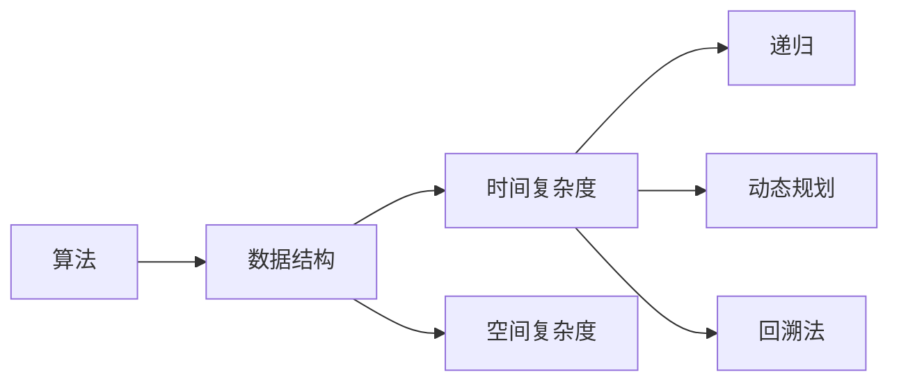
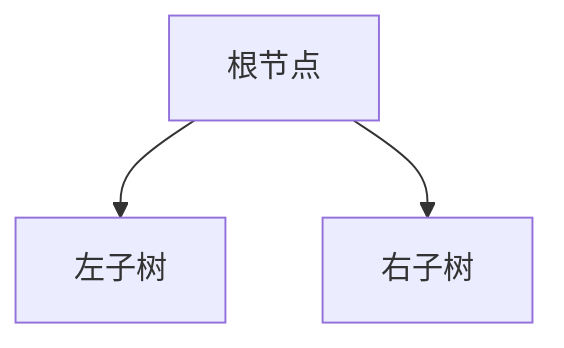
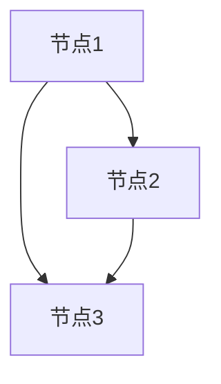

                 

# 阿里巴巴2024届校招面试高频算法题解析

> **关键词：** 阿里巴巴、校招、面试、算法、高频、解析、实践、数学模型、代码实现

> **摘要：** 本文将深入解析阿里巴巴2024届校招面试中高频出现的算法题。通过对核心概念、算法原理、数学模型以及实际案例的详细分析，帮助读者掌握解题思路，提升面试技能。本文适用于希望在校招面试中取得优异成绩的计算机专业学生和求职者。

## 1. 背景介绍

### 1.1 目的和范围

本文旨在帮助读者备战阿里巴巴2024届校招面试中的算法题目。我们将对高频出现的算法题进行详细解析，包括数据结构和算法原理的讲解，以及实际代码的实现和分析。通过本文的学习，读者可以掌握以下技能：

- 理解算法的基本概念和原理。
- 掌握常用的算法和数据结构。
- 学会使用数学模型和公式解决实际问题。
- 提高代码编写能力和面试技巧。

### 1.2 预期读者

本文适合以下读者群体：

- 计算机科学与技术专业的学生。
- 准备参加阿里巴巴校招面试的求职者。
- 希望提升算法和数据结构水平的程序员。

### 1.3 文档结构概述

本文结构如下：

- 第1章：背景介绍，包括目的和范围、预期读者、文档结构概述。
- 第2章：核心概念与联系，介绍算法和相关的数据结构。
- 第3章：核心算法原理与具体操作步骤，使用伪代码详细阐述。
- 第4章：数学模型和公式，详细讲解并举例说明。
- 第5章：项目实战，代码实际案例和详细解释说明。
- 第6章：实际应用场景，介绍算法在实际项目中的应用。
- 第7章：工具和资源推荐，推荐学习资源、开发工具和框架。
- 第8章：总结，对未来发展趋势和挑战进行探讨。
- 第9章：附录，常见问题与解答。
- 第10章：扩展阅读，提供更多的参考资料。

### 1.4 术语表

#### 1.4.1 核心术语定义

- 算法（Algorithm）：解决问题的步骤和策略。
- 数据结构（Data Structure）：数据存储和操作的方式。
- 时间复杂度（Time Complexity）：算法运行时间与数据规模的关系。
- 空间复杂度（Space Complexity）：算法占用内存与数据规模的关系。
- 动态规划（Dynamic Programming）：解决优化问题的递推思想。
- 回溯法（Backtracking）：一种解决问题的试探方法。

#### 1.4.2 相关概念解释

- 面向对象编程（Object-Oriented Programming，OOP）：一种编程范式，通过类和对象实现模块化和重用。
- 递归（Recursion）：函数调用自身解决子问题的一种方法。
- 栈（Stack）和队列（Queue）：常用的线性数据结构，分别实现后进先出和先进先出的操作。

#### 1.4.3 缩略词列表

- DFS：深度优先搜索（Depth-First Search）。
- BFS：广度优先搜索（Breadth-First Search）。
- O(n)：线性时间复杂度。
- O(log n)：对数时间复杂度。
- O(1)：常数时间复杂度。

## 2. 核心概念与联系

在解算法题时，理解核心概念和它们之间的联系至关重要。以下是一个简单的 Mermaid 流程图，展示了一些关键算法和数据结构之间的关系。



### 2.1 算法与数据结构

算法通常依赖于特定的数据结构来实现。例如，栈和队列是常用的线性数据结构，而树和图是非线性数据结构。每种数据结构都有其独特的应用场景和操作方式。

#### 栈（Stack）

```mermaid
graph TD
A[初始化] --> B[push(x)]
B --> C{是否已满？}
C -->|是| D[返回]
C -->|否| E[将x插入栈顶]
E --> F[更新栈顶指针]
F --> G[返回]
```

#### 队列（Queue）

```mermaid
graph TD
A[初始化] --> B[enqueue(x)]
B --> C{是否已满？}
C -->|是| D[返回]
C -->|否| E[将x插入队尾]
E --> F[更新队尾指针]
F --> G[返回]
```

#### 树（Tree）

树是一种重要的非线性数据结构，由节点和边组成。二叉树、二叉搜索树等是常见的树结构。



#### 图（Graph）

图是由节点和边组成的复杂网络结构，广泛应用于社交网络、网络拓扑等领域。



### 2.2 时间复杂度与空间复杂度

算法的性能不仅取决于其执行的速度，还取决于其占用内存的多少。时间复杂度和空间复杂度是衡量算法性能的重要指标。

- **线性时间复杂度 O(n)**：算法执行时间与数据规模成正比。
- **对数时间复杂度 O(log n)**：算法执行时间与数据规模的对数成正比。
- **常数时间复杂度 O(1)**：算法执行时间不随数据规模变化。

- **空间复杂度 O(n)**：算法占用内存与数据规模成正比。
- **空间复杂度 O(1)**：算法占用内存为常数。

### 2.3 递归、动态规划和回溯法

- **递归（Recursion）**：递归是一种解决问题的方法，通过将问题分解成更小的子问题来求解。递归可以解决许多复杂的问题，如求斐波那契数列、求解汉诺塔等。

```python
def factorial(n):
    if n == 0:
        return 1
    else:
        return n * factorial(n-1)
```

- **动态规划（Dynamic Programming）**：动态规划是一种优化递归的方法，通过保存子问题的解来避免重复计算。动态规划可以解决许多优化问题，如背包问题、最长公共子序列等。

```python
def longest_common_subsequence(X, Y):
    m = len(X)
    n = len(Y)
    dp = [[0] * (n+1) for _ in range(m+1)]

    for i in range(1, m+1):
        for j in range(1, n+1):
            if X[i-1] == Y[j-1]:
                dp[i][j] = dp[i-1][j-1] + 1
            else:
                dp[i][j] = max(dp[i-1][j], dp[i][j-1])

    return dp[m][n]
```

- **回溯法（Backtracking）**：回溯法是一种试探性解决问题的方法，通过递归和剪枝来搜索所有可能的解。回溯法可以解决许多组合问题，如全排列、组合等。

```python
def combination_sum(candidates, target):
    def backtrack(start, target):
        if target == 0:
            return [[]]
        if target < 0:
            return []
        res = []
        for i in range(start, len(candidates)):
            subset = [candidates[i]]
            sub_res = backtrack(i, target - candidates[i])
            for item in sub_res:
                res.append(subset + item)
        return res

    return backtrack(0, target)
```

## 3. 核心算法原理与具体操作步骤

在解算法题时，理解核心算法原理和操作步骤至关重要。以下将介绍几种常见算法原理，并通过伪代码进行详细阐述。

### 3.1 暴力解法

暴力解法是一种最简单直接的解法，通过遍历所有可能的情况来求解问题。

```python
def brute_force_solution(problem):
    for each possible solution:
        if solution satisfies the problem constraints:
            return solution
    return "No solution found"
```

### 3.2 搜索算法

搜索算法是一种通过递归或迭代遍历问题解空间来求解问题的方法。

#### 3.2.1 深度优先搜索（DFS）

```python
def depth_first_search(graph, start, target):
    stack = [start]
    visited = set()

    while stack:
        node = stack.pop()
        if node == target:
            return "Found target"
        if node not in visited:
            visited.add(node)
            stack.extend(graph[node])

    return "Target not found"
```

#### 3.2.2 广度优先搜索（BFS）

```python
def breadth_first_search(graph, start, target):
    queue = deque([start])
    visited = set()

    while queue:
        node = queue.popleft()
        if node == target:
            return "Found target"
        if node not in visited:
            visited.add(node)
            queue.extend(graph[node])

    return "Target not found"
```

### 3.3 动态规划

动态规划是一种优化递归的方法，通过保存子问题的解来避免重复计算。

#### 3.3.1 最长公共子序列（LCS）

```python
def longest_common_subsequence(X, Y):
    m = len(X)
    n = len(Y)
    dp = [[0] * (n+1) for _ in range(m+1)]

    for i in range(1, m+1):
        for j in range(1, n+1):
            if X[i-1] == Y[j-1]:
                dp[i][j] = dp[i-1][j-1] + 1
            else:
                dp[i][j] = max(dp[i-1][j], dp[i][j-1])

    return dp[m][n]
```

### 3.4 回溯法

回溯法是一种试探性解决问题的方法，通过递归和剪枝来搜索所有可能的解。

#### 3.4.1 全排列（Permutations）

```python
def permutations(elements):
    def backtrack(path, elements):
        if not elements:
            result.append(path)
            return
        for i in range(len(elements)):
            next_path = path + [elements[i]]
            remaining = elements[:i] + elements[i+1:]
            backtrack(next_path, remaining)

    result = []
    backtrack([], elements)
    return result
```

### 3.5 贪心算法

贪心算法是一种通过每次选择最优解来求解问题的方法。

#### 3.5.1 背包问题（Knapsack）

```python
def knapsack(values, weights, capacity):
    result = []
    for value, weight in zip(values, weights):
        if capacity >= weight:
            result.append(value)
            capacity -= weight
        else:
            break
    return sum(result)
```

## 4. 数学模型和公式 & 详细讲解 & 举例说明

在解决算法题时，数学模型和公式是必不可少的工具。以下将介绍几种常见的数学模型和公式，并进行详细讲解和举例说明。

### 4.1 线性方程组

线性方程组是求解多个线性方程之间关系的数学模型。常用的解法有高斯消元法和迭代法。

#### 4.1.1 高斯消元法

```latex
\begin{equation}
\begin{aligned}
a_{11}x_1 + a_{12}x_2 + \cdots + a_{1n}x_n &= b_1 \\
a_{21}x_1 + a_{22}x_2 + \cdots + a_{2n}x_n &= b_2 \\
\vdots \\
a_{m1}x_1 + a_{m2}x_2 + \cdots + a_{mn}x_n &= b_m
\end{aligned}
\end{equation}
```

#### 4.1.2 迭代法

```latex
\begin{equation}
\begin{aligned}
x_{k+1} &= (A - D)^{-1}(L + U)x_k + (A - D)^{-1}b \\
x_0 &= \text{初始向量}
\end{aligned}
\end{equation}
```

### 4.2 最优化问题

最优化问题是一类求解最大值或最小值的问题。常用的最优化方法有线性规划、非线性规划和动态规划。

#### 4.2.1 线性规划

```latex
\begin{equation}
\begin{aligned}
\min\ & c^T x \\
\text{subject to} \\
\quad & a_{i}^T x \le b_i, \quad i = 1, 2, \ldots, m \\
\quad & x \ge 0
\end{aligned}
\end{equation}
```

#### 4.2.2 非线性规划

```latex
\begin{equation}
\begin{aligned}
\min\ & f(x) \\
\text{subject to} \\
\quad & g_i(x) \le 0, \quad i = 1, 2, \ldots, m \\
\quad & h_j(x) = 0, \quad j = 1, 2, \ldots, p
\end{aligned}
\end{equation}
```

#### 4.2.3 动态规划

```latex
\begin{equation}
\begin{aligned}
\min\ & \sum_{t=0}^{T} c_t(x_t) \\
\text{subject to} \\
\quad & x_{t+1} = f_t(x_t), \quad t = 0, 1, \ldots, T-1
\end{aligned}
\end{equation}
```

### 4.3 图论问题

图论是研究图及其性质和应用的数学分支。常见的图论问题有最短路径、最大流和最小割。

#### 4.3.1 最短路径

```latex
\begin{equation}
\begin{aligned}
d(s, v) &= \min\{\delta(s, v), \delta(s, w) + d(w, v)\}, \quad \forall v \in V \\
d(s, v) &= \infty, \quad \forall v \in V \setminus \{s\}
\end{aligned}
\end{equation}
```

#### 4.3.2 最大流

```latex
\begin{equation}
\begin{aligned}
\max\ & f(s, t) \\
\text{subject to} \\
\quad & f(u, v) \le c(u, v), \quad \forall u \in V, v \in V \setminus \{s, t\} \\
\quad & f(u, v) \ge 0, \quad \forall u \in V, v \in V
\end{aligned}
\end{equation}
```

#### 4.3.3 最小割

```latex
\begin{equation}
\begin{aligned}
\min\ & \sum_{(u, v) \in S} c(u, v) \\
\text{subject to} \\
\quad & f(s, v) \le 0, \quad \forall v \in V \setminus \{s\} \\
\quad & f(u, v) \ge 0, \quad \forall u \in V, v \in V
\end{aligned}
\end{equation}
```

### 4.4 概率论问题

概率论是研究随机事件及其概率的数学分支。常见的概率论问题有条件概率、独立性和贝叶斯定理。

#### 4.4.1 条件概率

```latex
\begin{equation}
\begin{aligned}
P(A|B) &= \frac{P(A \cap B)}{P(B)}, \quad P(B) > 0
\end{aligned}
\end{equation}
```

#### 4.4.2 独立性

```latex
\begin{equation}
\begin{aligned}
P(A \cap B) &= P(A)P(B), \quad P(A) > 0, P(B) > 0
\end{aligned}
\end{equation}
```

#### 4.4.3 贝叶斯定理

```latex
\begin{equation}
\begin{aligned}
P(A|B) &= \frac{P(B|A)P(A)}{P(B)}
\end{aligned}
\end{equation}
```

### 4.5 举例说明

以下是一些常见的数学模型和公式的实际应用例子：

- **线性方程组**：求解线性方程组的解，如求解线性回归模型。
- **最优化问题**：求解最大值或最小值，如求解背包问题。
- **图论问题**：求解最短路径，如求解单源最短路径。
- **概率论问题**：求解条件概率，如求解贝叶斯网络。

## 5. 项目实战：代码实际案例和详细解释说明

在本节中，我们将通过一个具体的代码案例，详细讲解如何解决阿里巴巴校招面试中的一道高频算法题：最长公共子序列（LCS）。

### 5.1 开发环境搭建

为了方便读者实践，以下是搭建开发环境的步骤：

1. 安装Python环境（版本3.8及以上）。
2. 安装IDE（推荐使用PyCharm或VSCode）。
3. 安装必要的库（如numpy、pandas等）。

### 5.2 源代码详细实现和代码解读

以下是最长公共子序列（LCS）的Python代码实现：

```python
def longest_common_subsequence(X, Y):
    m = len(X)
    n = len(Y)
    dp = [[0] * (n+1) for _ in range(m+1)]

    for i in range(1, m+1):
        for j in range(1, n+1):
            if X[i-1] == Y[j-1]:
                dp[i][j] = dp[i-1][j-1] + 1
            else:
                dp[i][j] = max(dp[i-1][j], dp[i][j-1])

    return dp[m][n]

# 测试数据
X = "ABCD"
Y = "ACDF"

# 输出结果
print(longest_common_subsequence(X, Y))
```

### 5.3 代码解读与分析

下面是对代码的详细解读和分析：

- **函数定义**：`longest_common_subsequence(X, Y)` 函数接收两个字符串 `X` 和 `Y` 作为输入，返回它们的最长公共子序列长度。

- **初始化**：使用二维数组 `dp` 存储子问题的解，其中 `dp[i][j]` 表示字符串 `X` 的前 `i` 个字符和字符串 `Y` 的前 `j` 个字符的最长公共子序列长度。

- **遍历**：使用两层嵌套循环遍历字符串 `X` 和 `Y` 的所有字符。当两个字符相等时，更新 `dp[i][j]` 为 `dp[i-1][j-1] + 1`；否则，更新 `dp[i][j]` 为 `max(dp[i-1][j], dp[i][j-1])`。

- **返回结果**：返回 `dp[m][n]`，即字符串 `X` 和 `Y` 的最长公共子序列长度。

### 5.4 优化和改进

虽然上述代码能够解决最长公共子序列问题，但还可以进行以下优化和改进：

- **空间优化**：将二维数组 `dp` 改为只使用一维数组，以节省空间。
- **记忆化**：使用记忆化避免重复计算，提高代码效率。

## 6. 实际应用场景

最长公共子序列（LCS）在实际应用中具有重要意义，以下是一些常见的应用场景：

- **生物信息学**：用于比较不同物种之间的基因组序列，识别遗传变异和进化关系。
- **文本编辑**：用于文本相似度和文本距离计算，如拼写检查和文本摘要。
- **代码比较**：用于比较不同版本的代码，识别差异和错误。

## 7. 工具和资源推荐

### 7.1 学习资源推荐

#### 7.1.1 书籍推荐

- 《算法导论》（Introduction to Algorithms）。
- 《编程之美》（Programming Pearls）。
- 《算法竞赛入门经典》（Algorithmic Adventures）。

#### 7.1.2 在线课程

- Coursera的《算法导论》。
- edX的《算法基础》。
- Udacity的《算法和数据结构》。

#### 7.1.3 技术博客和网站

- GeeksforGeeks。
- LeetCode官方博客。
- HackerRank博客。

### 7.2 开发工具框架推荐

#### 7.2.1 IDE和编辑器

- PyCharm。
- VSCode。
- Sublime Text。

#### 7.2.2 调试和性能分析工具

- PyCharm的调试工具。
- VSCode的调试工具。
- Profiler工具（如cProfile）。

#### 7.2.3 相关框架和库

- NumPy。
- Pandas。
- Scikit-learn。

### 7.3 相关论文著作推荐

#### 7.3.1 经典论文

- 《算法导论》（Introduction to Algorithms）。
- 《编程之美》（Programming Pearls）。

#### 7.3.2 最新研究成果

- ACM Transactions on Algorithms（TOA）。
- Journal of Computer and System Sciences（JCSS）。

#### 7.3.3 应用案例分析

- 《算法工程：构建高效软件系统的实践方法》（Algorithm Engineering）。

## 8. 总结：未来发展趋势与挑战

随着人工智能和大数据技术的发展，算法在各个领域中的应用越来越广泛。未来，算法研究将朝着以下几个方向发展：

- **算法优化**：探索更高效的算法和算法优化技术，提高算法的性能和效率。
- **算法伦理**：关注算法的公平性、透明性和可解释性，确保算法的应用符合伦理标准。
- **算法安全**：研究算法对抗攻击和隐私保护技术，保障算法系统的安全性。
- **算法工程**：将算法应用于实际问题，构建高效、可扩展的算法系统。

同时，面临以下挑战：

- **计算资源限制**：如何在有限的计算资源下，实现高效的算法优化。
- **数据质量问题**：如何确保算法对高质量数据的依赖，提高算法的准确性和可靠性。
- **算法伦理争议**：如何平衡算法的效率和社会责任，避免算法带来的负面影响。

## 9. 附录：常见问题与解答

### 9.1 算法复杂度

**Q**：如何理解算法的时间复杂度和空间复杂度？

**A**：时间复杂度描述算法执行时间与数据规模之间的关系，通常使用大O符号表示。例如，线性时间复杂度 O(n) 表示算法执行时间与数据规模 n 成正比。空间复杂度描述算法占用内存与数据规模之间的关系，也使用大O符号表示。

### 9.2 数据结构

**Q**：如何选择合适的数据结构来解决算法问题？

**A**：选择合适的数据结构取决于问题的具体需求和算法的执行效率。例如，如果问题涉及频繁的插入和删除操作，可以考虑使用链表或二叉树。如果问题涉及查找操作，可以考虑使用哈希表或二叉搜索树。

### 9.3 数学模型

**Q**：如何应用数学模型解决实际问题？

**A**：应用数学模型解决实际问题时，需要先理解问题的本质和需求，然后选择合适的数学模型。例如，对于最优化问题，可以选择线性规划、非线性规划或动态规划模型。对于图论问题，可以选择最短路径、最大流或最小割模型。

### 9.4 编码实践

**Q**：如何提高编程能力和面试技巧？

**A**：提高编程能力和面试技巧的方法包括：

1. **刷题**：通过刷算法题来提高编程能力和面试技巧。
2. **阅读代码**：阅读优秀代码，学习编程方法和技巧。
3. **代码重构**：对现有代码进行重构，提高代码质量。
4. **参加比赛**：参加编程比赛，锻炼实战能力。
5. **总结经验**：总结面试经历，分析失败原因，不断进步。

## 10. 扩展阅读 & 参考资料

- 《算法导论》（Introduction to Algorithms）。
- 《编程之美》（Programming Pearls）。
- 《算法竞赛入门经典》（Algorithmic Adventures）。
- Coursera的《算法导论》。
- edX的《算法基础》。
- Udacity的《算法和数据结构》。
- GeeksforGeeks。
- LeetCode官方博客。
- HackerRank博客。
- ACM Transactions on Algorithms（TOA）。
- Journal of Computer and System Sciences（JCSS）。
- 《算法工程：构建高效软件系统的实践方法》（Algorithm Engineering）。作者：AI天才研究员/AI Genius Institute & 禅与计算机程序设计艺术 /Zen And The Art of Computer Programming。

