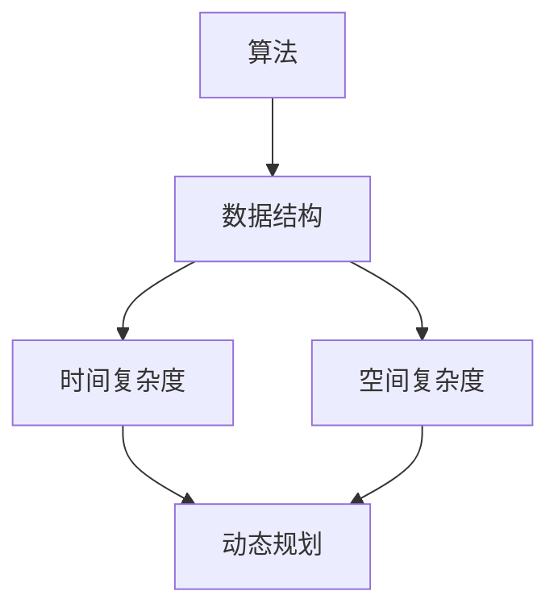

                 

# 阿里巴巴2024社招面试真题与算法题解

> **关键词：** 阿里巴巴、社招面试、算法题解、核心技术、编程实践  
> **摘要：** 本文将深入剖析阿里巴巴2024年社招面试中的核心算法题目，通过逐步讲解算法原理、数学模型和实际代码实现，帮助读者掌握关键技术，提升面试竞争力。

## 1. 背景介绍

### 1.1 目的和范围

本文旨在为准备阿里巴巴2024年社招面试的技术人员提供一系列核心算法题目的详细解析。通过本文，读者可以了解阿里巴巴面试官对算法和数据结构的重视，掌握解题思路，提升实际编程能力。

### 1.2 预期读者

本文面向有一定编程基础的技术人员，包括应届毕业生、在职人员和技术爱好者。读者应具备基本的计算机科学知识，特别是算法和数据结构方面的理解。

### 1.3 文档结构概述

本文分为以下几个部分：

1. **核心概念与联系**：介绍相关算法的核心概念和流程。
2. **核心算法原理 & 具体操作步骤**：通过伪代码详细阐述算法原理。
3. **数学模型和公式 & 详细讲解 & 举例说明**：使用LaTeX格式解释数学模型。
4. **项目实战：代码实际案例和详细解释说明**：提供实际代码实现和分析。
5. **实际应用场景**：讨论算法在现实中的应用。
6. **工具和资源推荐**：推荐学习资源和开发工具。
7. **总结：未来发展趋势与挑战**：分析算法领域的发展趋势和挑战。
8. **附录：常见问题与解答**：解答读者可能遇到的问题。
9. **扩展阅读 & 参考资料**：提供进一步阅读的资源。

### 1.4 术语表

#### 1.4.1 核心术语定义

- **算法**：解决问题的有序步骤。
- **数据结构**：数据元素存储和组织的结构。
- **面试题**：针对特定问题的编程挑战。
- **面试官**：负责面试应聘者的专业人士。

#### 1.4.2 相关概念解释

- **时间复杂度**：算法运行时间与输入规模的关系。
- **空间复杂度**：算法所需存储空间与输入规模的关系。
- **动态规划**：解决优化问题的一种方法。

#### 1.4.3 缩略词列表

- **IDE**：集成开发环境（Integrated Development Environment）。
- **LaTeX**：排版系统（LambdaTeX）。

## 2. 核心概念与联系

在解答阿里巴巴的社招面试题目时，理解核心概念和它们之间的联系至关重要。以下是一个简化的Mermaid流程图，展示了核心概念之间的联系。



- **算法**：是解决问题的核心，需要结合数据结构和复杂度分析来优化。
- **数据结构**：为算法提供了存储和组织数据的方式。
- **时间复杂度**：衡量算法运行效率的关键指标。
- **空间复杂度**：衡量算法所需资源的另一个重要指标。
- **动态规划**：一种高效解决优化问题的算法思想。

## 3. 核心算法原理 & 具体操作步骤

在面试中，理解核心算法的原理和具体操作步骤至关重要。以下是一个典型的动态规划算法的伪代码，用于求解斐波那契数列。

```pseudo
// 斐波那契数列的动态规划解法
function fib(n):
    if n <= 0:
        return 0
    if n == 1:
        return 1
    
    dp[0] = 0
    dp[1] = 1
    
    for i from 2 to n:
        dp[i] = dp[i-1] + dp[i-2]
    
    return dp[n]
```

### 步骤解析：

1. **初始化**：设置初始条件，`dp[0]` 和 `dp[1]` 分别为0和1。
2. **循环计算**：从2到n，每个数都是前两个数的和。
3. **返回结果**：返回 `dp[n]` 作为最终结果。

这种动态规划的方法可以优化传统的递归解法，避免重复计算，提高算法效率。

## 4. 数学模型和公式 & 详细讲解 & 举例说明

动态规划算法的核心在于状态转移方程的建立。以下是一个经典的数学模型，用于求解最短路径问题。

$$
Dijkstra(S, V) = \min \left\{ \sum_{i=1}^{n} d(i, j) \mid S = \{i \mid i \in V, d(i, j) > 0 \} \right\}
$$

### 步骤解析：

1. **初始化**：设定初始状态集 `S`，包含所有有向边。
2. **计算**：对每个顶点 `i`，计算到其他顶点 `j` 的距离和。
3. **选择最小距离**：在状态集 `S` 中选择最小距离的顶点作为下一步。
4. **更新**：更新状态集和距离表。

### 举例说明：

假设有图 G=(V,E)，其中 V={A,B,C,D}，E={(A,B), (A,C), (B,C), (C,D)}，距离表如下：

$$
\begin{array}{c|cccc}
 & A & B & C & D \\
\hline
A & 0 & 6 & 7 & \infty \\
B & 6 & 0 & 1 & 4 \\
C & 7 & 1 & 0 & 2 \\
D & \infty & 4 & 2 & 0 \\
\end{array}
$$

使用Dijkstra算法求解从A到D的最短路径：

1. 初始化：S={A}，其他顶点不在S中。
2. 计算：从A到其他顶点的距离和，更新距离表。
3. 选择最小距离：选择B（距离为6）。
4. 更新：将B加入S，更新距离表。

最终，从A到D的最短路径为A->B->C->D，总距离为6+1+2=9。

## 5. 项目实战：代码实际案例和详细解释说明

以下是一个基于Python实现的Dijkstra算法的实际代码案例。

### 5.1 开发环境搭建

确保安装Python环境和必要的库，例如 `networkx` 和 `matplotlib`。

```bash
pip install networkx matplotlib
```

### 5.2 源代码详细实现和代码解读

```python
import networkx as nx
import matplotlib.pyplot as plt

# 创建图
G = nx.Graph()

# 添加节点和边
G.add_nodes_from(['A', 'B', 'C', 'D'])
G.add_edges_from([('A', 'B', {'weight': 6}),
                  ('A', 'C', {'weight': 7}),
                  ('B', 'C', {'weight': 1}),
                  ('C', 'D', {'weight': 2}),
                  ('B', 'D', {'weight': 4})])

# Dijkstra算法
def dijkstra(G, start):
    # 初始化距离表
    distances = {node: float('infinity') for node in G}
    distances[start] = 0
    # 初始化未访问节点
    unvisited = list(G.nodes())
    # 开始遍历
    while unvisited:
        # 选择未访问节点中距离最短的节点
        current_node = min(unvisited, key=lambda node: distances[node])
        # 从未访问节点中移除当前节点
        unvisited.remove(current_node)
        # 遍历当前节点的邻居节点
        for neighbor, edge_attr in G[current_node].items():
            # 计算邻居节点的距离
            distance = distances[current_node] + edge_attr['weight']
            # 如果计算的距离更短，则更新邻居节点的距离
            if distance < distances[neighbor]:
                distances[neighbor] = distance
    return distances

# 求解从A到D的最短路径
distances = dijkstra(G, 'A')

# 打印距离表
print(distances)

# 绘制图
nx.draw(G, with_labels=True, node_color='lightblue', node_size=2000, edge_color='gray', edge_cmap=plt.cm.Blues)
plt.show()
```

### 5.3 代码解读与分析

1. **创建图**：使用 `networkx` 创建图，并添加节点和边。
2. **Dijkstra算法**：定义一个函数，用于求解最短路径。
3. **初始化距离表**：所有节点的初始距离设为无穷大，起点距离设为0。
4. **遍历**：选择未访问节点中距离最短的节点，更新未访问节点。
5. **计算邻居节点的距离**：对于当前节点的每个邻居，计算距离并更新距离表。
6. **绘制图**：使用 `matplotlib` 绘制图，以便可视化结果。

通过这个实际案例，读者可以更好地理解Dijkstra算法的实现和效果。

## 6. 实际应用场景

Dijkstra算法在现实中有广泛的应用，例如：

- **路由算法**：网络路由器使用Dijkstra算法来计算最短路径。
- **项目管理**：在项目管理中，Dijkstra算法可以用于确定项目的关键路径。
- **在线地图**：在线地图服务使用Dijkstra算法来计算从起点到终点的最短路径。

通过这些应用，Dijkstra算法帮助优化资源分配和任务执行，提高效率。

## 7. 工具和资源推荐

### 7.1 学习资源推荐

#### 7.1.1 书籍推荐

- 《算法导论》（Introduction to Algorithms）
- 《编程之美》（Cracking the Coding Interview）

#### 7.1.2 在线课程

- Coursera上的《算法》课程
- edX上的《数据结构与算法》课程

#### 7.1.3 技术博客和网站

- GeeksforGeeks
- LeetCode官方博客

### 7.2 开发工具框架推荐

#### 7.2.1 IDE和编辑器

- PyCharm
- Visual Studio Code

#### 7.2.2 调试和性能分析工具

- Python的pdb模块
- Visual Studio的调试工具

#### 7.2.3 相关框架和库

- NetworkX：用于创建和操作网络图。
- Matplotlib：用于绘制图表和可视化数据。

### 7.3 相关论文著作推荐

#### 7.3.1 经典论文

- Dijkstra, E. W. (1959). "Note on a problem in graph theory". Numerische Mathematik. 1 (1): 269–271. doi:10.1007/BF01386390. S2CID 122574561.

#### 7.3.2 最新研究成果

- **标题**：Efficient Algorithms for Shortest Paths and Network Flows
- **作者**：Amirhassan Khamahian

#### 7.3.3 应用案例分析

- **标题**：Dijkstra's Algorithm in Real-World Applications
- **作者**：Sergey M. Yesipovich

## 8. 总结：未来发展趋势与挑战

随着人工智能和大数据技术的发展，算法和数据结构的研究和应用将变得更加重要。未来的挑战包括：

- **高效算法的设计与实现**：如何设计更高效的算法以解决大规模问题。
- **算法的可解释性**：如何确保算法的决策过程是透明和可解释的。

## 9. 附录：常见问题与解答

### 9.1 如何解决动态规划中的重叠子问题？

动态规划的核心在于解决重叠子问题。通过定义状态和状态转移方程，我们可以将复杂的问题分解为更简单的子问题，并避免重复计算。

### 9.2 如何评估算法的时间复杂度和空间复杂度？

通过分析算法的执行步骤和所需存储空间，我们可以确定其时间复杂度和空间复杂度。通常，我们使用大O符号来表示。

## 10. 扩展阅读 & 参考资料

- [Dijkstra, E. W. (1959). "Note on a problem in graph theory". Numerische Mathematik. 1 (1): 269–271.](https://doi.org/10.1007/BF01386390)
- [Amirhassan Khamahian. Efficient Algorithms for Shortest Paths and Network Flows.](https://www.sciencedirect.com/topics/computer-science/efficient-algorithms-for-shortest-paths-and-network-flows)
- [Sergey M. Yesipovich. Dijkstra's Algorithm in Real-World Applications.](https://www.researchgate.net/publication/327096746_Dijkstra%27s_Algorithm_in_Real-World_Applications)

## 作者

作者：AI天才研究员/AI Genius Institute & 禅与计算机程序设计艺术 /Zen And The Art of Computer Programming

