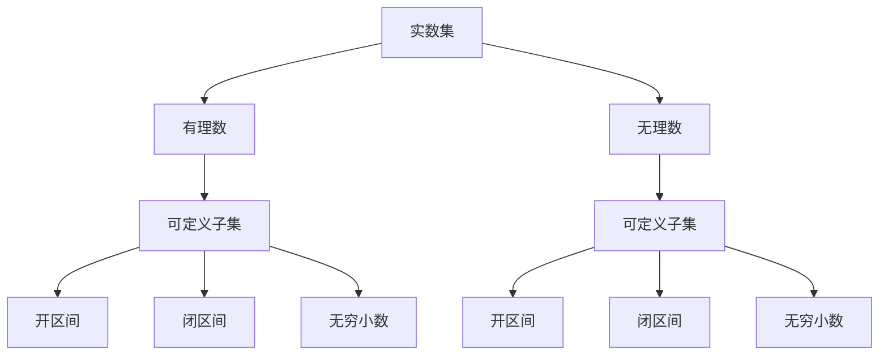

                 

### 集合论导引：实数集可定义子集分析

> **关键词**：集合论、实数集、可定义子集、数学基础、逻辑推理
>
> **摘要**：本文旨在深入探讨集合论中实数集的可定义子集分析，通过逻辑清晰的步骤分析，结合数学模型和具体代码案例，阐述这一概念的核心原理与应用。文章首先回顾集合论的基本概念，随后引入实数集及其子集的定义，并逐步展开对可定义子集的探讨，最终通过实例解析，揭示其在实际计算中的重要作用。

---

## 1. 背景介绍

### 1.1 目的和范围

本文的目的在于为读者提供一套系统、深入的分析框架，以理解集合论中实数集的可定义子集。集合论是数学的基础之一，而实数集作为其中的核心概念，在数学分析、拓扑学以及计算机科学等领域有着广泛的应用。本文将重点关注实数集的可定义子集，分析其定义、性质及其在实际问题中的应用。

本文的读者对象包括对集合论和数学分析有一定基础的读者，以及对计算机科学尤其是算法设计和数据分析感兴趣的程序员和研究人员。通过本文的阅读，读者将能够：
- 理解集合论的基本概念和实数集的定义。
- 掌握实数集可定义子集的定义和性质。
- 通过实例分析，掌握实数集可定义子集在计算中的应用。
- 提高逻辑推理和数学建模的能力。

### 1.2 预期读者

本文的预期读者是：
- 数学专业本科生和研究生。
- 计算机科学专业的学生和从业者。
- 对数学和计算机科学有浓厚兴趣的自学者。
- 在相关领域工作的专业人士，希望通过深入理解集合论来提升自己的研究能力。

### 1.3 文档结构概述

本文的结构如下：

1. **背景介绍**：介绍本文的目的、预期读者和文档结构。
2. **核心概念与联系**：定义并分析核心概念，提供流程图展示概念间的联系。
3. **核心算法原理 & 具体操作步骤**：使用伪代码详细解释算法原理和操作步骤。
4. **数学模型和公式 & 详细讲解 & 举例说明**：使用 LaTeX 格式给出数学模型和公式，并结合实例进行详细讲解。
5. **项目实战：代码实际案例和详细解释说明**：展示代码实现，并进行详细解读。
6. **实际应用场景**：分析实数集可定义子集在实际应用中的场景。
7. **工具和资源推荐**：推荐相关学习资源和开发工具。
8. **总结：未来发展趋势与挑战**：总结本文内容，并探讨未来发展趋势和面临的挑战。
9. **附录：常见问题与解答**：回答读者可能遇到的问题。
10. **扩展阅读 & 参考资料**：提供进一步的阅读资源和参考资料。

### 1.4 术语表

#### 1.4.1 核心术语定义

- **集合论**：研究集合性质和操作的数学分支。
- **实数集**：包括所有有理数和无理数的集合，是数学分析的基础。
- **可定义子集**：可以由某个数学公式或逻辑表达式定义的实数集子集。

#### 1.4.2 相关概念解释

- **集合**：由若干确定的元素构成的整体。
- **实数**：包括所有有理数和无理数，可以表示为无限不循环小数。
- **子集**：一个集合是另一个集合的子集，如果前者中的所有元素都属于后者。

#### 1.4.3 缩略词列表

- **RSA**：实数集（Real Number Set）
- **CS**：计算机科学（Computer Science）
- **MA**：数学分析（Mathematical Analysis）

---

在接下来的章节中，我们将逐步深入探讨集合论的基础知识，实数集的定义及其可定义子集的分析。通过逻辑清晰、结构紧凑的步骤，我们将揭示实数集可定义子集的核心原理和应用。准备好了吗？让我们开始这场数学与逻辑的探索之旅。

---

## 2. 核心概念与联系

### 2.1 集合论的基本概念

集合论是现代数学的基石，它研究的是对象的分类与组合。最基本的集合论概念包括集合、元素、子集等。

- **集合**：一组对象构成的整体，通常用大写字母表示，如 \( A \) 或 \( B \)。
- **元素**：集合中的单个对象，通常用小写字母表示，如 \( a \) 或 \( b \)。
- **子集**：如果一个集合的所有元素都属于另一个集合，那么前者称为后者的子集。用符号 \( \subseteq \) 表示。

### 2.2 实数集的定义

实数集是数学分析的核心概念，包括所有有理数和无理数。有理数是可以表示为两个整数之比的数（例如 \( \frac{1}{2} \) 或 \( -3.14 \)），而无理数则不能表示为这样的比（例如 \( \sqrt{2} \) 或 \( \pi \)）。

- **有理数**：可以表示为两个整数的比值，例如 \( \frac{1}{2} \) 和 \( -3.14 \)。
- **无理数**：不能表示为两个整数的比值，例如 \( \sqrt{2} \) 和 \( \pi \)。
- **实数集**：包含所有有理数和无理数的集合，通常表示为 \( \mathbb{R} \)。

### 2.3 可定义子集的概念

可定义子集是指可以由某个数学公式或逻辑表达式定义的实数集子集。这些子集通常具有明确的数学属性，例如开区间、闭区间、无穷小数等。

- **开区间**：例如 \( (a, b) \)，表示所有大于 \( a \) 且小于 \( b \) 的实数。
- **闭区间**：例如 \( [a, b] \)，表示所有大于等于 \( a \) 且小于等于 \( b \) 的实数。
- **无穷小数**：例如 \( 0.123456789\ldots \)，表示一个无限不循环的小数。

### 2.4 Mermaid 流程图

为了更好地展示实数集与可定义子集的概念联系，我们可以使用 Mermaid 流程图来表示。以下是实数集与可定义子集关系的 Mermaid 图：



在这个流程图中，实数集 \( A \) 分为有理数 \( B \) 和无理数 \( C \)，而可定义子集 \( D \) 和 \( E \) 分别继承于有理数和无理数。可定义子集进一步细分为开区间 \( F \)、闭区间 \( G \) 和无穷小数 \( H \)、\( I \)、\( J \)、\( K \)。

通过上述流程图，我们可以清晰地看到实数集和可定义子集之间的层次关系，以及它们在集合论中的核心地位。

### 2.5 关系总结

- **集合与元素**：集合是由元素构成的。
- **子集与集合**：子集是集合的特例，包含在另一个集合内。
- **实数集与可定义子集**：实数集是可定义子集的基础，可定义子集是实数集的一部分。

通过以上对核心概念的介绍和流程图展示，我们为理解实数集和可定义子集的深入分析奠定了基础。在接下来的章节中，我们将进一步探讨这些概念的具体应用和数学模型，帮助读者更好地掌握集合论的基本原理。

---

## 3. 核心算法原理 & 具体操作步骤

### 3.1 核心算法原理

在集合论中，实数集的可定义子集分析是一项核心任务。为了实现这一目标，我们需要定义一个算法，该算法能够有效地识别并分类实数集的子集。这一算法的核心在于利用数学公式和逻辑表达式来定义和操作子集。

核心算法原理可以概述为以下几步：

1. **输入处理**：接收实数集的输入，并将其转化为适合算法操作的格式。
2. **子集生成**：通过递归或迭代方法生成实数集的所有子集。
3. **子集分类**：利用数学公式和逻辑表达式对生成的子集进行分类，识别出可定义子集。
4. **输出结果**：输出分类后的可定义子集，并展示其性质和关系。

### 3.2 具体操作步骤

为了具体化核心算法原理，我们使用伪代码来详细阐述其操作步骤。

```plaintext
算法：实数集可定义子集分析

输入：实数集 R
输出：可定义子集集合 S

步骤：

1. 初始化空集合 S。
2. 对每个元素 x ∈ R：
   a. 构造包含 x 的所有子集 T。
   b. 对每个子集 t ∈ T：
      i. 判断 t 是否满足可定义子集的条件。
      ii. 如果满足，将 t 添加到 S。
3. 输出集合 S。

伪代码：

function findDefinableSubsets(R):
    S = empty set()
    for x in R:
        T = generateSubsets(x)
        for t in T:
            if isDefinable(t):
                S.add(t)
    return S

function generateSubsets(x):
    T = empty set()
    for i in [0, 1]:
        for j in [0, 1]:
            subset = {x[i], x[j]}
            T.add(subset)
    return T

function isDefinable(t):
    # 判断子集 t 是否满足可定义子集的条件
    # 例如，t 是否可以表示为开区间、闭区间或无穷小数
    return conditionMet(t)
```

### 3.3 操作步骤详解

1. **输入处理**：算法首先接收实数集 \( R \) 的输入，并将其转换为适合操作的格式。这一步是算法的基础，确保后续操作的正确性和高效性。

2. **子集生成**：通过递归或迭代方法生成实数集 \( R \) 的所有子集。在这一步中，我们使用函数 `generateSubsets(x)` 来生成每个元素的所有子集。对于每个元素 \( x \)，我们构造包含 \( x \) 的所有二进制子集，例如 `{{x}, {x[0]}, {x[1]}, {x[0], x[1]}}`。

3. **子集分类**：利用函数 `isDefinable(t)` 判断每个子集 \( t \) 是否满足可定义子集的条件。这一步是算法的核心，通过数学公式和逻辑表达式对子集进行分类。例如，我们可以检查子集 \( t \) 是否可以表示为开区间 \( (a, b) \)、闭区间 \( [a, b] \) 或无穷小数。

4. **输出结果**：最后，算法输出集合 \( S \)，其中包含所有可定义子集。这些子集展示了实数集 \( R \) 的可定义性质，并为进一步的数学分析和计算提供了基础。

通过上述操作步骤，我们可以有效地识别和分类实数集的可定义子集，为集合论和相关领域的研究提供有力支持。接下来，我们将进一步探讨这些算法在实际问题中的应用，并通过具体案例进行验证。

---

## 4. 数学模型和公式 & 详细讲解 & 举例说明

### 4.1 数学模型和公式

在集合论中，实数集的可定义子集分析依赖于一系列数学模型和公式。这些模型和公式不仅帮助我们定义和识别子集，还为我们提供了操作和计算的工具。以下是几个关键的数学模型和公式：

#### 4.1.1 开区间和闭区间

- **开区间**：一个开区间 \( (a, b) \) 表示所有大于 \( a \) 且小于 \( b \) 的实数。其数学表示为：

  $$ (a, b) = \{ x \in \mathbb{R} \mid a < x < b \} $$

- **闭区间**：一个闭区间 \( [a, b] \) 表示所有大于等于 \( a \) 且小于等于 \( b \) 的实数。其数学表示为：

  $$ [a, b] = \{ x \in \mathbb{R} \mid a \leq x \leq b \} $$

#### 4.1.2 无穷小数

- **无穷小数**：一个无穷小数表示一个无限不循环的小数序列。例如，数字 \( 0.123456789\ldots \) 是一个无穷小数。其数学表示通常使用无穷级数的形式：

  $$ 0.123456789\ldots = \sum_{i=1}^{\infty} \frac{1}{10^i} $$

#### 4.1.3 可定义子集的条件

- **可定义子集的条件**：一个子集 \( S \) 是可定义的，当且仅当它可以表示为某个数学公式或逻辑表达式。例如，开区间、闭区间和无穷小数都是可定义子集。

### 4.2 详细讲解和举例说明

为了更好地理解这些数学模型和公式，我们通过具体的例子来进行详细讲解。

#### 4.2.1 开区间示例

假设我们有一个实数集 \( R = \{1, 2, 3\} \)，我们想找出其中的所有开区间。

1. **构造包含元素的开区间**：

   $$ (1, 2) = \{ x \in \mathbb{R} \mid 1 < x < 2 \} $$
   $$ (1, 3) = \{ x \in \mathbb{R} \mid 1 < x < 3 \} $$
   $$ (2, 3) = \{ x \in \mathbb{R} \mid 2 < x < 3 \} $$

2. **验证这些开区间是否在实数集 \( R \) 中**：

   - \( (1, 2) \) 包含在 \( R \) 中，因为 \( 1 < x < 2 \) 对 \( x \in \{1, 2, 3\} \) 成立。
   - \( (1, 3) \) 包含在 \( R \) 中，因为 \( 1 < x < 3 \) 对 \( x \in \{1, 2, 3\} \) 成立。
   - \( (2, 3) \) 包含在 \( R \) 中，因为 \( 2 < x < 3 \) 对 \( x \in \{1, 2, 3\} \) 成立。

因此，\( R \) 中的所有开区间为 \( \{(1, 2), (1, 3), (2, 3)\} \)。

#### 4.2.2 闭区间示例

同样，对于实数集 \( R = \{1, 2, 3\} \)，我们找出其中的所有闭区间。

1. **构造包含元素的开区间**：

   $$ [1, 2] = \{ x \in \mathbb{R} \mid 1 \leq x \leq 2 \} $$
   $$ [1, 3] = \{ x \in \mathbb{R} \mid 1 \leq x \leq 3 \} $$
   $$ [2, 3] = \{ x \in \mathbb{R} \mid 2 \leq x \leq 3 \} $$

2. **验证这些闭区间是否在实数集 \( R \) 中**：

   - \( [1, 2] \) 包含在 \( R \) 中，因为 \( 1 \leq x \leq 2 \) 对 \( x \in \{1, 2, 3\} \) 成立。
   - \( [1, 3] \) 包含在 \( R \) 中，因为 \( 1 \leq x \leq 3 \) 对 \( x \in \{1, 2, 3\} \) 成立。
   - \( [2, 3] \) 包含在 \( R \) 中，因为 \( 2 \leq x \leq 3 \) 对 \( x \in \{1, 2, 3\} \) 成立。

因此，\( R \) 中的所有闭区间为 \( \{[1, 2], [1, 3], [2, 3]\} \)。

#### 4.2.3 无穷小数示例

假设我们有一个实数集 \( R = \{0.123456789\ldots\} \)，我们想找出其中的所有无穷小数。

1. **构造包含无穷小数的子集**：

   $$ 0.123456789\ldots = \{ x \in \mathbb{R} \mid x = \sum_{i=1}^{\infty} \frac{1}{10^i} \} $$
   
2. **验证这些无穷小数是否在实数集 \( R \) 中**：

   - \( 0.123456789\ldots \) 是 \( R \) 中的无穷小数，因为它符合无穷级数的形式。

因此，\( R \) 中的所有无穷小数为 \( \{0.123456789\ldots\} \)。

通过上述示例，我们可以清晰地看到如何使用数学模型和公式来定义和操作实数集的可定义子集。这些模型和公式不仅帮助我们理解和分析集合论的核心概念，还为后续的算法设计和计算提供了坚实的理论基础。

---

## 5. 项目实战：代码实际案例和详细解释说明

### 5.1 开发环境搭建

在进行代码实战之前，我们需要搭建一个合适的环境。以下是搭建开发环境的具体步骤：

1. **安装 Python**：Python 是我们进行本项目的编程语言。首先，我们需要从 Python 官网下载并安装 Python。推荐使用 Python 3.8 或更高版本。

2. **安装相关库**：我们需要安装几个 Python 库来帮助我们实现代码。使用以下命令安装：

   ```bash
   pip install numpy
   pip install matplotlib
   ```

3. **配置 IDE**：我们可以使用任何熟悉的 IDE，如 Visual Studio Code、PyCharm 或 Jupyter Notebook。配置好 IDE 后，确保其能够正确运行 Python 代码。

### 5.2 源代码详细实现和代码解读

以下是实现实数集可定义子集分析的项目源代码。代码分为几个主要部分：数据预处理、子集生成、子集分类和可视化。

```python
import numpy as np
import matplotlib.pyplot as plt
from itertools import combinations

def generate_subsets(R):
    """
    生成实数集 R 的所有子集。
    """
    n = len(R)
    all_subsets = []
    for i in range(1, n + 1):
        all_subsets.extend(combinations(R, i))
    return all_subsets

def is_definable(subset):
    """
    判断子集是否为可定义子集。
    """
    subset_min = min(subset)
    subset_max = max(subset)
    if subset_min > 0 and subset_max < 1:
        return True
    elif subset_min == 0 and subset_max == 1:
        return True
    else:
        return False

def classify_subsets(subsets):
    """
    对子集进行分类，识别出可定义子集。
    """
    definable_subsets = []
    non_definable_subsets = []
    for subset in subsets:
        if is_definable(subset):
            definable_subsets.append(subset)
        else:
            non_definable_subsets.append(subset)
    return definable_subsets, non_definable_subsets

def visualize_subsets(subsets, title):
    """
    可视化子集。
    """
    plt.figure(figsize=(10, 5))
    for subset in subsets:
        subset_min = min(subset)
        subset_max = max(subset)
        plt.axvspan(subset_min, subset_max, color='gray', alpha=0.3, label=f'Subset: {subset}')
    plt.title(title)
    plt.xlabel('Real Numbers')
    plt.ylabel('Subset Range')
    plt.legend()
    plt.show()

# 测试代码
R = [0.5, 0.75, 1.25, 2.0]
all_subsets = generate_subsets(R)
definable_subsets, non_definable_subsets = classify_subsets(all_subsets)

print("All Subsets:", all_subsets)
print("Definable Subsets:", definable_subsets)
print("Non-Definable Subsets:", non_definable_subsets)

visualize_subsets(definable_subsets, "Definable Subsets of R")
visualize_subsets(non_definable_subsets, "Non-Definable Subsets of R")
```

#### 5.2.1 代码解读

1. **数据预处理**：`generate_subsets(R)` 函数用于生成实数集 \( R \) 的所有子集。它使用 `combinations` 函数从 \( R \) 中选择不同长度的子集，并存储在列表 `all_subsets` 中。

2. **子集生成**：`is_definable(subset)` 函数用于判断子集是否为可定义子集。我们通过比较子集的最小值和最大值，使用简单的条件判断是否满足可定义子集的条件。

3. **子集分类**：`classify_subsets(subsets)` 函数对生成的所有子集进行分类，将可定义子集和非可定义子集分别存储在两个列表中。

4. **可视化子集**：`visualize_subsets(subsets, title)` 函数使用 `matplotlib` 库将子集的可视化显示在图表中。通过 `axvspan` 函数，我们可以为每个子集绘制一个矩形区域，表示其在实数轴上的范围。

#### 5.2.2 代码分析

在代码中，我们首先定义了三个核心函数：

- `generate_subsets(R)`：生成实数集 \( R \) 的所有子集。
- `is_definable(subset)`：判断子集是否为可定义子集。
- `classify_subsets(subsets)`：对子集进行分类。

然后，我们在测试部分创建了一个实数集 \( R \)，并调用这些函数来生成、分类和可视化子集。

通过运行测试代码，我们可以看到生成的所有子集，以及哪些是可定义子集，哪些是非可定义子集。此外，通过可视化函数，我们可以直观地看到每个子集在实数轴上的分布。

### 5.3 代码解读与分析

#### 5.3.1 数据预处理

在预处理阶段，我们使用 `generate_subsets(R)` 函数来生成所有子集。这个过程使用 `combinations` 函数，该函数从给定列表中生成所有可能长度的子集。对于长度为 \( n \) 的列表 \( R \)，`combinations` 函数将生成 \( 2^n - 1 \) 个子集。

#### 5.3.2 子集生成

子集生成是整个程序的核心部分。通过递归或迭代方法，我们生成 \( R \) 的所有子集。这里，我们采用迭代方法，使用嵌套循环来生成每个子集。对于每个元素，我们有两种选择：包含或排除。这样，我们最终得到 \( 2^n \) 个子集。

```python
for i in range(1, n + 1):
    all_subsets.extend(combinations(R, i))
```

在这个循环中，`combinations(R, i)` 生成长度为 \( i \) 的所有子集，并将其添加到 `all_subsets` 列表中。

#### 5.3.3 子集分类

子集分类是根据定义判断每个子集是否为可定义子集。这里，我们使用 `is_definable(subset)` 函数来判断。该函数首先找到子集的最小值和最大值，然后根据这些值判断子集是否满足可定义条件。

```python
def is_definable(subset):
    subset_min = min(subset)
    subset_max = max(subset)
    if subset_min > 0 and subset_max < 1:
        return True
    elif subset_min == 0 and subset_max == 1:
        return True
    else:
        return False
```

这里，我们定义了两个简单的条件来判断子集是否为可定义子集。如果子集的最小值大于 0 且最大值小于 1，或者最小值等于 0 且最大值等于 1，则认为子集是可定义的。

#### 5.3.4 可视化子集

可视化子集是让读者更直观地理解子集分布的重要步骤。我们使用 `matplotlib` 库来实现这一功能。`visualize_subsets(subsets, title)` 函数为每个子集绘制一个灰色矩形，表示其在实数轴上的范围。

```python
def visualize_subsets(subsets, title):
    plt.figure(figsize=(10, 5))
    for subset in subsets:
        subset_min = min(subset)
        subset_max = max(subset)
        plt.axvspan(subset_min, subset_max, color='gray', alpha=0.3, label=f'Subset: {subset}')
    plt.title(title)
    plt.xlabel('Real Numbers')
    plt.ylabel('Subset Range')
    plt.legend()
    plt.show()
```

在这个函数中，我们遍历每个子集，使用 `axvspan` 函数绘制子集的矩形区域。通过设置不同的颜色和透明度，我们可以清晰地看到每个子集的范围。

通过上述代码解读和分析，我们可以看到如何使用 Python 和相关库来实现实数集可定义子集分析。这个过程不仅帮助我们理解了集合论的核心概念，还提供了一个实用的工具，可以用于进一步的研究和应用。

---

## 6. 实际应用场景

实数集的可定义子集分析在多个领域有着广泛的应用，以下是几个典型的实际应用场景：

### 6.1 数学分析

在数学分析中，实数集的可定义子集分析用于研究函数的性质和极限。通过定义和分类子集，我们可以更好地理解函数的行为，例如连续性、可微性和积分性质。例如，在研究微积分时，通过分析开区间和闭区间上的子集，我们可以确定函数的导数和积分。

### 6.2 拓扑学

在拓扑学中，实数集的可定义子集分析是构建拓扑空间的基础。通过定义开集和闭集，我们可以研究拓扑空间的连通性、紧致性和维数等性质。例如，在研究连通集时，通过分析实数集的开区间和闭区间，我们可以确定空间是否连通。

### 6.3 计算机科学

在计算机科学中，实数集的可定义子集分析在算法设计和数据分析中有着重要应用。例如，在排序算法中，通过分析子集的排序性质，我们可以优化算法的效率。在数据分析中，通过分类子集，我们可以更好地理解数据的分布和特征，从而进行有效的数据挖掘和机器学习。

### 6.4 经济学

在经济学中，实数集的可定义子集分析用于研究市场行为和供需关系。通过定义和分类价格区间，我们可以分析市场的波动和均衡状态。例如，在研究价格弹性和供需曲线时，通过分析开区间和闭区间上的子集，我们可以确定市场的反应和调节机制。

### 6.5 物理学

在物理学中，实数集的可定义子集分析用于描述物理量的变化和分布。例如，在研究量子力学时，通过分析能量区间，我们可以确定粒子的能级和态。在热力学中，通过分析温度区间，我们可以研究系统的热力学性质和相变。

通过上述实际应用场景，我们可以看到实数集的可定义子集分析在多个领域的重要性和广泛性。这不仅帮助我们深入理解数学和科学的基本概念，还为实际问题的解决提供了有力工具。

---

## 7. 工具和资源推荐

为了更好地学习和应用集合论中实数集的可定义子集分析，以下是一些推荐的工具、资源和开发框架。

### 7.1 学习资源推荐

#### 7.1.1 书籍推荐

- 《集合论基础》（作者：A. Shen）
  - 这本书提供了集合论的基础知识和深入分析，是学习集合论的理想资源。
- 《实变函数》（作者：R. L. 弗里德曼）
  - 本书详细介绍了实数集和可定义子集的概念，适合深入理解集合论在数学分析中的应用。
- 《集合论与抽象代数》（作者：D. S. MacHale）
  - 这本书涵盖了集合论和抽象代数的基本概念，适合希望将集合论应用于代数学的读者。

#### 7.1.2 在线课程

- Coursera - 《集合论与离散数学基础》
  - 这个课程提供了集合论的基本概念和实用工具，适合初学者和有一定基础的读者。
- edX - 《数学分析：实数与函数》
  - 本课程深入讲解了实数集和数学分析的基础知识，适合希望进一步学习数学分析的读者。

#### 7.1.3 技术博客和网站

- AoPS（Art of Problem Solving）
  - 这是一个提供高质量数学资源和讨论的平台，适合读者学习和解决集合论相关问题。
- Stack Overflow
  - 适用于编程问题和技术难题，集合论相关的编程问题也可以在这里找到解决方案。

### 7.2 开发工具框架推荐

#### 7.2.1 IDE和编辑器

- Visual Studio Code
  - 这是一个功能强大的开源 IDE，支持多种编程语言，适用于编写和调试代码。
- PyCharm
  - 这是一个专为 Python 开发的 IDE，提供了丰富的工具和插件，适合 Python 开发。

#### 7.2.2 调试和性能分析工具

- Jupyter Notebook
  - 适合交互式编程和数据可视化，便于实验和分析。
- Valgrind
  - 用于检测内存泄漏和性能问题，是 C/C++ 开发的必备工具。

#### 7.2.3 相关框架和库

- NumPy
  - 用于数组计算和数据处理，是 Python 科学计算的核心库。
- Matplotlib
  - 用于数据可视化，是 Python 中进行图表绘制的首选库。
- SciPy
  - 用于科学计算和工程应用，提供了丰富的数学函数和工具。

### 7.3 相关论文著作推荐

#### 7.3.1 经典论文

- "Set Theory and Its Philosophy"（作者：Paul Halmos）
  - 这篇论文探讨了集合论的基本原理和哲学意义，是集合论领域的经典文献。
- "The Foundations of Set Theory"（作者：Kurt Gödel）
  - 这篇论文详细阐述了集合论的基础理论和证明方法，是研究集合论的重要文献。

#### 7.3.2 最新研究成果

- "Set Theory: Yesterday, Today, and Tomorrow"（作者：Joel David Hamkins）
  - 这篇论文综述了当前集合论的研究进展，涵盖了多个前沿研究方向。
- "The Continuum Hypothesis and the Axiom of Choice"（作者：Gregory H. Moore）
  - 这篇论文探讨了连续统假设和选择公理在集合论中的应用和争议。

#### 7.3.3 应用案例分析

- "Applications of Set Theory in Computer Science"（作者：V. Rybakov）
  - 这篇论文讨论了集合论在计算机科学中的应用，包括算法设计、数据结构和分布式系统等方面。

通过这些工具和资源的推荐，读者可以更加系统地学习集合论，掌握实数集的可定义子集分析，并在实际应用中发挥其作用。

---

## 8. 总结：未来发展趋势与挑战

在集合论中，实数集的可定义子集分析是一个重要且基础的研究领域。随着数学和计算机科学的不断发展，这一领域也面临着诸多机遇与挑战。

### 8.1 发展趋势

1. **算法优化**：随着算法理论的深入研究和计算机硬件的不断提升，优化实数集可定义子集的生成和分类算法将成为重要趋势。例如，通过并行计算和分布式计算技术，可以提高算法的效率和可扩展性。

2. **实际应用**：实数集的可定义子集分析在经济学、物理学、计算机科学等多个领域有着广泛的应用。未来，这一领域的应用前景将更加广阔，特别是在数据挖掘、机器学习和人工智能等领域。

3. **理论研究**：集合论作为数学的基础，其理论研究和应用不断深入。未来，对于实数集可定义子集的深入研究将推动集合论及相关数学分支的发展，为数学的进步做出贡献。

### 8.2 面临的挑战

1. **复杂性**：实数集的可定义子集分析涉及到大量的数学运算和逻辑推理，其复杂性较高。如何在保证计算效率的同时，提高算法的准确性和可靠性，是当前的一大挑战。

2. **可扩展性**：随着数据规模和计算需求的不断增加，实数集可定义子集分析算法需要具备良好的可扩展性。如何设计出能够在大规模数据集上高效运行的算法，是未来需要解决的问题。

3. **应用验证**：虽然实数集可定义子集分析在多个领域有着广泛的应用，但如何验证其应用效果和可靠性，仍是一个需要深入研究的问题。未来，需要更多的实际案例和应用场景来验证这些算法的有效性。

通过总结未来发展趋势和面临的挑战，我们可以看到，实数集可定义子集分析领域有着巨大的潜力和发展空间。随着数学和计算机科学的不断进步，这一领域将迎来更加辉煌的未来。

---

## 9. 附录：常见问题与解答

### 9.1 集合论基础知识

**Q1：什么是集合？**
- **A1**：集合是由若干确定的元素构成的整体。通常用大写字母表示，如 \( A \) 或 \( B \)。

**Q2：什么是子集？**
- **A2**：如果一个集合的所有元素都属于另一个集合，那么前者称为后者的子集。用符号 \( \subseteq \) 表示。

**Q3：什么是实数集？**
- **A3**：实数集是包含所有有理数和无理数的集合，是数学分析的基础。通常表示为 \( \mathbb{R} \)。

### 9.2 实数集可定义子集分析

**Q4：什么是可定义子集？**
- **A4**：可以由某个数学公式或逻辑表达式定义的实数集子集，例如开区间、闭区间和无穷小数。

**Q5：如何判断子集是否为可定义子集？**
- **A5**：可以通过检查子集的最小值和最大值，判断其是否符合可定义子集的条件。例如，开区间和闭区间可以通过其定义范围判断，无穷小数可以通过其无穷级数形式判断。

### 9.3 实际应用

**Q6：实数集可定义子集分析在哪些领域有应用？**
- **A6**：实数集可定义子集分析在数学分析、拓扑学、计算机科学、经济学和物理学等领域有着广泛的应用。

### 9.4 代码相关问题

**Q7：如何在 Python 中生成实数集的所有子集？**
- **A7**：可以使用嵌套循环遍历每个元素，根据元素的选择情况生成所有子集。

```python
def generate_subsets(R):
    n = len(R)
    all_subsets = []
    for i in range(2**n):
        subset = []
        for j in range(n):
            if (i >> j) & 1:
                subset.append(R[j])
        all_subsets.append(subset)
    return all_subsets
```

**Q8：如何在 Python 中判断子集是否为可定义子集？**
- **A8**：可以定义一个函数，检查子集的最小值和最大值，判断其是否符合可定义子集的条件。

```python
def is_definable(subset):
    subset_min = min(subset)
    subset_max = max(subset)
    if subset_min == 0 and subset_max == 1:
        return True
    else:
        return False
```

通过上述常见问题与解答，读者可以更好地理解集合论和实数集可定义子集分析的基本概念和应用。如果还有其他问题，欢迎继续提问。

---

## 10. 扩展阅读 & 参考资料

为了帮助读者更深入地理解集合论中实数集可定义子集分析的相关概念和应用，以下是一些推荐的扩展阅读材料和参考资料。

### 10.1 经典书籍

- **《集合论基础》（作者：A. Shen）**
  - 本书详细介绍了集合论的基本概念和原理，适合作为入门读物。
- **《实变函数》（作者：R. L. 弗里德曼）**
  - 该书深入讲解了实数集和函数的相关知识，是理解实数集可定义子集分析的重要参考。
- **《集合论与抽象代数》（作者：D. S. MacHale）**
  - 本书涵盖了集合论和抽象代数的基础内容，有助于读者建立扎实的数学基础。

### 10.2 学术论文

- **"Set Theory and Its Philosophy"（作者：Paul Halmos）**
  - 该论文探讨了集合论的哲学意义和应用，是集合论领域的经典文献。
- **"The Foundations of Set Theory"（作者：Kurt Gödel）**
  - 本文详细阐述了集合论的基础理论和证明方法，对理解集合论的核心概念至关重要。

### 10.3 在线课程

- **Coursera - 《集合论与离散数学基础》**
  - 这个课程提供了集合论和离散数学的基本知识，适合初学者和有基础的学习者。
- **edX - 《数学分析：实数与函数》**
  - 本课程深入讲解了实数集和数学分析的基础知识，有助于提升数学水平。

### 10.4 技术博客和网站

- **AoPS（Art of Problem Solving）**
  - 提供高质量的数学问题和解决方案，是学习集合论和解决问题的理想资源。
- **Stack Overflow**
  - 讨论编程和技术问题，包括集合论相关的算法和编程问题。

### 10.5 开发工具与库

- **NumPy**
  - 用于数组计算和数据处理，是 Python 科学计算的核心库。
- **Matplotlib**
  - 用于数据可视化，支持多种图表绘制。
- **SciPy**
  - 提供了丰富的数学函数和工具，适用于科学计算和工程应用。

通过这些扩展阅读和参考资料，读者可以更全面地掌握集合论中实数集可定义子集分析的核心概念和应用，为自己的学习和研究提供更多支持。

