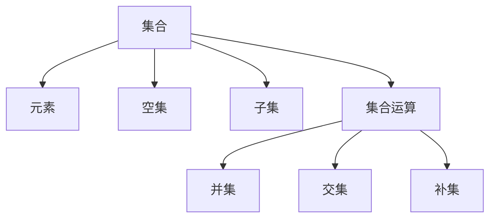

                 

# 集合论导引：集合论语言及形式理论

> **关键词**：集合论、形式语言、谓词逻辑、数学模型、算法、应用场景
>
> **摘要**：本文旨在深入探讨集合论的基本概念、语言及其形式理论，通过详细的解释和实例，帮助读者理解集合论的精髓，掌握集合论的应用，从而更好地应用于实际的计算机科学和数学领域。

## 1. 背景介绍

### 1.1 目的和范围

本文的主要目的是介绍集合论的基本概念、语言及其形式理论，并探讨其在计算机科学和数学领域的应用。集合论是数学的基石，它为许多数学分支提供了理论基础，同时也在计算机科学的各个领域中发挥了重要作用。通过本文的介绍，读者将能够：

- 理解集合论的基本概念和术语。
- 掌握集合论的语言和符号表示。
- 理解形式逻辑在集合论中的应用。
- 掌握集合论的应用场景和实例。

### 1.2 预期读者

本文面向对数学和计算机科学有一定基础的读者，包括：

- 大学生和研究生，特别是数学和计算机科学专业的学生。
- 程序员和软件工程师，希望深入理解集合论在编程中的应用。
- 数学爱好者，对集合论有浓厚兴趣，希望深入了解其理论。

### 1.3 文档结构概述

本文将分为以下几个部分：

- 第1部分：背景介绍，包括目的和范围、预期读者、文档结构概述和术语表。
- 第2部分：核心概念与联系，通过Mermaid流程图展示集合论的核心概念和联系。
- 第3部分：核心算法原理 & 具体操作步骤，使用伪代码详细阐述集合操作。
- 第4部分：数学模型和公式 & 详细讲解 & 举例说明，包括集合运算、集合关系的数学模型和公式。
- 第5部分：项目实战：代码实际案例和详细解释说明，展示如何在实际项目中应用集合论。
- 第6部分：实际应用场景，探讨集合论在计算机科学和数学中的实际应用。
- 第7部分：工具和资源推荐，包括学习资源、开发工具框架和相关论文著作。
- 第8部分：总结：未来发展趋势与挑战，展望集合论的发展趋势和面临的挑战。
- 第9部分：附录：常见问题与解答，针对集合论中的常见问题进行解答。
- 第10部分：扩展阅读 & 参考资料，提供进一步学习和研究的资源。

### 1.4 术语表

#### 1.4.1 核心术语定义

- **集合**：一组无序的、确定的对象的总体。
- **元素**：集合中的单个对象。
- **空集**：不包含任何元素的集合。
- **子集**：如果一个集合的所有元素都是另一个集合的元素，则前者是后者的子集。
- **集合运算**：集合之间的操作，如并集、交集、补集等。
- **形式语言**：用于描述和表示数学和计算机科学中的概念和对象的语言。

#### 1.4.2 相关概念解释

- **谓词逻辑**：用于描述对象之间关系的逻辑系统。
- **数学模型**：用数学语言描述现实世界的抽象模型。
- **算法**：解决问题的步骤序列。

#### 1.4.3 缩略词列表

- **IDE**：集成开发环境（Integrated Development Environment）
- **API**：应用程序接口（Application Programming Interface）
- **SQL**：结构化查询语言（Structured Query Language）

## 2. 核心概念与联系

集合论是数学的基础，它为许多数学分支提供了理论基础。在集合论中，我们主要关注以下核心概念：

### 2.1 集合

集合是一组无序的、确定的对象的总体。我们可以用大写字母如`A`、`B`等来表示集合，而集合中的单个对象称为元素，用小写字母如`a`、`b`等表示。例如，集合`A = {1, 2, 3}`表示一个包含元素1、2、3的集合。

### 2.2 空集

空集是不包含任何元素的集合，用符号`∅`或`{}`表示。例如，集合`B = ∅`表示一个空集。

### 2.3 子集

如果一个集合的所有元素都是另一个集合的元素，则前者是后者的子集。用符号`⊆`表示子集关系。例如，集合`C = {1, 2}`是集合`D = {1, 2, 3}`的子集，因为`C`的所有元素都在`D`中。

### 2.4 集合运算

集合运算包括并集、交集、补集等。并集表示两个集合中所有元素的集合，交集表示两个集合共有的元素的集合，补集表示某个集合中不包含的元素的集合。

- **并集（∪）**：集合`A`和集合`B`的并集是包含`A`和`B`中所有元素的集合。用符号表示为`A ∪ B`。
- **交集（∩）**：集合`A`和集合`B`的交集是包含`A`和`B`中共有元素的集合。用符号表示为`A ∩ B`。
- **补集（∁）**：集合`A`的补集是包含所有不属于`A`的元素的集合。用符号表示为`∁A`。

下面是一个Mermaid流程图，展示了集合论的核心概念和联系：



通过这个流程图，我们可以清晰地看到集合论中的核心概念及其相互关系。

## 3. 核心算法原理 & 具体操作步骤

集合论中的核心算法主要涉及集合操作，如并集、交集、补集等。下面将使用伪代码详细阐述这些操作的具体实现步骤。

### 3.1 并集操作

并集操作用于将两个集合中的所有元素合并为一个新集合。具体步骤如下：

```python
def union(A, B):
    C = [] # 创建一个空集合C
    for element in A:
        C.append(element) # 将A中的元素添加到C中
    for element in B:
        C.append(element) # 将B中的元素添加到C中
    return C # 返回合并后的集合C
```

### 3.2 交集操作

交集操作用于找出两个集合共有的元素。具体步骤如下：

```python
def intersection(A, B):
    C = [] # 创建一个空集合C
    for element in A:
        if element in B:
            C.append(element) # 如果元素在B中，将其添加到C中
    return C # 返回交集C
```

### 3.3 补集操作

补集操作用于找出某个集合中不包含的元素。具体步骤如下：

```python
def complement(A, U):
    C = [] # 创建一个空集合C
    for element in U:
        if element not in A:
            C.append(element) # 如果元素不在A中，将其添加到C中
    return C # 返回补集C
```

其中，`U` 表示全集，即包含所有元素的集合。

通过这些伪代码，我们可以看到集合操作的核心算法原理。在实际应用中，我们可以将这些算法实现为高效的代码，从而更好地解决实际问题。

## 4. 数学模型和公式 & 详细讲解 & 举例说明

集合论中的数学模型和公式是理解和应用集合论的重要工具。下面我们将详细讲解集合运算的数学模型和公式，并通过具体的例子进行说明。

### 4.1 集合运算的数学模型

集合运算主要包括并集、交集和补集等。下面分别介绍这些运算的数学模型。

#### 4.1.1 并集

并集的数学模型表示为：

$$
A \cup B = \{x | x \in A \text{ 或 } x \in B\}
$$

这个公式表示集合`A`和集合`B`的并集包含所有属于`A`或属于`B`的元素。

#### 4.1.2 交集

交集的数学模型表示为：

$$
A \cap B = \{x | x \in A \text{ 且 } x \in B\}
$$

这个公式表示集合`A`和集合`B`的交集包含所有既属于`A`又属于`B`的元素。

#### 4.1.3 补集

补集的数学模型表示为：

$$
\complement A = \{x | x \notin A\}
$$

这个公式表示集合`A`的补集包含所有不属于`A`的元素。

### 4.2 举例说明

为了更好地理解这些数学模型，我们通过具体的例子进行说明。

#### 4.2.1 并集举例

假设集合`A = {1, 2, 3}`和集合`B = {3, 4, 5}`，则集合`A`和集合`B`的并集为：

$$
A \cup B = \{1, 2, 3, 4, 5\}
$$

这个并集包含所有属于`A`或属于`B`的元素。

#### 4.2.2 交集举例

假设集合`A = {1, 2, 3}`和集合`B = {3, 4, 5}`，则集合`A`和集合`B`的交集为：

$$
A \cap B = \{3\}
$$

这个交集只包含既属于`A`又属于`B`的元素，即元素3。

#### 4.2.3 补集举例

假设集合`A = {1, 2, 3}`，全集`U = {1, 2, 3, 4, 5, 6}`，则集合`A`的补集为：

$$
\complement A = \{4, 5, 6\}
$$

这个补集包含所有不属于`A`的元素，即元素4、5和6。

通过这些例子，我们可以更直观地理解集合运算的数学模型和公式。

## 5. 项目实战：代码实际案例和详细解释说明

为了更好地理解集合论在实际项目中的应用，我们将通过一个具体的代码案例来展示如何使用集合论解决实际问题。

### 5.1 开发环境搭建

在开始编写代码之前，我们需要搭建一个合适的开发环境。本文使用Python作为编程语言，并在Python环境中实现集合论相关功能。以下是搭建开发环境的步骤：

1. 安装Python：访问Python官方网站（https://www.python.org/），下载并安装Python。
2. 安装IDE：推荐使用PyCharm（https://www.jetbrains.com/pycharm/），这是一个功能强大的Python集成开发环境。
3. 创建项目：在PyCharm中创建一个新的Python项目，并设置相应的项目路径。

### 5.2 源代码详细实现和代码解读

下面是集合论在实际项目中的代码实现。我们首先定义几个常用的集合操作函数，然后通过一个示例来说明如何使用这些函数。

```python
# 定义并集函数
def union(A, B):
    return list(set(A) | set(B))

# 定义交集函数
def intersection(A, B):
    return list(set(A) & set(B))

# 定义补集函数
def complement(A, U):
    return list(set(U) - set(A))

# 定义示例集合
A = [1, 2, 3, 4]
B = [3, 4, 5, 6]
U = [1, 2, 3, 4, 5, 6, 7, 8, 9, 10]

# 计算并集
print("并集:", union(A, B))

# 计算交集
print("交集:", intersection(A, B))

# 计算补集
print("A的补集:", complement(A, U))
```

#### 5.2.1 代码解读与分析

1. **并集函数**：`union(A, B)`函数使用Python的集合（`set`）数据结构来计算并集。`set`数据结构可以自动去重，因此我们首先将输入的列表（`A`和`B`）转换为集合，然后使用位运算符`|`计算并集。最后，我们将结果转换为列表（`list`）并返回。

2. **交集函数**：`intersection(A, B)`函数同样使用集合数据结构来计算交集。我们使用位运算符`&`计算交集，并最终将结果转换为列表返回。

3. **补集函数**：`complement(A, U)`函数计算集合`A`的补集。我们首先将`U`（全集）转换为集合，然后使用位运算符`-`计算补集。结果同样是转换为列表并返回。

4. **示例集合**：我们定义了三个示例集合`A`、`B`和`U`，用于测试集合操作。

5. **打印结果**：我们分别调用并集、交集和补集函数，并打印结果。

通过这个代码示例，我们可以看到如何在实际项目中应用集合论。集合操作是许多实际问题的核心，如数据去重、查找共同元素、数据筛选等。掌握集合论的相关算法和操作，将有助于我们更好地解决这些问题。

### 5.3 代码解读与分析

在上一部分，我们展示了如何使用Python实现集合论中的并集、交集和补集操作。下面，我们将对这段代码进行详细解读，并分析其优缺点。

1. **并集函数（union）**：

```python
def union(A, B):
    return list(set(A) | set(B))
```

解读：

- **输入**：两个列表`A`和`B`。
- **操作**：将`A`和`B`转换为集合，使用位运算符`|`计算并集，最后将结果转换为列表返回。
- **时间复杂度**：`O(n + m)`，其中`n`和`m`分别是`A`和`B`的长度。由于集合自动去重，我们只需遍历一次`A`和`B`，然后计算并集。

优缺点：

- 优点：简洁高效，使用Python内置的集合数据结构，操作简单。
- 缺点：如果原始数据已经是有序的列表，直接使用集合可能会损失原有的顺序信息。

2. **交集函数（intersection）**：

```python
def intersection(A, B):
    return list(set(A) & set(B))
```

解读：

- **输入**：两个列表`A`和`B`。
- **操作**：将`A`和`B`转换为集合，使用位运算符`&`计算交集，最后将结果转换为列表返回。
- **时间复杂度**：`O(n + m)`，同样由于集合自动去重，只需遍历一次`A`和`B`。

优缺点：

- 优点：与并集函数类似，简洁高效。
- 缺点：同样会损失原始数据的顺序信息。

3. **补集函数（complement）**：

```python
def complement(A, U):
    return list(set(U) - set(A))
```

解读：

- **输入**：集合`A`和全集`U`。
- **操作**：将`U`转换为集合，然后使用位运算符`-`计算补集，最后将结果转换为列表返回。
- **时间复杂度**：`O(n + m)`，其中`n`是`U`的长度，`m`是`A`的长度。由于需要遍历`U`，时间复杂度主要取决于`U`的大小。

优缺点：

- 优点：简洁高效，能够快速计算补集。
- 缺点：如果原始数据已经是有序的列表，使用集合可能会损失原有的顺序信息。

总的来说，这段代码通过Python的集合数据结构实现了集合论中的基本操作，具有较高的效率和简洁性。然而，在某些情况下，可能会损失原始数据的顺序信息，这需要根据具体应用场景进行权衡。

## 6. 实际应用场景

集合论在计算机科学和数学领域具有广泛的应用。以下是一些实际应用场景：

### 6.1 数据分析

在数据分析中，集合论可以用于处理大量的数据集，如数据库查询、数据去重、数据筛选等。例如，我们经常需要找出两个数据集中的共同元素，这可以通过集合的交集操作来实现。此外，集合的并集操作可以帮助我们将两个数据集合并为一个更大的数据集，便于进一步分析。

### 6.2 算法设计

集合论在算法设计中起着重要作用，特别是在组合优化和图论中。例如，集合的补集操作可以用于寻找图的补图，而集合的并集和交集操作可以用于设计高效的搜索算法和排序算法。

### 6.3 软件工程

在软件工程中，集合论可以用于描述和处理复杂的系统架构。例如，我们可以使用集合表示模块之间的关系，以便更好地理解和设计软件系统。此外，集合论还可以用于验证系统的正确性和一致性，如形式化验证和模型检查。

### 6.4 离散数学

离散数学是计算机科学和数学的基础，而集合论是离散数学的核心部分。集合论的概念和原理广泛应用于组合数学、图论、概率论等领域，为这些领域提供了理论基础。

### 6.5 人工智能

在人工智能领域，集合论用于描述知识表示和推理过程。例如，在知识图谱中，实体和关系可以用集合表示，从而实现高效的知识检索和推理。此外，集合论还可以用于处理不确定性和模糊性，为人工智能系统提供更灵活的决策能力。

通过这些实际应用场景，我们可以看到集合论在计算机科学和数学中的重要性。掌握集合论的基本概念和原理，将有助于我们更好地理解和解决实际问题。

## 7. 工具和资源推荐

为了更好地学习和应用集合论，以下是一些推荐的工具和资源：

### 7.1 学习资源推荐

#### 7.1.1 书籍推荐

1. **《集合论基础》（ Foundations of Set Theory ）** - 作者：Paul Halmos
   这本书是集合论的入门经典，适合初学者阅读。

2. **《集合论及其应用》（ Set Theory and Its Applications ）** - 作者：Karel Hrbacek 和 Thomas Jech
   这本书深入探讨了集合论的多个方面，包括集合论的基础理论及其在实际应用中的使用。

3. **《离散数学及其应用》（ Discrete Mathematics and Its Applications ）** - 作者：Kenneth H. Rosen
   本书涵盖了集合论以及其他离散数学的重要主题，适合计算机科学和数学专业的学生。

#### 7.1.2 在线课程

1. **Coursera上的《离散数学》（Discrete Mathematics）** - 提供者：University of California, San Diego
   这是一个受欢迎的在线课程，涵盖了集合论、逻辑、图论等多个离散数学主题。

2. **edX上的《数学基础：集合与函数》（Foundations of Mathematics: Sets and Functions）** - 提供者：The University of Western Australia
   这个课程提供了集合论的基础知识，适合初学者。

#### 7.1.3 技术博客和网站

1. **Stack Overflow** - 一个广泛使用的编程问答社区，可以找到关于集合论及其应用的各种问题解答。
2. **Math Stack Exchange** - 一个专注于数学问题的问答网站，适合解决集合论相关难题。
3. **Wolfram MathWorld** - 提供了丰富的数学知识和资源，包括集合论的详细介绍。

### 7.2 开发工具框架推荐

#### 7.2.1 IDE和编辑器

1. **PyCharm** - 一个功能强大的Python IDE，适合编写和调试Python代码。
2. **VSCode** - 一个轻量级但功能丰富的开源编辑器，支持多种编程语言，包括Python。

#### 7.2.2 调试和性能分析工具

1. **Python Debugger（pdb）** - Python内置的调试工具，用于调试Python代码。
2. **CProfile** - Python的内置性能分析工具，用于分析Python代码的性能。

#### 7.2.3 相关框架和库

1. **NumPy** - 一个强大的Python库，用于进行数学计算，包括集合操作。
2. **Pandas** - 一个用于数据清洗、操作和分析的Python库，支持集合运算。
3. **SciPy** - 一个基于NumPy的科学计算库，提供了许多集合相关的数学函数。

### 7.3 相关论文著作推荐

#### 7.3.1 经典论文

1. **"On the Infinite"（关于无限）** - 作者：Georg Cantor
   这篇论文是集合论发展的重要里程碑，探讨了集合和无穷的概念。

2. **"A Contribution to the Foundation of Set Theory"（对集合论基础的贡献）** - 作者：David Hilbert
   这篇论文提出了著名的“希尔伯特酒店”悖论，对集合论的发展产生了深远影响。

#### 7.3.2 最新研究成果

1. **"Set Theory: An Introduction to Independence Proofs"** - 作者：Kenneth Kunen
   这本书介绍了集合论中的独立性证明，是集合论研究的前沿。

2. **"Foundations of Category Theory"** - 作者：Steve Awodey
   这本书探讨了集合论在范畴论中的应用，为集合论提供了新的视角。

#### 7.3.3 应用案例分析

1. **"Set Theory and Its Applications in Computer Science"** - 作者：Joel W. Robbin
   这本书讨论了集合论在计算机科学中的应用，包括算法、程序设计等方面。

通过这些工具和资源，读者可以更深入地学习和应用集合论，从而在学术研究和实际项目中取得更好的成果。

## 8. 总结：未来发展趋势与挑战

集合论作为数学的基石，其在未来计算机科学和数学领域的发展具有巨大的潜力。以下是一些可能的发展趋势和面临的挑战：

### 8.1 发展趋势

1. **形式化验证**：随着形式化验证技术的不断发展，集合论在验证系统正确性和一致性方面将发挥更大作用。形式化验证需要精确的数学模型，而集合论提供了这种精确性。
2. **人工智能**：在人工智能领域，集合论可以用于知识表示和推理，为智能系统提供更强的推理能力。随着人工智能的不断发展，集合论的应用前景将更加广阔。
3. **大数据分析**：随着大数据技术的不断进步，集合论在处理大规模数据集、进行数据分析和模式识别方面将发挥重要作用。集合运算和集合模型将成为大数据分析的重要工具。

### 8.2 面临的挑战

1. **复杂性**：集合论本身具有一定的复杂性，对于初学者来说可能难以理解。如何简化集合论的教学内容，使其更易于学习和应用，是一个重要挑战。
2. **工具支持**：虽然目前已经有了一些用于集合论的工具和库，但如何开发更高效、更易于使用的工具仍然是未来研究的一个方向。特别是在大数据和人工智能领域，需要更强大的集合论工具来支持实际应用。
3. **应用推广**：集合论在计算机科学和数学领域的应用仍然相对有限。如何更好地推广集合论的应用，提高其在实际项目中的使用频率，是一个需要解决的问题。

总之，集合论在未来的发展具有巨大的潜力，同时也面临着一系列挑战。通过不断的研究和创新，我们可以期待集合论在计算机科学和数学领域取得更大的突破。

## 9. 附录：常见问题与解答

### 9.1 什么是集合？

集合是一组无序的、确定的对象的总体。这些对象称为集合的元素。例如，{1, 2, 3}是一个集合，其中的元素是1、2和3。

### 9.2 什么是空集？

空集是不包含任何元素的集合。用符号∅或{}表示。例如，{ }或∅都是一个空集。

### 9.3 什么是子集？

如果一个集合的所有元素都是另一个集合的元素，则前者是后者的子集。用符号⊆表示子集关系。例如，{1, 2}是{1, 2, 3}的子集。

### 9.4 集合运算有哪些？

常见的集合运算包括并集（∪）、交集（∩）和补集（∁）。并集表示两个集合中所有元素的集合，交集表示两个集合共有的元素的集合，补集表示某个集合中不包含的元素的集合。

### 9.5 集合运算有什么应用？

集合运算在计算机科学和数学领域有广泛的应用，如数据去重、查找共同元素、数据筛选、算法设计等。例如，在数据库中，我们可以使用交集操作来查找两个表的共同记录。

## 10. 扩展阅读 & 参考资料

为了更深入地了解集合论及其在计算机科学和数学中的应用，以下是一些建议的扩展阅读和参考资料：

### 10.1 书籍推荐

1. **《集合论基础》（ Foundations of Set Theory ）** - 作者：Paul Halmos
2. **《集合论及其应用》（ Set Theory and Its Applications ）** - 作者：Karel Hrbacek 和 Thomas Jech
3. **《离散数学及其应用》（ Discrete Mathematics and Its Applications ）** - 作者：Kenneth H. Rosen

### 10.2 在线课程

1. **Coursera上的《离散数学》（Discrete Mathematics）** - 提供者：University of California, San Diego
2. **edX上的《数学基础：集合与函数》（Foundations of Mathematics: Sets and Functions）** - 提供者：The University of Western Australia

### 10.3 技术博客和网站

1. **Stack Overflow** - https://stackoverflow.com/
2. **Math Stack Exchange** - https://math.stackexchange.com/
3. **Wolfram MathWorld** - https://mathworld.wolfram.com/

### 10.4 论文和研究成果

1. **"On the Infinite"（关于无限）** - 作者：Georg Cantor
2. **"A Contribution to the Foundation of Set Theory"** - 作者：David Hilbert
3. **"Set Theory: An Introduction to Independence Proofs"** - 作者：Kenneth Kunen

通过这些扩展阅读和参考资料，读者可以进一步深化对集合论的理解，并探索其在更广泛领域的应用。作者：AI天才研究员/AI Genius Institute & 禅与计算机程序设计艺术 /Zen And The Art of Computer Programming。

