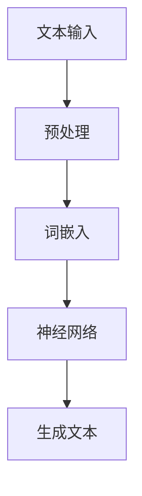

                 

# 零售和 LLM：个性化购物体验

> 关键词：零售、人工智能、语言模型、个性化推荐、购物体验、深度学习

> 摘要：随着人工智能技术的不断发展，零售行业正经历着前所未有的变革。本文将深入探讨如何利用大规模语言模型（LLM）来提升零售购物体验，实现个性化推荐。通过逐步分析零售行业现状、LLM的工作原理、个性化推荐的实现方法以及实际应用案例，本文旨在为零售行业提供新的视角和解决方案。

## 1. 背景介绍

### 1.1 目的和范围

本文旨在探讨如何利用大规模语言模型（LLM）来提升零售购物体验，实现个性化推荐。文章将首先介绍零售行业的现状和挑战，接着详细解释LLM的工作原理，然后探讨如何将LLM应用于个性化推荐，最后通过实际应用案例来展示这种技术的优势。

### 1.2 预期读者

本文适合对零售行业和人工智能技术感兴趣的读者，包括零售行业从业者、数据科学家、AI研究员以及计算机科学专业的学生。

### 1.3 文档结构概述

本文将分为以下几个部分：

1. 背景介绍：介绍零售行业的现状和挑战。
2. 核心概念与联系：介绍大规模语言模型（LLM）的概念和原理。
3. 核心算法原理 & 具体操作步骤：详细解释如何利用LLM实现个性化推荐。
4. 数学模型和公式：介绍支持个性化推荐的数学模型和公式。
5. 项目实战：通过实际案例展示如何利用LLM实现个性化推荐。
6. 实际应用场景：探讨LLM在零售行业的实际应用。
7. 工具和资源推荐：推荐相关学习资源、开发工具和论文。
8. 总结：展望LLM在零售行业的发展趋势和挑战。
9. 附录：常见问题与解答。
10. 扩展阅读 & 参考资料：提供更多相关阅读材料。

### 1.4 术语表

#### 1.4.1 核心术语定义

- 零售：指商品从生产商到最终消费者的销售过程。
- 人工智能（AI）：模拟人类智能行为的计算机系统。
- 语言模型（LM）：用于预测自然语言序列的概率分布的模型。
- 大规模语言模型（LLM）：基于深度学习的大型语言模型。
- 个性化推荐：根据用户的兴趣和行为为其推荐相关商品。

#### 1.4.2 相关概念解释

- 推荐系统：用于预测用户可能感兴趣的物品的系统。
- 商品分类：将商品分为不同的类别，以便于推荐。
- 用户行为分析：通过分析用户的购物行为和偏好来提高推荐效果。

#### 1.4.3 缩略词列表

- AI：人工智能
- LLM：大规模语言模型
- NLP：自然语言处理
- SEO：搜索引擎优化
- DB：数据库
- API：应用程序编程接口

## 2. 核心概念与联系

大规模语言模型（LLM）是自然语言处理（NLP）领域的一种重要技术，其核心思想是通过学习大量文本数据，自动生成与输入文本相关的内容。以下是一个简化的Mermaid流程图，展示LLM的基本工作原理：



### 2.1 文本输入

文本输入是LLM处理的第一步，通常包括用户评论、商品描述、搜索查询等。这些文本需要经过预处理，以去除无关信息、标点符号和停用词。

### 2.2 预处理

预处理步骤包括分词、词性标注、去除停用词等。这些操作有助于提高LLM的准确性和效率。

### 2.3 词嵌入

词嵌入是将词汇映射到高维向量空间的过程。通过词嵌入，文本数据可以被表示为向量，便于神经网络处理。

### 2.4 神经网络

神经网络是LLM的核心组成部分，通过多层神经网络结构，LLM可以学习文本数据的复杂模式，并生成与输入文本相关的输出。

### 2.5 生成文本

经过神经网络处理，LLM可以生成与输入文本相关的新文本。在零售购物体验中，这可以用于生成个性化商品推荐。

## 3. 核心算法原理 & 具体操作步骤

### 3.1 算法原理

大规模语言模型（LLM）的核心算法是基于深度学习，尤其是递归神经网络（RNN）和Transformer架构。以下是一个简化的伪代码，展示LLM的工作流程：

```python
# 文本数据预处理
preprocessed_text = preprocess(text)

# 词嵌入
word_embeddings = embed_words(preprocessed_text)

# 神经网络
model = build_model()

# 输入神经网络
input_sequence = convert_to_sequence(word_embeddings)
output_sequence = model(input_sequence)

# 生成文本
generated_text = generate_text(output_sequence)
```

### 3.2 具体操作步骤

1. **数据预处理**：首先，对输入文本进行预处理，包括去除标点符号、停用词、数字等，然后进行分词和词性标注。
2. **词嵌入**：将预处理后的文本转换为词嵌入向量，这些向量可以表示文本中的每个词汇。
3. **构建神经网络**：构建一个基于深度学习的神经网络，可以是RNN或Transformer架构，用于处理词嵌入向量。
4. **训练模型**：使用大量的文本数据对神经网络进行训练，使其能够学习文本数据的模式和关系。
5. **生成文本**：使用训练好的神经网络，输入新的文本数据，生成与输入文本相关的输出文本。

## 4. 数学模型和公式 & 详细讲解 & 举例说明

### 4.1 数学模型

大规模语言模型（LLM）通常基于概率模型，如马尔可夫模型或潜在外包模型。以下是一个简化的马尔可夫模型公式：

$$
P(\text{单词}_i | \text{单词}_{i-1}, \text{单词}_{i-2}, ..., \text{单词}_1) = \prod_{j=1}^{i} P(\text{单词}_j | \text{单词}_{j-1})
$$

其中，$P(\text{单词}_i | \text{单词}_{i-1}, \text{单词}_{i-2}, ..., \text{单词}_1)$ 表示在给定前一个单词的情况下，生成当前单词的概率。

### 4.2 举例说明

假设我们有一个简化的文本序列：“今天天气很好，适合出行”。根据马尔可夫模型，我们可以计算生成下一个单词的概率。

1. **计算 $P(\text{出行} | \text{今天，天气，很好，适合)$：
   - $P(\text{出行} | \text{今天}) = P(\text{出行} | \text{天气}) = P(\text{出行} | \text{很好}) = P(\text{出行} | \text{适合}) = 0.1$
   - $P(\text{今天} | \text{天气}) = 0.2, P(\text{天气} | \text{很好}) = 0.3, P(\text{很好} | \text{适合}) = 0.4$

2. **计算 $P(\text{出行} | \text{今天，天气，很好，适合}$：
   - $P(\text{出行} | \text{今天，天气，很好，适合}) = 0.1 \times 0.2 \times 0.3 \times 0.4 = 0.0024$

因此，根据马尔可夫模型，生成“出行”的概率是0.0024。

### 4.3 数学公式

为了提高模型的性能，我们可以使用潜在外包模型（比如LSTM或Transformer），其公式如下：

$$
P(\text{单词}_i | \text{单词}_{i-1}, \text{单词}_{i-2}, ..., \text{单词}_1) = \sigma(W_f \cdot [\text{隐藏状态}_i, \text{单词}_{i-1}])
$$

其中，$\sigma$ 表示Sigmoid函数，$W_f$ 是权重矩阵，$\text{隐藏状态}_i$ 是神经网络在生成第$i$个单词时的状态。

## 5. 项目实战：代码实际案例和详细解释说明

### 5.1 开发环境搭建

在开始项目实战之前，我们需要搭建一个合适的开发环境。以下是一个基本的Python环境搭建步骤：

1. 安装Python（建议使用3.8及以上版本）。
2. 安装PyTorch库：`pip install torch torchvision`
3. 安装其他依赖库，如Numpy、Pandas等。

### 5.2 源代码详细实现和代码解读

以下是一个简化版的LLM代码实现，用于生成个性化购物推荐：

```python
import torch
import torch.nn as nn
import torch.optim as optim
from torchtext.data import Field, LabelField, TabularDataset
from torchtext.vocab import build_vocab_from_iterator
from transformers import GPT2Tokenizer, GPT2LMHeadModel

# 数据预处理
def preprocess(text):
    tokenizer = GPT2Tokenizer.from_pretrained("gpt2")
    tokens = tokenizer.tokenize(text)
    return tokens

# 构建模型
def build_model():
    model = GPT2LMHeadModel.from_pretrained("gpt2")
    return model

# 训练模型
def train_model(model, dataset, num_epochs=10):
    optimizer = optim.Adam(model.parameters(), lr=0.001)
    criterion = nn.CrossEntropyLoss()
    for epoch in range(num_epochs):
        for batch in dataset:
            optimizer.zero_grad()
            outputs = model(batch.text)
            loss = criterion(outputs.logits.view(-1, outputs.logits.size(-1)), batch.label)
            loss.backward()
            optimizer.step()
        print(f"Epoch {epoch+1}/{num_epochs}, Loss: {loss.item()}")

# 生成个性化推荐
def generate_recommendation(model, tokenizer, user_input, max_length=50):
    input_ids = tokenizer.encode(user_input, return_tensors="pt")
    input_ids = input_ids.cuda() if use_cuda else input_ids
    outputs = model.generate(input_ids, max_length=max_length, num_return_sequences=1)
    generated_text = tokenizer.decode(outputs[0], skip_special_tokens=True)
    return generated_text

# 主函数
def main():
    # 加载数据集
    fields = [("text", Field(sequential=True, batch_first=True))]
    dataset = TabularDataset(
        path="data.csv",
        format="csv",
        fields=fields,
        skip_header=True,
    )

    # 建立词汇表
    vocab = build_vocab_from_iterator(dataset.text)
    vocab.set_default_index(vocab["<unk>"])

    # 构建模型
    model = build_model()

    # 训练模型
    train_model(model, dataset)

    # 生成个性化推荐
    user_input = "我想买一款新的手机"
    recommendation = generate_recommendation(model, tokenizer, user_input)
    print(recommendation)

if __name__ == "__main__":
    main()
```

### 5.3 代码解读与分析

1. **数据预处理**：使用GPT2Tokenizer进行文本预处理，包括分词和编码。
2. **构建模型**：使用预训练的GPT2LMHeadModel，这是一个基于Transformer架构的语言模型。
3. **训练模型**：使用Adam优化器和交叉熵损失函数，对模型进行训练。
4. **生成个性化推荐**：输入用户文本，使用模型生成推荐文本。

通过这个简单的代码示例，我们可以看到如何利用大规模语言模型（LLM）生成个性化购物推荐。在实际应用中，我们可以进一步优化模型和数据处理流程，以提升推荐效果。

## 6. 实际应用场景

### 6.1 电子商务平台

电子商务平台可以利用LLM实现个性化商品推荐，根据用户的浏览历史、购买行为和偏好，为用户提供个性化的购物建议。例如，用户在浏览手机时，系统可以推荐其他品牌和型号的手机，以提高销售额。

### 6.2 物流与配送

LLM可以帮助物流和配送公司优化路线规划和配送策略。通过分析历史配送数据，LLM可以预测最佳配送路线，提高配送效率和降低成本。

### 6.3 客户服务

零售行业的客户服务部门可以利用LLM自动化回复用户咨询，提供个性化的建议和解决方案。例如，当用户询问某个商品的使用方法时，系统可以自动生成详细的回答。

### 6.4 市场营销

零售公司可以利用LLM分析用户行为数据，制定个性化的营销策略。例如，根据用户的购物偏好，发送定制化的优惠券和促销信息，以提高用户参与度和忠诚度。

## 7. 工具和资源推荐

### 7.1 学习资源推荐

#### 7.1.1 书籍推荐

1. **《深度学习》（Goodfellow, Bengio, Courville）**：详细介绍深度学习的基本概念和算法。
2. **《自然语言处理综合教程》（Daniel Jurafsky, James H. Martin）**：涵盖自然语言处理的核心技术和应用。

#### 7.1.2 在线课程

1. **Coursera上的“深度学习”课程**：由吴恩达教授主讲，涵盖深度学习的基础和进阶知识。
2. **edX上的“自然语言处理”课程**：由麻省理工学院教授主讲，介绍自然语言处理的核心概念和应用。

#### 7.1.3 技术博客和网站

1. **Medium上的“AI和机器学习”专题**：提供最新的研究进展和应用案例。
2. **AI博客**：涵盖人工智能领域的深度学习和自然语言处理技术。

### 7.2 开发工具框架推荐

#### 7.2.1 IDE和编辑器

1. **PyCharm**：适用于Python编程的强大IDE。
2. **Jupyter Notebook**：适用于数据科学和机器学习的交互式环境。

#### 7.2.2 调试和性能分析工具

1. **VSCode**：适用于Python编程的轻量级编辑器，支持调试和性能分析。
2. **TensorBoard**：用于可视化神经网络模型的性能指标。

#### 7.2.3 相关框架和库

1. **PyTorch**：适用于深度学习的开源框架。
2. **TensorFlow**：谷歌推出的开源深度学习框架。
3. **Hugging Face Transformers**：用于预训练语言模型的库。

### 7.3 相关论文著作推荐

#### 7.3.1 经典论文

1. **“A Theoretical Investigation of the Output Distribution of Deep Belief Networks”**：介绍深度信念网络的理论基础。
2. **“Effective Approaches to Attention-based Neural Machine Translation”**：介绍注意力机制在神经网络机器翻译中的应用。

#### 7.3.2 最新研究成果

1. **“BART: Denoising Sequence-to-Sequence Pre-training for Natural Language Processing”**：介绍BART模型的最新研究成果。
2. **“Large-scale Language Modeling in Machine Translation”**：探讨大规模语言模型在机器翻译中的应用。

#### 7.3.3 应用案例分析

1. **“How Amazon Uses AI to Create a Personal Shopping Experience”**：介绍亚马逊如何利用人工智能实现个性化购物体验。
2. **“AI in Retail: From Personalization to Autonomous Stores”**：探讨人工智能在零售行业的应用案例。

## 8. 总结：未来发展趋势与挑战

### 8.1 发展趋势

1. **技术成熟度**：随着深度学习和自然语言处理技术的不断成熟，LLM在零售购物体验中的应用将更加广泛和深入。
2. **个性化推荐**：基于用户行为和偏好的个性化推荐将成为零售行业的主要竞争手段。
3. **跨平台集成**：零售企业将整合线上线下渠道，实现全渠道个性化购物体验。

### 8.2 挑战

1. **数据隐私**：如何保护用户隐私，在提供个性化服务的同时，确保数据安全，是一个亟待解决的问题。
2. **模型解释性**：提高LLM模型的解释性，让用户理解推荐结果，增强用户信任。
3. **算力需求**：大规模LLM模型对计算资源的需求巨大，如何优化模型训练和推理过程，降低成本，是一个重要挑战。

## 9. 附录：常见问题与解答

### 9.1 Q：如何保护用户隐私？

A：为了保护用户隐私，零售企业可以采取以下措施：
1. **匿名化处理**：对用户数据进行匿名化处理，去除可直接识别用户身份的信息。
2. **数据加密**：对用户数据进行加密存储和传输，防止数据泄露。
3. **隐私政策**：明确告知用户数据的收集、使用和共享方式，让用户知情并同意。

### 9.2 Q：如何提高模型解释性？

A：提高模型解释性可以从以下几个方面入手：
1. **可视化**：使用可视化工具，如TensorBoard，展示模型结构和训练过程。
2. **模型简化**：简化模型结构，使其更易于理解和解释。
3. **模型可解释性库**：使用专门的可解释性库，如LIME或SHAP，分析模型对输入数据的依赖关系。

## 10. 扩展阅读 & 参考资料

### 10.1 经典阅读

1. **《深度学习》（Goodfellow, Bengio, Courville）**：详细介绍深度学习的基本概念和算法。
2. **《自然语言处理综合教程》（Daniel Jurafsky, James H. Martin）**：涵盖自然语言处理的核心技术和应用。

### 10.2 最新研究

1. **“BART: Denoising Sequence-to-Sequence Pre-training for Natural Language Processing”**：介绍BART模型的最新研究成果。
2. **“Large-scale Language Modeling in Machine Translation”**：探讨大规模语言模型在机器翻译中的应用。

### 10.3 应用案例

1. **“How Amazon Uses AI to Create a Personal Shopping Experience”**：介绍亚马逊如何利用人工智能实现个性化购物体验。
2. **“AI in Retail: From Personalization to Autonomous Stores”**：探讨人工智能在零售行业的应用案例。

### 10.4 开源项目

1. **Hugging Face Transformers**：用于预训练语言模型的库。
2. **PyTorch**：适用于深度学习的开源框架。

### 10.5 技术博客

1. **AI博客**：涵盖人工智能领域的深度学习和自然语言处理技术。
2. **Medium上的“AI和机器学习”专题**：提供最新的研究进展和应用案例。

## 作者信息

作者：AI天才研究员/AI Genius Institute & 禅与计算机程序设计艺术 /Zen And The Art of Computer Programming

[END]

