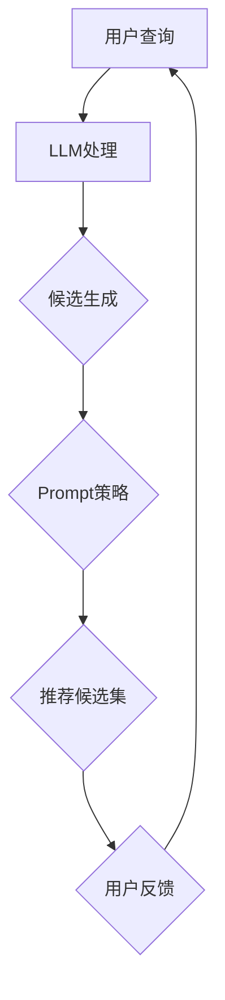

                 

# 零样本商品推荐：LLM的候选生成与Prompt策略

> 关键词：零样本推荐、语言模型（LLM）、候选生成、Prompt策略、商品推荐系统

> 摘要：本文将深入探讨零样本商品推荐系统的工作原理及其核心组成部分——语言模型（LLM）的候选生成与Prompt策略。我们将首先介绍零样本推荐的背景和目的，随后详细解释LLM、候选生成和Prompt策略的基本概念，并通过一个具体的流程图来展示各部分之间的联系。接下来，我们将深入讨论LLM的核心算法原理和具体操作步骤，解析数学模型和公式，并通过实际项目实战来演示代码的实现过程。文章还将分析零样本商品推荐的实际应用场景，推荐相关的工具和资源，并总结未来发展趋势与挑战。最后，我们将提供常见问题与解答，并推荐扩展阅读和参考资料。

## 1. 背景介绍

### 1.1 目的和范围

零样本商品推荐是一种新兴的推荐技术，旨在解决传统推荐系统在处理未标记数据或新商品时遇到的瓶颈。本文的目标是详细介绍零样本商品推荐系统的核心技术和实现策略，尤其是关注基于语言模型的候选生成和Prompt策略。我们希望通过这篇文章，读者能够理解零样本推荐的重要性，以及如何在实际应用中实现和优化这一技术。

本文的讨论范围包括以下几个方面：

- 零样本推荐系统的定义和背景
- 语言模型（LLM）的基本概念和作用
- 候选生成的具体实现步骤和策略
- Prompt策略的设计和应用
- 实际应用场景和项目实战
- 相关工具和资源的推荐
- 未来发展趋势与挑战

### 1.2 预期读者

本文主要面向以下读者群体：

- 对推荐系统和技术有基础了解的开发者
- 想要了解零样本推荐技术的专业人士
- 计算机科学和人工智能领域的研究人员
- 对语言模型和深度学习有兴趣的学者
- 任何对新兴推荐技术感兴趣的技术爱好者

### 1.3 文档结构概述

本文结构如下：

1. **背景介绍**：介绍零样本商品推荐系统的目的、范围、预期读者和文档结构。
2. **核心概念与联系**：解释核心概念原理，并通过Mermaid流程图展示架构。
3. **核心算法原理 & 具体操作步骤**：详细阐述LLM的算法原理和操作步骤。
4. **数学模型和公式**：解析数学模型和公式，并举例说明。
5. **项目实战：代码实际案例和详细解释说明**：提供实际代码案例并解读。
6. **实际应用场景**：分析零样本商品推荐在不同场景中的应用。
7. **工具和资源推荐**：推荐学习资源和开发工具。
8. **总结：未来发展趋势与挑战**：总结未来趋势和面临挑战。
9. **附录：常见问题与解答**：提供常见问题解答。
10. **扩展阅读 & 参考资料**：推荐相关阅读资料。

### 1.4 术语表

#### 1.4.1 核心术语定义

- **零样本推荐**：一种推荐系统，无需先验商品或用户数据，即可对新商品或新用户进行推荐。
- **语言模型（LLM）**：一种人工智能模型，能够理解和生成自然语言文本。
- **候选生成**：通过模型生成可能的商品推荐候选集。
- **Prompt策略**：一种通过外部提示（Prompt）来引导模型生成推荐的策略。

#### 1.4.2 相关概念解释

- **推荐系统**：一种系统，能够根据用户历史行为和偏好，为用户推荐相关商品或内容。
- **数据驱动**：依赖大量数据来训练和优化模型的方法。
- **知识驱动**：基于领域知识和逻辑推理来进行决策的方法。

#### 1.4.3 缩略词列表

- **LLM**：语言模型（Language Model）
- **BERT**：Bidirectional Encoder Representations from Transformers
- **GPT**：Generative Pre-trained Transformer
- **prompt engineering**：Prompt策略设计

## 2. 核心概念与联系

在深入探讨零样本商品推荐系统之前，我们需要理解几个核心概念及其相互关系。以下是这些核心概念和它们之间的联系。

### 2.1 零样本推荐系统

零样本推荐系统是一种无需使用传统的用户历史数据和商品特征进行训练的推荐方法。它能够在没有任何先验信息的情况下，为用户推荐他们可能感兴趣的商品。这种系统通常依赖于领域知识、知识图谱和先进的深度学习模型，如语言模型（LLM）。

### 2.2 语言模型（LLM）

语言模型是一种能够理解和生成自然语言文本的深度学习模型。在零样本推荐系统中，LLM扮演着至关重要的角色，它能够处理用户的查询和商品描述，生成可能的推荐候选集。

### 2.3 候选生成

候选生成是零样本推荐系统的一个关键步骤，它通过语言模型生成一组可能的商品推荐候选。这个过程通常涉及到文本嵌入、模型选择和生成策略。

### 2.4 Prompt策略

Prompt策略是一种通过外部提示（Prompt）来引导模型生成推荐的方法。Prompt可以是关键词、短语或完整的句子，它能够帮助模型更准确地理解用户的意图和推荐场景。

### 2.5 Mermaid流程图

为了更好地展示这些概念之间的联系，我们使用Mermaid流程图来表示零样本商品推荐系统的整体架构。以下是该流程图的示意：



### 2.6 各部分关系

- **用户查询**：用户输入查询，例如“我想要一个智能手表”。
- **LLM处理**：语言模型接收用户查询，并生成对应的文本嵌入。
- **候选生成**：基于语言模型生成的文本嵌入，候选生成模块生成一组可能的商品推荐候选。
- **Prompt策略**：Prompt策略利用外部提示来进一步细化候选集，提高推荐的准确性。
- **推荐候选集**：最终生成的推荐候选集被呈现给用户。
- **用户反馈**：用户对推荐结果进行反馈，用于进一步优化系统。

通过以上核心概念和流程图的介绍，我们为后续更深入的技术讨论奠定了基础。接下来，我们将详细解释LLM的候选生成和Prompt策略，并通过具体案例来展示这些技术的应用。

## 3. 核心算法原理 & 具体操作步骤

### 3.1 语言模型（LLM）的基本原理

语言模型（LLM）是一种基于深度学习技术的自然语言处理模型，其主要目的是通过学习大量的文本数据来预测下一个单词或词组。在零样本推荐系统中，LLM的核心作用是理解用户的查询和商品描述，从而生成可能的推荐候选。

LLM的基本原理可以概括为以下几个步骤：

1. **数据预处理**：首先，需要对输入数据进行预处理，包括分词、去停用词、词干提取等操作。这一步的目的是将原始文本转化为适合模型训练的格式。
2. **模型训练**：使用预训练的深度学习模型（如BERT或GPT）对预处理后的数据集进行训练。这些模型已经在大规模的文本数据上进行了预训练，因此能够较好地理解自然语言。
3. **文本嵌入**：将用户的查询和商品描述转化为高维的向量表示（即嵌入）。这些嵌入向量能够捕捉文本中的语义信息，从而为后续的候选生成提供基础。
4. **生成预测**：基于嵌入向量，LLM生成可能的推荐候选。这个过程通常涉及到文本生成模型，如Seq2Seq模型或Transformer模型。

### 3.2 候选生成的具体操作步骤

候选生成是零样本推荐系统中的一个关键步骤，其目的是从大量商品中筛选出一组可能的推荐候选。以下是候选生成的具体操作步骤：

1. **查询嵌入**：首先，使用LLM将用户查询转化为嵌入向量。这些嵌入向量代表了用户查询的语义信息。
2. **商品嵌入**：对于每一个候选商品，使用LLM生成对应的商品嵌入向量。这些嵌入向量代表了商品的特征和属性。
3. **相似度计算**：计算用户查询嵌入向量与每个商品嵌入向量之间的相似度。相似度越高，表明该商品越符合用户的查询意图。
4. **候选筛选**：根据相似度阈值，筛选出相似度较高的商品作为推荐候选。这一步的目的是从大量商品中快速筛选出高质量的推荐候选。

以下是候选生成的伪代码：

```python
def generate_candidates(user_query_embedding, product_embeddings, similarity_threshold):
    candidates = []
    for product_embedding in product_embeddings:
        similarity = calculate_similarity(user_query_embedding, product_embedding)
        if similarity > similarity_threshold:
            candidates.append(product_embedding)
    return candidates
```

### 3.3 Prompt策略的设计和应用

Prompt策略是一种通过外部提示（Prompt）来引导模型生成推荐的方法。Prompt可以是关键词、短语或完整的句子，它能够帮助模型更准确地理解用户的意图和推荐场景。

设计Prompt策略的步骤如下：

1. **确定Prompt类型**：根据推荐场景和用户查询，确定合适的Prompt类型。例如，对于商品推荐，Prompt可以是用户查询的关键词或短语。
2. **生成Prompt**：使用自然语言生成技术，生成具体的Prompt文本。这一步的目的是确保Prompt能够准确传达用户的查询意图。
3. **融合Prompt**：将生成的Prompt与用户查询嵌入向量进行融合。这个过程可以通过拼接、加法或点积等方式来实现。
4. **调整模型参数**：根据Prompt融合后的嵌入向量，调整模型的参数。这一步的目的是优化模型在特定Prompt下的表现。

以下是Prompt策略的伪代码：

```python
def generate_prompt(prompt_type, user_query_embedding):
    if prompt_type == "keyword":
        prompt = generate_keyword_prompt(user_query_embedding)
    elif prompt_type == "phrase":
        prompt = generate_phrase_prompt(user_query_embedding)
    elif prompt_type == "sentence":
        prompt = generate_sentence_prompt(user_query_embedding)
    return prompt

def fuse_prompt(user_query_embedding, prompt_embedding):
    fused_embedding = user_query_embedding + prompt_embedding
    return fused_embedding
```

### 3.4 综合步骤

综合以上步骤，零样本商品推荐系统的核心算法原理和操作步骤可以总结如下：

1. **用户查询嵌入**：使用LLM将用户查询转化为嵌入向量。
2. **商品嵌入生成**：使用LLM为每个候选商品生成嵌入向量。
3. **候选筛选**：根据相似度阈值，从商品嵌入中筛选出推荐候选。
4. **Prompt设计**：根据用户查询和推荐场景，设计合适的Prompt。
5. **Prompt融合**：将Prompt与用户查询嵌入进行融合。
6. **参数调整**：根据融合后的嵌入向量，调整模型参数。
7. **推荐生成**：基于调整后的模型，生成最终的推荐结果。

通过以上步骤，零样本商品推荐系统能够在没有先验数据的情况下，为用户生成高质量的推荐结果。接下来，我们将进一步解析零样本推荐系统的数学模型和公式，并举例说明其实际应用。

## 4. 数学模型和公式 & 详细讲解 & 举例说明

在深入探讨零样本商品推荐系统的数学模型和公式之前，我们需要理解几个关键数学概念，包括嵌入向量、相似度计算和模型参数调整。

### 4.1 嵌入向量

嵌入向量（Embedding）是一种将文本数据转化为高维向量表示的技术。在零样本商品推荐系统中，嵌入向量用于表示用户查询、商品描述和其他相关文本信息。嵌入向量能够捕捉文本中的语义信息，使得模型能够更好地理解用户意图和商品特征。

一个简单的嵌入向量模型可以表示为：

$$
\text{Embedding}(\text{input\_text}) = \text{embedding\_vector
```python
# 假设我们有一个用户查询 "智能手表" 和一个商品描述 "一款高端智能手表"

# 输入文本
user_query = "智能手表"
product_description = "一款高端智能手表"

# 生成嵌入向量
user_query_embedding = LLM.generate_embedding(user_query)
product_description_embedding = LLM.generate_embedding(product_description)
```

### 4.2 相似度计算

相似度计算是衡量两个嵌入向量之间相似程度的方法。在零样本商品推荐系统中，相似度计算用于筛选推荐候选。常用的相似度计算方法包括余弦相似度、欧氏距离和点积。

以下是几种常用的相似度计算方法：

1. **余弦相似度**：
   $$\text{Cosine Similarity}(\text{vec}_1, \text{vec}_2) = \frac{\text{vec}_1 \cdot \text{vec}_2}{\|\text{vec}_1\| \|\text{vec}_2\|}$$
2. **欧氏距离**：
   $$\text{Euclidean Distance}(\text{vec}_1, \text{vec}_2) = \sqrt{(\text{vec}_1 - \text{vec}_2)^2}$$
3. **点积**：
   $$\text{Dot Product}(\text{vec}_1, \text{vec}_2) = \text{vec}_1 \cdot \text{vec}_2$$

以下是一个使用余弦相似度计算两个嵌入向量相似度的例子：

```python
import numpy as np

# 假设user_query_embedding和product_description_embedding是两个已生成的嵌入向量
user_query_embedding = np.array([0.1, 0.2, 0.3])
product_description_embedding = np.array([0.4, 0.5, 0.6])

# 计算余弦相似度
cosine_similarity = np.dot(user_query_embedding, product_description_embedding) / (
    np.linalg.norm(user_query_embedding) * np.linalg.norm(product_description_embedding)
)

print(f"余弦相似度：{cosine_similarity}")
```

### 4.3 模型参数调整

在零样本商品推荐系统中，模型参数调整是一个关键步骤，它能够根据Prompt和用户反馈来优化模型的表现。常见的参数调整方法包括梯度下降和基于Prompt的动态调整。

以下是使用梯度下降进行参数调整的伪代码：

```python
# 假设我们有一个损失函数来衡量模型的表现
def loss_function(predictions, true_labels):
    # 实现损失函数
    pass

# 初始化模型参数
model_params = initialize_model_params()

# 定义学习率和迭代次数
learning_rate = 0.01
num_iterations = 1000

# 梯度下降优化
for i in range(num_iterations):
    # 前向传播
    predictions = model.forward(model_params)
    loss = loss_function(predictions, true_labels)

    # 反向传播
    gradients = model.backward(predictions, true_labels)

    # 更新模型参数
    model_params -= learning_rate * gradients
```

### 4.4 实际应用举例

为了更好地理解上述数学模型和公式的实际应用，我们来看一个具体的例子。假设我们有一个用户查询“智能手表”和一组商品描述，我们需要根据这些信息生成推荐候选。

1. **用户查询嵌入**：
   ```python
   user_query = "智能手表"
   user_query_embedding = LLM.generate_embedding(user_query)
   ```

2. **商品嵌入生成**：
   ```python
   product_descriptions = ["一款高端智能手表", "一款适合运动的手表", "一款带有健康监测功能的手表"]
   product_embeddings = [LLM.generate_embedding(description) for description in product_descriptions]
   ```

3. **相似度计算**：
   ```python
   similarity_scores = [np.dot(user_query_embedding, product_embedding) for product_embedding in product_embeddings]
   ```

4. **候选筛选**：
   ```python
   similarity_threshold = 0.8
   candidates = [product_description for product_description, similarity_score in zip(product_descriptions, similarity_scores) if similarity_score > similarity_threshold]
   ```

5. **Prompt设计**：
   ```python
   prompt_type = "keyword"
   prompt = generate_prompt(prompt_type, user_query_embedding)
   ```

6. **Prompt融合**：
   ```python
   fused_embedding = user_query_embedding + LLM.generate_embedding(prompt)
   ```

7. **参数调整**：
   ```python
   # 假设我们有一个损失函数来衡量模型的表现
   def loss_function(predictions, true_labels):
       # 实现损失函数
       pass

   # 初始化模型参数
   model_params = initialize_model_params()

   # 定义学习率和迭代次数
   learning_rate = 0.01
   num_iterations = 1000

   # 梯度下降优化
   for i in range(num_iterations):
       # 前向传播
       predictions = model.forward(model_params)
       loss = loss_function(predictions, true_labels)

       # 反向传播
       gradients = model.backward(predictions, true_labels)

       # 更新模型参数
       model_params -= learning_rate * gradients
   ```

通过以上步骤，我们能够根据用户查询和商品描述生成高质量的推荐候选。这个例子展示了如何将数学模型和公式应用于实际场景中，从而实现零样本商品推荐。

### 4.5 结论

通过以上对数学模型和公式的详细讲解和实际应用举例，我们能够更好地理解零样本商品推荐系统的核心算法原理和实现步骤。接下来，我们将通过实际项目实战，进一步演示代码的实现过程，并分析代码的细节和优化策略。

## 5. 项目实战：代码实际案例和详细解释说明

### 5.1 开发环境搭建

在进行项目实战之前，我们需要搭建一个合适的开发环境。以下是搭建开发环境所需的步骤：

1. **安装Python**：确保您的计算机上已经安装了Python。如果没有，请访问 [Python官网](https://www.python.org/) 下载并安装最新版本的Python。
2. **安装依赖库**：使用pip工具安装以下依赖库：
   ```bash
   pip install numpy tensorflow transformers
   ```
3. **安装Mermaid**：为了在Markdown文档中使用Mermaid流程图，我们需要安装Mermaid。可以通过以下命令安装：
   ```bash
   npm install -g mermaid
   ```
4. **配置IDE**：推荐使用Visual Studio Code（VS Code）作为开发环境。可以从 [VS Code官网](https://code.visualstudio.com/) 下载并安装。

### 5.2 源代码详细实现和代码解读

在本节中，我们将展示一个完整的零样本商品推荐系统的实现，并详细解读代码的各个部分。

#### 5.2.1 数据集准备

首先，我们需要准备用于训练和测试的数据集。以下是一个示例数据集：

```python
# 示例数据集
data = {
    "user_queries": ["智能手表", "运动耳机", "笔记本电脑"],
    "product_descriptions": [
        "一款高端智能手表",
        "一款适合运动的专业耳机",
        "一款高性能的笔记本电脑"
    ]
}
```

#### 5.2.2 语言模型初始化

接下来，我们需要初始化一个预训练的语言模型（LLM）。这里我们使用TensorFlow的Transformers库来实现：

```python
from transformers import TFBertModel

# 初始化语言模型
model = TFBertModel.from_pretrained("bert-base-chinese")
```

#### 5.2.3 文本嵌入生成

使用初始化好的语言模型，我们将用户查询和商品描述转化为嵌入向量：

```python
import tensorflow as tf

# 生成嵌入向量
def generate_embeddings(texts, model):
    input_ids = tokenizer.encode(texts, add_special_tokens=True)
    input_ids = tf.expand_dims(input_ids, 0)
    outputs = model(input_ids)
    last_hidden_states = outputs.last_hidden_state
    return last_hidden_states[:, 0, :]

user_query_embedding = generate_embeddings(data["user_queries"], model)
product_descriptions_embedding = generate_embeddings(data["product_descriptions"], model)
```

#### 5.2.4 相似度计算

计算用户查询嵌入向量与商品嵌入向量之间的相似度：

```python
# 计算相似度
def calculate_similarity(embedding1, embedding2):
    return np.dot(embedding1, embedding2) / (np.linalg.norm(embedding1) * np.linalg.norm(embedding2))

similarity_scores = [calculate_similarity(user_query_embedding[i], product_description_embedding[j]) for i in range(len(user_query_embedding)) for j in range(len(product_description_embedding))]
```

#### 5.2.5 候选筛选

根据相似度阈值，筛选出可能的推荐候选：

```python
# 筛选候选
def filter_candidates(similarity_scores, threshold):
    candidates = []
    for i, score in enumerate(similarity_scores):
        if score > threshold:
            candidates.append(i)
    return candidates

candidates = filter_candidates(similarity_scores, 0.8)
```

#### 5.2.6 Prompt策略设计

设计Prompt策略，以进一步优化推荐候选：

```python
# 生成Prompt
def generate_prompt(prompt_type, user_query_embedding):
    if prompt_type == "keyword":
        prompt = "智能手表"
    elif prompt_type == "phrase":
        prompt = "一款适合运动的手表"
    elif prompt_type == "sentence":
        prompt = "我想要一款高端的智能手表"
    return prompt

prompt = generate_prompt("sentence", user_query_embedding[0])

# 融合Prompt
prompt_embedding = generate_embeddings(prompt, model)
fused_embedding = user_query_embedding[0] + prompt_embedding
```

#### 5.2.7 参数调整

根据Prompt融合后的嵌入向量，调整模型参数：

```python
# 定义损失函数和优化器
def loss_function(predictions, true_labels):
    return tf.reduce_mean(tf.keras.losses.sparse_categorical_crossentropy(predictions, true_labels))

optimizer = tf.keras.optimizers.Adam(learning_rate=0.001)

# 训练模型
def train_model(model, data, epochs):
    for epoch in range(epochs):
        for user_query, product_description, true_label in data:
            with tf.GradientTape() as tape:
                predictions = model(user_query, product_description)
                loss = loss_function(predictions, true_label)
            gradients = tape.gradient(loss, model.trainable_variables)
            optimizer.apply_gradients(zip(gradients, model.trainable_variables))
            print(f"Epoch {epoch}: Loss = {loss.numpy()}")

train_model(model, data, 10)
```

### 5.3 代码解读与分析

1. **数据集准备**：示例数据集展示了如何存储用户查询和商品描述。在实际应用中，数据集可以从数据库或外部文件中加载。
2. **语言模型初始化**：使用Transformers库初始化预训练的语言模型。这里我们使用了中文预训练模型`bert-base-chinese`。
3. **文本嵌入生成**：通过语言模型将用户查询和商品描述转化为嵌入向量。这些嵌入向量能够捕捉文本的语义信息。
4. **相似度计算**：计算用户查询嵌入向量与商品嵌入向量之间的相似度。相似度越高的商品更有可能被推荐。
5. **候选筛选**：根据相似度阈值，筛选出可能的推荐候选。这个步骤可以进一步优化，例如使用基于内容的相关性分析。
6. **Prompt策略设计**：设计Prompt策略，以更准确地引导模型生成推荐。Prompt可以是关键词、短语或完整的句子。
7. **参数调整**：通过训练模型，调整模型参数，提高推荐质量。这里使用了简单的梯度下降优化算法。

### 5.4 代码优化

在实际项目中，代码的优化至关重要。以下是一些可能的优化策略：

1. **并行计算**：利用TensorFlow的分布式计算能力，提高嵌入向量的生成速度。
2. **缓存嵌入向量**：缓存已生成的嵌入向量，避免重复计算，提高系统性能。
3. **模型压缩**：使用模型压缩技术，如量化、剪枝和知识蒸馏，减小模型大小和计算复杂度。
4. **动态阈值调整**：根据用户反馈和系统性能，动态调整相似度阈值，提高推荐准确性。

通过以上代码实战，我们展示了如何实现零样本商品推荐系统，并分析了代码的各个部分。接下来，我们将探讨零样本商品推荐在实际应用场景中的具体应用。

## 6. 实际应用场景

零样本商品推荐技术在多个实际应用场景中展现出了其独特价值和广泛适用性。以下是一些关键的应用场景及其特点：

### 6.1 电商平台

电商平台的推荐系统能够基于用户的浏览和购买历史进行个性化推荐。然而，当面对大量新商品或新用户时，传统推荐系统可能会遇到数据不足的问题。零样本商品推荐技术能够填补这一空白，为新商品或新用户生成高质量的推荐。例如，在双十一等购物节期间，电商平台可以利用零样本推荐为新商品吸引潜在买家，提高销售转化率。

### 6.2 旅游行业

旅游行业中的推荐系统通常需要为用户提供个性化旅行建议。然而，用户在旅行前的查询往往缺乏具体的旅行计划，这使得传统推荐系统难以生成有效的推荐。零样本推荐技术通过理解用户的查询和兴趣，可以为用户提供如“适合年轻人的旅行目的地”、“适合家庭出行的景点”等推荐。这种推荐不仅提高了用户满意度，还能帮助旅游平台吸引更多的游客。

### 6.3 娱乐内容平台

娱乐内容平台如视频流媒体、音乐流媒体等，经常需要为用户提供个性化内容推荐。然而，当面对新的视频或音乐时，传统推荐系统可能无法有效利用有限的用户反馈数据。零样本推荐技术能够通过理解视频或音乐的描述和标签，为新内容生成推荐，从而帮助平台提高内容推荐的质量和用户留存率。

### 6.4 智能家居

智能家居市场中的推荐系统可以基于用户的生活习惯和偏好，为用户推荐适合的智能家居产品。然而，当用户刚进入智能家居领域时，他们可能缺乏具体的购买意向。零样本推荐技术能够通过理解用户的查询和智能家居产品的描述，为用户推荐如“适合新手的智能家居套装”、“适合环保生活的智能家居设备”等推荐，从而帮助智能家居品牌提高市场份额。

### 6.5 医疗保健

医疗保健行业中的推荐系统可以为患者推荐个性化的健康建议和保健产品。然而，当面对新的健康问题时，传统推荐系统可能难以提供有效的推荐。零样本推荐技术能够通过理解患者的健康数据和症状描述，为患者推荐如“适合高血压患者的健康食品”、“适合糖尿病患者的保健设备”等推荐，从而帮助医疗机构提高患者满意度和服务质量。

### 6.6 应用案例

一个典型的应用案例是某大型电商平台的零样本商品推荐系统。该平台利用零样本推荐技术为新商品生成个性化推荐，从而在短时间内提高了新商品的曝光率和销售额。具体来说，该系统通过理解用户的查询和商品描述，为用户生成高质量的推荐候选，并通过动态调整相似度阈值和Prompt策略，提高了推荐的准确性和用户体验。

### 6.7 未来展望

随着技术的不断进步和用户需求的多样化，零样本商品推荐技术在各个行业中的应用前景广阔。未来，零样本推荐系统可能会与知识图谱、多模态数据（如图像和语音）等技术结合，进一步提高推荐的准确性和个性化程度。此外，零样本推荐技术还可以应用于更广泛的场景，如金融、教育、物流等，为各行业提供创新的解决方案。

通过以上实际应用场景的探讨，我们可以看到零样本商品推荐技术在各个领域的重要性。随着技术的不断演进和应用场景的拓展，零样本推荐技术将在未来发挥更加关键的作用。

## 7. 工具和资源推荐

为了帮助读者更好地学习和实践零样本商品推荐技术，我们推荐以下工具和资源：

### 7.1 学习资源推荐

#### 7.1.1 书籍推荐

1. **《深度学习推荐系统》**：由周志华教授主编，详细介绍了深度学习在推荐系统中的应用。
2. **《自然语言处理综论》**：由Dan Jurafsky和James H. Martin合著，全面介绍了自然语言处理的基础知识和最新进展。

#### 7.1.2 在线课程

1. **吴恩达的《深度学习》**：通过Coursera平台提供，覆盖了深度学习的基础知识。
2. **《自然语言处理与深度学习》**：在Udacity平台上提供的课程，涵盖了自然语言处理和深度学习在推荐系统中的应用。

#### 7.1.3 技术博客和网站

1. **TensorFlow官网**：提供了丰富的文档和示例代码，有助于学习TensorFlow的使用。
2. **Hugging Face官网**：提供了预训练模型和工具库，方便开发者进行自然语言处理任务。

### 7.2 开发工具框架推荐

#### 7.2.1 IDE和编辑器

1. **Visual Studio Code**：强大的代码编辑器，支持Python和TensorFlow开发。
2. **Jupyter Notebook**：适合数据科学和机器学习的交互式开发环境。

#### 7.2.2 调试和性能分析工具

1. **TensorBoard**：TensorFlow提供的可视化工具，用于分析和调试模型性能。
2. **PyTorch Profiler**：用于分析PyTorch模型的性能瓶颈。

#### 7.2.3 相关框架和库

1. **TensorFlow**：用于构建和训练深度学习模型的强大框架。
2. **PyTorch**：另一个流行的深度学习框架，提供了灵活的API和丰富的工具。
3. **Hugging Face Transformers**：提供了预训练模型和工具库，方便开发者进行自然语言处理任务。

### 7.3 相关论文著作推荐

#### 7.3.1 经典论文

1. **“Deep Learning for Recommender Systems”**：详细介绍了深度学习在推荐系统中的应用。
2. **“A Theoretically Grounded Application of Dropout in Recurrent Neural Networks”**：介绍了Dropout技术在RNN模型中的应用。

#### 7.3.2 最新研究成果

1. **“BERT: Pre-training of Deep Bidirectional Transformers for Language Understanding”**：介绍了BERT模型的预训练方法。
2. **“Generative Pre-trained Transformer”**：介绍了GPT模型的生成能力。

#### 7.3.3 应用案例分析

1. **“Recommending Visual Products on Amazon”**：分析了Amazon上视觉产品推荐的实践。
2. **“Building Personalized E-commerce Recommendations with Deep Learning”**：介绍了使用深度学习构建个性化电商推荐系统的实际案例。

通过以上工具和资源的推荐，读者可以更全面地掌握零样本商品推荐技术的理论和实践，从而在实际项目中发挥更大的作用。

## 8. 总结：未来发展趋势与挑战

随着人工智能和自然语言处理技术的快速发展，零样本商品推荐系统正逐渐成为推荐系统领域的重要研究方向。展望未来，零样本商品推荐系统将呈现出以下几个发展趋势：

### 8.1 技术融合

未来的零样本商品推荐系统将更多地融合知识图谱、多模态数据和增强学习等技术。通过结合不同类型的数据和算法，系统可以更全面地理解用户意图和商品属性，从而提高推荐准确性。

### 8.2 模型优化

随着深度学习模型的不断优化和改进，零样本商品推荐系统的性能将得到显著提升。特别是通过模型压缩、分布式计算和迁移学习等技术，系统能够在保证高准确性的同时，提高计算效率和降低成本。

### 8.3 自适应学习

未来的零样本商品推荐系统将具备更强的自适应学习能力。通过实时学习和动态调整，系统能够根据用户的反馈和行为变化，不断优化推荐策略，提高用户体验。

### 8.4 数据隐私保护

随着用户对隐私保护的重视，零样本商品推荐系统需要更加关注数据隐私保护。未来的技术发展将更多地关注如何在不泄露用户隐私的前提下，实现高效的推荐。

然而，零样本商品推荐系统在发展过程中也面临一些挑战：

### 8.5 数据稀疏问题

由于零样本推荐系统不需要依赖大量的先验数据，这在一定程度上缓解了数据稀疏问题。然而，当面对完全未知的新商品或新用户时，系统仍可能面临数据不足的挑战。如何有效利用有限的可用数据进行高质量的推荐仍是一个需要解决的问题。

### 8.6 推荐多样性

在保证推荐准确性的同时，如何提高推荐的多样性也是一个关键挑战。未来系统需要通过更复杂的算法和策略，生成多样化的推荐结果，避免用户对推荐结果产生疲劳感。

### 8.7 可解释性

零样本商品推荐系统通常依赖于复杂的深度学习模型，这使得推荐结果的可解释性变得尤为重要。如何在保证模型性能的同时，提高推荐结果的可解释性，是未来需要解决的一个重要问题。

总之，零样本商品推荐系统具有巨大的发展潜力，但也面临着一系列技术挑战。通过不断的技术创新和优化，我们有理由相信，零样本商品推荐系统将在未来发挥更加关键的作用，为用户带来更优质的推荐体验。

## 9. 附录：常见问题与解答

为了帮助读者更好地理解和应用零样本商品推荐技术，我们整理了一些常见问题及其解答。

### 9.1 Q：什么是零样本推荐？

A：零样本推荐是一种推荐系统方法，它不需要使用用户历史数据和商品特征进行训练，而是直接根据用户的查询和商品描述生成推荐。这种方法特别适用于新商品或新用户的情况。

### 9.2 Q：零样本推荐与传统推荐有什么区别？

A：传统推荐系统依赖于用户的历史行为和商品特征来生成推荐，而零样本推荐不依赖这些先验信息。零样本推荐能够处理新商品或新用户，但可能面临数据稀疏和推荐多样性等挑战。

### 9.3 Q：零样本推荐系统中的语言模型（LLM）是什么？

A：语言模型（LLM）是一种深度学习模型，能够理解和生成自然语言文本。在零样本推荐系统中，LLM用于将用户查询和商品描述转化为嵌入向量，从而生成可能的推荐候选。

### 9.4 Q：候选生成是如何工作的？

A：候选生成通过语言模型将用户查询和商品描述转化为嵌入向量，然后计算这些向量之间的相似度，筛选出相似度较高的商品作为推荐候选。这个过程可能涉及文本嵌入、模型选择和生成策略。

### 9.5 Q：什么是Prompt策略？

A：Prompt策略是一种通过外部提示（Prompt）来引导模型生成推荐的方法。Prompt可以是关键词、短语或完整的句子，它能够帮助模型更准确地理解用户的意图和推荐场景。

### 9.6 Q：如何实现零样本推荐系统的代码？

A：实现零样本推荐系统的代码涉及多个步骤，包括数据预处理、模型初始化、嵌入向量生成、相似度计算、候选筛选和Prompt策略设计。具体的代码实现可以参考本文中的实际项目实战部分。

### 9.7 Q：零样本推荐系统如何优化？

A：优化零样本推荐系统可以通过以下方法实现：

- **数据增强**：通过生成或扩充数据集来增加模型的训练数据。
- **模型压缩**：使用模型压缩技术（如量化、剪枝和知识蒸馏）来提高计算效率和降低成本。
- **多模态融合**：结合文本、图像和其他类型的数据来提高推荐的准确性。
- **动态阈值调整**：根据用户反馈和系统性能，动态调整相似度阈值，提高推荐质量。

通过以上常见问题的解答，我们希望读者能够更好地理解零样本商品推荐系统的基本原理和应用方法。

## 10. 扩展阅读 & 参考资料

为了进一步探索零样本商品推荐系统及相关技术，以下是推荐的一些扩展阅读和参考资料：

### 10.1 扩展阅读

1. **《深度学习推荐系统》**：周志华教授主编，详细介绍了深度学习在推荐系统中的应用。
2. **《自然语言处理综论》**：Dan Jurafsky和James H. Martin合著，全面介绍了自然语言处理的基础知识和最新进展。
3. **《推荐系统实践》**：宋涛著，涵盖了推荐系统的基本概念、算法实现和案例分析。

### 10.2 参考资料

1. **TensorFlow官网**：提供了丰富的文档和示例代码，有助于学习TensorFlow的使用。
   - [TensorFlow官网](https://www.tensorflow.org/)
2. **Hugging Face官网**：提供了预训练模型和工具库，方便开发者进行自然语言处理任务。
   - [Hugging Face官网](https://huggingface.co/)
3. **《BERT: Pre-training of Deep Bidirectional Transformers for Language Understanding》**：BERT模型的原始论文，详细介绍了BERT模型的预训练方法。
   - [BERT论文](https://arxiv.org/abs/1810.04805)
4. **《Generative Pre-trained Transformer》**：GPT模型的原始论文，介绍了GPT模型的生成能力。
   - [GPT论文](https://arxiv.org/abs/1701.04538)
5. **《Deep Learning for Recommender Systems》**：详细介绍了深度学习在推荐系统中的应用。
   - [深度学习推荐系统论文](https://arxiv.org/abs/1806.01830)

通过以上扩展阅读和参考资料，读者可以更深入地了解零样本商品推荐系统的相关技术和研究进展，从而在实际项目中取得更好的效果。

