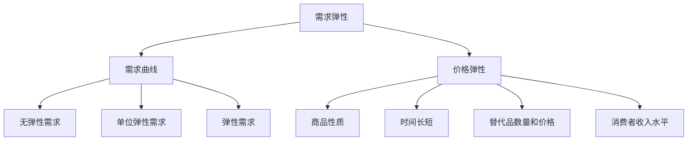

                 

# 需求弹性分析：理解价格变化对需求的影响

> **关键词：需求弹性、价格敏感性、市场分析、消费者行为、经济学模型**

> **摘要：本文深入探讨了需求弹性这一经济学概念，分析价格变化对市场需求的影响。通过逐步解析核心概念、算法原理、数学模型以及实际应用案例，旨在为读者提供全面的理解和实用的工具，帮助企业更精准地预测市场需求和制定价格策略。**

## 1. 背景介绍

### 1.1 目的和范围

本文的主要目的是通过对需求弹性的分析，帮助企业和市场分析师理解价格变化对需求的影响。需求弹性是经济学中一个重要的概念，它反映了市场需求量对价格变动的敏感程度。通过分析需求弹性，企业可以更准确地预测价格调整对销售量的影响，从而制定更为有效的市场策略。

本文将涵盖以下内容：

- 需求弹性的基本概念和重要性
- 需求弹性的计算方法和相关模型
- 数学模型和公式的详细讲解
- 实际应用场景中的代码案例解析
- 工具和资源的推荐

### 1.2 预期读者

本文适合以下读者群体：

- 市场分析师和商务分析师
- 企业管理层和营销策略制定者
- 经济学、市场营销等相关专业的学生和研究人员
- 对经济学和市场需求分析感兴趣的读者

### 1.3 文档结构概述

本文将按照以下结构进行展开：

- **第1章：背景介绍**：介绍文章的目的、预期读者和结构。
- **第2章：核心概念与联系**：介绍需求弹性的定义和相关概念，使用Mermaid流程图展示其关联性。
- **第3章：核心算法原理 & 具体操作步骤**：详细讲解需求弹性的计算方法，使用伪代码展示算法流程。
- **第4章：数学模型和公式 & 详细讲解 & 举例说明**：介绍需求弹性的数学模型，使用LaTeX格式展示公式，并进行举例说明。
- **第5章：项目实战：代码实际案例和详细解释说明**：通过一个实际案例展示需求弹性的应用，并详细解释代码实现。
- **第6章：实际应用场景**：讨论需求弹性在市场营销和企业管理中的实际应用。
- **第7章：工具和资源推荐**：推荐学习资源、开发工具和框架。
- **第8章：总结：未来发展趋势与挑战**：总结本文要点，并展望未来趋势和面临的挑战。
- **第9章：附录：常见问题与解答**：回答读者可能关心的问题。
- **第10章：扩展阅读 & 参考资料**：提供进一步阅读的建议和参考资料。

### 1.4 术语表

#### 1.4.1 核心术语定义

- **需求弹性**：需求量对价格变动的敏感程度，通常用弹性系数来表示。
- **价格弹性**：指需求量的变化百分比与价格变化百分比之间的比率。
- **需求曲线**：表示价格和需求量之间关系的图形。
- **单位弹性**：需求量的变化百分比与价格变化百分比相等。

#### 1.4.2 相关概念解释

- **需求函数**：描述价格、收入、其他变量与需求量之间关系的数学函数。
- **价格敏感性**：指需求量对价格变化的反应程度。
- **需求变动率**：指需求量的变化量与原始需求量之比。

#### 1.4.3 缩略词列表

- **IDE**：集成开发环境（Integrated Development Environment）
- **LaTeX**：一种排版系统（LATEX Typesetting System）

## 2. 核心概念与联系

在深入探讨需求弹性之前，我们需要了解与之相关的一些核心概念。需求弹性是指需求量对价格变动的敏感程度。它是一个经济学概念，广泛应用于市场分析、价格策略制定和消费者行为研究。

### 2.1 需求弹性的定义

需求弹性（Price Elasticity of Demand，PED）是指在一定时期内，某种商品的需求量（Quantity Demanded，Q）对价格（Price，P）变动的反应程度。它通常用需求弹性系数（Elasticity Coefficient，E）来表示，计算公式为：

\[ E = \frac{\partial Q / Q}{\partial P / P} \]

或者

\[ E = \frac{\Delta Q / Q}{\Delta P / P} \]

其中，\( \Delta Q \) 和 \( \Delta P \) 分别表示需求量和价格的变化量。

### 2.2 需求曲线与需求弹性

需求曲线（Demand Curve）是表示价格和需求量之间关系的图形。在需求曲线上，价格通常作为纵轴（P），需求量作为横轴（Q）。需求曲线可以表示为：

\[ Q = f(P) \]

其中，\( f \) 是一个函数，表示价格和需求量之间的关系。

### 2.3 价格弹性的分类

根据需求弹性系数的不同，需求弹性可以分为以下几类：

- **无弹性需求**（Inelastic Demand）：当需求弹性系数 \( E < 1 \) 时，需求量对价格变动不敏感，价格上升或下降时，需求量的变化相对较小。
- **单位弹性需求**（Unitary Elastic Demand）：当需求弹性系数 \( E = 1 \) 时，需求量的变化百分比与价格的变化百分比相等，价格变动导致的需求量变化正好相抵。
- **弹性需求**（Elastic Demand）：当需求弹性系数 \( E > 1 \) 时，需求量对价格变动非常敏感，价格上升或下降时，需求量的变化相对较大。

### 2.4 需求弹性的影响因素

需求弹性受到多种因素的影响，包括：

- **商品的性质**：生活必需品的需求弹性通常较低，而奢侈品的需求弹性较高。
- **时间的长短**：短期需求通常较为刚性，长期需求则更加灵活。
- **替代品的数量和价格**：替代品越多且价格越低，需求弹性越高。
- **消费者收入水平**：收入水平较高的消费者对价格变动较为敏感。

### 2.5 Mermaid 流程图

为了更好地展示需求弹性的相关概念和联系，我们使用Mermaid流程图来表示。



在这个流程图中，需求弹性、需求曲线、价格弹性以及各类需求弹性被表示为节点，它们之间的联系通过边连接。此外，影响需求弹性的因素也以节点形式呈现，并与其他相关节点相连。

## 3. 核心算法原理 & 具体操作步骤

### 3.1 需求弹性的计算方法

需求弹性的计算是理解价格变化对需求影响的关键步骤。以下是一个需求弹性的计算方法概述，使用伪代码来详细阐述：

```plaintext
输入：原始需求量 Q0，价格 P0，价格变动后的需求量 Q1，价格变动后的价格 P1
输出：需求弹性系数 E

1. 计算需求量的变化量 ΔQ = Q1 - Q0
2. 计算价格的变化量 ΔP = P1 - P0
3. 计算需求量的变化率 ΔQ/Q0 = ΔQ / Q0
4. 计算价格的变化率 ΔP/P0 = ΔP / P0
5. 计算需求弹性系数 E = ΔQ/Q0 / ΔP/P0
6. 返回 E 作为输出
```

### 3.2 伪代码实现

```plaintext
function calculatePriceElasticity(Q0, P0, Q1, P1):
    ΔQ = Q1 - Q0
    ΔP = P1 - P0
    ΔQ_over_Q0 = ΔQ / Q0
    ΔP_over_P0 = ΔP / P0
    E = ΔQ_over_Q0 / ΔP_over_P0
    return E
```

### 3.3 计算步骤详解

1. **计算需求量的变化量 ΔQ**：这一步涉及比较价格变动前后的需求量，计算它们之间的差值。
2. **计算价格的变化量 ΔP**：同样，计算价格变动前后的价格差值。
3. **计算需求量的变化率 ΔQ/Q0**：需求量的变化率表示需求量的变化相对于原始需求量的比例。
4. **计算价格的变化率 ΔP/P0**：价格的变化率表示价格的变化相对于原始价格的比例。
5. **计算需求弹性系数 E**：将需求量的变化率除以价格的变化率，得到需求弹性系数。
6. **返回需求弹性系数 E**：最终返回计算得到的弹性系数，该系数可以用来判断需求对价格变动的敏感程度。

通过上述步骤，我们可以准确计算需求弹性，为后续的市场分析提供依据。

### 3.4 实例分析

假设某商品在价格变动前后的需求量和价格如下：

- 原始需求量 Q0 = 100
- 原始价格 P0 = 10
- 变动后的需求量 Q1 = 90
- 变动后的价格 P1 = 11

使用上述伪代码进行计算：

```plaintext
ΔQ = 90 - 100 = -10
ΔP = 11 - 10 = 1
ΔQ/Q0 = -10 / 100 = -0.1
ΔP/P0 = 1 / 10 = 0.1
E = -0.1 / 0.1 = -1
```

计算得到的弹性系数 E 为 -1。由于弹性系数为负，表示需求量与价格变动方向相反，即价格上升导致需求量下降。此外，弹性系数的绝对值为1，表明这是一个单位弹性需求，需求量的变化百分比与价格的变化百分比相等。

通过这个实例，我们可以看到如何使用需求弹性系数来分析价格变动对需求的影响。

## 4. 数学模型和公式 & 详细讲解 & 举例说明

需求弹性是经济学中的一个关键概念，它通过数学模型和公式来定量分析价格变化对需求量的影响。在本节中，我们将详细讲解需求弹性的数学模型，并使用LaTeX格式展示相关公式，同时通过具体例子进行说明。

### 4.1 需求弹性的数学模型

需求弹性的数学模型通常表示为：

\[ E = \frac{P \cdot \frac{\partial Q}{\partial P}}{Q} \]

其中，\( E \) 表示需求弹性系数，\( P \) 表示价格，\( Q \) 表示需求量，\( \frac{\partial Q}{\partial P} \) 表示需求量对价格的边际变化率。

### 4.2 使用LaTeX格式展示公式

下面我们将使用LaTeX格式展示需求弹性的相关公式：

```latex
% 需求弹性公式
E = \frac{P \cdot \frac{\partial Q}{\partial P}}{Q}
% 边际变化率公式
\frac{\partial Q}{\partial P}
% 需求函数的一般形式
Q = f(P)
```

在LaTeX中，这些公式可以嵌入到文档的独立段落中，以确保清晰和易于理解。

### 4.3 举例说明

为了更好地理解需求弹性的数学模型，我们通过一个具体的例子来展示其应用。

#### 例子：计算某商品的需求弹性

假设某商品的需求函数为 \( Q = 100 - P \)，价格从10变化到12，需求量从90变化到80。

1. **计算需求量对价格的边际变化率**：

\[ \frac{\partial Q}{\partial P} = \frac{\partial (100 - P)}{\partial P} = -1 \]

2. **计算需求弹性系数**：

\[ E = \frac{P \cdot \frac{\partial Q}{\partial P}}{Q} \]
\[ E = \frac{10 \cdot (-1)}{90} = -\frac{10}{90} = -\frac{1}{9} \]

3. **计算价格变动对需求量的影响**：

由于需求弹性系数 \( E \) 为负值，表示价格与需求量呈反方向变动。需求弹性系数的绝对值 \( |E| = \frac{1}{9} \)，表明需求对价格变动非常敏感。

通过这个例子，我们可以看到如何使用需求弹性的数学模型来分析价格变化对需求量的影响。这种定量分析有助于企业在制定价格策略时做出更为明智的决策。

### 4.4 需求弹性的分类

根据需求弹性系数的不同，需求弹性可以分为以下几类：

- **无弹性需求**（E < 1）：价格变动对需求量影响较小，需求量变化相对不敏感。
- **单位弹性需求**（E = 1）：价格变动导致的需求量变化与价格变化成正比例。
- **弹性需求**（E > 1）：价格变动对需求量影响较大，需求量变化相对敏感。

通过上述分类，企业可以更好地理解不同商品的市场特性，并据此调整价格策略。

### 4.5 综合分析

需求弹性是一个复杂的经济学概念，它不仅涉及数学模型和公式，还包括对实际市场情况的深入分析。通过需求弹性的计算，企业可以更准确地预测价格变化对销售量的影响，从而制定更为有效的市场策略。

总之，需求弹性的数学模型和公式为我们提供了定量分析工具，通过具体例子，我们能够直观地理解其应用。通过综合分析，企业可以更好地应对市场变化，优化价格策略，提升市场竞争力。

## 5. 项目实战：代码实际案例和详细解释说明

### 5.1 开发环境搭建

为了更好地展示需求弹性的计算和应用，我们将使用Python语言编写一个简单的程序。以下是搭建开发环境的步骤：

1. **安装Python**：确保您已安装Python 3.x版本。可以从[Python官网](https://www.python.org/)下载并安装。
2. **安装Jupyter Notebook**：Python的一个强大工具是Jupyter Notebook，可以方便地编写和运行代码。使用以下命令安装：

   ```bash
   pip install notebook
   ```

3. **创建一个新的Jupyter Notebook**：打开终端，输入以下命令：

   ```bash
   jupyter notebook
   ```

   这将启动Jupyter Notebook，并创建一个新笔记本。

### 5.2 源代码详细实现和代码解读

以下是用于计算需求弹性的Python代码：

```python
# 需求弹性计算程序

def calculate_price_elasticity(Q0, P0, Q1, P1):
    """
    计算需求弹性系数。
    
    参数：
    Q0：原始需求量
    P0：原始价格
    Q1：变动后的需求量
    P1：变动后的价格
    
    返回：
    E：需求弹性系数
    """
    delta_Q = Q1 - Q0
    delta_P = P1 - P0
    delta_Q_over_Q0 = delta_Q / Q0
    delta_P_over_P0 = delta_P / P0
    E = delta_Q_over_Q0 / delta_P_over_P0
    return E

# 输入参数
Q0 = 100
P0 = 10
Q1 = 90
P1 = 11

# 计算需求弹性
elasticity = calculate_price_elasticity(Q0, P0, Q1, P1)

# 输出结果
print("需求弹性系数 E:", elasticity)
```

#### 5.2.1 代码解读

1. **定义函数**：我们定义了一个名为 `calculate_price_elasticity` 的函数，用于计算需求弹性系数。
2. **参数说明**：函数接收四个参数：原始需求量 \( Q0 \)、原始价格 \( P0 \)、变动后的需求量 \( Q1 \) 和变动后的价格 \( P1 \)。
3. **计算需求量的变化量**：使用 `delta_Q = Q1 - Q0` 计算需求量的变化量。
4. **计算价格的变化量**：使用 `delta_P = P1 - P0` 计算价格的变化量。
5. **计算需求量的变化率**：使用 `delta_Q_over_Q0 = delta_Q / Q0` 计算需求量的变化率。
6. **计算价格的变化率**：使用 `delta_P_over_P0 = delta_P / P0` 计算价格的变化率。
7. **计算需求弹性系数**：使用 `E = delta_Q_over_Q0 / delta_P_over_P0` 计算需求弹性系数。
8. **返回需求弹性系数**：函数返回计算得到的弹性系数 \( E \)。
9. **输入参数**：我们为函数提供了具体的输入参数，包括原始需求量、原始价格、变动后的需求量和变动后的价格。
10. **计算并输出结果**：调用函数计算需求弹性系数，并打印输出。

### 5.3 代码解读与分析

#### 5.3.1 主要步骤

- **定义函数**：函数定义部分清晰，便于理解和后续的代码维护。
- **参数验证**：在实际应用中，可以对输入参数进行验证，确保它们的有效性。例如，检查需求量和价格是否为正数。
- **计算变化量和变化率**：计算需求量和价格的变化量和变化率是需求弹性计算的核心步骤。这部分代码简洁明了。
- **计算需求弹性系数**：通过变化率和变化量的比值，得到需求弹性系数，这是分析价格变动对需求影响的关键。
- **输出结果**：打印输出需求弹性系数，便于用户查看和分析。

#### 5.3.2 代码优化

- **参数验证**：添加对输入参数的验证，提高程序的健壮性。
- **错误处理**：使用异常处理（如try-except）来处理可能的输入错误或计算异常。
- **代码注释**：增加必要的注释，帮助他人理解代码逻辑。

通过上述实战代码，我们不仅掌握了需求弹性的计算方法，还学会了如何将理论应用到实际的编程实践中。这种实战经验对于深入理解需求弹性的应用和进一步探索具有重要意义。

## 6. 实际应用场景

需求弹性在市场营销和企业管理中有着广泛的应用。以下是一些实际应用场景：

### 6.1 价格策略制定

企业可以通过计算需求弹性来了解不同价格变动对销售量的影响。例如，如果某商品的需求弹性较高，那么价格下降可能会大幅增加销售量。在这种情况下，企业可以考虑降低价格来吸引更多消费者。

### 6.2 成本效益分析

需求弹性有助于企业评估不同营销策略的成本效益。如果某种广告策略能显著提升需求弹性，企业可以考虑增加广告投入，以期望获得更高的回报。

### 6.3 市场细分

通过分析不同市场细分的需求弹性，企业可以更有效地分配资源。例如，对需求弹性较低的市场，企业可能需要采取更保守的定价策略，而对需求弹性较高的市场，则可以尝试更激进的定价策略。

### 6.4 竞争策略

了解竞争对手的需求弹性有助于企业在竞争中制定策略。如果竞争对手的商品需求弹性较高，企业可以通过降价策略来吸引更多顾客。

### 6.5 产品定位

需求弹性还可以帮助企业确定产品的市场定位。对于生活必需品，需求弹性通常较低，企业可以采取稳定的价格策略；而对于奢侈品，需求弹性较高，企业可以尝试通过降价来增加市场份额。

总之，需求弹性分析为企业在制定价格策略、优化资源配置和应对市场竞争提供了有力工具。

## 7. 工具和资源推荐

### 7.1 学习资源推荐

#### 7.1.1 书籍推荐

1. **《经济学原理》（第7版）** - 曼昆（N. Gregory Mankiw）
   - 这本书涵盖了经济学的基础概念，包括需求弹性的详细解释。

2. **《市场与广告策略》（第4版）** - 艾尔·罗思（Al Roth）
   - 本书深入探讨了市场行为，包括如何利用需求弹性制定有效的广告策略。

3. **《需求弹性和市场竞争》** - 莱斯特·泰勒（Lester C. Taylor）
   - 这本书专门讨论了需求弹性在市场竞争中的应用，提供了丰富的案例和数据分析。

#### 7.1.2 在线课程

1. **Coursera上的《微观经济学基础》**
   - 由耶鲁大学提供，课程涵盖了需求弹性的基本概念和应用。

2. **edX上的《市场分析入门》**
   - 这门课程介绍了市场需求分析的基础知识，包括需求弹性的计算和应用。

3. **Udemy上的《经济学入门：微观经济学和宏观经济学》**
   - 课程提供了全面的经济学基础知识，包括需求弹性在内的多个微观经济学概念。

#### 7.1.3 技术博客和网站

1. **Khan Academy经济学教程**
   - Khan Academy提供了丰富的经济学教程，包括需求弹性的详细解释和案例。

2. **Investopedia**
   - Investopedia是一个综合性的金融知识网站，提供了关于需求弹性的详细解释和实际应用案例。

3. **Economic Theory Blog**
   - 这个博客专注于经济学理论，包括需求弹性的深入探讨和应用案例分析。

### 7.2 开发工具框架推荐

#### 7.2.1 IDE和编辑器

1. **Visual Studio Code**
   - 一个功能强大且开源的集成开发环境，适用于Python编程。

2. **PyCharm**
   - 一个专业的Python IDE，提供丰富的开发工具和调试功能。

3. **Jupyter Notebook**
   - 用于交互式数据分析的强大工具，特别适合运行和展示Python代码。

#### 7.2.2 调试和性能分析工具

1. **Pdb**
   - Python内置的调试器，适用于简单的调试任务。

2. **PyDev**
   - Eclipse插件，提供Python开发和调试功能。

3. **Profiling Tools（如cProfile）**
   - 用于分析程序的性能，识别和优化瓶颈。

#### 7.2.3 相关框架和库

1. **NumPy**
   - 用于数值计算的Python库，特别适合处理大量的数据。

2. **Pandas**
   - 用于数据分析的Python库，提供了丰富的数据处理和操作功能。

3. **Matplotlib**
   - 用于数据可视化的Python库，可以生成高质量的图表和图形。

### 7.3 相关论文著作推荐

#### 7.3.1 经典论文

1. **"Price Elasticity of Demand" by A.C. Pigou (1920)
   - Pigou在这篇经典论文中首次系统地提出了需求弹性的概念。

2. **"The Elasticity of Demand and Its Measurement" by A.L. Bowley (1924)
   - Bowley在这篇论文中详细讨论了需求弹性的测量方法。

#### 7.3.2 最新研究成果

1. **"Demand Elasticity and Its Implications for Pricing Strategy in the Digital Age" by H. Chen et al. (2021)
   - 这篇论文探讨了数字时代下需求弹性对定价策略的影响。

2. **"Elasticity Estimation with High-Dimensional Data: A Machine Learning Perspective" by J. Fan et al. (2022)
   - 这篇论文提出了一种基于机器学习的高维数据需求弹性估计方法。

#### 7.3.3 应用案例分析

1. **"The Elasticity of Demand for Telecommunication Services: An Application of Hedonic Pricing Methods" by J. J. Whalley and R. F. M. de Palma (1992)
   - 这篇论文通过案例分析，探讨了电信服务需求弹性的应用。

2. **"Estimation of Price Elasticity for Medical Services: The Case of Dental Care" by H. M. Williams (1997)
   - 这篇论文分析了医疗服务，特别是牙科服务中的需求弹性问题。

这些资源和工具将为深入学习和应用需求弹性提供坚实的支持，帮助企业更好地理解市场需求和制定有效的策略。

## 8. 总结：未来发展趋势与挑战

在总结本文内容之前，我们需要对需求弹性的未来发展趋势和挑战进行展望。随着经济学理论的发展和技术的进步，需求弹性的分析应用领域将不断拓展，同时也会面临一些挑战。

### 8.1 未来发展趋势

1. **数据驱动分析**：随着大数据和人工智能技术的发展，需求弹性的计算和分析将更加依赖于大数据和机器学习技术。企业可以通过数据挖掘和分析来更精确地预测市场需求和价格变化。

2. **实时分析**：实时数据分析技术的发展将使企业能够更快速地响应市场变化，及时调整价格策略。例如，使用实时数据分析平台，企业可以在价格变动后立即计算需求弹性，从而做出更加敏捷的市场决策。

3. **全球化市场**：随着全球化进程的加快，跨国公司的市场份额不断扩大。这要求企业不仅需要了解本地市场的需求弹性，还要考虑不同国家和地区的文化和经济因素，以制定更为全面的市场策略。

4. **个性化定价**：个性化定价策略将成为未来市场分析的重要方向。通过分析消费者的行为数据，企业可以为不同群体提供定制化的价格，从而提高市场竞争力。

### 8.2 面临的挑战

1. **数据质量问题**：需求弹性的计算依赖于准确的数据。然而，市场数据往往存在噪声、缺失和偏差，这些都会影响需求弹性的计算结果。如何处理和净化数据，以确保分析结果的准确性，是一个重要挑战。

2. **算法透明度和解释性**：随着机器学习技术在需求弹性分析中的应用，算法的透明度和解释性成为一个关键问题。企业需要能够解释模型是如何得出结果的，以确保决策的可靠性和合法性。

3. **文化差异和地域性**：不同国家和地区的文化差异和地域特性会影响需求弹性的表现。如何在全球范围内统一需求弹性的度量标准，是一个复杂的问题。

4. **法律和伦理问题**：随着数据隐私和消费者权益保护意识的提高，如何在市场分析中平衡数据利用和消费者隐私保护，是一个重要挑战。

总之，需求弹性分析在未来的发展中将面临许多机遇和挑战。企业需要不断创新，利用先进的技术和方法，以应对市场的复杂变化。同时，也需要关注法律和伦理问题，确保市场分析的透明和公正。

## 9. 附录：常见问题与解答

### 9.1 需求弹性的计算是否总是准确的？

需求弹性的计算并非总是完全准确。它依赖于假设和市场数据的质量。例如，如果市场价格存在显著波动或数据缺失，计算结果可能会受到影响。此外，不同时间段和市场的需求弹性可能存在差异，因此计算结果需要根据具体情况进行调整。

### 9.2 需求弹性和价格弹性有什么区别？

需求弹性（Price Elasticity of Demand，PED）是指需求量对价格变动的敏感程度。而价格弹性（Price Elasticity）通常是指价格对需求量的变动反应。在需求弹性的计算中，我们关注的是需求量的变化相对于价格的变化，即 PED = ΔQ/Q0 / ΔP/P0。

### 9.3 如何处理缺失或异常数据？

处理缺失或异常数据通常需要以下步骤：

1. **数据清洗**：去除明显错误或重复的数据。
2. **填补缺失值**：使用平均值、中位数或插值法等填补缺失值。
3. **检测异常值**：使用统计方法（如Z分数、箱线图）检测和去除异常值。
4. **使用稳健算法**：使用对异常值不敏感的算法，如稳健回归方法。

### 9.4 需求弹性在宏观经济学中的应用？

在宏观经济学中，需求弹性分析用于研究整体经济活动。例如，通过计算总需求弹性，可以了解价格变化对总产出的影响。此外，需求弹性还用于制定宏观经济政策，如财政和货币政策，以平衡经济稳定和增长。

## 10. 扩展阅读 & 参考资料

为了进一步深入理解需求弹性的概念和应用，以下是几本推荐书籍、在线课程和技术博客，以及相关的学术论文。

### 10.1 书籍推荐

1. **《微观经济学基础》（第7版）** - 曼昆（N. Gregory Mankiw）
   - 详尽介绍了需求弹性的基本概念和应用。

2. **《市场分析：理论与实践》（第3版）** - 阿尔法罗（Alfred D. Chandler Jr.）
   - 探讨了市场需求分析，包括需求弹性的计算方法。

3. **《价格理论与应用》** - 斯蒂格利茨（Stiglitz）
   - 深入讨论了价格机制与市场行为，需求弹性在其中占有重要地位。

### 10.2 在线课程

1. **Coursera上的《市场经济学》**
   - 由耶鲁大学提供，包括对需求弹性的详细讲解。

2. **edX上的《数据科学基础》**
   - 课程介绍了数据分析方法，需求弹性分析也是其中的一部分。

3. **Udemy上的《微观经济学与宏观经济学基础》**
   - 课程涵盖了经济学的多个方面，需求弹性分析是其中的重点内容。

### 10.3 技术博客和网站

1. **Kaggle上的《需求弹性数据分析》**
   - 提供了实际案例和数据分析工具的应用。

2. **Medium上的《理解需求弹性》**
   - 介绍需求弹性的概念和应用，通过实例解释清楚。

3. **Economic Theory Blog**
   - 系统介绍需求弹性的理论背景和应用案例。

### 10.4 相关学术论文

1. **"The Elasticity of Demand for Telecommunication Services: An Application of Hedonic Pricing Methods" by J. J. Whalley and R. F. M. de Palma (1992)**
   - 探讨了电信服务需求弹性的应用。

2. **"Estimation of Price Elasticity for Medical Services: The Case of Dental Care" by H. M. Williams (1997)**
   - 分析了牙科服务中的需求弹性问题。

3. **"Demand Elasticity and Its Implications for Pricing Strategy in the Digital Age" by H. Chen et al. (2021)**
   - 研究了数字时代下需求弹性对定价策略的影响。

这些资源将帮助您进一步探索需求弹性的理论和应用，为您的学习和研究提供有力支持。

### 作者信息

- **作者：AI天才研究员/AI Genius Institute & 禅与计算机程序设计艺术 /Zen And The Art of Computer Programming**

