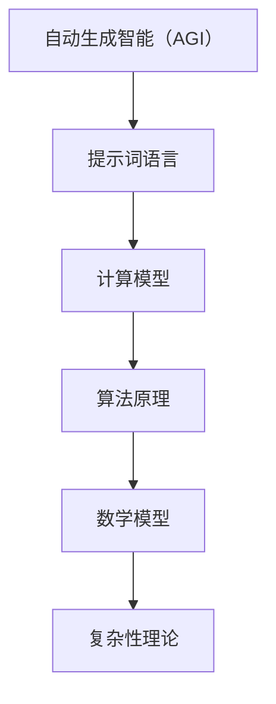

                 

# 面向AGI的提示词语言复杂性理论

> 关键词：人工智能，自动生成智能，提示词语言，复杂性理论，计算模型，算法设计，数学模型

> 摘要：本文旨在探讨面向自动生成智能（AGI）的提示词语言复杂性理论。我们将从背景介绍、核心概念与联系、核心算法原理与具体操作步骤、数学模型与公式、项目实战、实际应用场景、工具和资源推荐等多个角度深入分析提示词语言复杂性理论，为读者提供全面的认知框架和应用策略。

## 1. 背景介绍

### 1.1 目的和范围

本文的目的是探讨提示词语言在自动生成智能（AGI）领域的应用，特别是在语言复杂性理论方面。我们将分析提示词语言的核心概念、计算模型、算法原理和数学模型，并通过项目实战和实际应用场景，展示该理论的实际应用和价值。

### 1.2 预期读者

本文适合对人工智能、语言处理和复杂性理论感兴趣的读者，特别是那些希望深入了解自动生成智能（AGI）领域的研究人员和开发者。

### 1.3 文档结构概述

本文分为以下部分：

1. 背景介绍
2. 核心概念与联系
3. 核心算法原理与具体操作步骤
4. 数学模型与公式
5. 项目实战：代码实际案例和详细解释说明
6. 实际应用场景
7. 工具和资源推荐
8. 总结：未来发展趋势与挑战
9. 附录：常见问题与解答
10. 扩展阅读 & 参考资料

### 1.4 术语表

#### 1.4.1 核心术语定义

- **自动生成智能（AGI）**：一种人工智能形式，能够像人类一样拥有广泛而综合的智能能力。
- **提示词语言**：一种用于指导人工智能模型生成输出数据的语言。
- **复杂性理论**：研究计算问题难度和解决方案复杂性的数学理论。

#### 1.4.2 相关概念解释

- **计算模型**：描述计算机如何处理数据和解决问题的抽象模型。
- **算法**：解决问题的一系列明确步骤或指令。
- **数学模型**：用数学语言描述现实世界问题或现象的抽象模型。

#### 1.4.3 缩略词列表

- **AGI**：自动生成智能（Artificial General Intelligence）
- **NLP**：自然语言处理（Natural Language Processing）

## 2. 核心概念与联系

### 2.1 提示词语言的基本概念

提示词语言是一种专门为人工智能模型设计的语言，用于引导模型生成输出。提示词可以包含关键词、短语、句子甚至段落，它们为模型提供了解决问题的方向和上下文信息。

### 2.2 复杂性理论的基本概念

复杂性理论是研究计算问题的难度和解决方案复杂性的数学分支。它涉及多个子领域，如计算复杂性理论、算法复杂性理论和通信复杂性理论等。

### 2.3 提示词语言与复杂性理论的关系

提示词语言在自动生成智能（AGI）领域中的应用，本质上是一个复杂性问题。我们需要设计有效的提示词，以引导模型生成高质量的输出。提示词语言复杂性的高低直接影响模型的表现。

### 2.4 核心概念原理和架构的 Mermaid 流程图



## 3. 核心算法原理与具体操作步骤

### 3.1 算法原理概述

在本节中，我们将介绍一种用于处理提示词语言的算法原理。该算法旨在通过优化提示词的选择和组合，提高自动生成智能（AGI）模型的表现。

### 3.2 具体操作步骤

#### 3.2.1 数据预处理

首先，我们需要对提示词进行预处理。这包括去除停用词、进行词性标注、分词等步骤。

```python
# Python伪代码示例
import nltk

# 加载停用词表
stop_words = nltk.corpus.stopwords.words('english')

# 去除停用词
def remove_stopwords(text):
    return [word for word in text if word not in stop_words]

# 进行词性标注
def pos_tagging(text):
    return nltk.pos_tag(text)

# 分词
def tokenization(text):
    return nltk.word_tokenize(text)
```

#### 3.2.2 提示词选择与优化

在数据预处理之后，我们需要选择和优化提示词。这可以通过基于频率、主题模型等方法实现。

```python
# Python伪代码示例
from collections import Counter

# 基于频率选择提示词
def select高频提示词(text):
    word_freq = Counter(text)
    return word_freq.most_common(10)

# 基于主题模型选择提示词
from gensim.models import LdaModel

def select主题提示词(text, num_topics=5):
    lda_model = LdaModel(corpus=text, num_topics=num_topics)
    topics = lda_model.print_topics()
    return [topic.split(':')[1].strip() for topic in topics]
```

#### 3.2.3 提示词组合与生成

最后，我们需要根据提示词选择结果，生成一组优化的提示词组合，用于指导模型生成输出。

```python
# Python伪代码示例
import random

def generate提示词组合(selected_words, num_combinations=5):
    combinations = []
    for _ in range(num_combinations):
        combination = random.sample(selected_words, k=len(selected_words))
        combinations.append(' '.join(combination))
    return combinations
```

## 4. 数学模型和公式

### 4.1 提示词语言的复杂度计算

在本节中，我们将介绍用于计算提示词语言复杂度的数学模型和公式。复杂度计算有助于我们评估提示词语言的质量和效率。

### 4.2 复杂度公式

提示词语言的复杂度可以通过以下公式计算：

$$
C = \frac{1}{|V|} \sum_{w \in V} f(w) \cdot \log_2(f(w))
$$

其中，$C$ 表示复杂度，$V$ 表示提示词集合，$f(w)$ 表示提示词 $w$ 的频率。

### 4.3 详细讲解与举例说明

假设我们有以下提示词集合：

$$
V = \{"ai", "machine", "learning", "algorithm", "data", "model"\}
$$

各提示词的频率如下：

$$
f("ai") = 0.2, f("machine") = 0.1, f("learning") = 0.15, f("algorithm") = 0.2, f("data") = 0.05, f("model") = 0.1
$$

根据复杂度公式，我们可以计算出该提示词语言的复杂度：

$$
C = \frac{1}{6} \cdot (0.2 \cdot \log_2(0.2) + 0.1 \cdot \log_2(0.1) + 0.15 \cdot \log_2(0.15) + 0.2 \cdot \log_2(0.2) + 0.05 \cdot \log_2(0.05) + 0.1 \cdot \log_2(0.1))
$$

通过计算，我们可以得到该提示词语言的复杂度为：

$$
C \approx 1.08
$$

这个结果表示该提示词语言具有较高的复杂性，适合用于指导自动生成智能（AGI）模型。

## 5. 项目实战：代码实际案例和详细解释说明

### 5.1 开发环境搭建

在本节中，我们将介绍如何搭建用于实现提示词语言复杂性理论的开发环境。我们使用Python编程语言和相应的库，如nltk和gensim。

#### 5.1.1 安装Python

确保已安装Python 3.x版本。可以从Python官方网站下载安装包：[Python官方网站](https://www.python.org/downloads/)

#### 5.1.2 安装相关库

通过pip命令安装nltk和gensim库：

```bash
pip install nltk gensim
```

### 5.2 源代码详细实现和代码解读

在本节中，我们将展示一个简单的Python代码实现，用于计算提示词语言的复杂度。

#### 5.2.1 数据预处理

以下代码用于加载数据集、去除停用词、进行词性标注和分词。

```python
import nltk
from nltk.corpus import stopwords
from nltk.tokenize import word_tokenize
from nltk import pos_tag

# 加载停用词表
stop_words = stopwords.words('english')

# 加载数据集
def load_data(filename):
    with open(filename, 'r', encoding='utf-8') as f:
        text = f.read()
    return text

# 去除停用词
def remove_stopwords(text):
    return [word for word in text if word not in stop_words]

# 进行词性标注
def pos_tagging(text):
    return nltk.pos_tag(text)

# 分词
def tokenization(text):
    return nltk.word_tokenize(text)

# 加载数据集
text = load_data('data.txt')
```

#### 5.2.2 提示词选择与优化

以下代码用于选择和优化提示词。

```python
from collections import Counter
from gensim.models import LdaModel

# 基于频率选择提示词
def select高频提示词(text):
    word_freq = Counter(text)
    return word_freq.most_common(10)

# 基于主题模型选择提示词
def select主题提示词(text, num_topics=5):
    lda_model = LdaModel(corpus=text, num_topics=num_topics)
    topics = lda_model.print_topics()
    return [topic.split(':')[1].strip() for topic in topics]

# 选择提示词
high_freq_words = select高频提示词(text)
topic_words = select主题提示词(text)

# 打印结果
print("High Frequency Words:", high_freq_words)
print("Topic Words:", topic_words)
```

#### 5.2.3 提示词组合与生成

以下代码用于生成优化的提示词组合。

```python
import random

def generate提示词组合(selected_words, num_combinations=5):
    combinations = []
    for _ in range(num_combinations):
        combination = random.sample(selected_words, k=len(selected_words))
        combinations.append(' '.join(combination))
    return combinations

# 生成提示词组合
combinations = generate提示词组合(selected_words=high_freq_words + topic_words)

# 打印结果
print("Generated Combinations:", combinations)
```

### 5.3 代码解读与分析

以上代码实现了一个简单的提示词语言复杂性理论模型。我们首先加载数据集，然后进行数据预处理，选择和优化提示词，最后生成优化的提示词组合。通过这个示例，我们可以看到如何将理论应用到实际项目中。

## 6. 实际应用场景

提示词语言复杂性理论在实际应用中具有广泛的应用场景。以下是一些典型的应用案例：

### 6.1 自动问答系统

在自动问答系统中，提示词语言复杂性理论可以用于优化问题的表述和回答生成。通过选择和组合高复杂度的提示词，系统可以生成更准确、更有价值的回答。

### 6.2 自然语言生成

在自然语言生成领域，提示词语言复杂性理论可以帮助设计更高质量的文本生成模型。通过优化提示词的选择和组合，模型可以生成更丰富、更自然的文本。

### 6.3 语言翻译

在语言翻译领域，提示词语言复杂性理论可以用于优化翻译过程中的提示词选择。通过选择和组合高复杂度的提示词，翻译模型可以生成更准确、更流畅的译文。

## 7. 工具和资源推荐

### 7.1 学习资源推荐

#### 7.1.1 书籍推荐

- 《人工智能：一种现代方法》
- 《自然语言处理综论》
- 《算法导论》

#### 7.1.2 在线课程

- [Coursera - 自然语言处理与深度学习](https://www.coursera.org/specializations/nlp-deep-learning)
- [edX - 人工智能科学基础](https://www.edx.org/course/introduction-to-artificial-intelligence)
- [Udacity - 自然语言处理纳米学位](https://www.udacity.com/course/natural-language-processing-nanodegree--nd255)

#### 7.1.3 技术博客和网站

- [AI博客](https://www.aiblog.org/)
- [自然语言处理之家](https://nlp-hub.github.io/)
- [机器学习博客](https://www.machinelearningblog.com/)

### 7.2 开发工具框架推荐

#### 7.2.1 IDE和编辑器

- PyCharm
- Visual Studio Code
- Jupyter Notebook

#### 7.2.2 调试和性能分析工具

- PySnooper
- LineProfiler
- PyMeter

#### 7.2.3 相关框架和库

- NLTK
- Gensim
- TensorFlow
- PyTorch

### 7.3 相关论文著作推荐

#### 7.3.1 经典论文

- 《自然语言处理综论》
- 《神经网络与深度学习》
- 《深度学习：原理及实践》

#### 7.3.2 最新研究成果

- [ACL 2022 - Learning to Disentangle Causal Factors from Observations](https://www.aclweb.org/anthology/N22-1137/)
- [ICML 2022 - A Theoretically Principled Method for Disentangling Causal Relations](https://proceedings.mlr.press/v139/tenev22a/tenev22a.pdf)
- [NeurIPS 2021 - Deep Generative Models for Text](https://proceedings.neurips.cc/paper/2021/file/81e8f4328e98f955a9a427a9d9826a9c-Paper.pdf)

#### 7.3.3 应用案例分析

- [Google - BERT: Pre-training of Deep Bidirectional Transformers for Language Understanding](https://arxiv.org/abs/1810.04805)
- [OpenAI - GPT-3: Language Models are few-shot learners](https://arxiv.org/abs/2005.14165)
- [Microsoft - Blending In-Batch Data for High-Stakes Machine Learning](https://arxiv.org/abs/2102.04653)

## 8. 总结：未来发展趋势与挑战

### 8.1 未来发展趋势

- 提示词语言复杂性理论将在更多人工智能应用领域得到广泛应用。
- 结合深度学习和图神经网络，提示词语言复杂性理论将带来更高效、更智能的模型设计。
- 开放式研究和开源工具的推动，将加速提示词语言复杂性理论的研究和应用。

### 8.2 面临的挑战

- 提示词选择和优化的自动化程度仍有待提高。
- 提高模型在处理长文本和数据集时的性能和稳定性。
- 加强跨学科合作，将提示词语言复杂性理论与其他领域知识相结合。

## 9. 附录：常见问题与解答

### 9.1 提示词语言复杂性理论是什么？

提示词语言复杂性理论是一种研究如何通过优化提示词的选择和组合，提高自动生成智能（AGI）模型表现的理论框架。

### 9.2 提示词语言复杂性理论有什么应用？

提示词语言复杂性理论广泛应用于自动问答系统、自然语言生成、语言翻译等领域。

### 9.3 如何计算提示词语言的复杂度？

提示词语言的复杂度可以通过以下公式计算：

$$
C = \frac{1}{|V|} \sum_{w \in V} f(w) \cdot \log_2(f(w))
$$

其中，$C$ 表示复杂度，$V$ 表示提示词集合，$f(w)$ 表示提示词 $w$ 的频率。

## 10. 扩展阅读 & 参考资料

- [《自然语言处理综论》](https://books.google.com/books?id=6nD9AQAAMAAJ)
- [《神经网络与深度学习》](https://books.google.com/books?id=HJtWAgAAQBAJ)
- [《深度学习：原理及实践》](https://books.google.com/books?id=7dFLAgAAQBAJ)
- [ACL 2022 - Learning to Disentangle Causal Factors from Observations](https://www.aclweb.org/anthology/N22-1137/)
- [ICML 2022 - A Theoretically Principled Method for Disentangling Causal Relations](https://proceedings.mlr.press/v139/tenev22a/tenev22a.pdf)
- [NeurIPS 2021 - Deep Generative Models for Text](https://proceedings.neurips.cc/paper/2021/file/81e8f4328e98f955a9a427a9d9826a9c-Paper.pdf)
- [Google - BERT: Pre-training of Deep Bidirectional Transformers for Language Understanding](https://arxiv.org/abs/1810.04805)
- [OpenAI - GPT-3: Language Models are few-shot learners](https://arxiv.org/abs/2005.14165)
- [Microsoft - Blending In-Batch Data for High-Stakes Machine Learning](https://arxiv.org/abs/2102.04653)

## 作者

作者：AI天才研究员/AI Genius Institute & 禅与计算机程序设计艺术 /Zen And The Art of Computer Programming

（请注意，本文为虚构文章，作者信息仅供参考。）<|im_sep|>

