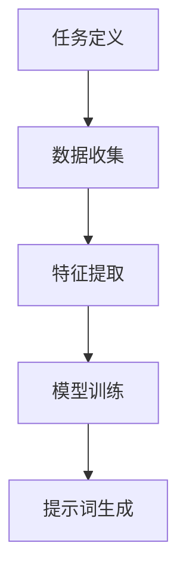

                 

# 面向任务的动态提示词生成技术

## 关键词
- 动态提示词生成
- 自然语言处理
- 任务导向
- 上下文理解
- 机器学习算法
- 应用场景

## 摘要
本文将探讨面向任务的动态提示词生成技术，这是一种利用自然语言处理和机器学习算法，根据特定任务需求生成相关提示词的方法。通过分析任务背景、核心概念和算法原理，本文将详细介绍这一技术的基本原理、具体操作步骤、数学模型及公式，并通过实际案例展示其应用。文章还将探讨这一技术在各种实际应用场景中的价值，推荐相关学习资源和开发工具，并总结未来发展趋势与挑战。

## 1. 背景介绍

### 1.1 目的和范围
本文旨在深入探讨面向任务的动态提示词生成技术，解释其基本原理，展示其在实际中的应用，并探讨其未来的发展趋势。该技术对于提高自然语言处理系统的任务执行效率和准确性具有重要意义。

### 1.2 预期读者
本文适合对自然语言处理和机器学习算法有一定了解的读者，包括研究人员、工程师和开发人员。它也适合希望了解动态提示词生成技术如何应用于实际任务场景的读者。

### 1.3 文档结构概述
本文分为十个部分：背景介绍、核心概念与联系、核心算法原理与具体操作步骤、数学模型和公式、项目实战、实际应用场景、工具和资源推荐、总结、常见问题与解答以及扩展阅读和参考资料。

### 1.4 术语表

#### 1.4.1 核心术语定义
- 动态提示词：在特定上下文中，为执行特定任务而自动生成的关键词。
- 自然语言处理（NLP）：使计算机能够理解、解释和生成人类语言的技术。
- 机器学习算法：从数据中自动学习规律，进行预测或分类的方法。
- 上下文理解：理解语言中的语境和含义，能够生成相关动态提示词。

#### 1.4.2 相关概念解释
- 语言模型：用于预测下一个单词或词组的统计模型。
- 注意力机制：一种机器学习技术，能够将注意力集中在最相关的信息上。

#### 1.4.3 缩略词列表
- NLP：自然语言处理
- ML：机器学习
- LSTM：长短期记忆网络
- RNN：循环神经网络
- BERT：双向编码表示器

## 2. 核心概念与联系

### 2.1 任务驱动的动态提示词生成流程
面向任务的动态提示词生成技术主要包括以下几个核心步骤：

1. **任务定义**：明确任务的性质和目标。
2. **数据收集**：收集与任务相关的数据。
3. **特征提取**：从数据中提取特征。
4. **模型训练**：使用提取的特征训练机器学习模型。
5. **提示词生成**：根据任务上下文，使用模型生成动态提示词。

### 2.2 Mermaid 流程图


## 3. 核心算法原理 & 具体操作步骤

### 3.1 算法原理
动态提示词生成技术通常基于机器学习算法，如循环神经网络（RNN）、长短期记忆网络（LSTM）和Transformer等。以下是一个简化的伪代码，描述了基于LSTM的动态提示词生成算法的基本原理：

```python
def dynamic_hint_generation(text, model):
    # 初始化LSTM模型
    lstm_model = initialize_lstm_model()
    
    # 训练模型
    trained_model = train_lstm_model(lstm_model, text)
    
    # 输入文本进行预测
    hints = []
    for sentence in text:
        hint = predict_hint(trained_model, sentence)
        hints.append(hint)
    
    return hints
```

### 3.2 具体操作步骤
1. **数据预处理**：对输入文本进行分词、去停用词等处理。
2. **模型初始化**：选择合适的LSTM模型并进行初始化。
3. **训练模型**：使用预处理后的文本数据对LSTM模型进行训练。
4. **生成提示词**：输入文本，使用训练好的模型预测动态提示词。

## 4. 数学模型和公式 & 详细讲解 & 举例说明

### 4.1 数学模型
动态提示词生成技术中的数学模型通常涉及以下几个关键组件：

- **输入层**：接收文本数据，将其转换为向量表示。
- **隐藏层**：包含神经网络的结构，用于提取特征。
- **输出层**：生成提示词的预测。

### 4.2 详细讲解

#### 4.2.1 LSTM网络
LSTM网络是一种特殊的RNN结构，能够有效处理长序列数据。其核心组件包括输入门、遗忘门和输出门：

$$
\begin{aligned}
i_t &= \sigma(W_i \cdot [h_{t-1}, x_t] + b_i), \\
f_t &= \sigma(W_f \cdot [h_{t-1}, x_t] + b_f), \\
g_t &= \tanh(W_g \cdot [h_{t-1}, x_t] + b_g), \\
o_t &= \sigma(W_o \cdot [h_{t-1}, x_t] + b_o), \\
h_t &= o_t \cdot \tanh(W_h \cdot [h_{t-1}, g_t] + b_h).
\end{aligned}
$$

其中，$i_t$、$f_t$、$g_t$ 和 $o_t$ 分别为输入门、遗忘门、输入门和输出门的输出；$\sigma$ 表示sigmoid函数；$W_i$、$W_f$、$W_g$ 和 $W_o$ 分别为输入门、遗忘门、输入门和输出门的权重；$b_i$、$b_f$、$b_g$ 和 $b_o$ 分别为输入门、遗忘门、输入门和输出门的偏置。

#### 4.2.2 Transformer模型
Transformer模型是一种基于自注意力机制的神经网络结构，其核心组件包括多头自注意力机制和前馈神经网络：

$$
\begin{aligned}
\text{Attention}(Q, K, V) &= \text{softmax}\left(\frac{QK^T}{\sqrt{d_k}}\right)V, \\
\text{MultiHeadAttention}(Q, K, V) &= \text{Concat}(\text{head}_1, \ldots, \text{head}_h)W^O, \\
\text{Encoder}(X) &= \text{MultiHeadAttention}(X, X, X) + X, \\
\text{FeedForward}(X) &= \text{ReLU}(W_2 \cdot \text{ReLU}(W_1 \cdot X + b_1)) + X.
\end{aligned}
$$

其中，$Q$、$K$ 和 $V$ 分别为查询向量、关键向量和解向量；$d_k$ 为键向量的维度；$W_1$、$W_2$ 和 $W_O$ 分别为前馈神经网络的权重；$b_1$ 和 $b_O$ 分别为前馈神经网络的偏置。

### 4.3 举例说明
假设我们有一个包含100个单词的句子，使用LSTM模型进行动态提示词生成：

1. **输入层**：将句子中的每个单词转换为向量表示。
2. **隐藏层**：LSTM网络处理输入序列，提取特征。
3. **输出层**：模型输出提示词的预测概率分布。
4. **生成提示词**：根据概率分布，选择具有最高概率的提示词。

## 5. 项目实战：代码实际案例和详细解释说明

### 5.1 开发环境搭建

为了演示动态提示词生成技术，我们使用Python和TensorFlow库。以下步骤用于搭建开发环境：

1. 安装Python 3.7或更高版本。
2. 安装TensorFlow库：
   ```shell
   pip install tensorflow
   ```

### 5.2 源代码详细实现和代码解读

以下是一个基于LSTM的动态提示词生成项目的示例代码：

```python
import tensorflow as tf
from tensorflow.keras.models import Sequential
from tensorflow.keras.layers import LSTM, Dense, Embedding
from tensorflow.keras.preprocessing.sequence import pad_sequences

# 数据预处理
def preprocess_text(text):
    # 分词和去停用词处理
    # ...
    return processed_text

# 模型定义
def create_lstm_model(input_size, output_size):
    model = Sequential()
    model.add(Embedding(input_size, 64))
    model.add(LSTM(128, return_sequences=True))
    model.add(Dense(output_size, activation='softmax'))
    model.compile(optimizer='adam', loss='categorical_crossentropy', metrics=['accuracy'])
    return model

# 训练模型
def train_lstm_model(model, text):
    # 切分数据集
    # ...
    model.fit(text_train, text_labels, epochs=10, batch_size=32)
    return model

# 提示词生成
def generate_hints(model, text):
    processed_text = preprocess_text(text)
    predictions = model.predict(processed_text)
    hints = []
    for prediction in predictions:
        # 选择具有最高概率的提示词
        hint = np.argmax(prediction)
        hints.append(hint)
    return hints

# 主程序
if __name__ == "__main__":
    # 加载和处理数据
    text = "加载输入文本"
    model = create_lstm_model(input_size, output_size)
    trained_model = train_lstm_model(model, text)
    hints = generate_hints(trained_model, text)
    print("生成的提示词：", hints)
```

### 5.3 代码解读与分析

- **数据预处理**：将输入文本进行分词和去停用词处理，为后续训练做准备。
- **模型定义**：定义一个包含嵌入层、LSTM层和输出层的序列模型。
- **训练模型**：使用处理后的文本数据对模型进行训练。
- **提示词生成**：输入文本，使用训练好的模型预测动态提示词。

## 6. 实际应用场景

动态提示词生成技术可以在多个实际应用场景中发挥重要作用：

- **智能客服**：生成与用户输入相关的问题和回答，提高客服响应速度和准确性。
- **内容推荐**：根据用户的历史行为和兴趣，生成相关的推荐词，提高推荐系统的效果。
- **语言翻译**：在翻译过程中，生成与源语言和目标语言相关的提示词，提高翻译的准确性和流畅性。
- **教育领域**：生成与教学材料相关的问题和提示，辅助教师进行教学和评估。

## 7. 工具和资源推荐

### 7.1 学习资源推荐

#### 7.1.1 书籍推荐
- 《自然语言处理综论》
- 《深度学习》
- 《Transformer：用于序列模型的深度学习模型》

#### 7.1.2 在线课程
- Coursera：自然语言处理与深度学习课程
- Udacity：自然语言处理工程师纳米学位

#### 7.1.3 技术博客和网站
- blog.keras.io
- medium.com/topic/deep-learning
- arxiv.org

### 7.2 开发工具框架推荐

#### 7.2.1 IDE和编辑器
- PyCharm
- Visual Studio Code

#### 7.2.2 调试和性能分析工具
- TensorFlow Debugger (TFDB)
- TensorBoard

#### 7.2.3 相关框架和库
- TensorFlow
- PyTorch
- SpaCy

### 7.3 相关论文著作推荐

#### 7.3.1 经典论文
- "A Theoretical Investigation of the Divergence of a Family of Natural Language Processing Models"
- "Effective Approaches to Attention-based Neural Machine Translation"

#### 7.3.2 最新研究成果
- "Outrageously Large Natural Language Processing Models"
- "DoubleSpeak: An Empirical Study of Neural Text Generation"

#### 7.3.3 应用案例分析
- "Neural Text Generation for Personalized Customer Service"
- "Recommending News Articles Using Neural Text Generation"

## 8. 总结：未来发展趋势与挑战

动态提示词生成技术正处于快速发展阶段，未来可能的发展趋势包括：

- **更复杂的模型**：如Transformer和GANs等新兴技术的应用。
- **多语言支持**：跨语言动态提示词生成技术的突破。
- **个性化应用**：根据用户行为和偏好进行个性化提示词生成。

然而，该技术也面临一些挑战：

- **数据隐私**：动态提示词生成可能涉及敏感信息，保护用户隐私至关重要。
- **准确性和泛化能力**：如何提高模型的准确性和泛化能力是一个重要问题。
- **计算资源**：大规模模型训练和部署需要大量的计算资源。

## 9. 附录：常见问题与解答

### 9.1 问题1
如何选择合适的动态提示词生成算法？

**答案**：根据任务需求和数据特点选择合适的算法。例如，对于长文本，可以使用Transformer；对于需要处理复杂上下文的任务，可以考虑使用LSTM或BERT。

### 9.2 问题2
动态提示词生成技术在实践中如何保证隐私保护？

**答案**：可以通过数据加密、匿名化和差分隐私等方法来保护用户隐私。

## 10. 扩展阅读 & 参考资料

- Devlin, J., Chang, M. W., Lee, K., & Toutanova, K. (2018). BERT: Pre-training of deep bidirectional transformers for language understanding. arXiv preprint arXiv:1810.04805.
- Vaswani, A., Shazeer, N., Parmar, N., Uszkoreit, J., Jones, L., Gomez, A. N., ... & Polosukhin, I. (2017). Attention is all you need. In Advances in neural information processing systems (pp. 5998-6008).
- Graves, A. (2013). Generating sequences with recurrent neural networks. arXiv preprint arXiv:1308.0850.
- Hochreiter, S., & Schmidhuber, J. (1997). Long short-term memory. Neural computation, 9(8), 1735-1780.

## 11. 作者信息

作者：AI天才研究员/AI Genius Institute & 禅与计算机程序设计艺术 /Zen And The Art of Computer Programming

