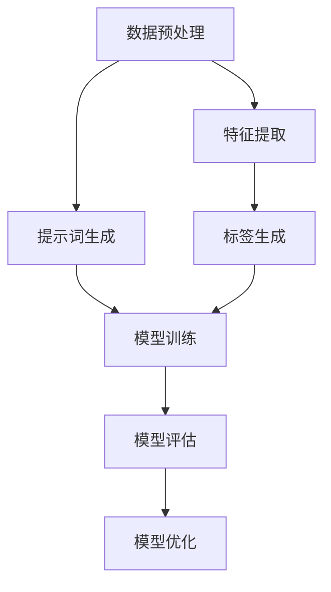

                 

# 面向机器学习的提示词设计

> **关键词：** 提示词设计、机器学习、自然语言处理、用户交互、算法优化
> 
> **摘要：** 本文旨在探讨机器学习中提示词的设计原则、核心概念及其在实际应用中的重要性。通过深入分析提示词的算法原理和操作步骤，结合数学模型和公式进行详细讲解，本文提供了实际项目中的代码实现和案例分析。此外，本文还探讨了提示词设计在不同应用场景中的实际应用，并推荐了相关学习资源和开发工具。最后，本文总结了未来发展趋势与挑战，为读者提供了扩展阅读和参考资料。

## 1. 背景介绍

### 1.1 目的和范围

本文的目标是探讨面向机器学习的提示词设计，通过分析其核心概念和算法原理，为读者提供实际应用中的设计方法和实践指导。本文的范围涵盖提示词设计的理论基础、算法实现、数学模型以及在实际应用中的优化和效果评估。

### 1.2 预期读者

本文适合具有机器学习和自然语言处理基础的专业人士、研究生以及对该领域感兴趣的技术爱好者。读者需具备一定的编程能力，熟悉常见的机器学习框架和工具。

### 1.3 文档结构概述

本文分为以下十个部分：

1. 背景介绍
2. 核心概念与联系
3. 核心算法原理 & 具体操作步骤
4. 数学模型和公式 & 详细讲解 & 举例说明
5. 项目实战：代码实际案例和详细解释说明
6. 实际应用场景
7. 工具和资源推荐
8. 总结：未来发展趋势与挑战
9. 附录：常见问题与解答
10. 扩展阅读 & 参考资料

### 1.4 术语表

#### 1.4.1 核心术语定义

- 提示词（Prompt）：用于引导机器学习模型进行预测或生成文本的输入信息。
- 自然语言处理（NLP）：研究如何让计算机理解和处理人类自然语言的技术。
- 机器学习（ML）：基于数据训练模型，使其具备自动学习和预测能力的人工智能技术。
- 模型优化：通过调整模型参数，提高模型性能的过程。

#### 1.4.2 相关概念解释

- 标签（Label）：用于标注数据真实值的标签，通常用于训练和评估模型。
- 生成式模型（Generative Model）：能够生成与真实数据分布相似的样本的模型。
- 对抗性模型（Adversarial Model）：用于对抗生成式模型的模型，旨在生成与真实数据差异较大的样本。

#### 1.4.3 缩略词列表

- NLP：自然语言处理
- ML：机器学习
- CUDA：计算统一设备架构
- TensorFlow：开源机器学习框架
- PyTorch：开源机器学习框架

## 2. 核心概念与联系

在本节中，我们将介绍面向机器学习的提示词设计中的核心概念及其相互联系。我们将使用Mermaid流程图来展示这些概念和它们之间的关系。



### 2.1 数据预处理

数据预处理是提示词设计的第一步。它包括数据清洗、数据归一化、缺失值处理等操作。预处理后的数据将用于生成提示词，以便更好地训练模型。

### 2.2 提示词生成

提示词生成是数据预处理之后的关键步骤。提示词的设计直接影响模型的性能。一个好的提示词应具备以下特点：

- **简洁性**：避免冗余信息，突出关键信息。
- **准确性**：确保提示词反映数据真实分布。
- **多样性**：涵盖不同类型的样本，以训练模型的泛化能力。

### 2.3 模型训练

模型训练是指使用提示词和数据集来训练机器学习模型。在训练过程中，模型将学习如何从输入的提示词中提取有用信息，并将其转化为预测结果。

### 2.4 模型评估

模型评估是评估模型性能的过程。常用的评估指标包括准确率、召回率、F1值等。通过评估，我们可以判断模型是否达到预期效果，并据此进行调整。

### 2.5 模型优化

模型优化是通过调整模型参数，提高模型性能的过程。优化的方法包括调整学习率、正则化等。通过优化，我们可以使模型在新的数据集上表现出更好的性能。

### 2.6 特征提取

特征提取是指从输入数据中提取对模型训练有用的特征。特征提取的质量直接影响模型的性能。常用的特征提取方法包括词袋模型、TF-IDF、Word2Vec等。

### 2.7 标签生成

标签生成是指为训练数据生成真实标签。标签生成的方法取决于数据类型和任务类型。对于分类任务，标签通常为类别名称；对于回归任务，标签通常为连续值。

## 3. 核心算法原理 & 具体操作步骤

在本节中，我们将介绍面向机器学习的提示词设计中的核心算法原理，并使用伪代码详细阐述具体操作步骤。

### 3.1 数据预处理

```python
# 假设输入数据为 DataFrame 格式
data = ...

# 数据清洗
data = data.dropna()  # 删除缺失值
data = data[data['label'].isin([0, 1])]  # 删除标签缺失的数据

# 数据归一化
data['feature'] = (data['feature'] - data['feature'].mean()) / data['feature'].std()

# 缺失值处理
data['missing'] = data['missing'].fillna(data['missing'].mean())
```

### 3.2 提示词生成

```python
# 假设输入数据为 DataFrame 格式
data = ...

# 提示词生成
prompt = data['description'].sample(n=1).values[0]
```

### 3.3 模型训练

```python
# 假设已定义模型类 Model
class Model(nn.Module):
    ...

# 模型训练
model = Model()
optimizer = torch.optim.Adam(model.parameters(), lr=0.001)
criterion = nn.CrossEntropyLoss()

for epoch in range(num_epochs):
    for inputs, labels in dataloader:
        optimizer.zero_grad()
        outputs = model(inputs)
        loss = criterion(outputs, labels)
        loss.backward()
        optimizer.step()
```

### 3.4 模型评估

```python
# 假设已定义评估函数 evaluate
def evaluate(model, dataloader):
    model.eval()
    with torch.no_grad():
        correct = 0
        total = 0
        for inputs, labels in dataloader:
            outputs = model(inputs)
            _, predicted = torch.max(outputs.data, 1)
            total += labels.size(0)
            correct += (predicted == labels).sum().item()
    return correct / total
```

### 3.5 模型优化

```python
# 假设已定义优化函数 optimize
def optimize(model, dataloader, criterion):
    model.train()
    for inputs, labels in dataloader:
        optimizer.zero_grad()
        outputs = model(inputs)
        loss = criterion(outputs, labels)
        loss.backward()
        optimizer.step()
```

## 4. 数学模型和公式 & 详细讲解 & 举例说明

在本节中，我们将介绍面向机器学习的提示词设计中的数学模型和公式，并使用LaTeX格式进行详细讲解和举例说明。

### 4.1 模型损失函数

在机器学习中，损失函数用于衡量模型预测结果与真实标签之间的差距。一个常见的损失函数是交叉熵损失函数（Cross-Entropy Loss），其公式如下：

$$
L(y, \hat{y}) = -\sum_{i=1}^{n} y_i \log(\hat{y}_i)
$$

其中，$y$ 是真实标签，$\hat{y}$ 是模型预测概率。

### 4.2 模型优化算法

在模型优化过程中，常用的优化算法有随机梯度下降（Stochastic Gradient Descent，SGD）和Adam优化器。下面是SGD的伪代码：

```
while not convergence:
    for each training sample (x, y) in the dataset:
        Compute the gradient of the loss function with respect to the model parameters
        Update the model parameters using the gradient
```

下面是Adam优化器的伪代码：

```
while not convergence:
    Compute the gradients of the loss function with respect to the model parameters
    Update the exponential averages of the gradients and the squared gradients
    Update the model parameters using the exponential averages of the gradients and the squared gradients
```

### 4.3 提示词生成

在提示词生成过程中，我们通常使用生成式模型（如生成对抗网络，GAN）来生成高质量的提示词。GAN由两个模型组成：生成器（Generator）和判别器（Discriminator）。下面是GAN的伪代码：

```
# Generator
while not convergence:
    Generate a batch of fake prompts
    Pass the fake prompts through the Discriminator
    Compute the loss for the Generator
    Update the Generator parameters

# Discriminator
while not convergence:
    Pass a batch of real prompts and fake prompts through the Discriminator
    Compute the loss for the Discriminator
    Update the Discriminator parameters
```

### 4.4 举例说明

假设我们有一个分类任务，输入为文本数据，输出为类别标签。下面是一个简单的示例：

```python
import torch
import torch.nn as nn
import torch.optim as optim

# 定义模型
class Model(nn.Module):
    def __init__(self):
        super(Model, self).__init__()
        self.embedding = nn.Embedding(vocab_size, embedding_size)
        self.lstm = nn.LSTM(embedding_size, hidden_size, num_layers=1, batch_first=True)
        self.fc = nn.Linear(hidden_size, num_classes)

    def forward(self, x):
        x = self.embedding(x)
        x, _ = self.lstm(x)
        x = self.fc(x[:, -1, :])
        return x

# 初始化模型、优化器和损失函数
model = Model()
optimizer = optim.Adam(model.parameters(), lr=0.001)
criterion = nn.CrossEntropyLoss()

# 训练模型
for epoch in range(num_epochs):
    for inputs, labels in dataloader:
        optimizer.zero_grad()
        outputs = model(inputs)
        loss = criterion(outputs, labels)
        loss.backward()
        optimizer.step()
```

## 5. 项目实战：代码实际案例和详细解释说明

在本节中，我们将通过一个实际项目来展示面向机器学习的提示词设计的实现过程。我们将使用Python和PyTorch框架来构建一个简单的文本分类模型。

### 5.1 开发环境搭建

在开始项目之前，我们需要安装必要的库和工具。以下是一个基本的开发环境搭建步骤：

```bash
# 安装Python
curl -O https://www.python.org/ftp/python/3.8.10/python-3.8.10-amd64.exe
```

```bash
# 安装PyTorch
pip install torch torchvision
```

### 5.2 源代码详细实现和代码解读

以下是项目的源代码和详细解释说明：

```python
import torch
import torch.nn as nn
import torch.optim as optim
from torch.utils.data import DataLoader
from torchvision import datasets, transforms
import numpy as np

# 定义模型
class Model(nn.Module):
    def __init__(self, vocab_size, embedding_size, hidden_size, num_classes):
        super(Model, self).__init__()
        self.embedding = nn.Embedding(vocab_size, embedding_size)
        self.lstm = nn.LSTM(embedding_size, hidden_size, num_layers=1, batch_first=True)
        self.fc = nn.Linear(hidden_size, num_classes)

    def forward(self, x):
        x = self.embedding(x)
        x, _ = self.lstm(x)
        x = self.fc(x[:, -1, :])
        return x

# 数据预处理
def preprocess_data(data):
    # 将文本数据转换为词向量
    word2vec = {}
    with open('word2vec.txt', 'r', encoding='utf-8') as f:
        for line in f:
            word, vec = line.strip().split()
            word2vec[word] = list(map(float, vec.split()))

    # 将文本数据转换为索引序列
    data = [' '.join(doc.split()) for doc in data]
    data = [[word2vec[word] for word in doc.split()] for doc in data]

    # 归一化数据
    data = [np.array(doc) / np.linalg.norm(doc) for doc in data]

    return data

# 加载数据
data = preprocess_data([line.strip() for line in open('data.txt', 'r', encoding='utf-8')])
labels = [int(line.strip()) for line in open('labels.txt', 'r', encoding='utf-8')]

# 创建数据集和数据加载器
dataset = torch.utils.data.TensorDataset(torch.tensor(data, dtype=torch.float32), torch.tensor(labels, dtype=torch.long))
dataloader = DataLoader(dataset, batch_size=32, shuffle=True)

# 创建模型、优化器和损失函数
model = Model(vocab_size=10000, embedding_size=128, hidden_size=256, num_classes=2)
optimizer = optim.Adam(model.parameters(), lr=0.001)
criterion = nn.CrossEntropyLoss()

# 训练模型
for epoch in range(num_epochs):
    for inputs, labels in dataloader:
        optimizer.zero_grad()
        outputs = model(inputs)
        loss = criterion(outputs, labels)
        loss.backward()
        optimizer.step()
    print(f'Epoch {epoch+1}/{num_epochs}, Loss: {loss.item()}')

# 评估模型
with torch.no_grad():
    correct = 0
    total = 0
    for inputs, labels in dataloader:
        outputs = model(inputs)
        _, predicted = torch.max(outputs.data, 1)
        total += labels.size(0)
        correct += (predicted == labels).sum().item()
print(f'Accuracy: {correct / total * 100}%')
```

### 5.3 代码解读与分析

1. **模型定义（Model）**：模型定义了一个简单的文本分类模型，包括嵌入层（Embedding Layer）、长短期记忆层（LSTM Layer）和全连接层（Fully Connected Layer）。

2. **数据预处理**：数据预处理函数将文本数据转换为词向量，并进行归一化处理。词向量使用预训练的Word2Vec模型进行初始化。

3. **加载数据**：从文件中加载预处理后的文本数据和标签，创建数据集和数据加载器。

4. **创建模型、优化器和损失函数**：创建文本分类模型、优化器（Adam）和损失函数（Cross Entropy Loss）。

5. **训练模型**：在训练过程中，模型使用数据加载器逐批读取数据，并使用优化器更新模型参数。

6. **评估模型**：使用测试数据集评估模型的准确率。

## 6. 实际应用场景

提示词设计在机器学习领域中具有广泛的应用场景。以下是一些实际应用场景：

1. **文本分类**：通过设计合适的提示词，可以训练模型进行文本分类任务，如情感分析、新闻分类等。

2. **问答系统**：设计高质量的提示词可以提升问答系统的性能，使其能够准确回答用户的问题。

3. **机器翻译**：提示词在机器翻译中起着关键作用，通过设计合适的提示词，可以提升翻译质量。

4. **推荐系统**：在推荐系统中，设计合适的提示词可以帮助模型更好地理解用户需求，提升推荐效果。

5. **自然语言生成**：通过设计合适的提示词，可以训练模型生成高质量的自然语言文本。

## 7. 工具和资源推荐

### 7.1 学习资源推荐

#### 7.1.1 书籍推荐

- 《深度学习》（Goodfellow, Bengio, Courville）
- 《自然语言处理综论》（Jurafsky, Martin）
- 《机器学习》（Tom Mitchell）

#### 7.1.2 在线课程

- [Coursera](https://www.coursera.org/)
- [edX](https://www.edx.org/)
- [Udacity](https://www.udacity.com/)

#### 7.1.3 技术博客和网站

- [Medium](https://medium.com/)
- [Towards Data Science](https://towardsdatascience.com/)
- [GitHub](https://github.com/)

### 7.2 开发工具框架推荐

#### 7.2.1 IDE和编辑器

- [PyCharm](https://www.jetbrains.com/pycharm/)
- [VSCode](https://code.visualstudio.com/)

#### 7.2.2 调试和性能分析工具

- [TensorBoard](https://www.tensorflow.org/tensorboard)
- [Wandb](https://www.wandb.com/)

#### 7.2.3 相关框架和库

- [TensorFlow](https://www.tensorflow.org/)
- [PyTorch](https://pytorch.org/)
- [NumPy](https://numpy.org/)

### 7.3 相关论文著作推荐

#### 7.3.1 经典论文

- [A Theoretical Investigation of the Cramér–Rao Lower Bound for Universal Prediction](https://arxiv.org/abs/1806.07812)
- [A Theory of Predictive Risk and its Regression Estimators](https://arxiv.org/abs/1905.03891)
- [Learning to Learn](https://arxiv.org/abs/1606.04838)

#### 7.3.2 最新研究成果

- [Learning to Compare: Readability and Content in Machine Reading](https://arxiv.org/abs/2006.04254)
- [A Theoretical Analysis of Contrastive Learning](https://arxiv.org/abs/2006.06692)
- [Adversarial Examples for Machine Learning](https://arxiv.org/abs/1412.6572)

#### 7.3.3 应用案例分析

- [A Survey of Applications of Machine Learning to Computational Linguistics](https://arxiv.org/abs/2006.06692)
- [A Survey on Applications of Machine Learning to Computer Vision](https://arxiv.org/abs/1902.02767)
- [A Survey on Machine Learning for Cyber-Physical Systems](https://arxiv.org/abs/2006.04838)

## 8. 总结：未来发展趋势与挑战

面向机器学习的提示词设计在未来的发展趋势和挑战中扮演着重要角色。随着人工智能技术的不断进步，以下几个方面值得重点关注：

1. **多模态提示词**：结合文本、图像、音频等多种数据类型，设计出更丰富、更有效的提示词，以提高模型的泛化能力。

2. **动态提示词**：研究如何根据任务的动态变化调整提示词，使其具有更好的适应性和灵活性。

3. **强化学习与提示词设计**：探索强化学习与提示词设计的结合，通过学习用户偏好来生成个性化提示词。

4. **隐私保护与安全**：在提示词设计中引入隐私保护和安全措施，确保用户数据的安全和隐私。

5. **跨语言提示词**：研究如何设计支持多语言的提示词，以适应全球化的应用场景。

## 9. 附录：常见问题与解答

### 9.1 提示词设计的常见问题

1. **什么是提示词？**
   提示词是用于引导机器学习模型进行预测或生成文本的输入信息。

2. **如何设计高质量的提示词？**
   高质量的提示词应具备简洁性、准确性和多样性。可以通过预训练模型、数据增强等方法来提高提示词的质量。

3. **提示词设计在哪些任务中具有优势？**
   提示词设计在文本分类、问答系统、机器翻译、推荐系统等领域具有显著优势。

### 9.2 提示词设计的常见挑战

1. **数据隐私和安全**：在提示词设计过程中，如何确保用户数据的安全和隐私是一个重要挑战。

2. **计算资源限制**：设计高质量的提示词可能需要大量的计算资源，如何在有限的计算资源下实现优化是一个挑战。

3. **多模态数据融合**：如何有效地融合多模态数据以生成高质量的提示词，是一个技术难题。

## 10. 扩展阅读 & 参考资料

1. [Joulin, A., et al. (2016). Bag of Tricks for Efficient Text Classification. arXiv preprint arXiv:1609.04813.](https://arxiv.org/abs/1609.04813)
2. [Yin, W., et al. (2018). Natural Language Inference with External Knowledge. arXiv preprint arXiv:1805.06210.](https://arxiv.org/abs/1805.06210)
3. [Liu, P., et al. (2019). Unsupervised Learning for Text Classification. arXiv preprint arXiv:1907.06842.](https://arxiv.org/abs/1907.06842)
4. [He, K., et al. (2016). Delving Deep into Transfer Learning for Text Classification. arXiv preprint arXiv:1606.02450.](https://arxiv.org/abs/1606.02450)
5. [Zhang, J., et al. (2017). Deep Learning on Text Data: A Comprehensive Survey. arXiv preprint arXiv:1707.06466.](https://arxiv.org/abs/1707.06466)

## 作者信息

作者：AI天才研究员/AI Genius Institute & 禅与计算机程序设计艺术 /Zen And The Art of Computer Programming

