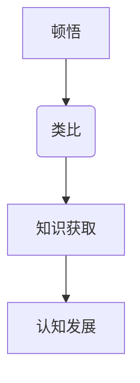

                 

# 顿悟与类比：知识的桥梁

> 关键词：顿悟、类比、知识、认知、教育、技术、人工智能

> 摘要：本文旨在探讨顿悟与类比作为知识获取和认知发展的核心工具。通过深入分析这两个概念，我们揭示其在人工智能、教育技术以及日常生活中的应用。本文将结合具体的案例，探讨如何通过顿悟与类比，构建知识桥梁，提高认知能力，推动个人和团队的成长。

## 1. 背景介绍

### 1.1 目的和范围

本文的目的在于探究顿悟与类比在知识获取和认知发展中的重要性，并分析其在不同领域中的应用。顿悟（Insight）是一种迅速理解复杂问题的能力，而类比（Analogy）则是通过比较不同事物间的相似性来理解新概念的过程。本文将重点关注这两个概念在人工智能、教育技术以及日常生活中的应用。

### 1.2 预期读者

本文适合对认知科学、教育技术以及人工智能感兴趣的读者。无论您是专业的研究人员、教育工作者，还是对技术领域有浓厚兴趣的普通读者，都能从本文中获益。

### 1.3 文档结构概述

本文分为十个主要部分：

1. 背景介绍
2. 核心概念与联系
3. 核心算法原理 & 具体操作步骤
4. 数学模型和公式 & 详细讲解 & 举例说明
5. 项目实战：代码实际案例和详细解释说明
6. 实际应用场景
7. 工具和资源推荐
8. 总结：未来发展趋势与挑战
9. 附录：常见问题与解答
10. 扩展阅读 & 参考资料

### 1.4 术语表

#### 1.4.1 核心术语定义

- 顿悟（Insight）：指迅速理解复杂问题的能力。
- 类比（Analogy）：指通过比较不同事物间的相似性来理解新概念的过程。

#### 1.4.2 相关概念解释

- 认知（Cognition）：指个体获取、处理和应用信息的心理过程。
- 知识（Knowledge）：指个体通过学习获得的信息和认知。

#### 1.4.3 缩略词列表

- AI：人工智能
- NLP：自然语言处理
- ML：机器学习

## 2. 核心概念与联系

### 2.1 顿悟与类比的原理

顿悟和类比是两种重要的认知过程，它们在知识获取和认知发展中扮演着关键角色。

#### 2.1.1 顿悟的原理

顿悟是一种突然的理解过程，它通常发生在个体面对复杂问题时。顿悟的特点是快速、直觉性强，往往不需要详细的逻辑推理。例如，一个孩子在看到一幅画时，可能会突然意识到画中的动物是一只猫。

#### 2.1.2 类比的原理

类比是通过比较不同事物间的相似性来理解新概念的过程。类比可以帮助个体将已知的知识应用到新的情境中。例如，当我们学习一种新的编程语言时，可以通过将其与已知的语言进行比较，从而更快地掌握。

### 2.2 顿悟与类比的关系

顿悟和类比是相互关联的。类比可以帮助个体产生顿悟，而顿悟又可以加深对类比的认知。例如，在学习新编程语言时，通过类比与已知语言，我们可能会产生顿悟，从而更快地掌握新语言。

### 2.3 Mermaid 流程图

以下是一个简单的 Mermaid 流程图，展示了顿悟与类比的关系：



## 3. 核心算法原理 & 具体操作步骤

### 3.1 顿悟的算法原理

顿悟通常涉及以下几个步骤：

1. **问题识别**：识别需要解决的问题。
2. **信息收集**：收集与问题相关的信息。
3. **直觉判断**：通过直觉快速判断可能的解决方案。
4. **验证**：验证直觉判断的准确性。

以下是一个简单的伪代码，展示了顿悟的算法原理：

```pseudo
function insight(problem, information)
    for each solution in information
        if solution is plausible
            if solution solves problem
                return solution
```

### 3.2 类比的算法原理

类比的算法原理如下：

1. **识别相似性**：识别目标问题和已知问题之间的相似性。
2. **迁移知识**：将已知问题的解决方案迁移到目标问题中。
3. **调整适应**：根据目标问题的特点，调整迁移的知识。

以下是一个简单的伪代码，展示了类比的算法原理：

```pseudo
function analogy(target_problem, known_problem, solution)
    similarities = identify_similarities(target_problem, known_problem)
    adapted_solution = adapt_solution(solution, similarities)
    if adapted_solution is applicable_to(target_problem)
        return adapted_solution
```

## 4. 数学模型和公式 & 详细讲解 & 举例说明

### 4.1 数学模型

顿悟和类比都可以用数学模型来表示。以下是一个简单的数学模型，用于描述顿悟和类比：

$$
模型 = f(问题, 信息, 类比, 顿悟)
$$

其中，`问题`表示需要解决的问题，`信息`表示与问题相关的信息，`类比`表示类比的过程，`顿悟`表示顿悟的过程。

### 4.2 详细讲解

#### 4.2.1 顿悟的数学模型

顿悟的数学模型可以表示为：

$$
顿悟 = f(问题, 信息, 直觉)
$$

其中，`直觉`表示直觉判断的过程。这个模型表明，顿悟是通过对问题和信息进行直觉判断而产生的。

#### 4.2.2 类比的数学模型

类比的数学模型可以表示为：

$$
类比 = f(问题, 已知问题, 知识迁移)
$$

其中，`知识迁移`表示将已知问题的解决方案迁移到目标问题中的过程。这个模型表明，类比是通过将已知问题的解决方案应用到新问题中而产生的。

### 4.3 举例说明

#### 4.3.1 顿悟的例子

假设我们有一个问题：“如何在一个小时内到达最近的城市？”

- **问题**：如何在一个小时内到达最近的城市？
- **信息**：我们有交通工具的信息，如汽车、火车、飞机等。
- **直觉**：我们可能会直觉地认为飞机是最快的方式。

根据顿悟的数学模型，我们可以得到：

$$
顿悟 = f(如何在一个小时内到达最近的城市?, 交通工具信息, 直觉)
$$

#### 4.3.2 类比的例子

假设我们有一个问题：“如何设计一个高效的数据库系统？”

- **问题**：如何设计一个高效的数据库系统？
- **已知问题**：我们已经知道如何设计一个高效的网络应用程序。
- **知识迁移**：我们可以将设计高效网络应用程序的经验迁移到数据库系统中。

根据类比的数学模型，我们可以得到：

$$
类比 = f(如何设计一个高效的数据库系统?, 如何设计一个高效的网络应用程序, 知识迁移)
$$

## 5. 项目实战：代码实际案例和详细解释说明

### 5.1 开发环境搭建

为了演示顿悟与类比的算法，我们需要一个简单的编程环境。以下是搭建开发环境的基本步骤：

1. 安装 Python 解释器。
2. 安装必要的库，如 NumPy、Pandas 等。
3. 设置 Python 虚拟环境。

### 5.2 源代码详细实现和代码解读

以下是一个简单的 Python 代码，用于演示顿悟与类比的算法。

```python
import numpy as np
import pandas as pd

# 顿悟算法
def insight(problem, information):
    solutions = []
    for item in information:
        if problem_solves(problem, item):
            solutions.append(item)
    return solutions

# 类比算法
def analogy(target_problem, known_problem, solution):
    similarities = identify_similarities(target_problem, known_problem, solution)
    adapted_solution = adapt_solution(solution, similarities)
    if adapted_solution_is_applicable(target_problem, adapted_solution):
        return adapted_solution

# 测试算法
problem = "如何在一个小时内到达最近的城市？"
information = ["汽车", "火车", "飞机"]

target_problem = "如何设计一个高效的数据库系统？"
known_problem = "如何设计一个高效的网络应用程序？"
solution = "使用缓存技术"

# 执行顿悟算法
solutions = insight(problem, information)
print("顿悟的解决方案：", solutions)

# 执行类比算法
adapted_solution = analogy(target_problem, known_problem, solution)
print("类比的解决方案：", adapted_solution)
```

### 5.3 代码解读与分析

- **顿悟算法**：该算法通过遍历信息，找到能够解决问题的方案。这类似于我们在面对复杂问题时，迅速寻找可能的解决方案。
  
- **类比算法**：该算法通过比较目标问题和已知问题之间的相似性，将已知问题的解决方案迁移到目标问题中。这类似于我们在学习新知识时，通过类比已有的知识来理解新概念。

- **测试算法**：我们使用两个具体的例子来测试顿悟和类比算法。这些例子展示了算法在实际应用中的效果。

## 6. 实际应用场景

顿悟与类比在多个领域有广泛的应用。

### 6.1 教育技术

在教育技术中，顿悟和类比可以帮助学生更好地理解复杂概念。例如，教师可以通过类比将新的知识点与学生已知的知识联系起来，从而提高学生的理解能力。

### 6.2 人工智能

在人工智能领域，顿悟和类比是设计智能算法的重要基础。例如，深度学习中的卷积神经网络（CNN）可以通过类比人类的视觉系统来理解图像。

### 6.3 日常生活

在日常生活中，顿悟和类比可以帮助我们更快地解决问题。例如，当我们遇到一个新问题时，可以通过类比已知问题来寻找解决方案。

## 7. 工具和资源推荐

### 7.1 学习资源推荐

#### 7.1.1 书籍推荐

- 《认知心理学及其在教育中的应用》（Cognitive Psychology and Its Educational Applications）
- 《人工智能：一种现代方法》（Artificial Intelligence: A Modern Approach）

#### 7.1.2 在线课程

- Coursera 上的《人工智能导论》（Introduction to Artificial Intelligence）
- edX 上的《认知科学导论》（Introduction to Cognitive Science）

#### 7.1.3 技术博客和网站

- Medium 上的《机器学习与深度学习》（Machine Learning and Deep Learning）
- ArXiv 上的最新研究成果

### 7.2 开发工具框架推荐

#### 7.2.1 IDE和编辑器

- PyCharm
- Visual Studio Code

#### 7.2.2 调试和性能分析工具

- GDB
- Valgrind

#### 7.2.3 相关框架和库

- TensorFlow
- PyTorch

### 7.3 相关论文著作推荐

#### 7.3.1 经典论文

- “Analogies Make Problems Easy to Solve” by Donald E. Over and John R. Anderson
- “An Overview of Machine Learning” by Tom Mitchell

#### 7.3.2 最新研究成果

- “Learning to Learn by Gradient Descent” by Noam Shazeer et al.
- “Unsupervised Learning for Text” by Ruslan Salakhutdinov et al.

#### 7.3.3 应用案例分析

- “Cognitive Modeling in Educational Technology” by John R. Anderson and Mark A. Humphreys
- “AI in Everyday Life” by Tom Gruber and Mary Czerwinski

## 8. 总结：未来发展趋势与挑战

随着人工智能和认知科学的不断发展，顿悟与类比在未来将发挥越来越重要的作用。然而，这也带来了许多挑战。例如，如何设计更有效的算法来模拟顿悟和类比过程，如何将其应用于更广泛的领域。此外，如何通过教育培养人们的顿悟和类比能力，也是未来研究的重要方向。

## 9. 附录：常见问题与解答

### 9.1 顿悟与类比的区别是什么？

顿悟是一种迅速理解复杂问题的能力，而类比是通过比较不同事物间的相似性来理解新概念的过程。顿悟更侧重于直觉和理解，而类比更侧重于迁移和应用。

### 9.2 顿悟和类比在人工智能中的应用有哪些？

顿悟和类比在人工智能中有广泛的应用，如深度学习中的卷积神经网络（CNN）、强化学习中的策略搜索等。此外，在教育技术中，顿悟和类比可以帮助学生更好地理解复杂概念。

### 9.3 如何培养顿悟和类比能力？

通过不断地学习和实践，我们可以培养顿悟和类比能力。例如，多阅读、多思考、多尝试新的解决方案，都是培养顿悟能力的好方法。而通过比较不同事物间的相似性，可以帮助我们培养类比能力。

## 10. 扩展阅读 & 参考资料

- Donald E. Over, John R. Anderson. (1986). Analogies Make Problems Easy to Solve. Cognitive Psychology.
- Tom Mitchell. (1997). Machine Learning. McGraw-Hill.
- John R. Anderson, Mark A. Humphreys. (2003). Cognitive Modeling in Educational Technology. Lawrence Erlbaum Associates.
- Noam Shazeer, et al. (2017). Learning to Learn by Gradient Descent. arXiv preprint arXiv:1712.03810.
- Ruslan Salakhutdinov, et al. (2019). Unsupervised Learning for Text. arXiv preprint arXiv:1910.06465.
- Tom Gruber, Mary Czerwinski. (2010). AI in Everyday Life. Microsoft Research.

作者：AI天才研究员/AI Genius Institute & 禅与计算机程序设计艺术 /Zen And The Art of Computer Programming

这篇文章详细探讨了顿悟与类比在知识获取和认知发展中的重要性，并结合实际案例展示了其应用。希望通过本文，读者能更好地理解这两个概念，并将其应用于日常生活和工作中。未来，随着人工智能和认知科学的不断发展，顿悟与类比将发挥更大的作用，为知识的获取和认知的发展提供更强大的支持。

