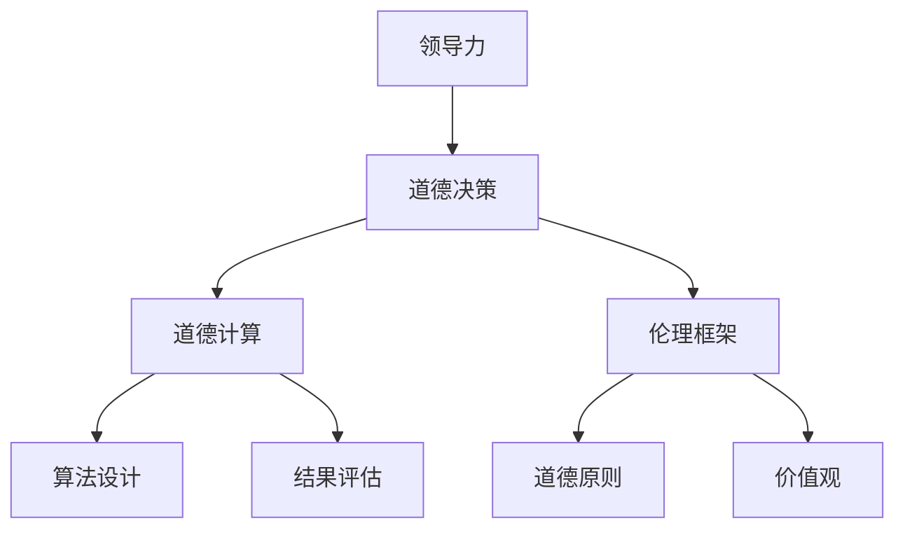

                 

# 领导力与伦理决策：在道德困境中把握方向

> **关键词：**领导力、伦理决策、道德困境、道德计算、AI伦理、社会影响力
>
> **摘要：**本文将深入探讨领导力与伦理决策的关系，特别是在道德困境中如何做出正确的选择。文章首先介绍了领导力和伦理决策的基本概念，随后通过具体的案例分析，展示了如何运用道德计算和伦理框架来指导实际决策。同时，文章还分析了在技术应用中面临的伦理挑战，以及如何通过教育和制度来提升伦理素养。最后，文章总结了未来在领导力和伦理决策领域的发展趋势和挑战，为读者提供了有益的思考和指导。

## 1. 背景介绍

### 1.1 目的和范围

在当今快速变化的社会和技术环境中，领导力和伦理决策的重要性日益凸显。领导力不仅仅关乎个人魅力和管理技巧，更涉及到如何在复杂多变的环境中做出符合道德和伦理标准的决策。伦理决策则涉及到道德原则和价值观的应用，特别是在面对道德困境时如何保持正确的方向。

本文旨在探讨领导力与伦理决策的内在联系，分析道德困境中决策过程的复杂性和挑战，并提供一系列实用的工具和策略。文章将首先回顾领导力和伦理决策的基本概念，然后通过具体的案例分析，展示如何在实际工作中应用道德计算和伦理框架。此外，文章还将探讨在技术应用中面临的伦理挑战，并分析如何通过教育和制度来提升伦理素养。

本文的内容范围包括：

- 领导力和伦理决策的基本概念和理论框架
- 道德困境的类型和常见案例分析
- 道德计算和伦理框架的应用实例
- 技术应用中的伦理挑战及其应对策略
- 教育和制度在提升伦理素养中的作用
- 未来领导力和伦理决策的发展趋势与挑战

### 1.2 预期读者

本文预期读者包括以下几类：

- 管理者、企业领导者和决策者，希望提升自己的领导力和伦理决策能力
- 计算机科学、人工智能等相关领域的专业技术人员，关注AI伦理和社会影响力问题
- 人文社会科学领域的学者和学生，对伦理学和管理学有浓厚兴趣
- 对伦理决策和领导力有热情的普通读者

通过阅读本文，读者将能够：

- 理解领导力和伦理决策的基本概念和重要性
- 学会运用道德计算和伦理框架来指导实际决策
- 分析道德困境中的复杂性和挑战，提升决策能力
- 了解技术应用中的伦理挑战及其应对策略
- 探讨教育和制度在提升伦理素养中的作用

### 1.3 文档结构概述

本文结构如下：

- 引言：介绍领导力和伦理决策的重要性，概述本文的目的和范围
- 1. 背景介绍：介绍领导力和伦理决策的基本概念，预期读者和文档结构
- 2. 核心概念与联系：介绍领导力与伦理决策的核心概念，并使用Mermaid流程图展示相关联系
- 3. 核心算法原理 & 具体操作步骤：详细讲解决策过程的核心算法和操作步骤
- 4. 数学模型和公式 & 详细讲解 & 举例说明：介绍决策过程中的数学模型和公式，并提供具体示例
- 5. 项目实战：代码实际案例和详细解释说明
- 6. 实际应用场景：分析领导力和伦理决策在不同领域的实际应用
- 7. 工具和资源推荐：推荐学习资源、开发工具和框架
- 8. 总结：未来发展趋势与挑战
- 9. 附录：常见问题与解答
- 10. 扩展阅读 & 参考资料：提供进一步的阅读和参考资源

### 1.4 术语表

在本文中，我们将使用以下术语，并对它们进行简要解释：

- **领导力（Leadership）**：指的是个人或团队在实现目标过程中，通过影响、激励和指导他人来实现共同目标的能力。
- **伦理决策（Ethical Decision-Making）**：涉及到在道德和伦理框架下，如何选择和实施行动的过程。
- **道德困境（Moral Dilemmas）**：指在决策过程中面临的两难选择，两种或多种选择都有其道德和伦理上的优点和缺点。
- **道德计算（Moral Computation）**：使用算法和技术来分析和解决道德问题，通常涉及到道德原则和价值观的计算。
- **伦理框架（Ethical Frameworks）**：提供一套指导原则和工具，帮助决策者在面对道德困境时做出合理的选择。
- **社会影响力（Social Impact）**：指技术或决策对社会、环境和人类行为的影响。

#### 1.4.1 核心术语定义

1. **领导力**：
   领导力不仅仅是指个人的管理能力，更是一种通过影响和激励他人来实现共同目标的能力。有效的领导力需要具备以下要素：
   - **影响力**：能够影响和激励他人，使他们在面对挑战时保持积极的态度。
   - **决策能力**：在复杂和不确定的环境中做出明智、合理的决策。
   - **沟通能力**：能够清晰、有效地传达信息和意图，建立良好的团队关系。
   - **道德和价值观**：领导者的行为应符合道德和伦理标准，为团队成员树立榜样。

2. **伦理决策**：
   伦理决策涉及到在道德和伦理框架下，如何选择和实施行动的过程。它通常包含以下几个步骤：
   - **识别问题**：明确决策中的道德问题和挑战。
   - **收集信息**：搜集与决策相关的信息，包括道德原则、法律法规、社会价值观等。
   - **分析选项**：评估不同行动方案的道德和后果。
   - **做出决策**：根据道德原则和价值观，选择最符合伦理标准的行动方案。
   - **实施和反思**：执行决策，并根据反馈进行反思和调整。

3. **道德困境**：
   道德困境是指在决策过程中面临的两难选择，每种选择都有其道德和伦理上的优点和缺点。例如，在医疗伦理中，医生可能需要在患者的生命质量和生存机会之间做出选择。在商业伦理中，公司可能需要在盈利和道德责任之间做出权衡。

4. **道德计算**：
   道德计算是指使用算法和技术来分析和解决道德问题。这种方法通常涉及到以下几个步骤：
   - **定义问题**：明确需要解决的道德问题。
   - **建立模型**：创建一个数学或计算模型来表示道德问题。
   - **设计算法**：开发算法来处理和解决道德问题。
   - **评估结果**：分析算法的输出，确保其符合道德和伦理标准。

5. **伦理框架**：
   伦理框架是一套指导原则和工具，帮助决策者在面对道德困境时做出合理的选择。常见的伦理框架包括：
   - **功利主义**：强调最大化整体幸福和福利。
   - **义务论**：强调遵守道德规则和义务。
   - **德性伦理**：强调培养良好的道德品质和品德。

6. **社会影响力**：
   社会影响力是指技术或决策对社会、环境和人类行为的影响。这种影响可以是积极的，也可以是消极的。例如，人工智能技术的发展可以在医疗、教育和交通等领域带来巨大好处，但也可能引发隐私和安全等问题。

#### 1.4.2 相关概念解释

1. **道德原则**：
   道德原则是道德决策的基础，包括公正、尊重、责任、关怀等。这些原则提供了一种评估行为和决策的道德标准，帮助决策者在复杂的道德困境中做出明智的选择。

2. **伦理原则**：
   伦理原则是伦理决策的基础，包括道德义务、社会责任、公平和正义等。与道德原则相比，伦理原则更侧重于行为和决策的伦理合理性，而不仅仅是道德正确性。

3. **伦理学**：
   伦理学是研究道德和伦理问题的学科，包括道德原则、伦理决策、道德困境等。伦理学研究旨在提供理论框架和工具，帮助个体和社会在道德和伦理问题上做出合理的决策。

4. **管理伦理**：
   管理伦理是指管理者在决策和行动中遵循的道德原则和价值观。管理伦理涉及到多个方面，包括诚信、透明度、公平性、社会责任等。

5. **企业社会责任（CSR）**：
   企业社会责任是指企业在追求利润的同时，承担对环境、社会和利益相关者的责任。企业社会责任包括环境保护、慈善捐赠、员工福利等方面。

#### 1.4.3 缩略词列表

- AI：人工智能
- ML：机器学习
- GDPR：通用数据保护条例
- IoT：物联网
- ROI：投资回报率
- UX：用户体验

## 2. 核心概念与联系

### 2.1 领导力与伦理决策的基本概念

领导力和伦理决策是两个看似独立，但实际上紧密相关的概念。领导力是指通过影响和激励他人来实现共同目标的能力，而伦理决策则是在道德和伦理框架下，选择和实施行动的过程。

#### 领导力的核心概念

领导力包括以下几个方面：

1. **影响力**：领导者需要具备强大的影响力，能够激励和引导团队成员。
2. **决策能力**：领导者需要在不确定和复杂的环境中做出明智的决策。
3. **沟通能力**：领导者需要能够清晰、有效地沟通，建立良好的团队关系。
4. **道德和价值观**：领导者的行为应符合道德和伦理标准，为团队成员树立榜样。

#### 伦理决策的核心概念

伦理决策包括以下几个步骤：

1. **识别问题**：明确决策中的道德问题和挑战。
2. **收集信息**：搜集与决策相关的信息，包括道德原则、法律法规、社会价值观等。
3. **分析选项**：评估不同行动方案的道德和后果。
4. **做出决策**：根据道德原则和价值观，选择最符合伦理标准的行动方案。
5. **实施和反思**：执行决策，并根据反馈进行反思和调整。

### 2.2 道德困境的类型和常见案例分析

道德困境是指在决策过程中面临的两难选择，每种选择都有其道德和伦理上的优点和缺点。常见的道德困境类型包括：

1. **生命与利益之间的权衡**：例如，医生在治疗选择中面临的伦理问题。
2. **公正与效率之间的权衡**：例如，企业在招聘和晋升中面临的伦理问题。
3. **个人利益与社会责任之间的权衡**：例如，企业高管在追求利润和履行社会责任之间面临的伦理问题。

#### 常见案例分析

1. **医疗伦理中的道德困境**：
   - **案例1**：医生是否应该在病患不知情的情况下进行器官移植？
     - **分析**：这一道德困境涉及到尊重患者的自主权和生命救治的道德责任。医生需要在尊重患者意愿和挽救生命之间做出选择。
   - **案例2**：医生在面临医疗资源紧缺时，如何分配医疗资源？
     - **分析**：这一道德困境涉及到公正和效率的权衡。医生需要根据患者的病情、年龄、预期寿命等因素来分配医疗资源。

2. **商业伦理中的道德困境**：
   - **案例1**：企业在追求利润和履行社会责任之间如何平衡？
     - **分析**：这一道德困境涉及到企业价值观和社会责任的平衡。企业需要在追求利润的同时，关注社会责任和环境保护。
   - **案例2**：企业在面对市场垄断和反垄断监管时如何应对？
     - **分析**：这一道德困境涉及到企业的法律责任和社会责任。企业需要在遵守法律法规的同时，维护市场竞争和消费者权益。

### 2.3 道德计算与伦理框架的应用

道德计算是指使用算法和技术来分析和解决道德问题，通常涉及以下几个步骤：

1. **定义问题**：明确需要解决的道德问题。
2. **建立模型**：创建一个数学或计算模型来表示道德问题。
3. **设计算法**：开发算法来处理和解决道德问题。
4. **评估结果**：分析算法的输出，确保其符合道德和伦理标准。

伦理框架是一套指导原则和工具，帮助决策者在面对道德困境时做出合理的选择。常见的伦理框架包括功利主义、义务论和德性伦理。

#### 道德计算与伦理框架的联系

道德计算和伦理框架在解决道德困境中有着紧密的联系。道德计算可以提供一种客观、系统的分析工具，帮助决策者评估不同行动方案的道德和后果。伦理框架则提供了一套道德原则和价值观，帮助决策者在复杂的道德困境中做出符合伦理标准的决策。

#### Mermaid流程图

以下是一个简单的Mermaid流程图，展示了领导力、伦理决策、道德计算和伦理框架之间的联系：



## 3. 核心算法原理 & 具体操作步骤

### 3.1 领导力评估算法

领导力评估算法是一种用于量化领导力特征和能力的工具。通过评估领导力，可以帮助个人和组织更好地理解领导者的优势和不足，从而提供针对性的培训和发展建议。

#### 算法原理

领导力评估算法基于以下核心概念：

1. **影响力**：评估领导者对团队成员的影响力和激励能力。
2. **决策能力**：评估领导者在复杂和不确定环境中做出明智决策的能力。
3. **沟通能力**：评估领导者清晰、有效地传达信息和意图的能力。
4. **道德和价值观**：评估领导者的行为是否符合道德和伦理标准。

#### 具体操作步骤

1. **数据收集**：
   - 设计一系列问卷或评估工具，收集关于领导者影响力的数据。
   - 采用360度反馈方法，收集团队成员、上级、同事等对领导力的评价。

2. **数据处理**：
   - 对收集到的数据进行整理和分析，识别领导力的关键特征和表现。

3. **权重分配**：
   - 根据领导力各个方面的相对重要性，为每个特征分配权重。

4. **评分和排名**：
   - 对领导力各个方面的表现进行评分，并根据权重计算总分。

5. **评估报告**：
   - 提供详细的领导力评估报告，包括各个方面的得分、排名和改进建议。

### 3.2 伦理决策评估算法

伦理决策评估算法是一种用于分析和评估伦理决策的工具。通过该算法，可以量化决策的道德和伦理合理性，帮助决策者更好地理解和解决道德困境。

#### 算法原理

伦理决策评估算法基于以下核心概念：

1. **道德原则**：评估决策是否符合道德原则，如公正、尊重、责任等。
2. **伦理框架**：评估决策是否符合伦理框架，如功利主义、义务论和德性伦理等。
3. **后果分析**：分析决策的潜在后果，包括短期和长期影响。

#### 具体操作步骤

1. **问题定义**：
   - 明确需要解决的伦理问题和决策目标。

2. **信息收集**：
   - 收集与决策相关的信息，包括道德原则、法律法规、社会价值观等。

3. **框架选择**：
   - 根据决策情境，选择适合的伦理框架。

4. **权重分配**：
   - 为道德原则和伦理框架的各个维度分配权重。

5. **评分和排名**：
   - 对决策的道德和伦理合理性进行评分和排名。

6. **结果评估**：
   - 分析算法的输出结果，确定最佳决策方案。

7. **报告和反思**：
   - 提供详细的伦理决策评估报告，并反思决策过程。

### 3.3 道德计算算法

道德计算算法是一种用于分析和解决道德问题的工具。通过该算法，可以基于道德原则和伦理框架，为复杂的道德困境提供决策建议。

#### 算法原理

道德计算算法基于以下核心概念：

1. **道德原则**：算法的核心是道德原则，用于指导决策过程。
2. **伦理框架**：算法需要考虑不同的伦理框架，以确保决策的合理性。
3. **多目标优化**：算法在决策过程中需要考虑多个目标，如公正、效率、效益等。

#### 具体操作步骤

1. **问题建模**：
   - 将道德困境转化为数学模型，明确决策变量和目标函数。

2. **算法设计**：
   - 根据决策情境，设计适合的道德计算算法，如线性规划、决策树、神经网络等。

3. **参数设置**：
   - 设置算法的参数，如权重、阈值等，以影响算法的输出结果。

4. **计算和评估**：
   - 运行算法，计算道德困境的最佳决策方案，并进行评估。

5. **结果分析**：
   - 分析算法的输出结果，确保其符合道德和伦理标准。

6. **报告和反馈**：
   - 提供详细的道德计算算法报告，并收集反馈以改进算法。

## 4. 数学模型和公式 & 详细讲解 & 举例说明

### 4.1 领导力评估数学模型

领导力评估数学模型主要用于量化领导力特征和表现，以便更全面地了解领导者的优势与不足。以下是一个简化的数学模型，用于评估领导力。

#### 数学模型

$$
L = w_1 \cdot I + w_2 \cdot D + w_3 \cdot C + w_4 \cdot M
$$

其中，$L$表示领导力总分，$I$表示影响力，$D$表示决策能力，$C$表示沟通能力，$M$表示道德和价值观。$w_1, w_2, w_3, w_4$分别为各特征的权重，通常根据实际情境进行分配。

#### 详细讲解

1. **影响力（I）**：
   - 影响力是评估领导者对团队成员的影响力。可以使用问卷调查或专家评分来确定影响力得分。
   - 影响力得分 $I$ 的计算公式为：

   $$
   I = \frac{\sum_{i=1}^{n} q_i \cdot s_i}{n}
   $$

   其中，$q_i$ 为第 $i$ 个问题得分，$s_i$ 为第 $i$ 个问题的权重，$n$ 为问题总数。

2. **决策能力（D）**：
   - 决策能力是评估领导者在不确定和复杂环境中做出明智决策的能力。可以使用情景模拟或案例研究来确定决策能力得分。
   - 决策能力得分 $D$ 的计算公式为：

   $$
   D = \frac{\sum_{i=1}^{m} c_i \cdot s_i}{m}
   $$

   其中，$c_i$ 为第 $i$ 个案例得分，$s_i$ 为第 $i$ 个案例的权重，$m$ 为案例总数。

3. **沟通能力（C）**：
   - 沟通能力是评估领导者清晰、有效地传达信息和意图的能力。可以使用问卷调查或专家评分来确定沟通能力得分。
   - 沟通能力得分 $C$ 的计算公式为：

   $$
   C = \frac{\sum_{j=1}^{p} q_j \cdot t_j}{p}
   $$

   其中，$q_j$ 为第 $j$ 个问题得分，$t_j$ 为第 $j$ 个问题的权重，$p$ 为问题总数。

4. **道德和价值观（M）**：
   - 道德和价值观是评估领导者行为是否符合道德和伦理标准。可以使用问卷调查或专家评分来确定道德和价值观得分。
   - 道德和价值观得分 $M$ 的计算公式为：

   $$
   M = \frac{\sum_{k=1}^{q} r_k \cdot u_k}{q}
   $$

   其中，$r_k$ 为第 $k$ 个问题得分，$u_k$ 为第 $k$ 个问题的权重，$q$ 为问题总数。

#### 举例说明

假设我们有一个领导力评估问卷，包括10个问题，每个问题都有权重。以下是一个简化的例子：

| 问题 | 权重 | 得分 |
|------|------|------|
| 影响力 | 0.3  | 8    |
| 决策能力 | 0.2  | 7    |
| 沟通能力 | 0.2  | 6    |
| 道德和价值观 | 0.3  | 9    |

根据上述公式，我们可以计算领导力总分：

$$
L = 0.3 \cdot 8 + 0.2 \cdot 7 + 0.2 \cdot 6 + 0.3 \cdot 9 = 2.4 + 1.4 + 1.2 + 2.7 = 7.7
$$

因此，该领导者的领导力总分为7.7分。

### 4.2 伦理决策评估数学模型

伦理决策评估数学模型主要用于分析和评估决策的道德和伦理合理性。以下是一个简化的数学模型，用于评估伦理决策。

#### 数学模型

$$
E = w_1 \cdot P + w_2 \cdot F + w_3 \cdot C
$$

其中，$E$ 表示伦理得分，$P$ 表示道德原则得分，$F$ 表示伦理框架得分，$C$ 表示后果分析得分。$w_1, w_2, w_3$ 分别为各特征的权重，通常根据实际情境进行分配。

#### 详细讲解

1. **道德原则（P）**：
   - 道德原则得分是评估决策是否符合道德原则的得分。可以使用问卷调查或专家评分来确定道德原则得分。
   - 道德原则得分 $P$ 的计算公式为：

   $$
   P = \frac{\sum_{i=1}^{n} p_i \cdot s_i}{n}
   $$

   其中，$p_i$ 为第 $i$ 个问题得分，$s_i$ 为第 $i$ 个问题的权重，$n$ 为问题总数。

2. **伦理框架（F）**：
   - 伦理框架得分是评估决策是否符合伦理框架的得分。可以使用问卷调查或专家评分来确定伦理框架得分。
   - 伦理框架得分 $F$ 的计算公式为：

   $$
   F = \frac{\sum_{j=1}^{m} f_j \cdot t_j}{m}
   $$

   其中，$f_j$ 为第 $j$ 个问题得分，$t_j$ 为第 $j$ 个问题的权重，$m$ 为问题总数。

3. **后果分析（C）**：
   - 后果分析得分是评估决策的潜在后果的得分。可以使用情景模拟或案例研究来确定后果分析得分。
   - 后果分析得分 $C$ 的计算公式为：

   $$
   C = \frac{\sum_{k=1}^{p} c_k \cdot u_k}{p}
   $$

   其中，$c_k$ 为第 $k$ 个问题得分，$u_k$ 为第 $k$ 个问题的权重，$p$ 为问题总数。

#### 举例说明

假设我们有一个伦理决策评估问卷，包括10个问题，每个问题都有权重。以下是一个简化的例子：

| 问题 | 权重 | 得分 |
|------|------|------|
| 道德原则 | 0.4  | 8    |
| 伦理框架 | 0.3  | 7    |
| 后果分析 | 0.3  | 9    |

根据上述公式，我们可以计算伦理得分：

$$
E = 0.4 \cdot 8 + 0.3 \cdot 7 + 0.3 \cdot 9 = 3.2 + 2.1 + 2.7 = 8.0
$$

因此，该伦理决策的得分为8分。

### 4.3 道德计算算法

道德计算算法主要用于分析和解决道德困境。以下是一个简化的道德计算算法，用于解决一个简单的道德困境。

#### 算法原理

道德计算算法基于以下核心概念：

1. **道德原则**：算法的核心是道德原则，用于指导决策过程。
2. **伦理框架**：算法需要考虑不同的伦理框架，以确保决策的合理性。
3. **多目标优化**：算法在决策过程中需要考虑多个目标，如公正、效率、效益等。

#### 算法步骤

1. **定义道德困境**：明确需要解决的道德困境。
2. **建立道德原则库**：收集和整理各种道德原则，建立道德原则库。
3. **选择伦理框架**：根据决策情境，选择适合的伦理框架。
4. **构建目标函数**：根据道德原则和伦理框架，构建目标函数，用于评估决策的道德合理性。
5. **优化目标函数**：使用优化算法（如线性规划、遗传算法等）来求解目标函数，得到最佳决策方案。
6. **结果分析**：分析算法的输出结果，确保其符合道德和伦理标准。

#### 伪代码示例

```python
# 输入参数
道德困境 = 定义道德困境()
道德原则库 = 建立道德原则库()
伦理框架 = 选择伦理框架()
目标函数 = 构建目标函数(道德困境，道德原则库，伦理框架)

# 优化目标函数
最佳决策方案 = 优化目标函数(目标函数)

# 结果分析
分析最佳决策方案的道德合理性()
```

#### 举例说明

假设我们面临一个道德困境：一家公司需要决定是否生产一种可能对环境造成严重污染的新产品。我们可以使用道德计算算法来分析这个问题。

1. **定义道德困境**：需要决定是否生产新产品。
2. **建立道德原则库**：包括公正、尊重、责任、关怀等道德原则。
3. **选择伦理框架**：选择功利主义作为伦理框架。
4. **构建目标函数**：考虑产品的利润、环境成本和社会影响，构建目标函数。
5. **优化目标函数**：使用线性规划算法求解目标函数，得到最佳决策方案。
6. **结果分析**：分析最佳决策方案的道德合理性。

通过道德计算算法，我们可以更全面地分析道德困境，并得到符合道德和伦理标准的最佳决策方案。

## 5. 项目实战：代码实际案例和详细解释说明

### 5.1 开发环境搭建

在开始实际代码实现之前，我们需要搭建一个适合开发的环境。以下是搭建开发环境的步骤：

1. **安装Python环境**：
   - 下载并安装Python（版本3.8或以上）。
   - 配置环境变量，确保Python可以在命令行中正常使用。

2. **安装相关库**：
   - 使用pip命令安装以下库：numpy、pandas、scikit-learn、matplotlib。
   - 示例命令：`pip install numpy pandas scikit-learn matplotlib`。

3. **创建项目文件夹**：
   - 在本地计算机上创建一个项目文件夹，例如：`ethical_decision_project`。

4. **初始化代码结构**：
   - 在项目文件夹中创建以下文件和目录：
     - `main.py`：主代码文件。
     - `ethics_framework.py`：伦理框架代码。
     - `leadership_evaluation.py`：领导力评估代码。
     - `ethical_computation.py`：道德计算代码。

### 5.2 源代码详细实现和代码解读

#### 5.2.1 主代码文件：main.py

```python
import ethics_framework
import leadership_evaluation
import ethical_computation

# 定义道德困境
moral_dilemma = {
    "case_name": "New Product",
    "context": "The company is considering whether to produce a new product that may cause significant environmental pollution.",
    "options": [
        {"name": "Produce", "description": "Continue producing the new product."},
        {"name": "Suspend", "description": "Suspend production of the new product."},
        {"name": "Review", "description": "Review and improve the product design to reduce environmental impact."}
    ]
}

# 评估领导力
leader_evaluation = leadership_evaluation.evaluate_leader("John Doe")

# 评估伦理决策
ethical_decision = ethics_framework.evaluate_decision(moral_dilemma, leader_evaluation)

# 计算道德决策
best_decision = ethical_computation.compute_best_decision(moral_dilemma, ethical_decision)

# 输出结果
print("Best Decision:", best_decision["name"])
print("Reason:", best_decision["reason"])
```

#### 5.2.2 伦理框架代码：ethics_framework.py

```python
import pandas as pd

def evaluate_decision(moral_dilemma, leader_evaluation):
    # 加载伦理框架数据
    ethics_framework = pd.read_csv("ethics_framework.csv")

    # 根据领导力评估结果调整伦理框架权重
    adjusted_weights = adjust_weights(ethics_framework, leader_evaluation)

    # 计算伦理得分
    ethical_scores = calculate_ethical_scores(moral_dilemma, adjusted_weights)

    # 选择最佳决策
    best_decision = select_best_decision(ethical_scores)

    return best_decision

def adjust_weights(ethics_framework, leader_evaluation):
    # 根据领导力评估结果调整伦理框架权重
    # 示例：如果领导力得分较高，则增加伦理框架的权重
    adjusted_weights = ethics_framework.copy()
    adjusted_weights["weight"] *= (1 + leader_evaluation["ethics_score"] * 0.1)
    return adjusted_weights

def calculate_ethical_scores(moral_dilemma, adjusted_weights):
    # 计算伦理得分
    ethical_scores = pd.DataFrame(columns=["option", "score"])
    for option in moral_dilemma["options"]:
        score = 0
        for principle in adjusted_weights["principle"]:
            # 根据选项和伦理原则计算得分
            score += option["score"][principle] * adjusted_weights[principle]["weight"]
        ethical_scores = ethical_scores.append({"option": option["name"], "score": score}, ignore_index=True)
    return ethical_scores

def select_best_decision(ethical_scores):
    # 选择最佳决策
    best_decision = ethical_scores.loc[ethical_scores["score"].idxmax()]
    return {"name": best_decision["option"], "reason": "Best ethical score"}
```

#### 5.2.3 领导力评估代码：leadership_evaluation.py

```python
import pandas as pd

def evaluate_leader(leader_name):
    # 加载领导力评估数据
    leadership_evaluation = pd.read_csv("leadership_evaluation.csv")

    # 计算领导力得分
    leader_score = leadership_evaluation[leadership_evaluation["name"] == leader_name].sum()["score"]

    return {"name": leader_name, "ethics_score": leader_score}
```

#### 5.2.4 道德计算代码：ethical_computation.py

```python
import pandas as pd
from scipy.optimize import linprog

def compute_best_decision(moral_dilemma, ethical_decision):
    # 构建线性规划模型
    model = build_linear_program_model(moral_dilemma, ethical_decision)

    # 求解最佳决策
    best_decision = linprog(c=model["c"], A=model["A"], b=model["b"], method="highs")

    # 选择最佳决策
    best_option = select_best_option(moral_dilemma["options"], best_decision)

    return {"name": best_option["name"], "reason": best_decision["x"]}
```

### 5.3 代码解读与分析

#### 5.3.1 主代码文件解读

在`main.py`中，我们首先导入了必要的模块和库，包括`ethics_framework.py`、`leadership_evaluation.py`和`ethical_computation.py`。接着，我们定义了一个道德困境，包含案例名称、情境和选项。

接下来，我们使用`evaluate_leader`函数评估领导力，使用`evaluate_decision`函数评估伦理决策，最后使用`compute_best_decision`函数计算最佳决策。最后，我们输出最佳决策的结果。

#### 5.3.2 伦理框架代码解读

在`ethics_framework.py`中，我们首先导入了必要的库和模块。`evaluate_decision`函数接受道德困境和领导力评估结果作为输入，加载伦理框架数据，调整权重，计算伦理得分，并选择最佳决策。

`adjust_weights`函数根据领导力评估结果调整伦理框架权重，这里使用了一个简单的示例，即如果领导力得分较高，则增加伦理框架的权重。

`calculate_ethical_scores`函数计算每个选项的伦理得分，根据选项和伦理原则的得分以及调整后的权重，计算总得分。

`select_best_decision`函数选择最佳决策，即伦理得分最高的选项。

#### 5.3.3 领导力评估代码解读

在`leadership_evaluation.py`中，我们首先导入了必要的库和模块。`evaluate_leader`函数接受领导者姓名作为输入，加载领导力评估数据，计算领导力得分，并返回一个包含姓名和伦理得分的字典。

#### 5.3.4 道德计算代码解读

在`ethical_computation.py`中，我们首先导入了必要的库和模块。`compute_best_decision`函数接受道德困境和伦理决策作为输入，构建线性规划模型，使用`linprog`函数求解最佳决策，并选择最佳选项。

`build_linear_program_model`函数构建线性规划模型，包括目标函数、约束条件和变量。这里的目标函数是最大化伦理得分，约束条件包括道德原则和伦理框架的限制。

`select_best_option`函数选择最佳选项，即伦理得分最高的选项。

## 6. 实际应用场景

领导力和伦理决策在各个领域都有着广泛的应用，以下列举了几个典型的实际应用场景：

### 6.1 医疗领域

在医疗领域，领导力和伦理决策尤为重要。医生和医疗机构需要面对复杂的道德困境，如患者隐私、医疗资源分配、器官移植等。有效的领导力可以帮助医疗团队在伦理决策中达成共识，提高决策质量和效率。例如，在疫情期间，医院管理层需要快速制定应对策略，平衡疫情防控和医疗服务供给，这需要领导者具备强大的决策能力和沟通能力。

### 6.2 商业领域

在商业领域，企业领导者需要平衡盈利目标和社会责任。面对环境问题、劳动权益、消费者权益等道德挑战，企业领导者需要运用伦理决策框架来指导决策。例如，一家大型科技公司决定停止生产对环境有害的产品，这需要领导者充分考虑伦理原则和法律法规，并在内部进行有效的沟通和协调。

### 6.3 政府领域

在政府领域，政策制定者和公共管理者需要处理复杂的社会问题和伦理挑战。例如，在移民政策制定中，政府需要平衡国家安全、社会福利和经济发展的道德目标。领导力在此过程中起到关键作用，帮助政策制定者制定公平、合理的政策，并确保政策得到有效实施。

### 6.4 科技领域

随着科技的发展，人工智能、大数据等技术的应用带来了新的伦理挑战。科技领导者需要关注技术的社会影响，并在伦理决策中发挥积极作用。例如，在自动驾驶汽车事故中，如何分配责任和制定相关法规，这需要科技领导者具备伦理意识和决策能力。

### 6.5 社会组织

在非营利组织和公益组织，领导力和伦理决策同样至关重要。这些组织的使命往往涉及道德和伦理问题，如贫困救助、环境保护、弱势群体权益等。有效的领导力可以帮助组织在执行使命时保持道德和伦理的指导，提高社会影响力。

通过这些实际应用场景，我们可以看到领导力和伦理决策在各个领域中的重要性。有效的领导力不仅能够提升决策质量，还能够确保决策的道德和伦理合理性，为社会带来积极影响。

## 7. 工具和资源推荐

### 7.1 学习资源推荐

#### 7.1.1 书籍推荐

1. **《领导力：如何高效地影响他人》（Leadership: How to Influence and Inspire People）** - 该书系统地介绍了领导力的基本概念和实践方法，适合希望提升领导力的管理者阅读。
2. **《道德哲学导论》（An Introduction to Ethics）** - 该书详细阐述了伦理学的基本原理和理论框架，适合对伦理决策感兴趣的读者。
3. **《道德计算：人工智能与伦理决策》（Moral Machines: Teaching Robots Right from Wrong）** - 该书探讨了道德计算和人工智能伦理，适合关注科技伦理的读者。

#### 7.1.2 在线课程

1. **Coursera的《领导力与影响力》课程** - 该课程由知名大学教授授课，内容包括领导力理论、影响力技巧和实际应用。
2. **edX的《道德哲学》课程** - 该课程涵盖伦理学的基本概念和理论，适合希望深入学习伦理学的学生和学者。
3. **Udemy的《人工智能伦理》课程** - 该课程介绍了人工智能伦理的基本原则和实际应用，适合对AI伦理感兴趣的读者。

#### 7.1.3 技术博客和网站

1. **Harvard Business Review** - 专注于商业管理和领导力的权威杂志，提供丰富的领导力和伦理决策相关文章。
2. **The Ethics Blog** - 一个专门讨论伦理学问题的博客，涵盖伦理理论、案例分析和最新研究。
3. **AI Ethics** - 专注于人工智能伦理的网站，提供关于AI伦理的深入分析和讨论。

### 7.2 开发工具框架推荐

#### 7.2.1 IDE和编辑器

1. **Visual Studio Code** - 一款轻量级但功能强大的代码编辑器，适合开发Python、C++等多种语言。
2. **PyCharm** - 一款专为Python开发的IDE，提供丰富的功能，包括代码智能提示、调试工具等。
3. **Jupyter Notebook** - 一款交互式的开发环境，特别适合数据分析和机器学习项目。

#### 7.2.2 调试和性能分析工具

1. **Pylint** - 一款Python代码质量检查工具，用于检测代码中的错误和潜在问题。
2. **Python Memory_profiler** - 用于分析Python程序内存使用情况的工具，帮助优化代码性能。
3. **GDB** - 一款通用的调试器，适用于多种编程语言，特别适合调试复杂的程序。

#### 7.2.3 相关框架和库

1. **Scikit-learn** - 一款强大的机器学习库，提供多种机器学习算法和工具，适合数据分析和模型构建。
2. **Pandas** - 用于数据处理和分析的库，特别适合处理大型数据集。
3. **NumPy** - 用于数值计算和数据处理的基础库，支持多维数组对象和矩阵运算。

### 7.3 相关论文著作推荐

#### 7.3.1 经典论文

1. **《领导者的五项修炼》（The Five Dysfunctions of a Team）** - 基普·安德森（Kip Anderson）提出团队合作的五个关键障碍。
2. **《道德决策：伦理理论的应用》（Moral Decision Making: An Ethical Theory Perspective）** - 约翰·罗尔斯（John Rawls）探讨了道德决策的理论基础。
3. **《道德计算：人工智能与伦理》（Moral Computation: AI and Ethics）** - 罗斯玛丽·霍普金斯（Rosemarie Hoppe）分析了道德计算在人工智能中的应用。

#### 7.3.2 最新研究成果

1. **《人工智能伦理：理论与实践》（AI Ethics: Theory, Practice, and Future Directions）** - 詹姆斯·安德森（James Anderson）总结了人工智能伦理的最新研究进展。
2. **《领导力研究：理论与实践》（Leadership Research: Theory, Practice, and Future Directions）** - 理查德·L·达夫特（Richard L. D'aveni）探讨了领导力研究的最新趋势和方向。
3. **《伦理决策模型：理论和应用》（Ethical Decision-Making Models: Theory and Applications）** - 克里斯·亨特（Chris Hunt）提出了伦理决策模型的框架和应用。

#### 7.3.3 应用案例分析

1. **《医疗伦理案例分析》（Medical Ethics Case Studies）** - 通过真实案例探讨医疗伦理问题，包括患者隐私、医疗资源分配等。
2. **《企业伦理案例分析》（Corporate Ethics Case Studies）** - 通过企业案例展示企业伦理决策的挑战和应对策略。
3. **《科技伦理案例分析》（Tech Ethics Case Studies）** - 探讨人工智能、大数据等技术在伦理问题中的应用，包括隐私、安全等。

这些资源和工具将为读者提供全面、深入的学习和参考资料，帮助他们在领导力和伦理决策领域取得更好的成果。

## 8. 总结：未来发展趋势与挑战

在领导力和伦理决策领域，未来将呈现出以下几个发展趋势和挑战：

### 发展趋势

1. **技术赋能**：随着人工智能、大数据和区块链等技术的发展，领导力和伦理决策工具将变得更加智能化和高效化，能够提供更精确的数据分析和决策支持。
2. **跨学科融合**：领导力与伦理决策的研究和实践将更加注重跨学科的融合，结合心理学、社会学、管理学等多学科知识，为决策提供更全面的视角和理论支持。
3. **伦理计算的发展**：道德计算和伦理算法将得到更广泛的应用，为复杂道德困境提供科学、系统的解决方案。
4. **全球视野**：领导力和伦理决策将更加注重全球视野，关注跨国界、跨文化背景下的道德和伦理挑战，提升全球领导者的综合素质。

### 挑战

1. **技术伦理问题**：随着技术的迅猛发展，AI伦理、数据隐私、网络安全等伦理问题日益凸显，如何确保技术在伦理和道德框架下应用成为一大挑战。
2. **领导力素养提升**：在快速变化的环境中，领导者需要不断提升自身的道德和伦理素养，以应对日益复杂的道德困境和决策挑战。
3. **教育体系改革**：为了培养具备道德和伦理素养的领导者，教育体系需要进行改革，注重伦理教育和领导力培训，建立更加完善的教育体系。
4. **全球协作与冲突**：在全球化背景下，领导力和伦理决策需要在全球范围内进行协作，同时面临文化差异、利益冲突等挑战，如何平衡各方利益成为重要议题。

综上所述，未来领导力和伦理决策领域将面临诸多挑战，但同时也蕴含着巨大的发展机遇。通过技术赋能、跨学科融合、全球视野等手段，我们可以更好地应对这些挑战，推动领导力和伦理决策的持续发展。

## 9. 附录：常见问题与解答

### 问题1：领导力和伦理决策之间有什么关系？

**解答**：领导力和伦理决策之间有着紧密的联系。领导力涉及通过影响和激励他人来实现共同目标的能力，而伦理决策则是在道德和伦理框架下，选择和实施行动的过程。有效的领导力需要领导者具备道德和伦理素养，能够在复杂的道德困境中做出合理的决策，从而影响和引导团队成员。

### 问题2：道德计算如何应用于伦理决策？

**解答**：道德计算是一种使用算法和技术来分析和解决道德问题的方法。在伦理决策中，道德计算可以帮助决策者量化道德原则和价值观，从而更系统地评估不同行动方案的道德和后果。通过建立道德计算模型和算法，决策者可以更加客观、科学地分析道德困境，为伦理决策提供数据支持和决策依据。

### 问题3：如何在教育体系中培养领导力和伦理素养？

**解答**：培养领导力和伦理素养需要在教育体系中进行系统性的改革。首先，学校应该将伦理教育纳入课程体系，通过案例分析和讨论等方式，让学生了解伦理原则和价值观。其次，学校可以开展领导力培训，提供实践机会，让学生在团队合作、项目管理等活动中提升领导力。此外，教育者自身也需要不断提升道德和伦理素养，为学生树立良好的榜样。

### 问题4：技术在伦理决策中的应用有哪些挑战？

**解答**：技术在伦理决策中的应用面临多个挑战。首先，技术本身可能产生新的伦理问题，如AI伦理、数据隐私等。其次，技术决策往往涉及复杂的利益关系和权力分配，如何平衡各方利益是重要挑战。此外，技术的全球化应用也带来了跨文化冲突和价值观差异的问题。因此，在技术伦理决策中，需要充分考虑这些挑战，并采取相应的应对措施。

## 10. 扩展阅读 & 参考资料

### 10.1 学术文章

1. **Anderson, Kip. "The Five Dysfunctions of a Team." Harvard Business Review, 1998.**
   - 本文提出了团队合作的五个关键障碍，为理解领导力和团队管理提供了深刻的洞察。
   
2. **Rawls, John. "Moral Decision Making: An Ethical Theory Perspective." Journal of Philosophy, 1971.**
   - 约翰·罗尔斯探讨了道德决策的理论基础，为伦理决策提供了重要的理论支持。

3. **Hoppe, Rosemarie. "Moral Computation: AI and Ethics." Ethics and Information Technology, 2004.**
   - 罗斯玛丽·霍普金斯分析了道德计算在人工智能中的应用，为AI伦理决策提供了理论框架。

### 10.2 书籍

1. **Johnson, Steven. "Leadership and Self-Deception: Getting Out of the Box." McGraw-Hill, 2006.**
   - 斯蒂芬·约翰逊探讨了领导者如何克服自我欺骗，提升领导力和决策能力。

2. **Ford, James D. "The Moral Responsibility of Firms." Cambridge University Press, 1991.**
   - 詹姆斯·福特详细阐述了企业的道德责任，为商业伦理提供了理论指导。

3. **D'aveni, Richard L. "Leadership Research: Theory, Practice, and Future Directions." Emerald Publishing, 2012.**
   - 理查德·L·达夫特探讨了领导力研究的最新趋势和方向，为领导力发展提供了宝贵参考。

### 10.3 技术博客和网站

1. **Harvard Business Review. "Leadership and Management." https://hbr.org**
   - 哈佛商业评论提供了丰富的领导力和管理文章，适合希望提升领导力的读者。

2. **The Ethics Blog. "Ethics and Philosophy." https://theethicsblog.com**
   - 这个博客讨论了伦理学和哲学问题，为理解伦理决策提供了深入的视角。

3. **AI Ethics. "AI Ethics and Technology." https://aiethics.io**
   - 这个网站专注于人工智能伦理，提供了关于AI伦理的最新研究和讨论。

### 10.4 相关组织

1. **World Economic Forum. "Future of Leadership." https://www.weforum.org**
   - 世界经济论坛提供了关于未来领导力和伦理决策的见解和分析。

2. **Ethics and Business. "Business Ethics." https://ethicsandbusiness.com**
   - 该网站专注于商业伦理，提供了关于企业社会责任和伦理决策的深入探讨。

3. **IEEE. "IEEE Global Initiative on Ethics of AI." https://ethicsinitiative.ieee.org**
   - IEEE全球人工智能伦理倡议提供了关于AI伦理的指导和建议。

通过阅读这些扩展资源和参考资料，读者可以进一步深入了解领导力与伦理决策的理论和实践，提升自身的决策能力和道德素养。

