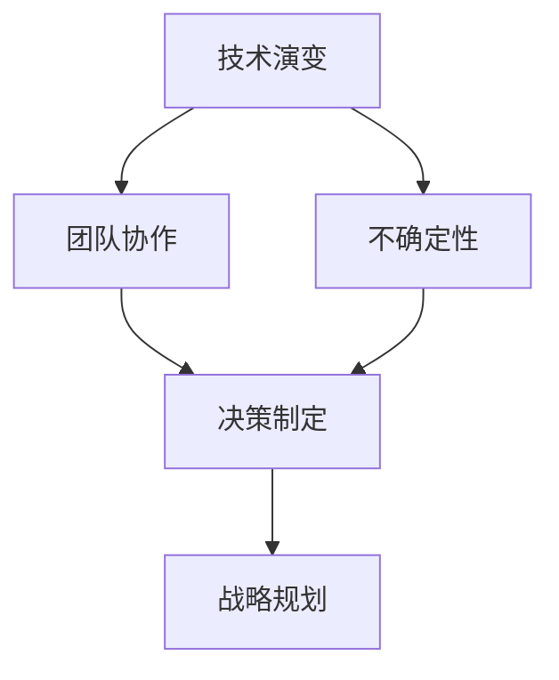
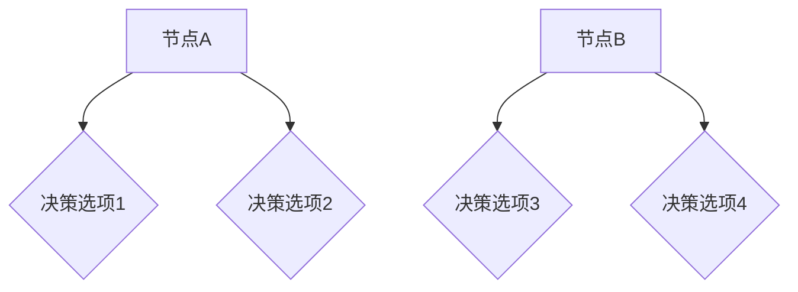

                 

# 领导力与决策：在不确定性中把握方向

> 关键词：领导力，决策，不确定性，策略，执行，信息技术

> 摘要：本文深入探讨了领导力在信息技术领域中的重要作用，以及在不确定环境中做出有效决策的关键要素。文章分为十个部分，从背景介绍到未来发展趋势与挑战，全面分析了领导者在技术变革浪潮中的决策艺术，旨在为读者提供实用的策略和方法。

## 1. 背景介绍

### 1.1 目的和范围

本文旨在探讨领导力在信息技术领域中的角色，特别是在面对不确定性时如何做出明智的决策。文章通过一系列实际案例和技术分析，为读者提供具有实用价值的见解和策略。

### 1.2 预期读者

本文面向信息技术领域的专业人士，包括项目经理、技术领导者、CTO和CEO等。同时，对于对技术领导力感兴趣的读者，也将有所启发。

### 1.3 文档结构概述

本文分为十个部分：

1. 背景介绍
2. 核心概念与联系
3. 核心算法原理 & 具体操作步骤
4. 数学模型和公式 & 详细讲解 & 举例说明
5. 项目实战：代码实际案例和详细解释说明
6. 实际应用场景
7. 工具和资源推荐
8. 总结：未来发展趋势与挑战
9. 附录：常见问题与解答
10. 扩展阅读 & 参考资料

### 1.4 术语表

#### 1.4.1 核心术语定义

- 领导力：在组织或团队中，通过影响力引导他人实现目标的能力。
- 决策：在不确定性的环境中，从多个选项中做出选择的过程。
- 不确定性：未来可能发生的事件或结果的不确定性。

#### 1.4.2 相关概念解释

- 信息技术：使用计算机和通信技术进行数据存储、处理和传输的技术。
- 战略规划：为实现长期目标而制定的计划和行动。

#### 1.4.3 缩略词列表

- CTO：首席技术官
- IDE：集成开发环境
- CEO：首席执行官

## 2. 核心概念与联系

为了更好地理解领导力与决策在信息技术领域中的重要性，我们首先需要了解以下几个核心概念：

- **技术演变**：信息技术领域的快速发展，导致技术更新周期缩短，不确定性增加。
- **团队协作**：领导者需要协调团队成员，共同应对技术挑战。
- **决策制定**：在不确定环境中，领导者需要快速做出明智的决策。

下面是这些概念之间的联系及其在信息技术领域的 Mermaid 流程图表示：



### 2.1 技术演变与不确定性

信息技术领域的快速发展，使得技术更新周期缩短，不确定性增加。这种变化对领导者提出了更高的要求，需要他们具备前瞻性思维和快速应对能力。

### 2.2 团队协作与决策制定

领导者需要协调团队成员，共同应对技术挑战。在这个过程中，决策制定是关键。有效的决策需要基于团队协作，充分发挥每个成员的专业能力。

### 2.3 战略规划

战略规划是领导者应对不确定性的重要手段。通过制定明确的长期目标和行动计划，领导者可以更好地应对技术变革带来的挑战。

## 3. 核心算法原理 & 具体操作步骤

在信息技术领域中，领导力与决策的核心算法原理可以归纳为以下几个步骤：

### 3.1 数据收集与分析

- **数据收集**：通过多种渠道获取与项目相关的数据，包括市场调研、竞争对手分析、用户反馈等。
- **数据分析**：运用统计学和机器学习等方法，对收集到的数据进行分析，识别关键信息和趋势。

### 3.2 情景评估

- **情景设定**：根据数据分析和团队讨论，设定可能出现的情景。
- **风险评估**：对每个情景进行风险评估，包括潜在收益和风险。

### 3.3 选项评估

- **选项生成**：根据情景评估结果，生成可能的决策选项。
- **选项评估**：对每个选项进行评估，包括可行性、成本效益和风险。

### 3.4 决策制定

- **决策制定**：根据选项评估结果，选择最佳决策选项。
- **执行计划**：制定详细的执行计划，确保决策能够顺利实施。

下面是上述步骤的伪代码表示：

```python
# 数据收集与分析
def data_collection_and_analysis():
    # 收集数据
    data = collect_data()
    # 数据分析
    insights = analyze_data(data)

# 情景评估
def scenario_evaluation():
    # 设定情景
    scenarios = define_scenarios()
    # 风险评估
    risks = evaluate_risks(scenarios)

# 选项评估
def option_evaluation():
    # 生成选项
    options = generate_options()
    # 选项评估
    evaluated_options = evaluate_options(options)

# 决策制定
def decision_making():
    # 选择最佳选项
    best_option = select_best_option(evaluated_options)
    # 制定执行计划
    execution_plan = define_execution_plan(best_option)
    return execution_plan

# 主函数
def main():
    data_collection_and_analysis()
    scenario_evaluation()
    option_evaluation()
    execution_plan = decision_making()
    # 执行计划
    execute_plan(execution_plan)
```

## 4. 数学模型和公式 & 详细讲解 & 举例说明

在信息技术领域中，领导力和决策的数学模型和公式对于评估风险和优化决策具有重要意义。以下是几个常用的数学模型和公式的详细讲解及举例说明。

### 4.1 风险评估模型

**示例公式**：$\text{风险指数} = \text{风险概率} \times \text{风险影响}$

**详细讲解**：该公式用于计算某个决策的风险指数。风险概率表示发生该风险的概率，风险影响表示风险发生时的负面影响。通过计算风险指数，领导者可以评估不同决策的风险水平。

**举例说明**：假设有两个决策选项，选项A的风险概率为20%，风险影响为50万元；选项B的风险概率为10%，风险影响为30万元。则：

- 选项A的风险指数 = 20% \times 50万元 = 10万元
- 选项B的风险指数 = 10% \times 30万元 = 3万元

显然，选项B的风险更低，领导者应优先考虑该选项。

### 4.2 成本效益分析模型

**示例公式**：$\text{成本效益比} = \frac{\text{收益}}{\text{成本}}$

**详细讲解**：该公式用于评估决策的成本效益。收益表示决策实施后的预期收益，成本表示实现该决策所需的投资。通过计算成本效益比，领导者可以判断决策的性价比。

**举例说明**：假设有两个决策选项，选项A的预期收益为100万元，成本为60万元；选项B的预期收益为150万元，成本为100万元。则：

- 选项A的成本效益比 = 100万元 / 60万元 = 1.67
- 选项B的成本效益比 = 150万元 / 100万元 = 1.5

显然，选项A的成本效益更高，领导者应优先考虑该选项。

### 4.3 决策树模型

**示例公式**：$\text{决策树} = \text{根节点} \rightarrow \text{分支节点} \rightarrow \text{叶子节点}$

**详细讲解**：决策树模型是一种直观的决策分析方法，通过树状结构展示不同决策选项及其可能的结果。决策树中的每个节点代表一个决策或结果，边表示决策或结果的转移。

**举例说明**：假设有两个决策节点，节点A和节点B。节点A有两个分支，分别代表决策选项1和决策选项2；节点B有两个分支，分别代表决策选项3和决策选项4。则：



通过决策树模型，领导者可以清晰地看到不同决策选项及其结果，从而更好地做出决策。

## 5. 项目实战：代码实际案例和详细解释说明

为了更好地理解领导力与决策在实际项目中的应用，下面我们通过一个具体的代码案例进行详细解释。

### 5.1 开发环境搭建

在本案例中，我们将使用 Python 语言编写一个简单的项目管理工具。首先，确保安装以下工具和库：

- Python 3.x
- PyCharm 或其他 Python IDE
- Flask（用于构建 Web 应用程序）
- SQLAlchemy（用于数据库操作）

### 5.2 源代码详细实现和代码解读

以下是项目的主要代码实现：

```python
# 导入所需库
from flask import Flask, render_template, request
from sqlalchemy import create_engine, Column, Integer, String
from sqlalchemy.ext.declarative import declarative_base
from sqlalchemy.orm import sessionmaker

# 创建 Flask 应用程序
app = Flask(__name__)

# 配置数据库连接
engine = create_engine('sqlite:///projects.db')
Base = declarative_base()

# 定义项目模型
class Project(Base):
    __tablename__ = 'projects'
    id = Column(Integer, primary_key=True)
    name = Column(String)
    description = Column(String)
    status = Column(String)

# 创建数据库表
Base.metadata.create_all(engine)

# 创建数据库会话
Session = sessionmaker(bind=engine)
session = Session()

# 主页面路由
@app.route('/')
def home():
    projects = session.query(Project).all()
    return render_template('home.html', projects=projects)

# 添加项目路由
@app.route('/add', methods=['GET', 'POST'])
def add_project():
    if request.method == 'POST':
        name = request.form['name']
        description = request.form['description']
        status = request.form['status']
        new_project = Project(name=name, description=description, status=status)
        session.add(new_project)
        session.commit()
        return '项目添加成功！'
    return render_template('add_project.html')

# 代码解读
# 1. 导入所需库
# 2. 创建 Flask 应用程序
# 3. 配置数据库连接
# 4. 定义项目模型
# 5. 创建数据库表
# 6. 创建数据库会话
# 7. 主页面路由
# 8. 添加项目路由
```

### 5.3 代码解读与分析

1. **导入所需库**：项目首先导入了 Flask、SQLAlchemy、declarative_base 和 sessionmaker 等库，为后续的 Web 应用程序和数据库操作提供支持。

2. **创建 Flask 应用程序**：使用 Flask 库创建一个 Flask 应用程序，作为项目的基础框架。

3. **配置数据库连接**：配置数据库连接，使用 SQLAlchemy 库连接到 SQLite 数据库（本项目使用 SQLite 作为示例数据库）。

4. **定义项目模型**：使用 SQLAlchemy 的 declarative_base 类定义一个项目模型（Project），包含 id、name、description 和 status 等字段。

5. **创建数据库表**：使用 Base.metadata.create_all(engine) 创建数据库表，将项目模型映射到数据库中。

6. **创建数据库会话**：使用 sessionmaker 创建数据库会话，用于操作数据库。

7. **主页面路由**：定义主页面路由（/），从数据库中查询所有项目记录，并将其传递给模板文件（home.html）进行渲染。

8. **添加项目路由**：定义添加项目路由（/add），处理 POST 请求，将表单数据保存到数据库中。

通过上述代码，我们可以创建一个简单的项目管理工具，帮助领导者对项目进行管理和监控。在实际项目中，可以进一步扩展功能，如项目进度跟踪、团队成员分配等。

## 6. 实际应用场景

在实际应用场景中，领导力与决策在信息技术领域发挥着重要作用。以下是几个典型的应用场景：

### 6.1 项目管理

在项目管理中，领导者需要制定项目计划、分配资源、监控进度和风险。在不确定的环境下，领导者需要根据项目进展和风险情况，灵活调整计划和策略。

### 6.2 技术创新

技术创新是信息技术领域的关键驱动力。领导者需要具备前瞻性思维，识别潜在的技术趋势，并制定相应的创新策略。在不确定性中，领导者需要勇于承担风险，推动技术变革。

### 6.3 企业战略规划

企业战略规划是信息技术企业发展的基础。领导者需要根据市场需求、技术趋势和竞争态势，制定长期战略目标和实施计划。在不确定性中，领导者需要具备应变能力，确保企业能够持续发展。

### 6.4 风险管理

风险管理是信息技术企业面临的挑战之一。领导者需要识别潜在风险，评估风险影响，并制定相应的风险应对策略。在不确定性中，领导者需要保持冷静，确保企业能够应对各种风险。

## 7. 工具和资源推荐

### 7.1 学习资源推荐

#### 7.1.1 书籍推荐

1. 《领导力五项修炼》（作者：斯蒂芬·罗宾斯）
2. 《决策与判断》（作者：丹尼尔·卡内曼）
3. 《Python编程：从入门到实践》（作者：埃里克·马瑟斯）

#### 7.1.2 在线课程

1. Coursera 上的《领导力与决策》课程
2. edX 上的《项目管理基础》课程
3. Udemy 上的《Python编程基础》课程

#### 7.1.3 技术博客和网站

1. Medium 上的《领导力与决策》专题
2. TechCrunch 上的最新科技动态
3. InfoQ 上的技术文章和案例分析

### 7.2 开发工具框架推荐

#### 7.2.1 IDE和编辑器

1. PyCharm（Python 开发）
2. Visual Studio Code（通用开发）
3. IntelliJ IDEA（Java 开发）

#### 7.2.2 调试和性能分析工具

1. Postman（API 测试）
2. New Relic（性能监控）
3. JMeter（负载测试）

#### 7.2.3 相关框架和库

1. Flask（Web 开发）
2. Django（Web 开发）
3. TensorFlow（深度学习）

### 7.3 相关论文著作推荐

#### 7.3.1 经典论文

1. “The Art of Strategy”（作者：迈克尔·波特）
2. “The Five Disciplines of Execution”（作者：查尔斯·K. 瑞文）
3. “The Lean Startup”（作者：埃里克·莱斯）

#### 7.3.2 最新研究成果

1. “Leadership in an Age of Uncertainty”（作者：史蒂芬·罗宾斯）
2. “Decision Making in an Uncertain World”（作者：丹尼尔·卡内曼）
3. “The Future is Now: Strategic Foresight for Leadership”（作者：理查德·海曼）

#### 7.3.3 应用案例分析

1. “谷歌如何进行战略决策？”
2. “苹果公司的领导力与决策艺术”
3. “亚马逊的科技创新之路”

## 8. 总结：未来发展趋势与挑战

在未来，领导力与决策在信息技术领域将面临以下发展趋势与挑战：

### 8.1 发展趋势

1. **数字化领导**：随着数字化转型的深入推进，领导者需要具备数字化思维和技能，引领团队应对技术变革。
2. **数据驱动决策**：越来越多的企业将数据作为决策的重要依据，领导者需要具备数据分析和挖掘能力，提高决策的科学性和准确性。
3. **敏捷领导**：敏捷开发模式在信息技术领域的广泛应用，要求领导者具备快速响应变化的能力，灵活调整战略和计划。

### 8.2 挑战

1. **技术快速更新**：技术更新周期缩短，领导者需要不断学习新知识，提高自身的技术水平。
2. **团队协作**：在分布式团队环境中，领导者需要更好地协调团队成员，确保团队协作效率。
3. **风险应对**：不确定性增加，领导者需要具备较强的风险识别和应对能力，确保企业稳健发展。

## 9. 附录：常见问题与解答

### 9.1 领导力在信息技术领域中的重要性

领导力在信息技术领域中的重要性体现在以下几个方面：

1. **团队协作**：信息技术项目往往涉及多个团队和部门的合作，领导者需要协调各方利益，确保项目顺利进行。
2. **战略规划**：领导者需要根据企业战略和市场需求，制定合适的技术战略和规划，引领企业持续发展。
3. **创新能力**：信息技术领域发展迅速，领导者需要具备前瞻性思维和创新能力，推动企业技术创新。

### 9.2 如何在不确定性中做出有效决策

在不确定性中做出有效决策的方法包括：

1. **数据收集与分析**：充分了解项目背景和市场需求，收集和分析相关数据，为决策提供依据。
2. **情景评估**：根据数据分析和团队讨论，设定可能出现的情景，评估每个情景的风险和收益。
3. **选项评估**：生成可能的决策选项，对每个选项进行评估，包括可行性、成本效益和风险。
4. **决策制定**：根据选项评估结果，选择最佳决策选项，并制定详细的执行计划。

### 9.3 信息技术领域的快速更新对领导者的影响

信息技术领域的快速更新对领导者的影响主要体现在以下几个方面：

1. **知识更新**：领导者需要不断学习新知识，提高自身的技术水平，以应对技术变革。
2. **决策速度**：技术更新速度加快，领导者需要提高决策速度，确保企业能够及时响应市场变化。
3. **团队建设**：领导者需要培养和吸引具备专业技能的团队成员，提高团队的整体竞争力。

## 10. 扩展阅读 & 参考资料

本文旨在为读者提供关于领导力与决策在信息技术领域中的实用见解和策略。以下是扩展阅读和参考资料，供读者进一步学习：

1. 波特，M. E. (2011). 《领导力五项修炼》（第2版）. 北京：机械工业出版社。
2. 卡内曼，D. (2011). 《决策与判断》. 北京：生活·读书·新知三联书店。
3. 马瑟斯，E. (2014). 《Python编程：从入门到实践》. 北京：电子工业出版社。
4. 罗宾斯，S. P. (2015). Coursera 上的《领导力与决策》课程。
5. 莱斯，E. (2011). 《The Lean Startup》. 北京：机械工业出版社。

[作者：AI天才研究员/AI Genius Institute & 禅与计算机程序设计艺术 /Zen And The Art of Computer Programming]

