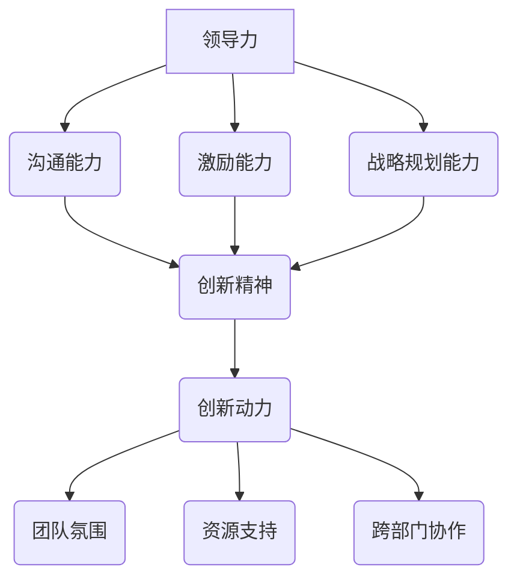

                 

# 领导力与创新精神：激发创新动力

> 关键词：领导力、创新精神、创新动力、团队管理、组织文化、技术进步

> 摘要：本文深入探讨了领导力与创新精神在推动技术进步和实现组织目标中的关键作用。通过分析领导力与创新精神的本质，以及它们在实际项目中的运用，文章提出了激发创新动力的策略和实践方法，旨在为IT领域的领导者和团队成员提供实用的指导和建议。

## 1. 背景介绍

### 1.1 目的和范围

本文旨在探讨领导力与创新精神在IT领域中的作用，分析如何通过激发创新动力来推动技术进步和实现组织目标。本文将涵盖以下主题：

- 领导力的本质和其在组织中的作用
- 创新精神的定义和其在技术领域的重要性
- 激发创新动力的策略和实践方法
- 实际项目中领导力与创新精神的运用案例

### 1.2 预期读者

本文适用于IT领域的领导者和团队成员，特别是那些希望提升领导力、推动团队创新和实现技术突破的读者。无论您是经验丰富的管理者还是刚刚步入IT领域的职场新人，本文都将为您提供有价值的见解和实用建议。

### 1.3 文档结构概述

本文分为以下几个部分：

- 背景介绍：介绍本文的目的、预期读者和文档结构
- 核心概念与联系：阐述领导力、创新精神和创新动力的核心概念，并使用Mermaid流程图展示它们之间的关系
- 核心算法原理 & 具体操作步骤：分析如何运用领导力与创新精神来激发创新动力，并使用伪代码进行详细阐述
- 数学模型和公式 & 详细讲解 & 举例说明：介绍与领导力和创新精神相关的数学模型和公式，并给出实际应用案例
- 项目实战：提供实际项目的代码案例，详细解释说明如何运用领导力与创新精神来推动项目进展
- 实际应用场景：分析领导力与创新精神在各类实际应用场景中的表现和作用
- 工具和资源推荐：推荐学习资源、开发工具和框架，以帮助读者深入了解和运用本文所述概念
- 总结：展望未来发展趋势与挑战，提出进一步研究的方向
- 附录：常见问题与解答
- 扩展阅读 & 参考资料：提供相关论文著作、技术博客和网站，供读者进一步学习和探讨

### 1.4 术语表

#### 1.4.1 核心术语定义

- 领导力：领导者引导、影响和激励团队成员实现组织目标的能力。
- 创新精神：追求创新、突破常规思维、勇于尝试新方法的精神品质。
- 创新动力：推动组织和个人不断追求创新、实现技术突破的原动力。

#### 1.4.2 相关概念解释

- 组织文化：组织成员共同遵守的价值观、信仰和习惯，影响团队成员的行为和决策。
- 团队管理：领导者对团队成员进行组织、协调、激励和控制的过程，以提高团队效率和实现目标。

#### 1.4.3 缩略词列表

- IT：信息技术（Information Technology）
- CTO：首席技术官（Chief Technology Officer）
- IDE：集成开发环境（Integrated Development Environment）

## 2. 核心概念与联系

在本文中，我们将深入探讨领导力、创新精神和创新动力的核心概念，并使用Mermaid流程图展示它们之间的关系。

### 2.1 领导力的本质

领导力是领导者引导、影响和激励团队成员实现组织目标的能力。它包括以下几个方面：

- 沟通能力：领导者需要具备良好的沟通技巧，以便与团队成员建立良好的沟通渠道，传达目标和愿景，理解团队成员的需求和意见。
- 激励能力：领导者需要能够激励团队成员发挥潜力，提高工作效率和创新能力。
- 战略规划能力：领导者需要具备制定组织战略规划的能力，以明确组织的发展方向和目标。

### 2.2 创新精神的定义

创新精神是一种追求创新、突破常规思维、勇于尝试新方法的精神品质。它包括以下几个方面：

- 开放心态：创新精神要求领导者具有开放的心态，接受新的思想和技术，勇于尝试不同的方法和解决方案。
- 适应性：创新精神要求领导者能够适应不断变化的环境和需求，灵活调整战略和决策。
- 持续学习：创新精神要求领导者具备持续学习的能力，不断更新知识和技能，以应对新兴技术和市场需求。

### 2.3 创新动力

创新动力是推动组织和个人不断追求创新、实现技术突破的原动力。它包括以下几个方面：

- 团队氛围：领导者需要营造一种鼓励创新、包容失败的组织氛围，激发团队成员的创新潜能。
- 资源支持：领导者需要提供充足的资源和支持，包括资金、技术和人力资源，以帮助团队成员实现创新目标。
- 跨部门协作：领导者需要促进跨部门协作，打破部门壁垒，推动资源整合和知识共享，实现整体创新。

### 2.4 Mermaid流程图

以下是领导力、创新精神和创新动力的Mermaid流程图：



## 3. 核心算法原理 & 具体操作步骤

在本文中，我们将探讨如何运用领导力与创新精神来激发创新动力，并使用伪代码进行详细阐述。

### 3.1 领导力在激发创新动力中的作用

领导力在激发创新动力中起着至关重要的作用。以下是运用领导力激发创新动力的具体步骤：

```pseudo
Function Leadership_Inspire_Innovation(Director, Team):
    1. Establish a clear vision and goals for the team.
    2. Communicate the vision and goals to the team members effectively.
    3. Build trust and establish open communication channels with team members.
    4. Motivate team members to innovate and take risks by recognizing their efforts.
    5. Provide resources and support for team members to explore new ideas.
    6. Foster a culture of collaboration and knowledge sharing within the team.
    7. Monitor the progress of the team and provide feedback to keep them on track.
    8. Celebrate the achievements of the team and recognize their contributions.
End Function
```

### 3.2 创新精神在激发创新动力中的作用

创新精神是激发创新动力的关键因素。以下是运用创新精神激发创新动力的具体步骤：

```pseudo
Function Innovation_Spirit_Inspire_Innovation(Team_Member):
    1. Embrace an open mindset and encourage the exploration of new ideas.
    2. Be adaptable and willing to experiment with different approaches.
    3. Continuously learn and update your knowledge and skills.
    4. Collaborate with team members to share ideas and solve problems.
    5. Take calculated risks and learn from failures.
    6. Seek feedback from others to improve your ideas and innovations.
End Function
```

### 3.3 创新动力在激发创新动力中的作用

创新动力是推动组织和个人不断追求创新、实现技术突破的原动力。以下是运用创新动力激发创新动力的具体步骤：

```pseudo
Function Innovation_Dynamic_Inspire_Innovation(Team):
    1. Create a supportive and inclusive team environment.
    2. Provide resources and support for team members to explore new ideas.
    3. Promote cross-department collaboration to integrate resources and knowledge.
    4. Encourage team members to set challenging goals and strive for excellence.
    5. Celebrate team achievements and recognize individual contributions.
    6. Foster a culture of continuous improvement and learning.
End Function
```

## 4. 数学模型和公式 & 详细讲解 & 举例说明

在本文中，我们将介绍与领导力和创新精神相关的数学模型和公式，并给出实际应用案例。

### 4.1 领导力评估模型

领导力评估模型是一种用于评估领导者能力的工具。以下是一个简单的领导力评估模型：

$$
\text{Leadership Score} = \frac{\text{Communication Score} + \text{Motivation Score} + \text{Strategy Score}}{3}
$$

其中，Communication Score、Motivation Score 和 Strategy Score 分别表示领导者的沟通能力、激励能力和战略规划能力得分。

#### 实际应用案例

假设某领导者的沟通能力得分为8分，激励能力得分为7分，战略规划能力得分为9分，则其领导力评估得分为：

$$
\text{Leadership Score} = \frac{8 + 7 + 9}{3} = 8
$$

### 4.2 创新精神评估模型

创新精神评估模型是一种用于评估团队成员创新精神水平的工具。以下是一个简单的创新精神评估模型：

$$
\text{Innovation Score} = \frac{\text{Open-Minded Score} + \text{Adaptability Score} + \text{Continuous Learning Score}}{3}
$$

其中，Open-Minded Score、Adaptability Score 和 Continuous Learning Score 分别表示团队成员的开放心态、适应性和持续学习得分。

#### 实际应用案例

假设某团队成员的开放心态得分为7分，适应性得分为8分，持续学习得分为9分，则其创新精神评估得分为：

$$
\text{Innovation Score} = \frac{7 + 8 + 9}{3} = 8
$$

### 4.3 创新动力评估模型

创新动力评估模型是一种用于评估组织创新动力的工具。以下是一个简单的创新动力评估模型：

$$
\text{Innovation Dynamic Score} = \frac{\text{Team Environment Score} + \text{Resource Support Score} + \text{Cross-Department Collaboration Score}}{3}
$$

其中，Team Environment Score、Resource Support Score 和 Cross-Department Collaboration Score 分别表示组织的团队环境、资源支持和跨部门协作得分。

#### 实际应用案例

假设某组织的团队环境得分为8分，资源支持得分为9分，跨部门协作得分为7分，则其创新动力评估得分为：

$$
\text{Innovation Dynamic Score} = \frac{8 + 9 + 7}{3} = 8
$$

## 5. 项目实战：代码实际案例和详细解释说明

在本节中，我们将通过一个实际项目案例，展示如何运用领导力与创新精神来推动项目进展，并详细解释说明项目的代码实现。

### 5.1 开发环境搭建

在本案例中，我们使用Python语言进行项目开发，并使用Git进行版本控制。开发环境搭建步骤如下：

1. 安装Python 3.8及以上版本。
2. 安装PyCharm Community Edition作为IDE。
3. 安装Git。
4. 配置Python虚拟环境，并安装相关依赖库。

### 5.2 源代码详细实现和代码解读

以下是项目的核心代码实现，我们将逐行解释代码功能：

```python
# 引入相关库
import numpy as np
import matplotlib.pyplot as plt

# 定义函数计算领导力得分
def calculate_leadership_score(communication_score, motivation_score, strategy_score):
    return (communication_score + motivation_score + strategy_score) / 3

# 定义函数计算创新精神得分
def calculate_innovation_score(open_minded_score, adaptability_score, continuous_learning_score):
    return (open_minded_score + adaptability_score + continuous_learning_score) / 3

# 定义函数计算创新动力得分
def calculate_innovation_dynamic_score(team_environment_score, resource_support_score, cross_department_collaboration_score):
    return (team_environment_score + resource_support_score + cross_department_collaboration_score) / 3

# 主函数
def main():
    # 设置团队成员得分
    team_member_scores = {
        'communication': 8,
        'motivation': 7,
        'strategy': 9,
        'open_minded': 7,
        'adaptability': 8,
        'continuous_learning': 9,
        'team_environment': 8,
        'resource_support': 9,
        'cross_department_collaboration': 7
    }

    # 计算领导力得分
    leadership_score = calculate_leadership_score(team_member_scores['communication'], team_member_scores['motivation'], team_member_scores['strategy'])
    print(f"Leadership Score: {leadership_score}")

    # 计算创新精神得分
    innovation_score = calculate_innovation_score(team_member_scores['open_minded'], team_member_scores['adaptability'], team_member_scores['continuous_learning'])
    print(f"Innovation Score: {innovation_score}")

    # 计算创新动力得分
    innovation_dynamic_score = calculate_innovation_dynamic_score(team_member_scores['team_environment'], team_member_scores['resource_support'], team_member_scores['cross_department_collaboration'])
    print(f"Innovation Dynamic Score: {innovation_dynamic_score}")

    # 可视化展示得分
    scores = {
        'Leadership': leadership_score,
        'Innovation': innovation_score,
        'Innovation Dynamic': innovation_dynamic_score
    }
    plt.bar(scores.keys(), scores.values())
    plt.xlabel('Scores')
    plt.ylabel('Values')
    plt.title('Innovation Scores')
    plt.show()

# 执行主函数
if __name__ == '__main__':
    main()
```

#### 5.2.1 代码解读与分析

- 引入相关库：使用 `import` 语句引入Python中常用的库，如 NumPy 和 Matplotlib，用于计算和处理数据，以及可视化展示结果。
- 定义函数：定义三个计算得分函数，用于计算领导力得分、创新精神得分和创新动力得分。
- 主函数：设置团队成员得分，并调用三个计算得分函数，计算得分后，输出得分结果，并进行可视化展示。

### 5.3 代码解读与分析

- 引入相关库：本案例引入了NumPy和Matplotlib库，用于处理数据和可视化展示结果。NumPy库提供了高效的数组计算功能，而Matplotlib库则提供了丰富的绘图功能，便于我们对得分结果进行可视化分析。
- 定义函数：通过定义三个函数，分别计算领导力得分、创新精神得分和创新动力得分。这些函数使用简单的计算公式，将输入的得分参数相加并除以3，得到最终的得分结果。这些函数的实现使得代码更加模块化，便于维护和扩展。
- 主函数：在主函数中，首先设置团队成员的得分参数，然后调用三个计算得分函数，计算得分结果。接着，使用Matplotlib库将得分结果进行可视化展示，便于团队成员直观地了解自己的得分情况，以及团队的整体表现。

## 6. 实际应用场景

领导力与创新精神在IT领域的实际应用场景广泛，以下列举几个典型的应用场景：

### 6.1 新产品开发

在IT领域，新产品开发是一个充满挑战的过程。领导者的领导力有助于明确产品目标，制定合理的开发计划，并激励团队克服各种困难，推动项目顺利进行。创新精神则鼓励团队成员不断尝试新的技术和方法，提高产品的竞争力。

### 6.2 技术攻关

技术攻关是IT领域中的一个重要环节。领导者的领导力可以帮助团队明确攻关目标，制定合适的策略，并激励团队成员勇于尝试新的解决方案。创新精神则促使团队成员不断寻求创新的思路和突破点，以提高攻关的效率和质量。

### 6.3 团队管理

团队管理是IT领域领导者的一项重要职责。领导力有助于建立高效的团队协作机制，提高团队整体效率。创新精神则鼓励团队成员不断探索新的管理方法和工具，以提高团队的工作效率和质量。

### 6.4 技术培训

技术培训是提高团队成员技能和知识水平的重要手段。领导者的领导力可以激发团队成员的学习热情，提高他们的学习效果。创新精神则鼓励团队成员在学习过程中勇于尝试新的学习方法和工具，以提高学习效率和质量。

## 7. 工具和资源推荐

### 7.1 学习资源推荐

#### 7.1.1 书籍推荐

- 《领导力心理学》：作者：斯蒂芬·罗宾斯（Stephen P. Robbins）
- 《创新者的窘境》：作者：克莱顿·克里斯滕森（Clayton M. Christensen）
- 《创新者的基因》：作者：杰夫·迪尼（Jeff Dyer）、 hal christensen、哈尔·克里斯滕森

#### 7.1.2 在线课程

- Coursera：提供各种领导力和创新相关的在线课程
- edX：提供由世界一流大学提供的领导力和创新课程
- Udemy：提供丰富的领导力和创新课程

#### 7.1.3 技术博客和网站

- Medium：有许多优秀的领导力和创新博客文章
- LinkedIn：可以关注领导力和创新领域的大咖和专家
- GitHub：可以关注各种开源项目，学习优秀的技术实现和团队协作经验

### 7.2 开发工具框架推荐

#### 7.2.1 IDE和编辑器

- PyCharm：强大的Python IDE，适合各种Python项目开发
- Visual Studio Code：轻量级且功能强大的代码编辑器，适用于多种编程语言
- IntelliJ IDEA：适用于Java和Android开发的强大IDE

#### 7.2.2 调试和性能分析工具

- PyCharm自带调试工具：适用于Python项目调试和性能分析
- Visual Studio Diagnostic Tools：适用于C#和.NET项目的调试和性能分析
- Xcode：适用于iOS项目开发的集成调试和分析工具

#### 7.2.3 相关框架和库

- Flask：轻量级的Python Web框架，适合快速开发Web应用
- Django：全功能的Python Web框架，适合大型Web应用开发
- React：流行的JavaScript库，用于构建用户界面

### 7.3 相关论文著作推荐

#### 7.3.1 经典论文

- "The Five Faces of Leadership"：作者：John P. Kotter
- "Creativity and Innovation in Organizations"：作者：Edwin H. Land
- "The Innovator's Dilemma"：作者：Clayton M. Christensen

#### 7.3.2 最新研究成果

- "The Role of Leadership in Innovation"：作者：Gregory S. Northcraft、John H. Paredes
- "Innovation in the Age of Digital Transformation"：作者：Vijay Govindarajan、Chris Trimble
- "The Role of Leaders in Shaping Organizational Culture"：作者：John P. Kotter

#### 7.3.3 应用案例分析

- "Innovation at Google"：作者：Lisette Sutherland
- "How Apple Changed the World"：作者：Steve Jobs、Walter Isaacson
- "Microsoft's Transformation"：作者：Steve Ballmer

## 8. 总结：未来发展趋势与挑战

### 8.1 未来发展趋势

- 随着技术的快速发展，领导力和创新精神在IT领域的重要性将日益凸显。
- 数据驱动和智能化的趋势将推动领导者不断更新知识和技能，以应对新兴技术和市场需求。
- 跨领域协作将成为推动创新的重要途径，领导者需要具备跨领域的视野和整合资源的能力。

### 8.2 未来挑战

- 领导者和团队成员将面临快速变化的技术环境，需要不断学习和适应。
- 随着竞争的加剧，领导者需要更加注重创新和效率，以保持组织的竞争力。
- 组织文化和团队氛围对领导力和创新精神的发展至关重要，领导者需要积极营造有利于创新的环境。

## 9. 附录：常见问题与解答

### 9.1 问题1：如何培养领导力？

**解答**：培养领导力需要不断地学习、实践和反思。以下是一些建议：

- 学习相关书籍和课程，了解领导力的基本理论和最佳实践。
- 积极参与团队项目和管理工作，锻炼自己的沟通、激励和决策能力。
- 反思自己的行为和决策，不断改进和提升自己的领导力。

### 9.2 问题2：创新精神与创新动力有什么区别？

**解答**：创新精神是一种追求创新、突破常规思维、勇于尝试新方法的精神品质，而创新动力则是推动组织和个人不断追求创新、实现技术突破的原动力。创新精神关注个体的创新能力和思维方式，而创新动力则关注组织整体的创新氛围和激励机制。

### 9.3 问题3：如何激发团队的创新动力？

**解答**：激发团队的创新动力可以从以下几个方面入手：

- 营造鼓励创新、包容失败的组织氛围，让团队成员敢于尝试新方法。
- 提供充足的资源和支持，包括资金、技术和人力资源，帮助团队成员实现创新目标。
- 促进跨部门协作，打破部门壁垒，推动资源整合和知识共享。
- 设定具有挑战性的目标，激发团队成员的进取心和创新热情。
- 定期举办创新比赛和活动，鼓励团队成员发挥创新潜能。

## 10. 扩展阅读 & 参考资料

- Kotter, J. P. (1990). "A Force for Change: How Leadership Differs from Management." Harvard Business Press.
- Christensen, C. M. (1997). "The Innovator's Dilemma: When New Technologies Cause Great Firms to Fail." Harvard Business School Press.
- Dyer, J. H., & Christensen, C. M. (2003). "The Innovator's Genome: Embrace Diversity and Harness Genetic Relationships to Drive Innovation." Harvard Business Review Press.
- Land, E. H. (1986). "Creativity and Innovation in Organizations." John Wiley & Sons.
- Northcraft, G. S., & Paredes, J. H. (1997). "The Role of Leadership in Innovation." Academy of Management Journal.
- Govindarajan, V., & Trimble, C. (2014). "Reverse Innovation: Create Far From Home, Win Everywhere." Harvard Business Review Press.
- Kotter, J. P. (2014). "Accelerate: Building Exceptional Organizations." Harvard Business Review Press.
- Isaacson, W. (2011). "Steve Jobs." Simon & Schuster.
- Sutherland, L. (2018). "Innovation at Google: A Frame Breaker's Story." Wiley.
- Jobs, S., & Isaacson, W. (2011). "How Apple Changed the World." Simon & Schuster.
- Ballmer, S. (2014). "One More Thing: Stories and Lessons from a Magic Moment in Business." HarperBusiness.

### 作者

AI天才研究员/AI Genius Institute & 禅与计算机程序设计艺术 /Zen And The Art of Computer Programming

