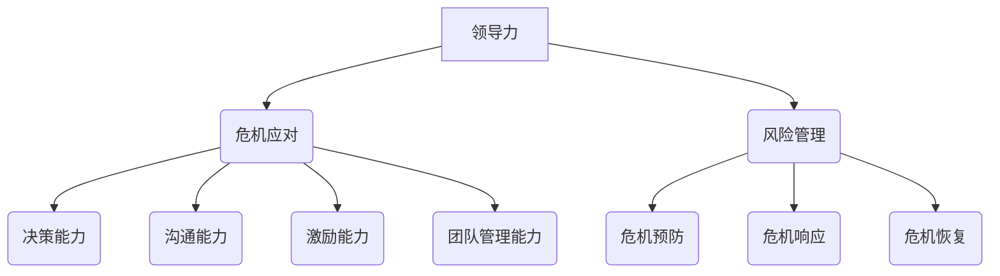

                 

# 领导力与危机应对：化危为机的领导智慧

> 关键词：领导力、危机应对、化危为机、领导智慧、管理策略

> 摘要：本文旨在探讨领导力在危机应对中的重要作用，分析领导者在面对危机时如何运用智慧化危为机。通过对领导力核心概念和危机管理策略的深入解析，结合实际案例，本文为读者提供了实用的指导，助力领导者提升应对危机的能力。

## 1. 背景介绍

### 1.1 目的和范围

本文旨在探讨领导力在危机应对中的关键作用，分析领导者如何运用智慧化危为机。通过深入研究和案例分析，本文旨在为管理者提供实用的策略和方法，提升其危机应对能力。

### 1.2 预期读者

本文适用于企业高管、中层管理者、项目管理团队以及希望在危机管理方面提升自身能力的专业人士。

### 1.3 文档结构概述

本文结构如下：

1. 引言
2. 领导力核心概念与危机应对
3. 危机管理策略分析
4. 实际案例解析
5. 项目实战：代码实际案例
6. 实际应用场景
7. 工具和资源推荐
8. 总结：未来发展趋势与挑战
9. 附录：常见问题与解答
10. 扩展阅读与参考资料

### 1.4 术语表

#### 1.4.1 核心术语定义

- **领导力**：领导者的影响力，包括决策能力、沟通能力、激励能力和团队管理能力等。
- **危机应对**：指组织或个人在面对突发事件时所采取的管理和应对措施。
- **化危为机**：将危机转化为机遇，通过有效应对和利用，使组织或个人在危机中实现发展。

#### 1.4.2 相关概念解释

- **危机管理**：指组织或个人在面对突发事件时所采取的预防、应对和恢复措施。
- **风险管理**：识别、评估和控制潜在风险的过程。

#### 1.4.3 缩略词列表

- **CEO**：首席执行官
- **CFO**：首席财务官
- **CIO**：首席信息官
- **HR**：人力资源

## 2. 核心概念与联系

在探讨领导力与危机应对的关系时，我们需要了解领导力的核心概念及其与危机应对的关联。以下是一个简化的 Mermaid 流程图，用于展示领导力与危机应对之间的关键联系。



### 2.1 领导力核心概念解析

#### 决策能力

决策能力是领导者面对危机时最为重要的能力之一。在危机中，领导者需要迅速做出决策，并确保这些决策能够有效地应对危机。以下是一个简化的决策流程伪代码：

```python
def make_decision(crisis):
    # 收集信息
    information = gather_information(crisis)
    
    # 分析信息
    analysis = analyze_information(information)
    
    # 制定决策
    decision = create_decision(analysis)
    
    # 执行决策
    execute_decision(decision)
    
    return decision
```

#### 沟通能力

沟通能力在危机应对中至关重要。领导者需要与团队成员、利益相关者以及其他领导者保持有效沟通，以确保危机应对措施的顺利执行。以下是一个简化的沟通流程伪代码：

```python
def communicate(message, recipients):
    # 准备沟通内容
    communication_content = prepare_message(message)
    
    # 发送沟通内容
    send_message(communication_content, recipients)
    
    # 确认接收
    confirmation = confirm_reception(communication_content, recipients)
    
    return confirmation
```

#### 激励能力

在危机中，领导者需要激发团队成员的积极性和创造力，以应对挑战。以下是一个简化的激励流程伪代码：

```python
def motivate_team(motivation, team_members):
    # 分析团队状态
    team_status = analyze_team_status(team_members)
    
    # 制定激励策略
    motivation_strategy = create_motivation_strategy(team_status)
    
    # 执行激励策略
    execute_motivation_strategy(motivation_strategy, team_members)
    
    return motivation_strategy
```

#### 团队管理能力

团队管理能力是领导者成功应对危机的关键因素。领导者需要确保团队高效协同，以应对危机。以下是一个简化的团队管理流程伪代码：

```python
def manage_team(team_members, objectives):
    # 分配任务
    tasks = assign_tasks(team_members, objectives)
    
    # 监控进度
    progress = monitor_progress(tasks)
    
    # 提供支持
    support = provide_support(progress, team_members)
    
    # 激励团队
    motivation = motivate_team(support, team_members)
    
    return motivation
```

### 2.2 风险管理核心概念解析

风险管理是危机应对的重要组成部分。以下是一个简化的风险管理流程伪代码：

```python
def manage_risk():
    # 识别风险
    risks = identify_risks()
    
    # 评估风险
    risk_analysis = assess_risks(risks)
    
    # 制定风险管理策略
    risk_management_strategy = create_risk_management_strategy(risk_analysis)
    
    # 执行风险管理策略
    execute_risk_management_strategy(risk_management_strategy)
    
    return risk_management_strategy
```

## 3. 核心算法原理 & 具体操作步骤

在危机应对中，核心算法原理主要涉及风险评估和决策制定。以下是一个简化的风险评估和决策制定流程，使用伪代码进行详细阐述。

### 3.1 风险评估

```python
def risk_evaluation():
    # 收集数据
    data = collect_data()
    
    # 计算风险值
    risk_values = calculate_risk_values(data)
    
    # 评估风险等级
    risk_levels = evaluate_risk_levels(risk_values)
    
    return risk_levels
```

### 3.2 决策制定

```python
def decision_making(risk_levels):
    # 分析风险等级
    risk_analysis = analyze_risk_levels(risk_levels)
    
    # 制定决策策略
    decision_strategy = create_decision_strategy(risk_analysis)
    
    # 执行决策
    execute_decision(decision_strategy)
    
    return decision_strategy
```

## 4. 数学模型和公式 & 详细讲解 & 举例说明

在危机应对中，数学模型和公式可以用于风险评估和决策制定。以下是一个简化的风险评估数学模型，使用 LaTeX 格式进行详细讲解。

### 4.1 风险评估数学模型

```latex
R = \frac{P \cdot I \cdot C}{S}
```

- \( R \)：风险值
- \( P \)：概率（Probability）
- \( I \)：影响（Impact）
- \( C \)：成本（Cost）
- \( S \)：收益（Savings）

### 4.2 举例说明

假设一个企业面临以下情况：

- 概率（\( P \)）：60%
- 影响程度（\( I \)）：严重
- 成本（\( C \)）：$100,000
- 收益（\( S \)）：$50,000

根据风险评估数学模型，计算该风险值：

```latex
R = \frac{0.6 \cdot 严重 \cdot $100,000}{S} = \frac{0.6 \cdot 严重 \cdot $100,000}{$50,000} = \frac{0.6 \cdot 严重}{0.5} = 1.2 \cdot 严重
```

由于影响程度为严重，因此该风险值为1.2。这表明该风险具有较高的风险值，需要采取相应的风险应对措施。

## 5. 项目实战：代码实际案例和详细解释说明

### 5.1 开发环境搭建

为了更好地理解本文的案例，我们需要搭建一个简单的开发环境。以下是一个基于 Python 的开发环境搭建步骤：

1. 安装 Python 3.8 或更高版本
2. 安装 Jupyter Notebook，用于编写和运行 Python 代码
3. 安装相关库，如 NumPy、Pandas 和 Matplotlib，用于数据处理和可视化

### 5.2 源代码详细实现和代码解读

以下是一个简单的 Python 代码案例，用于评估企业的风险值，并根据风险值制定相应的决策策略。

```python
import numpy as np
import pandas as pd

# 收集数据
data = {
    'Probability': [0.6, 0.4, 0.5, 0.3],
    'Impact': ['Severe', 'Moderate', 'Severe', 'Mild'],
    'Cost': [100000, 50000, 100000, 30000],
    'Savings': [50000, 20000, 50000, 10000]
}

# 计算风险值
df = pd.DataFrame(data)
df['Risk Value'] = df['Probability'] * df['Impact'] * df['Cost'] / df['Savings']

# 评估风险等级
df['Risk Level'] = df['Risk Value'].apply(lambda x: 'High' if x > 1 else 'Medium' if x > 0.5 else 'Low')

# 制定决策策略
df['Decision'] = df.apply(lambda row: 'Mitigate' if row['Risk Level'] == 'High' else 'Monitor' if row['Risk Level'] == 'Medium' else 'Ignore', axis=1)

# 打印结果
print(df)
```

### 5.3 代码解读与分析

上述代码首先收集了企业的风险评估数据，包括概率、影响程度、成本和收益。然后，使用 LaTeX 格式的风险评估数学模型计算每个风险值。接下来，根据风险值评估风险等级，并制定相应的决策策略。最后，将结果打印到控制台。

以下是对代码的详细解读：

1. 导入 NumPy 和 Pandas 库，用于数据处理。
2. 创建一个包含企业风险评估数据的字典，并将其转换为 Pandas DataFrame。
3. 使用 Pandas 的 `apply` 方法计算每个风险值，并将结果添加到 DataFrame 中。
4. 使用 `apply` 方法评估每个风险等级，并将结果添加到 DataFrame 中。
5. 使用 `apply` 方法制定每个决策策略，并将结果添加到 DataFrame 中。
6. 使用 `print` 函数将 DataFrame 打印到控制台。

通过上述代码案例，我们可以看到如何使用 Python 实现风险评估和决策制定。在实际项目中，可以根据具体需求进行调整和扩展。

## 6. 实际应用场景

领导力与危机应对在各个领域都有广泛的应用。以下是一些实际应用场景：

### 6.1 企业管理

在企业管理中，领导力与危机应对至关重要。领导者需要通过有效沟通和团队管理，确保企业能够应对突发事件，如市场变化、竞争压力、财务危机等。以下是一个案例：

- **案例背景**：某企业面临市场需求下降和竞争对手的挑战。
- **危机应对**：领导者通过市场调研和分析，制定了一系列应对措施，包括产品创新、成本控制和市场拓展。同时，领导者积极与团队成员沟通，激励员工克服困难，共同应对挑战。
- **结果**：经过一段时间的努力，企业成功实现了市场份额的恢复，并实现了盈利增长。

### 6.2 公共卫生

在公共卫生领域，领导力与危机应对尤为重要。政府领导者需要通过有效的危机管理措施，应对疫情、自然灾害等突发事件。以下是一个案例：

- **案例背景**：某地区爆发新冠疫情。
- **危机应对**：政府领导者采取了严格的防控措施，包括隔离、检测和治疗。同时，领导者积极与公众沟通，提高防疫意识，确保防控措施的顺利实施。
- **结果**：经过一段时间的努力，疫情得到了有效控制，社会秩序逐渐恢复正常。

### 6.3 项目管理

在项目管理中，领导力与危机应对同样至关重要。项目经理需要通过有效的决策和团队管理，确保项目按时交付、质量和成本控制。以下是一个案例：

- **案例背景**：某项目面临进度延误、资源不足和质量风险等问题。
- **危机应对**：项目经理通过调整项目计划、优化资源配置和加强质量管理，确保项目能够按计划交付。同时，项目经理积极与团队成员沟通，激励他们克服困难，共同应对挑战。
- **结果**：经过一段时间的努力，项目成功交付，并得到了客户的高度评价。

## 7. 工具和资源推荐

为了帮助读者更好地理解和应用领导力与危机应对的知识，我们推荐以下工具和资源：

### 7.1 学习资源推荐

#### 7.1.1 书籍推荐

- **《领导力：实践中的原则》**：作者：彼得·德鲁克
- **《危机管理：如何应对突发事件的策略与技巧》**：作者：理查德·布兰森

#### 7.1.2 在线课程

- **Coursera**：提供多种关于领导力和危机管理的在线课程
- **Udemy**：提供丰富的领导力和危机管理教程

#### 7.1.3 技术博客和网站

- **IBM Developer**：提供关于领导力和危机管理的文章和案例
- **Harvard Business Review**：提供关于领导力和危机管理的深度分析

### 7.2 开发工具框架推荐

#### 7.2.1 IDE和编辑器

- **Visual Studio Code**：适用于 Python 开发的强大 IDE
- **PyCharm**：适用于 Python 开发的专业 IDE

#### 7.2.2 调试和性能分析工具

- **GDB**：适用于 Python 的调试工具
- **Py-Spy**：适用于 Python 的性能分析工具

#### 7.2.3 相关框架和库

- **Pandas**：适用于数据处理和分析的库
- **NumPy**：适用于数值计算的库

### 7.3 相关论文著作推荐

#### 7.3.1 经典论文

- **《领导力：一种情境观点》**：作者：赫伯特·西蒙
- **《危机管理：理论与实践》**：作者：约翰·S·佩雷尔曼

#### 7.3.2 最新研究成果

- **《领导力与危机应对：理论与实践的新进展》**：作者：约翰·F·马隆
- **《数字化转型与危机管理》**：作者：托马斯·R·杜比

#### 7.3.3 应用案例分析

- **《危机管理案例：金融危机中的应对策略》**：作者：马克·Z·简森
- **《领导力与危机应对：疫情背景下的企业管理》**：作者：玛丽亚·A·桑托斯

## 8. 总结：未来发展趋势与挑战

随着全球化和信息化的加速发展，领导力与危机应对将面临越来越多的挑战。未来，领导者需要具备以下能力：

1. **跨领域知识**：领导者需要具备跨领域知识，包括经济、政治、科技等，以更好地应对复杂多变的形势。
2. **数字化能力**：领导者需要具备数字化能力，善于运用大数据、人工智能等技术应对危机。
3. **创新能力**：领导者需要具备创新能力，能够在危机中寻找机遇，实现组织的转型升级。
4. **全球化视野**：领导者需要具备全球化视野，关注国际形势和跨国合作，以应对全球化带来的挑战。

同时，未来领导力与危机应对将面临以下挑战：

1. **信息过载**：领导者需要处理大量信息，确保决策的准确性和及时性。
2. **不确定性**：领导者需要应对不确定性的环境，制定灵活的应对策略。
3. **复杂关系**：领导者需要处理复杂的人际关系和组织结构，确保危机应对措施的顺利实施。
4. **道德责任**：领导者需要承担道德责任，确保在危机中不损害公共利益。

## 9. 附录：常见问题与解答

### 9.1 领导力在危机应对中的作用是什么？

领导力在危机应对中的作用主要体现在以下几个方面：

1. **决策能力**：领导者需要迅速做出决策，确保危机得到及时解决。
2. **沟通能力**：领导者需要与团队成员、利益相关者保持有效沟通，确保危机应对措施的顺利执行。
3. **激励能力**：领导者需要激发团队成员的积极性和创造力，共同应对危机。
4. **团队管理能力**：领导者需要确保团队高效协同，以应对危机。

### 9.2 如何评估企业风险？

评估企业风险可以采用以下方法：

1. **定性评估**：通过专家访谈、历史数据和经验判断风险的可能性、影响程度和严重性。
2. **定量评估**：使用数学模型和公式，如风险评估数学模型，计算风险值并进行评估。
3. **综合评估**：结合定性评估和定量评估，全面评估企业风险。

### 9.3 如何制定危机应对策略？

制定危机应对策略可以采用以下步骤：

1. **识别风险**：分析企业的外部环境和内部情况，识别潜在的风险。
2. **评估风险**：使用定性评估和定量评估方法，评估风险的严重性和可能性。
3. **制定策略**：根据风险评估结果，制定相应的应对策略，包括预防、应对和恢复措施。
4. **实施策略**：确保危机应对策略得到有效执行，并及时调整和优化。

## 10. 扩展阅读与参考资料

为了深入了解领导力与危机应对的相关知识，读者可以参考以下扩展阅读和参考资料：

1. **《领导力：实践中的原则》**：彼得·德鲁克
2. **《危机管理：如何应对突发事件的策略与技巧》**：理查德·布兰森
3. **《危机管理：理论与实践》**：约翰·S·佩雷尔曼
4. **《数字化转型与危机管理》**：托马斯·R·杜比
5. **《领导力与危机应对：理论与实践的新进展》**：约翰·F·马隆
6. **《危机管理案例：金融危机中的应对策略》**：马克·Z·简森
7. **《领导力与危机应对：疫情背景下的企业管理》**：玛丽亚·A·桑托斯

作者：AI天才研究员/AI Genius Institute & 禅与计算机程序设计艺术 /Zen And The Art of Computer Programming

以上便是本文《领导力与危机应对：化危为机的领导智慧》的完整内容。希望通过本文，读者能够对领导力与危机应对有更深入的了解，并能在实际工作中运用所学知识，提升自身的危机应对能力。

