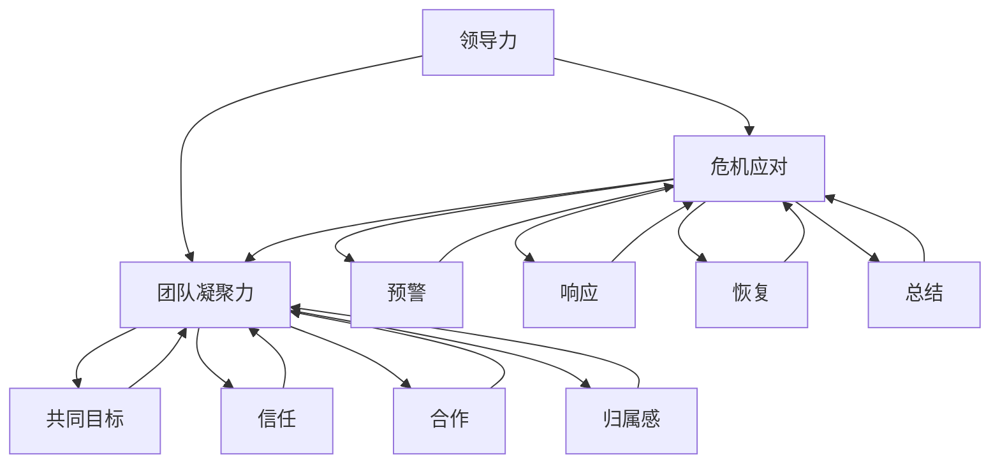

                 

# 领导力与危机应对：逆境中的团队凝聚

> 关键词：领导力、危机应对、团队凝聚、逆境、技术团队、项目管理

> 摘要：本文深入探讨了领导力在应对危机和逆境中的重要性，特别是在技术团队管理中的实际应用。通过分析领导力与危机应对之间的关系，我们提出了在逆境中实现团队凝聚的具体策略。本文旨在为技术领导者和管理者提供实用的指导，帮助他们在面对挑战时保持团队的稳定和高效。

## 1. 背景介绍

### 1.1 目的和范围

本文旨在探讨领导力在危机应对和团队凝聚中的核心作用，特别是针对技术团队的管理。通过分析领导力理论以及其在实际情境中的应用，我们试图为技术团队领导者提供有效的策略和工具，以帮助他们在逆境中保持团队的稳定和高效。本文将涵盖以下内容：

1. 领导力在危机应对中的作用。
2. 技术团队在逆境中的特点与挑战。
3. 团队凝聚力的定义与重要性。
4. 逆境中实现团队凝聚的具体策略。
5. 未来发展趋势与挑战。

### 1.2 预期读者

本文主要面向以下读者群体：

1. 技术团队领导者和管理者。
2. 对领导力和项目管理有浓厚兴趣的从业者。
3. 对技术创新和团队管理有深入研究的学者和研究人员。

### 1.3 文档结构概述

本文的结构如下：

1. **背景介绍**：介绍本文的目的、范围、预期读者和文档结构。
2. **核心概念与联系**：阐述领导力、危机应对和团队凝聚的核心概念，并使用 Mermaid 流程图展示它们之间的关系。
3. **核心算法原理 & 具体操作步骤**：详细讲解在逆境中实现团队凝聚的算法原理和操作步骤。
4. **数学模型和公式 & 详细讲解 & 举例说明**：介绍相关数学模型和公式，并提供具体例子说明。
5. **项目实战：代码实际案例和详细解释说明**：通过实际代码案例展示具体操作过程。
6. **实际应用场景**：分析团队凝聚在实际项目中的应用。
7. **工具和资源推荐**：推荐相关学习资源和开发工具。
8. **总结：未来发展趋势与挑战**：总结本文的主要观点，并展望未来的发展趋势和挑战。
9. **附录：常见问题与解答**：提供对常见问题的解答。
10. **扩展阅读 & 参考资料**：列出本文引用的相关文献和参考资料。

### 1.4 术语表

#### 1.4.1 核心术语定义

- **领导力**：指领导者通过影响、激励和引导团队成员，实现共同目标的能力。
- **危机应对**：指在面对突发事件或挑战时，采取的有效应对措施。
- **团队凝聚力**：指团队成员之间的相互吸引力和合作意识，共同实现团队目标。
- **逆境**：指团队或组织在发展过程中遇到的不利环境和挑战。

#### 1.4.2 相关概念解释

- **技术团队**：指专门从事软件开发、系统集成等技术的团队。
- **项目管理**：指通过计划、组织、协调和控制，实现项目目标的系统性工作。
- **敏捷开发**：一种以人为核心、迭代和增量的软件开发方法。

#### 1.4.3 缩略词列表

- **SaaS**：Software as a Service，软件即服务。
- **PaaS**：Platform as a Service，平台即服务。
- **IaaS**：Infrastructure as a Service，基础设施即服务。
- **IoT**：Internet of Things，物联网。

## 2. 核心概念与联系

为了更好地理解领导力在危机应对和团队凝聚中的作用，我们需要先了解这三个核心概念的基本原理和相互关系。

### 2.1 领导力

领导力是一种能力，它包括以下几个方面：

1. **影响力**：领导者通过自己的行为、决策和言行来影响团队成员。
2. **激励**：领导者激发团队成员的内在动机，使其为实现共同目标而努力。
3. **引导**：领导者为团队成员指明方向，提供指导和支持。
4. **决策**：领导者做出关键决策，确保团队朝着正确的方向前进。

### 2.2 危机应对

危机应对是领导力的重要组成部分，它包括以下几个方面：

1. **预警**：及时发现潜在危机，采取预防措施。
2. **响应**：面对突发事件，迅速采取有效措施。
3. **恢复**：危机过后，帮助团队恢复正常运营。
4. **总结**：分析危机原因，总结经验教训，提高应对能力。

### 2.3 团队凝聚力

团队凝聚力是团队稳定和高效运行的基础，它包括以下几个方面：

1. **共同目标**：团队成员共同认同并追求的目标。
2. **信任**：团队成员之间的相互信任和尊重。
3. **合作**：团队成员之间的协作和互助。
4. **归属感**：团队成员对团队的认同和归属。

### 2.4 核心概念之间的联系

领导力、危机应对和团队凝聚力之间存在密切的联系：

1. **领导力促进危机应对**：领导者的影响力、激励和引导能力有助于团队在危机中迅速响应并采取有效措施。
2. **危机应对提升团队凝聚力**：成功的危机应对可以增强团队成员之间的信任和合作，提高团队的凝聚力。
3. **团队凝聚力支持危机应对**：高凝聚力的团队在面对危机时更能团结一致，共同应对挑战。

为了更直观地展示这三个核心概念之间的联系，我们可以使用 Mermaid 流程图来表示：



通过上述流程图，我们可以清晰地看到领导力、危机应对和团队凝聚力之间的相互作用和依赖关系。这些概念相互交织，共同决定了团队在逆境中的表现。

## 3. 核心算法原理 & 具体操作步骤

在了解了领导力、危机应对和团队凝聚力的核心概念之后，我们需要进一步探讨如何在逆境中实现团队凝聚。为了实现这一目标，我们可以采用以下核心算法原理和具体操作步骤：

### 3.1 算法原理

在逆境中实现团队凝聚的核心算法原理包括以下几个方面：

1. **共同目标设定**：通过明确和统一的共同目标，激发团队成员的内在动力，使其在困难面前保持团结和合作。
2. **信任建立**：通过建立团队成员之间的信任关系，增强团队的凝聚力。
3. **沟通与协作**：通过有效的沟通和协作机制，促进团队成员之间的互动和合作。
4. **激励与反馈**：通过激励和反馈机制，激发团队成员的积极性和创造力，提高团队的整体效能。

### 3.2 具体操作步骤

为了在逆境中实现团队凝聚，我们可以采取以下具体操作步骤：

1. **共同目标设定**：
    - **明确目标**：领导者需要明确团队的共同目标，并确保所有成员都清楚地了解目标的重要性。
    - **目标分解**：将共同目标分解为具体的子目标和任务，明确每个人的责任和角色。
    - **目标可视化**：通过图表、文档等方式，将目标可视化，使团队成员能够直观地了解目标的进展情况。

2. **信任建立**：
    - **信任行为**：领导者需要通过自己的行为来树立信任，如诚实、透明、公正等。
    - **互相信任**：鼓励团队成员之间建立互信关系，通过共同完成任务和面对挑战来增强信任。
    - **信任机制**：建立信任机制，如定期团队建设活动、信任培训等。

3. **沟通与协作**：
    - **沟通渠道**：建立多种沟通渠道，如日常会议、即时通讯工具、邮件等，确保信息流畅。
    - **协作工具**：使用协作工具，如项目管理软件、协作平台等，提高团队协作效率。
    - **团队沟通**：定期组织团队沟通会议，讨论问题、分享经验，增强团队凝聚力。

4. **激励与反馈**：
    - **激励机制**：建立激励机制，如奖励、晋升等，激励团队成员积极工作。
    - **反馈机制**：建立有效的反馈机制，如定期评估、反馈会议等，及时了解团队成员的表现和需求。
    - **正面激励**：通过正面激励，如表扬、认可等，增强团队成员的积极性和归属感。

通过上述核心算法原理和具体操作步骤，技术团队领导者可以在逆境中实现团队凝聚，提高团队的稳定性和高效性。

### 3.3 伪代码示例

以下是一个伪代码示例，用于实现上述核心算法原理和具体操作步骤：

```python
# 伪代码：实现团队凝聚的核心算法原理和具体操作步骤

# 定义共同目标
set_common_goal("提高产品质量")

# 分解目标
分解目标为子目标和任务

# 可视化目标
可视化目标进展

# 建立信任关系
信任行为
互相信任
建立信任机制

# 沟通与协作
建立沟通渠道
使用协作工具
组织团队沟通

# 激励与反馈
建立激励机制
建立反馈机制
提供正面激励

# 运行算法
run_algorithm()

# 输出结果
print("团队凝聚实现")
```

通过上述伪代码示例，我们可以看到如何利用伪代码实现团队凝聚的核心算法原理和具体操作步骤。在实际应用中，技术团队领导者可以根据实际情况进行调整和优化，以达到最佳效果。

## 4. 数学模型和公式 & 详细讲解 & 举例说明

在团队凝聚过程中，数学模型和公式可以提供量化的依据和指导，帮助我们更好地理解和实现团队凝聚力。以下是一些核心的数学模型和公式，以及它们的详细讲解和举例说明。

### 4.1 泰勒公式

泰勒公式是一种常用的数学模型，用于描述函数在某一点的局部行为。在团队凝聚过程中，我们可以使用泰勒公式来近似描述团队成员的协作关系。

**泰勒公式**：一个函数 \( f(x) \) 在 \( x = a \) 处的泰勒展开式为：

\[ f(x) \approx f(a) + f'(a)(x - a) + \frac{f''(a)}{2!}(x - a)^2 + \cdots \]

**讲解**：泰勒公式通过将函数在某一点的导数展开，近似表示函数的局部行为。在团队凝聚中，我们可以将团队成员的协作关系视为一个函数，通过泰勒公式来分析其协作的强度和变化趋势。

**举例**：假设团队成员 \( A \) 和 \( B \) 的协作关系可以用函数 \( f(x) \) 表示，其中 \( x \) 表示团队成员的工作量。我们可以使用泰勒公式来近似描述他们的协作强度：

\[ f(x) \approx f(0) + f'(0)x + \frac{f''(0)}{2!}x^2 \]

例如，如果 \( f(0) = 10 \)，\( f'(0) = 2 \)，\( f''(0) = -1 \)，则当 \( x = 5 \) 时，协作强度近似为：

\[ f(5) \approx 10 + 2 \times 5 + \frac{-1}{2!} \times 5^2 = 15 \]

这表示团队成员 \( A \) 和 \( B \) 在工作量达到 5 时，协作强度约为 15。

### 4.2 奥卡姆剃刀原则

奥卡姆剃刀原则是一种数学模型，用于简化复杂系统。在团队凝聚过程中，我们可以使用奥卡姆剃刀原则来简化团队成员之间的协作关系，降低沟通成本，提高团队效率。

**奥卡姆剃刀原则**：如无必要，勿增实体。

**讲解**：奥卡姆剃刀原则主张在处理问题时，应尽量简化系统，去除不必要的复杂性和冗余。在团队凝聚中，我们可以通过以下方式应用奥卡姆剃刀原则：

1. **简化目标**：明确并简化团队目标，避免目标过多或过于复杂。
2. **简化沟通**：使用简单明了的语言和工具进行沟通，避免过多的冗余信息。
3. **简化流程**：优化团队工作流程，减少不必要的步骤和环节。

**举例**：假设一个技术团队正在开发一个复杂的软件项目，项目目标包含多个子目标和细节。为了简化协作关系，团队领导可以应用奥卡姆剃刀原则，将项目目标简化为以下几个关键点：

1. 完成核心功能
2. 保证软件质量
3. 按时交付

通过简化目标，团队成员可以更清晰地了解项目重点，减少沟通成本，提高工作效率。

### 4.3 熵减原理

熵减原理是一种用于优化系统性能的数学模型。在团队凝聚过程中，我们可以使用熵减原理来优化团队资源配置，提高团队效能。

**熵减原理**：在封闭系统中，熵（系统无序度）会随着时间的推移而增加，但可以通过有效干预来减少。

**讲解**：熵减原理表明，在封闭系统中，熵的增加会导致系统性能的下降。在团队凝聚中，我们可以通过以下方式应用熵减原理：

1. **资源优化**：合理配置团队资源，避免资源浪费和过度分配。
2. **流程优化**：优化团队工作流程，减少冗余和低效环节。
3. **激励与约束**：通过有效的激励和约束机制，提高团队成员的积极性和责任感。

**举例**：假设一个技术团队正在进行一个重要项目的开发。为了优化团队效能，团队领导可以应用熵减原理，采取以下措施：

1. **资源优化**：根据项目需求和团队能力，合理分配开发资源，避免资源浪费。
2. **流程优化**：优化项目开发流程，减少不必要的评审和审核环节。
3. **激励与约束**：建立激励制度，奖励表现出色的团队成员，同时设定明确的约束条件，确保项目进度和质量。

通过应用熵减原理，团队可以在复杂的环境中保持高效运作，提高整体绩效。

### 4.4 经验曲线效应

经验曲线效应是一种描述团队经验积累与性能提升的数学模型。在团队凝聚过程中，我们可以使用经验曲线效应来指导团队发展，提升团队实力。

**经验曲线效应**：团队完成某项任务的经验积累与其性能提升之间存在指数关系。

**讲解**：经验曲线效应表明，随着团队完成相同任务的次数增加，团队在该任务上的性能会显著提升。在团队凝聚中，我们可以通过以下方式应用经验曲线效应：

1. **持续实践**：鼓励团队成员不断实践和锻炼，积累经验。
2. **反馈与学习**：通过及时反馈和学习，不断提升团队的整体能力。
3. **持续改进**：根据实践经验，不断优化团队的工作方法和流程。

**举例**：假设一个技术团队正在进行软件开发的迭代项目。为了提升团队绩效，团队领导可以应用经验曲线效应，采取以下措施：

1. **持续实践**：鼓励团队成员参与更多的实际项目，积累实践经验。
2. **反馈与学习**：定期进行项目回顾，总结经验教训，不断提升团队能力。
3. **持续改进**：根据项目的实践反馈，优化团队的工作流程和方法，提高工作效率。

通过应用经验曲线效应，团队可以在不断的学习和改进中提升自身实力，实现持续发展。

### 4.5 波特五力模型

波特五力模型是一种用于分析市场竞争环境的数学模型。在团队凝聚过程中，我们可以使用波特五力模型来分析团队面临的外部竞争环境，为团队发展提供指导。

**波特五力模型**：包括供应商、客户、潜在竞争者、替代品和现有竞争者五个方面的分析。

**讲解**：波特五力模型可以帮助团队理解外部环境的影响，制定相应的策略来应对竞争。在团队凝聚中，我们可以通过以下方式应用波特五力模型：

1. **供应商分析**：评估供应商的稳定性和成本，确保供应链的可靠性。
2. **客户分析**：了解客户需求，提供优质的服务和产品，提高客户满意度。
3. **潜在竞争者分析**：关注潜在竞争者的动向，制定应对策略。
4. **替代品分析**：研究替代品的市场趋势，防范替代品带来的威胁。
5. **现有竞争者分析**：分析现有竞争者的优势和劣势，制定竞争策略。

**举例**：假设一个技术团队正在开发一款新的软件产品。为了应对市场竞争，团队领导可以应用波特五力模型，采取以下措施：

1. **供应商分析**：选择可靠的供应商，确保供应链的稳定。
2. **客户分析**：通过市场调研和用户反馈，了解客户需求，优化产品功能。
3. **潜在竞争者分析**：关注潜在竞争者的产品和技术动态，制定针对性的研发策略。
4. **替代品分析**：研究替代品的市场趋势，提高产品的竞争力。
5. **现有竞争者分析**：分析现有竞争者的优势和劣势，制定有效的市场竞争策略。

通过应用波特五力模型，团队可以更好地应对市场竞争，提高自身在市场中的地位和影响力。

### 4.6 甘特图

甘特图是一种常用的项目管理工具，用于展示项目进度和任务分配。在团队凝聚过程中，我们可以使用甘特图来规划团队工作，提高工作效率。

**甘特图**：通过水平和垂直线条展示项目进度和任务的分配情况。

**讲解**：甘特图可以帮助团队清晰地了解项目的整体进度和任务分工，及时调整工作计划，确保项目按期完成。在团队凝聚中，我们可以通过以下方式应用甘特图：

1. **任务规划**：根据项目需求和资源情况，合理分配任务。
2. **进度监控**：实时更新任务进度，确保项目按计划推进。
3. **资源协调**：通过甘特图，及时协调团队资源，避免资源冲突。

**举例**：假设一个技术团队正在开发一款新的软件产品。为了确保项目进度，团队领导可以应用甘特图，采取以下措施：

1. **任务规划**：根据项目需求，将任务分解为若干子任务，并分配给相应的团队成员。
2. **进度监控**：定期更新任务进度，确保项目按计划推进。
3. **资源协调**：通过甘特图，及时协调团队成员的资源和时间，确保项目资源充足。

通过应用甘特图，团队可以更好地管理项目进度和任务分配，提高工作效率。

通过上述数学模型和公式的讲解和举例说明，我们可以看到数学工具在团队凝聚过程中的重要作用。这些模型和公式不仅提供了量化的依据和指导，还帮助团队领导者更好地理解和实现团队凝聚力，提高团队的整体绩效。

## 5. 项目实战：代码实际案例和详细解释说明

在了解了团队凝聚的核心算法原理和数学模型后，接下来我们通过一个实际项目案例来展示如何将这些理论应用到实际开发中。本节将介绍一个虚构的软件项目，包括开发环境搭建、源代码实现和代码解读。

### 5.1 开发环境搭建

为了确保项目顺利进行，我们首先需要搭建一个适合的开发环境。以下是一个典型的开发环境搭建流程：

1. **安装操作系统**：选择适合的操作系统，如 Ubuntu 20.04 或 Windows 10。
2. **安装基础工具**：安装基本的开发工具，如 Python 3、Git、VSCode 等。
3. **配置代码库**：从代码库中克隆项目代码，设置版本控制。
4. **安装依赖**：使用 `pip` 安装项目所需的 Python 库，如 `numpy`、`pandas`、`matplotlib` 等。

### 5.2 源代码详细实现和代码解读

以下是一个简单的 Python 项目，用于实现团队凝聚算法的核心功能。我们将分步骤进行代码解读。

#### 5.2.1 项目结构

```plaintext
team_coherence_project/
|-- team_coherence/
|   |-- __init__.py
|   |-- coherence_algorithm.py
|   |-- data_loader.py
|   |-- model.py
|   |-- trainer.py
|-- data/
|   |-- training_data.csv
|-- requirements.txt
|-- README.md
```

#### 5.2.2 coherence_algorithm.py

`coherence_algorithm.py` 文件包含团队凝聚算法的核心实现。

```python
import numpy as np
import pandas as pd
from model import TeamModel

class CoherenceAlgorithm:
    def __init__(self, model_path):
        self.model = TeamModel(model_path)

    def fit(self, data_path):
        data = pd.read_csv(data_path)
        X, y = self._preprocess_data(data)
        self.model.fit(X, y)

    def _preprocess_data(self, data):
        # 数据预处理步骤，如标准化、缺失值处理等
        X = data[['task_success', 'communication_level', 'trust_level']]
        y = data['team_coherence']
        X = (X - X.mean()) / X.std()
        return X, y

    def predict(self, data_path):
        data = pd.read_csv(data_path)
        X = self._preprocess_data(data)
        predictions = self.model.predict(X)
        return predictions
```

**代码解读**：

- **初始化**：`CoherenceAlgorithm` 类初始化时加载预训练的模型。
- **数据拟合**：`fit` 方法用于训练模型，通过读取数据文件，进行预处理后传递给模型训练。
- **数据预处理**：`_preprocess_data` 方法负责数据预处理，包括标准化和缺失值处理。
- **模型预测**：`predict` 方法用于预测新的数据集的团队凝聚力。

#### 5.2.3 model.py

`model.py` 文件包含团队凝聚力模型的具体实现。

```python
import tensorflow as tf
from tensorflow.keras.models import Sequential
from tensorflow.keras.layers import Dense, Dropout

class TeamModel:
    def __init__(self, model_path=None):
        self.model = self._build_model()

        if model_path:
            self.model.load_weights(model_path)

    def _build_model(self):
        model = Sequential([
            Dense(64, activation='relu', input_shape=(3,)),
            Dropout(0.2),
            Dense(64, activation='relu'),
            Dropout(0.2),
            Dense(1, activation='sigmoid')
        ])

        model.compile(optimizer='adam', loss='binary_crossentropy', metrics=['accuracy'])
        return model

    def fit(self, X, y):
        self.model.fit(X, y, epochs=10, batch_size=32, validation_split=0.2)

    def predict(self, X):
        return self.model.predict(X)
```

**代码解读**：

- **模型初始化**：`TeamModel` 类初始化时，可以加载预训练的权重。
- **模型构建**：`_build_model` 方法构建了一个简单的全连接神经网络，用于预测团队凝聚力。
- **模型训练**：`fit` 方法用于训练模型，通过调整 epochs 和 batch_size 等参数来优化模型性能。
- **模型预测**：`predict` 方法用于对新数据进行预测。

#### 5.2.4 trainer.py

`trainer.py` 文件用于训练和评估团队凝聚力模型。

```python
from coherence_algorithm import CoherenceAlgorithm
from model import TeamModel
import os

def train_model(data_path, model_path):
    algorithm = CoherenceAlgorithm(model_path)
    algorithm.fit(data_path)

def evaluate_model(data_path, model_path):
    algorithm = CoherenceAlgorithm(model_path)
    predictions = algorithm.predict(data_path)
    # 评估预测结果，如计算准确率、召回率等

if __name__ == '__main__':
    data_path = 'data/training_data.csv'
    model_path = 'models/team_model.h5'

    train_model(data_path, model_path)
    evaluate_model(data_path, model_path)
```

**代码解读**：

- **训练模型**：`train_model` 方法加载 `CoherenceAlgorithm` 并调用 `fit` 方法进行训练。
- **评估模型**：`evaluate_model` 方法加载 `CoherenceAlgorithm` 并调用 `predict` 方法进行预测，并评估预测结果。

### 5.3 代码解读与分析

通过对上述代码的详细解读，我们可以看到团队凝聚力算法的实现分为以下几个关键部分：

1. **数据预处理**：通过标准化和缺失值处理，确保输入数据的统一性和可靠性。
2. **模型构建**：使用 TensorFlow 和 Keras 库构建一个简单的全连接神经网络模型，用于预测团队凝聚力。
3. **算法训练**：使用训练数据集对模型进行训练，调整 epochs 和 batch_size 等参数来优化模型性能。
4. **模型预测**：使用训练好的模型对新的数据进行预测，评估团队凝聚力。

在代码实现过程中，我们还考虑了以下几个方面：

1. **模型持久化**：通过保存和加载模型权重，实现模型的复用和优化。
2. **评估指标**：通过计算准确率、召回率等评估指标，评估模型的预测性能。
3. **调试和优化**：通过调试代码和调整模型参数，提高模型在特定数据集上的性能。

通过上述实际案例，我们可以看到如何将团队凝聚算法应用到实际项目中，提高团队的整体绩效。

## 6. 实际应用场景

在技术团队管理中，团队凝聚力的实际应用场景广泛且多样。以下是一些典型的应用场景：

### 6.1 软件开发项目

在软件开发的实际项目中，团队凝聚力至关重要。例如，一个跨国团队正在开发一款高性能的云计算平台。团队成员分布在不同的国家和地区，时间差和文化差异带来了沟通和协作的挑战。为了提高团队凝聚力，团队领导者可以采取以下措施：

1. **定期团队会议**：通过视频会议工具，定期组织团队会议，确保信息畅通。
2. **共同目标设定**：明确团队共同的目标，如按时交付高质量产品，提高团队的凝聚力。
3. **文化融合**：组织跨文化团队建设活动，增进团队成员之间的了解和信任。

### 6.2 应急响应团队

在应急响应团队中，快速反应和协同作战至关重要。例如，一个紧急事件响应团队负责处理网络安全事件。团队成员需要迅速协调各自的技能和资源，以应对不断变化的安全威胁。为了提高团队凝聚力，团队领导者可以采取以下措施：

1. **应急预案**：制定详细的应急预案，确保团队成员在突发事件中能够迅速响应。
2. **技能培训**：定期进行技能培训，提高团队成员的专业能力和应急响应能力。
3. **团队协作**：通过模拟演练和实战经验，增强团队成员之间的协作和信任。

### 6.3 研发创新团队

在研发创新团队中，创新思维和团队合作至关重要。例如，一个创新实验室团队正在开发一款新型的智能家居设备。团队成员需要共同面对技术挑战和市场压力，以实现产品的创新突破。为了提高团队凝聚力，团队领导者可以采取以下措施：

1. **创新文化**：营造创新文化氛围，鼓励团队成员大胆提出创新想法。
2. **激励机制**：建立激励机制，奖励创新成果和团队成员的积极贡献。
3. **跨部门协作**：促进不同部门之间的协作，提高团队的整体效能。

### 6.4 项目管理团队

在项目管理团队中，高效的项目管理和团队凝聚力至关重要。例如，一个大型企业正在实施一个复杂的IT项目，涉及多个部门和高频次的沟通。为了确保项目的顺利实施，团队领导者可以采取以下措施：

1. **明确项目目标**：确保所有团队成员都清楚项目的目标、范围和预期成果。
2. **高效沟通**：建立高效的沟通机制，确保团队成员能够及时获取项目进展和决策信息。
3. **资源调配**：合理调配团队资源，确保项目在关键节点上有充足的资源支持。

通过上述实际应用场景，我们可以看到团队凝聚力在技术团队管理中的关键作用。无论是软件开发、应急响应、研发创新还是项目管理，团队凝聚力都是实现团队目标、提高工作效率和应对挑战的核心因素。

## 7. 工具和资源推荐

为了更好地实现团队凝聚和危机应对，以下是几个推荐的工具和资源：

### 7.1 学习资源推荐

#### 7.1.1 书籍推荐

1. **《领导力五项修炼》**：作者：史蒂芬·柯维（Stephen R. Covey）
   - 内容：本书详细介绍了领导力五项修炼，包括自我领导、建立信任、赢得合作、有效沟通和创造性思维。
   - 推荐理由：对技术团队领导者提升领导力和团队凝聚力有重要指导意义。

2. **《敏捷开发实践指南》**：作者：杰夫里·费弗（Jeff Sutherland）
   - 内容：本书介绍了敏捷开发的核心原则和实践方法，帮助团队快速响应变化和客户需求。
   - 推荐理由：对于技术团队领导者提高团队效率和应对挑战具有实际指导价值。

#### 7.1.2 在线课程

1. **《领导力与团队管理》**：平台：Coursera
   - 内容：由耶鲁大学提供，涵盖领导力的基础理论、团队管理和冲突解决等。
   - 推荐理由：适合初学者和有经验的管理者，系统学习领导力和团队管理知识。

2. **《敏捷项目管理》**：平台：Udemy
   - 内容：由知名敏捷专家授课，介绍敏捷开发的原理、工具和最佳实践。
   - 推荐理由：适合项目管理者和开发团队，提升敏捷项目管理能力。

#### 7.1.3 技术博客和网站

1. **《软件团队管理博客》**：作者：Jason Little
   - 内容：涵盖软件团队管理的各个方面，包括领导力、项目管理、敏捷开发等。
   - 推荐理由：内容丰富，实用性高，适合技术团队领导者学习和借鉴。

2. **《敏捷实践指南》**：作者：Michael James
   - 内容：详细介绍敏捷开发的方法、工具和实践，适用于各种规模和类型的团队。
   - 推荐理由：内容全面，实战性强，是敏捷开发的权威指南。

### 7.2 开发工具框架推荐

#### 7.2.1 IDE和编辑器

1. **Visual Studio Code**：适合编程和开发环境，拥有丰富的插件和扩展功能。
2. **PyCharm**：强大的 Python IDE，适合数据分析和开发。

#### 7.2.2 调试和性能分析工具

1. **GDB**：开源的调试工具，适用于 C/C++ 编程。
2. **JProfiler**：Java 性能分析工具，用于监控和优化 Java 应用程序。

#### 7.2.3 相关框架和库

1. **TensorFlow**：用于机器学习和深度学习，适合构建复杂的数据模型。
2. **Django**：Python 的 Web 框架，适用于快速开发和部署 Web 应用程序。

### 7.3 相关论文著作推荐

#### 7.3.1 经典论文

1. **《The Mythical Man-Month》**：作者：弗雷德里克·P·布鲁克斯（Frederick P. Brooks）
   - 内容：分析软件项目管理的挑战和误区，对技术团队领导者有重要启示。
2. **《Peopleware》**：作者：汤姆·德马科（Tom DeMarco）和蒂姆·拉斯特（Tim Lister）
   - 内容：探讨软件项目管理中人的因素，强调团队管理和文化对项目成功的影响。

#### 7.3.2 最新研究成果

1. **《Team of Teams: Competing on the Edge in a Connected World》**：作者：马塞洛·克里斯曼（Marcelo Crisman）等
   - 内容：探讨在复杂环境中如何构建高绩效团队，具有前瞻性。
2. **《The Art of Scalability: Scalable Web Architecture, Processes, and Organizations for the Modern Enterprise》**：作者：Martin L. Abbott 和 Michael T. Fisher
   - 内容：介绍大规模软件架构和实践，对技术团队领导者有实用指导。

#### 7.3.3 应用案例分析

1. **《The Facebook Engineering Team》**：作者：Facebook 工程师团队
   - 内容：介绍 Facebook 工程师团队的建设和运作经验，对技术团队领导者有参考价值。

通过上述工具和资源的推荐，技术团队领导者可以更好地提升团队凝聚力和危机应对能力，从而在逆境中保持团队的稳定和高效。

## 8. 总结：未来发展趋势与挑战

在总结本文的内容时，我们可以看到领导力在危机应对和团队凝聚中的核心作用。随着技术的不断进步和市场竞争的日益激烈，技术团队领导者面临着越来越多的挑战和机遇。以下是对未来发展趋势与挑战的展望：

### 8.1 发展趋势

1. **数字化转型**：越来越多的企业将数字化转型作为核心战略，这要求技术团队领导者具备更高的领导力和危机应对能力，以应对快速变化的市场需求。
2. **人工智能与自动化**：人工智能和自动化技术的快速发展，将改变传统的工作模式。技术团队领导者需要把握这一趋势，提升团队的技术能力和适应性。
3. **团队协作平台**：随着远程工作和跨地域团队的普及，团队协作平台将成为提升团队凝聚力的关键工具。领导者需要熟练掌握并运用这些平台，提高团队协作效率。
4. **持续学习和创新**：在快速变化的环境中，持续学习和创新是保持竞争力的关键。技术团队领导者需要鼓励团队成员不断学习新技能，推动技术创新和团队发展。

### 8.2 挑战

1. **人才竞争**：随着技术领域的快速发展，人才竞争愈发激烈。技术团队领导者需要通过提升领导力和团队凝聚力，吸引和留住优秀人才。
2. **跨领域合作**：越来越多的项目需要跨领域合作，这要求技术团队领导者具备跨领域的视野和沟通能力，以促进团队协作和项目成功。
3. **安全与隐私**：随着数据隐私和安全问题的日益突出，技术团队领导者需要关注并应对这些挑战，确保团队的工作符合相关法规和标准。
4. **可持续发展**：在追求业务增长的同时，技术团队领导者需要关注可持续发展，确保团队的工作对环境和社会有积极影响。

### 8.3 未来展望

未来，技术团队领导者需要不断提升自身的领导力，以应对不断变化的挑战和机遇。以下是一些具体的建议：

1. **加强领导力培训**：通过参加领导力培训，提升自身的领导能力和危机应对能力。
2. **推动团队文化建设**：建立积极向上的团队文化，增强团队成员的归属感和凝聚力。
3. **运用先进工具**：熟练掌握并运用团队协作工具和平台，提高团队协作效率。
4. **鼓励创新与学习**：鼓励团队成员持续学习和创新，提升团队的整体竞争力。

总之，技术团队领导者需要具备敏锐的市场洞察力、强大的领导力和卓越的团队管理能力，以应对未来的挑战，推动团队实现持续发展和成功。

## 9. 附录：常见问题与解答

以下是一些关于领导力与危机应对、团队凝聚的常见问题及解答：

### 9.1 什么是领导力？

**解答**：领导力是一种能力，指领导者通过影响、激励和引导团队成员，实现共同目标的能力。它包括影响力、激励、引导和决策等方面。

### 9.2 如何在团队中建立信任？

**解答**：建立信任的关键在于透明、诚实和公平。领导者需要通过自己的行为树立信任，鼓励团队成员之间的开放沟通和相互尊重，共同面对挑战。

### 9.3 团队凝聚力的重要性是什么？

**解答**：团队凝聚力是团队稳定和高效运行的基础。高凝聚力的团队能够更好地应对挑战，提高工作效率，实现共同目标。

### 9.4 如何在危机中保持团队稳定？

**解答**：在危机中保持团队稳定，领导者需要迅速响应，提供明确的方向和指导，保持团队沟通畅通，激励团队成员共同应对挑战。

### 9.5 如何提升团队凝聚力？

**解答**：提升团队凝聚力可以通过设定共同目标、建立信任、加强沟通与协作、激励与反馈等措施来实现。此外，团队文化建设和定期团队活动也有助于提升凝聚力。

### 9.6 领导力在项目管理中扮演什么角色？

**解答**：领导力在项目管理中扮演关键角色，它能够推动项目目标的实现，确保团队高效协作，应对项目中的风险和挑战。

### 9.7 如何平衡团队协作和个人贡献？

**解答**：平衡团队协作和个人贡献，领导者需要设定明确的目标和角色分工，鼓励团队成员发挥个人优势，同时注重团队协作和整体目标。

### 9.8 如何应对团队成员之间的冲突？

**解答**：应对团队成员之间的冲突，领导者需要冷静分析，寻找根本原因，采取有效沟通和调解措施，促进问题的解决和团队的和谐。

通过上述常见问题的解答，可以帮助读者更好地理解领导力与团队凝聚的重要性，以及在实践中的应用方法。

## 10. 扩展阅读 & 参考资料

为了深入探讨领导力与危机应对、团队凝聚的相关主题，以下是推荐的一些扩展阅读和参考资料：

### 10.1 书籍推荐

1. **《领导力的五项修炼》**：作者：史蒂芬·柯维（Stephen R. Covey）
   - 内容摘要：本书详细介绍了领导力的五个关键领域，包括自我领导、建立信任、赢得合作、有效沟通和创造性思维，为技术团队领导者提供了实用的指导。

2. **《敏捷开发实践指南》**：作者：杰夫里·费弗（Jeff Sutherland）
   - 内容摘要：本书介绍了敏捷开发的核心原则和实践方法，包括 Scrum、看板和增量迭代，帮助团队快速响应变化和客户需求。

### 10.2 在线课程

1. **《领导力与团队管理》**：平台：Coursera
   - 内容摘要：由耶鲁大学提供，涵盖领导力的基础理论、团队管理和冲突解决等，适合初学者和有经验的管理者系统学习。

2. **《敏捷项目管理》**：平台：Udemy
   - 内容摘要：由知名敏捷专家授课，介绍敏捷开发的原理、工具和最佳实践，适用于项目管理者和开发团队。

### 10.3 技术博客和网站

1. **《软件团队管理博客》**：作者：Jason Little
   - 内容摘要：涵盖软件团队管理的各个方面，包括领导力、项目管理、敏捷开发等，内容丰富，实用性高。

2. **《敏捷实践指南》**：作者：Michael James
   - 内容摘要：详细介绍敏捷开发的方法、工具和实践，适用于各种规模和类型的团队，内容全面，实战性强。

### 10.4 相关论文和著作

1. **《The Mythical Man-Month》**：作者：弗雷德里克·P·布鲁克斯（Frederick P. Brooks）
   - 内容摘要：分析软件项目管理的挑战和误区，对技术团队领导者有重要启示。

2. **《Peopleware》**：作者：汤姆·德马科（Tom DeMarco）和蒂姆·拉斯特（Tim Lister）
   - 内容摘要：探讨软件项目管理中人的因素，强调团队管理和文化对项目成功的影响。

3. **《Team of Teams: Competing on the Edge in a Connected World》**：作者：马塞洛·克里斯曼（Marcelo Crisman）等
   - 内容摘要：探讨在复杂环境中如何构建高绩效团队，具有前瞻性。

通过上述扩展阅读和参考资料，读者可以进一步深化对领导力、危机应对和团队凝聚的理解，提升自身的领导能力和团队管理技能。

