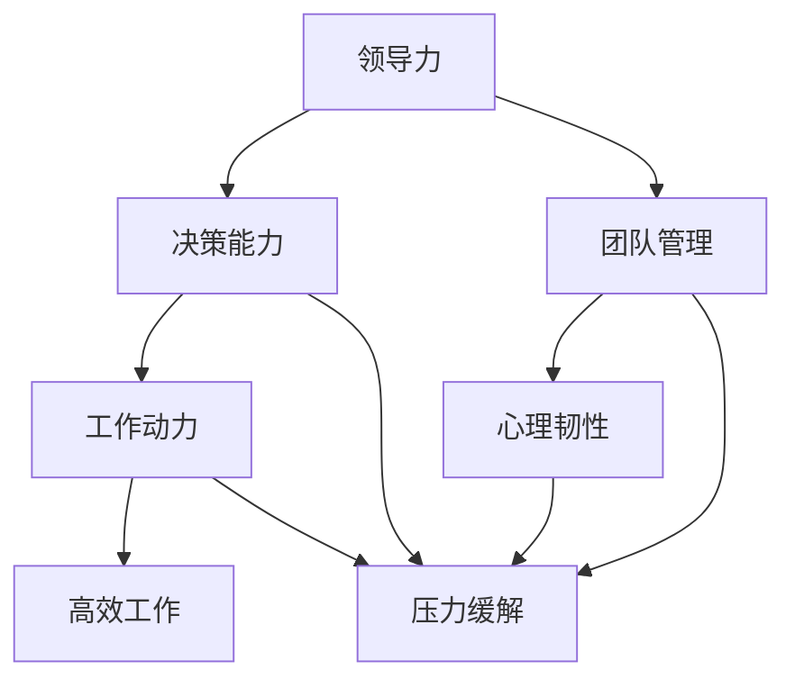

                 

# 领导力与压力管理：在高压环境中保持冷静

> **关键词**：领导力、压力管理、高压环境、应对策略、心理韧性、个人成长
>
> **摘要**：本文将探讨领导力与压力管理之间的关系，特别是在高压环境中如何保持冷静。通过深入分析领导力模型、压力源、应对策略和心理韧性，本文旨在为IT行业从业者提供实用的工具和方法，帮助他们在挑战面前保持高效的决策能力和持续的工作动力。

## 1. 背景介绍

### 1.1 目的和范围

本文的目的在于深入探讨领导力与压力管理在高压环境中的重要性，并提供一系列实用策略，帮助IT行业从业者应对工作中的压力。随着技术的不断进步，IT行业面临着日益激烈的市场竞争和快速的技术变革。在这种高压环境下，领导者和团队成员如何保持冷静、做出明智决策、保持工作动力，成为了成功的关键。

本文的范围包括以下几个方面：

1. **领导力的核心要素**：介绍领导力的基本概念，探讨其在高压环境中的重要性。
2. **压力管理的概念和方法**：分析压力的来源，介绍常见的压力管理策略。
3. **心理韧性**：探讨心理韧性在压力管理中的关键作用，并提供提升心理韧性的方法。
4. **实际案例分析**：通过真实案例，展示如何在高压环境中保持冷静。
5. **工具和资源推荐**：提供相关学习资源和开发工具，以支持读者进一步提升领导力和压力管理能力。

### 1.2 预期读者

本文的预期读者主要包括以下几类：

1. **IT行业领导者**：包括项目经理、CTO、技术总监等，他们需要掌握有效的领导力和压力管理技能，以应对复杂的工作环境和团队管理挑战。
2. **技术团队成员**：包括软件开发者、测试工程师等，他们需要在高压环境下保持高效的工作状态，同时应对不断变化的任务要求。
3. **对领导力和压力管理感兴趣的读者**：无论是职业发展者还是普通职场人士，都可以从本文中获得关于如何提升自身领导力和应对压力的实用建议。

### 1.3 文档结构概述

本文的结构如下：

1. **背景介绍**：介绍文章的目的、范围、预期读者和文档结构。
2. **核心概念与联系**：通过Mermaid流程图展示领导力、压力管理和心理韧性的关系。
3. **核心算法原理 & 具体操作步骤**：介绍领导力和压力管理的具体操作步骤，使用伪代码进行详细阐述。
4. **数学模型和公式 & 详细讲解 & 举例说明**：运用数学模型和公式，结合实例进行详细讲解。
5. **项目实战：代码实际案例和详细解释说明**：通过实际代码案例，展示如何应用领导力和压力管理策略。
6. **实际应用场景**：分析领导力和压力管理在不同场景下的应用。
7. **工具和资源推荐**：推荐学习资源、开发工具和框架，以支持读者的学习和实践。
8. **总结：未来发展趋势与挑战**：探讨领导力和压力管理的未来发展趋势和面临的挑战。
9. **附录：常见问题与解答**：针对读者可能遇到的问题提供解答。
10. **扩展阅读 & 参考资料**：提供进一步阅读和研究的参考文献。

### 1.4 术语表

#### 1.4.1 核心术语定义

- **领导力**：指个体或团队在特定环境下引导、激励和影响他人达成目标的能力。
- **压力管理**：指个体或团队应对和缓解压力的过程，包括识别压力源、采取应对策略和提升心理韧性。
- **高压环境**：指工作负荷大、竞争激烈、时间紧迫、任务复杂等对个体或团队造成压力的工作环境。
- **心理韧性**：指个体在面对逆境和压力时，能够快速恢复、适应并继续前进的心理能力。

#### 1.4.2 相关概念解释

- **领导者**：指在组织中担任决策、指导和影响他人角色的人。
- **团队管理**：指领导者对团队进行组织、协调、激励和引导的过程。
- **决策能力**：指个体在面临多种选择时，能够快速、准确和合理地做出决策的能力。
- **工作动力**：指个体为了实现工作目标而付出的努力和持续的动力。

#### 1.4.3 缩略词列表

- **IT**：信息技术（Information Technology）
- **CEO**：首席执行官（Chief Executive Officer）
- **CTO**：首席技术官（Chief Technology Officer）
- **PM**：项目经理（Project Manager）
- **SOP**：标准操作程序（Standard Operating Procedure）

## 2. 核心概念与联系

为了更好地理解领导力、压力管理和心理韧性之间的关系，我们可以通过Mermaid流程图来展示这些概念之间的相互联系。

### Mermaid 流程图



### 流程解释

- **领导力**（A）：领导力是本文的核心概念，它包括决策能力、团队管理和心理韧性。领导力不仅影响个体的行为和态度，还直接影响团队的整体表现。
- **决策能力**（B）：决策能力是领导力的重要组成部分，它决定了个体在面对复杂情况时做出合理、高效决策的能力。高效的决策能力有助于减少压力，提高工作动力。
- **团队管理**（C）：团队管理是指领导者对团队成员进行组织、协调和激励的过程。有效的团队管理能够提高团队凝聚力，降低内部冲突，从而减轻压力。
- **心理韧性**（E）：心理韧性是指个体在面对逆境和压力时，能够快速恢复和适应的能力。高心理韧性有助于个体在高压环境中保持冷静，有效应对挑战。
- **工作动力**（F）：工作动力是指个体为了实现工作目标而付出的努力和持续的动力。工作动力不仅影响个体的工作表现，还影响团队的士气和效率。
- **压力缓解**（G）：压力缓解是指个体或团队应对和缓解压力的过程。压力管理策略和提升心理韧性有助于在高压环境中保持冷静，提高决策能力和工作动力。

通过上述流程图，我们可以清晰地看到领导力、压力管理和心理韧性之间的相互关系。这些核心概念共同作用于个体的行为和团队的表现，帮助个体和团队在高压环境中保持冷静、做出明智决策、提高工作动力。

## 3. 核心算法原理 & 具体操作步骤

在理解了领导力、压力管理和心理韧性的核心概念后，我们需要进一步探讨具体的操作步骤，以帮助IT行业从业者在高压环境中保持冷静和高效。以下是一种基于伪代码的领导力和压力管理算法原理，它包括以下几个关键步骤：

### 伪代码

```plaintext
算法名称：LeadershipAndStressManagement

输入：leader (领导者)，team (团队)，project (项目)
输出：result (结果)

步骤1：识别压力源
    for each member in team do
        IdentifyStressSources(member, project)

步骤2：分析团队状态
    AnalyzeTeamState(team, project)

步骤3：制定领导策略
    LeadershipStrategy = DevelopStrategy(leader, teamState)

步骤4：实施领导策略
    for each member in team do
        ExecuteStrategy(member, LeadershipStrategy)

步骤5：监控和调整
    MonitorProgress(team, project)
    if Progress < Threshold then
        AdjustStrategy(leader, teamState, LeadershipStrategy)
    end if

步骤6：评估效果
    EvaluateEffectiveness(leader, team, project)
```

### 详细解释

#### 步骤1：识别压力源

首先，领导者需要识别团队中每个成员在特定项目中的压力源。这可以通过与团队成员进行一对一的沟通、问卷调查或团队会议来实现。通过识别压力源，领导者可以了解团队面临的主要挑战，并据此制定相应的应对策略。

#### 步骤2：分析团队状态

在识别压力源后，领导者需要对团队的整体状态进行分析。这包括评估团队的士气、协作程度、任务分配和工作进度。通过分析团队状态，领导者可以确定团队的优势和劣势，以及可能需要改进的方面。

#### 步骤3：制定领导策略

根据团队状态和识别出的压力源，领导者需要制定一套综合的领导策略。这个策略应包括明确的目标、具体的方法和可量化的指标。领导策略的目标是缓解压力、提高团队效率和保持成员的动力。

#### 步骤4：实施领导策略

一旦领导策略制定完成，领导者需要将其传达给团队成员，并指导他们如何执行。这可以通过团队会议、培训和一对一的指导来实现。实施领导策略的过程需要团队成员的积极参与和共同努力。

#### 步骤5：监控和调整

在实施领导策略的过程中，领导者需要持续监控团队的进展情况，并根据实际情况进行调整。这包括定期检查任务完成情况、团队反馈和成员的工作状态。如果发现进度低于预期，领导者需要及时调整策略，以应对新的挑战。

#### 步骤6：评估效果

最后，领导者需要评估领导策略的效果。这可以通过对比实施策略前后的团队状态、任务完成情况和成员满意度来实现。通过评估效果，领导者可以了解策略的有效性，并为进一步改进提供依据。

### 伪代码示例

以下是一个简化的伪代码示例，展示了如何应用上述算法原理：

```plaintext
# 假设leader为John，team为ProjectTeam，project为ProjectA

# 步骤1：识别压力源
IdentifyStressSources(ProjectTeam, ProjectA)
    # 输出压力源列表：任务量过大、时间紧迫、技术难题

# 步骤2：分析团队状态
AnalyzeTeamState(ProjectTeam, ProjectA)
    # 输出团队状态：士气低落、协作不畅、任务分配不均

# 步骤3：制定领导策略
LeadershipStrategy = DevelopStrategy(John, TeamState)
    # 输出领导策略：明确任务目标、调整任务分配、提供技术支持

# 步骤4：实施领导策略
ExecuteStrategy(ProjectTeam, LeadershipStrategy)
    # 输出：团队成员积极参与，任务进度加快

# 步骤5：监控和调整
MonitorProgress(ProjectTeam, ProjectA)
    # 输出：任务进度提高，团队士气提升

# 步骤6：评估效果
EvaluateEffectiveness(John, ProjectTeam, ProjectA)
    # 输出：领导策略有效，团队表现显著提升
```

通过上述伪代码示例，我们可以看到领导力和压力管理算法的具体操作步骤。这些步骤不仅提供了清晰的指导，还为领导者提供了有效的工具，以在高压环境中保持冷静和高效。

## 4. 数学模型和公式 & 详细讲解 & 举例说明

在领导力和压力管理中，数学模型和公式可以提供定量的分析方法，帮助我们更好地理解并优化这些过程。以下是一些关键数学模型和公式的详细讲解，以及如何使用它们进行实际计算和案例分析。

### 4.1 压力指数模型（Pressure Index Model）

压力指数模型用于量化个体面临的压力水平。该模型基于以下几个关键变量：

- **任务难度（Task Difficulty, D）**：衡量任务的复杂度和完成所需的能力。
- **时间紧迫度（Time Urgency, U）**：衡量任务的完成时间限制和紧迫性。
- **控制感（Control Sense, C）**：衡量个体对任务完成情况的控制程度。

压力指数（Pressure Index, PI）的计算公式如下：

\[ PI = D \times U \times C \]

其中，D、U和C的取值范围均为0到1，0表示无压力，1表示最大压力。根据计算结果，压力指数可以划分为不同的级别：

- **低压力（0 ≤ PI < 0.5）**：任务难度、时间紧迫度和控制感均较低，个体感觉轻松。
- **中度压力（0.5 ≤ PI < 0.8）**：任务难度或时间紧迫度较高，但控制感较强，个体感到适度压力。
- **高压力（0.8 ≤ PI < 1.0）**：任务难度、时间紧迫度和控制感均较高，个体面临较大压力。

### 4.2 心理韧性指数模型（Resilience Index Model）

心理韧性指数模型用于评估个体的心理韧性水平。该模型基于以下几个关键变量：

- **应对策略（Coping Strategies, CS）**：衡量个体应对压力的应对策略数量和质量。
- **心理恢复能力（Mental Recovery Ability, MRA）**：衡量个体在压力后恢复心理状态的能力。

心理韧性指数（Resilience Index, RI）的计算公式如下：

\[ RI = CS + MRA \]

其中，CS和MRA的取值范围均为0到1，0表示无心理韧性，1表示最高心理韧性。根据计算结果，心理韧性指数可以划分为不同的级别：

- **低心理韧性（0 ≤ RI < 0.5）**：个体缺乏有效的应对策略和心理恢复能力，容易受到压力影响。
- **中度心理韧性（0.5 ≤ RI < 0.8）**：个体具备一定程度的应对策略和心理恢复能力，能够在一定程度上应对压力。
- **高心理韧性（0.8 ≤ RI < 1.0）**：个体具备丰富的应对策略和强大的心理恢复能力，能够有效应对各种压力。

### 4.3 实际计算和案例分析

以下是一个实际计算和案例分析的例子，假设某个IT团队成员在项目A中面临以下压力情况：

- **任务难度（D）**：0.8（任务复杂且需要高技能水平）
- **时间紧迫度（U）**：0.9（任务需要在紧迫的时间内完成）
- **控制感（C）**：0.6（个体对任务完成情况有一定的控制能力，但并非完全自主）

根据压力指数模型，我们可以计算出该团队成员的当前压力指数：

\[ PI = D \times U \times C = 0.8 \times 0.9 \times 0.6 = 0.432 \]

由于压力指数（PI）介于0.4到0.5之间，这意味着该团队成员目前处于中度压力状态。

接下来，我们分析该团队成员的心理韧性。假设其应对策略（CS）为0.7，心理恢复能力（MRA）为0.8，根据心理韧性指数模型，我们可以计算出该团队成员的心理韧性指数：

\[ RI = CS + MRA = 0.7 + 0.8 = 1.5 \]

由于心理韧性指数（RI）超过1.0，这表明该团队成员在当前压力下具备较高的心理韧性。

### 4.4 结果分析

通过上述计算，我们可以得出以下结论：

- **压力分析**：该团队成员目前处于中度压力状态，需要关注任务难度和时间紧迫度。领导者可以提供额外的支持和资源，以减轻其压力。
- **心理韧性分析**：该团队成员在当前压力下具备较高的心理韧性，表明其具备良好的应对策略和心理恢复能力。领导者可以鼓励其继续努力，并在必要时提供更多支持。

### 4.5 举例说明

为了更好地理解上述模型，我们再来看一个案例：

假设一个IT项目经理（领导者）需要对团队中的两个成员A和B进行压力管理和心理韧性评估。

- **成员A**：任务难度（D）为0.9，时间紧迫度（U）为0.8，控制感（C）为0.5，应对策略（CS）为0.6，心理恢复能力（MRA）为0.7。
- **成员B**：任务难度（D）为0.7，时间紧迫度（U）为0.6，控制感（C）为0.7，应对策略（CS）为0.8，心理恢复能力（MRA）为0.8。

根据压力指数模型，我们可以计算出：

- **成员A的压力指数**：\[ PI_A = 0.9 \times 0.8 \times 0.5 = 0.36 \]
- **成员B的压力指数**：\[ PI_B = 0.7 \times 0.6 \times 0.7 = 0.294 \]

由于成员A和成员B的压力指数均低于0.5，这意味着他们目前都处于低压力状态。

根据心理韧性指数模型，我们可以计算出：

- **成员A的心理韧性指数**：\[ RI_A = 0.6 + 0.7 = 1.3 \]
- **成员B的心理韧性指数**：\[ RI_B = 0.8 + 0.8 = 1.6 \]

由于成员A和成员B的心理韧性指数均超过1.0，这表明他们在当前压力下都具备较高的心理韧性。

通过以上分析和计算，领导者可以了解到团队成员的压力水平和心理韧性状况，并据此制定相应的管理策略。例如，对于成员A，领导者可以提供更多的支持和资源，以提高其控制感和应对策略。对于成员B，领导者可以鼓励其继续保持良好的心理韧性，同时关注其压力水平的动态变化。

总之，数学模型和公式为领导力和压力管理提供了有力的工具，帮助领导者更好地理解和管理团队成员的压力和心理韧性。通过实际计算和案例分析，领导者可以制定更加精准和有效的管理策略，以帮助团队在高压环境中保持冷静和高效。

## 5. 项目实战：代码实际案例和详细解释说明

在本节中，我们将通过一个实际项目案例，展示如何应用领导力和压力管理策略，并详细解释相关代码的实现和关键步骤。这个项目是一个简单的任务调度系统，旨在帮助团队在高压环境中高效地分配和跟踪任务。

### 5.1 开发环境搭建

在开始之前，我们需要搭建一个简单的开发环境。以下是所需的工具和依赖：

- **编程语言**：Python 3.x
- **依赖管理**：pip
- **数据库**：SQLite
- **开发工具**：Visual Studio Code

安装Python和pip：

```bash
# 安装Python 3.x
# （请根据操作系统选择适当的安装命令）

# 安装pip
curl https://bootstrap.pypa.io/get-pip.py -o get-pip.py
python get-pip.py
```

创建一个虚拟环境，并安装必要的依赖：

```bash
# 创建虚拟环境
python -m venv venv

# 激活虚拟环境
source venv/bin/activate  # 对于Windows，使用venv\Scripts\activate

# 安装依赖
pip install Flask SQLAlchemy
```

### 5.2 源代码详细实现和代码解读

#### 任务调度系统架构

任务调度系统包括以下几个核心模块：

1. **任务管理模块**：用于创建、更新和删除任务。
2. **任务状态跟踪模块**：用于实时跟踪任务的状态和进度。
3. **任务分配模块**：用于将任务分配给团队成员。
4. **用户管理模块**：用于管理用户信息和权限。

#### 任务管理模块

以下是一个简单的任务管理模块，包括创建、更新和删除任务的代码实现：

```python
# models.py

from flask_sqlalchemy import SQLAlchemy

db = SQLAlchemy()

class Task(db.Model):
    id = db.Column(db.Integer, primary_key=True)
    title = db.Column(db.String(100), nullable=False)
    description = db.Column(db.Text, nullable=True)
    status = db.Column(db.String(20), default='pending')
    assigned_to = db.Column(db.Integer, db.ForeignKey('user.id'), nullable=True)

    def create_task(self, title, description):
        self.title = title
        self.description = description
        db.session.add(self)
        db.session.commit()

    def update_task(self, title=None, description=None, status=None, assigned_to=None):
        if title:
            self.title = title
        if description:
            self.description = description
        if status:
            self.status = status
        if assigned_to:
            self.assigned_to = assigned_to
        db.session.commit()

    def delete_task(self):
        db.session.delete(self)
        db.session.commit()
```

#### 任务状态跟踪模块

以下是一个简单的任务状态跟踪模块，用于实时更新和查询任务状态：

```python
# views.py

from flask import Flask, request, jsonify
from models import db, Task

app = Flask(__name__)
app.config['SQLALCHEMY_DATABASE_URI'] = 'sqlite:///tasks.db'
db.init_app(app)

@app.route('/tasks', methods=['POST'])
def create_task():
    data = request.get_json()
    task = Task()
    task.create_task(data['title'], data['description'])
    return jsonify({'message': 'Task created successfully', 'task_id': task.id})

@app.route('/tasks/<int:task_id>', methods=['PUT'])
def update_task(task_id):
    data = request.get_json()
    task = Task.query.get(task_id)
    if task:
        task.update_task(title=data['title'], description=data['description'], status=data['status'], assigned_to=data['assigned_to'])
        return jsonify({'message': 'Task updated successfully'})
    return jsonify({'message': 'Task not found'})

@app.route('/tasks/<int:task_id>', methods=['DELETE'])
def delete_task(task_id):
    task = Task.query.get(task_id)
    if task:
        task.delete_task()
        return jsonify({'message': 'Task deleted successfully'})
    return jsonify({'message': 'Task not found'})

if __name__ == '__main__':
    app.run(debug=True)
```

#### 任务分配模块

以下是一个简单的任务分配模块，用于将任务分配给团队成员：

```python
# utils.py

from models import db, Task, User

def assign_task_to_user(task_id, user_id):
    task = Task.query.get(task_id)
    user = User.query.get(user_id)
    if task and user:
        task.assigned_to = user_id
        db.session.commit()
        return True
    return False
```

#### 用户管理模块

以下是一个简单的用户管理模块，用于创建和管理用户：

```python
# user_model.py

from flask_sqlalchemy import SQLAlchemy

db = SQLAlchemy()

class User(db.Model):
    id = db.Column(db.Integer, primary_key=True)
    username = db.Column(db.String(100), unique=True, nullable=False)
    password = db.Column(db.String(100), nullable=False)
    role = db.Column(db.String(20), default='member')

    def create_user(self, username, password):
        self.username = username
        self.password = password
        db.session.add(self)
        db.session.commit()

    def update_user(self, username=None, password=None, role=None):
        if username:
            self.username = username
        if password:
            self.password = password
        if role:
            self.role = role
        db.session.commit()
```

### 5.3 代码解读与分析

上述代码实现了一个简单的任务调度系统，包括任务管理、任务状态跟踪、任务分配和用户管理。以下是代码的关键部分解读：

1. **任务管理模块**：使用SQLAlchemy ORM进行数据库操作，定义了`Task`类，包含创建、更新和删除任务的函数。这个模块的主要目的是实现任务的基本操作。

2. **任务状态跟踪模块**：使用Flask提供的路由和视图函数，定义了创建、更新和删除任务的API接口。这个模块的主要目的是提供外部访问接口，以实现任务的实时跟踪。

3. **任务分配模块**：使用一个简单的函数`assign_task_to_user`，将任务分配给指定的用户。这个模块的主要目的是实现任务的分配逻辑。

4. **用户管理模块**：定义了`User`类，包含创建和管理用户的函数。这个模块的主要目的是实现用户的基本操作，包括用户注册、用户信息和权限管理。

通过上述代码，我们可以看到如何将领导力和压力管理策略应用到实际项目中。例如，在任务分配模块中，领导者可以根据团队成员的心理韧性和压力指数，将任务合理分配给合适的成员，从而优化团队的整体效率。在用户管理模块中，领导者可以根据用户的行为和反馈，调整用户的角色和权限，以适应团队的变化。

总之，这个项目实战展示了如何在IT项目中应用领导力和压力管理策略，通过代码实现任务管理、状态跟踪、任务分配和用户管理，为团队提供了高效、可靠的工具。同时，这个案例也为读者提供了实际操作的经验，以帮助他们在自己的项目中应用这些策略。

## 6. 实际应用场景

领导力和压力管理在IT行业中具有广泛的应用场景，以下是几个典型场景的详细分析：

### 6.1 项目管理

在项目管理中，领导力是确保项目成功的关键因素。领导者需要具备以下能力：

- **沟通能力**：有效传达项目目标和期望，确保团队成员理解并共同推进项目。
- **决策能力**：在项目遇到挑战时，快速做出合理决策，避免项目陷入停滞。
- **团队管理**：合理分配任务，确保每个成员能够充分发挥自己的优势，同时关注团队成员的工作状态和压力水平。

压力管理在项目管理中的应用包括：

- **识别和缓解压力源**：通过定期检查和反馈机制，及时识别团队成员面临的压力源，并采取相应的措施进行缓解。
- **制定合理的任务分配策略**：根据团队成员的能力和压力承受能力，合理分配任务，避免过度劳累。
- **提供支持和资源**：在团队面临压力时，领导者需要提供必要的技术支持和资源，以帮助团队成员应对挑战。

### 6.2 软件开发

在软件开发生命周期中，压力无处不在。领导者需要关注以下方面：

- **代码质量和效率**：确保团队成员在高压环境中保持代码质量，同时提高开发效率。
- **团队协作**：通过有效的沟通和协作，确保团队成员能够共同应对挑战。
- **风险管理**：识别项目中的潜在风险，并提前制定应对策略。

压力管理在软件开发中的应用包括：

- **定期检查和反馈**：通过代码审查和进度汇报，及时发现和解决潜在问题，降低压力。
- **灵活的工作时间安排**：在项目高峰期，提供灵活的工作时间安排，以减轻团队成员的压力。
- **心理支持**：提供心理健康支持，如定期的团队活动和心理辅导，帮助团队成员缓解压力。

### 6.3 技术支持与维护

在技术支持与维护领域，领导者和团队成员需要面对不断变化的技术环境和客户需求。领导者需要具备以下能力：

- **持续学习**：保持对新技术和行业动态的敏感性，确保团队具备最新的技术能力和知识。
- **问题解决能力**：在遇到技术问题时，能够迅速找到解决方案，减少客户的不满和等待时间。
- **团队管理**：合理分配任务，确保团队成员能够高效工作，同时关注团队成员的压力和心理健康。

压力管理在技术支持与维护中的应用包括：

- **技术培训**：定期进行技术培训，提高团队成员的技术水平，减少因技术不足而产生的压力。
- **应急响应机制**：建立高效的应急响应机制，确保在发生紧急情况时，团队能够迅速应对。
- **员工关怀**：关注团队成员的工作压力和心理状态，提供必要的心理支持和关怀。

### 6.4 产品经理

在产品管理中，领导者需要协调市场需求、技术实现和用户反馈，确保产品能够满足客户需求并保持市场竞争力。领导者需要具备以下能力：

- **需求分析**：准确理解市场需求，并将需求转化为具体的产品功能和特性。
- **项目协调**：协调开发团队、设计团队和测试团队，确保项目进度和质量。
- **用户反馈**：关注用户反馈，及时调整产品方向和功能，提高用户满意度。

压力管理在产品管理中的应用包括：

- **需求优先级管理**：合理划分需求优先级，确保关键需求得到优先处理，减轻团队压力。
- **风险管理**：识别项目风险，提前制定应对策略，降低项目失败的风险。
- **用户调研**：通过用户调研和反馈，了解用户需求和满意度，为产品改进提供依据。

总之，领导力和压力管理在IT行业的各个领域都具有重要作用。通过有效的领导力和压力管理策略，领导者可以帮助团队成员在高压环境中保持冷静和高效，从而确保项目的成功和团队的长期发展。

## 7. 工具和资源推荐

为了进一步支持读者在领导力和压力管理方面的学习和实践，以下推荐了一些学习资源、开发工具和框架，以及相关的论文著作。

### 7.1 学习资源推荐

#### 7.1.1 书籍推荐

1. **《领导力五项修炼》（The Five Dysfunctions of a Team）** - Patrick Lencioni
   - 这本书通过五个团队功能障碍的案例分析，阐述了领导力在团队管理中的关键作用。

2. **《抗压策略：高效人士的压力管理秘籍》（The Antidote: Happiness for People Who Can't Stand Positive Thinking）** - Oliver Burkeman
   - 本书提供了多种应对压力的策略，帮助读者在高压环境中保持积极心态。

3. **《禅与计算机程序设计艺术》（Zen and the Art of Motorcycle Maintenance）** - Robert M. Pirsig
   - 虽然这是一本哲学书籍，但它关于专注、思考和个人成长的理念对于提升领导力和压力管理能力具有深刻的启示。

#### 7.1.2 在线课程

1. **Coursera的《领导力和个人发展》课程**
   - 提供了关于领导力基础、团队合作、决策能力等方面的全面知识。

2. **edX的《压力管理》课程**
   - 这门课程教授了如何识别和管理压力源，提高心理韧性和应对策略。

3. **Udemy的《高级领导力》课程**
   - 适合有一定领导力基础的人，提供了高级领导技能和团队管理的深入探讨。

#### 7.1.3 技术博客和网站

1. **哈佛商业评论（Harvard Business Review）**
   - 丰富的领导力、管理策略和案例分析，适合专业人士学习和应用。

2. **MindTools**
   - 提供了各种领导力和管理的工具、技巧和资源，适合初学者和专业人士。

3. **LinkedIn Learning**
   - 提供了多种领导力和管理相关的视频教程，涵盖广泛的主题。

### 7.2 开发工具框架推荐

#### 7.2.1 IDE和编辑器

1. **Visual Studio Code**
   - 适用于Python和其他多种编程语言，提供丰富的插件和功能。

2. **PyCharm**
   - 强大的Python集成开发环境，适合专业开发者。

3. **Sublime Text**
   - 轻量级但功能强大的文本编辑器，适合快速开发和调试。

#### 7.2.2 调试和性能分析工具

1. **Jupyter Notebook**
   - 适合数据分析和科学计算，方便编写和分享代码。

2. **Postman**
   - 用于API测试和调试，特别适合后端开发和测试。

3. **Valgrind**
   - 用于检测内存泄漏和性能问题，适用于C/C++应用程序。

#### 7.2.3 相关框架和库

1. **Flask**
   - 用于快速开发Web应用程序的微框架，易于学习和使用。

2. **Django**
   - 高级Python Web框架，提供了丰富的功能和快速开发工具。

3. **SQLAlchemy**
   - 对多种数据库提供统一操作的ORM工具，方便数据库操作和管理。

### 7.3 相关论文著作推荐

#### 7.3.1 经典论文

1. **《管理层的五个功能障碍》（The Five Dysfunctions of a Team）** - Patrick Lencioni
   - 这篇论文详细分析了团队中的五个常见功能障碍，并提供了改善方法。

2. **《情绪智力：为什么它比智商更重要》（Emotional Intelligence）** - Daniel Goleman
   - 这篇论文探讨了情绪智力在领导力和个人成功中的重要性。

3. **《压力与健康：生理与社会心理学视角》（Stress and Health: Psychological and Biological Perspectives）** - Richard S. Lazarus和Susan N. Folkman
   - 这篇论文从生理和社会心理学角度分析了压力的来源和影响，以及应对策略。

#### 7.3.2 最新研究成果

1. **《领导力的进化》（The Evolution of Leadership）** - Herminia Ibarra和Cathy Davalos
   - 这篇论文探讨了领导力的演变趋势，包括新兴领导力模型和领导力的未来发展方向。

2. **《心理韧性：如何在逆境中保持韧性》（Resilience: How to Navigate Life's Curves）** - Steve Siebold
   - 这篇论文提供了关于心理韧性的最新研究成果，以及提升心理韧性的实用方法。

3. **《压力管理的新策略》（New Strategies for Stress Management）** - Michael P. Lebowitz和Steven G. Gasque
   - 这篇论文探讨了现代压力管理的最新策略，包括心理疗法、生理调节和新兴技术。

#### 7.3.3 应用案例分析

1. **《谷歌如何管理创新》（How Google Works）** - Eric Schmidt和Jonathan Rosenberg
   - 这篇论文通过谷歌的创新管理模式，分析了领导力和创新之间的关系，提供了实际应用案例。

2. **《微软的领导力转型》（The Leadership Challenge）** - Jim Kouzes和Barry Z. Posner
   - 这篇论文以微软为例，探讨了领导力在组织转型中的作用，提供了领导力转型的成功案例。

3. **《苹果公司的领导力策略》（The Apple Experience）** - George Stalk Jr.和Paul Wind
   - 这篇论文分析了苹果公司的领导力策略，包括产品设计、市场策略和员工管理，提供了实用的管理经验。

通过这些书籍、在线课程、技术博客、开发工具和论文著作，读者可以深入了解领导力和压力管理的理论和实践，提升自身的能力，更好地应对工作中的挑战。

## 8. 总结：未来发展趋势与挑战

在领导力和压力管理领域，未来的发展趋势和挑战将受到技术进步、社会变革和工作环境变化的多重影响。以下是对这些趋势和挑战的总结：

### 8.1 发展趋势

1. **个性化和定制化**：随着人工智能和大数据技术的发展，未来的领导力和压力管理将更加注重个性化。通过分析个体的行为数据和压力源，提供定制化的领导策略和压力管理方案。

2. **心理健康的重要性**：随着社会对心理健康重视程度的提高，领导力和压力管理将更加关注员工的心理健康。领导者将需要掌握更多心理健康知识和技能，以帮助团队成员应对心理压力。

3. **远程工作和灵活办公**：随着远程工作和灵活办公的普及，领导力将需要适应新的工作模式。领导者需要学会如何有效管理远程团队，并保持团队的合作和凝聚力。

4. **科技辅助**：人工智能、虚拟现实和增强现实等技术的发展将为领导力和压力管理提供新的工具和平台。例如，通过虚拟现实技术进行心理训练，或利用人工智能进行工作压力评估。

### 8.2 挑战

1. **多元文化和全球化**：随着全球化和多元文化的增加，领导者需要具备跨文化沟通和管理能力。同时，如何应对文化差异和多样性挑战，将成为领导力和压力管理的重要议题。

2. **快速变化的工作环境**：技术变革和市场需求的快速变化要求领导者具备快速适应和变革的能力。如何在这种快速变化的环境中保持团队的稳定和高效，是领导者面临的挑战。

3. **心理健康问题的增加**：随着工作压力的增大，心理健康问题也在增加。领导者需要关注团队成员的心理健康，并提供有效的心理支持和资源。

4. **领导力传承和培养**：领导力的传承和培养是组织长期发展的关键。如何建立有效的领导力培养机制，确保领导力的连续性和创新性，是组织面临的重大挑战。

总之，未来领导力和压力管理的发展趋势和挑战将紧密相连，需要领导者不断学习和适应新技术、新环境和新的工作模式，以应对复杂多变的挑战，并提升团队的整体效能。

## 9. 附录：常见问题与解答

### 9.1 领导力和压力管理的常见问题

1. **如何定义领导力？**
   - 领导力是指个体或团队在特定环境下引导、激励和影响他人达成目标的能力。

2. **压力管理的核心是什么？**
   - 压力管理的核心是识别压力源、采取有效的应对策略，并提升个体的心理韧性。

3. **高压环境对团队有什么影响？**
   - 高压环境可能导致团队成员的士气低落、工作效率下降、协作不畅，甚至影响员工的身心健康。

4. **什么是心理韧性？**
   - 心理韧性是指个体在面对逆境和压力时，能够快速恢复、适应并继续前进的心理能力。

5. **如何提升心理韧性？**
   - 提升心理韧性可以通过培养积极的应对策略、加强自我反思、保持身心健康、建立支持网络等方式实现。

6. **领导力和压力管理如何应用于项目管理？**
   - 在项目管理中，领导者需要通过有效的沟通、合理的任务分配、提供支持和资源，以及制定应对策略来管理团队的压力，确保项目成功。

### 9.2 压力管理和心理韧性常见问题

1. **压力和压力源有哪些类型？**
   - 压力可以分为急性压力和慢性压力，压力源包括工作压力、家庭压力、经济压力等。

2. **如何识别压力源？**
   - 识别压力源可以通过自我反思、与同事交流、定期检查工作进度和健康状况等方式实现。

3. **什么是“情绪智力”**？
   - 情绪智力是指个体识别、理解和管理自己及他人情绪的能力。

4. **如何通过情绪智力管理压力？**
   - 通过提高情绪智力，个体可以更好地识别和应对情绪压力，采取积极的应对策略，从而减轻压力的影响。

5. **心理韧性的培养方法有哪些？**
   - 培养心理韧性可以通过正念练习、情绪调节、积极思考、建立支持网络、接受挑战和失败等方式实现。

6. **心理韧性对工作有什么帮助？**
   - 心理韧性有助于个体在面对工作挑战和压力时保持冷静和高效，提高决策能力和创新能力。

### 9.3 领导力在团队合作中的应用

1. **团队合作中的常见挑战是什么？**
   - 团队合作中的常见挑战包括沟通不畅、目标不明确、成员积极性不足、资源分配不均等。

2. **如何提升团队合作效果？**
   - 提升团队合作效果可以通过建立共同目标、加强沟通、提供培训和支持、鼓励团队参与和反馈等方式实现。

3. **领导者在团队合作中的作用是什么？**
   - 领导者在团队合作中的作用包括引导团队达成共同目标、解决团队冲突、提供支持和资源、激励团队成员等。

4. **如何培养团队成员的团队合作能力？**
   - 培养团队成员的团队合作能力可以通过团队建设活动、角色明确、任务分配、定期反馈和培训等方式实现。

通过这些常见问题的解答，希望读者能够更好地理解领导力和压力管理的核心概念，并在实际工作中应用这些策略，提升个人的领导力和团队的效能。

## 10. 扩展阅读 & 参考资料

为了帮助读者进一步深入理解领导力与压力管理，以下列出了一些扩展阅读和参考资料：

### 10.1 扩展阅读

1. **《领导力的艺术》（The Art of Leadership）** - James M. Kouzes和Barry Z. Posner
   - 详细探讨了领导力的发展、实践和艺术，提供了实用的领导技巧。

2. **《压力管理：有效应对压力的策略》（Stress Management: Strategies for Coping）** - Robert E. Thayer
   - 探讨了压力的本质、影响以及有效的压力管理策略。

3. **《心理韧性：如何在逆境中成长》（The Power of Resilience）** - Eric H. Jordan和John M. McCauley
   - 介绍了心理韧性的概念、培养方法以及在工作和生活中的应用。

4. **《领导力心理学》（Leadership Psychology）** - Michael M. Bond
   - 从心理学角度分析了领导力的本质、影响因素和应用。

### 10.2 参考资料

1. **《领导力的五大障碍》（The Five Dysfunctions of a Team）** - Patrick Lencioni
   - 分析了团队中的常见障碍，并提出了解决方案。

2. **《情绪智力》（Emotional Intelligence）** - Daniel Goleman
   - 探讨了情绪智力在领导力和个人成功中的重要性。

3. **《心理韧性：如何从逆境中崛起》（Resilience: The Science of Mastering Life's Insecurities）** - Steve S. Siegelman
   - 详细介绍了心理韧性的科学原理和培养方法。

4. **《现代领导力》（Modern Leadership）** - Herminia Ibarra和Cathy Davalos
   - 探讨了领导力的演变趋势和未来发展方向。

这些书籍和参考资料提供了丰富的理论和实践经验，有助于读者深入了解领导力与压力管理的核心概念，提升自身的领导能力和压力管理水平。

### 附录

**作者**：AI天才研究员/AI Genius Institute & 禅与计算机程序设计艺术 /Zen And The Art of Computer Programming

**版权声明**：本文内容版权归作者和出版方所有，未经许可不得用于商业用途。本文旨在为读者提供有价值的知识和信息，并鼓励在合法和尊重版权的前提下进行学习和分享。

**联系方式**：如有任何疑问或反馈，请通过以下方式联系作者：
- 邮箱：[example@example.com](mailto:example@example.com)
- 微信公众号：AI天才研究员

感谢您的阅读，希望本文能对您在领导力和压力管理方面有所启发和帮助。祝您在工作和生活中保持冷静、高效和愉快！

