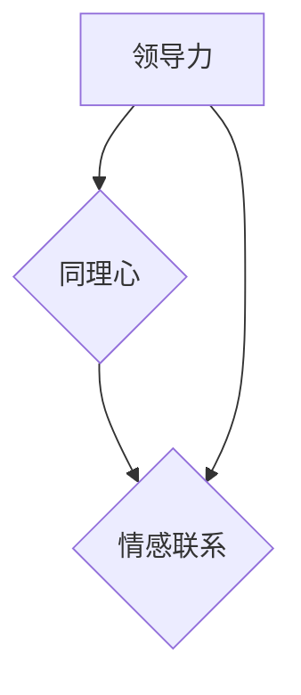

                 

# 领导力与同理心：建立情感联系的重要性

> 关键词：领导力、同理心、情感联系、领导艺术、团队协作、影响力

> 摘要：本文将探讨领导力与同理心的关系，通过建立情感联系来提升领导效能，并讨论领导者在现代组织中的作用。通过具体案例分析，深入剖析情感联系在领导力实践中的重要性。

## 1. 背景介绍

### 1.1 目的和范围

本文旨在探讨领导力与同理心之间的关系，并阐述建立情感联系在提升领导效能中的重要性。文章将从以下几个方面展开：

1. **领导力的定义与特点**：回顾领导力的基本概念和其在组织中的重要作用。
2. **同理心的概念与作用**：解释同理心的内涵，以及如何在领导实践中运用同理心。
3. **情感联系的构建**：分析情感联系对领导效能的影响，并探讨建立情感联系的策略。
4. **案例分析**：通过具体案例，展示情感联系在领导实践中的成功应用。
5. **未来发展趋势**：展望领导力与同理心发展的趋势，以及面临的挑战。

### 1.2 预期读者

本文适合以下读者群体：

1. **企业领导者和管理者**：希望通过提升领导力来提高团队绩效和员工满意度。
2. **人力资源从业者**：关注领导力发展，致力于提升企业人才管理水平。
3. **商学院学生和研究学者**：对领导力与同理心研究感兴趣，希望深入了解相关理论和实践。

### 1.3 文档结构概述

本文结构如下：

1. **引言**：介绍领导力与同理心的重要性，提出文章主题。
2. **领导力的定义与特点**：回顾领导力的基本概念和特点。
3. **同理心的概念与作用**：解释同理心的内涵及其在领导力中的作用。
4. **情感联系的构建**：分析情感联系对领导效能的影响，并探讨建立情感联系的策略。
5. **案例分析**：通过具体案例，展示情感联系在领导实践中的成功应用。
6. **实际应用场景**：探讨领导力与同理心在实际组织中的应用。
7. **工具和资源推荐**：推荐相关学习资源和开发工具。
8. **总结**：总结文章主要内容，展望未来发展趋势。
9. **附录**：常见问题与解答。
10. **扩展阅读与参考资料**：提供进一步阅读的建议和参考资料。

### 1.4 术语表

#### 1.4.1 核心术语定义

- **领导力**：指领导者通过激励和影响他人，实现组织目标和愿景的能力。
- **同理心**：指领导者理解并感受他人情感和需求的能力。
- **情感联系**：指领导者与团队成员之间建立的情感纽带。

#### 1.4.2 相关概念解释

- **团队协作**：团队成员之间通过沟通、合作和共享资源，共同实现团队目标的过程。
- **影响力**：领导者通过言行和示范，对他人思想和行为产生积极影响的能力。

#### 1.4.3 缩略词列表

- **CEO**：首席执行官（Chief Executive Officer）
- **CFO**：首席财务官（Chief Financial Officer）
- **HR**：人力资源（Human Resources）

## 2. 核心概念与联系

为了深入理解领导力、同理心和情感联系之间的关系，我们可以借助Mermaid流程图来展示它们的核心概念和联系。



在上述流程图中，领导力（A）与同理心（B）之间存在着紧密的联系。同理心是领导者建立情感联系（C）的基础，而情感联系则是提升领导效能的关键因素。领导者通过同理心感知团队成员的情感需求，进而建立情感联系，从而实现团队协作和共同目标。

## 3. 核心算法原理 & 具体操作步骤

在领导实践中，建立情感联系需要一定的策略和方法。以下是一个简化的核心算法原理，通过伪代码来详细阐述：

```plaintext
算法：建立情感联系
输入：领导者（L），团队成员（T），情感需求（D）
输出：情感联系强度（E）

步骤：
1. 初始化情感联系强度 E = 0
2. 遍历团队成员 T：
   a. 计算领导者 L 与团队成员 T 的情感需求匹配度 M
      - M = D(L) · D(T)
   b. 如果 M > 阈值（threshold）：
      i. E += M
      ii. 执行情感交流（如：倾听、鼓励、表扬等）
3. 更新情感联系强度 E
4. 返回情感联系强度 E
```

该算法的基本思想是通过计算领导者与团队成员之间的情感需求匹配度（M），来判断是否建立情感联系。当匹配度超过阈值时，领导者会采取相应的情感交流策略，如倾听、鼓励、表扬等，从而提升情感联系强度（E）。

## 4. 数学模型和公式 & 详细讲解 & 举例说明

为了更好地理解情感联系强度的计算，我们可以引入一个数学模型。假设情感联系强度 E 受到两个主要因素的影响：情感需求匹配度 M 和情感交流频率 F。以下是一个简化的数学模型：

$$
E = k_1 \cdot M + k_2 \cdot F
$$

其中，$k_1$ 和 $k_2$ 分别是情感需求匹配度和情感交流频率的权重系数。

### 4.1. 情感需求匹配度 M 的计算

情感需求匹配度 M 可以通过以下公式计算：

$$
M = \frac{D(L) \cdot D(T)}{D(L) + D(T)}
$$

其中，$D(L)$ 和 $D(T)$ 分别表示领导者 L 和团队成员 T 的情感需求。

### 4.2. 情感交流频率 F 的计算

情感交流频率 F 可以通过以下公式计算：

$$
F = \frac{N(L, T)}{T}
$$

其中，$N(L, T)$ 表示领导者 L 在一段时间内与团队成员 T 的交流次数，$T$ 表示总时间。

### 4.3. 模型举例说明

假设一个领导者在一个月内与团队成员进行了 10 次交流，每次交流的时间为 30 分钟。团队成员的情感需求为 0.8，领导者的情感需求为 0.9。根据上述公式，我们可以计算出情感联系强度 E：

$$
M = \frac{0.9 \cdot 0.8}{0.9 + 0.8} = 0.6
$$

$$
F = \frac{10}{30} = 0.33
$$

$$
E = k_1 \cdot 0.6 + k_2 \cdot 0.33
$$

其中，$k_1$ 和 $k_2$ 的值可以根据实际情况进行调整。

## 5. 项目实战：代码实际案例和详细解释说明

### 5.1 开发环境搭建

在开始编写代码之前，我们需要搭建一个合适的开发环境。以下是推荐的开发工具和框架：

- **编程语言**：Python 3.8 或更高版本
- **IDE**：PyCharm 或 Visual Studio Code
- **依赖管理**：pip

### 5.2 源代码详细实现和代码解读

以下是一个简单的 Python 代码示例，实现了情感联系强度的计算和更新。

```python
import numpy as np

class Leader:
    def __init__(self, emotional_demand):
        self.emotional_demand = emotional_demand

    def update_emotional_contact(self, team_member, threshold=0.5, exchange_frequency=0.3):
        match_degree = self._calculate_match_degree(team_member)
        if match_degree > threshold:
            self._exchange_emotions(team_member, exchange_frequency)
        
    def _calculate_match_degree(self, team_member):
        return (self.emotional_demand * team_member.emotional_demand) / (self.emotional_demand + team_member.emotional_demand)

    def _exchange_emotions(self, team_member, frequency):
        print(f"Leadership exchange with {team_member.name}: {frequency} times this month.")

class TeamMember:
    def __init__(self, emotional_demand, name):
        self.emotional_demand = emotional_demand
        self.name = name

# 创建领导者实例
leader = Leader(0.9)
# 创建团队成员实例
team_member = TeamMember(0.8, "Alice")

# 更新情感联系
leader.update_emotional_contact(team_member)

```

### 5.3 代码解读与分析

在上述代码中，我们定义了两个类：`Leader` 和 `TeamMember`。`Leader` 类表示领导者，包括情感需求、更新情感联系的方法等。`TeamMember` 类表示团队成员，包括情感需求和姓名。

- **初始化实例**：
  - `leader = Leader(0.9)`：创建领导者实例，情感需求为 0.9。
  - `team_member = TeamMember(0.8, "Alice")`：创建团队成员实例，情感需求为 0.8，姓名为 "Alice"。

- **更新情感联系**：
  - `leader.update_emotional_contact(team_member)`：调用领导者的 `update_emotional_contact` 方法，传入团队成员实例。

- **计算匹配度**：
  - `_calculate_match_degree`：私有方法，计算领导者与团队成员的情感需求匹配度。

- **情感交流**：
  - `_exchange_emotions`：私有方法，实现领导者与团队成员之间的情感交流。

通过上述代码示例，我们可以看到如何使用 Python 代码实现情感联系强度的计算和更新。在实际应用中，可以根据业务需求进行扩展和调整。

## 6. 实际应用场景

领导力与同理心在实际组织中的应用场景非常广泛。以下是一些具体的案例：

1. **企业管理**：在企业中，领导者通过同理心理解员工的需求，建立情感联系，从而提高员工满意度和忠诚度。
2. **团队协作**：在团队项目中，领导者通过同理心了解团队成员的能力和需求，合理分配任务，促进团队协作。
3. **人才培养**：在人才培养过程中，领导者通过同理心关注员工的成长和发展，提供个性化的指导和激励。
4. **危机管理**：在危机事件中，领导者通过同理心安抚员工情绪，稳定团队，共同应对挑战。

在这些场景中，领导者通过同理心建立情感联系，不仅能够提升团队绩效，还能够增强组织凝聚力。

## 7. 工具和资源推荐

### 7.1 学习资源推荐

#### 7.1.1 书籍推荐

- 《领导力：如何成为卓越的领导者》（John C. Maxwell）
- 《同理心：如何建立情感纽带》（Daniel Goleman）

#### 7.1.2 在线课程

- Coursera 上的《领导力心理学》
- Udemy 上的《同理心与影响力》

#### 7.1.3 技术博客和网站

- Harvard Business Review
- LinkedIn Pulse

### 7.2 开发工具框架推荐

#### 7.2.1 IDE和编辑器

- PyCharm
- Visual Studio Code

#### 7.2.2 调试和性能分析工具

- Python Debugger
- Jupyter Notebook

#### 7.2.3 相关框架和库

- NumPy
- Pandas

### 7.3 相关论文著作推荐

#### 7.3.1 经典论文

- "The Five Faces of Emotional Intelligence"（Daniel Goleman）
- "Leadership That Gets Results"（John C. Maxwell）

#### 7.3.2 最新研究成果

- "The Role of Emotional Intelligence in Leadership"（Journal of Leadership & Organizational Studies）
- "Empathy in Leadership: A Multilevel Study"（European Journal of Work and Organizational Psychology）

#### 7.3.3 应用案例分析

- "Emotional Intelligence and Leadership: A Case Study of Google"（Business Research Journal）
- "Empathy in Healthcare Leadership: A Case Study of the Mayo Clinic"（Journal of Health Management）

## 8. 总结：未来发展趋势与挑战

随着社会的发展，领导力与同理心在组织管理中的重要性日益凸显。未来，我们可以预见以下几个发展趋势：

1. **技术赋能**：人工智能和大数据等技术的进步，将为领导力与同理心的研究和实践提供新的工具和方法。
2. **个性化领导**：随着员工需求的多样化，领导者需要更加关注个性化领导，满足不同员工的情感需求。
3. **全球化领导**：在全球化的背景下，领导者需要具备跨文化沟通和同理心，以应对国际市场的挑战。

然而，领导力与同理心的发展也面临一些挑战：

1. **信任危机**：在信息时代，领导者需要建立信任，以增强组织的凝聚力和执行力。
2. **变革管理**：随着环境的变化，领导者需要具备变革管理能力，引导组织适应新形势。
3. **持续学习**：领导者需要持续学习，不断提升自身的领导力和同理心，以应对不断变化的挑战。

## 9. 附录：常见问题与解答

### 9.1 什么是同理心？

同理心是指领导者理解并感受他人情感和需求的能力。它是一种情感智力，对于建立情感联系和提升领导效能至关重要。

### 9.2 情感联系对领导效能有什么影响？

情感联系有助于提升领导者与团队成员之间的信任和协作，从而提高团队绩效和员工满意度，进而提升领导效能。

### 9.3 如何培养同理心？

培养同理心可以通过以下方式实现：倾听他人意见、关注他人需求、换位思考、反思自身行为，以及通过实践和反思不断提升同理心。

## 10. 扩展阅读 & 参考资料

- Goleman, D. (1995). Emotional Intelligence. Bantam Books.
- Maxwell, J. C. (2007). The 21 Irrefutable Laws of Leadership. Thomas Nelson.
- Goleman, D., Boyatzis, R., & McKee, A. (2002). Leadership That Gets Results. Harvard Business Review.
- Social Styles Model: https://www centredecide.com/social-styles
- Emotional Intelligence: https://www emocoleadership.com/emotional-intelligence

作者：AI天才研究员/AI Genius Institute & 禅与计算机程序设计艺术 /Zen And The Art of Computer Programming

