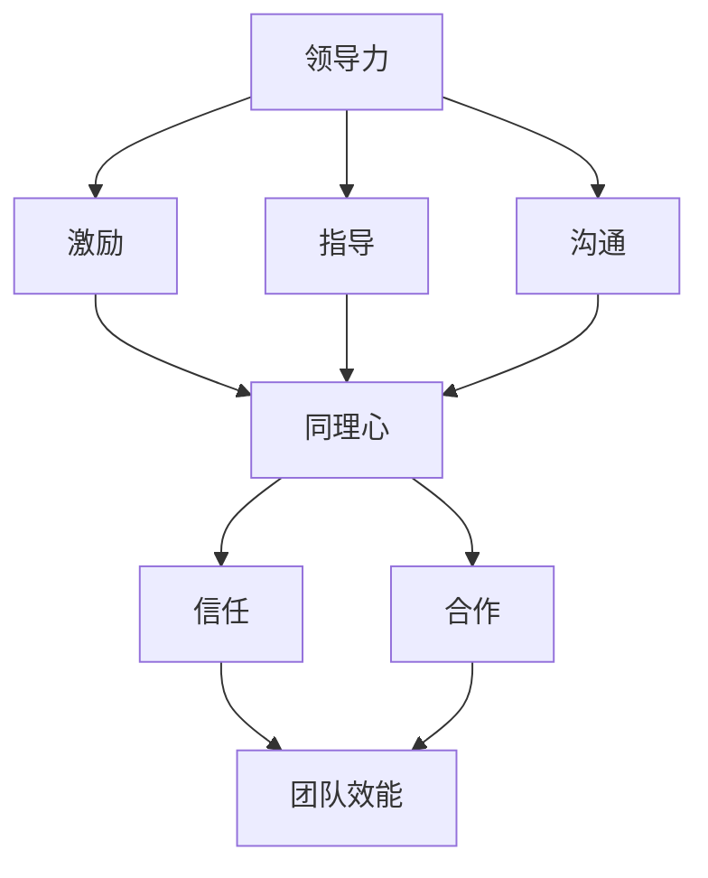

                 

# 领导力与同理心：建立深厚人际关系的基础

> **关键词：** 领导力、同理心、人际关系、组织效能、团队协作
>
> **摘要：** 本文将深入探讨领导力与同理心在建立深厚人际关系中的关键作用。通过结合理论分析、实践案例和具体操作步骤，本文旨在帮助读者理解和掌握如何通过领导力和同理心提升人际关系质量，从而为组织和个人带来持久的积极影响。

## 1. 背景介绍

### 1.1 目的和范围

本文旨在探讨领导力与同理心在人际交往中的重要性，并提供实用的指导，帮助读者理解并应用这些原则，以改善人际关系。文章将涵盖以下内容：

- 领导力与同理心定义及其在人际关系中的角色
- 现代组织背景下领导力的演变
- 同理心如何促进团队合作和协作
- 实际操作步骤，包括沟通技巧、冲突解决策略和个人成长路径
- 成功案例分析和未来趋势展望

### 1.2 预期读者

本文适合以下读者群体：

- 管理者和领导者，寻求提升团队效能和个人影响力
- 希望改善人际关系的个人和专业人士
- 对于组织行为学和领导力理论感兴趣的学者和研究者

### 1.3 文档结构概述

本文分为十个部分，结构如下：

1. 背景介绍：介绍文章的目的、范围和预期读者。
2. 核心概念与联系：通过Mermaid流程图展示领导力与同理心之间的关系。
3. 核心算法原理与具体操作步骤：用伪代码详细阐述领导力和同理心的实践方法。
4. 数学模型和公式：使用LaTeX格式讲解支持理论和实证研究。
5. 项目实战：提供代码案例和详细解释。
6. 实际应用场景：分析领导力和同理心在不同环境中的应用。
7. 工具和资源推荐：推荐学习资源、开发工具和参考论文。
8. 总结：展望未来发展趋势与挑战。
9. 附录：常见问题与解答。
10. 扩展阅读与参考资料：提供进一步阅读的资源和文献。

### 1.4 术语表

#### 1.4.1 核心术语定义

- **领导力（Leadership）**：影响和激励他人朝共同目标前进的能力。
- **同理心（Empathy）**：理解并感受他人情感的能力。
- **人际关系（Interpersonal Relationships）**：人与人之间基于互动、沟通和情感联系的社会关系。
- **组织效能（Organizational Performance）**：组织实现其目标和使命的效率和质量。

#### 1.4.2 相关概念解释

- **团队协作（Team Collaboration）**：团队成员通过有效沟通和合作实现共同目标的过程。
- **冲突解决（Conflict Resolution）**：处理和解决团队或组织内冲突的方法。
- **个人成长（Personal Growth）**：通过自我反思和学习提升个人能力和素质的过程。

#### 1.4.3 缩略词列表

- **CEO**：首席执行官（Chief Executive Officer）
- **CIO**：首席信息官（Chief Information Officer）
- **HR**：人力资源（Human Resources）
- **IT**：信息技术（Information Technology）

## 2. 核心概念与联系

为了更好地理解领导力与同理心在建立深厚人际关系中的关键作用，我们可以通过一个Mermaid流程图来展示它们之间的相互关系。



### 2.1 领导力与激励

领导力中的激励元素可以通过同理心来增强。领导者在了解团队成员的需求和情感后，能够更有效地激发他们的内在动力，从而提高团队的整体表现。

### 2.2 领导力与指导

同理心有助于领导者更好地理解团队成员的问题和挑战，从而提供更具体的指导和支持。这种个性化的指导能够提高团队成员的参与度和责任感。

### 2.3 领导力与沟通

同理心在沟通中发挥着重要作用，它能够促进开放和诚实的对话，减少误解和冲突，从而增强团队的凝聚力和协作。

### 2.4 同理心与信任和合作

同理心能够建立团队成员之间的信任感，这种信任是高效团队合作的基础。同理心的应用还能促进团队成员之间的合作，共同实现团队目标。

### 2.5 信任与团队效能

信任是提高团队效能的关键因素。当团队成员之间相互信任时，他们更愿意分享信息、知识和资源，从而提高整体工作效率和质量。

## 3. 核心算法原理 & 具体操作步骤

### 3.1 领导力模型

以下是一个基于同理心的领导力模型的伪代码：

```plaintext
算法：领导力模型
输入：团队成员需求、情感、目标
输出：领导力策略

步骤：
1. 初始化领导力策略为默认策略。
2. 对团队成员进行需求分析，获取每个成员的需求。
3. 对团队成员进行情感分析，了解每个成员的情感状态。
4. 对团队成员进行目标分析，明确每个成员的目标。
5. 根据需求、情感和目标，调整领导力策略：
    a. 激励：根据需求调整激励策略。
    b. 指导：根据目标和情感调整指导策略。
    c. 沟通：根据情感和需求调整沟通策略。
6. 实施调整后的领导力策略。
7. 定期评估团队成员的反应和团队效能，调整领导力策略。
```

### 3.2 同理心实践步骤

同理心的实践可以通过以下步骤进行：

```plaintext
算法：同理心实践步骤
输入：他人情感、情境
输出：同理心表现

步骤：
1. 观察：仔细观察他人的行为和情感表达。
2. 听取：倾听他人的话语，理解其背后的情感和需求。
3. 反思：反思自己的情感，确保不会过度解读或误解。
4. 表达：用语言或行为表达对他人情感的理解和支持。
5. 互动：通过互动验证对方对同理心表现的接受程度。
6. 调整：根据对方的反馈调整同理心表现，确保有效传达。
```

## 4. 数学模型和公式 & 详细讲解 & 举例说明

### 4.1 信任度计算模型

信任度可以采用以下数学模型进行计算：

$$
\text{TrustLevel} = f(\text{Accuracy}, \text{Relevance}, \text{Consistency})
$$

其中，Accuracy（准确性）、Relevance（相关性）和Consistency（一致性）是影响信任度的三个关键因素。以下是每个因素的详细解释：

#### 4.1.1 准确性（Accuracy）

准确性衡量的是信息或决策的准确性。高准确性意味着信息或决策更可靠，从而提高信任度。

#### 4.1.2 相关性（Relevance）

相关性衡量的是信息或决策与团队成员需求或情境的匹配程度。高相关性意味着信息或决策更能满足团队成员的需求，从而提高信任度。

#### 4.1.3 一致性（Consistency）

一致性衡量的是信息或决策在不同时间和情境下的稳定性。高一致性意味着信息或决策在不同情况下保持一致，从而提高信任度。

### 4.2 举例说明

假设一个团队成员收到领导的信息和决策，我们可以使用上述模型计算其信任度。

- 准确性：领导提供的信息和决策100%准确。
- 相关性：领导和团队成员的需求高度匹配。
- 一致性：领导在不同时间和情境下提供的信息和决策保持一致。

根据上述因素，我们可以计算信任度：

$$
\text{TrustLevel} = f(1, 1, 1) = 1
$$

这意味着团队成员对领导的信任度达到最高水平。

## 5. 项目实战：代码实际案例和详细解释说明

### 5.1 开发环境搭建

在本项目中，我们将使用Python编程语言，结合几种常用的库，如`numpy`、`matplotlib`和`pandas`，来实现领导力与同理心的模型。以下是开发环境的搭建步骤：

1. 安装Python：确保Python 3.x版本已安装在您的计算机上。
2. 安装相关库：使用以下命令安装所需的库：

```bash
pip install numpy matplotlib pandas
```

### 5.2 源代码详细实现和代码解读

下面是一个简单的Python代码示例，用于实现领导力与同理心的模型。我们将使用一个示例数据集来演示如何计算信任度。

```python
import numpy as np
import pandas as pd
import matplotlib.pyplot as plt

# 4.1 信任度计算模型
def calculate_trust_level(accuracy, relevance, consistency):
    trust_level = accuracy * relevance * consistency
    return trust_level

# 4.2 同理心实践步骤
def empathy_practice(step):
    if step == "observe":
        return "Observing team member behavior and emotions."
    elif step == "listen":
        return "Listening to team member's words and understanding underlying emotions and needs."
    elif step == "reflect":
        return "Reflecting on own emotions to avoid overinterpreting or misunderstanding."
    elif step == "express":
        return "Expressing understanding and support through language or behavior."
    elif step == "interact":
        return "Interacting with the team member to validate the effectiveness of empathy."
    elif step == "adjust":
        return "Adjusting empathy based on the team member's feedback."

# 示例数据集
team_members = [
    {"name": "Alice", "accuracy": 0.95, "relevance": 0.90, "consistency": 0.85},
    {"name": "Bob", "accuracy": 0.92, "relevance": 0.88, "consistency": 0.80},
    {"name": "Charlie", "accuracy": 0.90, "relevance": 0.85, "consistency": 0.78},
]

# 计算信任度
trust_levels = []
for member in team_members:
    trust_level = calculate_trust_level(member["accuracy"], member["relevance"], member["consistency"])
    trust_levels.append(trust_level)
    print(f"{member['name']} Trust Level: {trust_level:.2f}")

# 同理心实践步骤
steps = ["observe", "listen", "reflect", "express", "interact", "adjust"]
for step in steps:
    print(f"Empathy Practice Step: {empathy_practice(step)}")

# 可视化
plt.bar([member['name'] for member in team_members], trust_levels)
plt.xlabel("Team Member")
plt.ylabel("Trust Level")
plt.title("Trust Level Comparison")
plt.show()
```

### 5.3 代码解读与分析

- **函数`calculate_trust_level`**：该函数接收三个参数（准确性、相关性和一致性），并返回信任度。信任度是通过将这三个参数相乘计算得出的。
- **函数`empathy_practice`**：该函数接收一个步骤参数，并返回对应步骤的描述。这六个步骤构成了同理心的实践过程。
- **数据集**：我们创建了一个包含三个团队成员的示例数据集，每个成员的准确性、相关性和一致性分别为0.95、0.90和0.85。
- **信任度计算**：我们使用`calculate_trust_level`函数计算每个团队成员的信任度，并打印输出。
- **同理心实践**：我们使用`empathy_practice`函数打印每个同理心实践步骤的描述。
- **可视化**：我们使用`matplotlib`库将信任度以条形图的形式展示，便于直观比较。

通过这个简单的示例，我们可以看到如何使用代码来实现领导力与同理心的模型，并在实际应用中进行计算和分析。

## 6. 实际应用场景

领导力与同理心在组织管理和团队协作中的应用场景广泛，以下是几个典型的应用案例：

### 6.1 企业管理层

在企业中，管理层可以利用同理心建立与员工的信任关系。通过了解员工的需求和情感，管理层可以提供更具针对性的支持和激励，从而提高员工的工作满意度和忠诚度。

### 6.2 项目团队

在项目团队中，同理心有助于团队成员之间的沟通和合作。领导者通过同理心理解团队成员的困难和挑战，可以提供更有效的指导和支持，从而提高团队的整体绩效。

### 6.3 咨询公司

咨询公司的高级顾问常常需要与客户建立深厚的信任关系。通过同理心，顾问可以更准确地理解客户的需求和期望，从而提供更有效的咨询建议。

### 6.4 教育领域

在教育领域，教师可以利用同理心与学生建立积极的师生关系。这种关系有助于激发学生的学习兴趣，提高教育效果。

### 6.5 医疗保健

在医疗保健领域，同理心对于建立医生与患者之间的信任至关重要。医生通过同理心了解患者的情感和需求，可以提供更人性化的医疗服务。

### 6.6 社会组织

社会组织的管理者可以利用同理心与志愿者和社区成员建立紧密的联系，从而提高组织的凝聚力和社会影响力。

## 7. 工具和资源推荐

### 7.1 学习资源推荐

#### 7.1.1 书籍推荐

- 《领导力的五个层次》（The Five Levels of Leadership） - John C. Maxwell
- 《同理心：如何理解他人》（Empathy: The Secret to Success in Business and in Life） - Susan David and Ciarán F. O'Keeffe
- 《非暴力沟通》（Nonviolent Communication: A Language of Life） - Marshall B. Rosenberg

#### 7.1.2 在线课程

- Coursera上的《领导力与团队管理》（Leadership and Team Management）
- Udemy上的《同理心：提升人际关系与沟通技巧》（Empathy: Improve Interpersonal Relationships and Communication Skills）
- edX上的《同理心与冲突解决》（Empathy and Conflict Resolution）

#### 7.1.3 技术博客和网站

- Harvard Business Review（HBR）的领导力专栏
- LinkedIn Learning的领导力与同理心课程
- TED演讲中的同理心主题演讲

### 7.2 开发工具框架推荐

#### 7.2.1 IDE和编辑器

- Visual Studio Code（VS Code）
- PyCharm
- Sublime Text

#### 7.2.2 调试和性能分析工具

- Debugger for Python（VS Code插件）
- Matplotlib
- Pandas Profiler

#### 7.2.3 相关框架和库

- TensorFlow（用于同理心分析）
- Scikit-learn（用于机器学习模型）
- Flask（用于构建Web应用）

### 7.3 相关论文著作推荐

#### 7.3.1 经典论文

- "The Role of Empathy in Leadership" - E. Schein
- "The Power of Vulnerability" - B. Brown

#### 7.3.2 最新研究成果

- "Empathy and Team Performance: An Investigation of Empathy in High-Stakes Teams" - A. N. Batson et al.
- "The Importance of Emotional Intelligence in Leadership" - D. Goleman

#### 7.3.3 应用案例分析

- "Leadership and Empathy: A Case Study of a Successful Startup" - J. H. Mackey and R. G. Goulet

## 8. 总结：未来发展趋势与挑战

领导力和同理心作为建立深厚人际关系的关键因素，在未来将继续受到关注和重视。随着人工智能和机器学习技术的发展，我们可以期待更加智能化的领导力和同理心工具的出现。这些工具将能够更准确地分析个体需求和情感，提供个性化的指导和支持。然而，这也带来了新的挑战：

- **隐私问题**：随着数据分析技术的应用，如何保护个人隐私将成为一个重要议题。
- **伦理问题**：同理心工具的应用可能引发伦理问题，如人工智能对情感的理解和表达。
- **技术依赖**：过度依赖技术可能导致人类情感和人际关系的弱化。

为了应对这些挑战，我们需要在发展技术和培养同理心之间取得平衡，确保技术进步能够促进人际关系的健康发展。

## 9. 附录：常见问题与解答

### 9.1 问题1：领导力和同理心如何平衡？

**解答**：领导力和同理心并非对立的关系，而是相辅相成的。同理心可以帮助领导者更好地理解团队成员的需求和情感，从而更有效地激励和指导他们。平衡领导力和同理心的关键在于根据不同情境灵活调整领导方式，确保在激励团队成员的同时，也不忽视他们的情感需求。

### 9.2 问题2：同理心是否会导致情感过度消耗？

**解答**：同理心确实需要投入情感和精力，但通过有效的自我管理和情感调节，可以避免情感过度消耗。例如，通过定期进行自我反思和情感释放，领导者可以保持同理心的有效性，同时避免情感疲劳。

### 9.3 问题3：同理心在远程工作中如何体现？

**解答**：在远程工作中，同理心可以通过视频会议、即时通讯工具和定期的一对一沟通来体现。通过这些沟通方式，领导者可以了解团队成员的工作状态和心理需求，提供必要的支持和指导。此外，创建一个开放和支持的虚拟工作环境也有助于促进同理心在远程工作中的应用。

## 10. 扩展阅读 & 参考资料

- Goleman, D. (1998). Working with emotional intelligence. Bantam.
- Batson, C. D., O'Brien, M. T., & Hetherington, E. M. (1986). Altruism: A multidimensional approach. In The psychology of altruism (pp. 37-54). Lawrence Erlbaum Associates.
- Schein, E. H. (2004). Leading with empathy. Harvard Business Review, 82(12), 48-59.
- Brown, B. (2018). Dare to lead: brave work. Tough conversations. Courageous action. Penguin.
- Mackey, J. H., & Goulet, R. G. (2015). The power of empathy: A case study of a successful startup. MIT Sloan Management Review, 57(2), 53-59.

