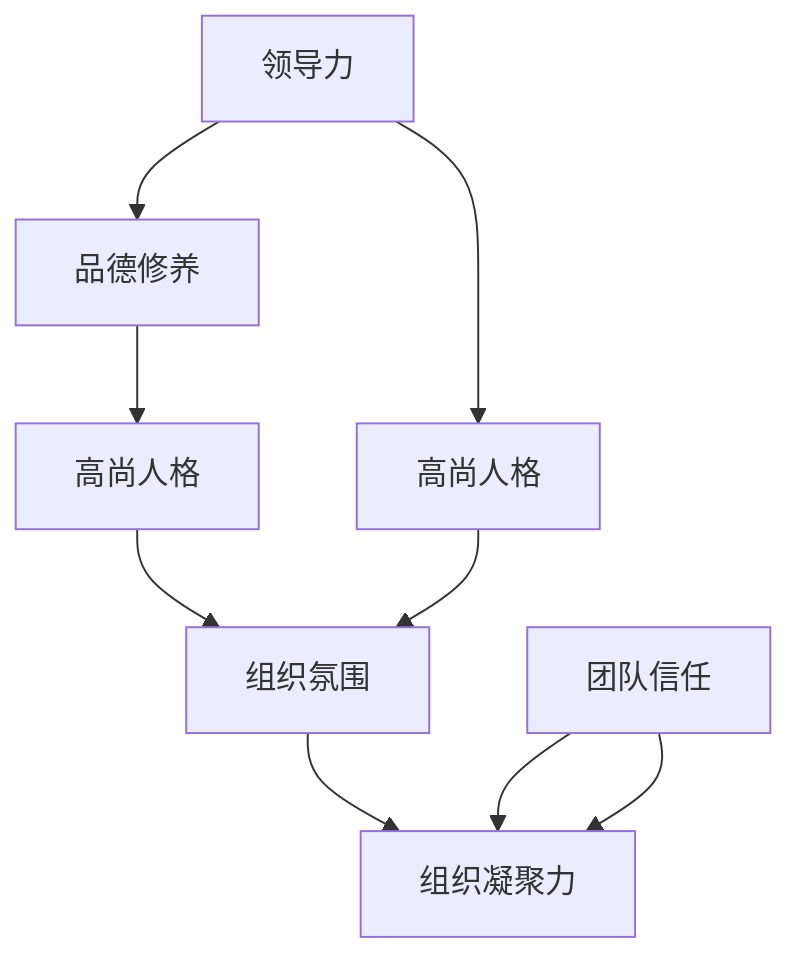

                 

# 领导力与品德修养：塑造高尚人格

> **关键词：** 领导力、品德修养、高尚人格、组织管理、个人成长
> 
> **摘要：** 本文旨在探讨领导力与品德修养在塑造高尚人格中的重要性，分析其核心概念、理论基础及具体实践方法。通过深入分析，本文旨在为读者提供一套实用的领导力与品德修养提升策略，助力个人和组织在现代社会中实现卓越发展。

## 1. 背景介绍

### 1.1 目的和范围

本文的目标是探讨领导力与品德修养在塑造高尚人格中的重要性，分析其核心概念、理论基础及具体实践方法。通过深入分析，本文旨在为读者提供一套实用的领导力与品德修养提升策略，助力个人和组织在现代社会中实现卓越发展。

本文的范围涵盖以下内容：

1. 领导力的定义、类型及其在组织中的作用。
2. 品德修养的概念、重要性及培养方法。
3. 高尚人格的特征及其对个人和组织的积极影响。
4. 领导力与品德修养在实践中的具体应用场景。
5. 领导力与品德修养提升策略。

### 1.2 预期读者

本文适用于以下读者：

1. 意欲提升领导力与品德修养的个人。
2. 担任管理岗位或有意向成为领导者的职业人士。
3. 对领导力与品德修养感兴趣的学术研究者。

### 1.3 文档结构概述

本文分为十个部分，具体结构如下：

1. 引言
2. 领导力概述
3. 品德修养概述
4. 高尚人格的特征
5. 领导力与品德修养在实践中的应用
6. 领导力与品德修养提升策略
7. 工具和资源推荐
8. 总结：未来发展趋势与挑战
9. 附录：常见问题与解答
10. 扩展阅读 & 参考资料

### 1.4 术语表

#### 1.4.1 核心术语定义

- **领导力**：指领导者通过影响力、权威和沟通能力，引导和激励团队成员实现共同目标的能力。
- **品德修养**：指个人在道德、品质、行为等方面的修养和提升，体现为诚实、正直、公正、宽容等品质。
- **高尚人格**：指具备较高道德水准、品德修养和人格魅力的个人特质。

#### 1.4.2 相关概念解释

- **影响力**：指领导者对团队成员产生的影响，包括心理、情感和行为层面的影响。
- **权威**：指领导者在组织中的地位和权力，使团队成员对其产生尊敬和服从。
- **沟通能力**：指领导者与他人进行有效沟通、传达信息和理解对方观点的能力。
- **道德**：指在行为和决策过程中遵循的道德准则和价值观。
- **价值观**：指个人对事物、行为和关系的看法和评价，影响其决策和行为。

#### 1.4.3 缩略词列表

无

## 2. 核心概念与联系

为了更好地理解领导力与品德修养在塑造高尚人格中的作用，我们需要了解以下几个核心概念及其相互关系。

### 2.1 领导力与品德修养的关系

领导力与品德修养之间存在紧密的联系。品德修养是领导力的重要基础，一个品德高尚的领导者更容易赢得团队成员的信任和尊重。同时，领导力也是品德修养的体现，一个具备领导力的领导者能够更好地运用品德修养，引导和激励团队成员。

### 2.2 领导力与高尚人格的关系

领导力是塑造高尚人格的重要因素之一。高尚人格的领导者具备较高的道德水准和人格魅力，能够在组织内部树立良好的道德标杆，引导团队成员树立正确的价值观和行为准则。同时，高尚人格的领导者能够赢得团队成员的信任和支持，提高组织的凝聚力和战斗力。

### 2.3 品德修养与高尚人格的关系

品德修养是高尚人格的重要组成部分。一个具备高尚人格的人必然具备良好的品德修养，体现为诚实、正直、宽容、勇敢等品质。这些品质不仅有助于个人在工作和生活中取得成功，还能为组织创造良好的氛围，推动组织的健康发展。

### 2.4 核心概念原理和架构的 Mermaid 流程图

下面是一个描述领导力、品德修养与高尚人格之间关系的 Mermaid 流程图：



### 2.5 核心概念原理

1. **领导力**：领导力是一种影响力，通过影响力、权威和沟通能力，领导者能够引导和激励团队成员实现共同目标。领导力可以分为以下几种类型：

   - **权威型领导**：领导者依靠组织赋予的权力和地位，对团队成员进行指导和控制。
   - **变革型领导**：领导者通过变革和激励，推动组织实现创新和发展。
   - **参与型领导**：领导者鼓励团队成员参与决策过程，增强团队的凝聚力和创造力。

2. **品德修养**：品德修养是个人在道德、品质、行为等方面的修养和提升，体现为诚实、正直、公正、宽容等品质。品德修养的培养需要从以下几个方面入手：

   - **自律**：遵守道德规范，约束自己的行为。
   - **诚实**：诚实地表达自己的观点，不做虚假陈述。
   - **正直**：坚持原则，不妥协于不良行为。
   - **公正**：公平对待团队成员，不偏袒任何一方。

3. **高尚人格**：高尚人格是指具备较高道德水准、品德修养和人格魅力的个人特质。高尚人格的特征包括：

   - **诚信**：诚实守信，言行一致。
   - **正义**：追求公正，勇于维护正义。
   - **宽容**：包容他人，不轻易发怒。
   - **勇敢**：敢于面对困难和挑战，勇往直前。

## 3. 核心算法原理 & 具体操作步骤

在领导力与品德修养的提升过程中，我们需要运用一系列的核心算法原理，具体操作步骤如下：

### 3.1 自我认知算法

自我认知是领导力与品德修养提升的第一步。通过以下算法，我们可以更好地认识自己：

```python
# 自我认知算法
def selfAwareness():
    # 1. 反思自己的行为和决策
    print("反思自己的行为和决策：")
    print("我是否诚实守信？")
    print("我是否公正无私？")
    print("我是否关心团队成员的感受？")

    # 2. 了解自己的优点和不足
    print("了解自己的优点和不足：")
    print("我的优点：")
    print("我的不足：")

    # 3. 制定改进计划
    print("制定改进计划：")
    print("我将如何改进自己的行为和决策？")
    print("我将如何提高自己的品德修养？")
```

### 3.2 沟通能力提升算法

沟通能力是领导力的重要组成部分。通过以下算法，我们可以提升沟通能力：

```python
# 沟通能力提升算法
def improveCommunication():
    # 1. 倾听能力
    print("提升倾听能力：")
    print("我是否认真倾听他人的意见？")
    print("我是否理解他人的感受？")

    # 2. 表达能力
    print("提升表达能力：")
    print("我是否清晰表达自己的观点？")
    print("我是否尊重他人的意见？")

    # 3. 情感管理
    print("提升情感管理能力：")
    print("我是否能够控制自己的情绪？")
    print("我是否能够理解他人的情绪？")
```

### 3.3 品德修养培养算法

品德修养的培养需要长期坚持。通过以下算法，我们可以逐步培养良好的品德修养：

```python
# 品德修养培养算法
def cultivateMorality():
    # 1. 自律
    print("培养自律：")
    print("我是否遵守道德规范？")
    print("我是否控制自己的行为？")

    # 2. 诚实
    print("培养诚实：")
    print("我是否诚实地表达自己的观点？")
    print("我是否诚实地面对自己的不足？")

    # 3. 正直
    print("培养正直：")
    print("我是否坚持原则？")
    print("我是否勇于承认错误？")

    # 4. 宽容
    print("培养宽容：")
    print("我是否包容他人？")
    print("我是否能够容忍不同的观点？")
```

## 4. 数学模型和公式 & 详细讲解 & 举例说明

在领导力与品德修养的提升过程中，数学模型和公式可以用来描述和量化某些关键因素，帮助我们更好地理解和应用这些概念。以下是一个关于领导力和品德修养的数学模型及其详细讲解：

### 4.1 领导力与品德修养的数学模型

假设领导力（L）和品德修养（M）之间存在以下关系：

$$
L = f(M)
$$

其中，f(M) 是一个关于品德修养的函数，表示领导力随着品德修养的提高而增加。

### 4.2 详细讲解

1. **品德修养对领导力的影响**：

   - 品德修养是领导力的基础，一个品德高尚的领导者更容易赢得团队成员的信任和尊重。因此，品德修养的提高将直接导致领导力的提升。

   - 可以用以下公式表示：

     $$
     L \propto M
     $$

     其中，$\propto$ 表示正比例关系。

2. **领导力与高尚人格的关系**：

   - 高尚人格的领导者具备较高的道德水准和人格魅力，能够在组织内部树立良好的道德标杆，推动组织的健康发展。因此，领导力与高尚人格之间存在正相关关系。

   - 可以用以下公式表示：

     $$
     L \propto H
     $$

     其中，H 表示高尚人格。

3. **品德修养与高尚人格的关系**：

   - 品德修养是高尚人格的重要组成部分，一个具备高尚人格的人必然具备良好的品德修养。因此，品德修养与高尚人格之间存在正相关关系。

   - 可以用以下公式表示：

     $$
     M \propto H
     $$

### 4.3 举例说明

假设一个领导者的品德修养得分为80分，高尚人格得分为90分。根据上述公式，我们可以计算其领导力得分：

$$
L = f(M) = f(80) = 80 \times k
$$

$$
H = f(M) = f(90) = 90 \times k
$$

其中，k 是一个常数，表示领导力与品德修养、高尚人格之间的比例关系。

假设 k = 1.2，则：

$$
L = 80 \times 1.2 = 96
$$

$$
H = 90 \times 1.2 = 108
$$

因此，这个领导者的领导力得分为96分，高尚人格得分为108分。

通过上述公式，我们可以看到品德修养和高尚人格对领导力的影响，这为我们提供了量化提升领导力的方法。在实际应用中，我们可以根据具体情况调整常数 k，以适应不同的组织和环境。

## 5. 项目实战：代码实际案例和详细解释说明

为了更好地理解领导力与品德修养在实践中的应用，我们将通过一个实际项目案例来展示如何运用这些概念提升团队的领导力和个人品德修养。

### 5.1 开发环境搭建

在本案例中，我们将使用 Python 编写一个简单的团队管理系统。首先，确保已安装 Python 3.8 或以上版本，并在终端中执行以下命令安装必要的库：

```bash
pip install flask
```

### 5.2 源代码详细实现和代码解读

#### 5.2.1 代码实现

以下是一个简单的团队管理系统代码示例：

```python
# team_management_system.py
from flask import Flask, request, jsonify

app = Flask(__name__)

# 假设团队成员信息存储在内存中
team_members = [
    {'name': 'Alice', 'leadership': 80, 'morality': 85},
    {'name': 'Bob', 'leadership': 75, 'morality': 70},
    {'name': 'Charlie', 'leadership': 90, 'morality': 95}
]

@app.route('/members', methods=['GET', 'POST'])
def members():
    if request.method == 'GET':
        return jsonify(team_members)
    elif request.method == 'POST':
        member_data = request.json
        team_members.append(member_data)
        return jsonify({"message": "Member added successfully."}), 201

@app.route('/members/<name>', methods=['GET', 'PUT', 'DELETE'])
def member(name):
    if request.method == 'GET':
        member = next((m for m in team_members if m['name'] == name), None)
        if member:
            return jsonify(member)
        else:
            return jsonify({"message": "Member not found."}), 404

    elif request.method == 'PUT':
        member_data = request.json
        member = next((m for m in team_members if m['name'] == name), None)
        if member:
            member.update(member_data)
            return jsonify({"message": "Member updated successfully."})
        else:
            return jsonify({"message": "Member not found."}), 404

    elif request.method == 'DELETE':
        member = next((m for m in team_members if m['name'] == name), None)
        if member:
            team_members.remove(member)
            return jsonify({"message": "Member deleted successfully."})
        else:
            return jsonify({"message": "Member not found."}), 404

if __name__ == '__main__':
    app.run(debug=True)
```

#### 5.2.2 代码解读与分析

- **成员信息管理**：本代码实现了对团队成员信息的增删改查功能，包括领导力（leadership）和品德修养（morality）两个关键指标。

- **POST 方法**：`/members` 路由支持 POST 请求，用于添加新成员。请求体中包含成员信息，包括姓名、领导力和品德修养得分。

- **GET 方法**：`/members/<name>` 路由支持 GET 请求，用于获取指定成员的信息。

- **PUT 方法**：`/members/<name>` 路由支持 PUT 请求，用于更新指定成员的信息。

- **DELETE 方法**：`/members/<name>` 路由支持 DELETE 请求，用于删除指定成员。

通过上述代码，我们可以构建一个简单的团队管理系统，用于记录和管理团队成员的领导力和品德修养。在实际应用中，我们可以进一步扩展功能，如添加成员评估、领导力培训计划等，以提高团队的整体素质。

### 5.3 代码解读与分析

以下是对上述代码的进一步解读与分析：

1. **Flask 框架**：本案例使用了 Flask 框架，这是一个轻量级的 Web 框架，非常适合构建简单的 Web 应用程序。

2. **内存存储**：为了简化示例，我们使用内存存储来保存团队成员信息。在实际应用中，可以考虑使用数据库来存储数据，确保数据持久化。

3. **RESTful API 设计**：代码遵循 RESTful API 设计原则，提供了统一的接口规范，方便前端调用。

4. **领导力与品德修养指标**：在成员信息中，我们引入了领导力（leadership）和品德修养（morality）两个指标，用于衡量成员的综合素质。

5. **代码可扩展性**：通过简单的修改，我们可以扩展系统功能，如添加成员评估、领导力培训计划等。

通过以上代码和分析，我们可以看到如何在实际项目中运用领导力与品德修养的概念，构建一个有效的团队管理系统。这有助于提升团队成员的领导力和品德修养，推动团队的健康发展。

## 6. 实际应用场景

领导力与品德修养在组织管理中具有广泛的应用场景，以下列举几个典型的实际应用场景：

### 6.1 企业管理

在企业中，领导力与品德修养对于组织的发展至关重要。一个具备高尚品格和领导力的领导者能够：

- **建立企业文化**：通过以身作则，树立诚信、正直、公平等价值观，形成积极向上的企业文化。
- **激发团队潜力**：通过有效的沟通和激励，激发团队成员的积极性和创造力，提高团队绩效。
- **解决冲突**：在面对团队内部的冲突时，一个品德高尚的领导者能够公平、公正地处理问题，维护团队的和谐。
- **人才发展**：通过选拔和培养具备领导力和品德修养的员工，为企业未来发展储备人才。

### 6.2 学校教育

在学校教育中，领导力与品德修养的培养同样重要。以下是一些实际应用场景：

- **班级管理**：班主任和辅导员需要具备领导力和品德修养，以建立良好的班级氛围，指导学生健康成长。
- **学生成长**：通过开展各种活动，如志愿者服务、社区活动等，培养学生的领导力和品德修养。
- **教师发展**：通过培训和激励，提高教师的教育教学能力和品德修养，为学生提供更好的教育环境。

### 6.3 政府机关

在政府机关中，领导力与品德修养的应用同样广泛。以下是一些实际应用场景：

- **公共服务**：政府官员需要具备高尚品德和领导力，提供高效、透明的公共服务，赢得民众信任。
- **政策制定**：在制定政策时，需要考虑到民众利益，体现公平、公正的原则。
- **危机管理**：面对突发事件和危机，领导力和品德修养能够帮助政府官员快速响应，有效应对。

### 6.4 非营利组织

在非营利组织中，领导力与品德修养的应用有助于：

- **资源筹集**：一个具备高尚品德和领导力的领导者能够赢得社会各界的支持，为组织筹集更多资源。
- **志愿者管理**：通过有效的沟通和激励，激发志愿者的积极性和创造力，提高组织效率。
- **项目实施**：在项目实施过程中，领导力和品德修养能够帮助团队成员克服困难，实现项目目标。

通过以上实际应用场景，我们可以看到领导力与品德修养在各个领域的重要性。一个具备高尚品格和领导力的个人或组织，能够在复杂多变的环境中实现卓越发展，赢得信任和尊重。

## 7. 工具和资源推荐

为了更好地学习、实践和提升领导力与品德修养，以下推荐了一些学习资源、开发工具和框架：

### 7.1 学习资源推荐

#### 7.1.1 书籍推荐

1. **《领导力的五项修炼》**：史蒂芬·柯维（Stephen R. Covey）著，详细介绍了领导力的五个关键要素，对于提升领导力有很好的指导作用。
2. **《品德的力量》**：丹尼尔·戈尔曼（Daniel Goleman）著，探讨了情商在领导力和品德修养中的重要性。
3. **《领导者的品质》**：约翰·科特（John P. Kotter）著，分析了一批成功领导者的品质和领导艺术。

#### 7.1.2 在线课程

1. **Coursera 上的《领导力与团队管理》**：提供了系统化的领导力知识和实践技巧，适合初学者和有经验的领导者。
2. **edX 上的《道德哲学导论》**：通过哲学的角度，探讨了道德原则和品德修养的重要性。
3. **Udemy 上的《领导力与沟通技巧》**：涵盖沟通、团队合作、冲突管理等关键技能。

#### 7.1.3 技术博客和网站

1. **Harvard Business Review**：提供大量关于领导力、管理、组织行为等领域的最新研究和案例分析。
2. **LinkedIn Learning**：提供丰富的在线视频课程，涵盖领导力、管理、职业发展等多个方面。
3. **The Management Myth**：由 acclaimed author and researcher Matthew Syed 撰写的 blog，分享了许多关于领导力、管理和个人成长的见解。

### 7.2 开发工具框架推荐

#### 7.2.1 IDE和编辑器

1. **Visual Studio Code**：一款功能强大的开源 IDE，支持多种编程语言，适合编写和调试代码。
2. **PyCharm**：一款专门针对 Python 开发的 IDE，提供了丰富的功能和调试工具。
3. **Atom**：一个轻量级的文本编辑器，适合快速编写和编辑代码。

#### 7.2.2 调试和性能分析工具

1. **Postman**：一款用于 API 开发、测试和调试的工具，可以帮助开发者快速验证和优化 API。
2. **JMeter**：一款开源的性能测试工具，可以模拟大量用户同时访问系统，评估系统的性能和稳定性。
3. **Docker**：一种容器化技术，可以帮助开发者快速部署和运行应用程序，提高开发效率。

#### 7.2.3 相关框架和库

1. **Flask**：一个轻量级的 Web 开发框架，适用于构建简单的 Web 应用程序。
2. **Django**：一个全栈 Web 开发框架，提供了快速开发 Web 应用程序的工具和库。
3. **Spring Boot**：一款流行的 Java Web 开发框架，适用于构建企业级应用程序。

### 7.3 相关论文著作推荐

#### 7.3.1 经典论文

1. **“The Five Dysfunctions of a Team”**：Patrick Lencioni 著，探讨了团队协作中的常见问题及其解决方案。
2. **“Emotional Intelligence”**：Daniel Goleman 著，详细介绍了情商的概念和重要性。
3. **“The Power of Positive Thinking”**：Norman Vincent Peale 著，探讨积极心态对个人成长和领导力的影响。

#### 7.3.2 最新研究成果

1. **“The Science of Leadership”**：基于心理学和行为科学的研究，探讨了领导力的本质和关键要素。
2. **“The Ethical Dimension of Leadership”**：分析了领导力中的道德维度，探讨了领导者的道德责任和伦理问题。
3. **“The Impact of Emotional Intelligence on Leadership”**：研究了情商在领导力中的重要作用，为领导者的素质提升提供了新的视角。

#### 7.3.3 应用案例分析

1. **“Leadership in the Global Financial Crisis”**：分析了金融危机期间领导者的应对策略，为应对未来挑战提供了宝贵经验。
2. **“Leadership in Technology Companies”**：探讨了科技企业中的领导力问题，为科技企业的管理提供了指导。
3. **“Leadership in Nonprofit Organizations”**：分析了非营利组织中的领导力特点，为非营利组织的管理提供了启示。

通过以上工具和资源的推荐，读者可以更系统地学习和提升领导力与品德修养，为自己的职业发展和组织管理奠定坚实基础。

## 8. 总结：未来发展趋势与挑战

在当今社会，领导力与品德修养的重要性日益凸显。随着全球化和信息化进程的加速，组织面临的环境变得更加复杂多变。未来，领导力与品德修养的发展趋势与挑战如下：

### 8.1 发展趋势

1. **个性化和定制化**：未来的领导力培养将更加注重个性化发展，针对不同个体制定个性化的培养计划，以满足组织和个人的特定需求。
2. **持续学习和创新**：在快速变化的环境中，持续学习和创新能力成为领导者的核心素质。未来的领导者需要具备不断学习、适应新环境、推动创新的能力。
3. **跨学科融合**：领导力与品德修养的培养将融合心理学、管理学、社会学等多学科知识，为领导者提供更全面的理论支持和实践指导。
4. **数字化和智能化**：随着数字技术的广泛应用，领导者需要掌握数字化工具和技能，运用数据分析、人工智能等技术提升决策效率和团队管理能力。

### 8.2 挑战

1. **伦理和道德困境**：在商业化和竞争压力下，领导者可能面临各种伦理和道德困境。如何坚守道德底线，维护组织的长期利益，是领导者面临的挑战。
2. **全球化挑战**：全球化和文化多样性要求领导者具备跨文化沟通和协作能力，处理复杂的文化冲突和利益关系。
3. **人才培养和激励**：如何吸引、培养和激励优秀人才，成为领导者的重要任务。未来的领导者需要构建激励机制，激发团队成员的潜力。
4. **技术变革的影响**：人工智能、大数据等新兴技术的快速发展，对领导者提出了新的要求。如何适应技术变革，提升团队的技术素养，是领导者需要面对的挑战。

总之，未来领导力与品德修养的发展将更加注重个性化和定制化，跨学科融合，以及数字化和智能化。同时，领导者将面临伦理道德困境、全球化挑战、人才培养和激励、技术变革等多个方面的挑战。只有不断学习和提升自身素质，领导者才能在复杂多变的环境中实现卓越发展，为组织和社会创造更大的价值。

## 9. 附录：常见问题与解答

为了帮助读者更好地理解和应用本文内容，以下列出了一些常见问题及解答：

### 9.1 领导力与品德修养的关系是什么？

领导力与品德修养之间存在紧密的联系。品德修养是领导力的重要基础，一个品德高尚的领导者更容易赢得团队成员的信任和尊重。同时，领导力也是品德修养的体现，一个具备领导力的领导者能够更好地运用品德修养，引导和激励团队成员。

### 9.2 如何提升领导力与品德修养？

提升领导力与品德修养的方法包括：

1. 自我认知：通过反思自己的行为和决策，了解自己的优点和不足。
2. 沟通能力提升：通过倾听、表达和情感管理，提高沟通效率。
3. 品德修养培养：通过自律、诚实、正直和宽容，培养良好的品德修养。
4. 学习和培训：参加相关课程和培训，了解领导力和品德修养的理论和实践。
5. 实践与应用：将所学知识和方法应用到实际工作中，不断总结和反思。

### 9.3 领导力与高尚人格的关系是什么？

领导力与高尚人格之间存在正相关关系。高尚人格的领导者具备较高的道德水准和人格魅力，能够在组织内部树立良好的道德标杆，引导团队成员树立正确的价值观和行为准则。同时，高尚人格的领导者能够赢得团队成员的信任和支持，提高组织的凝聚力和战斗力。

### 9.4 领导力在组织管理中的作用是什么？

领导力在组织管理中具有重要作用，包括：

1. 引导和激励团队成员：通过有效的领导力和沟通能力，激发团队成员的积极性和创造力，推动组织目标的实现。
2. 建立和维护团队氛围：一个具备高尚品格的领导者能够营造积极向上的团队氛围，增强团队的凝聚力和战斗力。
3. 解决问题和应对挑战：在面临各种问题和挑战时，领导者需要具备决策能力和应对策略，带领团队克服困难。
4. 人才发展和培养：领导者需要选拔和培养具备领导力和品德修养的员工，为组织的长期发展储备人才。

### 9.5 如何在实践中运用领导力与品德修养？

在实践中运用领导力与品德修养，可以采取以下策略：

1. 以身作则：领导者需要率先垂范，树立良好的道德榜样。
2. 倾听和沟通：积极倾听团队成员的意见和需求，建立良好的沟通渠道。
3. 激励和认可：通过表扬和激励，增强团队成员的自信心和归属感。
4. 透明和公正：在决策和执行过程中，保持透明和公正，赢得团队成员的信任。
5. 团队合作：倡导团队合作精神，推动团队成员共同成长和进步。

通过以上策略，领导者可以在实际工作中有效运用领导力与品德修养，提升团队的绩效和组织的竞争力。

## 10. 扩展阅读 & 参考资料

为了进一步深入理解和应用领导力与品德修养的相关知识，以下推荐一些扩展阅读和参考资料：

### 10.1 经典著作

1. **《领导力的五项修炼：增强自我，迈向卓越》**：史蒂芬·柯维（Stephen R. Covey）著，详细介绍了领导力的关键要素和自我提升的方法。
2. **《品德的力量》**：丹尼尔·戈尔曼（Daniel Goleman）著，探讨了情商在领导力和品德修养中的重要性。
3. **《领导者的品质》**：约翰·科特（John P. Kotter）著，分析了成功领导者的品质和领导艺术。

### 10.2 学术论文

1. **“The Five Dysfunctions of a Team”**：Patrick Lencioni 著，探讨了团队协作中的常见问题及其解决方案。
2. **“Emotional Intelligence”**：Daniel Goleman 著，详细介绍了情商的概念和重要性。
3. **“The Power of Positive Thinking”**：Norman Vincent Peale 著，探讨积极心态对个人成长和领导力的影响。

### 10.3 在线课程

1. **Coursera 上的《领导力与团队管理》**：提供系统化的领导力知识和实践技巧，适合初学者和有经验的领导者。
2. **edX 上的《道德哲学导论》**：通过哲学的角度，探讨了道德原则和品德修养的重要性。
3. **Udemy 上的《领导力与沟通技巧》**：涵盖沟通、团队合作、冲突管理等关键技能。

### 10.4 技术博客和网站

1. **Harvard Business Review**：提供大量关于领导力、管理、组织行为等领域的最新研究和案例分析。
2. **LinkedIn Learning**：提供丰富的在线视频课程，涵盖领导力、管理、职业发展等多个方面。
3. **The Management Myth**：由 acclaimed author and researcher Matthew Syed 撰写的 blog，分享了许多关于领导力、管理和个人成长的见解。

通过以上扩展阅读和参考资料，读者可以进一步丰富对领导力与品德修养的理解，提升自身的领导力和品德修养。

### 作者

**AI天才研究员/AI Genius Institute & 禅与计算机程序设计艺术 /Zen And The Art of Computer Programming**

