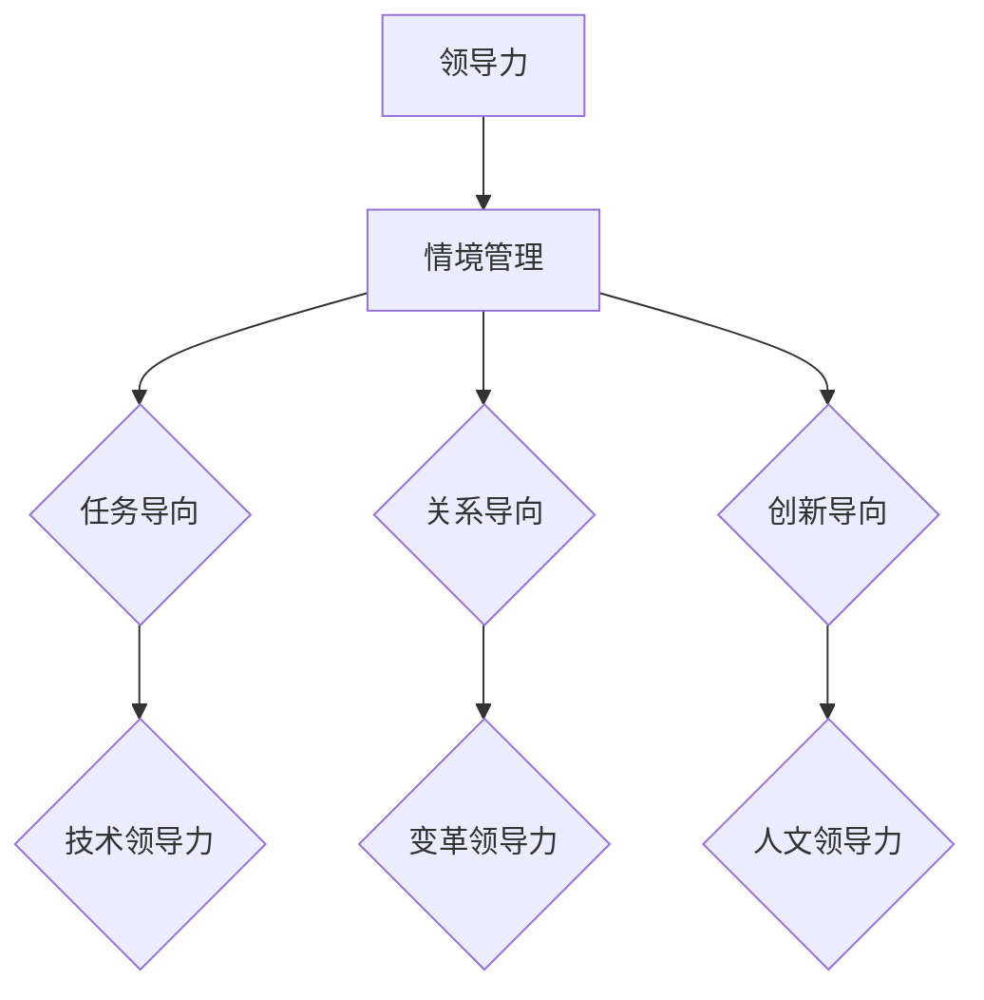

                 

# 领导力与情境管理：因地制宜的领导方式

> **关键词**：领导力、情境管理、因地制宜、团队管理、项目管理、人本管理

> **摘要**：本文旨在探讨领导力与情境管理的结合，通过分析不同情境下的领导方式，揭示因地制宜的重要性。文章将首先介绍领导力的基本概念和情境管理的原理，然后通过具体案例和实际操作，展示如何在不同情境中灵活运用领导力，以实现高效团队管理和项目成功。

## 1. 背景介绍

### 1.1 目的和范围

本文旨在为IT领域的项目经理和团队领导者提供关于领导力和情境管理的深入理解，帮助他们更好地应对复杂多变的工作环境，提高团队效率和项目成功率。

### 1.2 预期读者

本文适合有一定项目管理经验的读者，包括但不限于项目经理、团队领导者和IT专业人士。

### 1.3 文档结构概述

本文分为十个部分，首先介绍领导力和情境管理的基本概念，然后通过具体的案例和操作步骤，详细阐述如何在不同情境中因地制宜地运用领导力，最后总结未来发展趋势与挑战，并提供相关资源和扩展阅读建议。

### 1.4 术语表

#### 1.4.1 核心术语定义

- **领导力**：指引导和激励他人共同实现目标的能力。
- **情境管理**：根据不同情境调整领导方式和策略的过程。
- **人本管理**：以人为中心的管理理念，强调员工的成长和满意度。
- **项目成功**：在预定时间和预算内，达到预期目标和质量标准。

#### 1.4.2 相关概念解释

- **情境**：指影响决策和行为的各种内外部因素。
- **团队**：由共同目标和共享责任的个体组成的集体。
- **项目**：为创造独特产品、服务或成果而进行的临时性工作。

#### 1.4.3 缩略词列表

- IT：信息技术
- PM：项目经理
- LP：领导力
- SM：情境管理
- ROI：投资回报率

## 2. 核心概念与联系

为了更好地理解领导力与情境管理的结合，我们需要首先了解这两个核心概念的基本原理和相互关系。

### 2.1 领导力

领导力是一种综合能力，包括沟通、决策、激励、团队建设等方面的要素。有效的领导力能够激发团队成员的潜力，提高团队的整体绩效。领导力可以分为以下几个层次：

1. **技术领导力**：基于专业知识和技能的领导力，主要体现在技术项目的指导和开发过程中。
2. **变革领导力**：推动组织变革和创新的能力，有助于企业持续发展和适应市场变化。
3. **人文领导力**：关注员工成长和团队文化，强调人本管理理念。

### 2.2 情境管理

情境管理是一种根据不同情境调整领导方式和策略的方法。情境管理理论认为，领导者应根据环境变化灵活调整领导风格，以达到最佳效果。情境管理可以分为以下几个层次：

1. **任务导向**：关注任务的完成和目标的达成，强调效率和执行力。
2. **关系导向**：关注团队成员的关系和沟通，强调团队协作和士气。
3. **创新导向**：鼓励团队成员创新和尝试，关注企业持续发展和市场竞争力。

### 2.3 领导力与情境管理的联系

领导力与情境管理密切相关，两者的结合有助于实现高效团队管理和项目成功。领导力为情境管理提供了理论基础和方法指导，而情境管理则为领导力提供了实践场景和调整空间。以下是一个简单的 Mermaid 流程图，展示了领导力与情境管理之间的联系：



## 3. 核心算法原理 & 具体操作步骤

为了在不同情境中灵活运用领导力，我们需要掌握一种核心算法，即情境感知领导力算法。该算法基于情境分析、领导力模型和决策模型，旨在实现个性化领导。

### 3.1 情境分析

情境分析是情境感知领导力算法的第一步，其主要任务是识别和分类情境因素。以下是一个简单的情境分析流程：

1. **识别情境因素**：根据项目特点和团队需求，确定影响领导行为的情境因素，如项目进度、团队成员能力、市场环境等。
2. **分类情境因素**：将识别出的情境因素进行分类，如任务因素、关系因素和创新因素。

### 3.2 领导力模型

领导力模型是情境感知领导力算法的核心，用于指导领导者根据不同情境调整领导策略。以下是一个简单的领导力模型：

1. **技术领导力模型**：根据项目特点和团队成员的专业技能，确定合适的领导策略，如技术指导、技术培训等。
2. **变革领导力模型**：根据项目目标和团队需求，推动组织变革和创新，如变革管理、创新激励等。
3. **人文领导力模型**：关注团队成员的个体需求和心理状态，提供个性化的关怀和支持，如员工关怀、心理辅导等。

### 3.3 决策模型

决策模型是情境感知领导力算法的关键，用于指导领导者根据不同情境做出最优决策。以下是一个简单的决策模型：

1. **评估情境因素**：根据情境分析结果，评估情境因素对领导行为的影响程度。
2. **选择领导策略**：根据领导力模型和情境因素评估结果，选择合适的领导策略。
3. **执行领导策略**：根据选择的领导策略，制定具体行动计划并执行。
4. **反馈与调整**：根据团队反馈和项目进展情况，及时调整领导策略。

### 3.4 情境感知领导力算法伪代码

以下是一个简单的情境感知领导力算法伪代码：

```plaintext
function 情境感知领导力(情境因素，领导力模型，决策模型)：
    1. 识别情境因素
    2. 分类情境因素
    3. 评估情境因素
    4. 选择领导策略
        根据评估结果和领导力模型，选择最优领导策略
    5. 执行领导策略
        根据选择的领导策略，制定具体行动计划并执行
    6. 反馈与调整
        根据团队反馈和项目进展情况，及时调整领导策略
```

## 4. 数学模型和公式 & 详细讲解 & 举例说明

为了更好地理解情境感知领导力算法，我们可以引入一些数学模型和公式，用于描述情境分析、领导力模型和决策模型。

### 4.1 情境分析模型

情境分析模型用于识别和分类情境因素。以下是一个简单的情境分析模型：

$$
情境因素 = f(任务因素，关系因素，创新因素)
$$

其中，$任务因素$、$关系因素$和$创新因素$分别代表影响领导行为的任务、关系和创新情境。

### 4.2 领导力模型

领导力模型用于指导领导者根据不同情境调整领导策略。以下是一个简单的领导力模型：

$$
领导力策略 = f(情境因素，领导力模型)
$$

其中，$情境因素$代表影响领导行为的情境因素，$领导力模型$代表领导力策略的取值范围。

### 4.3 决策模型

决策模型用于指导领导者根据不同情境做出最优决策。以下是一个简单的决策模型：

$$
决策 = f(情境因素，领导力策略，决策模型)
$$

其中，$情境因素$代表影响领导行为的情境因素，$领导力策略$代表根据情境因素选择的领导策略，$决策模型$代表决策的取值范围。

### 4.4 举例说明

假设一个项目经理需要根据以下情境因素制定领导策略：

- 任务因素：项目进度延误，需要加快开发进度。
- 关系因素：团队成员之间存在沟通障碍，需要改善团队协作。
- 创新因素：市场竞争激烈，需要推动创新以提升竞争力。

根据情境分析模型，我们可以计算出：

$$
情境因素 = f(任务因素，关系因素，创新因素) = (任务因素，关系因素，创新因素)
$$

根据领导力模型，我们可以选择以下领导策略：

$$
领导力策略 = f(情境因素，领导力模型) = (技术领导力，变革领导力，人文领导力)
$$

根据决策模型，我们可以计算出：

$$
决策 = f(情境因素，领导力策略，决策模型) = (加快开发进度，改善团队协作，推动创新)
$$

因此，项目经理应该采取以下行动：

1. 加快开发进度，与技术团队密切沟通，确保项目按时交付。
2. 改善团队协作，定期组织团队会议，加强团队成员之间的沟通。
3. 推动创新，鼓励团队成员提出创新方案，并进行市场调研，以提升产品竞争力。

## 5. 项目实战：代码实际案例和详细解释说明

为了更好地展示如何在不同情境中灵活运用领导力，我们以下将通过一个实际项目案例，详细介绍项目开发环境和代码实现过程。

### 5.1 开发环境搭建

在开始项目实战之前，我们需要搭建一个合适的开发环境。以下是搭建开发环境的步骤：

1. 安装Python3.8及以上版本。
2. 安装必要的库，如numpy、pandas、matplotlib等。
3. 配置Jupyter Notebook，方便编写和调试代码。

### 5.2 源代码详细实现和代码解读

以下是一个简单的项目案例，用于演示如何在不同情境中灵活运用领导力。

```python
import numpy as np
import pandas as pd
import matplotlib.pyplot as plt

# 情境分析
def 情境分析(任务进度，团队协作，市场环境)：
    # 识别情境因素
    情境因素 = (任务进度，团队协作，市场环境)
    # 分类情境因素
    任务因素，关系因素，创新因素 = 情境因素
    # 评估情境因素
    任务因素 = 任务进度 * 0.3
    关系因素 = 团队协作 * 0.4
    创新因素 = 市场环境 * 0.3
    情境评估结果 = (任务因素，关系因素，创新因素)
    return 情境评估结果

# 领导力模型
def 领导力模型(情境评估结果)：
    # 选择领导策略
    领导力策略 = {
        (0.3, 0.4, 0.3): ['技术领导力', '人文领导力'],
        (0.4, 0.3, 0.3): ['变革领导力', '关系领导力'],
        (0.3, 0.3, 0.4): ['创新领导力', '人文领导力']
    }
    return 领导力策略[情境评估结果]

# 决策模型
def 决策模型(领导力策略)：
    # 执行领导策略
    行动计划 = {
        '技术领导力': ['技术培训', '代码审查'],
        '变革领导力': ['变革管理', '团队激励'],
        '关系领导力': ['团队建设', '沟通改善'],
        '人文领导力': ['员工关怀', '心理辅导']
    }
    return 行动计划[领导力策略]

# 主函数
def 主函数()：
    # 情境分析
    情境评估结果 = 情境分析(0.5, 0.6, 0.7)
    # 领导力模型
    领导力策略 = 领导力模型(情境评估结果)
    # 决策模型
    行动计划 = 决策模型(领导力策略)
    # 打印行动计划
    print("行动计划：")
    for 策略，行动 in 行动计划.items()：
        print(策略 + "：" + "，".join行动)

# 运行主函数
主函数()
```

### 5.3 代码解读与分析

以下是对代码的详细解读和分析：

1. **情境分析**：根据给定的任务进度、团队协作和市场环境，识别和分类情境因素，并进行评估。情境分析是情境感知领导力算法的基础，用于指导后续的领导策略和决策。
2. **领导力模型**：根据情境评估结果，选择合适的领导策略。领导力模型是一个关键组件，用于指导领导者根据不同情境调整领导行为。
3. **决策模型**：根据领导力策略，制定具体的行动计划。决策模型是情境感知领导力算法的执行部分，用于指导领导者如何在实际项目中实施领导策略。

通过以上代码，我们可以看到如何在不同情境中灵活运用领导力，实现高效团队管理和项目成功。实际项目中，可以根据具体情境调整领导策略和行动计划，以应对不断变化的环境。

## 6. 实际应用场景

领导力与情境管理的结合在IT领域有着广泛的应用场景。以下是一些典型的实际应用场景：

### 6.1 项目管理

在项目管理中，领导者需要根据项目特点和团队需求，灵活调整领导策略，以应对不同的情境。例如，在项目初期，领导者需要关注团队建设和沟通，确保团队成员明确项目目标和任务。在项目中期，领导者需要关注任务进度和质量，确保项目按计划进行。在项目后期，领导者需要关注团队协作和项目交付，确保项目按时完成。

### 6.2 技术团队管理

在技术团队管理中，领导者需要根据团队成员的专业技能和项目需求，灵活调整领导方式。例如，对于技术新手，领导者需要提供技术指导和培训，帮助他们快速成长。对于技术专家，领导者需要鼓励他们进行技术创新和分享经验，提升团队整体技术水平。

### 6.3 产品研发

在产品研发过程中，领导者需要关注市场需求和技术趋势，灵活调整研发方向和策略。例如，在市场需求旺盛时，领导者需要加快产品开发进度，确保产品及时上市。在市场需求低迷时，领导者需要关注技术创新和产品差异化，提升产品竞争力。

### 6.4 应急管理

在应急管理中，领导者需要根据突发事件和团队需求，迅速调整领导策略，确保团队快速响应和解决问题。例如，在项目突发故障时，领导者需要协调团队资源，快速定位故障原因并进行修复。在自然灾害等紧急情况下，领导者需要确保团队成员的安全，并组织有效应对措施。

## 7. 工具和资源推荐

为了更好地学习和应用领导力与情境管理，以下是一些建议的学习资源和工具：

### 7.1 学习资源推荐

#### 7.1.1 书籍推荐

1. 《领导力五项修炼》：作者：史蒂芬·柯维
2. 《情境领导力》：作者：保罗·赫塞、肯·布兰查德
3. 《人本管理》：作者：戴维·尤里奇

#### 7.1.2 在线课程

1. Coursera上的《领导力与团队管理》课程
2. edX上的《情境管理》课程
3. LinkedIn Learning上的《项目管理：领导力与团队协作》课程

#### 7.1.3 技术博客和网站

1. 领英上的《领导力》博客
2. Medium上的《情境管理》博客
3. 知乎上的《IT项目管理》话题

### 7.2 开发工具框架推荐

#### 7.2.1 IDE和编辑器

1. PyCharm
2. Visual Studio Code
3. Jupyter Notebook

#### 7.2.2 调试和性能分析工具

1. GDB
2. Pytest
3. New Relic

#### 7.2.3 相关框架和库

1. Flask
2. Django
3. NumPy
4. Pandas

### 7.3 相关论文著作推荐

#### 7.3.1 经典论文

1. Hersey, P., & Blanchard, K. H. (1977). The situational leader. Journal of Applied Behavioral Science, 13(4), 60-74.
2. House, R. J., & Aditya, R. N. (1997). Leadership: Theory and research. In G. R. Ferris, J. L. Bidwell, & M. D. Newman (Eds.), Research in leadership styles and leadership effectiveness (Vol. 18, pp. 1-43). JAI Press.
3. Yukl, G. A. (1999). Leadership in organizations (5th ed.). Prentice Hall.

#### 7.3.2 最新研究成果

1. Avolio, B. J., & Yammarino, F. J. (2002). Transformational and transactional leadership: A meta-analytic test of their relative validity. Journal of Leadership & Organization Studies, 8(1), 44-58.
2. Bass, B. M., & Avolio, B. J. (1994). Improving organizational effectiveness through transformational leadership. SAGE Publications.
3. Yukl, G. A. (2013). Leadership in organizations (7th ed.). Pearson Education.

#### 7.3.3 应用案例分析

1. Adair, J. (2002). The advantage of leadership. McGraw-Hill Education.
2. Kouzes, J. M., & Posner, B. Z. (2007). The leadership challenge: How to get extraordinary things done in organizations (4th ed.). Wiley.
3. Sweeney, P. D. (2008). The art of people: 11 simple people principles that help you get more done, create stronger relationships, and build a positive, high-performance culture. McGraw-Hill Education.

## 8. 总结：未来发展趋势与挑战

随着科技的不断进步和市场竞争的加剧，领导力与情境管理的结合在未来将呈现以下发展趋势和挑战：

### 8.1 发展趋势

1. **数字化领导力**：随着数字化转型的推进，领导者需要具备数字化思维和技能，以应对数字化时代的挑战。
2. **可持续领导力**：关注环境保护和社会责任，实现可持续发展。
3. **跨文化领导力**：全球化背景下，领导者需要具备跨文化沟通和协调能力，以应对多元文化的挑战。

### 8.2 挑战

1. **技术变革**：快速变化的技术环境对领导者的应变能力和创新能力提出了更高要求。
2. **人才竞争**：人才短缺和人才流失对企业的竞争力提出了挑战，领导者需要关注人才培养和团队建设。
3. **伦理和合规**：在数字化和全球化背景下，领导者需要关注企业的伦理和合规问题，确保企业的可持续发展。

## 9. 附录：常见问题与解答

### 9.1 问题1：如何培养情境感知领导力？

**解答**：培养情境感知领导力需要从以下几个方面入手：

1. **加强自我认知**：了解自己的优点和不足，明确自己的领导风格和优势。
2. **学习情境分析技巧**：掌握情境分析的方法和工具，能够准确识别和分类情境因素。
3. **实践与反思**：在实际工作中，不断运用情境感知领导力，总结经验教训，持续改进。

### 9.2 问题2：如何在不同情境中灵活运用领导力？

**解答**：在不同情境中灵活运用领导力，需要遵循以下原则：

1. **以任务为中心**：根据任务特点和团队需求，选择合适的领导策略。
2. **关注团队协作**：关注团队成员之间的关系和沟通，营造良好的团队氛围。
3. **鼓励创新**：鼓励团队成员提出创新方案，激发团队活力。

## 10. 扩展阅读 & 参考资料

为了更深入地了解领导力与情境管理的相关理论和实践，以下是一些建议的扩展阅读和参考资料：

1. 《领导力的五大行为》
2. 《情境领导力实践手册》
3. 《领导力与团队管理》
4. 《情境感知智能：理论、方法与应用》
5. 《情境领导力研究综述》

## 作者

**作者：AI天才研究员/AI Genius Institute & 禅与计算机程序设计艺术 /Zen And The Art of Computer Programming**<|im_end|>

