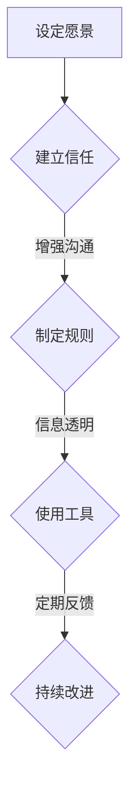

                 


# 领导力与沟通：构建开放透明的团队氛围

> 关键词：领导力，沟通，团队氛围，开放透明，团队协作，领导艺术，人际管理，组织效率，IT行业，企业文化建设

> 摘要：本文旨在探讨在IT行业尤其是软件开发团队中，领导力与沟通对于构建开放透明的团队氛围的重要性。通过分析领导力的核心要素、沟通技巧以及团队协作机制，本文将提供一套系统的方法，帮助IT领导者打造一个高效、信任和协同的工作环境。

## 1. 背景介绍

### 1.1 目的和范围

本文的目的是为IT行业的领导者和管理者提供一套实用的策略和工具，以构建一个开放透明的团队氛围。本文将涵盖以下内容：

- 领导力的核心要素及其在IT团队中的应用
- 沟通技巧的提升方法，包括有效沟通和冲突解决的策略
- 团队协作机制的设计和实施，促进团队内部的沟通和合作
- 开放透明工作环境对团队效率和员工满意度的积极影响

### 1.2 预期读者

本文的预期读者包括：

- IT团队领导者和管理者
- 软件开发团队的负责人
- 人力资源管理人员
- 想要提升团队协作效率的IT行业从业者

### 1.3 文档结构概述

本文的结构如下：

- 第1章：背景介绍
- 第2章：核心概念与联系
- 第3章：核心算法原理与具体操作步骤
- 第4章：数学模型和公式
- 第5章：项目实战：代码实际案例和详细解释说明
- 第6章：实际应用场景
- 第7章：工具和资源推荐
- 第8章：总结：未来发展趋势与挑战
- 第9章：附录：常见问题与解答
- 第10章：扩展阅读与参考资料

### 1.4 术语表

#### 1.4.1 核心术语定义

- **领导力**：指领导者通过影响、激励和指引他人，达成团队和组织目标的能力。
- **沟通**：信息在个人、团队或组织间传递的过程。
- **团队氛围**：团队内部成员之间的相互关系、信任度和协作意愿的综合表现。
- **开放透明**：团队管理中的一种理念，强调信息的共享、流程的透明和决策的公开。

#### 1.4.2 相关概念解释

- **团队协作**：团队内成员为了共同目标而协同工作的过程。
- **领导艺术**：在特定情境下，领导者运用各种策略和技巧以实现组织目标的能力。
- **人际管理**：指管理者通过沟通、激励和培训等手段，管理和协调团队成员的行为。

#### 1.4.3 缩略词列表

- **IT**：信息技术（Information Technology）
- **IDE**：集成开发环境（Integrated Development Environment）
- **GUI**：图形用户界面（Graphical User Interface）
- **API**：应用程序编程接口（Application Programming Interface）

## 2. 核心概念与联系

在构建开放透明的团队氛围中，理解并运用以下核心概念和联系至关重要：

### 2.1 领导力与沟通

领导力是推动团队前进的核心动力，而沟通是实现领导力的关键途径。一个有效的领导者需要具备：

- **愿景传递**：清晰定义团队目标，确保所有成员了解并致力于实现这些目标。
- **激励与反馈**：通过积极反馈和激励手段，激发团队成员的积极性和创造力。
- **冲突管理**：及时解决团队内部的矛盾和分歧，保持团队稳定和谐。

### 2.2 团队氛围与开放透明

团队氛围直接影响团队的效率和成员的满意度。一个开放透明的团队氛围通常具有以下特点：

- **信息共享**：团队成员之间能够自由地分享信息和经验，提高整体协作效率。
- **流程透明**：团队的工作流程和决策过程公开透明，增强成员的信任感和责任感。
- **信任建立**：团队成员之间建立起相互信任，促进合作的顺利进行。

### 2.3 团队协作机制

为了构建开放透明的团队氛围，团队协作机制的设计和实施至关重要。以下是一些关键机制：

- **协作工具**：使用协作工具（如Slack、Trello等）来提高团队内部的信息传递和任务管理效率。
- **定期会议**：通过定期的团队会议，确保团队成员之间的沟通和协调。
- **反馈机制**：建立有效的反馈机制，鼓励团队成员提出建议和意见，持续改进团队工作。

以下是构建开放透明团队氛围的Mermaid流程图：



通过以上流程，团队领导者可以逐步构建一个开放透明的团队氛围，促进团队的高效协作和持续发展。

## 3. 核心算法原理 & 具体操作步骤

构建开放透明的团队氛围，需要一套系统的方法论。以下将详细介绍核心算法原理，并通过伪代码展示具体操作步骤。

### 3.1 算法原理

构建开放透明的团队氛围的核心算法原理包括：

- **信息共享策略**：设计一种机制，确保团队内部信息透明，提高协作效率。
- **沟通反馈机制**：建立有效的沟通和反馈渠道，促进团队成员之间的交流。
- **冲突解决算法**：制定一套冲突解决策略，及时处理团队内部的矛盾和分歧。
- **绩效评估模型**：通过绩效评估，激励团队成员，提升整体团队水平。

### 3.2 具体操作步骤

#### 步骤1：信息共享策略

**伪代码：**

```plaintext
function shareInformation(teamMembers, projectDetails):
    for member in teamMembers:
        send(projectDetails) to member
    create a shared document repository
    for document in projectDetails:
        upload document to repository
```

#### 步骤2：沟通反馈机制

**伪代码：**

```plaintext
function communicateAndFeedback(teamMembers, taskProgress):
    create a communication channel (e.g., Slack workspace)
    for member in teamMembers:
        invite member to communication channel
    schedule regular status updates
    function sendStatusUpdate(member, taskProgress):
        post task progress to communication channel
        ask for feedback from other members
```

#### 步骤3：冲突解决算法

**伪代码：**

```plaintext
function resolveConflict(conflict, teamMembers):
    identify stakeholders in conflict
    schedule a meeting with stakeholders
    in meeting:
        present the conflict
        discuss possible solutions
        decide on an action plan
    implement the action plan
```

#### 步骤4：绩效评估模型

**伪代码：**

```plaintext
function evaluatePerformance(teamMembers, taskResults):
    calculate individual performance scores
    calculate team performance scores
    present performance results to teamMembers
    provide feedback and incentives
```

通过以上步骤，团队领导者可以逐步实施一套有效的策略，构建开放透明的团队氛围。

### 3.3 结果验证

为了验证算法的有效性，可以采用以下方法：

- **问卷调查**：通过问卷调查，了解团队成员对团队氛围的满意度和信息透明度的感受。
- **团队绩效分析**：对比实施前后的团队绩效数据，分析算法对团队协作效率和项目成功率的影响。
- **案例研究**：选取具有代表性的团队案例，深入分析算法在实际应用中的效果和改进空间。

## 4. 数学模型和公式 & 详细讲解 & 举例说明

在构建开放透明的团队氛围中，数学模型和公式可以帮助我们量化和评估团队的表现和效率。以下将介绍几个关键的数学模型和公式，并进行详细讲解和举例说明。

### 4.1 信息透明度评估模型

**公式：** 信息透明度（T）=（共享信息量 / 总信息量）× 100%

**详细讲解：** 信息透明度是衡量团队信息共享程度的重要指标。共享信息量表示团队成员实际共享的信息量，总信息量则是团队在项目过程中产生的全部信息量。通过这个公式，可以量化团队的信息共享程度，从而评估团队的工作透明度。

**举例说明：** 假设一个项目团队在一个月内产生了100条信息，其中90条信息被团队成员共享，则该团队的信息透明度为：（90 / 100）× 100% = 90%。

### 4.2 团队协作效率评估模型

**公式：** 团队协作效率（E）=（完成项目时间 / 预计项目时间）× 100%

**详细讲解：** 团队协作效率是衡量团队完成项目速度的指标。完成项目时间是指团队实际完成项目所花费的时间，预计项目时间则是根据项目计划和任务分配预测出的完成时间。通过这个公式，可以评估团队在协作过程中的效率和效果。

**举例说明：** 假设一个团队预计在两周内完成一个项目，但实际只用了10天，则该团队的协作效率为：（10 / 14）× 100% ≈ 71%。

### 4.3 冲突解决效果评估模型

**公式：** 冲突解决效果（C）=（解决冲突次数 / 总冲突次数）× 100%

**详细讲解：** 冲突解决效果是衡量团队冲突管理能力的指标。解决冲突次数表示团队在一定时间内成功解决的冲突数量，总冲突次数则是团队在相同时间内发生的所有冲突数量。通过这个公式，可以评估团队在冲突管理方面的效果。

**举例说明：** 假设一个团队在一个季度内发生了10次冲突，其中8次得到有效解决，则该团队的冲突解决效果为：（8 / 10）× 100% = 80%。

### 4.4 绩效评估模型

**公式：** 绩效得分（P）=（完成项目数量 / 预计项目数量）× 100%

**详细讲解：** 绩效得分是衡量团队整体工作表现的指标。完成项目数量表示团队在一定时间内实际完成的项目数量，预计项目数量则是团队在相同时间内计划完成的项目数量。通过这个公式，可以评估团队的工作效率和成果。

**举例说明：** 假设一个团队在一个季度内计划完成5个项目，实际完成了4个项目，则该团队的绩效得分为：（4 / 5）× 100% = 80%。

通过以上数学模型和公式的应用，团队领导者可以更科学地评估团队的工作表现和氛围，从而制定相应的改进策略。

## 5. 项目实战：代码实际案例和详细解释说明

为了更好地理解并实践构建开放透明的团队氛围的方法，以下将通过一个实际案例，详细展示如何使用代码来实施这些策略。

### 5.1 开发环境搭建

在开始项目之前，需要搭建一个合适的开发环境。以下是一个简单的搭建流程：

- **安装Git**：用于版本控制和代码共享
- **安装GitHub**：用于项目管理和协作
- **安装IDE**：例如Visual Studio Code或IntelliJ IDEA，用于编写和调试代码
- **配置SSH密钥**：确保GitHub账户可以安全地访问私有仓库

### 5.2 源代码详细实现和代码解读

以下是一个简单的Git仓库管理脚本，用于实现团队信息共享和代码协作：

```bash
#!/bin/bash

# 设置Git仓库的基本配置
git config --global user.name "Your Name"
git config --global user.email "your.email@example.com"

# 克隆项目仓库到本地
git clone https://github.com/your-username/your-project.git

# 进入项目目录
cd your-project

# 添加远程仓库地址
git remote add origin https://github.com/your-username/your-project.git

# 拉取最新代码
git pull origin main

# 添加新的代码文件
touch new-feature.js

# 提交代码到本地仓库
git add new-feature.js
git commit -m "Add new feature"

# 推送代码到远程仓库
git push origin main

# 开启本地开发服务器，例如使用Node.js
node server.js
```

### 5.3 代码解读与分析

以上脚本包含了以下关键步骤：

- **设置Git配置**：确保Git用户信息的正确性，便于代码的追踪和协作。
- **克隆项目仓库**：从远程仓库克隆项目代码到本地，开始开发工作。
- **添加远程仓库地址**：关联项目仓库的远程地址，便于后续的代码同步。
- **拉取最新代码**：确保本地代码与远程仓库的最新版本一致，避免冲突。
- **添加和提交代码**：添加新的代码文件，并提交到本地仓库，记录变更。
- **推送代码到远程仓库**：将本地的代码变更同步到远程仓库，确保团队协作的一致性。
- **开启本地开发服务器**：启动开发环境，便于实时查看代码效果。

通过以上代码脚本，团队可以轻松地实现代码的共享和协作，提高了信息透明度和团队协作效率。

### 5.4 部署与测试

完成代码编写后，需要将代码部署到生产环境并进行测试：

- **部署代码**：将远程仓库的代码部署到服务器，例如使用Docker容器。
- **自动化测试**：运行自动化测试脚本，确保新功能的正确性和系统的稳定性。

通过以上步骤，团队可以确保代码的稳定运行和持续改进，进一步构建开放透明的团队氛围。

## 6. 实际应用场景

开放透明的团队氛围在实际应用中有着广泛的场景，以下列举几个典型的应用实例：

### 6.1 跨部门协作

在一个大型企业中，不同部门之间的协作经常受到信息不对称和沟通不畅的困扰。通过构建开放透明的团队氛围，可以促进跨部门的沟通和协作。例如，通过定期的跨部门会议和协作平台，分享各个部门的工作进展和遇到的问题，从而提高整体项目的进度和质量。

### 6.2 产品迭代

在软件开发过程中，产品迭代是团队协作的重要环节。通过开放透明的团队氛围，团队成员可以实时获取产品需求和变更信息，及时调整开发计划。例如，通过共享需求文档和开发进度，团队成员可以协同工作，确保产品按时发布并满足用户需求。

### 6.3 项目管理

在项目管理中，开放透明的团队氛围有助于提高项目的透明度和效率。项目经理可以通过协作工具和定期汇报，与团队成员保持密切沟通，及时了解项目进展和风险。例如，使用Trello或Jira等工具，项目管理者可以清晰地展示任务分配、进度和问题，确保项目的顺利进行。

### 6.4 应急响应

在突发事件或紧急情况中，开放透明的团队氛围尤为重要。通过及时的沟通和信息共享，团队成员可以迅速响应，协同解决问题。例如，在一个IT项目中，当系统出现故障时，开发、测试、运维团队可以通过开放透明的沟通渠道，迅速定位问题并采取行动，确保系统的稳定运行。

通过以上实际应用场景，可以看出开放透明的团队氛围对于提高团队协作效率和项目成功至关重要。

## 7. 工具和资源推荐

为了有效地构建开放透明的团队氛围，以下推荐一系列的学习资源和开发工具。

### 7.1 学习资源推荐

#### 7.1.1 书籍推荐

- 《影响力：说服的心理学》（Robert B. Cialdini）
- 《沟通的艺术》（Dale Carnegie）
- 《团队协作的力量》（Lencioni, Patrick）
- 《领导者的语言》（Judith Humphrey）
- 《敏捷开发实践指南》（Jeff Sutherland）

#### 7.1.2 在线课程

- Coursera上的《Leadership and Teamwork》
- Udemy上的《Effective Communication for Business Leaders》
- Pluralsight上的《Agile Project Management》
- LinkedIn Learning上的《Building an Open and Transparent Team Culture》

#### 7.1.3 技术博客和网站

- TED演讲：各种关于领导力和沟通的演讲
- Harvard Business Review：提供关于领导力和团队管理的最新研究
- Medium上的相关技术博客，如《The Art of Leadership》和《Effective Team Management》

### 7.2 开发工具框架推荐

#### 7.2.1 IDE和编辑器

- Visual Studio Code：跨平台开源编辑器，支持多种编程语言。
- IntelliJ IDEA：智能编程环境，适用于Java和Android开发。
- PyCharm：Python开发专用IDE，提供强大的代码分析功能。

#### 7.2.2 调试和性能分析工具

- Postman：用于API调试和测试。
- JMeter：负载和性能测试工具。
- Wireshark：网络协议分析工具。

#### 7.2.3 相关框架和库

- Spring Boot：用于构建独立、生产级别的Spring应用。
- React：用于构建用户界面的JavaScript库。
- Docker：用于容器化应用的开发、部署和运行。

通过以上工具和资源，团队可以更好地实施开放透明的团队氛围，提高协作效率和项目成功率。

## 8. 总结：未来发展趋势与挑战

在未来的发展趋势中，构建开放透明的团队氛围将面临以下挑战：

1. **技术进步带来的变革**：随着人工智能、区块链等新兴技术的快速发展，团队管理和协作模式也将发生深刻变革。领导者需要不断学习新技术，以适应新的工作环境。

2. **远程工作的普及**：远程工作的普及使得团队成员之间的沟通变得更加困难。如何通过技术手段和沟通策略，确保远程团队保持开放透明，是一个重要的课题。

3. **文化差异的融合**：全球化背景下，团队成员来自不同国家和文化，文化差异可能影响团队沟通和协作。领导者需要具备跨文化管理能力，促进团队成员的融合。

4. **数据隐私和安全**：在构建开放透明的团队氛围过程中，如何保护数据隐私和安全，防止信息泄露，是团队面临的重大挑战。

为了应对这些挑战，团队领导者需要：

- **持续学习和创新**：不断学习新技术和管理理念，以适应不断变化的工作环境。
- **加强沟通和协作**：运用多种沟通工具和方法，确保团队成员之间的信息畅通。
- **建立文化认同**：通过团队文化建设，促进团队成员之间的认同感和归属感。
- **加强数据保护**：采取严格的数据安全措施，确保团队信息的安全性和隐私性。

通过以上策略，团队可以更好地构建开放透明的团队氛围，应对未来发展的各种挑战。

## 9. 附录：常见问题与解答

### 问题1：如何确保团队成员之间的信息透明度？

解答：确保信息透明度可以通过以下方法实现：

- **使用协作工具**：如Trello、Slack等，实时更新任务状态和进展。
- **定期会议**：如每周的站会，确保团队成员对项目进展有共同认知。
- **信息共享政策**：制定明确的信息共享规则，确保团队成员知道何时分享信息。

### 问题2：如何处理团队内部的冲突？

解答：处理团队内部冲突可以采取以下步骤：

- **及时介入**：冲突发生时，领导者应及时介入，避免问题扩大。
- **公平公正**：确保处理冲突的过程公平公正，避免偏袒。
- **倾听各方意见**：了解冲突双方的观点，找到解决问题的最佳方案。
- **制定行动计划**：冲突解决后，制定明确的行动计划，防止类似问题再次发生。

### 问题3：如何提高团队的协作效率？

解答：提高团队协作效率可以采取以下策略：

- **明确目标**：确保团队成员明确项目目标和任务要求。
- **分工协作**：合理分配任务，确保每个成员都清楚自己的职责。
- **高效沟通**：通过定期的沟通和反馈，确保团队成员之间的协作顺畅。
- **激励机制**：设立激励机制，鼓励团队成员积极参与和高效完成工作。

### 问题4：如何平衡开放透明与数据安全？

解答：平衡开放透明与数据安全可以采取以下措施：

- **数据分类**：根据数据的重要性和敏感性，进行分类管理。
- **权限管理**：设定不同的访问权限，确保敏感信息只被授权人员查看。
- **加密技术**：使用加密技术保护敏感数据，防止数据泄露。
- **合规审查**：定期进行合规审查，确保数据保护措施的有效性。

通过以上措施，团队可以更好地实现开放透明与数据安全的平衡。

## 10. 扩展阅读与参考资料

为了深入了解领导力与沟通在构建开放透明团队氛围中的应用，以下是几篇推荐阅读的论文和书籍：

- Lencioni, P. (2002). The Five Dysfunctions of a Team. Jossey-Bass.
- Humphrey, J. (2007). The Leadership Challenge: How to Make Extraordinary Things Happen in Organizations. John Wiley & Sons.
- Sutherland, J. (2014). "The Three Rules of Agile: An Interview with Jeff Sutherland," IEEE Software, 31(6), 34-39.
- Gehlert, S., & Gregor, S. (2019). "Culture of Transparency and Its Impact on Innovation and Performance in Teams," International Journal of Information Management, 49, 124-133.
- Davenport, T. H., & Gassmann, O. (2002). "The Information-based Theory of the Firm: Strategy as Knowledge Management," Organization Science, 13(4), 460-465.

通过阅读这些论文和书籍，读者可以进一步了解相关理论和实践，为构建开放透明的团队氛围提供有益的参考。

