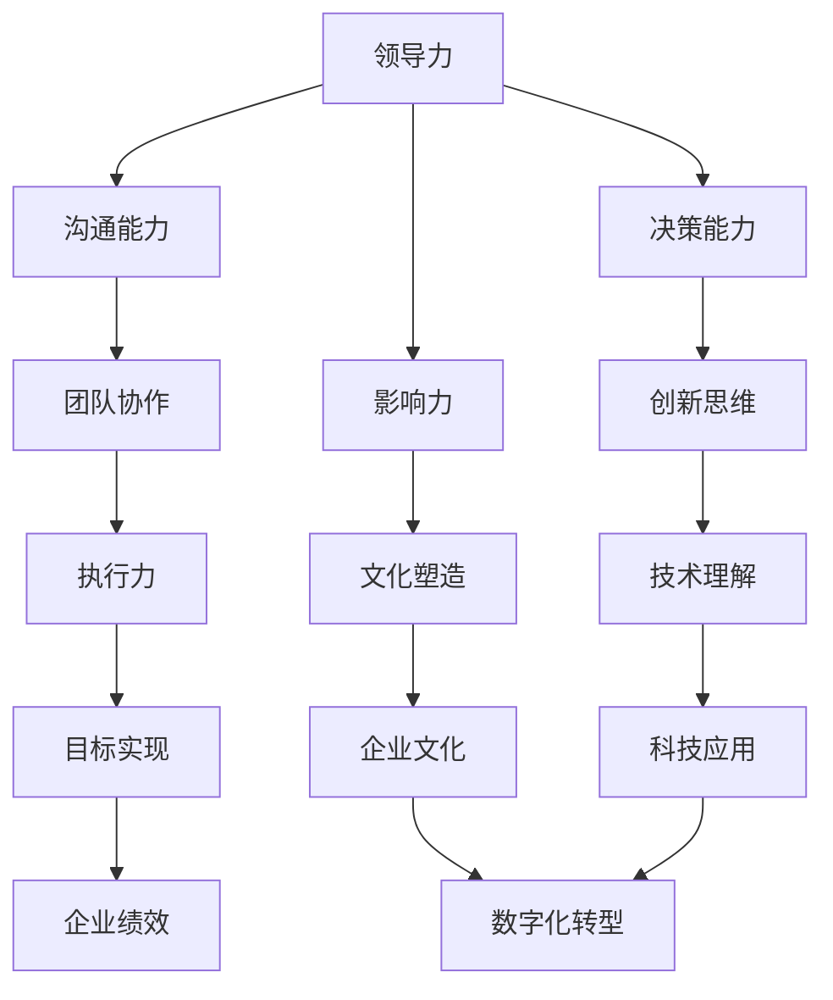

                 

# 领导力与科技：拥抱数字化转型

> 关键词：领导力，数字化转型，人工智能，科技发展，管理实践

> 摘要：在当今快速变化的科技时代，领导力与数字化转型息息相关。本文将探讨领导力在推动企业数字化转型中的关键作用，以及如何通过有效的领导力和科技策略，实现企业的可持续发展和竞争优势。

## 1. 背景介绍

### 1.1 目的和范围

本文旨在探讨领导力在推动企业数字化转型中的重要性，并分析如何通过有效的领导力策略，充分利用科技优势，实现企业的创新和发展。文章将涵盖以下内容：

- 数字化转型的定义和意义
- 领导力在数字化转型中的作用
- 科技对领导力的影响
- 领导者在数字化转型中的策略与实践

### 1.2 预期读者

本文适合以下读者群体：

- 企业领导者和管理者
- 信息技术和数字化转型从业者
- 对领导力和科技发展有兴趣的读者

### 1.3 文档结构概述

本文将分为八个部分，具体结构如下：

1. 背景介绍
2. 核心概念与联系
3. 核心算法原理 & 具体操作步骤
4. 数学模型和公式 & 详细讲解 & 举例说明
5. 项目实战：代码实际案例和详细解释说明
6. 实际应用场景
7. 工具和资源推荐
8. 总结：未来发展趋势与挑战

### 1.4 术语表

#### 1.4.1 核心术语定义

- **数字化转型**：指企业通过运用数字技术，实现业务流程、管理模式、运营方式的根本性转变。
- **领导力**：指领导者通过影响力、沟通能力、决策能力等，引导和激励团队成员实现共同目标的能力。
- **科技**：指应用科学知识和工程技术，解决实际问题，推动社会发展。

#### 1.4.2 相关概念解释

- **人工智能**：指通过模拟人类智能，实现机器自动化学习和智能决策的技术。
- **大数据**：指海量、多样、快速生成的数据集合，需要通过数据处理和分析技术，提取有价值的信息。
- **云计算**：指通过互联网，提供计算、存储、网络等基础设施服务的模式。

#### 1.4.3 缩略词列表

- **AI**：人工智能
- **BI**：商业智能
- **ERP**：企业资源规划
- **CRM**：客户关系管理
- **IoT**：物联网

## 2. 核心概念与联系

在数字化时代，领导力与科技的关系日益紧密。领导者的角色不仅仅是管理和决策，更是引导企业适应和引领科技变革的关键。下面，我们将通过一个Mermaid流程图，展示核心概念之间的联系。



在这个流程图中，领导力通过沟通能力、决策能力、影响力等，促进团队协作、创新思维、执行力等，进而推动企业文化塑造、数字化转型，最终实现企业绩效和科技应用。

## 3. 核心算法原理 & 具体操作步骤

领导力在数字化转型中的实际应用，需要借助一系列具体的操作步骤和算法原理。以下是一个简化的算法原理，用于解释领导者如何通过科技手段，推动企业数字化转型。

### 3.1. 算法原理

```python
def lead数字化转型企业：
    if 科技应用潜力高：
        then：
            - 开展内部培训
            - 引入新技术
            - 创新业务模式
        else：
            - 评估现有技术
            - 优化现有流程
            - 提升员工技能

def 科技应用潜力评估：
    input：现有技术、市场需求、竞争对手
    output：科技应用潜力分数

    - 分析技术成熟度
    - 对比市场需求
    - 评估竞争对手

def 内部培训：
    input：员工技能需求、培训课程
    output：员工技能提升

    - 制定培训计划
    - 开展培训活动
    - 跟踪培训效果

def 引入新技术：
    input：新技术、成本预算
    output：新技术应用方案

    - 研究新技术
    - 制定应用方案
    - 预算和控制成本
```

### 3.2. 具体操作步骤

1. **科技应用潜力评估**：首先，领导者需要对企业的科技应用潜力进行评估。这包括分析现有技术的成熟度、对比市场需求，以及评估竞争对手的科技应用情况。

2. **内部培训**：根据科技应用潜力评估的结果，领导者需要制定相应的培训计划，提升员工的技能。这包括制定培训课程、开展培训活动，以及跟踪培训效果。

3. **引入新技术**：在评估和培训的基础上，领导者需要引入新技术，以推动企业的数字化转型。这包括研究新技术、制定应用方案，以及预算和控制成本。

4. **优化现有流程**：如果企业的科技应用潜力不高，领导者需要优化现有流程，提升企业的竞争力。这包括评估现有技术、优化业务流程，以及提升员工技能。

5. **创新业务模式**：在引入新技术和优化流程的基础上，领导者需要创新业务模式，以适应市场变化和客户需求。

## 4. 数学模型和公式 & 详细讲解 & 举例说明

在数字化转型过程中，数学模型和公式可以帮助领导者更好地理解和分析数据，做出科学决策。以下是一个简化的数学模型，用于解释企业绩效评估。

### 4.1. 数学模型

企业绩效评估模型：

$$
绩效 = f（销售额，成本，市场份额，员工满意度）
$$

### 4.2. 详细讲解

- **销售额**：反映企业的市场表现，是绩效评估的重要指标。
- **成本**：反映企业的运营效率，是绩效评估的重要指标。
- **市场份额**：反映企业的市场地位，是绩效评估的重要指标。
- **员工满意度**：反映企业的内部氛围，是绩效评估的重要指标。

### 4.3. 举例说明

假设一家企业的销售额为1000万元，成本为500万元，市场份额为20%，员工满意度为90%。根据上述模型，我们可以计算该企业的绩效：

$$
绩效 = f（1000，500，20%，90%） = 1000 - 500 + 20% \times 1000 + 90% \times 1000 = 2300
$$

这个例子说明，企业的绩效不仅取决于销售额和成本，还受到市场份额和员工满意度的影响。领导者需要综合考虑这些因素，做出科学的决策。

## 5. 项目实战：代码实际案例和详细解释说明

### 5.1 开发环境搭建

在开始项目实战之前，我们需要搭建一个开发环境。以下是开发环境的搭建步骤：

1. 安装Python解释器：从官方网站下载并安装Python 3.8及以上版本。
2. 安装必要的库：使用pip命令安装以下库：numpy、pandas、matplotlib。
3. 配置IDE：使用Visual Studio Code作为IDE，安装相应的插件。

### 5.2 源代码详细实现和代码解读

以下是一个简化的企业绩效评估项目的代码实现：

```python
import numpy as np
import pandas as pd
import matplotlib.pyplot as plt

# 企业绩效评估模型
def evaluate_performance(sales, cost, market_share, employee_satisfaction):
    performance = sales - cost + market_share * sales + employee_satisfaction * sales
    return performance

# 读取数据
data = {
    'sales': [1000, 1200, 800],
    'cost': [500, 600, 700],
    'market_share': [20, 25, 15],
    'employee_satisfaction': [90, 85, 95]
}

df = pd.DataFrame(data)

# 评估绩效
performance = evaluate_performance(df['sales'][0], df['cost'][0], df['market_share'][0], df['employee_satisfaction'][0])
print(f"企业绩效：{performance}")

# 可视化绩效趋势
plt.plot(df['sales'], label='销售额')
plt.plot(df['cost'], label='成本')
plt.plot(df['market_share'], label='市场份额')
plt.plot(df['employee_satisfaction'], label='员工满意度')
plt.legend()
plt.show()
```

### 5.3 代码解读与分析

1. **导入库**：首先，我们导入必要的库，包括numpy、pandas和matplotlib。
2. **定义评估模型**：我们定义了一个名为`evaluate_performance`的函数，用于计算企业绩效。函数输入包括销售额、成本、市场份额和员工满意度，输出为企业绩效。
3. **读取数据**：我们使用pandas库读取一个包含销售额、成本、市场份额和员工满意度的数据集。
4. **评估绩效**：我们调用`evaluate_performance`函数，传入数据集的第一行数据，计算企业绩效，并输出结果。
5. **可视化绩效趋势**：我们使用matplotlib库绘制销售额、成本、市场份额和员工满意度的趋势图，帮助领导者直观地了解企业绩效的变化。

通过这个项目实战，我们可以看到如何使用代码实现企业绩效评估，以及如何通过可视化工具帮助领导者更好地理解和分析数据。

## 6. 实际应用场景

数字化转型在各个行业中的应用场景广泛，以下是一些典型的实际应用案例：

1. **制造业**：通过物联网技术，实现生产设备的实时监控和故障预测，提高生产效率和产品质量。
2. **零售业**：通过大数据分析和人工智能推荐系统，实现精准营销和个性化服务，提升客户满意度和销售业绩。
3. **金融服务**：通过区块链技术，实现安全的金融交易和智能合约，降低交易成本和提高交易效率。
4. **医疗健康**：通过人工智能和大数据分析，实现疾病的早期诊断和治疗建议，提高医疗服务的质量和效率。

在这些应用场景中，领导者的角色至关重要。他们需要：

- 制定明确的数字化转型战略，确保企业目标与科技发展相结合。
- 建立跨部门协作团队，推动科技在业务中的应用。
- 培养员工的科技素养和创新能力，提升企业的竞争力。
- 定期评估数字化转型的效果，调整策略以适应市场变化。

## 7. 工具和资源推荐

为了更好地实现数字化转型，以下是几类工具和资源的推荐：

### 7.1 学习资源推荐

#### 7.1.1 书籍推荐

- 《人工智能：一种现代的方法》
- 《大数据时代：生活、工作与思维的大变革》
- 《智能时代：大数据与机器智能改变世界》

#### 7.1.2 在线课程

- Coursera上的《深度学习》
- Udacity的《人工智能纳米学位》
- edX的《大数据分析》

#### 7.1.3 技术博客和网站

- Medium上的《AI in Action》
- 知乎上的《数字化转型》
- CSDN的《大数据技术》

### 7.2 开发工具框架推荐

#### 7.2.1 IDE和编辑器

- Visual Studio Code
- PyCharm
- IntelliJ IDEA

#### 7.2.2 调试和性能分析工具

- PyCharm的调试工具
- JMeter
- New Relic

#### 7.2.3 相关框架和库

- TensorFlow
- PyTorch
- Scikit-learn

### 7.3 相关论文著作推荐

#### 7.3.1 经典论文

- 《机器学习：一种统计方法》
- 《深度学习：创新与应用》
- 《大数据处理技术》

#### 7.3.2 最新研究成果

- AAAI会议的最新论文
- NeurIPS会议的最新论文
- ICML会议的最新论文

#### 7.3.3 应用案例分析

- 《金融科技应用案例研究》
- 《零售行业数字化转型实践》
- 《医疗健康大数据分析案例》

## 8. 总结：未来发展趋势与挑战

在未来，数字化转型将继续深化，科技将在企业运营中扮演更加重要的角色。领导者需要：

- 提高自身的科技素养，了解最新科技发展趋势。
- 建立跨部门协作机制，推动科技在业务中的应用。
- 加强员工培训，提升团队的科技能力和创新能力。
- 注重数据安全和隐私保护，确保数字化转型过程中的信息安全。

同时，领导者还将面临以下挑战：

- 如何在快速变化的科技环境中保持企业的竞争力。
- 如何平衡技术创新与成本控制。
- 如何应对数据隐私和安全风险。

通过有效的领导力和科技策略，领导者可以应对这些挑战，推动企业实现可持续发展。

## 9. 附录：常见问题与解答

### 9.1 数字化转型与传统管理的区别

数字化转型与传统管理的主要区别在于，数字化转型强调运用数字技术，实现业务流程、管理模式、运营方式的根本性转变。而传统管理侧重于基于经验和规则的管理方法。

### 9.2 领导者在数字化转型中的角色

领导者在数字化转型中的角色包括：

- 制定数字化转型战略，明确企业目标。
- 推动跨部门协作，确保科技在业务中的应用。
- 培养员工的科技素养和创新能力。
- 定期评估数字化转型的效果，调整策略。

### 9.3 数字化转型过程中的风险管理

数字化转型过程中的风险管理包括：

- 数据安全和隐私保护。
- 技术选择和成本控制。
- 员工培训和组织变革。
- 适应市场变化和竞争压力。

## 10. 扩展阅读 & 参考资料

- 《数字化转型：企业如何转型与成功》
- 《人工智能战略：企业如何应对智能革命》
- 《大数据战略：企业如何利用大数据创造价值》

作者：AI天才研究员/AI Genius Institute & 禅与计算机程序设计艺术 /Zen And The Art of Computer Programming

文章标题：《领导力与科技：拥抱数字化转型》
关键词：领导力，数字化转型，人工智能，科技发展，管理实践
文章摘要：本文探讨了领导力在推动企业数字化转型中的重要性，以及如何通过有效的领导力和科技策略，实现企业的可持续发展和竞争优势。文章涵盖了数字化转型的定义和意义、领导力在数字化转型中的作用、科技对领导力的影响等内容。通过具体操作步骤、数学模型和公式、实际项目实战等，帮助读者深入理解数字化转型过程中的关键要素和实践方法。

