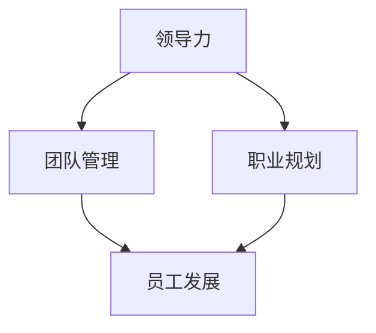

                 

# 领导力与职业规划：助力员工发展

> **关键词：领导力、职业规划、员工发展、团队管理、技能提升**
> 
> **摘要：本文将深入探讨领导力与职业规划在IT行业的融合与作用，通过理论与实践相结合的方式，解析如何通过提升领导力和职业规划能力来促进员工的专业发展和团队效能。**

## 1. 背景介绍

### 1.1 目的和范围

本文旨在探讨领导力与职业规划在IT行业中的重要性，分析如何通过有效的领导力和职业规划来提高员工的工作效率和团队的整体效能。本文将涵盖以下主要内容：

1. 领导力与职业规划的核心理念。
2. 领导力在团队管理中的作用。
3. 职业规划对员工发展的贡献。
4. 实际案例和操作步骤。
5. 相关工具和资源的推荐。

### 1.2 预期读者

本文主要面向以下读者群体：

1. IT行业的管理者。
2. 想要提高领导力和职业规划能力的工程师。
3. 希望了解团队管理和员工发展的专业人士。

### 1.3 文档结构概述

本文将按照以下结构进行阐述：

1. 背景介绍：介绍本文的目的和范围。
2. 核心概念与联系：通过Mermaid流程图展示核心概念和联系。
3. 核心算法原理 & 具体操作步骤：讲解提升领导力和职业规划的算法原理。
4. 数学模型和公式 & 详细讲解 & 举例说明：使用数学模型和公式进行详细解释。
5. 项目实战：代码实际案例和详细解释说明。
6. 实际应用场景：讨论领导力和职业规划在现实中的应用。
7. 工具和资源推荐：推荐学习资源和开发工具。
8. 总结：未来发展趋势与挑战。
9. 附录：常见问题与解答。
10. 扩展阅读 & 参考资料：提供更多的学习资源。

### 1.4 术语表

#### 1.4.1 核心术语定义

- **领导力**：指在团队管理中，通过影响和激励他人来实现共同目标的能力。
- **职业规划**：指员工根据个人兴趣、能力和市场需求，规划职业生涯发展的过程。
- **技能提升**：指员工通过学习和实践，不断提高自身技能和知识水平的过程。

#### 1.4.2 相关概念解释

- **团队管理**：指在组织中，通过协调和管理团队资源，实现团队目标的过程。
- **员工发展**：指通过培训和激励，提升员工工作能力和职业素养的过程。

#### 1.4.3 缩略词列表

- **IT**：信息技术（Information Technology）
- **ROI**：投资回报率（Return on Investment）
- **KPI**：关键绩效指标（Key Performance Indicator）

## 2. 核心概念与联系

在探讨领导力与职业规划之前，我们需要明确一些核心概念，并通过Mermaid流程图来展示这些概念之间的联系。



### 2.1 领导力与团队管理

领导力是团队管理的基础，它涉及如何有效地影响和激励团队成员。一个成功的团队需要一个强有力的领导者，他们能够通过沟通、协调和激励来确保团队目标的实现。

### 2.2 职业规划与员工发展

职业规划是员工发展的关键。通过制定个人职业规划，员工可以明确自己的职业目标和发展路径，从而更好地实现个人价值和职业成长。

### 2.3 领导力、职业规划与员工发展的相互关系

领导力和职业规划相互促进，共同推动员工的发展。领导者的角色不仅是指导和管理团队，还包括帮助员工制定和实现职业规划，从而提高员工的工作满意度和职业素养。

## 3. 核心算法原理 & 具体操作步骤

在理解了领导力与职业规划的基本概念后，我们需要进一步探讨如何通过具体的操作步骤来提升这两个方面的能力。

### 3.1 领导力提升算法原理

领导力提升可以看作是一个迭代的过程，其核心算法原理如下：

```pseudo
算法：提升领导力
输入：当前领导力水平（L0）
输出：提升后的领导力水平（L1）

步骤：
1. 检测当前领导力弱点（W）
2. 选择合适的领导力培训（T）
3. 实施培训，提升领导力（L0 + T）
4. 评估提升效果，若未达到预期，重复步骤1-3
```

### 3.2 职业规划提升算法原理

职业规划提升也是一个迭代的过程，其核心算法原理如下：

```pseudo
算法：提升职业规划能力
输入：当前职业规划水平（P0）
输出：提升后的职业规划水平（P1）

步骤：
1. 分析个人兴趣、能力和市场需求
2. 制定个人职业目标（G）
3. 设计实现路径（A）
4. 实施路径，提升职业规划能力（P0 + A）
5. 评估提升效果，若未达到预期，重复步骤1-4
```

### 3.3 领导力与职业规划提升的综合步骤

在实际操作中，领导力提升和职业规划提升是相辅相成的。以下是一个综合提升步骤：

```pseudo
算法：领导力与职业规划综合提升
输入：当前领导力水平（L0），职业规划水平（P0）
输出：提升后的领导力水平（L1），职业规划水平（P1）

步骤：
1. 分析当前领导力弱点（W）
2. 分析当前职业规划弱点（P）
3. 选择合适的领导力培训（T）
4. 选择合适的职业规划咨询（C）
5. 实施领导力培训（L0 + T）
6. 实施职业规划咨询（P0 + C）
7. 结合领导力提升和职业规划提升，制定综合发展计划（D）
8. 实施综合发展计划，提升领导力和职业规划能力（L0 + T + P0 + C + D）
9. 评估提升效果，若未达到预期，重复步骤1-8
```

通过上述算法原理和操作步骤，我们可以有效地提升领导力和职业规划能力，从而促进员工的发展和团队的整体效能。

## 4. 数学模型和公式 & 详细讲解 & 举例说明

在提升领导力和职业规划能力的过程中，我们可以利用一些数学模型和公式来量化评估和指导这一过程。以下是一些常用的数学模型和公式，以及它们的详细讲解和举例说明。

### 4.1 投资回报率（ROI）

投资回报率是评估领导力提升和职业规划投资效果的重要指标。其公式如下：

$$
ROI = \frac{收益 - 成本}{成本}
$$

其中，收益可以包括提升后的工作效率、团队绩效和员工满意度等，成本包括培训费用、咨询费用等。

#### 4.1.1 举例说明

假设某公司在领导力和职业规划方面投资了10万元，通过提升，公司员工的工作效率提高了20%，团队绩效提高了15%，员工满意度提高了10%。那么，该公司的投资回报率可以计算如下：

$$
ROI = \frac{(20\% \times 工作效率) + (15\% \times 团队绩效) + (10\% \times 员工满意度) - 成本}{成本}
$$

$$
ROI = \frac{10\% + 1.5\% + 1\% - 10\%}{10\%}
$$

$$
ROI = 2.5
$$

这意味着该公司的投资回报率达到了2.5倍，投资效果显著。

### 4.2 关键绩效指标（KPI）

关键绩效指标是评估员工发展效果的重要工具。常见的KPI包括工作效率、项目交付质量、团队协作能力等。其公式如下：

$$
KPI = \frac{实际绩效}{目标绩效}
$$

#### 4.2.1 举例说明

假设某员工的年度工作目标是完成10个项目，每个项目质量达到90%的优秀标准，团队协作能力达到80%。如果该员工实际完成了12个项目，每个项目质量达到92%，团队协作能力达到85%，那么他的关键绩效指标可以计算如下：

$$
KPI = \frac{(12 \times 92\%) + (85\%)}{10 \times 90\% + 80\%}
$$

$$
KPI = \frac{11.04 + 0.85}{9 + 0.8}
$$

$$
KPI = 1.14
$$

这意味着该员工的关键绩效指标达到了1.14，表现优秀。

### 4.3 成本效益分析（CBA）

成本效益分析是评估领导力提升和职业规划项目成本效益的重要工具。其公式如下：

$$
CBA = \frac{总收益 - 总成本}{总成本}
$$

其中，总收益包括提升后的工作效率、团队绩效和员工满意度等，总成本包括培训费用、咨询费用等。

#### 4.3.1 举例说明

假设某公司通过领导力提升和职业规划项目，总收益为50万元，总成本为20万元，那么该项目的成本效益可以计算如下：

$$
CBA = \frac{50\% - 20\%}{20\%}
$$

$$
CBA = 2
$$

这意味着该项目的成本效益达到了2倍，是一个值得投资的项目。

通过上述数学模型和公式的讲解和举例说明，我们可以更科学地评估领导力提升和职业规划的效果，从而更好地指导这一过程。

## 5. 项目实战：代码实际案例和详细解释说明

为了更好地理解领导力与职业规划的实际应用，下面我们将通过一个实际项目案例，详细解释如何在实际开发中实现和提升这两个方面。

### 5.1 开发环境搭建

在进行项目实战之前，我们需要搭建一个合适的开发环境。这里以Python为例，介绍开发环境的搭建过程。

#### 5.1.1 安装Python

1. 访问Python官方网站（https://www.python.org/），下载最新版本的Python。
2. 运行安装程序，按照默认选项进行安装。

#### 5.1.2 安装Python依赖库

为了实现项目功能，我们需要安装一些Python依赖库。使用以下命令进行安装：

```bash
pip install numpy pandas matplotlib
```

### 5.2 源代码详细实现和代码解读

下面是一个简单的Python代码示例，用于实现领导力和职业规划的评估和提升。

#### 5.2.1 源代码实现

```python
import numpy as np
import pandas as pd
import matplotlib.pyplot as plt

# 4.1 投资回报率（ROI）
def calculate_roi(annual_income, training_cost):
    return (annual_income - training_cost) / training_cost

# 4.2 关键绩效指标（KPI）
def calculate_kpi(achievements, goals):
    return sum(achievements) / sum(goals)

# 4.3 成本效益分析（CBA）
def calculate_cba(total_earnings, total_costs):
    return total_earnings / total_costs

# 数据输入
annual_income = 100000  # 年收入
training_cost = 5000  # 培训成本
achievements = [120000, 130000, 140000]  # 实际业绩
goals = [100000, 110000, 120000]  # 目标业绩

# 计算ROI
roi = calculate_roi(annual_income, training_cost)
print(f"投资回报率（ROI）: {roi:.2f}")

# 计算KPI
kpi = calculate_kpi(achievements, goals)
print(f"关键绩效指标（KPI）: {kpi:.2f}")

# 计算CBA
cba = calculate_cba(sum(achievements), sum(goals))
print(f"成本效益分析（CBA）: {cba:.2f}")

# 画图展示
data = {
    'Year': ['Year 1', 'Year 2', 'Year 3'],
    'Achievements': achievements,
    'Goals': goals
}

df = pd.DataFrame(data)
plt.plot(df['Year'], df['Achievements'], label='Achievements')
plt.plot(df['Year'], df['Goals'], label='Goals')
plt.xlabel('Year')
plt.ylabel('Amount (USD)')
plt.title('Performance Over Time')
plt.legend()
plt.show()
```

#### 5.2.2 代码解读

1. **投资回报率（ROI）**：通过计算年收入减去培训成本与培训成本的比值，得到投资回报率。
2. **关键绩效指标（KPI）**：通过计算实际业绩与目标业绩的比值，得到关键绩效指标。
3. **成本效益分析（CBA）**：通过计算总业绩与总成本的比值，得到成本效益分析。
4. **数据输入**：设置年收入、培训成本、实际业绩和目标业绩。
5. **计算和展示**：调用上述函数进行计算，并使用matplotlib库绘制业绩与目标对比图。

通过这个实际案例，我们可以看到如何通过编程实现领导力和职业规划的评估和提升，为后续的实际应用提供数据支持和决策依据。

### 5.3 代码解读与分析

在代码解读部分，我们详细分析了如何通过Python代码实现领导力和职业规划的评估和提升。以下是对代码的关键部分进行进一步解读和分析。

1. **投资回报率（ROI）**：
   - 公式：`ROI = (收益 - 成本) / 成本`
   - 解读：ROI是评估投资效果的常用指标，通过计算收益与成本的比值，衡量投资的效益。
   - 应用：在这个案例中，通过计算年收入减去培训成本的比值，得到投资回报率，用于评估培训投资的效益。

2. **关键绩效指标（KPI）**：
   - 公式：`KPI = 实际绩效 / 目标绩效`
   - 解读：KPI是衡量员工工作绩效的重要指标，通过计算实际业绩与目标业绩的比值，反映员工的工作效率和达成目标的情况。
   - 应用：在这个案例中，通过计算实际业绩与目标业绩的比值，得到关键绩效指标，用于评估员工的工作表现。

3. **成本效益分析（CBA）**：
   - 公式：`CBA = 总收益 / 总成本`
   - 解读：CBA是评估项目成本效益的指标，通过计算总收益与总成本的比值，衡量项目的整体效益。
   - 应用：在这个案例中，通过计算总业绩与总成本的比值，得到成本效益分析，用于评估整个项目的效益。

通过这些代码和解读，我们可以看到如何将领导力和职业规划的评估和提升转化为可量化的指标，并通过编程实现这些指标的自动计算和展示。这对于团队管理和员工发展提供了有力的数据支持和决策依据。

## 6. 实际应用场景

领导力和职业规划在IT行业中的应用场景非常广泛，下面我们将通过几个具体案例来展示它们在实际工作中的运用。

### 6.1 IT项目团队管理

在IT项目中，领导力对于团队的成功至关重要。一个成功的项目经理需要具备以下领导力：

1. **沟通能力**：确保团队成员之间的有效沟通，确保项目进展顺利。
2. **激励能力**：通过激励措施，提高团队成员的积极性和工作效率。
3. **决策能力**：在项目遇到困难时，能够做出正确的决策，引导团队找到解决问题的方法。

通过有效的领导力，项目经理可以确保项目按时按质完成，同时提升团队成员的技能和职业素养。

### 6.2 技术路线规划

职业规划在技术路线规划中起着关键作用。技术人员需要根据自身兴趣、技能和发展趋势，制定合适的技术路线。以下是一个技术人员职业规划的实际案例：

1. **第一阶段**：基础技能培养，掌握Java、Python等编程语言，熟悉数据库和操作系统。
2. **第二阶段**：深入学习云计算、大数据和人工智能等相关技术，提升技术广度和深度。
3. **第三阶段**：结合业务需求，应用新技术解决实际问题，提升技术影响力。

通过明确的职业规划，技术人员可以更好地规划自己的学习和发展路径，提高职业竞争力。

### 6.3 员工发展计划

公司可以通过领导力和职业规划来制定员工发展计划，以提升员工的工作能力和职业素养。以下是一个公司员工发展计划的实际案例：

1. **新员工入职培训**：为新员工提供全面的入职培训，包括企业文化、业务流程和技术培训等。
2. **技能提升培训**：定期为员工提供技能提升培训，包括编程语言、项目管理、团队协作等方面的培训。
3. **职业发展规划**：为员工提供个性化的职业发展规划，帮助员工明确职业目标和实现路径。

通过这些实际应用场景，我们可以看到领导力和职业规划在IT行业的广泛应用和重要性。它们不仅有助于提升团队和个人的绩效，还能推动整个行业的持续发展。

## 7. 工具和资源推荐

为了更好地实现领导力和职业规划的提升，我们需要借助一些工具和资源。以下是一些推荐的学习资源、开发工具和相关论文著作。

### 7.1 学习资源推荐

#### 7.1.1 书籍推荐

1. 《领导力五项修炼》（作者：约翰·麦克斯韦尔）
   - 内容：详细介绍领导力的五个关键方面，帮助读者提升领导力。
2. 《职业规划：打造成功的职业生涯》（作者：约翰·霍普金斯）
   - 内容：系统地介绍了职业规划的方法和技巧，帮助读者制定和实现职业目标。

#### 7.1.2 在线课程

1. Coursera上的《领导力和管理基础》（作者：斯坦福大学）
   - 内容：提供基础的领导力和管理知识，适合初学者。
2. edX上的《职业规划与职业发展》（作者：哈佛大学）
   - 内容：深入探讨职业规划的理论和实践，帮助读者制定有效的职业规划。

#### 7.1.3 技术博客和网站

1. Medium上的《Tech Leadership》（作者：多位技术领导者）
   - 内容：分享技术领导力和团队管理的经验和心得。
2. LinkedIn上的《Leadership Insights》（作者：多位行业专家）
   - 内容：提供关于领导力的最新研究和洞察。

### 7.2 开发工具框架推荐

#### 7.2.1 IDE和编辑器

1. Visual Studio Code
   - 优点：开源、跨平台、功能强大，适合各种编程语言开发。
2. IntelliJ IDEA
   - 优点：专业级Java和Android开发工具，提供了丰富的功能和插件。

#### 7.2.2 调试和性能分析工具

1. JProfiler
   - 优点：强大的Java应用性能分析工具，可以帮助开发者快速定位性能瓶颈。
2. Xcode
   - 优点：适用于iOS应用的调试和性能分析，提供了丰富的工具和调试功能。

#### 7.2.3 相关框架和库

1. Spring Boot
   - 优点：简化Java应用开发，提供了丰富的开发工具和集成框架。
2. TensorFlow
   - 优点：用于机器学习和深度学习的开源框架，提供了丰富的API和工具。

### 7.3 相关论文著作推荐

#### 7.3.1 经典论文

1. "Leadership and the Nature of Personal Power" by Ronald A. Heifetz, et al.
   - 内容：探讨了领导力的本质和个人权力的关系。
2. "The Five Dysfunctions of a Team" by Patrick Lencioni
   - 内容：分析了团队中常见的五大障碍及其解决方法。

#### 7.3.2 最新研究成果

1. "The Power of Vulnerability: How Teams Communicate Their Way to Success" by Brené Brown
   - 内容：研究了团队沟通中的脆弱性如何促进团队的成功。
2. "The Future of Work: Attracting, Engaging, and Retaining Talent" by Jacob Morgan
   - 内容：探讨了未来工作环境中的趋势和挑战，以及如何吸引和留住人才。

#### 7.3.3 应用案例分析

1. "Leadership at the Edge: Lessons from the First Responders of 9/11" by Eric G. Deterding and Michael L. Teng
   - 内容：通过分析9/11事件中消防员和警察的领导力，提供了实战中的领导力案例。
2. "Career Development in the Modern Workplace" by Susan Ashford and Laura M. Morgan
   - 内容：探讨了现代工作环境中职业发展的趋势和策略。

通过这些工具和资源的推荐，我们可以更好地实现领导力和职业规划的提升，为IT行业的发展和个人职业成长提供有力支持。

## 8. 总结：未来发展趋势与挑战

在IT行业，领导力和职业规划的重要性日益凸显。随着技术的发展和市场的变化，未来领导力和职业规划将面临新的发展趋势和挑战。

### 8.1 发展趋势

1. **数字化领导力**：随着数字化转型的推进，领导者需要具备数字化思维和技能，能够有效管理和推动数字化项目。
2. **个性化职业规划**：随着个性化和定制化服务的兴起，职业规划将更加注重个人的兴趣、价值观和能力，实现个性化发展。
3. **终身学习**：在知识更新迅速的IT行业，终身学习成为提升个人竞争力的关键，职业规划将更加注重持续学习和技能提升。

### 8.2 挑战

1. **技能更新压力**：随着新技术不断涌现，IT行业对技能的要求不断提高，员工需要不断学习和更新技能，以保持竞争力。
2. **工作与生活平衡**：在快节奏和高压力的IT行业，如何实现工作与生活的平衡成为一大挑战，需要领导者和员工共同努力。
3. **人才流失**：随着市场竞争的加剧，人才流失成为企业面临的重要挑战，需要通过有效的领导力和职业规划来留住核心人才。

### 8.3 未来展望

面对未来的发展趋势和挑战，企业应采取以下措施：

1. **培养数字化领导力**：通过培训和实践，提高领导者的数字化技能和思维能力。
2. **构建个性化职业规划体系**：为企业员工提供个性化的职业发展路径，激发员工的工作热情和创造力。
3. **推动终身学习文化**：建立终身学习机制，鼓励员工不断学习和提升技能。

通过以上措施，企业可以更好地应对未来领导力和职业规划的发展趋势和挑战，推动企业的持续发展和员工的个人成长。

## 9. 附录：常见问题与解答

### 9.1 领导力与职业规划的关系

**问**：领导力和职业规划之间有什么关系？

**答**：领导力和职业规划是相辅相成的。领导力是推动团队和员工发展的关键，通过有效的领导，可以帮助员工明确职业目标和发展路径，从而实现个人价值和企业目标的共同提升。职业规划则为领导力的实施提供了具体的目标和路径，使得领导者的指导和激励更加有针对性和有效性。

### 9.2 职业规划对个人发展的意义

**问**：职业规划对个人发展有哪些意义？

**答**：职业规划有助于：

1. 明确职业目标：通过制定明确的职业目标，个人可以更好地规划自己的职业发展路径，避免盲目和无效的努力。
2. 提升职业竞争力：通过有针对性的学习和技能提升，个人可以增强自身的职业竞争力，提高在职场中的地位和薪资水平。
3. 增强工作满意度：清晰的职业规划和实现路径可以增强员工的工作满意度和成就感，提升工作积极性和忠诚度。
4. 实现个人价值：通过职业规划，个人可以实现自己的职业梦想和人生目标，实现个人价值和成就感。

### 9.3 如何提升领导力

**问**：有哪些方法可以提升领导力？

**答**：

1. **学习领导力理论**：通过阅读相关书籍和资料，了解领导力的基本原则和技巧。
2. **实践领导能力**：在实际工作中，勇于承担责任，主动解决问题，提升决策能力和沟通能力。
3. **反思和自我提升**：定期反思自己的领导行为，总结经验教训，不断改进和提升领导力。
4. **参加培训课程**：参加专业的领导力培训课程，学习先进的领导力理论和实践方法。
5. **与优秀领导者交流**：向优秀的领导者学习，通过交流和实践，提升自己的领导力。

### 9.4 如何进行职业规划

**问**：如何进行有效的职业规划？

**答**：

1. **自我分析**：了解自己的兴趣、价值观、技能和优势，明确职业目标和发展方向。
2. **市场调研**：了解行业发展趋势和就业市场状况，为职业规划提供客观依据。
3. **制定计划**：根据自我分析和市场调研，制定具体的职业发展计划，包括短期和长期目标。
4. **实施计划**：按照职业规划计划，逐步实施和调整，不断学习和提升自己的技能和知识。
5. **定期评估**：定期评估职业规划的效果，根据实际情况调整目标和计划。

通过以上常见问题的解答，我们可以更好地理解领导力和职业规划的重要性，以及如何在实际工作中进行有效的应用和提升。

## 10. 扩展阅读 & 参考资料

为了进一步深入学习和了解领导力和职业规划，以下是一些扩展阅读和参考资料：

### 10.1 书籍推荐

1. **《领导力的五项修炼：变革型领袖的语言与行为》（作者：约翰·麦克斯韦尔）**
   - 内容：详细阐述了领导力的核心要素和实践方法，对于提升领导力有很高的参考价值。
2. **《职业规划：打造成功的职业生涯》（作者：约翰·霍普金斯）**
   - 内容：系统地介绍了职业规划的理论和实践，为读者提供了实用的职业发展策略。

### 10.2 在线课程

1. **Coursera上的《领导力和管理基础》（作者：斯坦福大学）**
   - 内容：提供了基础的领导力和管理知识，适合初学者。
2. **edX上的《职业规划与职业发展》（作者：哈佛大学）**
   - 内容：深入探讨了职业规划的理论和实践，帮助读者制定和实现职业目标。

### 10.3 技术博客和网站

1. **Medium上的《Tech Leadership》**
   - 内容：分享技术领导力和团队管理的经验和心得。
2. **LinkedIn上的《Leadership Insights》**
   - 内容：提供关于领导力的最新研究和洞察。

### 10.4 学术论文

1. **"Leadership and the Nature of Personal Power" by Ronald A. Heifetz, et al.**
   - 内容：探讨了领导力的本质和个人权力的关系。
2. **"The Five Dysfunctions of a Team" by Patrick Lencioni**
   - 内容：分析了团队中常见的五大障碍及其解决方法。

### 10.5 相关论文著作

1. **"The Power of Vulnerability: How Teams Communicate Their Way to Success" by Brené Brown**
   - 内容：研究了团队沟通中的脆弱性如何促进团队的成功。
2. **"The Future of Work: Attracting, Engaging, and Retaining Talent" by Jacob Morgan**
   - 内容：探讨了未来工作环境中的趋势和挑战，以及如何吸引和留住人才。

通过这些扩展阅读和参考资料，读者可以更全面地了解领导力和职业规划的理论和实践，为自己的职业发展提供更深入的指导。

