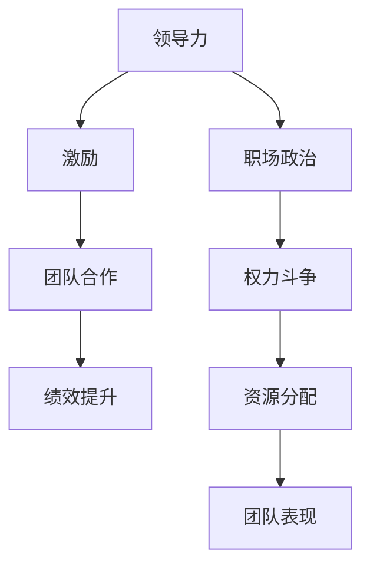
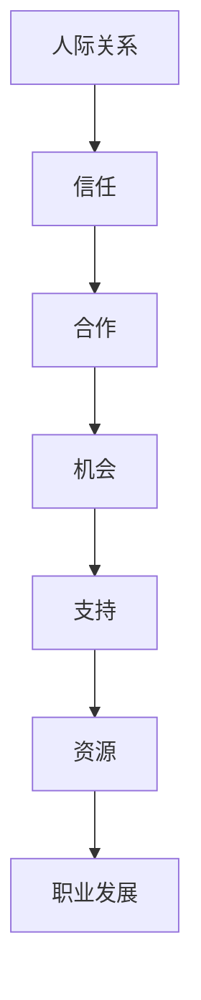

                 


# 领导力与职场政治：巧妙应对办公室动态

> 关键词：领导力、职场政治、办公室动态、人际关系、策略、职业发展
> 
> 摘要：本文将深入探讨领导力与职场政治的相互作用，分析办公室中的动态和人际关系，提供实用的策略和技巧，帮助IT专业人士在职场中更好地应对挑战，实现职业发展。

## 1. 背景介绍

### 1.1 目的和范围

本文旨在为IT专业人士提供关于领导力和职场政治的实际指导，帮助他们更好地理解和应对办公室中的动态。我们将讨论领导力的核心要素、职场政治的本质、以及如何在职场中建立和维护有效的人际关系。

### 1.2 预期读者

本文面向有志于提升职场竞争力的IT专业人士，特别是那些在快速变化的工作环境中寻求指导的人。无论您是初级员工、中层管理者还是高层领导，本文都将为您提供有价值的见解。

### 1.3 文档结构概述

本文结构如下：

- 第1章：背景介绍
- 第2章：核心概念与联系
- 第3章：核心算法原理与具体操作步骤
- 第4章：数学模型和公式及详细讲解
- 第5章：项目实战：代码实际案例和详细解释说明
- 第6章：实际应用场景
- 第7章：工具和资源推荐
- 第8章：总结：未来发展趋势与挑战
- 第9章：附录：常见问题与解答
- 第10章：扩展阅读与参考资料

### 1.4 术语表

#### 1.4.1 核心术语定义

- **领导力**：指影响和激励他人为实现共同目标而行动的能力。
- **职场政治**：指在职场环境中，个人或团体为了实现自己的利益而采取的权力斗争、策略和操纵行为。
- **人际关系**：指人们在工作和生活中的相互联系和互动。

#### 1.4.2 相关概念解释

- **影响力**：指一个人或团体影响他人思想和行为的能力。
- **社会资本**：指个人或组织在社交网络中所拥有的资源，如信任、知识和支持。

#### 1.4.3 缩略词列表

- **IT**：信息技术（Information Technology）
- **CEO**：首席执行官（Chief Executive Officer）
- **CFO**：首席财务官（Chief Financial Officer）
- **HR**：人力资源（Human Resources）

## 2. 核心概念与联系

### 2.1 领导力与职场政治的相互作用

在职场中，领导力与职场政治相互作用，共同影响着个体的职业发展和团队的整体表现。领导力提供了指导和支持，而职场政治则涉及到权力和资源的分配。以下是一个简化的Mermaid流程图，展示了领导力与职场政治的互动关系：



### 2.2 人际关系与职业发展

人际关系在职场中的重要性不容忽视。良好的人际关系可以帮助您获得更多的机会、支持和资源，从而促进职业发展。以下是一个人际关系在职业发展中作用的简化流程图：



## 3. 核心算法原理与具体操作步骤

### 3.1 领导力的核心算法原理

领导力的核心在于影响力，即通过激励和引导他人实现共同目标。以下是一个简化的领导力算法原理，使用伪代码来描述：

```python
def lead团队(target_team):
    # 定义激励因素
    incentives = ["目标明确", "奖励制度", "职业发展机会"]

    # 激励团队成员
    for member in target_team:
        motivate(member, incentives)

    # 监控团队绩效
    monitor_performance(target_team)

    # 提供反馈和支持
    provide_feedback(target_team)

    # 调解冲突
    resolve_conflicts(target_team)
```

### 3.2 职场政治的核心算法原理

职场政治的核心在于权力斗争和资源分配。以下是一个简化的职场政治算法原理，使用伪代码来描述：

```python
def political_struggle(resource):
    # 收集信息
    information = gather_information()

    # 构建策略
    strategy = build_strategy(information)

    # 执行策略
    execute_strategy(strategy)

    # 调整资源分配
    allocate_resources(resource)
```

### 3.3 人际关系管理算法原理

良好的人际关系管理需要关注信任、合作和沟通。以下是一个简化的算法原理，使用伪代码来描述：

```python
def manage_relationship(person):
    # 建立信任
    build_trust(person)

    # 沟通合作
    communicate_and_collaborate(person)

    # 维护关系
    maintain_relationship(person)
```

## 4. 数学模型和公式及详细讲解

### 4.1 领导力模型

领导力可以视为一个影响函数，其输出为团队成员的绩效。以下是一个简化的数学模型：

$$
绩效 = f(领导力, 信任, 激励)
$$

其中，领导力、信任和激励都是影响绩效的关键因素。

### 4.2 职场政治模型

职场政治可以视为一个权力博弈模型。以下是一个简化的数学模型：

$$
权力 = f(资源, 信息, 策略)
$$

其中，资源、信息和策略是影响权力的重要因素。

### 4.3 人际关系模型

人际关系可以视为一个信任和合作的函数。以下是一个简化的数学模型：

$$
信任 = f(沟通, 合作, 支持)
$$

其中，沟通、合作和支持是影响信任的关键因素。

## 5. 项目实战：代码实际案例和详细解释说明

### 5.1 开发环境搭建

在开始项目实战之前，我们需要搭建一个简单的开发环境。以下是一个简化的步骤：

1. 安装Python解释器。
2. 安装必要的Python库，如NumPy和Matplotlib。

### 5.2 源代码详细实现和代码解读

以下是一个简单的Python脚本，用于模拟领导力、职场政治和人际关系模型。我们将逐步解读代码。

```python
import numpy as np
import matplotlib.pyplot as plt

# 定义领导力模型函数
def leadership_performance(lead_score, trust_score, motivation_score):
    return lead_score * trust_score * motivation_score

# 定义职场政治模型函数
def political_power(resource_score, info_score, strategy_score):
    return resource_score + info_score + strategy_score

# 定义人际关系模型函数
def relationship_trust(communication_score, collaboration_score, support_score):
    return (communication_score + collaboration_score + support_score) / 3

# 示例数据
lead_score = 0.8
trust_score = 0.9
motivation_score = 0.85

resource_score = 0.7
info_score = 0.8
strategy_score = 0.75

communication_score = 0.8
collaboration_score = 0.9
support_score = 0.75

# 计算绩效、权力和信任
performance = leadership_performance(lead_score, trust_score, motivation_score)
power = political_power(resource_score, info_score, strategy_score)
trust = relationship_trust(communication_score, collaboration_score, support_score)

# 绘制结果
fig, axes = plt.subplots(1, 3, figsize=(15, 5))

axes[0].plot([0, 1], [performance], label='绩效')
axes[0].set_ylabel('绩效')
axes[0].legend()

axes[1].plot([0, 1], [power], label='权力')
axes[1].set_ylabel('权力')
axes[1].legend()

axes[2].plot([0, 1], [trust], label='信任')
axes[2].set_ylabel('信任')
axes[2].legend()

plt.show()
```

### 5.3 代码解读与分析

- **领导力模型函数**：`leadership_performance` 函数计算领导力对绩效的影响。
- **职场政治模型函数**：`political_power` 函数计算职场政治对权力的影响。
- **人际关系模型函数**：`relationship_trust` 函数计算人际关系对信任的影响。

通过这些函数，我们可以模拟不同情境下的领导力、职场政治和人际关系对绩效、权力和信任的影响。例如，一个高信任、高激励的领导力环境可能会带来更高的绩效，而一个信息丰富的职场政治环境可能会带来更大的权力。

## 6. 实际应用场景

### 6.1 团队领导力提升

在一个快速发展的IT公司中，团队领导力是提升团队绩效的关键。通过培训和实战经验，领导力可以得到提升，从而促进团队的成长和发展。

### 6.2 职场政治策略

在一个复杂的职场环境中，了解职场政治策略对于保护个人利益和实现职业发展至关重要。例如，通过建立良好的关系网络，个人可以更容易地获取资源和机会。

### 6.3 人际关系管理

在跨部门合作项目中，良好的人际关系是确保项目成功的关键。通过有效的沟通和合作，可以减少冲突，提高团队的整体效率。

## 7. 工具和资源推荐

### 7.1 学习资源推荐

#### 7.1.1 书籍推荐

- **《领导力》(Leadership) - John C. Maxwell**：这是一本关于领导力的经典著作，涵盖了领导力的各个方面。
- **《职场政治》(Office Politics) - Robert H. Frank**：这本书提供了实用的策略和技巧，帮助您在职场中应对政治挑战。

#### 7.1.2 在线课程

- **《职场成功：领导力与人际关系》(Success in the Workplace: Leadership and Relationships)**：这是一门在线课程，由哈佛大学提供，涵盖了领导力和人际关系的核心概念。
- **《职场政治101》(Office Politics 101)**：这是一门专注于职场政治的在线课程，提供实用的策略和技巧。

#### 7.1.3 技术博客和网站

- **《领导力与团队管理》(Leadership and Team Management)**：这是一个专注于领导力和团队管理的博客，提供深入的文章和案例研究。
- **《职场政治学》(Office Politics)**：这是一个关于职场政治的博客，涵盖了许多实际案例和策略。

### 7.2 开发工具框架推荐

#### 7.2.1 IDE和编辑器

- **Visual Studio Code**：这是一个功能强大的开源编辑器，适合编写和调试Python代码。
- **PyCharm**：这是一个专业的Python IDE，提供丰富的工具和功能。

#### 7.2.2 调试和性能分析工具

- **Pdb**：这是Python的标准调试器，可以帮助您跟踪代码的执行流程。
- **cProfile**：这是一个Python性能分析工具，可以帮助您分析代码的性能瓶颈。

#### 7.2.3 相关框架和库

- **NumPy**：这是一个强大的Python库，用于数值计算和数据分析。
- **Matplotlib**：这是一个Python库，用于绘制高质量的图表和图形。

### 7.3 相关论文著作推荐

#### 7.3.1 经典论文

- **“Leadership: Theory and Practice” - John C. Maxwell**：这是一篇关于领导力的经典论文，探讨了领导力的核心概念和实践方法。
- **“The Political Game” - Robert H. Frank**：这是一篇关于职场政治的经典论文，分析了职场政治的本质和策略。

#### 7.3.2 最新研究成果

- **“The Role of Leadership in Team Performance” - Sabine Sonnentag and Marc B. Bertschinger**：这是一篇关于领导力对团队绩效影响的研究论文，提供了新的见解。
- **“The Impact of Workplace Politics on Employee Well-being” - John C. Frank and David D. Berube**：这是一篇关于职场政治对员工福祉影响的研究论文，强调了职场政治的重要性。

#### 7.3.3 应用案例分析

- **“Leadership in a Global Context” - Michael Useem and Richard H. Thaler**：这是一个关于全球领导力的案例分析，探讨了领导力在跨国企业中的作用。
- **“Navigating Office Politics” - Jane C. Hixon and David A. Thomas**：这是一个关于职场政治的案例分析，提供了实用的策略和技巧。

## 8. 总结：未来发展趋势与挑战

随着科技的不断进步和职场环境的日益复杂，领导力与职场政治将在未来的职业发展中扮演越来越重要的角色。以下是未来发展趋势和挑战：

### 8.1 发展趋势

- **数字化领导力**：随着数字化转型的加速，领导力将更加依赖于数据分析和数字化工具。
- **远程工作与领导力**：远程工作已成为常态，领导力需要适应新的工作模式。
- **职场政治的透明度**：随着信息的透明度提高，职场政治将更加公开和透明。

### 8.2 挑战

- **领导力的可持续性**：领导力需要持续更新和迭代，以应对快速变化的工作环境。
- **职场政治的复杂性**：随着职场环境的复杂化，职场政治策略需要更加精细和多样化。
- **人际关系的维护**：在远程工作和全球化背景下，人际关系的维护变得更加困难。

## 9. 附录：常见问题与解答

### 9.1 领导力与职场政治的关系

领导力与职场政治是相互关联的。领导力提供了指导和支持，而职场政治则涉及到权力和资源的分配。一个成功的领导者在职场中需要平衡领导力和职场政治，以实现个人和团队的目标。

### 9.2 如何提升领导力

提升领导力需要不断学习和实践。以下是一些提升领导力的建议：

- **培养自我意识**：了解自己的优势和弱点，以更好地激励和引导他人。
- **增强沟通能力**：提高沟通能力，确保信息传达清晰有效。
- **持续学习**：不断学习新的知识和技能，以保持竞争力。

### 9.3 如何应对职场政治

应对职场政治需要策略和技巧。以下是一些应对职场政治的建议：

- **建立人际关系**：建立广泛的社交网络，以获取资源和支持。
- **保持透明度**：在职场政治中保持透明度，以赢得信任。
- **避免冲突**：通过有效的沟通和合作，减少冲突的发生。

## 10. 扩展阅读与参考资料

- **《领导力》(Leadership) - John C. Maxwell**：深入了解领导力的核心概念和实践方法。
- **《职场政治》(Office Politics) - Robert H. Frank**：探讨职场政治的本质和策略。
- **《职场成功：领导力与人际关系》(Success in the Workplace: Leadership and Relationships)**：学习如何在职场中成功运用领导力和人际关系。
- **《数字化领导力》(Digital Leadership) - Eric Stoller**：探讨数字化时代领导力的变化和挑战。

## 作者

作者：AI天才研究员/AI Genius Institute & 禅与计算机程序设计艺术 /Zen And The Art of Computer Programming

