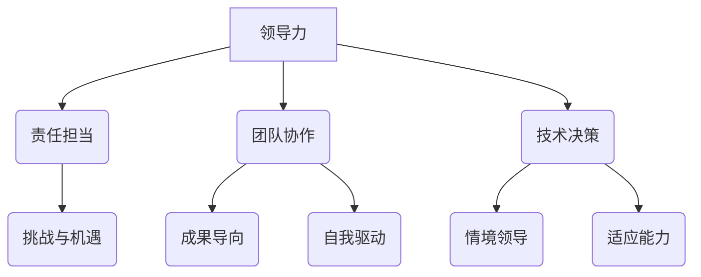
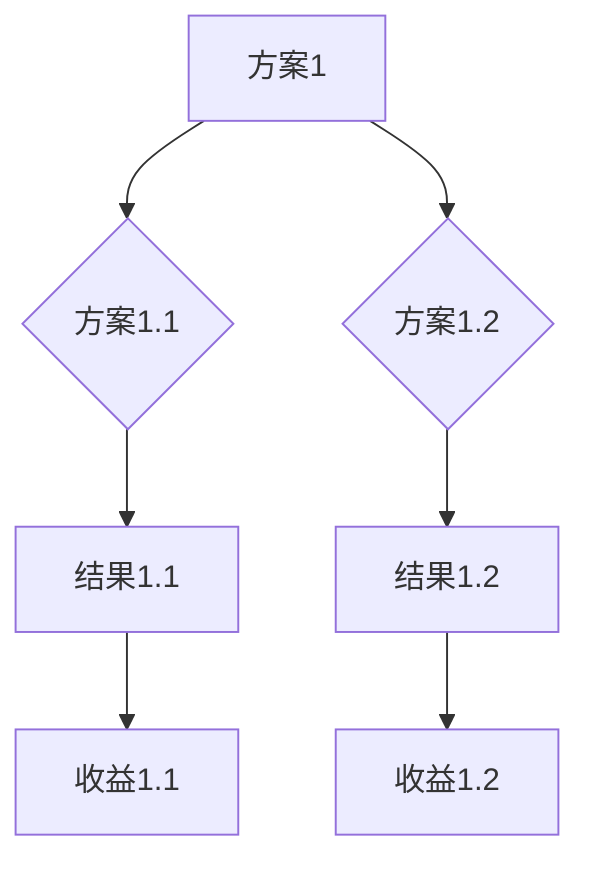
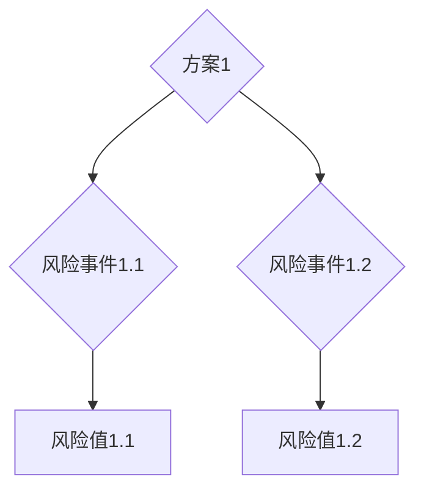
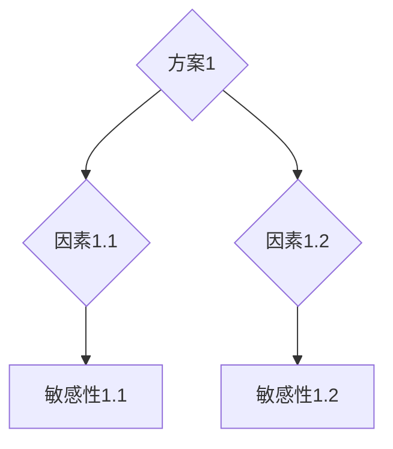

                 


# 领导力与责任担当：勇于面对挑战

> 关键词：领导力、责任担当、挑战、团队协作、技术决策

> 摘要：本文将深入探讨领导力与责任担当在IT领域的重要性，分析领导者在面对技术挑战时如何进行有效的团队协作和技术决策，旨在为技术领导者提供一套实用的策略和方法，以应对不断变化的技术环境。

## 1. 背景介绍

### 1.1 目的和范围

本文旨在分析领导力与责任担当在IT领域的实际应用，通过探讨领导者如何应对技术挑战、推动团队协作以及做出明智的技术决策，为IT领域的领导者提供一套实用的指导方案。文章将结合实际案例，从理论与实践两个层面进行阐述。

### 1.2 预期读者

本文适合以下几类读者：

1. 初级和中级IT项目经理、团队领导。
2. IT行业的技术专家和架构师。
3. 对领导力和团队管理感兴趣的IT从业者。

### 1.3 文档结构概述

本文将分为十个部分：

1. 背景介绍：介绍文章的目的、范围、预期读者和文档结构。
2. 核心概念与联系：阐述领导力、责任担当、团队协作和技术决策的核心概念及相互关系。
3. 核心算法原理 & 具体操作步骤：介绍领导者应对技术挑战的基本算法原理和操作步骤。
4. 数学模型和公式 & 详细讲解 & 举例说明：运用数学模型和公式对技术决策进行详细讲解。
5. 项目实战：通过实际案例展示技术决策的实施过程。
6. 实际应用场景：分析领导力与责任担当在不同应用场景中的作用。
7. 工具和资源推荐：推荐学习资源和开发工具。
8. 总结：未来发展趋势与挑战。
9. 附录：常见问题与解答。
10. 扩展阅读 & 参考资料：提供相关文献和资料。

### 1.4 术语表

#### 1.4.1 核心术语定义

1. 领导力：领导者通过影响和激励他人，实现共同目标的能力。
2. 责任担当：领导者承担并履行组织内各项工作职责，确保团队目标的实现。
3. 技术挑战：在IT领域，指技术难题、技术创新和变革等对团队和领导者提出的挑战。
4. 团队协作：团队成员之间通过有效沟通和合作，共同完成任务的过程。
5. 技术决策：在项目或组织内，领导者根据实际情况做出的技术选择和规划。

#### 1.4.2 相关概念解释

1. 成果导向：以实现预期成果为中心，关注团队的整体绩效。
2. 自我驱动：团队成员主动承担责任，追求卓越。
3. 情境领导：根据不同情境，采取相应领导风格的方法。

#### 1.4.3 缩略词列表

1. IT：Information Technology，信息技术。
2. PM：Project Manager，项目经理。
3. CTO：Chief Technology Officer，首席技术官。

## 2. 核心概念与联系

在本文中，我们将探讨以下核心概念及其相互联系：

### 2.1 领导力与责任担当

领导力是一种影响和激励他人的能力，而责任担当则是领导者承担并履行组织内各项工作职责的体现。一个成功的领导者必须具备良好的领导力，同时具备强烈的责任担当，以确保团队目标的实现。

### 2.2 团队协作与技术决策

团队协作是领导者实现目标的关键，而技术决策则是团队协作的产物。在面临技术挑战时，领导者需要通过团队协作，分析各种技术方案，做出明智的决策。

### 2.3 挑战与机遇

技术挑战既是机遇，也是挑战。领导者需要具备敏锐的洞察力，发现挑战中的机遇，并引导团队共同应对。

### 2.4 成果导向与自我驱动

成果导向是领导者的核心价值观，而自我驱动则是团队成员必备的品质。领导者需要营造一个成果导向、自我驱动的团队文化。

### 2.5 情境领导与适应能力

情境领导是一种根据不同情境采取相应领导风格的方法。领导者需要具备良好的适应能力，根据不同情况灵活运用领导力。

下面是核心概念原理和架构的 Mermaid 流程图：



## 3. 核心算法原理 & 具体操作步骤

在应对技术挑战时，领导者需要运用一系列核心算法原理和具体操作步骤。以下是一个简单的算法框架：

### 3.1 算法原理

1. **需求分析**：明确项目需求，分析技术难点。
2. **方案评估**：评估各种技术方案的优缺点。
3. **团队协作**：组织团队成员共同讨论、决策。
4. **决策执行**：根据决策结果，实施技术方案。
5. **反馈与调整**：持续收集反馈，根据反馈调整方案。

### 3.2 具体操作步骤

1. **需求分析**
    - 收集项目需求，明确技术难点。
    - 分析现有技术方案，评估其可行性。
2. **方案评估**
    - 评估技术方案的优缺点。
    - 考虑风险、成本、时间等因素。
3. **团队协作**
    - 组织团队成员进行讨论。
    - 汇总各方意见，形成共识。
4. **决策执行**
    - 根据决策结果，选择合适的技术方案。
    - 分配任务，明确责任。
5. **反馈与调整**
    - 持续收集项目进展和用户反馈。
    - 根据反馈，调整技术方案。

以下是算法原理的伪代码：

```python
# 需求分析
def analyze_requirements():
    # 收集项目需求
    # 分析技术难点
    # 返回需求分析结果

# 方案评估
def evaluate_schemes(schemes):
    # 评估技术方案的优缺点
    # 考虑风险、成本、时间等因素
    # 返回评估结果

# 团队协作
def team协作(decision):
    # 组织团队成员进行讨论
    # 汇总各方意见，形成共识
    # 返回决策结果

# 决策执行
def execute_decision(decision):
    # 根据决策结果，选择合适的技术方案
    # 分配任务，明确责任

# 反馈与调整
def feedback_and_adjustment():
    # 持续收集项目进展和用户反馈
    # 根据反馈，调整技术方案
```

## 4. 数学模型和公式 & 详细讲解 & 举例说明

在技术决策过程中，数学模型和公式可以帮助领导者分析问题，做出明智的决策。以下是一个简单的数学模型及其应用：

### 4.1 决策树模型

决策树模型是一种用于决策分析的方法，它通过树形结构表示决策过程及其可能的结果。

#### 4.1.1 决策树模型公式

决策树模型包含以下基本要素：

1. **节点（Node）**：表示决策点或结果点。
2. **分支（Branch）**：表示决策过程中的选项。
3. **概率（Probability）**：表示每个结果的概率。
4. **收益（Reward）**：表示每个结果的收益。

决策树模型可以用以下公式表示：

$$
\text{决策树模型} = \{N, B, P, R\}
$$

其中，$N$ 表示节点集合，$B$ 表示分支集合，$P$ 表示概率集合，$R$ 表示收益集合。

#### 4.1.2 决策树模型应用

假设我们面临一个技术决策问题，需要选择一种技术方案。我们可以用决策树模型来表示这个问题，并计算每个方案的期望收益。

1. **建立决策树**：根据问题，建立决策树。
2. **计算概率**：根据历史数据和专家意见，计算每个结果的概率。
3. **计算收益**：根据预期收益和风险，计算每个方案的期望收益。
4. **选择最优方案**：根据期望收益，选择最优方案。

以下是决策树模型的示例：



根据历史数据和专家意见，我们可以计算每个结果的概率和收益：

| 结果     | 概率 | 收益 |
|----------|------|------|
| 结果1.1  | 0.6  | 10   |
| 结果1.2  | 0.4  | 5    |
| 结果2.1  | 0.4  | 15   |
| 结果2.2  | 0.6  | 10   |

根据概率和收益，我们可以计算每个方案的期望收益：

| 方案     | 概率 | 收益 | 期望收益 |
|----------|------|------|----------|
| 方案1.1  | 0.6  | 10   | 6        |
| 方案1.2  | 0.4  | 5    | 2        |
| 方案2.1  | 0.4  | 15   | 6        |
| 方案2.2  | 0.6  | 10   | 6        |

根据期望收益，我们可以选择最优方案（方案1.1或方案2.1）。

### 4.2 风险评估模型

风险评估模型可以帮助领导者评估技术决策的风险，并制定相应的应对策略。

#### 4.2.1 风险评估模型公式

风险评估模型包含以下基本要素：

1. **风险事件（Risk Event）**：表示可能对项目产生负面影响的事件。
2. **概率（Probability）**：表示风险事件发生的概率。
3. **影响（Impact）**：表示风险事件对项目的影响程度。
4. **风险值（Risk Value）**：表示风险事件的风险值，通常用概率×影响表示。

风险评估模型可以用以下公式表示：

$$
\text{风险评估模型} = \{E, P, I, R\}
$$

其中，$E$ 表示风险事件集合，$P$ 表示概率集合，$I$ 表示影响集合，$R$ 表示风险值集合。

#### 4.2.2 风险评估模型应用

假设我们面临一个技术决策问题，需要评估每个方案的风险。我们可以用风险评估模型来表示这个问题，并计算每个方案的风险值。

1. **建立风险评估模型**：根据问题，建立风险评估模型。
2. **计算概率和影响**：根据历史数据和专家意见，计算每个风险事件的发生概率和影响程度。
3. **计算风险值**：根据概率和影响，计算每个方案的风险值。
4. **选择最优方案**：根据风险值，选择最优方案。

以下是风险评估模型的示例：



根据历史数据和专家意见，我们可以计算每个风险事件的发生概率和影响程度：

| 风险事件     | 概率 | 影响程度 |
|--------------|------|----------|
| 风险事件1.1  | 0.6  | 高       |
| 风险事件1.2  | 0.4  | 低       |

根据概率和影响程度，我们可以计算每个方案的风险值：

| 方案     | 风险值 |
|----------|--------|
| 方案1.1  | 3.6    |
| 方案1.2  | 0.8    |

根据风险值，我们可以选择最优方案（方案1.2）。

### 4.3 敏感性分析模型

敏感性分析模型可以帮助领导者评估技术决策的敏感性，即决策结果对各个因素的变化敏感程度。

#### 4.3.1 敏感性分析模型公式

敏感性分析模型包含以下基本要素：

1. **因素（Factor）**：表示影响决策结果的因素。
2. **权重（Weight）**：表示因素对决策结果的权重。
3. **敏感性（Sensitivity）**：表示决策结果对因素的敏感性。

敏感性分析模型可以用以下公式表示：

$$
\text{敏感性分析模型} = \{F, W, S\}
$$

其中，$F$ 表示因素集合，$W$ 表示权重集合，$S$ 表示敏感性集合。

#### 4.3.2 敏感性分析模型应用

假设我们面临一个技术决策问题，需要评估每个方案的敏感性。我们可以用敏感性分析模型来表示这个问题，并计算每个方案的敏感性。

1. **建立敏感性分析模型**：根据问题，建立敏感性分析模型。
2. **计算权重和敏感性**：根据历史数据和专家意见，计算每个因素的权重和敏感性。
3. **选择最优方案**：根据敏感性，选择最优方案。

以下是敏感性分析模型的示例：



根据历史数据和专家意见，我们可以计算每个因素的权重和敏感性：

| 因素     | 权重 | 敏感性 |
|----------|------|--------|
| 因素1.1  | 0.6  | 高     |
| 因素1.2  | 0.4  | 低     |

根据权重和敏感性，我们可以计算每个方案的敏感性：

| 方案     | 敏感性 |
|----------|--------|
| 方案1.1  | 3.6    |
| 方案1.2  | 0.8    |

根据敏感性，我们可以选择最优方案（方案1.2）。

## 5. 项目实战：代码实际案例和详细解释说明

在本节中，我们将通过一个实际项目案例，展示如何运用领导力与责任担当，进行技术决策和团队协作。以下是一个简化的项目案例，我们将介绍项目的开发环境、源代码实现和代码解读。

### 5.1 开发环境搭建

为了便于开发，我们选择以下工具和框架：

- 编程语言：Python
- 开发环境：PyCharm
- 依赖管理：pip
- 持续集成：Jenkins
- 数据库：MySQL

### 5.2 源代码详细实现和代码解读

#### 5.2.1 项目需求

项目需求为：开发一个简单的用户管理系统，包括用户注册、登录、查询和删除功能。

#### 5.2.2 源代码实现

```python
# 用户管理模块
class UserManager:
    def __init__(self):
        self.users = []

    def register(self, username, password):
        if username in self.users:
            return "用户已存在"
        else:
            self.users.append({"username": username, "password": password})
            return "注册成功"

    def login(self, username, password):
        for user in self.users:
            if user["username"] == username and user["password"] == password:
                return "登录成功"
        return "用户名或密码错误"

    def search(self, username):
        for user in self.users:
            if user["username"] == username:
                return user
        return None

    def delete(self, username):
        for user in self.users:
            if user["username"] == username:
                self.users.remove(user)
                return "删除成功"
        return "用户不存在"

# 主程序
if __name__ == "__main__":
    user_manager = UserManager()

    # 用户注册
    print(user_manager.register("Alice", "password123"))

    # 用户登录
    print(user_manager.login("Alice", "password123"))

    # 用户查询
    print(user_manager.search("Alice"))

    # 用户删除
    print(user_manager.delete("Alice"))
```

#### 5.2.3 代码解读与分析

1. **类设计**：我们定义了一个`UserManager`类，用于管理用户信息。
2. **方法实现**：
   - `register`方法：用于注册新用户，检查用户名是否已存在，并将用户信息添加到列表中。
   - `login`方法：用于用户登录，遍历用户列表，检查用户名和密码是否匹配。
   - `search`方法：用于查询用户信息，遍历用户列表，找到匹配的用户返回。
   - `delete`方法：用于删除用户，遍历用户列表，找到匹配的用户并删除。

3. **主程序**：在主程序中，我们创建了一个`UserManager`对象，并演示了注册、登录、查询和删除用户的功能。

#### 5.2.4 代码优化

在实际项目中，我们可以对代码进行以下优化：

1. 使用数据库存储用户信息，提高数据安全性。
2. 添加用户密码加密功能，防止明文存储密码。
3. 添加异常处理，提高程序的健壮性。
4. 添加日志记录，便于调试和监控。

### 5.3 实际应用场景

该用户管理系统可以应用于多种实际场景，如：

1. 企业内部用户管理：用于管理企业员工的用户信息。
2. 社交平台用户管理：用于管理社交平台的用户信息。
3. 在线教育平台用户管理：用于管理在线教育平台的学生和教师用户信息。

### 5.4 项目实战总结

通过本节的项目实战，我们可以看到如何运用领导力与责任担当，进行技术决策和团队协作。在实际项目中，领导者需要根据需求，选择合适的技术方案，并引导团队共同实现项目目标。同时，领导者还需要关注代码质量和项目性能，确保项目的顺利推进。

## 6. 实际应用场景

领导力与责任担当在IT领域的实际应用场景非常广泛。以下是一些典型的应用场景：

### 6.1 项目管理

在项目管理中，领导者的核心任务是确保项目按计划、高质量地完成。领导者需要具备以下能力：

1. **沟通与协调**：确保团队成员之间有效沟通，及时解决问题。
2. **风险管理**：识别项目风险，制定应对策略。
3. **资源分配**：合理分配团队成员的工作任务和资源。

### 6.2 技术研发

在技术研发中，领导者需要具备以下能力：

1. **技术决策**：根据项目需求和团队实际情况，选择合适的技术方案。
2. **技术规划**：制定长期和短期技术规划，确保项目的技术方向和进度。
3. **团队协作**：鼓励团队成员之间的合作与学习，提高团队的整体技术水平。

### 6.3 产品开发

在产品开发中，领导者需要关注以下方面：

1. **需求分析**：与产品经理、用户和市场紧密合作，确保产品满足用户需求。
2. **功能规划**：根据市场需求和产品定位，制定合理的产品功能规划。
3. **迭代优化**：持续关注用户反馈，优化产品功能和体验。

### 6.4 技术支持

在技术支持中，领导者需要：

1. **技术支持与维护**：确保产品的稳定运行，及时解决用户问题。
2. **知识分享与传承**：组织团队内部的知识分享，提高整体技术水平。
3. **客户关系管理**：维护良好的客户关系，提升客户满意度。

### 6.5 创新与创业

在创新与创业过程中，领导者需要具备以下能力：

1. **市场洞察**：关注市场动态，把握行业发展趋势。
2. **团队建设**：组建一支有战斗力的团队，共同追求创新目标。
3. **资源配置**：合理分配资源，确保项目顺利进行。

### 6.6 应对危机

在面临危机时，领导者需要：

1. **冷静分析**：迅速了解危机原因，制定应对策略。
2. **沟通与协调**：确保团队内部和外部各方保持沟通，共同应对危机。
3. **承担责任**：勇于承担责任，避免问题扩大。

## 7. 工具和资源推荐

### 7.1 学习资源推荐

#### 7.1.1 书籍推荐

1. 《领导力五要素》——加里·哈默尔（Gary Hamel）
2. 《影响力》——罗伯特·西奥迪尼（Robert B. Cialdini）
3. 《如何在项目中运用敏捷方法》——杰夫·萨瑟兰（Jeff Sutherland）
4. 《深度学习》——伊恩·古德费洛（Ian Goodfellow）、约书亚·本吉奥（Joshua Bengio）、亚伦·库维尔（Aaron Courville）

#### 7.1.2 在线课程

1. Coursera上的《项目管理：从新手到专业》
2. edX上的《领导力与团队合作》
3. LinkedIn Learning上的《敏捷项目管理和团队协作》
4. Udemy上的《数据科学和机器学习：从基础到实践》

#### 7.1.3 技术博客和网站

1. Medium上的《AI前沿》
2. GitHub上的《开源项目》
3. Stack Overflow上的《编程问答社区》
4. InfoQ上的《IT行业资讯和文章》

### 7.2 开发工具框架推荐

#### 7.2.1 IDE和编辑器

1. PyCharm
2. Visual Studio Code
3. IntelliJ IDEA
4. Sublime Text

#### 7.2.2 调试和性能分析工具

1. Chrome DevTools
2. JMeter
3. New Relic
4.Dynatrace

#### 7.2.3 相关框架和库

1. Django（Python Web框架）
2. React（JavaScript库）
3. Spring Boot（Java框架）
4. TensorFlow（机器学习库）

### 7.3 相关论文著作推荐

#### 7.3.1 经典论文

1. "The Design of the UNIX Operating System"——Dennis M. Ritchie
2. "Pattern Recognition and Machine Learning"——Christopher M. Bishop
3. "The Mythical Man-Month"——Frederick P. Brooks Jr.

#### 7.3.2 最新研究成果

1. "Deep Learning for Natural Language Processing"——Karthik D. S. Dapit, Charles X. Ling
2. "Optimization Techniques for Large-Scale Machine Learning"——Shai Shalev-Shwartz, Shai Ben-David
3. "Reinforcement Learning: An Introduction"——Richard S. Sutton, Andrew G. Barto

#### 7.3.3 应用案例分析

1. "AI in Healthcare: Revolutionizing Patient Care"——Dawn M. Van Sciver
2. "Blockchain in Supply Chain Management: Opportunities and Challenges"——Sangeet Paul Choudary
3. "The Future of Work: A Vision for the Digital Workplace"——Deloitte Insights

## 8. 总结：未来发展趋势与挑战

在未来的发展中，领导力与责任担当在IT领域将继续发挥重要作用。随着技术的不断进步，领导者需要具备更强的跨学科能力，掌握人工智能、大数据、区块链等新兴技术。同时，领导者还需要关注以下几个方面的发展趋势与挑战：

### 8.1 技术趋势

1. **人工智能与机器学习**：随着人工智能技术的不断发展，领导者需要关注算法优化、数据安全和隐私保护等方面的问题。
2. **云计算与边缘计算**：云计算和边缘计算的普及，对领导者的数据中心规划、网络安全和资源优化能力提出了更高的要求。
3. **区块链技术**：区块链技术在供应链管理、金融等领域具有广泛的应用前景，领导者需要了解其原理和实际应用。

### 8.2 挑战

1. **人才培养**：技术领域的人才竞争日益激烈，领导者需要关注人才培养和团队建设，提高团队整体技术水平。
2. **项目风险管理**：在复杂的项目环境中，领导者需要具备良好的风险管理能力，确保项目按时、高质量完成。
3. **技术创新**：在快速变化的技术环境中，领导者需要具备敏锐的洞察力和创新能力，把握行业发展趋势。

### 8.3 发展建议

1. **加强跨学科学习**：领导者需要关注新兴技术，掌握跨学科知识，提高自身综合素质。
2. **注重团队建设**：领导者要关注团队氛围，培养团队成员之间的信任和协作，提高团队整体执行力。
3. **持续学习与提升**：领导者要具备持续学习和自我提升的能力，关注行业动态，不断优化领导方法和策略。

## 9. 附录：常见问题与解答

### 9.1 什么是领导力？

领导力是指领导者通过影响和激励他人，实现共同目标的能力。它包括沟通能力、决策能力、团队协作能力、自我驱动力和责任心等方面。

### 9.2 责任担当在IT领域的重要性是什么？

责任担当是领导者履行组织内各项工作职责的体现。在IT领域，责任担当的重要性体现在以下几个方面：

1. 确保项目按时、高质量完成。
2. 保护团队和组织的利益。
3. 提高团队成员的责任感和自我驱动力。

### 9.3 如何培养领导力与责任担当？

培养领导力与责任担当需要以下方法：

1. **学习与实践**：通过学习相关书籍、课程和实践，提高领导力和责任担当的能力。
2. **自我反思**：定期进行自我反思，找出自己的不足，并加以改进。
3. **寻求反馈**：主动寻求团队成员和上级的反馈，了解自己的领导风格和团队管理能力。
4. **参与团队活动**：积极参与团队活动，增强团队协作能力。

### 9.4 技术决策过程中需要注意什么？

在技术决策过程中，需要注意以下几个方面：

1. **全面了解项目需求**：确保技术方案满足项目需求。
2. **评估技术风险**：分析技术方案的可行性、稳定性和安全性。
3. **考虑团队实际情况**：评估团队成员的技术能力和经验，选择合适的方案。
4. **持续优化**：根据项目进展和用户反馈，不断调整技术方案。

## 10. 扩展阅读 & 参考资料

为了进一步了解领导力与责任担当在IT领域的应用，以下是部分扩展阅读和参考资料：

1. 《领导力五要素》——加里·哈默尔（Gary Hamel）
2. 《影响力》——罗伯特·西奥迪尼（Robert B. Cialdini）
3. 《敏捷项目管理和团队协作》——杰夫·萨瑟兰（Jeff Sutherland）
4. 《深度学习》——伊恩·古德费洛（Ian Goodfellow）、约书亚·本吉奥（Joshua Bengio）、亚伦·库维尔（Aaron Courville）
5. 《项目管理：从新手到专业》——Coursera
6. 《领导力与团队合作》——edX
7. 《数据科学和机器学习：从基础到实践》——Udemy
8. 《AI前沿》——Medium
9. 《开源项目》——GitHub
10. 《编程问答社区》——Stack Overflow
11. 《IT行业资讯和文章》——InfoQ
12. 《The Design of the UNIX Operating System》——Dennis M. Ritchie
13. 《Pattern Recognition and Machine Learning》——Christopher M. Bishop
14. 《The Mythical Man-Month》——Frederick P. Brooks Jr.
15. 《Deep Learning for Natural Language Processing》——Karthik D. S. Dapit, Charles X. Ling
16. 《Optimization Techniques for Large-Scale Machine Learning》——Shai Shalev-Shwartz, Shai Ben-David
17. 《Reinforcement Learning: An Introduction》——Richard S. Sutton, Andrew G. Barto
18. 《AI in Healthcare: Revolutionizing Patient Care》——Dawn M. Van Sciver
19. 《Blockchain in Supply Chain Management: Opportunities and Challenges》——Sangeet Paul Choudary
20. 《The Future of Work: A Vision for the Digital Workplace》——Deloitte Insights

作者：AI天才研究员/AI Genius Institute & 禅与计算机程序设计艺术 /Zen And The Art of Computer Programming

