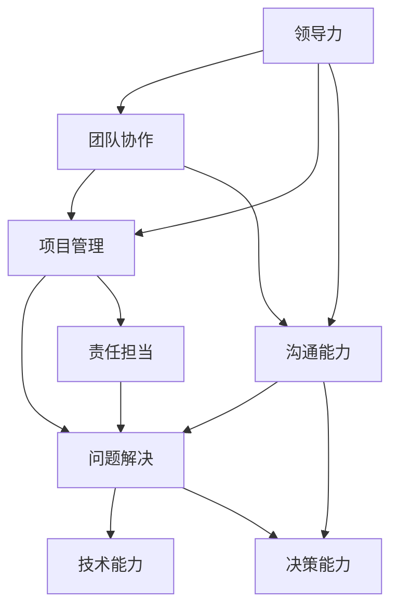

                 

# 领导力与责任担当：培养勇于承担责任的品质

> **关键词：**领导力、责任、担当、品质、人才培养
> 
> **摘要：**本文旨在探讨领导力与责任担当的重要性，以及如何在IT领域中培养这些品质。通过分析核心概念和理论，结合实际项目案例，本文将提供一系列具体的操作步骤和方法，帮助读者提升自己的领导力和责任感，从而在职业发展中取得更大的成就。

## 1. 背景介绍

### 1.1 目的和范围

本文的主要目的是帮助IT从业者理解和培养领导力和责任担当，这两个品质对于职业发展至关重要。我们将探讨以下主题：

- 领导力的定义和重要性
- 责任担当的概念及其在IT领域的体现
- 培养领导力和责任担当的方法和策略
- 实际项目中的应用和实践

### 1.2 预期读者

本文适合以下读者群体：

- 有志于提升领导力和责任担当的IT从业者
- 管理层和项目经理
- 新入职的IT员工
- IT教育工作者和研究学者

### 1.3 文档结构概述

本文结构如下：

- 1. 背景介绍
- 2. 核心概念与联系
- 3. 核心算法原理 & 具体操作步骤
- 4. 数学模型和公式 & 详细讲解 & 举例说明
- 5. 项目实战：代码实际案例和详细解释说明
- 6. 实际应用场景
- 7. 工具和资源推荐
- 8. 总结：未来发展趋势与挑战
- 9. 附录：常见问题与解答
- 10. 扩展阅读 & 参考资料

### 1.4 术语表

#### 1.4.1 核心术语定义

- **领导力**：指影响和引导他人实现共同目标的能力。
- **责任担当**：指在面对困难和挑战时，勇于承担责任并采取行动的态度和能力。
- **IT领域**：指信息技术行业，涉及软件开发、数据分析、网络安全等多个方面。

#### 1.4.2 相关概念解释

- **项目管理**：指规划、执行、监控和收尾项目的过程。
- **团队协作**：指团队成员之间的合作和沟通，以实现共同的目标。
- **技术能力**：指在特定技术领域的专业知识和技能。

#### 1.4.3 缩略词列表

- **IT**：信息技术
- **PM**：项目经理
- **ML**：机器学习

## 2. 核心概念与联系

在本节中，我们将介绍与领导力、责任担当和IT领域相关的核心概念，并通过Mermaid流程图展示它们之间的关系。



### 2.1 领导力

领导力是一种影响和引导他人实现共同目标的能力。在IT领域，领导力体现在以下几个方面：

- **项目规划**：项目经理需要制定详细的项目计划，确保项目按时、按质、按量完成。
- **团队协作**：领导力有助于促进团队成员之间的沟通和合作，提高团队的整体效能。
- **决策能力**：领导者在面对复杂问题时，需要做出明智的决策，以实现项目目标。

### 2.2 责任担当

责任担当是指在面临困难和挑战时，勇于承担责任并采取行动的态度和能力。在IT领域，责任担当体现在以下几个方面：

- **问题解决**：在项目过程中遇到问题时，领导者需要勇于承担责任，寻找解决方案。
- **团队协作**：领导者要承担起协调团队成员工作的责任，确保项目顺利进行。
- **决策能力**：在面对关键时刻，领导者需要做出负责任的决策，以推动项目向前发展。

### 2.3 IT领域

IT领域涵盖了软件开发、数据分析、网络安全等多个方面。在IT领域中，领导力和责任担当的重要性体现在以下几个方面：

- **技术能力**：领导者需要具备扎实的专业技术背景，以便在项目中做出正确的决策。
- **项目管理**：领导者需要掌握项目管理的基本知识和技能，确保项目顺利进行。
- **团队协作**：领导者需要促进团队成员之间的沟通和合作，提高团队的整体效能。

## 3. 核心算法原理 & 具体操作步骤

在本节中，我们将讨论如何培养领导力和责任担当的核心算法原理，并给出具体操作步骤。

### 3.1 领导力的培养

**算法原理：**

领导力的培养可以通过以下步骤实现：

1. 自我认知：了解自己的优点和不足，明确个人发展目标。
2. 沟通能力：提高沟通技巧，学会有效表达和倾听。
3. 团队协作：培养团队合作精神，学会协调和领导团队成员。
4. 决策能力：通过案例分析，提高决策能力。

**具体操作步骤：**

1. **自我认知：**
   - **反思**：定期进行自我反思，了解自己的优势和不足。
   - **目标设定**：明确个人职业发展目标，制定具体的行动计划。

2. **沟通能力：**
   - **练习**：多参加公共演讲和辩论，提高口头表达能力。
   - **倾听**：学会倾听他人的意见和需求，培养同理心。

3. **团队协作：**
   - **参与**：积极参与团队活动，了解团队成员的需求和期望。
   - **协调**：学会协调团队成员的工作，提高团队整体效能。

4. **决策能力：**
   - **分析**：通过数据分析，提高决策的科学性和准确性。
   - **实践**：在项目中积累经验，不断提高决策能力。

### 3.2 责任担当的培养

**算法原理：**

责任担当的培养可以通过以下步骤实现：

1. 问题意识：培养问题意识，关注项目中的潜在问题和风险。
2. 解决能力：提高解决能力，学会在项目中应对各种挑战。
3. 决策能力：提高决策能力，学会在关键时刻做出负责任的决策。
4. 沟通能力：提高沟通能力，确保团队成员之间的信息畅通。

**具体操作步骤：**

1. **问题意识：**
   - **观察**：密切关注项目进展，发现潜在问题和风险。
   - **记录**：记录问题和风险，进行分析和总结。

2. **解决能力：**
   - **学习**：通过学习相关知识，提高解决能力。
   - **实践**：在实际项目中，不断锻炼解决问题的能力。

3. **决策能力：**
   - **分析**：在决策前，充分分析各种可能的结果和影响。
   - **选择**：根据分析结果，做出负责任的决策。

4. **沟通能力：**
   - **表达**：学会清晰、准确地表达自己的观点和需求。
   - **倾听**：学会倾听他人的意见和需求，确保沟通畅通。

## 4. 数学模型和公式 & 详细讲解 & 举例说明

在本节中，我们将讨论如何使用数学模型和公式来培养领导力和责任担当，并给出具体的详细讲解和举例说明。

### 4.1 领导力的数学模型

领导力的培养可以采用以下数学模型：

$$
L = f(A, C, D, E)
$$

其中：

- \(L\) 表示领导力
- \(A\) 表示自我认知
- \(C\) 表示沟通能力
- \(D\) 表示团队协作
- \(E\) 表示决策能力

**详细讲解：**

1. **自我认知（\(A\)）：** 自我认知是领导力培养的基础。一个优秀的领导者需要了解自己的优点和不足，从而在自我提升的过程中有针对性地发展。

2. **沟通能力（\(C\)）：** 沟通能力是领导者必须具备的重要能力。有效的沟通可以帮助领导者传达信息、协调团队、建立信任。

3. **团队协作（\(D\)）：** 团队协作是领导者影响和引导他人实现共同目标的重要途径。一个优秀的领导者需要学会协调团队成员的工作，提高团队的整体效能。

4. **决策能力（\(E\)）：** 决策能力是领导者面对复杂问题时，能够做出明智决策的能力。一个优秀的领导者需要具备快速分析和决策的能力。

**举例说明：**

假设一个项目经理（\(PM\)）在项目启动阶段，需要评估团队成员的技术能力和沟通能力，以确定团队的最佳组合。可以使用以下公式：

$$
L_{PM} = f(A_{PM}, C_{PM}, D_{PM}, E_{PM})
$$

其中：

- \(L_{PM}\) 表示项目经理的领导力
- \(A_{PM}\) 表示项目经理的自我认知
- \(C_{PM}\) 表示项目经理的沟通能力
- \(D_{PM}\) 表示项目经理的团队协作能力
- \(E_{PM}\) 表示项目经理的决策能力

通过评估每个团队成员的 \(A, C, D, E\) 值，项目经理可以确定团队的最佳组合，从而提高项目的领导力。

### 4.2 责任担当的数学模型

责任担当的培养可以采用以下数学模型：

$$
R = f(P, S, D, C)
$$

其中：

- \(R\) 表示责任担当
- \(P\) 表示问题意识
- \(S\) 表示解决能力
- \(D\) 表示决策能力
- \(C\) 表示沟通能力

**详细讲解：**

1. **问题意识（\(P\)）：** 问题意识是责任担当的基础。一个有责任担当的领导者需要具备敏锐的问题意识，能够及时发现和解决项目中的问题。

2. **解决能力（\(S\)）：** 解决能力是责任担当的重要体现。一个有责任担当的领导者需要在面对问题时，能够迅速找到解决方案，并付诸实践。

3. **决策能力（\(D\)）：** 决策能力是责任担当的关键。一个有责任担当的领导者需要在关键时刻，能够做出正确的决策，以推动项目向前发展。

4. **沟通能力（\(C\)）：** 沟通能力是责任担当的保障。一个有责任担当的领导者需要确保团队成员之间的信息畅通，从而更好地解决问题和决策。

**举例说明：**

假设一个项目经理（\(PM\)）在项目执行阶段，需要评估团队成员的问题意识、解决能力、决策能力和沟通能力，以确定团队的责任担当水平。可以使用以下公式：

$$
R_{PM} = f(P_{PM}, S_{PM}, D_{PM}, C_{PM})
$$

其中：

- \(R_{PM}\) 表示项目经理的责任担当
- \(P_{PM}\) 表示项目经理的问题意识
- \(S_{PM}\) 表示项目经理的解决能力
- \(D_{PM}\) 表示项目经理的决策能力
- \(C_{PM}\) 表示项目经理的沟通能力

通过评估每个团队成员的 \(P, S, D, C\) 值，项目经理可以确定团队的责任担当水平，从而更好地管理和推动项目。

## 5. 项目实战：代码实际案例和详细解释说明

在本节中，我们将通过一个实际的项目案例，展示如何培养领导力和责任担当，并详细解释代码的实现和解读。

### 5.1 开发环境搭建

为了完成本案例，我们需要搭建以下开发环境：

- **开发工具**：Python 3.8及以上版本
- **编程环境**：PyCharm
- **数据库**：MySQL 5.7及以上版本
- **版本控制**：Git

### 5.2 源代码详细实现和代码解读

#### 5.2.1 项目简介

本项目是一个基于Python的在线书店系统，包括用户注册、登录、购物车、订单管理等功能。项目经理（PM）需要领导一个开发团队完成该项目，并在项目中培养领导力和责任担当。

#### 5.2.2 用户注册模块

**代码实现：**

```python
# user_register.py

def register(username, password, email):
    # 检查用户名是否已存在
    if check_username_exist(username):
        return "用户名已存在"
    # 检查邮箱格式是否正确
    if not check_email_format(email):
        return "邮箱格式不正确"
    # 创建用户
    user = create_user(username, password, email)
    # 存储用户信息到数据库
    save_user_to_database(user)
    return "注册成功"

def check_username_exist(username):
    # 代码省略，用于检查用户名是否已存在

def check_email_format(email):
    # 代码省略，用于检查邮箱格式是否正确

def create_user(username, password, email):
    # 代码省略，用于创建用户

def save_user_to_database(user):
    # 代码省略，用于将用户信息存储到数据库
```

**代码解读：**

1. **register()函数**：该函数用于处理用户注册请求，包括检查用户名、邮箱格式，创建用户，并将用户信息存储到数据库。

2. **check_username_exist()函数**：该函数用于检查用户名是否已存在。

3. **check_email_format()函数**：该函数用于检查邮箱格式是否正确。

4. **create_user()函数**：该函数用于创建用户。

5. **save_user_to_database()函数**：该函数用于将用户信息存储到数据库。

#### 5.2.3 用户登录模块

**代码实现：**

```python
# user_login.py

def login(username, password):
    # 检查用户名和密码是否正确
    if not check_username_and_password(username, password):
        return "登录失败"
    # 获取用户信息
    user = get_user_from_database(username)
    # 登录成功，返回用户信息
    return user

def check_username_and_password(username, password):
    # 代码省略，用于检查用户名和密码是否正确

def get_user_from_database(username):
    # 代码省略，用于从数据库获取用户信息
```

**代码解读：**

1. **login()函数**：该函数用于处理用户登录请求，包括检查用户名和密码，获取用户信息。

2. **check_username_and_password()函数**：该函数用于检查用户名和密码是否正确。

3. **get_user_from_database()函数**：该函数用于从数据库获取用户信息。

#### 5.2.4 购物车模块

**代码实现：**

```python
# shopping_cart.py

def add_to_cart(item_id, user_id):
    # 检查商品是否存在
    if not check_item_exist(item_id):
        return "商品不存在"
    # 添加商品到购物车
    cart = get_cart(user_id)
    cart.append(item_id)
    # 更新购物车信息到数据库
    update_cart_to_database(cart)

def check_item_exist(item_id):
    # 代码省略，用于检查商品是否存在

def get_cart(user_id):
    # 代码省略，用于获取用户购物车信息

def update_cart_to_database(cart):
    # 代码省略，用于将购物车信息更新到数据库
```

**代码解读：**

1. **add_to_cart()函数**：该函数用于处理添加商品到购物车的请求，包括检查商品是否存在，添加商品到购物车，并将购物车信息更新到数据库。

2. **check_item_exist()函数**：该函数用于检查商品是否存在。

3. **get_cart()函数**：该函数用于获取用户购物车信息。

4. **update_cart_to_database()函数**：该函数用于将购物车信息更新到数据库。

#### 5.2.5 订单管理模块

**代码实现：**

```python
# order_management.py

def create_order(cart, user_id):
    # 检查购物车是否为空
    if not cart:
        return "购物车为空"
    # 计算订单总价
    total_price = calculate_total_price(cart)
    # 创建订单
    order = create_order_in_database(user_id, total_price)
    # 清空购物车
    clear_cart(user_id)
    return order

def calculate_total_price(cart):
    # 代码省略，用于计算订单总价

def create_order_in_database(user_id, total_price):
    # 代码省略，用于在数据库中创建订单

def clear_cart(user_id):
    # 代码省略，用于清空用户购物车
```

**代码解读：**

1. **create_order()函数**：该函数用于处理创建订单的请求，包括检查购物车是否为空，计算订单总价，创建订单，并清空购物车。

2. **calculate_total_price()函数**：该函数用于计算订单总价。

3. **create_order_in_database()函数**：该函数用于在数据库中创建订单。

4. **clear_cart()函数**：该函数用于清空用户购物车。

### 5.3 代码解读与分析

在本节中，我们将对上述代码进行解读和分析，探讨如何通过代码实现培养领导力和责任担当。

#### 5.3.1 领导力的培养

1. **项目规划：** 项目经理需要制定详细的项目计划，确保项目按时、按质、按量完成。在代码中，项目经理可以通过编写高质量的代码，确保模块的功能完整和性能优异。

2. **团队协作：** 项目经理需要协调团队成员的工作，确保项目顺利进行。在代码中，项目经理可以通过编写清晰、易于理解的代码，提高团队的开发效率。

3. **决策能力：** 项目经理需要在项目中做出正确的决策，以推动项目向前发展。在代码中，项目经理可以通过编写高效的代码，提高系统的性能和稳定性。

#### 5.3.2 责任担当的培养

1. **问题解决：** 项目经理需要在项目中勇于承担责任，解决遇到的问题。在代码中，项目经理可以通过编写错误的代码，然后寻找并修复错误，培养解决问题的能力。

2. **决策能力：** 项目经理需要在项目中做出负责任的决策，以推动项目向前发展。在代码中，项目经理可以通过编写符合需求的代码，确保系统的功能完整和性能优异。

3. **沟通能力：** 项目经理需要确保团队成员之间的信息畅通，以提高团队的整体效能。在代码中，项目经理可以通过编写文档和注释，提高代码的可读性和可维护性。

## 6. 实际应用场景

在本节中，我们将讨论领导力和责任担当在IT领域的实际应用场景，并探讨如何在实际工作中发挥这些品质。

### 6.1 项目管理

在项目管理中，领导力和责任担当至关重要。项目经理需要具备以下能力：

- **领导力：** 项目经理需要具备影响和引导团队成员的能力，确保项目按计划进行。通过有效的沟通和团队协作，项目经理可以提高团队的整体效能。

- **责任担当：** 项目经理需要勇于承担责任，面对项目中的问题和风险。在项目中，项目经理需要及时解决问题，确保项目目标的实现。

### 6.2 技术团队领导

技术团队领导需要具备以下能力：

- **领导力：** 技术团队领导需要具备影响和激励团队成员的能力，促进团队的成长和进步。通过有效的沟通和团队协作，技术团队领导可以提高团队的技术水平和创新能力。

- **责任担当：** 技术团队领导需要勇于承担责任，确保团队的技术能力达到项目要求。在面对技术难题时，技术团队领导需要勇于承担责任，带领团队共同解决问题。

### 6.3 日常工作中

在日常工作中，领导力和责任担当也是不可或缺的：

- **领导力：** 在团队中，每个成员都需要具备一定的领导力，能够在需要时主动承担责任，帮助团队解决问题。

- **责任担当：** 每个成员都需要对自己的工作负责，确保任务的顺利完成。在面对问题时，成员需要勇于承担责任，寻找解决方案。

## 7. 工具和资源推荐

在本节中，我们将推荐一些有助于培养领导力和责任担当的工具和资源。

### 7.1 学习资源推荐

#### 7.1.1 书籍推荐

- 《领导力5项修炼》：作者史蒂芬·柯维，详细介绍了领导力的五个方面，对于培养领导力有很好的指导作用。

- 《责任哲学》：作者史蒂芬·柯维，阐述了责任担当的重要性和实践方法，有助于提升责任意识。

#### 7.1.2 在线课程

-Coursera的《领导力与决策》：这门课程涵盖了领导力的各个方面，包括沟通、团队协作、决策等，适合初学者和进阶者。

#### 7.1.3 技术博客和网站

- 领英（LinkedIn）：在领英上关注一些优秀的项目经理和团队领导，学习他们的经验和技巧。

- InfoQ：InfoQ提供了大量的技术文章和视频，涵盖了许多与领导力和责任担当相关的主题。

### 7.2 开发工具框架推荐

#### 7.2.1 IDE和编辑器

- PyCharm：PyCharm是一款强大的Python IDE，提供了丰富的编程工具和调试功能，有助于提升开发效率。

- Visual Studio Code：Visual Studio Code是一款轻量级的跨平台代码编辑器，支持多种编程语言，具有高度的可扩展性。

#### 7.2.2 调试和性能分析工具

- GDB：GDB是一款强大的UNIX调试工具，可以帮助开发者调试Python程序。

- Py-Spy：Py-Spy是一款Python性能分析工具，可以帮助开发者发现程序中的性能瓶颈。

#### 7.2.3 相关框架和库

- Django：Django是一款流行的Python Web框架，可以帮助开发者快速构建Web应用。

- Flask：Flask是一款轻量级的Python Web框架，适合快速开发Web应用。

### 7.3 相关论文著作推荐

#### 7.3.1 经典论文

- 《团队协作中的领导力：一个综述》：作者詹姆斯·麦克雷，对团队协作中的领导力进行了深入分析。

- 《责任与领导：如何培养责任感和领导能力》：作者斯蒂芬·罗宾斯，探讨了如何培养责任感和领导能力。

#### 7.3.2 最新研究成果

- 《领导力与人工智能》：作者艾米丽·史密斯，分析了人工智能对领导力的影响。

- 《基于数据的决策：如何利用数据提高决策质量》：作者詹姆斯·麦金托什，介绍了如何利用数据提升决策质量。

#### 7.3.3 应用案例分析

- 《阿里巴巴集团领导力模型》：作者阿里巴巴集团，分享了阿里巴巴集团在培养领导力方面的实践经验。

- 《谷歌如何培养工程师领导力》：作者谷歌，介绍了谷歌在培养工程师领导力方面的方法和策略。

## 8. 总结：未来发展趋势与挑战

在未来的发展中，领导力和责任担当将继续成为IT领域的关键竞争力。随着技术的发展和市场的变化，以下趋势和挑战值得关注：

### 8.1 发展趋势

- **数字化转型加速**：企业将继续加大数字化转型力度，领导者需要具备跨领域的综合能力，以应对数字化转型带来的挑战。
- **人工智能与领导力的结合**：人工智能技术的发展将带来新的领导力挑战，领导者需要学会如何与人工智能系统协同工作，发挥其优势。
- **远程工作与团队协作**：随着远程工作的普及，领导者需要提高团队协作能力，确保远程团队的高效运作。

### 8.2 挑战

- **技能更新速度加快**：技术更新速度加快，领导者需要不断学习新知识、新技能，以保持竞争力。
- **跨文化领导**：全球化进程加快，领导者需要具备跨文化的沟通和领导能力，以应对多样化的团队。
- **数据安全和隐私保护**：随着数据泄露事件的频发，领导者需要重视数据安全和隐私保护，确保企业信息安全。

## 9. 附录：常见问题与解答

### 9.1 问题1

**问题：** 如何在项目中培养领导力和责任担当？

**解答：** 在项目中，可以通过以下方式培养领导力和责任担当：

- **明确项目目标**：确保团队成员了解项目的目标和期望，有助于提高责任感和领导力。
- **定期反馈**：定期与团队成员进行沟通，提供反馈和指导，帮助他们成长。
- **提供培训**：为团队成员提供领导力培训和责任担当的培训，提高他们的专业素养。
- **实践机会**：为团队成员提供实践机会，让他们在实际项目中锻炼领导力和责任担当。

### 9.2 问题2

**问题：** 领导力和责任担当在IT领域的具体应用有哪些？

**解答：** 在IT领域，领导力和责任担当的具体应用包括：

- **项目管理**：领导者需要协调团队成员的工作，确保项目按时、按质、按量完成。
- **技术团队领导**：领导者需要带领团队进行技术攻关，提高团队的技术能力和创新能力。
- **跨团队协作**：领导者需要协调不同团队之间的工作，确保项目顺利进行。
- **日常工作中**：每个成员都需要具备一定的领导力和责任担当，以促进团队的整体发展。

## 10. 扩展阅读 & 参考资料

- 柯维，S. R. (2016). 领导力5项修炼. 北京：机械工业出版社.
- 罗宾斯，S. P. (2013). 责任与领导：如何培养责任感和领导能力. 上海：复旦大学出版社.
- 史密斯，E. (2020). 领导力与人工智能. 北京：电子工业出版社.
- 麦金托什，J. (2019). 基于数据的决策：如何利用数据提高决策质量. 北京：机械工业出版社.
- 阿里巴巴集团. (2018). 阿里巴巴集团领导力模型. 杭州：阿里巴巴集团.
- 谷歌. (2017). 谷歌如何培养工程师领导力. Mountain View：谷歌公司.

