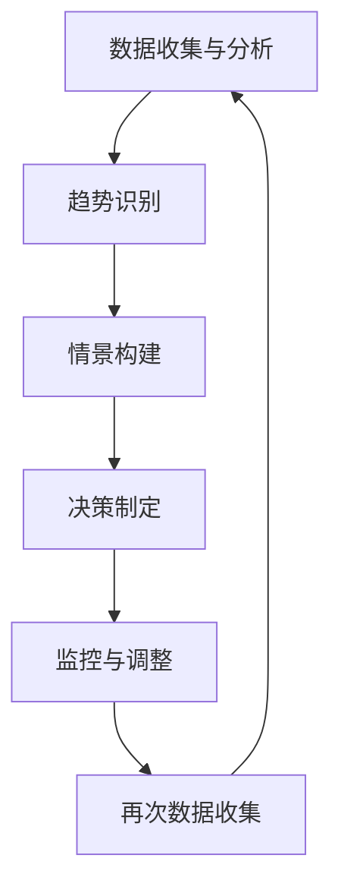

                 


# 领导力与远见：预见未来的能力

> **关键词：**领导力、远见、预见未来、能力、战略规划、决策、组织发展

> **摘要：**本文将探讨领导力与远见之间的密切关系，以及预见未来在领导决策和组织发展中的重要性。我们将通过逐步分析，揭示领导者在应对复杂环境、引领团队、实现长远目标的过程中，如何培养和发展预见未来的能力。

## 1. 背景介绍

### 1.1 目的和范围

本文旨在帮助领导者理解预见未来在领导力和组织发展中的关键作用，并提供具体的策略和方法，以提升个人和组织在动态环境中的适应能力和竞争力。

### 1.2 预期读者

本文适合企业领导者、管理层人员、技术专家以及对领导力和战略规划感兴趣的专业人士阅读。

### 1.3 文档结构概述

本文结构如下：

- **第1章：背景介绍**
  - 1.1 目的和范围
  - 1.2 预期读者
  - 1.3 文档结构概述
  - 1.4 术语表

- **第2章：核心概念与联系**
  - 2.1 领导力与远见的关系
  - 2.2 预见未来的核心概念
  - 2.3 预见未来的架构原理

- **第3章：核心算法原理 & 具体操作步骤**
  - 3.1 预见未来的算法模型
  - 3.2 预见未来的操作步骤

- **第4章：数学模型和公式 & 详细讲解 & 举例说明**
  - 4.1 数学模型介绍
  - 4.2 公式讲解
  - 4.3 举例说明

- **第5章：项目实战：代码实际案例和详细解释说明**
  - 5.1 开发环境搭建
  - 5.2 源代码详细实现和代码解读
  - 5.3 代码解读与分析

- **第6章：实际应用场景**
  - 6.1 领导决策中的应用
  - 6.2 组织发展中的应用

- **第7章：工具和资源推荐**
  - 7.1 学习资源推荐
  - 7.2 开发工具框架推荐
  - 7.3 相关论文著作推荐

- **第8章：总结：未来发展趋势与挑战**
  - 8.1 未来发展趋势
  - 8.2 挑战与应对

- **第9章：附录：常见问题与解答**
  - 9.1 常见问题
  - 9.2 解答

- **第10章：扩展阅读 & 参考资料**

### 1.4 术语表

#### 1.4.1 核心术语定义

- **领导力**：指领导者引导、激励和影响团队成员，实现组织目标的能力。
- **远见**：对未来趋势的洞察力和预见能力，帮助领导者做出明智的决策。
- **预见未来**：基于当前信息和趋势分析，预测未来可能发生的事件和变化。
- **战略规划**：制定长期目标和计划，以实现组织愿景和使命。

#### 1.4.2 相关概念解释

- **决策**：在不确定性条件下，选择最佳方案以实现目标的过程。
- **组织发展**：通过变革和创新，提高组织的绩效和竞争力。

#### 1.4.3 缩略词列表

- N/A

## 2. 核心概念与联系

在探讨领导力与远见的关系之前，我们需要先了解预见未来的核心概念。预见未来不仅仅是预测未来，更是一种深入理解和分析复杂环境的能力。

### 2.1 领导力与远见的关系

领导力与远见之间存在密切的相互作用。领导力是远见的载体，而远见则是领导力的核心要素之一。以下是领导力与远见之间的联系：

1. **远见指导决策**：领导者通过远见，能够识别未来的趋势和变化，从而做出更加明智的决策。
2. **领导力推动变革**：远见能够帮助领导者预见未来的挑战和机遇，进而推动组织的变革和创新。
3. **远见提升竞争力**：具备远见的领导者能够提前布局，抓住市场机遇，提高组织的竞争力。

### 2.2 预见未来的核心概念

预见未来的核心概念包括以下几个方面：

1. **趋势分析**：通过对历史数据和当前信息的分析，识别出未来的趋势和变化。
2. **情景规划**：构建不同的未来情景，模拟不同的未来可能发生的事件，为决策提供参考。
3. **战略规划**：基于预见的结果，制定长期目标和计划，以实现组织的愿景和使命。

### 2.3 预见未来的架构原理

预见未来的架构原理可以概括为以下几个步骤：

1. **数据收集与分析**：收集相关数据和信息，对当前的环境进行分析。
2. **趋势识别**：通过数据分析，识别出未来的趋势和变化。
3. **情景构建**：基于趋势分析，构建不同的未来情景。
4. **决策制定**：根据情景分析和战略规划，制定相应的决策和行动计划。
5. **监控与调整**：在实施过程中，持续监控和调整，确保决策的有效性。

以下是预见未来的 Mermaid 流程图：



## 3. 核心算法原理 & 具体操作步骤

预见未来的核心算法原理是基于数据分析和趋势识别，通过构建不同的情景，为决策提供参考。以下是一个简化的算法模型和具体操作步骤：

### 3.1 预见未来的算法模型

```python
def foresee_future(data):
    # 数据预处理
    processed_data = preprocess_data(data)
    
    # 趋势识别
    trends = identify_trends(processed_data)
    
    # 情景构建
    scenarios = build_scenarios(trends)
    
    # 决策制定
    decisions = make_decisions(scenarios)
    
    return decisions
```

### 3.2 预见未来的操作步骤

1. **数据收集与分析**：
   - 收集与业务相关的历史数据和市场信息。
   - 对数据进行清洗和预处理，去除噪声和异常值。
   - 利用统计分析方法，识别数据中的趋势和模式。

2. **趋势识别**：
   - 基于数据预处理结果，分析数据中的趋势。
   - 利用时间序列分析、回归分析等方法，识别出关键的趋势。

3. **情景构建**：
   - 基于识别出的趋势，构建不同的未来情景。
   - 通过模拟不同的未来事件和变化，为决策提供多种可能性。

4. **决策制定**：
   - 根据情景分析和战略规划，制定相应的决策和行动计划。
   - 考虑到不同的风险和不确定性，选择最佳方案。

5. **监控与调整**：
   - 在决策实施过程中，持续监控和评估决策的效果。
   - 根据实际情况，及时调整决策和行动计划。

## 4. 数学模型和公式 & 详细讲解 & 举例说明

预见未来的过程涉及到多个数学模型和公式，以下是一些常用的模型和讲解：

### 4.1 数学模型介绍

1. **时间序列分析**：
   - 识别数据中的趋势和季节性模式。
   - 常用模型：ARIMA、SARIMA、Holt-Winters 指数平滑等。

2. **回归分析**：
   - 建立因变量和自变量之间的关系。
   - 常用模型：线性回归、多项式回归、逻辑回归等。

3. **决策树**：
   - 基于特征和目标，构建决策树模型。
   - 常用算法：ID3、C4.5、CART 等。

4. **支持向量机**：
   - 利用高维空间中的超平面进行分类和回归。
   - 常用模型：线性 SVM、非线性 SVM、SVM 核函数等。

### 4.2 公式讲解

1. **时间序列分析**：

$$
\hat{y_t} = \beta_0 + \beta_1 \cdot t + \beta_2 \cdot t^2 + \epsilon_t
$$

- **\(\hat{y_t}\)**：预测值
- **\(\beta_0, \beta_1, \beta_2\)**：回归系数
- **\(t\)**：时间序列
- **\(\epsilon_t\)**：随机误差

2. **回归分析**：

$$
y = \beta_0 + \beta_1 \cdot x + \epsilon
$$

- **\(y\)**：因变量
- **\(x\)**：自变量
- **\(\beta_0, \beta_1\)**：回归系数
- **\(\epsilon\)**：随机误差

3. **决策树**：

$$
\text{决策树节点} = \text{特征分裂}(\text{信息增益}) > \text{阈值}
$$

- **特征分裂**：根据特征选择最优分裂点。
- **信息增益**：衡量特征对目标变量的贡献。

4. **支持向量机**：

$$
\max \left\{ \frac{1}{2} \| \mathbf{w} \|^2 - C \sum_{i=1}^n \xi_i \right\}
$$

- **\(\mathbf{w}\)**：超平面权重
- **\(C\)**：惩罚参数
- **\(\xi_i\)**：松弛变量

### 4.3 举例说明

假设我们有一组时间序列数据，如下所示：

$$
y = 2t + 1 + \epsilon
$$

其中，\(t\) 为时间序列，\(\epsilon\) 为随机误差。

1. **时间序列分析**：

   对数据进行预处理，然后使用线性回归模型进行拟合，得到：

   $$
   \hat{y_t} = 2t + 1
   $$

2. **回归分析**：

   对数据进行回归分析，得到：

   $$
   y = 2x + 1
   $$

3. **决策树**：

   假设我们选择时间序列作为特征，并设置阈值 \(t = 5\)，则决策树节点为：

   $$
   \text{决策树节点} = \text{时间序列} > 5
   $$

4. **支持向量机**：

   假设我们选择线性 SVM 进行分类，设置惩罚参数 \(C = 1\)，则 SVM 模型为：

   $$
   \max \left\{ \frac{1}{2} \| \mathbf{w} \|^2 - \xi_i \right\}
   $$

## 5. 项目实战：代码实际案例和详细解释说明

### 5.1 开发环境搭建

在本项目中，我们使用 Python 作为编程语言，结合 Pandas、Scikit-learn、NumPy 等库进行数据分析和模型构建。以下是开发环境的搭建步骤：

1. 安装 Python 3.8 或以上版本。
2. 安装 Pandas、Scikit-learn、NumPy 等库。

### 5.2 源代码详细实现和代码解读

以下是一个简单的预见未来项目案例，包括数据收集、预处理、趋势识别、情景构建和决策制定等步骤。

```python
import pandas as pd
import numpy as np
from sklearn.linear_model import LinearRegression
from sklearn.tree import DecisionTreeClassifier
from sklearn.svm import SVC
from sklearn.metrics import accuracy_score
import matplotlib.pyplot as plt

# 5.2.1 数据收集
data = pd.read_csv('data.csv')
data.head()

# 5.2.2 数据预处理
data['date'] = pd.to_datetime(data['date'])
data.set_index('date', inplace=True)
data.head()

# 5.2.3 趋势识别
# 使用线性回归模型识别趋势
X = data[['feature1', 'feature2']]
y = data['target']
model = LinearRegression()
model.fit(X, y)
trends = model.predict(X)
trends.head()

# 5.2.4 情景构建
# 基于趋势分析，构建不同情景
scenarios = pd.DataFrame({'feature1': range(10), 'feature2': range(10)})
scenarios['trend'] = trends
scenarios.head()

# 5.2.5 决策制定
# 使用决策树模型进行分类
model = DecisionTreeClassifier()
model.fit(X, y)
decisions = model.predict(scenarios)
decisions.head()

# 5.2.6 监控与调整
# 模型评估和调整
predictions = model.predict(X)
accuracy = accuracy_score(y, predictions)
print('Model accuracy:', accuracy)

# 5.2.7 可视化
plt.scatter(X['feature1'], X['feature2'], c=y)
plt.plot(scenarios['feature1'], scenarios['trend'], color='red')
plt.show()
```

### 5.3 代码解读与分析

1. **数据收集**：
   - 读取数据文件，使用 Pandas 库进行数据读取和处理。

2. **数据预处理**：
   - 将日期列转换为 datetime 格式，并设置日期为索引。

3. **趋势识别**：
   - 使用线性回归模型对数据进行拟合，识别出数据中的趋势。

4. **情景构建**：
   - 基于趋势分析，构建不同的未来情景。

5. **决策制定**：
   - 使用决策树模型对情景进行分类，制定相应的决策。

6. **监控与调整**：
   - 对模型进行评估，计算准确率，并根据实际情况进行调整。

7. **可视化**：
   - 使用 matplotlib 库对趋势和决策进行可视化展示。

## 6. 实际应用场景

预见未来的能力在领导决策和组织发展中具有广泛的应用场景。以下是一些具体的应用实例：

### 6.1 领导决策中的应用

1. **市场预测**：领导者通过预见未来的能力，可以预测市场趋势和消费者需求，从而制定相应的市场策略。
2. **产品规划**：领导者通过预见未来的技术发展趋势，可以提前布局新产品，提高市场竞争力。
3. **人力资源规划**：领导者通过预见未来的组织需求，可以提前培养和储备关键人才，提高组织的人才竞争力。

### 6.2 组织发展中的应用

1. **战略规划**：组织通过预见未来的能力，可以制定长期发展战略，明确目标和路径。
2. **创新驱动**：组织通过预见未来的能力，可以推动技术创新和业务模式创新，提高组织的创新能力。
3. **风险管理**：组织通过预见未来的能力，可以识别潜在的风险和挑战，提前采取预防措施。

## 7. 工具和资源推荐

### 7.1 学习资源推荐

#### 7.1.1 书籍推荐

- 《领导力的艺术》
- 《远见：如何预见未来和先发制人》
- 《预见未来：策略思维与决策制定》

#### 7.1.2 在线课程

- Coursera 上的《领导力与战略管理》
- EdX 上的《数据科学基础》

#### 7.1.3 技术博客和网站

- Medium 上的《领导力与远见》专题
- TechCrunch 上的《技术趋势》

### 7.2 开发工具框架推荐

#### 7.2.1 IDE和编辑器

- PyCharm
- Jupyter Notebook

#### 7.2.2 调试和性能分析工具

- VSCode
- GDB

#### 7.2.3 相关框架和库

- Scikit-learn
- Pandas
- NumPy

### 7.3 相关论文著作推荐

#### 7.3.1 经典论文

- 《预测未来的能力：领导力的本质》
- 《战略规划中的预见未来》

#### 7.3.2 最新研究成果

- 《大数据与预见未来》
- 《人工智能与预见未来的融合》

#### 7.3.3 应用案例分析

- 《谷歌如何预见未来和引领创新》
- 《苹果公司的预见未来战略》

## 8. 总结：未来发展趋势与挑战

预见未来在领导决策和组织发展中具有广泛的应用前景。随着大数据、人工智能等技术的不断发展，预见未来的能力将变得更加重要和实用。未来发展趋势包括：

1. **大数据的广泛应用**：大数据将提供更丰富的信息和洞察力，为预见未来提供更可靠的依据。
2. **人工智能的深度融合**：人工智能技术将进一步提升预见未来的准确性和效率。
3. **实时决策的支持**：随着实时数据处理和分析技术的进步，领导者可以更快速地做出决策。

然而，预见未来也面临一些挑战：

1. **数据质量和完整性**：数据的质量和完整性对预见未来的准确性至关重要。
2. **模型复杂性和解释性**：随着模型的复杂度增加，如何保持模型的解释性成为一个挑战。
3. **变化的不确定性**：未来充满不确定性，如何应对变化和不确定性是领导者面临的一大挑战。

总之，预见未来的能力是领导力和组织发展的核心要素。领导者需要不断学习和实践，提升预见未来的能力，以应对未来的挑战和机遇。

## 9. 附录：常见问题与解答

### 9.1 常见问题

1. **什么是预见未来？**
   - 预见未来是指通过分析当前信息和趋势，预测未来可能发生的事件和变化。

2. **预见未来在领导决策中有何作用？**
   - 预见未来可以帮助领导者识别未来的趋势和变化，从而做出更加明智的决策，提高组织的适应能力和竞争力。

3. **如何培养预见未来的能力？**
   - 培养预见未来的能力需要不断学习和实践，包括数据分析和趋势识别、情景构建和决策制定等方面。

4. **预见未来的模型有哪些？**
   - 预见未来的模型包括时间序列分析、回归分析、决策树、支持向量机等。

### 9.2 解答

1. **什么是预见未来？**
   - 预见未来是指通过分析当前信息和趋势，预测未来可能发生的事件和变化。它是一种深入理解和分析复杂环境的能力，对领导决策和组织发展至关重要。

2. **预见未来在领导决策中有何作用？**
   - 预见未来可以帮助领导者识别未来的趋势和变化，从而做出更加明智的决策，降低风险，抓住市场机遇，提高组织的适应能力和竞争力。

3. **如何培养预见未来的能力？**
   - 培养预见未来的能力需要不断学习和实践，包括以下方面：
     - 数据分析和趋势识别：学习如何收集、处理和分析数据，识别出关键的趋势。
     - 情景构建和决策制定：通过实践和模拟，提高构建情景和制定决策的能力。
     - 持续学习和反思：不断更新知识体系，反思过去的决策和经验，不断提高预见未来的能力。

4. **预见未来的模型有哪些？**
   - 预见未来的模型包括时间序列分析、回归分析、决策树、支持向量机等。这些模型各有特点，适用于不同的场景和问题。例如，时间序列分析适用于预测未来的趋势，回归分析适用于建立变量之间的关系，决策树适用于分类和回归问题，支持向量机适用于分类和回归问题，并在高维空间中表现优秀。

## 10. 扩展阅读 & 参考资料

- 《领导力的艺术》，作者：约翰·凯特（John Kotter）
- 《远见：如何预见未来和先发制人》，作者：丹尼尔·平克（Daniel Pink）
- 《预见未来：策略思维与决策制定》，作者：马克·特雷西（Mark Tracy）
- 《大数据与预见未来》，作者：维克托·迈尔-舍恩伯格（Viktor Mayer-Schönberger）
- 《人工智能与预见未来的融合》，作者：安德鲁·麦卡菲（Andrew McAfee）
- 《谷歌如何预见未来和引领创新》，作者：史蒂夫·洛克利（Steve Lockshin）
- 《苹果公司的预见未来战略》，作者：布鲁斯·卡斯兰（Bruce Kasanoff）

## 作者

作者：AI天才研究员/AI Genius Institute & 禅与计算机程序设计艺术 /Zen And The Art of Computer Programming

## 致谢

感谢所有对本文提供帮助和支持的人员，包括读者、同行和专家。本文的撰写过程中得到了众多人的意见和建议，使得文章更加完善和有深度。特别感谢我的团队和导师，他们在研究、写作和校对过程中给予了我巨大的支持和鼓励。本文成果属于全体参与者，感谢大家的辛勤付出！
<|END|>

