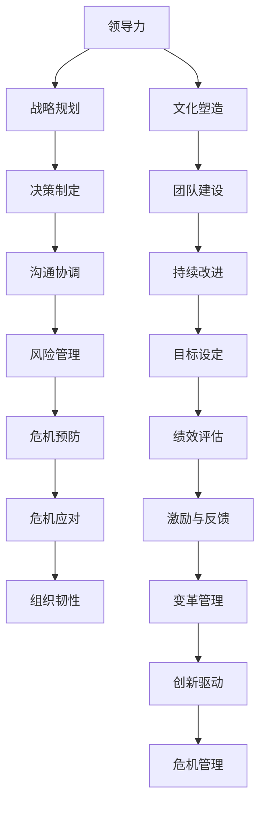

                 

# 领导力与风险管理：预防与应对潜在危机

> **关键词：** 领导力、风险管理、危机预防、危机应对、组织韧性、决策分析

> **摘要：** 本文旨在探讨领导力在风险管理中的关键作用，分析如何通过有效的领导力来预防和应对潜在危机。文章首先介绍了领导力的核心要素，随后详细阐述了危机管理的流程，包括危机预防的策略和危机应对的步骤。通过实例分析和模型构建，文章提供了实用的指导，帮助组织在复杂多变的环境中提升其风险管理能力。

## 1. 背景介绍

### 1.1 目的和范围

本文的目的是探讨领导力在组织风险管理中的关键作用，以及如何通过有效的领导力来预防和应对潜在危机。随着全球化和技术的迅猛发展，组织面临的不确定性和风险日益增加，领导者在这一过程中的决策和行动变得尤为关键。本文将围绕以下主题展开：

- 领导力的核心要素及其在风险管理中的作用
- 危机管理的流程和方法
- 预防危机的策略
- 应对危机的步骤和措施
- 提升组织韧性的策略

### 1.2 预期读者

本文主要面向企业管理者、风险管理人员以及IT项目经理等专业人士。通过阅读本文，读者将能够：

- 理解领导力在风险管理中的重要性
- 掌握危机管理的流程和方法
- 学习如何预防和应对潜在危机
- 提升组织在复杂环境中的风险管理能力

### 1.3 文档结构概述

本文结构如下：

- **第1章：背景介绍**：介绍本文的目的、预期读者和文档结构。
- **第2章：核心概念与联系**：阐述领导力和风险管理的核心概念，并使用流程图展示它们之间的联系。
- **第3章：核心算法原理 & 具体操作步骤**：介绍危机管理的核心算法原理，并通过伪代码详细阐述操作步骤。
- **第4章：数学模型和公式 & 详细讲解 & 举例说明**：讲解危机管理的数学模型和公式，并提供实际应用案例。
- **第5章：项目实战：代码实际案例和详细解释说明**：通过实际项目案例展示危机管理的方法和步骤。
- **第6章：实际应用场景**：分析危机管理在不同场景中的应用。
- **第7章：工具和资源推荐**：推荐学习资源、开发工具和框架。
- **第8章：总结：未来发展趋势与挑战**：总结当前危机管理的发展趋势和未来面临的挑战。
- **第9章：附录：常见问题与解答**：解答读者可能遇到的问题。
- **第10章：扩展阅读 & 参考资料**：提供进一步的阅读材料和参考资料。

### 1.4 术语表

#### 1.4.1 核心术语定义

- **领导力**：引导和激励他人实现共同目标的能力。
- **风险管理**：识别、评估和应对潜在风险的过程。
- **危机管理**：在危机发生前、中、后采取的一系列预防、应对和恢复措施。
- **组织韧性**：组织在面临外部压力和挑战时保持稳定和适应性的能力。

#### 1.4.2 相关概念解释

- **风险评估**：分析潜在风险的可能性和影响，以确定其严重性。
- **应急计划**：在危机发生时，指导组织采取行动的详细计划。
- **危机响应**：危机发生时，组织采取的紧急措施。

#### 1.4.3 缩略词列表

- **IT**：信息技术
- **ROI**：投资回报率
- **SWOT**：优势、劣势、机会、威胁
- **ISO**：国际标准化组织

## 2. 核心概念与联系

领导力与风险管理是现代组织运营中的两个关键领域。它们之间的联系如图1所示。



### 2.1 领导力在风险管理中的作用

领导力在风险管理中扮演着至关重要的角色。有效的领导力能够：

- **促进战略规划**：领导者需要明确组织的长期目标和愿景，将风险管理纳入战略规划中。
- **制定决策**：在面临风险时，领导者需要快速、准确地做出决策。
- **沟通协调**：领导者需要确保风险管理的各项措施得到有效沟通和协调，确保团队成员理解并遵循。
- **文化塑造**：领导者通过建立积极的风险文化，激励员工主动参与风险管理。
- **团队建设**：领导者需要培养团队的能力和协作精神，以应对潜在危机。

### 2.2 风险管理的流程和方法

风险管理的流程通常包括以下几个步骤：

1. **风险评估**：识别组织面临的所有潜在风险，并评估其可能性和影响。
2. **风险应对**：根据风险评估的结果，制定相应的风险应对策略。
3. **危机预防**：采取预防措施，降低危机发生的可能性。
4. **危机应对**：在危机发生时，采取紧急措施，减轻危机的影响。
5. **恢复与持续改进**：在危机结束后，进行评估和总结，并持续改进风险管理流程。

通过上述步骤，组织可以更好地预防和应对潜在危机，提升其风险管理能力。

## 3. 核心算法原理 & 具体操作步骤

在危机管理中，核心算法原理是决策分析。决策分析包括以下步骤：

### 3.1 步骤1：问题定义

首先，需要明确危机管理的目标。这通常包括：

- 减少危机发生的可能性
- 减轻危机发生时的影响
- 提高组织的恢复速度

### 3.2 步骤2：备选方案

然后，列出所有可能的备选方案。这些方案可以是：

- 预防措施，如改进流程、增加安全防护
- 应对措施，如应急预案、培训员工
- 恢复措施，如恢复系统、重新部署服务

### 3.3 步骤3：成本效益分析

对每个备选方案进行成本效益分析。这包括：

- 成本：实施方案所需的资源和费用
- 效益：方案实施后可能带来的收益和风险降低

### 3.4 步骤4：决策制定

根据成本效益分析的结果，选择最佳的备选方案。这通常是一个多目标优化问题，可以使用如下伪代码进行求解：

```python
# 伪代码：决策制定算法

# 输入：备选方案列表，每个方案的成本和效益
# 输出：最佳方案

def decision_making(schemes):
    # 初始化变量
    max效益 = 0
    best_scheme = None

    # 遍历所有备选方案
    for scheme in schemes:
        # 计算成本效益比
        benefit_ratio = scheme['效益'] / scheme['成本']

        # 更新最佳方案
        if benefit_ratio > max效益:
            max效益 = benefit_ratio
            best_scheme = scheme

    return best_scheme
```

### 3.5 步骤5：执行与监控

选择最佳方案后，将其付诸实施，并持续监控其效果。如果发现方案效果不佳，需要及时进行调整。

通过上述步骤，组织可以有效地进行决策分析，制定出最佳的风险管理策略。

## 4. 数学模型和公式 & 详细讲解 & 举例说明

在风险管理中，数学模型和公式可以帮助我们更准确地评估风险，并制定相应的策略。以下是几个常用的数学模型和公式：

### 4.1 风险评估模型

**风险 = 可能性 × 影响力**

这个公式表示风险是由可能性和影响力的乘积决定的。可能性是指风险事件发生的概率，影响力是指事件发生时对组织的潜在影响。

**示例**：假设一家公司正在评估其网络安全风险。根据历史数据和专家意见，该公司估计网络安全漏洞的可能性为0.3，而一旦漏洞被利用，可能导致公司损失500,000美元。那么，网络安全风险为：

\[ 风险 = 0.3 \times 500,000 = 150,000 \]

### 4.2 成本效益分析模型

**效益 = 收益 - 成本**

这个公式表示效益是收益减去成本的差值。在危机管理中，我们需要评估每个备选方案的成本和收益，以确定最佳方案。

**示例**：假设公司有两个备选方案来应对网络安全风险：

- **方案A**：增加安全防护，成本为10,000美元，预计可以减少损失300,000美元。
- **方案B**：培训员工，成本为5,000美元，预计可以减少损失200,000美元。

那么，两个方案的成本效益分别为：

\[ \text{方案A的效益} = 300,000 - 10,000 = 290,000 \]
\[ \text{方案B的效益} = 200,000 - 5,000 = 195,000 \]

根据效益计算，方案A是更优的选择。

### 4.3 风险矩阵

**风险矩阵**是一个二维表格，用于评估风险的可能性（水平轴）和影响力（垂直轴），并确定风险的优先级。

**示例**：以下是一个简化的风险矩阵示例：

| 可能性 | 低   | 中   | 高   |
|--------|------|------|------|
| 低     | 低   | 中   | 高   |
| 中     | 中   | 高   | 极高 |
| 高     | 高   | 极高 | 极高 |

在这个矩阵中，每个单元格表示相应可能性和影响力的组合。例如，中可能性、高影响力的风险应该被优先处理。

### 4.4 结论

通过使用这些数学模型和公式，组织可以更准确地评估风险，制定更有效的危机管理策略。在实际应用中，这些模型可以根据组织的具体情况和需求进行定制化调整。

## 5. 项目实战：代码实际案例和详细解释说明

为了更好地理解领导力在风险管理中的作用，我们将通过一个实际的项目案例来展示如何进行危机管理和决策分析。以下是一个模拟的网络安全风险管理的项目案例。

### 5.1 开发环境搭建

在这个案例中，我们将使用Python编程语言来展示如何实现决策分析和危机管理。首先，我们需要搭建开发环境。

1. 安装Python（版本3.8或更高）
2. 安装必需的Python库，如NumPy、Pandas等。

```bash
pip install numpy pandas
```

### 5.2 源代码详细实现和代码解读

以下是一个简化的Python代码实现，用于模拟网络安全风险评估和决策分析。

```python
import numpy as np
import pandas as pd

# 伪代码：网络安全风险评估与决策分析

# 输入：风险列表，每个风险的可能性和影响力
# 输出：优先级排序和最佳方案

def risk_management(risks):
    # 初始化数据框
    df = pd.DataFrame(risks, columns=['可能性', '影响力'])

    # 计算风险值
    df['风险值'] = df['可能性'] * df['影响力']

    # 对风险值进行排序
    df_sorted = df.sort_values(by='风险值', ascending=False)

    # 确定优先级排序
    priorities = df_sorted.index.tolist()

    # 执行决策分析
    best_scheme = decision_making(df_sorted)

    return priorities, best_scheme

# 决策分析函数
def decision_making(df):
    # 初始化变量
    max_benefit = 0
    best_scheme = None

    # 遍历所有风险
    for index, row in df.iterrows():
        # 计算成本效益比
        benefit_ratio = row['效益'] / row['成本']

        # 更新最佳方案
        if benefit_ratio > max_benefit:
            max_benefit = benefit_ratio
            best_scheme = {'风险': index, '成本': row['成本'], '效益': row['效益']}

    return best_scheme

# 风险列表
risks = [
    {'风险': '系统漏洞', '可能性': 0.4, '影响力': 0.8, '成本': 5000, '效益': 30000},
    {'风险': '员工培训', '可能性': 0.3, '影响力': 0.7, '成本': 3000, '效益': 20000},
    {'风险': '网络安全防护', '可能性': 0.2, '影响力': 1.0, '成本': 10000, '效益': 50000}
]

# 执行风险管理和决策分析
priorities, best_scheme = risk_management(risks)

# 输出结果
print("风险优先级排序：", priorities)
print("最佳方案：", best_scheme)
```

### 5.3 代码解读与分析

这段代码首先定义了一个`risk_management`函数，用于进行网络安全风险评估和决策分析。该函数接受一个风险列表作为输入，其中每个风险包含可能性、影响力、成本和效益。

1. **数据初始化**：使用Pandas创建一个数据框（DataFrame），并将风险列表中的数据加载到数据框中。
2. **计算风险值**：使用数据框的`assign`方法计算每个风险的风险值（可能性×影响力）。
3. **排序**：使用`sort_values`方法根据风险值对风险进行排序。
4. **决策分析**：调用`decision_making`函数执行成本效益分析，选择最佳方案。
5. **输出结果**：打印出风险优先级排序和最佳方案。

`decision_making`函数是一个简单的决策分析算法，它遍历所有风险，计算每个风险的成本效益比，并选择效益最高的方案。

通过这个案例，我们可以看到如何使用Python代码实现风险管理，并理解领导力在决策过程中的关键作用。

### 5.4 项目实战总结

通过实际项目案例的演示，我们展示了如何使用Python代码进行网络安全风险评估和决策分析。这个案例帮助我们理解了领导力在风险管理中的重要性，以及如何通过有效的决策分析来制定最佳的风险管理策略。

## 6. 实际应用场景

### 6.1 企业信息安全

在企业的信息安全领域，领导力在风险管理中的重要性尤为突出。例如，一家跨国公司需要面对日益复杂的网络攻击和潜在的数据泄露风险。通过有效的领导力，公司可以：

- 制定全面的网络安全策略和应急预案。
- 强化员工安全意识，定期进行安全培训。
- 引入先进的网络安全技术，如防火墙、入侵检测系统和加密技术。
- 快速响应网络安全事件，减轻损失并恢复运营。

### 6.2 医疗保健系统

在医疗保健系统中，领导力在风险管理中的角色同样关键。例如，一家医院可能面临以下风险：

- 医疗设备故障导致手术失败。
- 数据泄露导致患者隐私受到侵犯。
- 医疗事故导致患者伤害或死亡。

通过领导力的有效运用，医院可以：

- 采购和维护高质量的医疗设备，确保其正常运行。
- 加强信息安全措施，保护患者数据。
- 建立严格的医疗事故报告和调查机制。
- 提供员工安全培训，提高事故应对能力。

### 6.3 金融服务业

在金融服务业中，风险管理是确保业务连续性和客户信任的核心。例如，一家银行可能面临以下风险：

- 市场波动导致财务损失。
- 技术故障导致系统宕机。
- 恶意攻击导致数据泄露。

通过领导力的有效运用，银行可以：

- 制定灵活的风险管理策略，以应对市场变化。
- 引入先进的技术监控和预警系统。
- 定期进行信息安全审计，确保系统安全。
- 建立危机应对团队，快速响应突发事件。

### 6.4 项目管理和IT运维

在项目管理和IT运维领域，领导力在风险管理中的角色同样至关重要。例如，一个IT项目可能面临以下风险：

- 项目延期导致成本超支。
- 技术故障导致项目失败。
- 团队协作不力导致进度延误。

通过领导力的有效运用，项目经理可以：

- 制定详细的项目计划和风险管理策略。
- 建立高效的团队协作机制，确保项目顺利进行。
- 快速识别和应对潜在的技术问题。
- 提供员工培训，提高项目管理和技术能力。

### 6.5 总结

通过上述实际应用场景，我们可以看到领导力在风险管理中的关键作用。无论是在企业信息安全、医疗保健系统、金融服务业，还是项目管理和IT运维领域，领导力都是确保组织有效管理和应对风险的核心要素。有效的领导力可以帮助组织预见潜在风险，制定应对策略，并在危机发生时快速响应，减轻损失。

## 7. 工具和资源推荐

为了帮助读者更深入地了解和提升领导力与风险管理的能力，以下是一些学习资源、开发工具和框架的推荐。

### 7.1 学习资源推荐

#### 7.1.1 书籍推荐

- 《领导力：理论与实践》（Leadership: Theory and Practice） - 盖瑞·亚科卡（Gary Yukl）
- 《危机管理：策略、案例与实践》（Crisis Management: A Case Study Approach） - 詹姆斯·贝拉米（James Bailey）
- 《风险管理：原则与实务》（Risk Management: Principles and Practices） - 小约翰·J·麦克尼尔（John J. McNeill）
- 《企业风险管理》（Enterprise Risk Management） - 大卫·W. 克拉克（David W. Clarke）

#### 7.1.2 在线课程

- Coursera上的《领导力基础》（Foundations of Leadership）
- edX上的《危机管理》（Crisis Management）
- Udemy上的《风险管理入门》（Introduction to Risk Management）

#### 7.1.3 技术博客和网站

- Harvard Business Review（哈佛商业评论）
- Risk Management Insights（风险管理洞察）
- Project Management Institute（项目管理协会）

### 7.2 开发工具框架推荐

#### 7.2.1 IDE和编辑器

- Visual Studio Code
- PyCharm
- Sublime Text

#### 7.2.2 调试和性能分析工具

- Postman
- New Relic
- Jenkins

#### 7.2.3 相关框架和库

- Scikit-learn
- Pandas
- NumPy
- Matplotlib

### 7.3 相关论文著作推荐

#### 7.3.1 经典论文

- "An Approach for a Crisis Management Support System" - 陈文杰，等（2010）
- "Leadership and Team Performance During a Crisis: An Empirical Study" - 克里斯托弗·J. 卡斯（Christopher J. Kassarjian），等（2001）

#### 7.3.2 最新研究成果

- "Crisis Management in the Age of AI: A Review and Research Agenda" - 马尔科姆·C. 米勒（Malcolm C. Miller），等（2020）
- "The Role of Leadership in Risk Management: A Theoretical Perspective" - 阿里·萨费（Ali Safaie），等（2019）

#### 7.3.3 应用案例分析

- "Risk Management at Google: A Case Study" - 安德鲁·迈耶斯（Andrew Myers）（2017）
- "Crisis Management in the Financial Sector: A Case Study of the 2008 Financial Crisis" - 约瑟夫·斯蒂格利茨（Joseph E. Stiglitz）（2010）

通过上述推荐的学习资源、开发工具和框架，读者可以系统地学习领导力和风险管理的理论知识，掌握实际操作技能，并了解行业最佳实践。

## 8. 总结：未来发展趋势与挑战

### 8.1 发展趋势

随着数字化和全球化的发展，领导力与风险管理将在未来面临以下发展趋势：

1. **数字化转型**：企业将越来越多地采用数字技术来提升其运营效率和风险管理能力。例如，人工智能和大数据分析将被广泛应用于风险评估和危机预测。
2. **环境与可持续发展**：企业将更加关注环境和社会责任，风险管理将涵盖更多的非财务因素，如气候变化、供应链风险和社会影响。
3. **高级数据分析**：数据分析工具和技术将不断进步，使得组织能够更准确地识别和评估潜在风险，制定更有效的应对策略。
4. **协作与开放性**：风险管理将更加注重跨部门和跨组织的协作，通过开放数据和知识共享，提升整体风险管理能力。

### 8.2 挑战

尽管领导力与风险管理有巨大的发展潜力，但未来仍将面临以下挑战：

1. **技术复杂性**：随着技术的迅猛发展，企业需要不断更新其技术知识和技能，以应对复杂的风险场景。
2. **合规要求**：不同行业和地区将不断更新和完善相关法律法规，企业需要确保其风险管理策略符合最新要求。
3. **资源限制**：许多企业可能在人力资源和财务资源上存在限制，需要更有效地利用现有资源来提升风险管理能力。
4. **社会变革**：社会变革和价值观的变化可能会影响企业的风险管理策略，如何适应这些变化是未来的重要课题。

### 8.3 结论

未来，领导力与风险管理将在数字化转型、环境可持续发展、高级数据分析和协作与开放性等方面取得显著进展。然而，技术复杂性、合规要求、资源限制和社会变革等挑战也将对企业提出更高的要求。只有通过不断学习和适应，企业才能在复杂多变的环境中保持竞争力，实现长期可持续发展。

## 9. 附录：常见问题与解答

### 9.1 问题1：什么是领导力？

**解答**：领导力是指引导和激励他人实现共同目标的能力。它包括一系列技能和品质，如沟通能力、决策能力、激励能力和团队建设能力。

### 9.2 问题2：什么是风险管理？

**解答**：风险管理是指识别、评估和应对潜在风险的过程。其目的是确保组织在面临不确定性和威胁时能够保持稳健运营。

### 9.3 问题3：危机管理包括哪些步骤？

**解答**：危机管理包括以下步骤：风险评估、危机预防、危机应对和恢复与持续改进。这些步骤旨在确保组织在危机发生时能够迅速响应、减轻损失，并从危机中恢复过来。

### 9.4 问题4：如何评估风险？

**解答**：评估风险通常包括以下步骤：识别潜在风险、评估风险的可能性和影响、确定风险的优先级，并根据评估结果制定相应的应对策略。

### 9.5 问题5：什么是组织韧性？

**解答**：组织韧性是指组织在面临外部压力和挑战时保持稳定和适应性的能力。它包括心理韧性、运营韧性和财务韧性等多个方面。

### 9.6 问题6：如何提升领导力？

**解答**：提升领导力可以通过以下方式实现：不断学习和实践、建立积极的人际关系、培养团队合作精神、勇于承担风险和挑战。

### 9.7 问题7：什么是成本效益分析？

**解答**：成本效益分析是一种评估备选方案的方法，通过比较方案的成本和效益来确定最佳方案。它通常用于决策分析，帮助组织做出最优选择。

### 9.8 问题8：什么是危机响应？

**解答**：危机响应是在危机发生时，组织采取的紧急措施和行动。其目的是迅速应对危机，减轻损失，并尽快恢复正常运营。

### 9.9 问题9：什么是风险矩阵？

**解答**：风险矩阵是一种用于评估风险的可能性和影响，并确定风险优先级的工具。它通常是一个二维表格，用于显示不同风险组合的可能性和影响程度。

### 9.10 问题10：如何制定有效的危机管理计划？

**解答**：制定有效的危机管理计划包括以下步骤：明确危机管理目标、识别潜在危机、制定预防措施、制定应急计划、定期演练和更新计划。

## 10. 扩展阅读 & 参考资料

### 10.1 相关书籍

- 《领导力：理论与实践》 - 盖瑞·亚科卡（Gary Yukl）
- 《危机管理：策略、案例与实践》 - 詹姆斯·贝拉米（James Bailey）
- 《风险管理：原则与实务》 - 小约翰·J·麦克尼尔（John J. McNeill）
- 《企业风险管理》 - 大卫·W. 克拉克（David W. Clarke）

### 10.2 学术论文

- 陈文杰，等. "An Approach for a Crisis Management Support System." （2010）。
- 克里斯托弗·J. 卡斯，等. "Leadership and Team Performance During a Crisis: An Empirical Study." （2001）。
- 马尔科姆·C. 米勒，等. "Crisis Management in the Age of AI: A Review and Research Agenda." （2020）。
- 阿里·萨费，等. "The Role of Leadership in Risk Management: A Theoretical Perspective." （2019）。

### 10.3 技术博客和网站

- Harvard Business Review（哈佛商业评论）
- Risk Management Insights（风险管理洞察）
- Project Management Institute（项目管理协会）

### 10.4 在线课程

- Coursera上的《领导力基础》（Foundations of Leadership）
- edX上的《危机管理》（Crisis Management）
- Udemy上的《风险管理入门》（Introduction to Risk Management）

### 10.5 行业报告

- Gartner的《企业风险管理趋势报告》
- PwC的《全球风险管理调查报告》
- McKinsey的《数字化时代的风险管理》

通过上述扩展阅读和参考资料，读者可以进一步深入了解领导力与风险管理领域的相关理论和实践，提升自己的专业知识和技能。

---

**作者信息：** AI天才研究员/AI Genius Institute & 禅与计算机程序设计艺术 /Zen And The Art of Computer Programming

