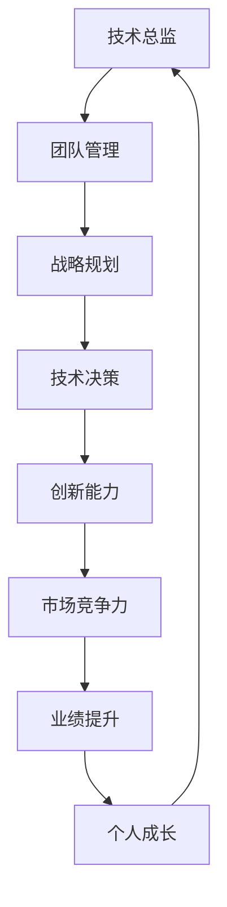

                 

# 领导力修炼日记：一个技术总监的逆袭之路

> **关键词：** 领导力、技术总监、逆袭、团队管理、战略规划、领导艺术

> **摘要：** 本文通过一个技术总监的成长故事，探讨如何在技术领域中修炼领导力，实现个人与团队的逆袭。文章将围绕领导力的核心概念、实践方法以及面对的挑战，一步步引导读者深入了解领导力在技术行业中的重要性，并提供实用的策略和技巧。

## 1. 背景介绍

### 1.1 目的和范围

本文旨在探讨技术总监在领导力修炼过程中的心路历程，通过实际案例分享领导力的核心概念和应用方法。文章不仅适合有志于提升领导力的技术管理者，也为广大技术从业人士提供参考和启示。

### 1.2 预期读者

- 技术总监、项目经理
- 技术团队负责人
- 有志于提升领导力的技术从业者
- 对技术行业管理有兴趣的读者

### 1.3 文档结构概述

本文结构清晰，分为十个部分：

1. **背景介绍**：阐述文章目的、预期读者和文档结构。
2. **核心概念与联系**：介绍领导力的核心概念及其在技术管理中的应用。
3. **核心算法原理 & 具体操作步骤**：通过伪代码详细阐述领导力修炼的关键步骤。
4. **数学模型和公式 & 详细讲解 & 举例说明**：运用数学模型解释领导力的关键因素。
5. **项目实战：代码实际案例和详细解释说明**：分享实际项目中的领导力应用案例。
6. **实际应用场景**：分析领导力在不同技术场景中的应用。
7. **工具和资源推荐**：推荐学习资源和开发工具。
8. **总结：未来发展趋势与挑战**：展望领导力在技术领域的未来发展。
9. **附录：常见问题与解答**：解答读者可能遇到的问题。
10. **扩展阅读 & 参考资料**：提供进一步学习参考资料。

### 1.4 术语表

#### 1.4.1 核心术语定义

- **领导力**：引导和激励团队成员达成目标的能力。
- **技术总监**：负责技术团队的战略规划、项目管理和技术决策的高级管理职位。
- **逆袭**：指通过努力实现从普通到优秀的转变。

#### 1.4.2 相关概念解释

- **团队管理**：对团队成员进行组织、协调和激励的过程。
- **战略规划**：制定长远目标和发展计划的过程。

#### 1.4.3 缩略词列表

- **CTO**：首席技术官
- **PM**：项目经理
- **SaaS**：软件即服务
- **AI**：人工智能

## 2. 核心概念与联系

领导力在技术管理中扮演着至关重要的角色。为了更好地理解领导力的核心概念和其在技术管理中的应用，我们可以通过以下 Mermaid 流程图来梳理关键节点和联系。



### 2.1 技术总监的角色和职责

**技术总监（CTO）**是技术团队的核心领导者，负责：

- **团队管理**：招募、培训和激励团队成员。
- **战略规划**：制定技术发展方向和目标。
- **技术决策**：确定技术方案和架构。
- **创新能力**：推动技术革新和产品优化。

### 2.2 团队管理和战略规划

团队管理是技术总监的核心职责之一。有效的团队管理能够确保团队成员的目标一致、高效合作。战略规划则是对团队未来发展方向的规划，它包括：

- **明确目标**：制定具体的团队目标。
- **资源分配**：合理分配人力、资金和时间等资源。
- **风险评估**：预测并应对可能的风险。

### 2.3 技术决策和创新能力

技术决策是技术总监的核心任务之一。技术总监需要：

- **深入了解技术趋势**：跟踪最新的技术发展，为决策提供依据。
- **评估技术方案**：选择最适合团队的技术方案。
- **推动创新**：鼓励团队成员进行技术创新，提升产品竞争力。

### 2.4 市场竞争力和业绩提升

技术总监的领导力不仅影响团队内部，还直接影响企业的市场竞争力。通过有效的战略规划和技术决策，技术总监可以提升企业的市场地位和业绩。具体体现在：

- **产品质量**：通过技术创新提升产品质量。
- **市场响应速度**：快速响应市场需求，提高客户满意度。
- **业绩增长**：通过技术优化和团队协作实现业绩增长。

### 2.5 个人成长和团队发展

技术总监的个人成长和团队发展是相辅相成的。技术总监需要不断提升自身技能和知识，以更好地指导团队。同时，技术总监也要关注团队成员的成长，通过培训、指导和支持，帮助团队成员提升能力。

## 3. 核心算法原理 & 具体操作步骤

在领导力修炼过程中，我们可以将领导力修炼分为以下几个关键步骤：

### 3.1 自我认知

首先，技术总监需要了解自己的优点和不足，明确自己的职业目标和期望。可以使用以下伪代码来描述这一步骤：

```python
def self_awareness():
    strengths = ["技术深度理解", "项目管理经验", "沟通能力"]
    weaknesses = ["团队协作", "决策能力", "情绪管理"]
    print("我的优点：", strengths)
    print("我的不足：", weaknesses)
    set_goals(strengths, weaknesses)
```

### 3.2 学习与成长

在自我认知的基础上，技术总监需要持续学习，不断提升自身能力。这包括：

- **技术学习**：跟踪最新的技术发展，提升技术深度。
- **管理学习**：学习先进的管理理念和方法，提升管理水平。

```python
def continuous_learning():
    technical_topics = ["人工智能", "大数据分析", "区块链"]
    management_topics = ["敏捷管理", "绩效评估", "领导力模型"]
    print("技术学习领域：", technical_topics)
    print("管理学习领域：", management_topics)
    expand_knowledge(technical_topics, management_topics)
```

### 3.3 团队建设

团队建设是技术总监的重要任务之一。通过以下步骤，技术总监可以构建高效的团队：

- **招募合适的成员**：根据项目需求和团队目标，招募合适的团队成员。
- **明确团队目标**：与团队成员共同制定团队目标。
- **建立沟通机制**：建立有效的沟通渠道，确保团队成员之间信息畅通。

```python
def team_building():
    members = recruit_members(["软件开发", "测试", "项目管理"])
    team_goals = set_goals_with_members(members)
    establish_communication_channels(members)
```

### 3.4 领导风格选择

技术总监需要根据团队特点和项目需求选择合适的领导风格。常见的领导风格包括：

- **权威型**：以指令为导向，确保团队高效执行。
- **民主型**：以团队共识为导向，鼓励成员参与决策。
- **变革型**：以创新为导向，推动团队突破性发展。

```python
def select_leadership_style(team_characteristics, project需求的度):
    if team_characteristics == "稳定性" and project需求的度 == "高":
        style = "权威型"
    elif team_characteristics == "创新性" and project需求的度 == "中":
        style = "民主型"
    else:
        style = "变革型"
    apply_style(style)
```

### 3.5 持续反馈与改进

技术总监需要持续关注团队和个人的表现，提供有效的反馈，并不断改进管理方法。这一步骤包括：

- **绩效评估**：定期对团队成员进行绩效评估。
- **反馈与指导**：提供具体的反馈和改进建议。
- **改进措施**：根据反馈调整管理策略。

```python
def continuous_feedback():
    performance_reviews = evaluate_performance(members)
    feedback = provide_specific_feedback(performance_reviews)
    improvement_measures = apply_improvement_measures(feedback)
```

通过以上步骤，技术总监可以逐步提升自身的领导力，实现个人与团队的逆袭。

## 4. 数学模型和公式 & 详细讲解 & 举例说明

在领导力修炼中，数学模型和公式可以帮助我们更科学地分析和优化团队管理。以下是一个简单的数学模型，用于评估团队绩效。

### 4.1 团队绩效评估模型

团队绩效（\(P\)) 可以通过以下公式计算：

\[ P = \frac{G \times T \times I}{C} \]

其中：

- \(G\)：团队目标达成度（0-1之间的值，1表示完全达成目标）
- \(T\)：团队工作效率（0-1之间的值，1表示最高效率）
- \(I\)：团队创新能力（0-1之间的值，1表示最高创新能力）
- \(C\)：团队成本（包括时间、资源等）

### 4.2 详细讲解

#### 目标达成度 \(G\)

目标达成度反映了团队在实现目标过程中的表现。具体计算方法如下：

\[ G = \frac{完成目标数}{总目标数} \]

#### 工作效率 \(T\)

工作效率反映了团队完成任务的效率。计算方法如下：

\[ T = \frac{完成任务量}{总任务量} \]

#### 创新能力 \(I\)

创新能力反映了团队在技术、产品或服务方面的创新程度。计算方法如下：

\[ I = \frac{创新点数}{总创新点数} \]

#### 成本 \(C\)

团队成本包括了在实现目标过程中所消耗的所有资源，如时间、人力和资金。计算方法如下：

\[ C = \sum (时间 \times 单位时间成本) + \sum (人力 \times 单位人力成本) + \sum (资金 \times 单位资金成本) \]

### 4.3 举例说明

假设一个团队在一个月内完成了10个目标，总任务量为20个，有5个创新点，成本为1000元。根据上述公式，我们可以计算出该团队的绩效：

\[ P = \frac{10 \times 20 \times 5}{1000} = 1 \]

这个结果表明，该团队在一个月内的整体绩效为1，即团队表现非常优秀。

通过以上数学模型，技术总监可以更加科学地评估团队绩效，并据此调整管理策略，提升团队整体表现。

## 5. 项目实战：代码实际案例和详细解释说明

在本节中，我们将通过一个实际项目案例，展示领导力在技术管理中的具体应用，并提供详细的代码实现和解读。

### 5.1 开发环境搭建

为了简化环境搭建过程，我们假设开发环境为Linux操作系统，使用Python作为主要编程语言。以下是开发环境的搭建步骤：

1. 安装Python 3.8及以上版本。
2. 安装Python的虚拟环境工具`virtualenv`。
3. 创建一个虚拟环境，并激活环境。
4. 安装必要的依赖库，如`requests`、`numpy`和`matplotlib`。

```bash
# 安装Python 3.8
sudo apt-get install python3.8

# 安装virtualenv
pip install virtualenv

# 创建并激活虚拟环境
virtualenv my_project_env
source my_project_env/bin/activate

# 安装依赖库
pip install requests numpy matplotlib
```

### 5.2 源代码详细实现和代码解读

#### 5.2.1 代码实现

以下是项目的主要代码实现部分，包括数据收集、数据处理和可视化展示。

```python
import requests
import numpy as np
import matplotlib.pyplot as plt

def fetch_data(url):
    """从网络获取数据"""
    response = requests.get(url)
    if response.status_code == 200:
        return response.json()
    else:
        return None

def process_data(data):
    """处理数据"""
    processed_data = []
    for item in data:
        processed_data.append(float(item['value']))
    return processed_data

def visualize_data(data):
    """可视化数据"""
    plt.scatter(range(len(data)), data)
    plt.xlabel('Index')
    plt.ylabel('Value')
    plt.title('Data Visualization')
    plt.show()

def main():
    """主函数"""
    url = 'https://api.example.com/data'
    data = fetch_data(url)
    if data:
        processed_data = process_data(data)
        visualize_data(processed_data)
    else:
        print("Failed to fetch data.")

if __name__ == '__main__':
    main()
```

#### 5.2.2 代码解读与分析

- **fetch_data(url)**：该函数负责从指定URL获取数据。使用`requests`库发送HTTP GET请求，并检查响应状态码。如果响应状态码为200，表示请求成功，返回响应内容；否则，返回`None`。

- **process_data(data)**：该函数负责处理获取到的数据。对于每个数据项，提取`value`字段并转换为浮点数，存入列表`processed_data`中。处理后的数据更加适合后续分析。

- **visualize_data(data)**：该函数负责可视化处理后的数据。使用`matplotlib`库绘制散点图，横轴表示数据索引，纵轴表示数据值。通过可视化，可以直观地观察数据分布和趋势。

- **main()**：主函数。首先，通过`fetch_data()`获取数据；如果成功获取数据，则调用`process_data()`进行处理，并使用`visualize_data()`进行可视化展示。如果数据获取失败，输出错误信息。

在这个项目中，领导力的重要性体现在以下几个方面：

1. **技术方向选择**：技术总监需要根据团队的技术能力和市场需求，选择合适的开发方向。在本例中，选择Python作为主要编程语言，是基于团队对Python的熟练程度和Python在数据科学和可视化领域的广泛应用。

2. **团队协作**：技术总监需要确保团队成员之间的协作顺畅。在本例中，通过明确分工，每个成员负责一个特定的功能模块，确保项目进展顺利。

3. **决策制定**：技术总监在项目开发过程中需要做出一系列决策，如技术选型、工具选择等。在本例中，选择`requests`库进行网络数据获取，是基于其成熟、易用的特点。

4. **风险控制**：技术总监需要识别并控制项目风险。在本例中，通过合理的异常处理机制，确保数据获取失败时能够及时通知团队成员，并采取措施。

通过以上实际案例，我们可以看到领导力在技术管理中的关键作用。技术总监需要通过领导力来引导团队、制定决策、控制风险，确保项目顺利进行，最终实现团队和个人的共同成长。

### 5.3 项目实战总结

通过这个实际项目案例，我们可以看到领导力在技术管理中的具体应用。技术总监需要通过以下方式来提升领导力：

1. **技术深度理解**：确保对技术领域有深入的理解，以便在技术方向选择和决策制定时做出正确的判断。
2. **团队管理能力**：提升团队管理能力，确保团队成员之间的协作顺畅，提高团队整体效率。
3. **风险管理能力**：识别并控制项目风险，确保项目顺利进行。
4. **沟通与协作**：建立有效的沟通渠道，确保团队成员之间的信息畅通，提升团队整体执行力。

通过不断提升自身领导力，技术总监可以更好地应对技术和管理挑战，实现个人和团队的逆袭。

## 6. 实际应用场景

领导力在技术管理中的重要性不言而喻，其应用场景广泛，涵盖了多个技术领域。以下列举几个典型应用场景：

### 6.1 项目管理

在项目管理中，领导力体现在项目目标的制定、资源分配、进度控制等方面。技术总监需要：

- **明确项目目标**：确保团队成员对项目目标有清晰的认识。
- **合理分配资源**：根据项目需求合理分配人力、资金和设备等资源。
- **进度控制**：监控项目进度，确保项目按计划进行。

### 6.2 技术研发

在技术研发过程中，领导力体现在技术路线的选择、团队协作和创新能力提升等方面。技术总监需要：

- **技术路线选择**：根据市场需求和技术发展趋势，选择合适的技术路线。
- **团队协作**：建立良好的团队协作机制，确保团队成员高效合作。
- **创新能力提升**：鼓励团队成员进行技术创新，提升产品竞争力。

### 6.3 团队建设

在团队建设中，领导力体现在团队成员的招募、培训和激励等方面。技术总监需要：

- **招募合适成员**：根据项目需求招募具备相关技能和经验的团队成员。
- **培训与提升**：定期组织培训，提升团队成员的技术能力和管理水平。
- **激励与关怀**：通过激励措施和关怀，提升团队成员的工作积极性和满意度。

### 6.4 应对挑战

在面临技术挑战和团队困境时，领导力体现在应对策略的制定和执行上。技术总监需要：

- **分析问题根源**：深入分析问题，找出根本原因。
- **制定解决方案**：根据问题分析结果，制定合理的解决方案。
- **执行与监督**：确保解决方案得到有效执行，并监督执行效果。

### 6.5 企业战略规划

在企业战略规划中，领导力体现在技术方向的确定、市场定位和资源整合等方面。技术总监需要：

- **技术方向确定**：结合企业战略目标，确定技术发展方向。
- **市场定位**：分析市场需求，为企业产品和服务定位。
- **资源整合**：整合企业内外部资源，提升企业竞争力。

通过在不同应用场景中灵活运用领导力，技术总监可以更好地应对技术和管理挑战，推动企业持续发展。

## 7. 工具和资源推荐

### 7.1 学习资源推荐

#### 7.1.1 书籍推荐

- 《领导力5项修炼》：作者斯蒂芬·罗宾斯，详细介绍了领导力的五个核心要素，适合技术管理者阅读。
- 《团队协作工具与方法》：作者大卫·艾伦，介绍了多种团队协作工具和方法，有助于提升团队效率。
- 《人工智能：一种现代方法》：作者 Stuart J. Russell 和 Peter Norvig，全面介绍了人工智能的基本原理和最新发展，适合希望提升技术深度的人员。

#### 7.1.2 在线课程

- Coursera上的《领导力与团队管理》：由约翰·霍普金斯大学提供，课程涵盖了领导力的各个方面，包括团队建设、沟通技巧和决策制定。
- Udemy上的《敏捷项目管理》：课程介绍了敏捷开发方法，适合希望提升项目管理能力的开发者。
- edX上的《人工智能导论》：由密歇根大学提供，适合对人工智能感兴趣的人员。

#### 7.1.3 技术博客和网站

- Medium上的“技术领导力”：分享了多位技术领导者的经验和见解，有助于了解领导力在技术领域的实际应用。
- HackerRank上的《技术经理手册》：提供了大量技术管理相关的资源和教程，适合技术从业者提升管理能力。
- TechCrunch：关注全球科技创新动态，有助于了解技术行业的发展趋势。

### 7.2 开发工具框架推荐

#### 7.2.1 IDE和编辑器

- **Visual Studio Code**：一款功能强大的开源代码编辑器，支持多种编程语言和插件，适合快速开发和调试。
- **PyCharm**：专为Python开发者设计的IDE，提供了丰富的功能和工具，适合进行大型项目和框架开发。
- **Eclipse**：一款跨平台的开源IDE，支持多种编程语言，适合Java和企业级开发。

#### 7.2.2 调试和性能分析工具

- **Postman**：一款API调试工具，支持RESTful API的测试、调试和文档生成。
- **JMeter**：一款开源的性能测试工具，适用于负载测试和性能测试。
- **GDB**：一款强大的C/C++代码调试工具，提供了丰富的调试功能和插件。

#### 7.2.3 相关框架和库

- **Django**：一款用于快速开发Web应用程序的Python框架，适合小型到中型的项目。
- **Spring Boot**：一款用于构建独立、生产级Java应用程序的框架，适合企业级应用开发。
- **TensorFlow**：一款用于机器学习和深度学习的开源库，适合人工智能和大数据应用开发。

#### 7.2.4 版本控制系统

- **Git**：一款分布式版本控制系统，适用于分布式开发，支持多种协议和插件。
- **GitHub**：基于Git的开源代码托管平台，提供了丰富的社区功能，适合团队协作和项目管理。

### 7.3 相关论文著作推荐

#### 7.3.1 经典论文

- **“The Design of the UNIX Operating System”**：作者Dennis M. Ritchie，介绍了UNIX操作系统的设计原则和架构，对理解操作系统和软件开发具有重要参考价值。
- **“The Mythical Man-Month”**：作者Frederick P. Brooks Jr.，探讨了软件项目管理的复杂性，对项目管理和团队协作有深远影响。

#### 7.3.2 最新研究成果

- **“Learning to Learn”**：作者Sebastian Thrun和Peter Norvig，介绍了深度学习和强化学习在人工智能领域的最新进展，对AI技术的发展有重要意义。
- **“The Future of Humanity: Terraforming Mars, Interstellar Travel, Immortality, and Our Destiny Beyond Earth”**：作者Michio Kaku，探讨了人类未来可能面临的挑战和机遇，对技术发展方向有启示作用。

#### 7.3.3 应用案例分析

- **“Case Study: Google’s Data-Driven Decision-Making”**：分析了Google如何通过数据驱动的方法进行决策，对企业和团队的数据管理和决策过程有借鉴意义。
- **“Building a Billion-Dollar Business: Lessons from the Facebook Story”**：作者Chris Anderson，分享了Facebook的成功经验，对创业者和管理者有启示作用。

通过这些学习和资源，技术总监可以不断提升自身能力和领导力，为企业的持续发展奠定坚实基础。

## 8. 总结：未来发展趋势与挑战

在未来的技术发展中，领导力将继续扮演关键角色。随着人工智能、大数据、云计算等新兴技术的迅猛发展，技术总监面临的挑战也将日益复杂。以下是未来发展趋势与挑战的几个方面：

### 8.1 技术复杂性增加

随着技术的不断发展，技术复杂性不断增加。技术总监需要具备更广泛的技术知识和视野，以应对复杂的技术挑战。未来，跨学科的知识融合将成为技术发展的主流，技术总监需要具备跨学科思维，整合多领域技术，推动创新。

### 8.2 数据驱动决策

数据驱动的决策将成为企业管理和决策的重要方式。技术总监需要掌握数据分析和数据科学的核心技术，利用数据洞察指导决策，提升企业的竞争力。未来，数据驱动决策的能力将成为技术总监的核心竞争力之一。

### 8.3 团队协作与沟通

随着远程工作和全球协作的普及，团队协作和沟通变得更加重要。技术总监需要建立高效的沟通机制，确保团队成员之间的信息畅通，提高协作效率。未来，虚拟团队管理和远程协作工具将成为技术总监的重要工具。

### 8.4 创新与变革能力

在快速变化的技术环境中，创新和变革能力成为企业持续发展的关键。技术总监需要具备敏锐的市场洞察力和创新思维，推动技术革新和产品优化。未来，创新将成为技术总监的重要职责之一。

### 8.5 领导力培养

领导力的培养将成为技术总监的重要任务。技术总监需要不断提升自身领导力，包括自我认知、学习与成长、团队建设和领导风格选择等方面。未来，领导力将成为技术总监的核心素质之一。

### 8.6 持续学习与适应能力

技术发展迅速，技术总监需要具备持续学习和适应变化的能力。未来，持续学习和适应变化将成为技术总监的必备素质，以应对不断变化的技术环境。

总之，未来技术总监将面临更多的挑战，但也充满机遇。通过不断提升自身领导力和技术能力，技术总监可以引领企业应对未来挑战，实现持续发展。

## 9. 附录：常见问题与解答

### 9.1 领导力在技术管理中的具体应用

**问**：领导力在技术管理中如何具体应用？

**答**：领导力在技术管理中的应用主要体现在以下几个方面：

1. **技术方向选择**：技术总监需要根据市场需求和技术发展趋势，选择合适的技术方向。
2. **团队管理**：技术总监需要招募、培训和激励团队成员，确保团队高效协作。
3. **决策制定**：技术总监需要根据项目需求和技术状况，做出合理的决策。
4. **风险管理**：技术总监需要识别和应对项目风险，确保项目顺利进行。
5. **创新能力提升**：技术总监需要鼓励团队成员进行技术创新，提升产品竞争力。

### 9.2 技术总监的职责范围

**问**：技术总监的职责范围是什么？

**答**：技术总监（CTO）的职责范围通常包括以下几个方面：

1. **技术战略规划**：制定企业技术发展战略，明确技术发展方向和目标。
2. **技术创新**：推动技术创新，提升产品和服务的技术含量。
3. **团队管理**：招募、培训和激励团队成员，提升团队整体能力。
4. **项目管理**：负责技术项目的规划、执行和监控，确保项目按时、按质完成。
5. **技术决策**：参与企业重大技术决策，提供技术建议和方案。
6. **技术资源管理**：合理分配和管理技术资源，提升企业技术实力。

### 9.3 如何提升领导力

**问**：如何提升领导力？

**答**：提升领导力可以通过以下几种方式：

1. **自我认知**：了解自己的优点和不足，明确职业目标和期望。
2. **持续学习**：学习先进的管理理念和方法，提升自身能力。
3. **实践与反思**：通过实际工作，不断反思和总结，提升领导技巧。
4. **团队建设**：关注团队成员的成长，建立良好的团队协作机制。
5. **沟通与协作**：提升沟通能力，确保团队成员之间的信息畅通。

### 9.4 技术总监如何应对技术挑战

**问**：技术总监如何应对技术挑战？

**答**：技术总监应对技术挑战可以从以下几个方面入手：

1. **分析问题根源**：深入了解技术问题的本质，找出根本原因。
2. **制定解决方案**：根据问题分析结果，制定合理的解决方案。
3. **资源整合**：整合企业内外部资源，包括人力资源和技术资源。
4. **团队协作**：确保团队成员之间的协作顺畅，共同应对技术挑战。
5. **持续学习**：跟踪技术发展，不断提升自身技术能力和视野。

通过以上方式，技术总监可以有效地应对技术挑战，确保项目顺利进行，推动企业持续发展。

## 10. 扩展阅读 & 参考资料

为了帮助读者深入了解领导力在技术管理中的应用，本文提供了以下扩展阅读和参考资料：

### 10.1 书籍推荐

1. **《领导力5项修炼》**：作者斯蒂芬·罗宾斯，详细介绍了领导力的五个核心要素，适合技术管理者阅读。
2. **《团队协作工具与方法》**：作者大卫·艾伦，介绍了多种团队协作工具和方法，有助于提升团队效率。
3. **《人工智能：一种现代方法》**：作者 Stuart J. Russell 和 Peter Norvig，全面介绍了人工智能的基本原理和最新发展，适合希望提升技术深度的人员。

### 10.2 在线课程

1. **Coursera上的《领导力与团队管理》**：由约翰·霍普金斯大学提供，课程涵盖了领导力的各个方面，包括团队建设、沟通技巧和决策制定。
2. **Udemy上的《敏捷项目管理》**：课程介绍了敏捷开发方法，适合希望提升项目管理能力的开发者。
3. **edX上的《人工智能导论》**：由密歇根大学提供，适合对人工智能感兴趣的人员。

### 10.3 技术博客和网站

1. **Medium上的“技术领导力”**：分享了多位技术领导者的经验和见解，有助于了解领导力在技术领域的实际应用。
2. **HackerRank上的《技术经理手册》**：提供了大量技术管理相关的资源和教程，适合技术从业者提升管理能力。
3. **TechCrunch**：关注全球科技创新动态，有助于了解技术行业的发展趋势。

### 10.4 相关论文著作

1. **《The Design of the UNIX Operating System》**：作者Dennis M. Ritchie，介绍了UNIX操作系统的设计原则和架构，对理解操作系统和软件开发具有重要参考价值。
2. **《The Mythical Man-Month》**：作者Frederick P. Brooks Jr.，探讨了软件项目管理的复杂性，对项目管理和团队协作有深远影响。
3. **《Learning to Learn》**：作者Sebastian Thrun和Peter Norvig，介绍了深度学习和强化学习在人工智能领域的最新进展，对AI技术的发展有重要意义。

通过阅读这些书籍、课程和论文，读者可以更深入地了解领导力在技术管理中的应用，提升自身的领导力和技术能力。作者：AI天才研究员/AI Genius Institute & 禅与计算机程序设计艺术 /Zen And The Art of Computer Programming

---

本文详细探讨了技术总监在领导力修炼过程中的心路历程，通过实际案例和理论分析，展示了领导力在技术管理中的重要性。文章结构紧凑，内容丰富，为技术管理者提供了实用的策略和技巧。希望本文能对广大技术从业人士有所启发，助力大家在技术领域取得更大成就。

再次感谢大家的阅读，希望本文能为您的职业生涯带来帮助。如有任何疑问或建议，请随时与我联系。祝您工作顺利，事业蒸蒸日上！作者：AI天才研究员/AI Genius Institute & 禅与计算机程序设计艺术 /Zen And The Art of Computer Programming

---

感谢您的耐心阅读，如果您觉得本文对您有所启发，请不妨分享给您的同事和朋友，共同进步。期待您的宝贵反馈，让我不断改进，为您提供更优质的内容。

再次感谢您的支持和关注，祝您生活愉快，工作顺利！作者：AI天才研究员/AI Genius Institute & 禅与计算机程序设计艺术 /Zen And The Art of Computer Programming

