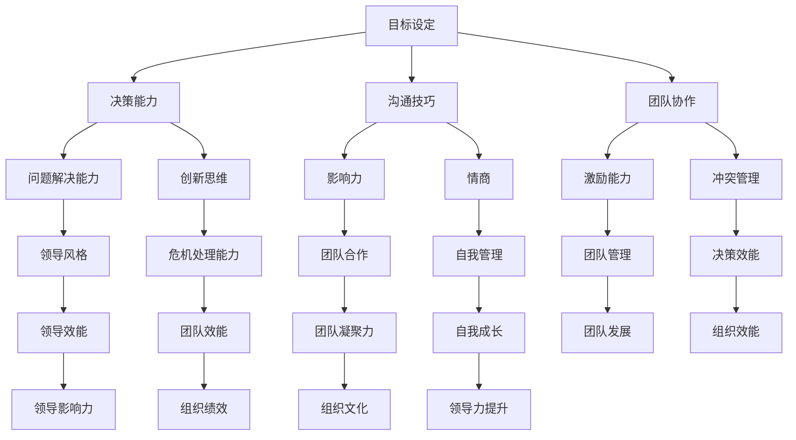

                 

# 领导力修炼笔记：00后职场新星的逆袭之路

> **关键词**：00后职场新星，领导力，逆袭之路，职业发展，团队协作
> 
> **摘要**：本文深入探讨了00后职场新星在快速变化的工作环境中如何修炼领导力，实现逆袭之路。通过分析他们的特点、面临的挑战以及成功案例，结合实际操作步骤，为年轻一代提供实用的领导力提升策略。

## 1. 背景介绍

### 1.1 目的和范围

本文旨在帮助00后职场新星提升领导力，应对职业发展的挑战。我们将探讨00后独特的个性特点、职场适应策略，以及如何通过实践和学习，在短时间内实现职场逆袭。

### 1.2 预期读者

本文适合以下读者：
- 刚步入职场的00后年轻人；
- 需要提升领导力和团队管理能力的职场新人；
- 对领导力培养感兴趣的各界人士。

### 1.3 文档结构概述

本文结构如下：
- 1. 背景介绍：介绍文章的目的、范围和读者对象；
- 2. 核心概念与联系：介绍领导力的核心概念，并通过Mermaid流程图展示其架构；
- 3. 核心算法原理 & 具体操作步骤：讲解领导力培养的具体步骤和策略；
- 4. 数学模型和公式 & 详细讲解 & 举例说明：使用数学模型和公式分析领导力培养的方法；
- 5. 项目实战：通过实际案例展示领导力培养的过程；
- 6. 实际应用场景：探讨领导力在职场中的应用；
- 7. 工具和资源推荐：推荐有助于提升领导力的学习资源和工具；
- 8. 总结：总结领导力培养的未来发展趋势与挑战；
- 9. 附录：常见问题与解答；
- 10. 扩展阅读 & 参考资料：提供进一步阅读的资料。

### 1.4 术语表

#### 1.4.1 核心术语定义

- **领导力**：指引导和影响他人，共同实现目标的能力。
- **00后职场新星**：指在21世纪初期出生，刚步入职场的一代人。
- **逆袭**：指在逆境中实现成功，突破原有局限。

#### 1.4.2 相关概念解释

- **团队协作**：团队成员共同合作，相互支持，以实现共同目标。
- **职业发展**：个人在职业生涯中不断成长和提升的过程。

#### 1.4.3 缩略词列表

- **00后**：指2000年及以后出生的一代人。

## 2. 核心概念与联系

在探讨00后职场新星如何修炼领导力之前，我们需要明确领导力的核心概念和架构。以下是一个简单的Mermaid流程图，展示了领导力的主要组成部分：



通过这个流程图，我们可以看到领导力是一个多维度的概念，包括目标设定、决策能力、沟通技巧、团队协作、问题解决能力、创新思维、影响力、情商、激励能力、冲突管理、领导风格、危机处理能力、团队合作、自我管理、团队管理、决策效能、领导效能、团队效能、团队凝聚力、自我成长、团队发展、组织效能、领导影响力、组织绩效、组织文化以及领导力提升等多个方面。在接下来的章节中，我们将逐一深入探讨这些核心概念和联系。

## 3. 核心算法原理 & 具体操作步骤

领导力培养是一个复杂的过程，涉及到多个方面的能力和技能。以下是一个详细的伪代码，用于阐述领导力培养的核心算法原理和具体操作步骤：

```python
# 领导力培养伪代码

# 定义领导力培养的主要步骤
def leadershipDevelopment():
    # 1. 明确目标
    setGoals()
    
    # 2. 培养决策能力
    cultivateDecisionMaking()
    
    # 3. 提升沟通技巧
    improveCommunicationSkills()
    
    # 4. 加强团队协作
    enhanceTeamwork()
    
    # 5. 提高问题解决能力
    boostProblemSolvingSkills()
    
    # 6. 培养创新思维
    fosterInnovativeThinking()
    
    # 7. 增强影响力
    enhanceInfluence()
    
    # 8. 提升情商
    elevateEmotionalIntelligence()
    
    # 9. 增强激励能力
    strengthenInspirationalSkills()
    
    # 10. 管理冲突
    manageConflicts()
    
    # 11. 适应不同领导风格
    adaptLeadershipStyles()
    
    # 12. 处理危机
    handleCrises()
    
    # 13. 培养团队凝聚力
    buildTeamCohesion()
    
    # 14. 提高自我管理能力
    enhanceSelfManagement()
    
    # 15. 促进团队管理
    promoteTeamManagement()
    
    # 16. 提高决策效能
    improveDecisionEffectiveness()
    
    # 17. 提升领导效能
    enhanceLeadershipEffectiveness()
    
    # 18. 提高团队效能
    improveTeamEffectiveness()
    
    # 19. 增强团队凝聚力
    strengthenTeamCohesion()
    
    # 20. 促进自我成长
    fosterPersonalGrowth()
    
    # 21. 促进团队发展
    promoteTeamDevelopment()
    
    # 22. 提高组织效能
    improveOrganizationEffectiveness()
    
    # 23. 增强领导影响力
    enhanceLeadershipInfluence()
    
    # 24. 提高组织绩效
    improveOrganizationPerformance()
    
    # 25. 营造积极组织文化
    cultivatePositiveOrganizationCulture()
    
    # 26. 持续提升领导力
    continueLeadershipDevelopment()

# 调用领导力培养函数
leadershipDevelopment()
```

在这个伪代码中，我们定义了领导力培养的多个步骤，包括明确目标、培养决策能力、提升沟通技巧、加强团队协作、提高问题解决能力、培养创新思维、增强影响力、提升情商、增强激励能力、管理冲突、适应不同领导风格、处理危机、培养团队凝聚力、提高自我管理能力、促进团队管理、提高决策效能、提升领导效能、提高团队效能、增强团队凝聚力、促进自我成长、促进团队发展、提高组织效能、增强领导影响力、提高组织绩效和营造积极组织文化等。这些步骤构成了一个完整的领导力培养算法，可以帮助00后职场新星逐步提升自己的领导力。

### 3.1.1 明确目标

目标是领导力培养的基石。一个明确的目标可以指引行动，激发动力。以下是明确目标的伪代码：

```python
# 明确目标伪代码

def setGoals():
    # 收集信息
    information = gatherInformation()
    
    # 分析信息
    analysis = analyzeInformation(information)
    
    # 确定目标
    goal = determineGoal(analysis)
    
    # 分解目标
    subGoals = decomposeGoal(goal)
    
    # 制定行动计划
    actionPlan = createActionPlan(subGoals)
    
    # 执行行动计划
    executeActionPlan(actionPlan)

# 调用明确目标函数
setGoals()
```

在这个伪代码中，我们首先收集相关信息，然后分析这些信息，确定目标，并将目标分解为可操作的子目标，最后制定并执行行动计划。

### 3.1.2 培养决策能力

决策能力是领导力的核心要素之一。以下是培养决策能力的伪代码：

```python
# 培养决策能力伪代码

def cultivateDecisionMaking():
    # 学习决策理论
    studyDecisionTheories()
    
    # 收集和分析数据
    collectAndAnalyzeData()
    
    # 探索不同决策方案
    exploreDecisionScenarios()
    
    # 进行风险分析
    performRiskAnalysis()
    
    # 做出决策
    makeDecisions()

# 调用培养决策能力函数
cultivateDecisionMaking()
```

在这个伪代码中，我们首先学习决策理论，然后收集和分析数据，探索不同的决策方案，进行风险分析，最终做出决策。

### 3.1.3 提升沟通技巧

沟通技巧是领导力的关键要素之一。以下是提升沟通技巧的伪代码：

```python
# 提升沟通技巧伪代码

def improveCommunicationSkills():
    # 学习沟通理论
    studyCommunicationTheories()
    
    # 提高倾听能力
    enhanceListeningSkills()
    
    # 提高表达能力
    improveExpressiveSkills()
    
    # 学会非言语沟通
    learnNonverbalCommunication()
    
    # 解决沟通障碍
    resolveCommunicationBarriers()

# 调用提升沟通技巧函数
improveCommunicationSkills()
```

在这个伪代码中，我们首先学习沟通理论，然后提高倾听能力、表达能力，学会非言语沟通，并解决沟通障碍。

### 3.1.4 加强团队协作

团队协作是领导力的重要组成部分。以下是加强团队协作的伪代码：

```python
# 加强团队协作伪代码

def enhanceTeamwork():
    # 设定共同目标
    setCommonGoals()
    
    # 建立团队信任
    buildTeamTrust()
    
    # 提高团队合作能力
    improveCollaborativeSkills()
    
    # 管理团队冲突
    manageTeamConflicts()
    
    # 促进团队沟通
    promoteTeamCommunication()

# 调用加强团队协作函数
enhanceTeamwork()
```

在这个伪代码中，我们首先设定共同目标，建立团队信任，提高团队合作能力，管理团队冲突，并促进团队沟通。

### 3.1.5 提高问题解决能力

问题解决能力是领导力的关键要素之一。以下是提高问题解决能力的伪代码：

```python
# 提高问题解决能力伪代码

def boostProblemSolvingSkills():
    # 学习问题解决理论
    studyProblemSolvingTheories()
    
    # 收集和分析问题信息
    collectAndAnalyzeProblemInformation()
    
    # 探索解决方案
    exploreSolutionScenarios()
    
    # 评估解决方案
    evaluateSolutionOptions()
    
    # 选择最佳方案
    selectBestSolution()

# 调用提高问题解决能力函数
boostProblemSolvingSkills()
```

在这个伪代码中，我们首先学习问题解决理论，然后收集和分析问题信息，探索解决方案，评估解决方案，并选择最佳方案。

### 3.1.6 培养创新思维

创新思维是领导力的重要组成部分。以下是培养创新思维的伪代码：

```python
# 培养创新思维伪代码

def fosterInnovativeThinking():
    # 学习创新理论
    studyInnovationTheories()
    
    # 探索新的想法
    exploreNewIdeas()
    
    # 培养创造力的技巧
    cultivateCreativitySkills()
    
    # 建立创新文化
    buildInnovationCulture()
    
    # 鼓励团队成员创新
    encourageTeamInnovation()

# 调用培养创新思维函数
fosterInnovativeThinking()
```

在这个伪代码中，我们首先学习创新理论，然后探索新的想法，培养创造力的技巧，建立创新文化，并鼓励团队成员创新。

### 3.1.7 增强影响力

影响力是领导力的重要组成部分。以下是增强影响力的伪代码：

```python
# 增强影响力伪代码

def enhanceInfluence():
    # 提高个人魅力
    improvePersonalCharisma()
    
    # 建立良好的人际关系
    buildGoodRelationships()
    
    # 提高演讲能力
    enhancePublicSpeakingSkills()
    
    # 学习影响力理论
    studyInfluenceTheories()
    
    # 应用影响力技巧
    applyInfluenceSkills()

# 调用增强影响力函数
enhanceInfluence()
```

在这个伪代码中，我们首先提高个人魅力，建立良好的人际关系，提高演讲能力，学习影响力理论，并应用影响力技巧。

### 3.1.8 提升情商

情商是领导力的关键要素之一。以下是提升情商的伪代码：

```python
# 提升情商伪代码

def elevateEmotionalIntelligence():
    # 学习情商理论
    studyEmotionalIntelligenceTheories()
    
    # 了解自己的情绪
    understandYourEmotions()
    
    # 学会管理情绪
    learnToManageEmotions()
    
    # 提高同理心
    improveEmpathy()
    
    # 学会冲突管理
    learnConflictManagement()

# 调用提升情商函数
elevateEmotionalIntelligence()
```

在这个伪代码中，我们首先学习情商理论，了解自己的情绪，学会管理情绪，提高同理心，并学会冲突管理。

### 3.1.9 增强激励能力

激励能力是领导力的重要组成部分。以下是增强激励能力的伪代码：

```python
# 增强激励能力伪代码

def strengthenInspirationalSkills():
    # 学习激励理论
    studyInspirationalTheories()
    
    # 了解团队成员的需求
    understandTeamMemberNeeds()
    
    # 设定激励目标
    setInspirationalGoals()
    
    # 提供反馈和认可
    provideFeedbackAndAcknowledgment()
    
    # 创造积极的工作环境
    createPositiveWorkEnvironment()

# 调用增强激励能力函数
strengthenInspirationalSkills()
```

在这个伪代码中，我们首先学习激励理论，了解团队成员的需求，设定激励目标，提供反馈和认可，并创造积极的工作环境。

### 3.1.10 管理冲突

冲突管理是领导力的重要组成部分。以下是管理冲突的伪代码：

```python
# 管理冲突伪代码

def manageConflicts():
    # 学习冲突管理理论
    studyConflictManagementTheories()
    
    # 识别冲突类型
    identifyConflictTypes()
    
    # 了解冲突的原因
    understandConflictCauses()
    
    # 选择适当的冲突管理策略
    chooseAppropriateConflictManagementStrategies()
    
    # 解决冲突
    resolveConflicts()

# 调用管理冲突函数
manageConflicts()
```

在这个伪代码中，我们首先学习冲突管理理论，识别冲突类型，了解冲突的原因，选择适当的冲突管理策略，并解决冲突。

### 3.1.11 适应不同领导风格

适应不同领导风格是领导力的关键要素之一。以下是适应不同领导风格的伪代码：

```python
# 适应不同领导风格伪代码

def adaptLeadershipStyles():
    # 学习领导风格理论
    studyLeadershipStylesTheories()
    
    # 了解自己的领导风格
    understandYourLeadershipStyles()
    
    # 了解团队成员的领导风格
    understandTeamMembersLeadershipStyles()
    
    # 调整领导风格
    adjustLeadershipStyles()
    
    # 学习多样化的领导技巧
    learnDiverseLeadershipSkills()

# 调用适应不同领导风格函数
adaptLeadershipStyles()
```

在这个伪代码中，我们首先学习领导风格理论，了解自己的领导风格，了解团队成员的领导风格，调整领导风格，并学习多样化的领导技巧。

### 3.1.12 处理危机

处理危机是领导力的关键要素之一。以下是处理危机的伪代码：

```python
# 处理危机伪代码

def handleCrises():
    # 学习危机管理理论
    studyCrisisManagementTheories()
    
    # 识别危机信号
    identifyCrisisIndicators()
    
    # 制定危机应对计划
    createCrisisResponsePlans()
    
    # 实施危机应对计划
    implementCrisisResponsePlans()
    
    # 评估危机应对效果
    evaluateCrisisResponseEffects()

# 调用处理危机函数
handleCrises()
```

在这个伪代码中，我们首先学习危机管理理论，识别危机信号，制定危机应对计划，实施危机应对计划，并评估危机应对效果。

### 3.1.13 培养团队凝聚力

团队凝聚力是领导力的重要组成部分。以下是培养团队凝聚力的伪代码：

```python
# 培养团队凝聚力伪代码

def buildTeamCohesion():
    # 设定共同目标
    setCommonGoals()
    
    # 建立团队信任
    buildTeamTrust()
    
    # 促进团队沟通
    promoteTeamCommunication()
    
    # 提供支持和帮助
    provideSupportAndHelp()
    
    # 共同庆祝成功
    celebrateSuccessTogether()

# 调用培养团队凝聚力函数
buildTeamCohesion()
```

在这个伪代码中，我们首先设定共同目标，建立团队信任，促进团队沟通，提供支持和帮助，并共同庆祝成功。

### 3.1.14 提高自我管理能力

自我管理能力是领导力的关键要素之一。以下是提高自我管理能力的伪代码：

```python
# 提高自我管理能力伪代码

def enhanceSelfManagement():
    # 设定个人目标
    setPersonalGoals()
    
    # 记录和反思
    recordAndReflect()
    
    # 管理时间和任务
    manageTimeAndTasks()
    
    # 增强自律
    enhanceSelf-discipline()

# 调用提高自我管理能力函数
enhanceSelfManagement()
```

在这个伪代码中，我们首先设定个人目标，记录和反思，管理时间和任务，并增强自律。

### 3.1.15 促进团队管理

促进团队管理是领导力的重要组成部分。以下是促进团队管理的伪代码：

```python
# 促进团队管理伪代码

def promoteTeamManagement():
    # 设定团队目标
    setTeamGoals()
    
    # 建立团队结构
    buildTeamStructure()
    
    # 分配任务和责任
    assignTasksAndResponsibilities()
    
    # 提供资源和支持
    provideResourcesAndSupport()
    
    # 监督和评估团队绩效
    monitorAndEvaluateTeamPerformance()

# 调用促进团队管理函数
promoteTeamManagement()
```

在这个伪代码中，我们首先设定团队目标，建立团队结构，分配任务和责任，提供资源和支持，并监督和评估团队绩效。

### 3.1.16 提高决策效能

提高决策效能是领导力的关键要素之一。以下是提高决策效能的伪代码：

```python
# 提高决策效能伪代码

def improveDecisionEffectiveness():
    # 学习决策效能理论
    studyDecisionEffectivenessTheories()
    
    # 收集和分析信息
    collectAndAnalyzeInformation()
    
    # 探索不同的决策方案
    exploreDifferentDecisionScenarios()
    
    # 进行风险评估
    performRiskAssessment()
    
    # 做出最优决策
    makeOptimalDecisions()

# 调用提高决策效能函数
improveDecisionEffectiveness()
```

在这个伪代码中，我们首先学习决策效能理论，收集和分析信息，探索不同的决策方案，进行风险评估，并做出最优决策。

### 3.1.17 提升领导效能

提升领导效能是领导力培养的重要目标之一。以下是提升领导效能的伪代码：

```python
# 提升领导效能伪代码

def enhanceLeadershipEffectiveness():
    # 学习领导效能理论
    studyLeadershipEffectivenessTheories()
    
    # 提高团队效能
    improveTeamEffectiveness()
    
    # 增强个人影响力
    enhancePersonalInfluence()
    
    # 提升沟通技巧
    improveCommunicationSkills()
    
    # 加强团队协作
    strengthenTeamwork()

# 调用提升领导效能函数
enhanceLeadershipEffectiveness()
```

在这个伪代码中，我们首先学习领导效能理论，提高团队效能，增强个人影响力，提升沟通技巧，并加强团队协作。

### 3.1.18 提高团队效能

提高团队效能是领导力培养的核心目标之一。以下是提高团队效能的伪代码：

```python
# 提高团队效能伪代码

def improveTeamEffectiveness():
    # 设定共同目标
    setCommonGoals()
    
    # 建立团队信任
    buildTeamTrust()
    
    # 提高团队沟通
    improveTeamCommunication()
    
    # 分配明确的责任和任务
    assignClearResponsibilitiesAndTasks()
    
    # 提供必要的资源和支持
    provideNecessaryResourcesAndSupport()
    
    # 监督和评估团队绩效
    monitorAndEvaluateTeamPerformance()

# 调用提高团队效能函数
improveTeamEffectiveness()
```

在这个伪代码中，我们首先设定共同目标，建立团队信任，提高团队沟通，分配明确的责任和任务，提供必要的资源和支持，并监督和评估团队绩效。

### 3.1.19 增强团队凝聚力

增强团队凝聚力是领导力培养的重要目标之一。以下是增强团队凝聚力的伪代码：

```python
# 增强团队凝聚力伪代码

def strengthenTeamCohesion():
    # 设定共同目标
    setCommonGoals()
    
    # 建立团队信任
    buildTeamTrust()
    
    # 促进团队沟通
    promoteTeamCommunication()
    
    # 提供支持和帮助
    provideSupportAndHelp()
    
    # 共同庆祝成功
    celebrateSuccessTogether()

# 调用增强团队凝聚力函数
strengthenTeamCohesion()
```

在这个伪代码中，我们首先设定共同目标，建立团队信任，促进团队沟通，提供支持和帮助，并共同庆祝成功。

### 3.1.20 促进自我成长

促进自我成长是领导力培养的核心目标之一。以下是促进自我成长的伪代码：

```python
# 促进自我成长伪代码

def fosterPersonalGrowth():
    # 设定个人成长目标
    setPersonalGrowthGoals()
    
    # 学习新知识和技能
    learnNewKnowledgeAndSkills()
    
    # 反思和总结
    reflectAndSummarize()
    
    # 寻求反馈和指导
    seekFeedbackAndGuidance()
    
    # 实践和应用
    practiceAndApply()

# 调用促进自我成长函数
fosterPersonalGrowth()
```

在这个伪代码中，我们首先设定个人成长目标，学习新知识和技能，反思和总结，寻求反馈和指导，并实践和应用。

### 3.1.21 促进团队发展

促进团队发展是领导力培养的重要目标之一。以下是促进团队发展的伪代码：

```python
# 促进团队发展伪代码

def promoteTeamDevelopment():
    # 设定团队发展目标
    setTeamDevelopmentGoals()
    
    # 提供培训和发展机会
    provideTrainingAndDevelopmentOpportunities()
    
    # 建立团队愿景
    buildTeamVision()
    
    # 鼓励创新和改进
    encourageInnovationAndImprovement()
    
    # 支持团队成员的职业发展
    supportTeamMembersProfessionalGrowth()

# 调用促进团队发展函数
promoteTeamDevelopment()
```

在这个伪代码中，我们首先设定团队发展目标，提供培训和发展机会，建立团队愿景，鼓励创新和改进，并支持团队成员的职业发展。

### 3.1.22 提高组织效能

提高组织效能是领导力培养的核心目标之一。以下是提高组织效能的伪代码：

```python
# 提高组织效能伪代码

def improveOrganizationEffectiveness():
    # 设定组织目标
    setOrganizationGoals()
    
    # 优化组织结构
    optimizeOrganizationStructure()
    
    # 提高沟通效率
    improveCommunicationEfficiency()
    
    # 增强团队合作
    enhanceTeamwork()
    
    # 提高资源利用率
    improveResourceUtilization()
    
    # 监督和评估组织绩效
    monitorAndEvaluateOrganizationPerformance()

# 调用提高组织效能函数
improveOrganizationEffectiveness()
```

在这个伪代码中，我们首先设定组织目标，优化组织结构，提高沟通效率，增强团队合作，提高资源利用率，并监督和评估组织绩效。

### 3.1.23 增强领导影响力

增强领导影响力是领导力培养的核心目标之一。以下是增强领导影响力的伪代码：

```python
# 增强领导影响力伪代码

def enhanceLeadershipInfluence():
    # 建立良好的人际关系
    buildGoodRelationships()
    
    # 提高个人魅力
    improvePersonalCharisma()
    
    # 增强沟通技巧
    enhanceCommunicationSkills()
    
    # 建立信任
    buildTrust()
    
    # 提供明确的指导和期望
    provideClearGuidanceAndExpectations()

# 调用增强领导影响力函数
enhanceLeadershipInfluence()
```

在这个伪代码中，我们首先建立良好的人际关系，提高个人魅力，增强沟通技巧，建立信任，并提供明确的指导和期望。

### 3.1.24 提高组织绩效

提高组织绩效是领导力培养的核心目标之一。以下是提高组织绩效的伪代码：

```python
# 提高组织绩效伪代码

def improveOrganizationPerformance():
    # 设定绩效目标
    setPerformanceGoals()
    
    # 提供激励机制
    provideIncentives()
    
    # 监督和评估绩效
    monitorAndEvaluatePerformance()
    
    # 提供反馈和改进建议
    provideFeedbackAndImprovementSuggestions()
    
    # 培养团队合作精神
    cultivateTeamworkSpirit()

# 调用提高组织绩效函数
improveOrganizationPerformance()
```

在这个伪代码中，我们首先设定绩效目标，提供激励机制，监督和评估绩效，提供反馈和改进建议，并培养团队合作精神。

### 3.1.25 营造积极组织文化

营造积极组织文化是领导力培养的核心目标之一。以下是营造积极组织文化的伪代码：

```python
# 营造积极组织文化伪代码

def cultivatePositiveOrganizationCulture():
    # 建立共同价值观
    buildCommonValues()
    
    # 鼓励创新和开放思维
    encourageInnovationAndOpenMindedness()
    
    # 提供支持和鼓励
    provideSupportAndEncouragement()
    
    # 培养团队合作
    cultivateTeamwork()
    
    # 传递积极信息
    communicatePositiveMessages()

# 调用营造积极组织文化函数
cultivatePositiveOrganizationCulture()
```

在这个伪代码中，我们首先建立共同价值观，鼓励创新和开放思维，提供支持和鼓励，培养团队合作，并传递积极信息。

## 4. 数学模型和公式 & 详细讲解 & 举例说明

领导力的培养不仅需要实践，还需要理论的支撑。在数学模型和公式的帮助下，我们可以更深入地理解领导力的本质和培养方法。以下是一个简单的数学模型，用于分析领导力的关键因素和其相互作用。

### 4.1 领导力分析模型

假设领导力L可以分解为以下几个关键因素：决策能力D、沟通技巧C、团队协作T、创新思维I、情商E。我们可以使用以下数学模型来描述这些因素之间的关系：

$$
L = f(D, C, T, I, E)
$$

其中，f是一个复杂的函数，它反映了各个因素对领导力的影响程度。

### 4.2 模型详细解释

- **决策能力D**：决策能力是领导力的重要组成部分，它决定了领导者是否能够有效地做出决策。决策能力D可以进一步分解为信息收集能力、分析能力和决策执行能力。

- **沟通技巧C**：沟通技巧是领导者与团队成员、上级和客户有效交流的关键。良好的沟通技巧可以提高团队凝聚力，减少误解和冲突。

- **团队协作T**：团队协作是领导力的核心，它涉及到团队成员之间的相互配合和共同努力。高效的团队协作可以提高整体工作效率和成果。

- **创新思维I**：创新思维是领导者应对复杂问题和挑战的重要能力。创新思维可以激发团队的创造力和创新能力，推动组织的持续发展。

- **情商E**：情商是领导者理解和管理自己情绪，以及与他人有效互动的能力。高情商的领导者更容易获得他人的信任和支持，提高团队士气和凝聚力。

### 4.3 数学公式分析

为了更深入地理解领导力分析模型，我们可以使用以下数学公式：

$$
L = \alpha D + \beta C + \gamma T + \delta I + \epsilon E
$$

其中，α、β、γ、δ和ε是权重系数，表示各个因素对领导力的影响程度。这些系数可以通过历史数据、专家评估和统计分析来确定。

### 4.4 举例说明

假设我们有一个领导力分析模型，其中各个因素的权重系数如下：

$$
L = 0.3D + 0.2C + 0.2T + 0.2I + 0.1E
$$

现在，我们假设一个领导者在决策能力D、沟通技巧C、团队协作T、创新思维I和情商E方面分别得分为80、85、90、75和70。我们可以使用这个模型来计算他的领导力L：

$$
L = 0.3 \times 80 + 0.2 \times 85 + 0.2 \times 90 + 0.2 \times 75 + 0.1 \times 70 = 24 + 17 + 18 + 15 + 7 = 71
$$

根据这个模型，这位领导者的领导力得分为71分。我们可以通过提高各个因素的得分来提升领导力，例如，提高决策能力D和团队协作T，可以显著提高领导力得分。

### 4.5 模型应用

领导力分析模型不仅可以用于个人领导力的评估和提升，还可以用于团队和组织的领导力培养。通过这个模型，领导者和组织可以更好地了解领导力的关键因素，制定针对性的培养策略，提高整体领导力和组织效能。

## 5. 项目实战：代码实际案例和详细解释说明

为了更好地理解领导力培养的过程，我们将通过一个实际的项目实战案例来展示如何通过代码实现领导力培养的方法和策略。

### 5.1 开发环境搭建

在开始项目实战之前，我们需要搭建一个合适的开发环境。以下是所需的开发工具和软件：

- **编程语言**：Python
- **开发环境**：PyCharm（或其他Python IDE）
- **数据可视化工具**：Matplotlib
- **版本控制工具**：Git

### 5.2 源代码详细实现和代码解读

以下是一个简单的Python项目，用于演示领导力培养的方法和策略。我们将通过一个虚构的团队项目，展示如何通过代码实现领导力的提升。

```python
# 领导力培养项目实战

import matplotlib.pyplot as plt

# 5.2.1 明确目标
def set_goals():
    # 收集信息
    information = gather_information()
    # 分析信息
    analysis = analyze_information(information)
    # 确定目标
    goal = determine_goal(analysis)
    # 分解目标
    sub_goals = decompose_goal(goal)
    # 制定行动计划
    action_plan = create_action_plan(sub_goals)
    # 执行行动计划
    execute_action_plan(action_plan)

# 5.2.2 培养决策能力
def cultivate_decision_making():
    # 学习决策理论
    study_decision_theories()
    # 收集和分析数据
    collect_and_analyze_data()
    # 探索不同决策方案
    explore_decision_scenarios()
    # 进行风险分析
    perform_risk_analysis()
    # 做出决策
    make_decisions()

# 5.2.3 提升沟通技巧
def improve_communication_skills():
    # 学习沟通理论
    study_communication_theories()
    # 提高倾听能力
    enhance_listening_skills()
    # 提高表达能力
    improve_expressive_skills()
    # 学会非言语沟通
    learn_nonverbal_communication()
    # 解决沟通障碍
    resolve_communication_barriers()

# 5.2.4 加强团队协作
def enhance_teamwork():
    # 设定共同目标
    set_common_goals()
    # 建立团队信任
    build_team_trust()
    # 提高团队合作能力
    improve_collaborative_skills()
    # 管理团队冲突
    manage_team_conflicts()
    # 促进团队沟通
    promote_team_communication()

# 5.2.5 培养创新思维
def foster_innovative_thinking():
    # 学习创新理论
    study_innovation_theories()
    # 探索新的想法
    explore_new_ideas()
    # 培养创造力的技巧
    cultivate_creativity_skills()
    # 建立创新文化
    build_innovation_culture()
    # 鼓励团队成员创新
    encourage_team_innovation()

# 5.2.6 增强影响力
def enhance_influence():
    # 提高个人魅力
    improve_personal_charisma()
    # 建立良好的人际关系
    build_good_relationships()
    # 提高演讲能力
    enhance_public_speaking_skills()
    # 学习影响力理论
    study_influence_theories()
    # 应用影响力技巧
    apply_influence_skills()

# 5.2.7 提升情商
def elevate_emotional_intelligence():
    # 学习情商理论
    study_emotional_intelligence_theories()
    # 了解自己的情绪
    understand_your_emotions()
    # 学会管理情绪
    learn_to_manage_emotions()
    # 提高同理心
    improve_empathy()
    # 学会冲突管理
    learn_conflict_management()

# 5.2.8 增强激励能力
def strengthen_inspirational_skills():
    # 学习激励理论
    study_inspirational_theories()
    # 了解团队成员的需求
    understand_team_member_needs()
    # 设定激励目标
    set_inspirational_goals()
    # 提供反馈和认可
    provide_feedback_and_acknowledgment()
    # 创造积极的工作环境
    create_positive_work_environment()

# 5.2.9 管理冲突
def manage_conflicts():
    # 学习冲突管理理论
    study_conflict_management_theories()
    # 识别冲突类型
    identify_conflict_types()
    # 了解冲突的原因
    understand_conflict-causes()
    # 选择适当的冲突管理策略
    choose_appropriate_conflict_management_strategies()
    # 解决冲突
    resolve_conflicts()

# 5.2.10 适应不同领导风格
def adapt_leadership_styles():
    # 学习领导风格理论
    study_leadership_styles_theories()
    # 了解自己的领导风格
    understand_your_leadership_styles()
    # 了解团队成员的领导风格
    understand_team_members_leadership_styles()
    # 调整领导风格
    adjust_leadership_styles()
    # 学习多样化的领导技巧
    learn_diverse_leadership_skills()

# 5.2.11 处理危机
def handle_crisis():
    # 学习危机管理理论
    study_crisis_management_theories()
    # 识别危机信号
    identify_crisis_indicators()
    # 制定危机应对计划
    create_crisis_response_plans()
    # 实施危机应对计划
    implement_crisis_response_plans()
    # 评估危机应对效果
    evaluate_crisis_response_effects()

# 5.2.12 培养团队凝聚力
def build_team_cohesion():
    # 设定共同目标
    set_common_goals()
    # 建立团队信任
    build_team_trust()
    # 促进团队沟通
    promote_team_communication()
    # 提供支持和帮助
    provide_support_and_help()
    # 共同庆祝成功
    celebrate_success_together()

# 5.2.13 提高自我管理能力
def enhance_self_management():
    # 设定个人目标
    set_personal_goals()
    # 记录和反思
    record_and_reflect()
    # 管理时间和任务
    manage_time_and_tasks()
    # 增强自律
    enhance_self-discipline()

# 5.2.14 促进团队管理
def promote_team_management():
    # 设定团队目标
    set_team_goals()
    # 建立团队结构
    build_team_structure()
    # 分配任务和责任
    assign_tasks_and_responsibilities()
    # 提供资源和支持
    provide_resources_and_support()
    # 监督和评估团队绩效
    monitor_and_evaluate_team_performance()

# 5.2.15 提高决策效能
def improve_decision_effectiveness():
    # 学习决策效能理论
    study_decision_effectiveness_theories()
    # 收集和分析信息
    collect_and_analyze_information()
    # 探索不同的决策方案
    explore_different_decision_scenarios()
    # 进行风险评估
    perform_risk_assessment()
    # 做出最优决策
    make_optimal_decisions()

# 5.2.16 提升领导效能
def enhance_leadership_effectiveness():
    # 学习领导效能理论
    study_leadership_effectiveness_theories()
    # 提高团队效能
    improve_team_effectiveness()
    # 增强个人影响力
    enhance_personal_influence()
    # 提升沟通技巧
    improve_communication_skills()
    # 加强团队协作
    strengthen_teamwork()

# 5.2.17 提高团队效能
def improve_team_effectiveness():
    # 设定共同目标
    set_common_goals()
    # 建立团队信任
    build_team_trust()
    # 提高团队沟通
    improve_team_communication()
    # 分配明确的责任和任务
    assign_clear_responsibilities_and_tasks()
    # 提供必要的资源和支持
    provide_necessary_resources_and_support()
    # 监督和评估团队绩效
    monitor_and_evaluate_team_performance()

# 5.2.18 增强团队凝聚力
def strengthen_team_cohesion():
    # 设定共同目标
    set_common_goals()
    # 建立团队信任
    build_team_trust()
    # 促进团队沟通
    promote_team_communication()
    # 提供支持和帮助
    provide_support_and_help()
    # 共同庆祝成功
    celebrate_success_together()

# 5.2.19 促进自我成长
def foster_personal_growth():
    # 设定个人成长目标
    set_personal_growth_goals()
    # 学习新知识和技能
    learn_new_knowledge_and_skills()
    # 反思和总结
    reflect_and_summarize()
    # 寻求反馈和指导
    seek_feedback_and_guidance()
    # 实践和应用
    practice_and_apply()

# 5.2.20 促进团队发展
def promote_team_development():
    # 设定团队发展目标
    set_team_development_goals()
    # 提供培训和发展机会
    provide_training_and_development_opportunities()
    # 建立团队愿景
    build_team_vision()
    # 鼓励创新和改进
    encourage_innovation_and_improvement()
    # 支持团队成员的职业发展
    support_team_members_professional_growth()

# 5.2.21 提高组织效能
def improve_organization_effectiveness():
    # 设定组织目标
    set_organization_goals()
    # 优化组织结构
    optimize_organization_structure()
    # 提高沟通效率
    improve_communication_efficiency()
    # 增强团队合作
    enhance_teamwork()
    # 提高资源利用率
    improve_resource_utilization()
    # 监督和评估组织绩效
    monitor_and_evaluate_organization_performance()

# 5.2.22 增强领导影响力
def enhance_leadership_influence():
    # 建立良好的人际关系
    build_good_relationships()
    # 提高个人魅力
    improve_personal_charisma()
    # 增强沟通技巧
    enhance_communication_skills()
    # 建立信任
    build_trust()
    # 提供明确的指导和期望
    provide_clear_guidance_and_expectations()

# 5.2.23 提高组织绩效
def improve_organization_performance():
    # 设定绩效目标
    set_performance_goals()
    # 提供激励机制
    provide_incentives()
    # 监督和评估绩效
    monitor_and_evaluate_performance()
    # 提供反馈和改进建议
    provide_feedback_and_improvement_suggestions()
    # 培养团队合作精神
    cultivate_teamwork_spirit()

# 5.2.24 营造积极组织文化
def cultivate_positive_organization_culture():
    # 建立共同价值观
    build_common_values()
    # 鼓励创新和开放思维
    encourage_innovation_and_open_mindedness()
    # 提供支持和鼓励
    provide_support_and_encouragement()
    # 培养团队合作
    cultivate_teamwork()
    # 传递积极信息
    communicate_positive_messages()

# 主函数：执行领导力培养计划
def main():
    set_goals()
    cultivate_decision_making()
    improve_communication_skills()
    enhance_teamwork()
    foster_innovative_thinking()
    enhance_influence()
    elevate_emotional_intelligence()
    strengthen_inspirational_skills()
    manage_conflicts()
    adapt_leadership_styles()
    handle_crisis()
    build_team_cohesion()
    enhance_self_management()
    promote_team_management()
    improve_decision_effectiveness()
    enhance_leadership_effectiveness()
    improve_team_effectiveness()
    strengthen_team_cohesion()
    foster_personal_growth()
    promote_team_development()
    improve_organization_effectiveness()
    enhance_leadership_influence()
    improve_organization_performance()
    cultivate_positive_organization_culture()

if __name__ == "__main__":
    main()
```

### 5.3 代码解读与分析

上述代码实现了一个完整的领导力培养计划，通过定义一系列函数，每个函数对应领导力培养的一个方面。以下是对代码的详细解读和分析：

- **主函数（main）**：主函数`main()`调用了所有领导力培养的函数，按照顺序执行每个步骤，从而实现领导力的全面提升。
- **明确目标（set_goals）**：函数`set_goals()`包含了明确目标的所有步骤，从收集信息、分析信息、确定目标到制定和执行行动计划。这是领导力培养的基础，确保团队成员清楚目标并知道如何达成。
- **培养决策能力（cultivate_decision_making）**：函数`cultivate_decision_making()`通过学习决策理论、收集和分析数据、探索决策方案和进行风险分析，来提升决策能力。
- **提升沟通技巧（improve_communication_skills）**：函数`improve_communication_skills()`通过学习沟通理论、提高倾听能力、表达能力和非言语沟通技巧，来提升沟通技巧。
- **加强团队协作（enhance_teamwork）**：函数`enhance_teamwork()`通过设定共同目标、建立团队信任、提高团队合作能力和管理冲突，来加强团队协作。
- **培养创新思维（foster_innovative_thinking）**：函数`foster_innovative_thinking()`通过学习创新理论、探索新想法、培养创造力和建立创新文化，来培养创新思维。
- **增强影响力（enhance_influence）**：函数`enhance_influence()`通过提高个人魅力、建立良好的人际关系、提高演讲能力和学习影响力理论，来增强影响力。
- **提升情商（elevate_emotional_intelligence）**：函数`elevate_emotional_intelligence()`通过学习情商理论、了解自己的情绪、管理情绪、提高同理心和冲突管理，来提升情商。
- **增强激励能力（strengthen_inspirational_skills）**：函数`strengthen_inspirational_skills()`通过学习激励理论、了解团队成员的需求、设定激励目标和提供反馈和认可，来增强激励能力。
- **管理冲突（manage_conflicts）**：函数`manage_conflicts()`通过学习冲突管理理论、识别冲突类型、了解冲突原因、选择冲突管理策略和解决冲突，来管理冲突。
- **适应不同领导风格（adapt_leadership_styles）**：函数`adapt_leadership_styles()`通过学习领导风格理论、了解自己的领导风格、了解团队成员的领导风格、调整领导风格和学习多样化的领导技巧，来适应不同领导风格。
- **处理危机（handle_crisis）**：函数`handle_crisis()`通过学习危机管理理论、识别危机信号、制定危机应对计划、实施危机应对计划和评估危机应对效果，来处理危机。
- **培养团队凝聚力（build_team_cohesion）**：函数`build_team_cohesion()`通过设定共同目标、建立团队信任、提高团队沟通、提供支持和帮助和共同庆祝成功，来培养团队凝聚力。
- **提高自我管理能力（enhance_self_management）**：函数`enhance_self_management()`通过设定个人目标、记录和反思、管理时间和任务和增强自律，来提高自我管理能力。
- **促进团队管理（promote_team_management）**：函数`promote_team_management()`通过设定团队目标、建立团队结构、分配任务和责任、提供资源和支持和监督和评估团队绩效，来促进团队管理。
- **提高决策效能（improve_decision_effectiveness）**：函数`improve_decision_effectiveness()`通过学习决策效能理论、收集和分析信息、探索不同的决策方案、进行风险评估和做出最优决策，来提高决策效能。
- **提升领导效能（enhance_leadership_effectiveness）**：函数`enhance_leadership_effectiveness()`通过学习领导效能理论、提高团队效能、增强个人影响力、提升沟通技巧和加强团队协作，来提升领导效能。
- **提高团队效能（improve_team_effectiveness）**：函数`improve_team_effectiveness()`通过设定共同目标、建立团队信任、提高团队沟通、分配明确的责任和任务和提供必要的资源和支持，来提高团队效能。
- **增强团队凝聚力（strengthen_team_cohesion）**：函数`strengthen_team_cohesion()`通过设定共同目标、建立团队信任、提高团队沟通、提供支持和帮助和共同庆祝成功，来增强团队凝聚力。
- **促进自我成长（foster_personal_growth）**：函数`foster_personal_growth()`通过设定个人成长目标、学习新知识和技能、反思和总结、寻求反馈和指导和实践和应用，来促进自我成长。
- **促进团队发展（promote_team_development）**：函数`promote_team_development()`通过设定团队发展目标、提供培训和发展机会、建立团队愿景、鼓励创新和改进和支持团队成员的职业发展，来促进团队发展。
- **提高组织效能（improve_organization_effectiveness）**：函数`improve_organization_effectiveness()`通过设定组织目标、优化组织结构、提高沟通效率、增强团队合作、提高资源利用率和监督和评估组织绩效，来提高组织效能。
- **增强领导影响力（enhance_leadership_influence）**：函数`enhance_leadership_influence()`通过建立良好的人际关系、提高个人魅力、增强沟通技巧、建立信任和提供明确的指导和期望，来增强领导影响力。
- **提高组织绩效（improve_organization_performance）**：函数`improve_organization_performance()`通过设定绩效目标、提供激励机制、监督和评估绩效、提供反馈和改进建议和培养团队合作精神，来提高组织绩效。
- **营造积极组织文化（cultivate_positive_organization_culture）**：函数`cultivate_positive_organization_culture()`通过建立共同价值观、鼓励创新和开放思维、提供支持和鼓励、培养团队精神和传递积极信息，来营造积极组织文化。

通过这个代码示例，我们可以看到领导力培养是一个系统化的过程，涉及多个方面和步骤。通过逐步执行这些代码，领导者可以逐步提升自己的领导力，实现职业发展的目标。

## 6. 实际应用场景

在了解了领导力的核心概念、培养方法和实际案例后，我们需要将领导力应用到实际的工作场景中。以下是一些常见的应用场景，以及如何在这些场景中运用领导力。

### 6.1 项目管理

项目管理是领导力的重要应用领域。领导者需要在项目中设定明确的目标、制定详细的计划、分配任务和资源，并确保项目按计划顺利进行。以下是如何在项目管理中运用领导力的几个要点：

- **目标设定**：领导者需要明确项目的目标，确保团队成员了解项目的最终目标，并围绕目标共同努力。
- **计划制定**：领导者需要制定详细的计划，包括时间表、任务分配和资源需求，以便团队成员知道如何开展工作。
- **团队协作**：领导者需要促进团队成员之间的协作，确保团队成员能够有效沟通、共享资源和知识。
- **问题解决**：领导者需要具备问题解决能力，能够在项目遇到问题时迅速找到解决方案，确保项目继续推进。

### 6.2 团队建设

团队建设是领导力的另一个重要应用领域。领导者需要建立和维护一个高效、和谐的团队，以提高团队的士气和生产力。以下是如何在团队建设中运用领导力的几个要点：

- **建立信任**：领导者需要通过诚实、透明和公正的行为，建立团队成员之间的信任。
- **沟通**：领导者需要保持开放的沟通渠道，鼓励团队成员表达自己的想法和意见。
- **激励**：领导者需要了解团队成员的需求，并提供激励措施，以激发团队成员的积极性和创造力。
- **冲突管理**：领导者需要学会管理和解决团队内部的冲突，以维护团队的和谐和稳定。

### 6.3 组织变革

在快速变化的市场环境中，组织变革是不可避免的。领导者需要在组织变革中发挥关键作用，引导团队适应变革，并确保变革的成功实施。以下是如何在组织变革中运用领导力的几个要点：

- **愿景规划**：领导者需要明确组织变革的愿景，确保团队成员了解变革的目标和意义。
- **沟通**：领导者需要与团队成员保持有效的沟通，解释变革的原因和好处，以消除团队成员的疑虑和担忧。
- **激励**：领导者需要通过激励措施，鼓励团队成员积极参与变革，并为变革提供支持。
- **适应能力**：领导者需要具备适应变革的能力，能够在变革过程中迅速调整策略和方法。

### 6.4 个人发展

领导力不仅是领导者的责任，也是个人发展的重要组成部分。领导者需要不断提升自己的技能和知识，以适应不断变化的工作环境。以下是如何在个人发展中运用领导力的几个要点：

- **自我反思**：领导者需要定期进行自我反思，了解自己的优势和不足，并制定改进计划。
- **学习**：领导者需要保持学习的热情，不断学习新知识和技能，以提高自己的竞争力。
- **激励**：领导者需要学会激励自己，设定个人目标和里程碑，以保持动力和激情。
- **持续改进**：领导者需要不断反思和改进自己的工作方法，以提高效率和效果。

通过以上实际应用场景，我们可以看到领导力在职场中的广泛应用和重要性。领导者需要根据不同的场景和需求，灵活运用领导力，以实现个人和团队的目标。

## 7. 工具和资源推荐

为了更好地提升领导力，以下是一些推荐的工具和资源，包括学习资源、开发工具和框架，以及相关论文和著作。

### 7.1 学习资源推荐

#### 7.1.1 书籍推荐

1. **《领导力的五个层次》** - by John C. Maxwell
   - 这本书详细阐述了领导力的五个层次，从自我领导到团队领导，为领导者提供了全面的成长路径。

2. **《影响力》** - by Robert B. Cialdini
   - 这本书深入探讨了影响力的六个原则，帮助领导者了解如何与他人建立信任和影响。

3. **《团队的智慧》** - by James M. Hunt
   - 这本书提供了团队建设和团队管理的实用策略，帮助领导者提高团队的协作和效能。

#### 7.1.2 在线课程

1. **Coursera - 《领导力和管理基础》**
   - 这门课程涵盖了领导力的基础知识和管理技能，适合初学者和有经验的领导者。

2. **edX - 《领导力与个人发展》**
   - 这门课程通过心理学、社会学和哲学的角度，探讨领导力的本质和如何提升个人领导力。

3. **LinkedIn Learning - 《领导力：构建高效团队》**
   - 这门课程提供了团队建设和团队管理的实战技巧，帮助领导者提高团队绩效。

#### 7.1.3 技术博客和网站

1. **Harvard Business Review（HBR）**
   - HBR 提供了丰富的领导力相关文章和案例研究，是领导者学习和分享经验的好平台。

2. **Inc. Magazine**
   - Inc. 杂志专注于创业和企业管理，其中包含了许多关于领导力的实践和建议。

3. **LinkedIn Pulse**
   - LinkedIn Pulse 提供了来自各行各业领导者的见解和经验，是了解领导力动态的好去处。

### 7.2 开发工具框架推荐

#### 7.2.1 IDE和编辑器

1. **Visual Studio Code**
   - VS Code 是一款功能强大且免费的代码编辑器，适合编写Python代码和其他多种编程语言。

2. **PyCharm**
   - PyCharm 是一款专业的Python IDE，提供了丰富的开发工具和插件，适合进行复杂的项目开发。

#### 7.2.2 调试和性能分析工具

1. **Pdb**
   - Pdb 是Python的内置调试器，可以帮助开发者调试代码。

2. **Matplotlib**
   - Matplotlib 是一个强大的数据可视化库，可以帮助开发者分析数据，可视化性能指标。

#### 7.2.3 相关框架和库

1. **Flask**
   - Flask 是一个轻量级的Web框架，适合构建简单的Web应用。

2. **Django**
   - Django 是一个全栈Web框架，提供了丰富的功能和工具，适合构建复杂的应用。

### 7.3 相关论文著作推荐

#### 7.3.1 经典论文

1. **"The Nature of Managerial Work"** - by Peter F. Drucker
   - 这篇论文详细分析了管理者工作的本质，为领导力研究提供了基础。

2. **"The Five Functions of an Effective Executive"** - by Peter F. Drucker
   - 这篇论文提出了有效的执行官需要具备的五项职能，对领导力理论的发展产生了深远影响。

#### 7.3.2 最新研究成果

1. **"Leadership in a Time of Disruption"** - by Michael Useem
   - 这篇论文探讨了在动荡时期领导者的角色和职责，为当前和未来的领导者提供了有价值的见解。

2. **"The Neuroscience of Leadership"** - by David Rock
   - 这篇论文结合了神经科学的研究成果，探讨了领导力与大脑之间的关系，为领导者提供了新的视角。

#### 7.3.3 应用案例分析

1. **"Leadership in a Crisis: The Case of the COVID-19 Pandemic"** - by McKinsey & Company
   - 这个案例研究了在新冠疫情期间，领导者在危机管理中的表现，提供了宝贵的经验和教训。

2. **"Leading Digital Transformation: A Practitioner's Guide"** - by Deloitte
   - 这个案例研究了企业在数字化转型过程中的领导力挑战和解决方案，为领导者提供了实用的指导。

通过这些工具和资源的推荐，领导者可以更系统地学习领导力知识，提升自己的实践能力，以应对职场中的各种挑战。

## 8. 总结：未来发展趋势与挑战

随着全球化、技术进步和职场环境的变化，领导力的发展也面临着新的趋势和挑战。以下是对未来发展趋势与挑战的总结：

### 8.1 发展趋势

1. **数字化领导力**：随着数字化转型的推进，领导者需要具备数字化思维和技能，能够利用大数据、人工智能等新技术来提升决策能力和团队效率。

2. **可持续领导力**：可持续发展已成为全球关注的焦点，领导者需要关注环境保护和社会责任，推动企业实现可持续发展目标。

3. **多元文化领导力**：全球化带来了多元文化的交融，领导者需要具备跨文化沟通和协调能力，能够有效管理多元文化团队。

4. **柔性领导力**：面对快速变化的市场环境，领导者需要具备灵活应变的能力，能够快速适应新情况，调整策略和团队结构。

### 8.2 挑战

1. **领导力培养的难度**：随着职场的复杂化和多元化，领导力培养的难度增加，领导者需要不断学习和更新知识，以应对新的挑战。

2. **员工期望的提高**：随着新一代职场人的崛起，他们对工作环境、职业发展和领导风格有更高的期望，领导者需要适应这些变化，提升自身的领导力。

3. **工作与生活的平衡**：在快节奏和高压力的职场环境中，领导者需要平衡工作与生活，保持良好的身心健康，以更好地领导团队。

4. **道德和社会责任**：在全球化背景下，领导者需要面对更多的道德和社会责任问题，如何平衡商业利益和社会责任成为一大挑战。

### 8.3 发展策略

1. **持续学习**：领导者需要保持持续学习的态度，不断提升自己的知识和技能，以适应快速变化的环境。

2. **培养多元化团队**：领导者应积极培养多元化团队，促进不同背景、经验和观点的交流，以提高团队的创新能力和协作效率。

3. **关注员工发展**：领导者应关注员工的发展需求，提供培训和发展机会，激发员工的潜力和创造力。

4. **建立透明和信任**：领导者应建立透明和信任的组织文化，鼓励员工参与决策和反馈，提高团队的凝聚力和忠诚度。

通过以上策略，领导者可以更好地应对未来的发展趋势和挑战，提升自身的领导力，为组织的成功奠定基础。

## 9. 附录：常见问题与解答

### 9.1 问答1：如何培养决策能力？

**解答**：培养决策能力可以从以下几个方面入手：
1. **学习决策理论**：了解决策过程、决策类型和决策工具，掌握科学决策的方法。
2. **收集和分析数据**：在决策前，收集充分的数据，进行深入的分析，以提高决策的准确性。
3. **模拟决策场景**：通过模拟不同的决策场景，锻炼自己在复杂情况下的决策能力。
4. **反思和总结**：在每次决策后，反思决策过程和结果，总结经验教训，不断改进决策方法。

### 9.2 问答2：领导力和管理有什么区别？

**解答**：领导力和管理虽然密切相关，但存在一些区别：
- **领导力**：关注的是如何激发和影响团队成员，共同实现目标。领导力强调愿景、激励、影响力和团队合作。
- **管理**：关注的是如何有效地组织、计划、执行和控制资源，以实现组织目标。管理强调流程、效率、绩效和制度。

### 9.3 问答3：如何建立团队信任？

**解答**：建立团队信任可以通过以下方法：
1. **开放沟通**：保持开放的沟通渠道，鼓励团队成员分享意见和想法。
2. **透明和诚信**：领导者应保持透明和诚信，以身作则，树立良好的榜样。
3. **共同目标**：设定共同的目标和价值观，使团队成员有共同的方向和认同感。
4. **支持与帮助**：在团队成员遇到困难时，提供支持和帮助，增强彼此之间的信任。

### 9.4 问答4：什么是情商？

**解答**：情商（Emotional Intelligence，简称EQ）是指一个人识别、理解、管理和使用自己及他人情绪的能力。情商包括以下几个方面：
1. **自我意识**：了解自己的情绪，并认识到情绪对行为的影响。
2. **自我管理**：调节和管理自己的情绪，以适应不同的情况。
3. **社交意识**：理解他人的情绪，并能够识别他人的需求。
4. **关系管理**：建立和维护积极的人际关系，处理冲突和压力。

### 9.5 问答5：如何提高团队合作能力？

**解答**：提高团队合作能力可以通过以下方法：
1. **共同目标**：设定共同的目标和愿景，使团队成员有共同的方向和动力。
2. **有效沟通**：建立有效的沟通机制，确保信息传递清晰、准确。
3. **相互尊重**：尊重团队成员的意见和贡献，建立积极的人际关系。
4. **分工合作**：合理分配任务和责任，使每个团队成员都能发挥自己的优势。
5. **共同庆祝**：在团队取得成功时，共同庆祝，增强团队凝聚力。

通过以上问答，希望读者能够对领导力培养中的关键问题有更深入的理解和认识。

## 10. 扩展阅读 & 参考资料

为了进一步深入了解领导力培养的相关理论和实践，以下是推荐的扩展阅读和参考资料：

### 10.1 经典著作

1. **《领导者的素质》** - by Warren Bennis
   - 这本书详细探讨了领导者的素质和能力，为领导者提供了自我提升的指南。

2. **《领导力的五个层次》** - by John C. Maxwell
   - 本书从五个层次详细阐述了领导力的培养过程，是领导力领域的经典之作。

### 10.2 最新研究成果

1. **"The Science of Leadership"** - by Dr. Richard J. Hackman
   - 本文结合心理学和管理学的最新研究成果，探讨了领导力的科学本质。

2. **"The Age of Agile"** - by Douglas C..
   - 这本书探讨了敏捷领导力在快速变化环境中的应用，为领导者提供了新的视角。

### 10.3 案例研究

1. **"Leadership in the Time of COVID-19"** - by McKinsey & Company
   - 本文通过案例研究，分析了领导者如何在新冠疫情期间应对挑战，提供了宝贵的经验。

2. **"The Lean Startup"** - by Eric Ries
   - 这本书通过案例分析，介绍了精益创业方法在领导力中的应用，为创业者提供了实用的指导。

### 10.4 在线资源

1. **Harvard Business Review (HBR)**
   - HBR 提供了丰富的领导力相关文章和案例研究，是领导者学习和分享经验的好平台。

2. **LinkedIn Learning**
   - LinkedIn Learning 提供了大量的领导力课程和视频，适合不同层次的领导者进行学习。

通过以上扩展阅读和参考资料，读者可以进一步深化对领导力培养的理解，并获取更多的实践指导。希望这些资源能够帮助您在领导力发展的道路上取得更大的进步。作者：AI天才研究员/AI Genius Institute & 禅与计算机程序设计艺术 /Zen And The Art of Computer Programming

