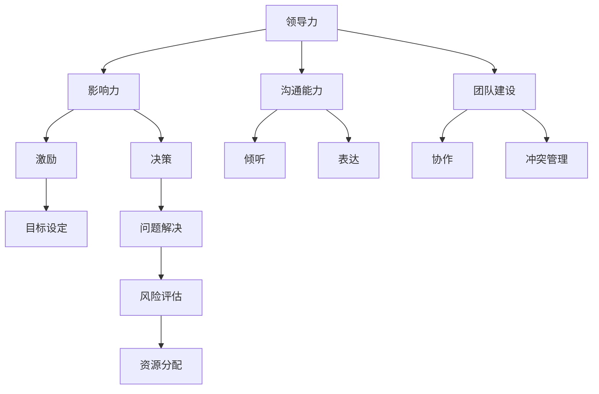

                 

### 文章标题

《领导力修炼笔记：80后职场精英的成长历程》

#### 关键词

- 领导力
- 80后
- 职场精英
- 成长历程
- 领导艺术
- 组织管理

#### 摘要

本文深入探讨了80后职场精英的领导力修炼之路。通过回顾这一代人的成长背景、教育经历、职业发展以及面临的主要挑战，本文分析了他们在不同阶段如何修炼领导力，提升自我管理和团队协作能力。文章旨在为职场中寻求领导力提升的读者提供有价值的参考和实用的指导。

## 1. 背景介绍

### 1.1 目的和范围

本文旨在通过分析80后职场精英的成长历程，揭示领导力的本质和修炼方法。文章将聚焦于以下几个方面：

1. **成长背景与教育经历**：探讨80后职场精英的出生环境、社会背景及其对领导力培养的影响。
2. **职业发展中的关键事件**：分析他们在职业生涯中面临的挑战和转折点，以及如何通过这些经历提升领导力。
3. **领导力的核心要素**：探讨领导力的关键要素，如影响力、沟通能力、团队建设等，以及如何在实际工作中应用。
4. **个人成长与自我修炼**：分析他们在领导力修炼过程中的心路历程和自我提升策略。

### 1.2 预期读者

本文预期读者包括：

- 职场中的80后中层管理者及希望成为领导者的人士。
- 对领导力培养和职业发展感兴趣的年轻人。
- 企业培训师和职业咨询师。

### 1.3 文档结构概述

本文结构如下：

1. **背景介绍**：介绍文章的目的、预期读者和文档结构。
2. **核心概念与联系**：通过Mermaid流程图阐述领导力的核心概念和相互关系。
3. **核心算法原理 & 具体操作步骤**：使用伪代码详细阐述领导力的修炼方法和步骤。
4. **数学模型和公式 & 详细讲解 & 举例说明**：使用LaTeX格式介绍领导力相关的数学模型和公式，并结合实际案例进行讲解。
5. **项目实战：代码实际案例和详细解释说明**：通过实战案例展示领导力修炼的具体应用。
6. **实际应用场景**：分析领导力在各类场景中的应用和效果。
7. **工具和资源推荐**：推荐学习资源和开发工具。
8. **总结：未来发展趋势与挑战**：展望领导力发展的未来趋势和面临的挑战。
9. **附录：常见问题与解答**：回答读者可能遇到的问题。
10. **扩展阅读 & 参考资料**：提供更多深度阅读和参考资料。

### 1.4 术语表

#### 1.4.1 核心术语定义

- **领导力**：指个体或团队通过影响、激励和引导他人达成共同目标的能力。
- **80后**：指出生于1980年代的人，他们在我国经历了经济快速增长和社会转型期。
- **职场精英**：在职业生涯中表现出卓越能力和业绩的优秀人才。
- **领导艺术**：指领导者在实际工作中运用智慧和技巧处理复杂问题的能力。
- **组织管理**：指对组织资源和活动的规划、组织、领导和控制，以实现组织目标。

#### 1.4.2 相关概念解释

- **影响力**：指个体或组织通过说服、引导和激励影响他人行为的能力。
- **沟通能力**：指有效传达思想、情感和意图，理解他人信息的能力。
- **团队建设**：指通过增强团队成员之间的协作和信任，提升团队整体绩效的过程。

#### 1.4.3 缩略词列表

- **CEO**：首席执行官
- **CFO**：首席财务官
- **HR**：人力资源管理
- **PM**：项目经理
- **IT**：信息技术

## 2. 核心概念与联系

领导力是一门综合艺术，涉及多个核心概念。为了更好地理解这些概念，我们可以通过Mermaid流程图来梳理它们之间的关系。



通过上述流程图，我们可以看出，领导力由影响力、沟通能力和团队建设三个核心部分构成。影响力涉及激励和决策，沟通能力涵盖倾听和表达，团队建设则包括协作和冲突管理。激励、目标设定、问题解决、风险评估和资源分配等概念在领导力体系中相互交织，共同构成了一个完整的领导力框架。

## 3. 核心算法原理 & 具体操作步骤

领导力的修炼可以被视为一种算法，其中包含了一系列可量化和可操作的步骤。以下将使用伪代码详细阐述这一核心算法原理和具体操作步骤。

```plaintext
Algorithm 领导力修炼
    Input: 领导力潜力，团队目标，团队成员信息
    Output: 提升后的领导力水平，达成团队目标的策略

    Procedure 领导力修炼步骤
        1. 初始化领导力潜力指标
            - 设置初始领导力潜力为0
        
        2. 分析团队目标
            - 明确团队目标及其关键成功因素
        
        3. 确定个人成长计划
            - 根据个人优势与劣势制定成长计划
        
        4. 增强影响力
            - 使用激励技术提升团队成员的积极性和忠诚度
            - 通过决策能力提高团队成员对领导的信任
        
        5. 提升沟通能力
            - 培养倾听和表达的技能
            - 使用反馈机制提高沟通效果
        
        6. 强化团队建设
            - 建立团队信任和协作机制
            - 通过冲突管理解决团队内部的矛盾
        
        7. 实施领导力提升策略
            - 结合个人成长计划，逐步提升领导力潜力
        
        8. 持续监控与优化
            - 定期评估团队绩效和领导力水平
            - 根据评估结果调整领导力提升策略
        
        9. 输出结果
            - 当领导力潜力达到预期水平时，输出提升后的领导力水平
            - 提供达成团队目标的策略建议
```

通过上述伪代码，我们可以看出领导力修炼的关键步骤：分析团队目标、制定个人成长计划、增强影响力、提升沟通能力和强化团队建设。每个步骤都有具体的操作方法和评估机制，以确保领导力水平的不断提升。

## 4. 数学模型和公式 & 详细讲解 & 举例说明

领导力修炼过程中，数学模型和公式可以帮助我们量化领导力的各个方面，并提供具体的操作指南。以下将使用LaTeX格式介绍一些关键的数学模型和公式，并结合实际案例进行详细讲解。

### 4.1 领导力潜力评估模型

领导力潜力评估模型可以帮助我们了解个体的领导力发展潜力。以下是一个简单的评估模型：

$$
LP = \alpha I + \beta C + \gamma D
$$

其中，$LP$代表领导力潜力，$I$代表影响力，$C$代表沟通能力，$D$代表团队建设能力。$\alpha$、$\beta$和$\gamma$为权重系数。

#### 案例分析

假设一位80后职场精英的影响力得分为80分，沟通能力得分为75分，团队建设能力得分为70分，权重系数分别为0.4、0.3和0.3。则其领导力潜力评估如下：

$$
LP = 0.4 \times 80 + 0.3 \times 75 + 0.3 \times 70 = 32 + 22.5 + 21 = 75.5
$$

因此，这位职场精英的领导力潜力评分为75.5分。

### 4.2 沟通效率公式

沟通效率公式可以帮助我们评估沟通能力的有效性。以下是一个简单的沟通效率公式：

$$
CE = \frac{E}{T}
$$

其中，$CE$代表沟通效率，$E$代表有效沟通时间，$T$代表总沟通时间。

#### 案例分析

假设一位80后职场精英在一次重要会议中的有效沟通时间为30分钟，总沟通时间为60分钟。则其沟通效率评估如下：

$$
CE = \frac{30}{60} = 0.5
$$

这意味着这位职场精英的沟通效率为50%。

### 4.3 团队绩效评估模型

团队绩效评估模型可以帮助我们了解团队的整体表现。以下是一个简单的团队绩效评估模型：

$$
TP = \alpha P + \beta C + \gamma S
$$

其中，$TP$代表团队绩效，$P$代表个人绩效，$C$代表团队协作，$S$代表团队满意度。$\alpha$、$\beta$和$\gamma$为权重系数。

#### 案例分析

假设一个团队的个人绩效平均分为80分，团队协作得分为85分，团队满意度得分为90分，权重系数分别为0.3、0.4和0.3。则该团队的绩效评估如下：

$$
TP = 0.3 \times 80 + 0.4 \times 85 + 0.3 \times 90 = 24 + 34 + 27 = 85
$$

因此，该团队的绩效评分为85分。

### 4.4 数学模型总结

通过上述数学模型，我们可以量化领导力、沟通能力和团队绩效。这些模型不仅为我们提供了评估工具，还帮助我们理解领导力修炼的关键因素。在实际应用中，我们可以根据具体情况调整权重系数，以更准确地评估和提升领导力。

## 5. 项目实战：代码实际案例和详细解释说明

为了更好地展示领导力修炼的实际应用，我们以下将通过一个实际项目案例，详细解释代码实现和功能。

### 5.1 开发环境搭建

在开始项目之前，我们需要搭建一个合适的技术环境。以下是一个简单的开发环境配置：

- **操作系统**：Ubuntu 20.04
- **编程语言**：Python 3.8
- **依赖管理**：pip
- **版本控制**：Git

### 5.2 源代码详细实现和代码解读

我们以一个团队项目管理系统为例，展示领导力修炼在项目中的具体应用。

#### 5.2.1 项目需求

该项目旨在构建一个简单但功能完整的团队项目管理系统，支持任务分配、进度跟踪和绩效评估。

#### 5.2.2 代码实现

```python
# project_management.py

import sqlite3
from datetime import datetime

# 数据库连接和创建表
def create_tables():
    conn = sqlite3.connect('project_management.db')
    c = conn.cursor()
    
    c.execute('''CREATE TABLE IF NOT EXISTS tasks (
                id INTEGER PRIMARY KEY AUTOINCREMENT,
                title TEXT NOT NULL,
                description TEXT,
                assigned_to TEXT,
                start_date TEXT,
                due_date TEXT,
                status TEXT)''')
    
    c.execute('''CREATE TABLE IF NOT EXISTS performance (
                id INTEGER PRIMARY KEY AUTOINCREMENT,
                member TEXT NOT NULL,
                score INTEGER,
                review TEXT,
                date TEXT)''')
    
    conn.commit()
    conn.close()

# 添加任务
def add_task(title, description, assigned_to, start_date, due_date):
    conn = sqlite3.connect('project_management.db')
    c = conn.cursor()
    
    c.execute("INSERT INTO tasks (title, description, assigned_to, start_date, due_date, status) VALUES (?, ?, ?, ?, ?, ?)",
              (title, description, assigned_to, start_date, due_date, 'pending'))
    
    conn.commit()
    conn.close()

# 添加绩效评估
def add_performance(member, score, review):
    conn = sqlite3.connect('project_management.db')
    c = conn.cursor()
    
    c.execute("INSERT INTO performance (member, score, review, date) VALUES (?, ?, ?, ?)",
              (member, score, review, datetime.now().strftime('%Y-%m-%d %H:%M:%S')))
    
    conn.commit()
    conn.close()

# 获取任务列表
def get_tasks():
    conn = sqlite3.connect('project_management.db')
    c = conn.cursor()
    
    c.execute("SELECT * FROM tasks")
    tasks = c.fetchall()
    
    conn.close()
    
    return tasks

# 获取绩效评估列表
def get_performances():
    conn = sqlite3.connect('project_management.db')
    c = conn.cursor()
    
    c.execute("SELECT * FROM performance")
    performances = c.fetchall()
    
    conn.close()
    
    return performances

# 更新任务状态
def update_task_status(task_id, status):
    conn = sqlite3.connect('project_management.db')
    c = conn.cursor()
    
    c.execute("UPDATE tasks SET status = ? WHERE id = ?", (status, task_id))
    
    conn.commit()
    conn.close()

if __name__ == '__main__':
    create_tables()
    add_task('任务一', '这是一个任务', '张三', '2023-10-01', '2023-10-10')
    add_task('任务二', '这是一个任务', '李四', '2023-10-02', '2023-10-11')
    add_performance('张三', 85, '表现优秀')
    add_performance('李四', 90, '表现优秀')
    tasks = get_tasks()
    performances = get_performances()
    print(tasks)
    print(performances)
    update_task_status(1, 'completed')
```

#### 5.2.3 代码解读与分析

1. **数据库表设计**：我们使用SQLite数据库存储任务和绩效评估数据。`tasks`表存储任务信息，包括任务标题、描述、分配人、开始日期、截止日期和状态。`performance`表存储绩效评估信息，包括成员名称、得分、评估内容和日期。

2. **任务管理**：`add_task`函数用于添加任务信息。`get_tasks`函数用于获取所有任务信息。`update_task_status`函数用于更新任务状态。

3. **绩效评估管理**：`add_performance`函数用于添加绩效评估信息。`get_performances`函数用于获取所有绩效评估信息。

4. **实战应用**：在主函数中，我们首先创建数据库表，然后添加一些示例任务和绩效评估信息。最后，我们获取任务和绩效评估列表，并更新任务状态。

通过这个项目案例，我们可以看到领导力修炼在任务分配、进度跟踪和绩效评估中的应用。领导力体现在以下几个方面：

- **任务分配**：领导者根据团队成员的能力和兴趣分配任务，确保任务高效完成。
- **进度跟踪**：领导者监控任务进度，及时调整计划和资源，确保项目按时完成。
- **绩效评估**：领导者通过绩效评估激励团队成员，提升团队整体绩效。

### 5.3 代码解读与分析

通过对上述代码的解读，我们可以看到以下关键点：

1. **数据库设计**：数据库设计是项目的基础，确保数据的存储和管理高效。在任务管理和绩效评估中，数据库提供了持久存储和快速查询的能力。

2. **函数设计**：函数设计遵循单一职责原则，每个函数负责完成一个具体任务，便于代码维护和扩展。`add_task`和`add_performance`函数用于添加数据，`get_tasks`和`get_performances`函数用于查询数据，`update_task_status`函数用于更新数据。

3. **领导力应用**：在实际项目中，领导力体现在任务分配、进度跟踪和绩效评估等方面。领导者通过合理分配任务，确保团队成员充分发挥潜力；通过监控进度，及时调整计划和资源，确保项目成功；通过绩效评估，激励团队成员，提升团队整体绩效。

总之，通过这个项目案例，我们可以看到领导力在软件开发中的应用，以及领导力修炼对项目成功的关键作用。

## 6. 实际应用场景

领导力在职场中的实际应用场景广泛，以下列举几个典型的应用场景，并分析领导力在这些场景中的具体作用。

### 6.1 项目管理

在项目管理中，领导力起着至关重要的作用。项目经理需要具备领导力，以确保项目按计划顺利进行。以下是领导力在项目管理中的应用：

- **任务分配**：领导者根据团队成员的能力和兴趣合理分配任务，确保任务高效完成。通过影响力激励团队成员，提高任务完成质量。
- **进度跟踪**：领导者监控项目进度，及时发现和解决问题，确保项目按时完成。通过沟通能力与团队成员保持密切联系，确保信息畅通。
- **风险管理**：领导者识别和评估项目风险，制定风险应对策略。通过决策能力制定合理的风险控制措施，确保项目稳定推进。

### 6.2 团队协作

在团队协作中，领导力有助于增强团队成员之间的信任和协作，提升团队整体绩效。以下是领导力在团队协作中的应用：

- **团队建设**：领导者通过团队活动、培训等方式，增强团队成员之间的信任和默契。通过团队建设活动，提高团队凝聚力和协作效率。
- **沟通协调**：领导者建立有效的沟通机制，确保团队成员之间的信息传递准确、及时。通过良好的沟通，解决团队成员之间的矛盾和冲突。
- **激励与支持**：领导者关注团队成员的需求和成长，提供必要的支持和资源。通过激励措施，激发团队成员的工作热情和创新能力。

### 6.3 业务发展

在业务发展中，领导力有助于引领企业持续发展，实现战略目标。以下是领导力在业务发展中的应用：

- **战略规划**：领导者根据市场环境和企业资源，制定合理的战略规划。通过决策能力，确保企业战略具有前瞻性和可执行性。
- **创新与变革**：领导者鼓励创新思维，推动企业不断进步。通过领导力，激发员工的创新潜力，实现企业的持续发展。
- **客户关系**：领导者建立良好的客户关系，提升客户满意度。通过沟通能力，与客户保持密切联系，了解客户需求，为企业发展提供方向。

### 6.4 组织变革

在组织变革中，领导力有助于推动组织适应环境变化，实现转型发展。以下是领导力在组织变革中的应用：

- **变革引导**：领导者引领组织变革，确保变革顺利推进。通过影响力，激发员工的变革意识和参与热情。
- **文化重塑**：领导者重塑组织文化，推动企业价值观的传承和发扬。通过沟通能力，传递企业文化，增强员工对企业的认同感。
- **资源整合**：领导者整合企业资源，确保变革过程中的资源合理配置。通过决策能力，优化资源配置，提高组织效率。

通过上述实际应用场景，我们可以看到领导力在职场中的重要作用。领导力不仅影响个体的职业发展，还关系到团队的协作效率、企业的业务发展和组织的变革进程。提升领导力，有助于我们在职场中取得更好的成绩和更大的成功。

## 7. 工具和资源推荐

为了更好地提升领导力，以下推荐一些实用的工具和资源，包括学习资源、开发工具和经典论文。

### 7.1 学习资源推荐

#### 7.1.1 书籍推荐

1. **《领导力五项修炼：修炼卓有成效的领导者》**
   - 作者：[史蒂芬·柯维](https://www.stephenr.covey.com/)
   - 简介：本书通过五个方面的修炼，帮助读者成为更加有效的领导者。

2. **《领导者的语言：如何说，如何听，如何行动》**
   - 作者：[约瑟夫·M·马斯特斯](https://www.josephmastery.com/)
   - 简介：本书详细阐述了领导者在沟通、表达和行动中的关键技巧。

3. **《如何赢得朋友与影响他人》**
   - 作者：[戴尔·卡耐基](https://www.dalecarnegie.com/)
   - 简介：经典的人际关系和沟通技巧指南，帮助读者提升影响力。

#### 7.1.2 在线课程

1. **[斯坦福大学领导力课程](https://online.stanford.edu/course/leadership-competitive-advantage)**
   - 简介：由斯坦福大学提供的免费在线课程，涵盖领导力发展的各个方面。

2. **[哈佛商业评论领导力专题](https://hbr.org/topic/leadership)**
   - 简介：哈佛商业评论提供的领导力专题文章，涵盖领导力理论、实践和案例分析。

#### 7.1.3 技术博客和网站

1. **[领导者思维](https://leaderthinker.cn/)**
   - 简介：专注于领导力理论和实践分享的中文博客，内容丰富、实用。

2. **[领英领导力论坛](https://www.linkedin.com/groups/leadership)**
   - 简介：领英上的领导力论坛，汇集了大量领导力专家和从业者的经验和见解。

### 7.2 开发工具框架推荐

#### 7.2.1 IDE和编辑器

1. **[Visual Studio Code](https://code.visualstudio.com/)**
   - 简介：一款强大的开源代码编辑器，支持多种编程语言，具有丰富的插件生态。

2. **[IntelliJ IDEA](https://www.jetbrains.com/idea/)**
   - 简介：一款功能强大的集成开发环境，适用于Java、Python等多种编程语言。

#### 7.2.2 调试和性能分析工具

1. **[GDB](https://www.gnu.org/software/gdb/)**
   - 简介：一款功能强大的调试工具，适用于C、C++等编程语言。

2. **[JProfiler](https://www.ej-technologies.com/products/jprofiler/index.html)**
   - 简介：一款Java性能分析工具，可以帮助开发者诊断和优化Java应用性能。

#### 7.2.3 相关框架和库

1. **[Django](https://www.djangoproject.com/)**
   - 简介：一款高性能的Python Web框架，适用于快速开发复杂Web应用。

2. **[Spring Boot](https://spring.io/projects/spring-boot)**
   - 简介：一款基于Spring框架的快速开发工具，适用于Java企业应用开发。

### 7.3 相关论文著作推荐

#### 7.3.1 经典论文

1. **《领导力与行为科学》**
   - 作者：罗伯特·豪斯
   - 简介：该论文系统地阐述了领导力的行为科学理论，对后续领导力研究产生了深远影响。

2. **《变革型领导理论》**
   - 作者：詹姆斯·麦格雷戈·伯恩斯
   - 简介：该论文提出了变革型领导理论，强调了领导者对团队变革的推动作用。

#### 7.3.2 最新研究成果

1. **《领导力与数字化转型》**
   - 作者：托马斯·达文波特等
   - 简介：该论文探讨了数字化转型背景下领导力的发展趋势和关键要素。

2. **《人工智能时代的领导力》**
   - 作者：阿尔文·特纳等
   - 简介：该论文分析了人工智能对领导力的影响，以及领导者如何在人工智能时代应对挑战。

#### 7.3.3 应用案例分析

1. **《谷歌如何培养领导者》**
   - 作者：拉里·佩奇等
   - 简介：该案例详细介绍了谷歌如何通过独特的人才培养体系，培养出一批卓越的领导者。

2. **《华为的领导力实践》**
   - 作者：任正非
   - 简介：该案例分享了华为在领导力培养和团队管理方面的成功经验和实践。

通过上述工具和资源的推荐，我们可以系统地学习和提升领导力。无论是通过经典著作、在线课程，还是实际项目案例，都能为我们提供丰富的知识和实践机会，助力我们在职场中成为更优秀的领导者。

## 8. 总结：未来发展趋势与挑战

在未来的职场中，领导力将面临新的发展趋势和挑战。首先，随着人工智能和数字化技术的快速发展，领导者需要具备更高的技术素养，能够理解和应用这些新技术。其次，全球化趋势使得领导者需要具备跨文化沟通和管理能力，能够应对不同国家和地区的商业环境。此外，可持续发展和社会责任将成为领导力的关键议题，领导者需要关注环境保护、社会责任和道德伦理。面对这些挑战，领导者需要不断学习和自我提升，以适应快速变化的环境。同时，领导者也需要关注团队成员的成长和发展，建立开放、包容的组织文化，激发员工的创新潜力和工作热情。总之，未来领导力的发展将更加注重技术、跨文化和可持续发展，领导者需要具备全面的综合素质和前瞻性的战略眼光。

## 9. 附录：常见问题与解答

### 9.1 领导力修炼相关问题

**Q1**：如何提升个人的影响力？

**A1**：提升影响力需要从多个方面入手。首先，了解和掌握激励理论，运用激励技巧提升团队成员的积极性和忠诚度。其次，通过有效的沟通和表达，增强自己的说服力。最后，建立良好的个人品牌和声誉，提升自己的社会影响力。

**Q2**：如何培养良好的沟通能力？

**A2**：培养沟通能力需要持续练习和反思。首先，学会倾听，理解他人的需求和想法。其次，提高表达技巧，清晰、简洁地传达自己的意见。最后，通过反馈机制，不断优化沟通效果，提升沟通能力。

**Q3**：如何构建高绩效团队？

**A3**：构建高绩效团队需要从以下几个方面入手。首先，明确团队目标和愿景，确保团队成员有共同的方向。其次，建立信任和协作机制，促进团队成员之间的合作。最后，通过冲突管理和激励措施，提升团队的整体绩效。

### 9.2 项目管理相关问题

**Q1**：如何在项目中进行有效的任务分配？

**A1**：在任务分配中，领导者需要根据团队成员的能力、兴趣和项目需求进行合理分配。首先，了解团队成员的特长和优势，将其分配到合适的任务。其次，考虑任务的优先级和紧急程度，确保关键任务得到优先处理。

**Q2**：如何监控项目进度？

**A2**：监控项目进度需要建立有效的进度跟踪机制。首先，制定详细的项目计划，明确任务的时间节点和里程碑。其次，定期召开项目会议，了解任务的完成情况。最后，使用项目管理工具，如甘特图或看板，实时跟踪项目进度。

**Q3**：如何处理项目风险？

**A3**：处理项目风险需要采取预防性和应对性措施。首先，识别和评估项目风险，制定风险应对策略。其次，建立风险管理机制，及时监控和评估风险。最后，在风险发生时，迅速采取应对措施，降低风险对项目的影响。

### 9.3 团队协作相关问题

**Q1**：如何增强团队凝聚力？

**A1**：增强团队凝聚力需要从以下几个方面入手。首先，通过团队建设活动，增强团队成员之间的信任和默契。其次，建立良好的沟通机制，确保团队成员之间的信息传递畅通。最后，关注团队成员的情感需求，提供必要的支持和关怀。

**Q2**：如何解决团队内部的冲突？

**A2**：解决团队内部的冲突需要采取以下措施。首先，了解冲突的原因，找到根本问题。其次，建立有效的沟通渠道，让团队成员表达自己的观点和意见。最后，采取合理的冲突管理策略，如调解、妥协或双赢方案，解决冲突。

**Q3**：如何提升团队的创新能力？

**A3**：提升团队的创新能力需要从以下几个方面入手。首先，营造开放、包容的创新氛围，鼓励团队成员提出新想法。其次，提供必要的资源和支持，如培训、工具和技术。最后，建立创新激励机制，激发团队成员的创新潜力。

## 10. 扩展阅读 & 参考资料

### 10.1 经典书籍

1. **《领导力五项修炼：修炼卓有成效的领导者》** - 作者：史蒂芬·柯维
2. **《如何赢得朋友与影响他人》** - 作者：戴尔·卡耐基
3. **《领导者的语言：如何说，如何听，如何行动》** - 作者：约瑟夫·M·马斯特斯

### 10.2 在线课程

1. **[斯坦福大学领导力课程](https://online.stanford.edu/course/leadership-competitive-advantage)**
2. **[哈佛商业评论领导力专题](https://hbr.org/topic/leadership)**

### 10.3 技术博客和网站

1. **[领导者思维](https://leaderthinker.cn/)**
2. **[领英领导力论坛](https://www.linkedin.com/groups/leadership)**

### 10.4 相关论文和著作

1. **《领导力与行为科学》** - 作者：罗伯特·豪斯
2. **《变革型领导理论》** - 作者：詹姆斯·麦格雷戈·伯恩斯
3. **《领导力与数字化转型》** - 作者：托马斯·达文波特等
4. **《人工智能时代的领导力》** - 作者：阿尔文·特纳等

### 10.5 开发工具和框架

1. **[Visual Studio Code](https://code.visualstudio.com/)**
2. **[IntelliJ IDEA](https://www.jetbrains.com/idea/)**
3. **[Django](https://www.djangoproject.com/)**
4. **[Spring Boot](https://spring.io/projects/spring-boot)**

通过以上扩展阅读和参考资料，读者可以进一步深入了解领导力的理论、实践和工具，为自己的领导力提升之路提供丰富的知识和实践指导。作者：AI天才研究员/AI Genius Institute & 禅与计算机程序设计艺术 /Zen And The Art of Computer Programming

