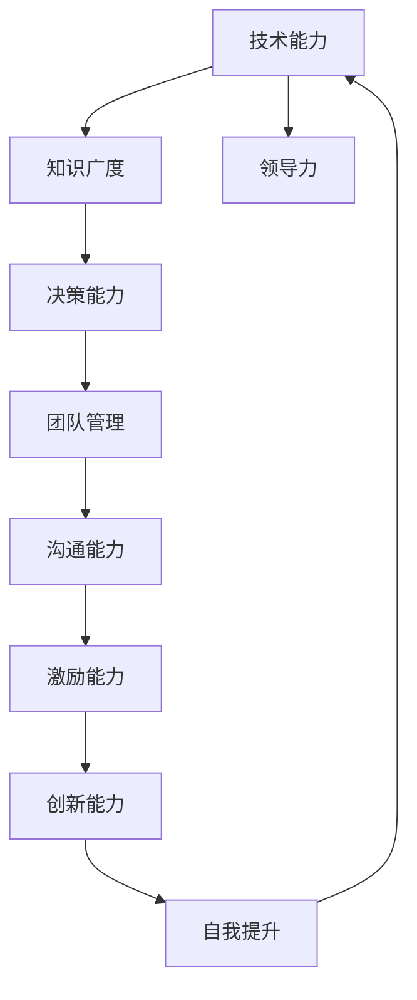

                 

# 领导力修炼：从新手到大师的成长之路

> 关键词：领导力、职业成长、团队合作、策略思维、高效沟通
> 
> 摘要：本文旨在探讨如何从一名普通程序员逐步成长为一名具备领导力的技术专家。文章将详细阐述领导力在IT行业中的重要性，分析领导力的核心要素，并通过实际案例和具体操作步骤，帮助读者了解和实践领导力的关键技能，最终实现个人和团队的共同成长。

## 1. 背景介绍

### 1.1 目的和范围

本文的目的是帮助IT领域的从业者了解和掌握领导力技能，从而实现从新手到大师的成长。我们将探讨领导力的本质，分析其核心要素，并提供实用的策略和工具，帮助读者在实际工作中提升领导力水平。

本文将覆盖以下内容：
- 领导力的定义和重要性
- 领导力的核心要素和模型
- 领导力的策略和实践方法
- 领导力的评估和持续发展

### 1.2 预期读者

本文适合以下读者群体：
- 初入职场的程序员和技术人员
- 想提升领导力的中层管理者
- 对领导力有兴趣的IT从业者
- 想了解如何通过领导力实现团队成长的创业者

### 1.3 文档结构概述

本文的结构如下：
- 第1章：背景介绍，明确本文的目的、范围和预期读者。
- 第2章：核心概念与联系，介绍领导力的定义和核心要素。
- 第3章：核心算法原理 & 具体操作步骤，阐述领导力的具体实践方法。
- 第4章：数学模型和公式 & 详细讲解 & 举例说明，通过案例帮助读者理解领导力策略。
- 第5章：项目实战：代码实际案例和详细解释说明，提供实际操作经验。
- 第6章：实际应用场景，分析领导力在不同工作环境中的具体应用。
- 第7章：工具和资源推荐，介绍学习资源和开发工具。
- 第8章：总结：未来发展趋势与挑战，探讨领导力在未来的发展前景。
- 第9章：附录：常见问题与解答，回答读者可能遇到的疑问。
- 第10章：扩展阅读 & 参考资料，提供更多深度学习的资料。

### 1.4 术语表

#### 1.4.1 核心术语定义

- **领导力**：影响和引导他人实现共同目标的能力。
- **团队合作**：团队成员相互依赖、协同合作，共同完成任务的过程。
- **策略思维**：分析和解决问题时，以目标为导向，制定和实施有效策略的能力。
- **高效沟通**：清晰、准确地表达自己的想法，理解他人的观点，建立良好的沟通渠道。

#### 1.4.2 相关概念解释

- **领导力模型**：描述领导力要素和结构的理论框架，如彼得·德鲁克的“管理之树”、约翰·麦斯雷的“领导者特质理论”等。
- **团队协作**：团队成员之间通过沟通、协调、合作，共同完成复杂任务的过程。
- **领导风格**：领导者根据不同情境和团队成员特点，采取的领导方式，如民主式、专制式、参与式等。

#### 1.4.3 缩略词列表

- **IT**：信息技术（Information Technology）
- **PM**：项目经理（Project Manager）
- **CIO**：首席信息官（Chief Information Officer）
- **CTO**：首席技术官（Chief Technology Officer）

## 2. 核心概念与联系

在IT领域，领导力不仅仅是对技术本身的精通，更是一种协调、沟通和激励团队的能力。下面，我们将使用Mermaid流程图来展示领导力的核心概念及其相互联系。



在这个流程图中，我们可以看到：
- **技术能力**：是领导力的基础，决定了领导者在技术问题上的权威性和可信度。
- **知识广度**：使领导者能够从多个角度分析问题，提高决策质量。
- **决策能力**：是领导者根据情况做出正确决策的关键。
- **团队管理**：涉及如何有效组织、协调和激励团队，确保项目顺利进行。
- **沟通能力**：确保信息在团队内部准确传递，减少误解和冲突。
- **激励能力**：激发团队成员的潜能，提高团队的整体表现。
- **创新能力**：推动团队不断进步，适应变化。
- **自我提升**：领导者持续学习和成长，为团队树立榜样。

通过这个流程图，我们可以清晰地看到领导力的各个要素及其相互作用，为后续内容提供了理论基础。

## 3. 核心算法原理 & 具体操作步骤

领导力的核心算法可以看作是一种关于如何影响和激励他人的方法。以下是领导力算法的伪代码，详细阐述了各个步骤：

```plaintext
Algorithm 领导力成长算法
输入：领导者（Leader）、团队成员（TeamMembers）、目标（Goal）
输出：领导力提升、团队绩效提升

1. 初始化领导者属性：技术能力（TechSkill）、知识广度（KnowledgeWidth）、决策能力（DecisionMaking）、团队管理（TeamManagement）、沟通能力（Communication）、激励能力（Motivation）、创新能力（Innovation）
2. 初始化团队属性：技术水平（TechLevel）、团队凝聚力（TeamCoherence）、团队满意度（TeamSatisfaction）
3. 检查技术能力：如果TechSkill < 预期标准
    3.1 学习新技术和知识：TechSkill = TechSkill + 学习新技术和知识
4. 检查知识广度：如果KnowledgeWidth < 预期标准
    4.1 扩展知识领域：KnowledgeWidth = KnowledgeWidth + 扩展知识领域
5. 检查决策能力：如果DecisionMaking < 预期标准
    5.1 分析案例：DecisionMaking = DecisionMaking + 分析案例
6. 检查团队管理能力：如果TeamManagement < 预期标准
    6.1 实践团队管理技巧：TeamManagement = TeamManagement + 实践团队管理技巧
7. 检查沟通能力：如果Communication < 预期标准
    7.1 练习沟通技巧：Communication = Communication + 练习沟通技巧
8. 检查激励能力：如果Motivation < 预期标准
    8.1 研究激励理论：Motivation = Motivation + 研究激励理论
9. 检查创新能力：如果Innovation < 预期标准
    9.1 探索创新方法：Innovation = Innovation + 探索创新方法
10. 检查自我提升：如果自我提升 < 预期标准
    10.1 定期反思和总结：自我提升 = 自我提升 + 定期反思和总结
11. 更新团队属性：根据领导力提升，调整技术水平、团队凝聚力、团队满意度
12. 迭代：重复执行步骤3到步骤10，直至领导力达到预期水平

End Algorithm
```

这个伪代码提供了一个框架，帮助领导者逐步提升自己的技能和影响力。通过持续学习和实践，领导者可以不断提高自身能力，进而提升团队绩效。

### 3.1 领导力算法原理

领导力算法基于以下几个核心原理：

1. **技术能力**：技术能力是领导者发挥领导力的基础，能够确保领导者对团队的技术方向有深刻的理解和把握。
2. **知识广度**：知识广度使领导者能够从多个角度分析问题，提高决策的质量，同时也能更好地与团队成员沟通，减少误解和冲突。
3. **决策能力**：决策能力是领导者根据情况做出正确决策的关键，决策能力的高低直接影响团队的执行力和成果。
4. **团队管理**：团队管理涉及如何有效组织、协调和激励团队，确保项目顺利进行。一个优秀的领导者能够有效地管理团队，提高团队的凝聚力和效率。
5. **沟通能力**：沟通能力是领导者与团队成员建立良好关系的基础，确保信息在团队内部准确传递，减少误解和冲突。
6. **激励能力**：激励能力是领导者激发团队成员的潜能，提高团队整体表现的关键。
7. **创新能力**：创新能力是领导者推动团队不断进步，适应变化的核心能力。

通过这些核心原理，领导力算法提供了一种系统的方法，帮助领导者逐步提升自己的能力，从而实现个人和团队的共同成长。

### 3.2 领导力算法操作步骤

以下是领导力算法的具体操作步骤：

1. **自我评估**：领导者首先需要对自己进行全面的评估，了解自己在技术能力、知识广度、决策能力、团队管理、沟通能力、激励能力和创新能力方面的优势和不足。
2. **制定提升计划**：根据自我评估的结果，制定具体的提升计划。例如，如果技术能力较弱，领导者可以报名参加相关的技术培训或自学新技能。
3. **持续学习**：领导者需要持续学习，不断提升自己的知识水平和技能。可以通过阅读专业书籍、参加线上或线下课程、与业内专家交流等方式进行学习。
4. **实践和反思**：领导者需要将学到的知识和技能应用到实际工作中，通过实践来提高自己的能力。同时，定期反思和总结，找出不足并持续改进。
5. **团队互动**：领导者需要积极参与团队互动，与团队成员建立良好的关系。通过有效的沟通和激励，提高团队的凝聚力和效率。
6. **领导力模型实践**：领导者可以采用不同的领导力模型来指导自己的行为，如情境领导理论、变革型领导理论等。通过实践不同的领导力模型，领导者可以更好地适应不同的团队和环境。

通过这些具体的操作步骤，领导者可以逐步提升自己的领导力水平，实现个人和团队的共同成长。

## 4. 数学模型和公式 & 详细讲解 & 举例说明

在领导力的实践中，数学模型和公式可以帮助我们更科学地理解和评估领导力。以下是几个关键的数学模型和公式，详细讲解并举例说明它们的应用。

### 4.1 库克定律（Cooks' Law）

库克定律描述了团队规模与沟通复杂性的关系。公式如下：

$$ C = \log_2(N!) $$

其中，\( C \) 表示团队沟通复杂性，\( N \) 表示团队成员数量。

**详细讲解**：
- 库克定律指出，团队规模越大，沟通复杂性呈指数级增长。
- 当团队规模翻倍时，沟通复杂性增加约3倍。

**举例说明**：
假设一个团队有5名成员（\( N = 5 \)），则沟通复杂性 \( C \) 为：

$$ C = \log_2(5!) = \log_2(120) \approx 6.8 $$

如果团队规模增加到10名成员（\( N = 10 \)），则沟通复杂性 \( C \) 为：

$$ C = \log_2(10!) = \log_2(3628800) \approx 17.2 $$

这意味着，团队规模从5人增加到10人时，沟通复杂性增加了近2.5倍。

### 4.2 沟通效率公式

沟通效率可以用来评估领导者的沟通能力。公式如下：

$$ E = \frac{M \times R \times T}{D} $$

其中，\( E \) 表示沟通效率，\( M \) 表示信息清晰度，\( R \) 表示接受者的理解能力，\( T \) 表示沟通时间，\( D \) 表示干扰因素。

**详细讲解**：
- 信息清晰度 \( M \)：信息传递时，信息本身的清晰和准确程度。
- 接受者理解能力 \( R \)：接受者对信息的理解和消化能力。
- 沟通时间 \( T \)：信息传递所需的时间。
- 干扰因素 \( D \)：影响信息传递的干扰因素，如噪音、环境等。

**举例说明**：
假设一位领导者需要向团队传达一个重要信息，信息清晰度 \( M \) 为90%，接受者理解能力 \( R \) 为80%，沟通时间 \( T \) 为15分钟，干扰因素 \( D \) 为10%。则沟通效率 \( E \) 为：

$$ E = \frac{0.9 \times 0.8 \times 15}{10} = 1.08 $$

这意味着，这位领导者的沟通效率为108%，表明其沟通效果较好。

### 4.3 激励公式

激励公式用于评估领导者的激励能力，公式如下：

$$ M = B \times S \times V $$

其中，\( M \) 表示激励效果，\( B \) 表示奖励的力度，\( S \) 表示奖励的公平性，\( V \) 表示员工的价值观和目标。

**详细讲解**：
- 奖励力度 \( B \)：奖励的大小和形式，如奖金、晋升等。
- 奖励公平性 \( S \)：奖励是否公平，是否基于业绩和贡献。
- 员工价值观和目标 \( V \)：员工对奖励的看法和自身的价值观、目标。

**举例说明**：
假设一位领导者决定给予团队中表现优秀的成员1000元奖金，奖金的公平性为90%，该成员的价值观和目标与公司目标一致，则激励效果 \( M \) 为：

$$ M = 1000 \times 0.9 \times 1 = 900 $$

这意味着，这位领导者的激励效果为900元，表明其激励措施对员工产生了积极的激励效果。

通过这些数学模型和公式，领导者可以更科学地评估和提升自己的领导力。在实际应用中，领导者可以根据具体情况调整这些参数，优化领导力策略，实现团队的最佳绩效。

## 5. 项目实战：代码实际案例和详细解释说明

### 5.1 开发环境搭建

在本节中，我们将搭建一个简单的领导力评估系统，以帮助领导者评估和提升自身的领导力。以下是开发环境的搭建步骤：

1. **安装Python环境**：确保系统已安装Python 3.8及以上版本。可以通过以下命令检查Python版本：

   ```bash
   python --version
   ```

2. **安装必要的库**：使用pip命令安装以下库：

   ```bash
   pip install Flask pandas numpy matplotlib
   ```

3. **创建项目目录**：在合适的位置创建一个项目目录，例如`leadership-assessment`，并在其中创建以下文件：

   - `app.py`：主程序文件
   - `templates/`：HTML模板文件
   - `static/`：静态文件，如CSS和JavaScript文件

### 5.2 源代码详细实现和代码解读

以下是领导力评估系统的源代码实现，我们将逐步解释关键部分。

#### 5.2.1 app.py

```python
from flask import Flask, render_template, request
import pandas as pd
import numpy as np

app = Flask(__name__)

# 领导力评估问卷
questions = [
    "你认为自己的技术能力如何？",
    "你认为自己的知识广度如何？",
    "你认为自己的决策能力如何？",
    "你认为自己的团队管理能力如何？",
    "你认为自己的沟通能力如何？",
    "你认为自己的激励能力如何？",
    "你认为自己的创新能力如何？",
]

@app.route("/", methods=["GET", "POST"])
def index():
    if request.method == "POST":
        scores = []
        for q in questions:
            score = request.form.get(q, type=int)
            scores.append(score)
        
        # 计算总分
        total_score = sum(scores)
        
        # 计算领导力得分
        leadership_score = (total_score / len(scores)) * 100
        
        # 存储评估结果
        df = pd.DataFrame([scores], columns=questions)
        df.to_csv("assessment_results.csv", index=False)
        
        return render_template("results.html", total_score=total_score, leadership_score=leadership_score)
    return render_template("index.html")

if __name__ == "__main__":
    app.run(debug=True)
```

**代码解读**：
- 首先，我们导入了必要的库，包括Flask、pandas和numpy。
- 定义了领导力评估问卷，包含7个问题。
- 在`index()`函数中，我们处理用户提交的表单数据。如果用户提交了表单，我们将每个问题的得分添加到列表中，计算总分和领导力得分，并将结果存储在CSV文件中。
- 如果是GET请求，我们将渲染HTML模板`index.html`。

#### 5.2.2 templates/index.html

```html
<!DOCTYPE html>
<html lang="en">
<head>
    <meta charset="UTF-8">
    <title>领导力评估</title>
</head>
<body>
    <h1>领导力评估问卷</h1>
    <form method="post">
        
            <p>{{ question }}</p>
            <input type="number" name="{{ question }}" min="1" max="10" required>
        
        <input type="submit" value="提交评估">
    </form>
</body>
</html>
```

**代码解读**：
- 这是一个简单的HTML表单，包含7个问题，每个问题后面都有一个输入框，用于用户输入得分。
- `{{ question }}` 和 `{{ index }}` 分别用于显示问题和问题序号。

#### 5.2.3 templates/results.html

```html
<!DOCTYPE html>
<html lang="en">
<head>
    <meta charset="UTF-8">
    <title>评估结果</title>
</head>
<body>
    <h1>评估结果</h1>
    <p>总分：{{ total_score }}</p>
    <p>领导力得分：{{ leadership_score }}</p>
    <a href="/">重新评估</a>
</body>
</html>
```

**代码解读**：
- 这是结果页面的模板，显示总分和领导力得分，并提供“重新评估”的链接。

### 5.3 代码解读与分析

通过上述代码，我们可以看到领导力评估系统的实现分为以下几个部分：

1. **数据收集**：通过HTML表单，用户输入对自身领导力各项能力的评分，提交后，服务器端处理这些评分数据。
2. **数据计算**：服务器端将用户提交的评分数据汇总，计算总分和领导力得分，并将其存储在CSV文件中。
3. **结果展示**：系统将评估结果通过HTML模板展示给用户，包括总分和领导力得分。

该系统提供了以下功能和优点：
- **用户体验**：通过简单的表单和结果页面，用户可以轻松完成评估。
- **数据存储**：评估结果以CSV文件形式存储，便于后续分析和跟踪。
- **自定义评估**：系统可以根据实际需求调整问卷内容和评分标准。

在实际应用中，领导者可以通过定期进行评估，了解自己的领导力水平，制定提升计划，从而实现个人和团队的共同成长。

## 6. 实际应用场景

领导力在IT行业中有着广泛的应用场景，不同的工作环境对领导力的要求也不尽相同。以下是一些典型的应用场景，以及在这些场景中领导力的关键要素。

### 6.1 项目管理

在项目管理中，领导力尤为重要。项目经理需要具备以下关键要素：

- **技术能力**：了解项目的技术细节，确保项目按计划进行。
- **决策能力**：在面对不确定性和风险时，能够迅速做出明智的决策。
- **团队管理**：协调团队成员的工作，确保项目进度和质量的平衡。
- **沟通能力**：与团队成员、客户和利益相关者保持有效沟通，确保项目信息的准确传递。
- **激励能力**：激励团队成员，提高他们的工作积极性和效率。
- **创新能力**：推动团队不断寻找改进的方法和解决方案。

### 6.2 技术研发

在技术研发中，领导力有助于推动技术进步和创新。以下是一些关键要素：

- **技术能力**：深入了解技术前沿，指导团队进行技术创新。
- **知识广度**：广泛了解各种技术，以便在不同领域中进行交叉应用。
- **团队管理**：组建和管理跨学科团队，确保技术项目顺利进行。
- **沟通能力**：与团队成员、其他部门和客户进行有效沟通，确保技术方案的顺利实施。
- **激励能力**：激励团队成员，推动他们不断探索和创新。
- **创新能力**：鼓励团队进行技术试验和探索，推动技术突破。

### 6.3 产品管理

在产品管理中，领导力有助于推动产品从概念到市场的全过程。以下是一些关键要素：

- **技术能力**：了解产品的技术实现，确保产品符合市场需求。
- **决策能力**：在产品规划、设计和开发过程中，做出明智的决策。
- **团队管理**：协调不同团队的工作，确保产品按计划推出。
- **沟通能力**：与产品团队、研发团队和市场部门保持良好沟通，确保产品符合市场需求。
- **激励能力**：激励团队成员，提高他们的工作效率和创新能力。
- **创新能力**：推动团队不断改进产品，满足不断变化的市场需求。

### 6.4 信息技术服务

在信息技术服务中，领导力有助于提升服务质量和技术支持能力。以下是一些关键要素：

- **技术能力**：深入了解各种IT技术，确保提供高质量的服务。
- **决策能力**：在面对客户需求和问题时，能够迅速做出有效的解决方案。
- **团队管理**：协调技术支持团队，确保客户需求得到及时响应。
- **沟通能力**：与客户进行有效沟通，确保理解他们的需求和问题。
- **激励能力**：激励技术支持团队，提高他们的服务意识和解决问题的能力。
- **创新能力**：推动团队不断改进服务流程和技术手段，提升服务质量。

在实际工作中，不同场景中的领导力要素可能有所侧重，但总体目标是实现团队协作和目标达成。通过不断提升自己的领导力，IT从业者可以更好地应对各种挑战，推动个人和团队的发展。

## 7. 工具和资源推荐

### 7.1 学习资源推荐

要提升领导力，以下是一些优秀的学习资源，涵盖书籍、在线课程和技术博客。

#### 7.1.1 书籍推荐

- 《领导力的五项修炼》（作者：斯蒂芬·罗宾斯）：详细介绍领导力的核心要素和提升方法。
- 《赋能：打造应对不确定性的组织》（作者：彼得·德鲁克）：探讨如何通过领导力赋能团队，应对变化和不确定性。
- 《团队协作：如何构建高效团队》（作者：布鲁斯·塔克曼）：深入分析团队协作的原理和实践方法。

#### 7.1.2 在线课程

- Coursera上的《领导力基础》：由加州大学伯克利分校提供，涵盖领导力的基础理论和实践方法。
- edX上的《变革型领导》：由哈佛大学提供，介绍变革型领导的理论和应用。
- LinkedIn Learning上的《领导力与影响力》：涵盖领导力的各个方面，包括沟通、决策和团队管理等。

#### 7.1.3 技术博客和网站

- LinkedIn上的《领导力博客》：由多位领导力专家撰写，分享领导力的最新理论和实践。
- Harvard Business Review：提供丰富的领导力文章和案例研究，涵盖各种行业和场景。
- MindTools：提供一系列领导力和团队管理的资源和工具，帮助读者提升领导力。

### 7.2 开发工具框架推荐

为了提升工作效率和领导力，以下是一些建议的开发工具和框架：

#### 7.2.1 IDE和编辑器

- Visual Studio Code：一款功能强大的开源编辑器，支持多种编程语言和插件。
- IntelliJ IDEA：适用于Java开发，提供了丰富的功能，如代码智能提示、调试和性能分析。

#### 7.2.2 调试和性能分析工具

- JProfiler：一款专业的Java性能分析工具，能够帮助开发者快速定位性能瓶颈。
- Xcode：适用于iOS开发，提供了强大的调试和性能分析功能。

#### 7.2.3 相关框架和库

- Spring Boot：一款流行的Java框架，简化了Spring应用程序的开发和部署。
- React：一款用于构建用户界面的JavaScript库，广泛应用于前端开发。

### 7.3 相关论文著作推荐

以下是一些经典的领导力相关论文和著作，供读者进一步研究和学习：

- **《领导力心理学》（作者：詹姆斯·M·库泽斯和巴里·波斯纳）**：探讨领导力心理学理论，对领导力行为进行了深入分析。
- **《领导力与人格》（作者：道格拉斯·麦格雷戈）**：通过研究领导力和人格之间的关系，提出了一系列领导力理论。
- **《情境领导》（作者：保罗·赫塞和肯尼思·布兰查德）**：探讨领导力在不同情境下的应用，提出了情境领导理论。

通过这些资源和工具，读者可以系统地学习和提升自己的领导力，为职业生涯的发展奠定坚实基础。

## 8. 总结：未来发展趋势与挑战

在未来的发展中，领导力在IT行业将继续发挥关键作用。随着技术的快速进步和市场竞争的加剧，领导力的要求也在不断提高。以下是几个未来发展趋势和挑战：

### 8.1 发展趋势

1. **数字化转型**：随着数字化转型的深入推进，领导者需要具备跨领域的知识和技能，以应对复杂的技术变革和业务挑战。
2. **人工智能与领导力**：人工智能技术的发展为领导力带来了新的机遇和挑战。领导者需要掌握人工智能的基本原理和应用，以便更好地指导和利用这一技术。
3. **远程工作与团队协作**：远程工作和远程团队成为新常态，领导者需要提升在线沟通和团队协作能力，确保团队成员的高效合作。
4. **持续学习和创新能力**：在快速变化的技术环境中，领导者需要具备持续学习和创新的能力，以适应不断变化的需求和市场。

### 8.2 挑战

1. **技术复杂性**：随着技术的不断发展，领导者在面对复杂技术问题时，需要具备更深厚的专业知识和理解能力。
2. **多样性和包容性**：团队日益多样化，领导者需要理解和尊重团队成员的差异，促进团队的多样性和包容性。
3. **道德和伦理**：在技术决策中，领导者需要考虑道德和伦理问题，确保技术的应用不会对社会和环境造成负面影响。
4. **工作与生活的平衡**：远程工作和加班文化使得工作与生活的平衡成为一大挑战，领导者需要帮助团队成员实现这一平衡。

### 8.3 建议

为了应对这些发展趋势和挑战，以下是一些建议：

1. **持续学习**：领导者应保持持续学习的态度，不断更新自己的知识和技能，以适应快速变化的技术环境。
2. **建立多元化团队**：领导者应鼓励团队成员的多样性和包容性，促进团队成员之间的交流和合作。
3. **提升沟通能力**：领导者需要不断提升沟通能力，确保信息在团队内部准确传递，减少误解和冲突。
4. **关注员工福利**：领导者应关注团队成员的福利和需求，确保团队成员能够高效工作，实现工作与生活的平衡。
5. **积极应对变革**：领导者需要积极应对变革，推动团队不断适应新的技术环境和市场需求。

通过以上措施，领导者可以更好地应对未来的挑战，提升自己的领导力水平，推动团队和个人实现共同成长。

## 9. 附录：常见问题与解答

### 9.1 领导力是什么？

领导力是指影响和引导他人实现共同目标的能力。它不仅包括技术能力的掌握，还涉及团队管理、沟通和激励等方面的技能。

### 9.2 如何提升领导力？

提升领导力的关键在于持续学习、实践和反思。可以通过以下方法提升领导力：

1. **学习相关书籍和课程**：阅读领导力相关的书籍和课程，了解领导力的理论和实践方法。
2. **实践领导力**：在实际工作中，通过管理项目和团队，锻炼领导力技能。
3. **反思和总结**：定期反思自己的领导行为，总结经验和教训，持续改进。
4. **建立多元化团队**：通过组建多元化团队，提升领导力在不同情境下的应用能力。

### 9.3 领导力与团队绩效的关系是什么？

领导力对团队绩效有显著影响。优秀的领导者能够激发团队成员的潜能，提高团队的工作效率和创新能力，从而提升整体绩效。

### 9.4 领导力的核心要素有哪些？

领导力的核心要素包括技术能力、决策能力、团队管理能力、沟通能力、激励能力和创新能力。这些要素共同作用，决定了领导者的领导效果。

### 9.5 领导力是否与个人魅力有关？

领导力与个人魅力有一定关系。一个有魅力的领导者能够更好地吸引和激励团队成员，提升领导效果。但领导力并不仅仅依赖于个人魅力，还涉及多种技能和素质。

### 9.6 领导力是否可以通过培训获得？

领导力可以通过培训获得，但培训只是提升领导力的一个方面。实际工作中的实践和反思同样重要，只有通过不断的学习和实践，才能真正提升领导力水平。

## 10. 扩展阅读 & 参考资料

### 10.1 书籍推荐

1. 罗伯特·凯利（Robert Kelly）著，《领导力心理学》
2. 彼得·德鲁克（Peter Drucker）著，《赋能：打造应对不确定性的组织》
3. 斯蒂芬·罗宾斯（Stephen Robbins）著，《领导力的五项修炼》

### 10.2 在线课程

1. Coursera上的《领导力基础》（由加州大学伯克利分校提供）
2. edX上的《变革型领导》（由哈佛大学提供）
3. LinkedIn Learning上的《领导力与影响力》

### 10.3 技术博客和网站

1. Harvard Business Review（哈佛商业评论）
2. LinkedIn上的《领导力博客》
3. MindTools（MindTools）

### 10.4 相关论文著作

1. 詹姆斯·M·库泽斯（James M. Kouzes）和巴里·波斯纳（Barry Posner）著，《领导力与人格》
2. 道格拉斯·麦格雷戈（Douglas McGregor）著，《领导力与组织行为》
3. 保罗·赫塞（Paul Hersey）和肯尼思·布兰查德（Kenneth Blanchard）著，《情境领导》

通过这些书籍、课程、博客和论文，读者可以更深入地了解领导力的理论和实践，进一步提升自己的领导力水平。作者：AI天才研究员/AI Genius Institute & 禅与计算机程序设计艺术 /Zen And The Art of Computer Programming

