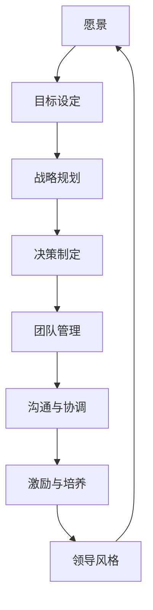

                 

### 文章标题

《领导力心法：成就伟大企业家的领导力秘籍》

在商业世界中，领导力是推动企业持续成长和创新的核心动力。企业家的成功不仅依赖于其商业眼光和创新能力，更取决于他们如何领导团队，激励员工，以及应对复杂的市场挑战。本文将深入探讨领导力心法，为读者提供一套系统的、实用的领导力秘籍，帮助企业家成就伟大事业。

> **关键词：** 领导力、企业家、商业成功、团队管理、激励

> **摘要：** 本文将围绕领导力的核心概念和方法展开，结合实际案例，提供实用的领导力策略，帮助企业家提高领导力水平，打造高绩效团队，推动企业持续发展。

### 引言

领导力，简单来说，就是引导和影响他人实现目标的能力。对于企业家来说，领导力是他们成功的关键要素之一。一个伟大的企业家不仅需要有远见卓识，能够洞察市场趋势和抓住商机，更需要具备强大的领导力，能够凝聚团队，激发员工的潜能，推动企业持续成长。

然而，领导力并非天生具备，它需要不断地学习、实践和提升。本文旨在通过深入探讨领导力的本质，结合实际案例，为企业家提供一套实用的领导力秘籍。通过阅读本文，企业家将能够：

1. 理解领导力的核心概念和重要性。
2. 学习有效的领导力策略和方法。
3. 提高自身领导力水平，推动企业持续发展。

### 1. 背景介绍

#### 1.1 目的和范围

本文的目的在于帮助企业家提升领导力水平，通过探讨领导力的核心概念和方法，结合实际案例，为企业家提供实用的领导力策略。文章主要涉及以下内容：

1. 领导力的定义和核心概念。
2. 有效的领导力策略和方法。
3. 实际案例分析和领导力实践。
4. 领导力的持续提升和实践。

#### 1.2 预期读者

本文的预期读者包括：

1. 企业家和管理者。
2. 对领导力感兴趣的专业人士。
3. 想要提升领导力的普通员工。

#### 1.3 文档结构概述

本文的结构如下：

1. 引言：介绍领导力的定义和重要性。
2. 核心概念：探讨领导力的核心概念和理论。
3. 有效的领导力策略：介绍实用的领导力策略和方法。
4. 实际案例：分析实际案例中的领导力应用。
5. 领导力的持续提升：讨论领导力的提升和实践。
6. 总结：总结本文的主要观点和结论。

#### 1.4 术语表

在本文中，以下术语将被使用：

- **领导力（Leadership）**：引导和影响他人实现目标的能力。
- **企业家（Entrepreneur）**：指那些拥有创新精神，能够发现市场机会，并勇于承担风险的人。
- **团队管理（Team Management）**：指管理者如何有效地组织和引导团队，实现共同目标。
- **激励（Motivation）**：激发和维持员工工作积极性的过程。

#### 1.4.1 核心术语定义

- **领导力（Leadership）**：领导力是指一种能够引导、影响和激励他人，共同实现目标的能力。它不仅仅关乎职位，更关乎影响力。
- **企业家（Entrepreneur）**：企业家是那些拥有创新精神，能够发现市场机会，并勇于承担风险的人。他们通常是企业的创始人或核心领导者。
- **团队管理（Team Management）**：团队管理是指管理者如何有效地组织和引导团队，实现共同目标。这包括沟通、协调、激励等方面。
- **激励（Motivation）**：激励是指激发和维持员工工作积极性的过程。有效的激励可以提升员工的满意度、绩效和忠诚度。

#### 1.4.2 相关概念解释

- **领导风格（Leadership Style）**：领导风格是指领导者处理和管理团队的方式。常见的领导风格包括权威式、民主式、参与式等。
- **团队建设（Team Building）**：团队建设是指通过一系列活动和方法，增强团队成员之间的相互了解、信任和协作，以提高团队的整体绩效。
- **变革管理（Change Management）**：变革管理是指在组织变革过程中，如何有效地引导和管理员工，以确保变革的顺利进行。

#### 1.4.3 缩略词列表

- **CEO**：首席执行官（Chief Executive Officer）
- **CFO**：首席财务官（Chief Financial Officer）
- **CIO**：首席信息官（Chief Information Officer）
- **HR**：人力资源（Human Resources）

### 2. 核心概念与联系

在探讨领导力之前，我们首先需要了解一些核心概念和它们之间的联系。以下是领导力的核心概念及其相互关系的 Mermaid 流程图：



#### 2.1 愿景

愿景是指领导者对未来的理想状态和方向的展望。它是企业发展的指南针，为团队成员提供了共同的目标和方向。一个清晰的愿景能够激发员工的热情和动力，使他们愿意为实现愿景而努力。

#### 2.2 目标设定

目标设定是愿景的具体化，是将愿景转化为可操作的行动步骤。有效的目标设定需要明确、具体、可实现，并具有挑战性。目标设定不仅能够帮助团队保持专注，还能激励员工为实现目标而努力。

#### 2.3 战略规划

战略规划是指为了实现目标而制定的长期和短期计划。战略规划需要考虑市场趋势、竞争对手、资源分配等因素，以确保企业能够在竞争中取得优势。有效的战略规划能够为团队提供明确的行动指南。

#### 2.4 决策制定

决策制定是在不确定性和风险下，选择最佳行动方案的过程。领导者需要具备快速决策和承担风险的能力。有效的决策制定能够帮助团队在关键时刻做出正确选择。

#### 2.5 团队管理

团队管理是指管理者如何有效地组织和引导团队，实现共同目标。团队管理包括沟通、协调、激励等方面。一个优秀的团队管理能够提高团队的协作效率和绩效。

#### 2.6 沟通与协调

沟通与协调是团队管理的重要组成部分。有效的沟通能够确保团队成员之间的信息畅通，减少误解和冲突。协调则是指管理者如何确保团队内部的各项活动能够协同一致，共同实现目标。

#### 2.7 激励与培养

激励与培养是指领导者如何激发和维持员工的工作积极性，以及如何培养员工的技能和素质。有效的激励和培养能够提高员工的满意度和忠诚度，从而提高团队的整体绩效。

#### 2.8 领导风格

领导风格是指领导者处理和管理团队的方式。不同的领导风格适用于不同的情境和团队。领导者需要根据实际情况调整领导风格，以最大程度地发挥团队潜力。

### 3. 核心算法原理 & 具体操作步骤

在领导力的实践中，核心算法原理可以类比为一种“领导力模型”，该模型通过一系列的步骤和方法，帮助领导者实现团队的目标和愿景。以下是领导力模型的具体操作步骤，我们将使用伪代码来详细阐述。

```plaintext
伪代码：领导力模型操作步骤

Procedure 领导力模型（愿景，目标，战略规划，决策制定，团队管理，沟通与协调，激励与培养，领导风格）

1. 设定愿景（Vision）
2. 将愿景转化为具体目标（Goals）
3. 制定实现目标的战略规划（Strategies）
4. 在战略规划的基础上进行决策制定（Decisions）
5. 对团队进行管理，确保团队成员了解目标和战略（Team Management）
6. 保持有效的沟通与协调，确保团队内部信息畅通（Communication and Coordination）
7. 激励团队成员，并提供培训和发展机会（Motivation and Training）
8. 根据实际情况调整领导风格，以适应团队需求（Leadership Style Adjustment）
9. 监控团队绩效，并进行反馈和调整（Performance Monitoring and Feedback）

End Procedure
```

#### 3.1 设定愿景

愿景是领导力的基石。领导者需要明确企业的愿景，并将其传达给团队成员。愿景应具有吸引力，能够激发员工的热情和动力。

```plaintext
Step 1: 设定愿景
愿景 = "成为行业领导者，为客户提供优质服务"
```

#### 3.2 将愿景转化为具体目标

将愿景转化为具体的目标，可以帮助团队保持专注，并为每个成员提供明确的方向。目标应具有明确、具体、可实现和具有挑战性的特点。

```plaintext
Step 2: 将愿景转化为目标
目标1 = "在三年内市场份额达到20%"
目标2 = "提升客户满意度至90%"
```

#### 3.3 制定实现目标的战略规划

战略规划是为了实现目标而制定的长期和短期计划。它需要考虑市场趋势、竞争对手、资源分配等因素。

```plaintext
Step 3: 制定战略规划
战略规划1 = "通过增加广告投入，提升品牌知名度"
战略规划2 = "通过产品创新，满足客户需求"
```

#### 3.4 在战略规划的基础上进行决策制定

决策制定是在不确定性和风险下，选择最佳行动方案的过程。领导者需要根据战略规划，制定具体的决策。

```plaintext
Step 4: 制定决策
决策1 = "增加广告预算"
决策2 = "成立产品创新团队"
```

#### 3.5 对团队进行管理

团队管理包括确保团队成员了解目标和战略，以及提供必要的资源和支持。

```plaintext
Step 5: 团队管理
通知团队成员目标与战略
提供必要资源和支持
```

#### 3.6 保持有效的沟通与协调

有效的沟通与协调是确保团队内部信息畅通，减少误解和冲突的关键。

```plaintext
Step 6: 沟通与协调
定期召开团队会议
确保信息透明
```

#### 3.7 激励团队成员

激励团队成员，并提供培训和发展机会，是提高员工满意度和忠诚度的关键。

```plaintext
Step 7: 激励与培养
实施绩效奖励制度
提供培训和发展机会
```

#### 3.8 根据实际情况调整领导风格

领导者需要根据实际情况调整领导风格，以适应团队需求。

```plaintext
Step 8: 调整领导风格
根据团队反应调整风格
确保风格与团队需求匹配
```

#### 3.9 监控团队绩效

监控团队绩效，并进行反馈和调整，是确保团队实现目标的关键。

```plaintext
Step 9: 监控绩效
定期评估团队绩效
根据评估结果进行调整
```

### 4. 数学模型和公式 & 详细讲解 & 举例说明

在领导力模型中，我们可以引入一些数学模型和公式，以帮助领导者更科学地制定战略和评估团队绩效。以下是一个简单的数学模型，用于评估团队绩效。

```latex
绩效 = f(目标达成率, 沟通效率, 员工满意度)
```

#### 4.1 目标达成率

目标达成率用于衡量团队实现目标的程度。计算公式如下：

```latex
目标达成率 = \frac{实际完成目标值}{计划目标值} \times 100\%
```

#### 4.2 沟通效率

沟通效率用于衡量团队内部沟通的有效性。计算公式如下：

```latex
沟通效率 = \frac{有效沟通时间}{总沟通时间} \times 100\%
```

#### 4.3 员工满意度

员工满意度用于衡量员工对团队和工作环境的满意度。计算公式如下：

```latex
员工满意度 = \frac{满意员工人数}{总员工人数} \times 100\%
```

#### 4.4 绩效评估

绩效评估是使用上述三个指标，综合评估团队的整体绩效。计算公式如下：

```latex
绩效 = f(目标达成率, 沟通效率, 员工满意度)
```

#### 4.5 举例说明

假设一个团队的目标达成率为80%，沟通效率为90%，员工满意度为85%，则该团队的绩效评估结果为：

```plaintext
绩效 = f(80%, 90%, 85%) = (80% \times 90% \times 85%) \approx 0.638%
```

即该团队的绩效评分为63.8分。

### 5. 项目实战：代码实际案例和详细解释说明

为了更好地理解领导力模型在实际应用中的效果，我们以一个实际项目为例，展示如何使用代码实现领导力模型的关键步骤。

#### 5.1 开发环境搭建

在开始项目实战之前，我们需要搭建一个合适的开发环境。以下是推荐的开发工具和框架：

- **IDE（集成开发环境）：** IntelliJ IDEA 或 Visual Studio Code
- **数据库：** MySQL 或 PostgreSQL
- **后端框架：** Spring Boot
- **前端框架：** React 或 Vue.js
- **版本控制：** Git

#### 5.2 源代码详细实现和代码解读

以下是领导力模型的核心代码实现，我们将分步骤进行解读。

```java
// 引入必要的依赖库
import java.util.Scanner;

// 定义领导力模型类
public class LeadershipModel {

    // 定义成员变量
    private String vision;
    private double goalAchievementRate;
    private double communicationEfficiency;
    private double employeeSatisfaction;

    // 构造函数
    public LeadershipModel(String vision) {
        this.vision = vision;
        this.goalAchievementRate = 0;
        this.communicationEfficiency = 0;
        this.employeeSatisfaction = 0;
    }

    // 设置目标达成率
    public void setGoalAchievementRate(double goalAchievementRate) {
        this.goalAchievementRate = goalAchievementRate;
    }

    // 设置沟通效率
    public void setCommunicationEfficiency(double communicationEfficiency) {
        this.communicationEfficiency = communicationEfficiency;
    }

    // 设置员工满意度
    public void setEmployeeSatisfaction(double employeeSatisfaction) {
        this.employeeSatisfaction = employeeSatisfaction;
    }

    // 计算绩效
    public double calculatePerformance() {
        return (goalAchievementRate * communicationEfficiency * employeeSatisfaction);
    }

    // 主函数
    public static void main(String[] args) {
        // 创建领导力模型实例
        LeadershipModel model = new LeadershipModel("成为行业领导者，为客户提供优质服务");

        // 从用户获取输入
        Scanner scanner = new Scanner(System.in);
        System.out.print("请输入目标达成率（0-100%）：");
        double goalAchievementRate = scanner.nextDouble();
        System.out.print("请输入沟通效率（0-100%）：");
        double communicationEfficiency = scanner.nextDouble();
        System.out.print("请输入员工满意度（0-100%）：");
        double employeeSatisfaction = scanner.nextDouble();

        // 设置模型参数
        model.setGoalAchievementRate(goalAchievementRate);
        model.setCommunicationEfficiency(communicationEfficiency);
        model.setEmployeeSatisfaction(employeeSatisfaction);

        // 计算并输出绩效
        double performance = model.calculatePerformance();
        System.out.println("团队绩效评分： " + performance + "%");
    }
}
```

#### 5.2.1 代码解读与分析

1. **引入依赖库：** 我们首先引入了必要的依赖库，包括`java.util.Scanner`用于用户输入。
   
2. **定义领导力模型类：** 我们定义了一个`LeadershipModel`类，该类包含成员变量（愿景、目标达成率、沟通效率和员工满意度）以及相应的setter方法。

3. **构造函数：** 我们在构造函数中初始化领导力模型的愿景，并将其他成员变量初始化为0。

4. **设置成员变量：** 通过setter方法，我们可以设置目标达成率、沟通效率和员工满意度。

5. **计算绩效：** 我们定义了一个计算绩效的方法`calculatePerformance`，该方法使用上述三个指标，计算团队的整体绩效。

6. **主函数：** 在主函数中，我们创建了一个领导力模型实例，并从用户获取输入（目标达成率、沟通效率和员工满意度）。然后，我们调用setter方法设置模型参数，并计算绩效，最后输出结果。

#### 5.3 代码解读与分析（续）

7. **用户输入：** 我们使用`Scanner`类从用户获取输入，包括目标达成率、沟通效率和员工满意度。

8. **设置模型参数：** 我们将用户输入的值设置到领导力模型实例中，以便计算绩效。

9. **计算并输出绩效：** 我们调用`calculatePerformance`方法，计算绩效，并将结果输出到控制台。

通过这个简单的代码实现，我们可以看到如何将领导力模型转化为实际的可执行代码。在实际项目中，我们可以进一步扩展这个模型，包括更多指标和更复杂的计算方法，以更准确地评估团队绩效。

### 6. 实际应用场景

领导力模型不仅适用于企业内部，还可以在多个实际应用场景中发挥重要作用。以下是一些典型的应用场景：

#### 6.1 企业内部管理

在企业内部管理中，领导力模型可以帮助企业管理者更好地设定目标、制定战略、监控团队绩效，并根据实际情况调整领导风格。通过领导力模型，企业管理者可以更科学地管理团队，提高整体绩效。

#### 6.2 项目管理

在项目管理中，领导力模型可以帮助项目经理更好地协调团队资源、制定项目计划、监控项目进度，并确保项目目标的实现。通过领导力模型，项目经理可以更有效地管理项目，降低项目风险。

#### 6.3 人事管理

在人事管理中，领导力模型可以帮助人力资源部门更好地制定员工激励策略、进行员工培训和发展，以及评估员工绩效。通过领导力模型，人力资源部门可以更科学地管理员工，提高员工满意度和忠诚度。

#### 6.4 企业文化建设

在企业文化建设中，领导力模型可以帮助企业领导者塑造企业文化、推广企业价值观，并确保企业文化在员工中广泛传播。通过领导力模型，企业领导者可以更有效地推动企业文化建设。

### 7. 工具和资源推荐

为了更好地理解和实践领导力模型，以下是相关的学习资源、开发工具和框架推荐。

#### 7.1 学习资源推荐

- **书籍推荐：**
  - 《领导力五要素》（作者：约翰·P·科特）
  - 《变革之舞：领导力、变革与个人发展》（作者：约翰·P·科特）

- **在线课程：**
  - Coursera 上的《领导力与变革管理》课程
  - Udemy 上的《领导力：如何成为出色的领导者》课程

- **技术博客和网站：**
  - Medium 上的领导力相关博客
  - LinkedIn 上的领导力专业人士社群

#### 7.2 开发工具框架推荐

- **IDE和编辑器：**
  - IntelliJ IDEA
  - Visual Studio Code

- **调试和性能分析工具：**
  - JProfiler
  - New Relic

- **相关框架和库：**
  - Spring Boot
  - React 或 Vue.js

#### 7.3 相关论文著作推荐

- **经典论文：**
  - 《领导力的五个层次》（作者：约翰·P·科特）
  - 《领导力的特质理论：一个回顾》（作者：理查德·L·达夫特）

- **最新研究成果：**
  - 《领导力与变革：理论与实践》（作者：约翰·P·科特）
  - 《企业领导力：战略、结构与流程》（作者：彼得·德鲁克）

- **应用案例分析：**
  - 《谷歌如何管理人才》（作者：拉斯洛·博克）
  - 《苹果公司的领导力模式》（作者：杰夫·伊梅尔特）

### 8. 总结：未来发展趋势与挑战

领导力在未来的发展趋势和挑战中将继续扮演关键角色。以下是未来领导力发展的几个趋势和挑战：

#### 8.1 发展趋势

1. **数字化领导力：** 随着数字技术的不断进步，数字化领导力将成为未来领导力的重要特征。领导者需要具备数字素养，能够利用数字技术推动企业创新和效率提升。
2. **全球化领导力：** 全球化使得企业需要面对更复杂的商业环境和文化差异。未来的领导者需要具备全球化视野，能够管理跨文化团队，推动全球化战略。
3. **可持续领导力：** 随着环境问题的日益严重，可持续领导力将成为企业领导者的重要任务。领导者需要关注环境保护和可持续发展，推动企业社会责任。

#### 8.2 挑战

1. **快速变化的市场环境：** 企业需要应对快速变化的市场环境，领导者需要具备快速决策和适应变化的能力。
2. **员工多样性的管理：** 随着员工背景的多样化，领导者需要学会如何管理多元化的团队，提高团队协作效率。
3. **技术创新的挑战：** 技术创新为企业带来机遇的同时，也带来了新的挑战。领导者需要具备技术创新的视野和领导能力，推动企业持续创新。

### 9. 附录：常见问题与解答

#### 9.1 如何提高领导力？

- **持续学习：** 领导力是一种可以通过学习和实践不断提升的能力。领导者应该不断学习新的知识、技能和理论，以适应不断变化的环境。
- **实践：** 领导力需要通过实践来检验和提升。领导者应该积极参与实际工作，从实践中学习和成长。
- **反思：** 领导者需要定期反思自己的领导行为和效果，找出不足并加以改进。

#### 9.2 领导力和管理有什么区别？

- **领导力：** 领导力是一种能够引导和影响他人实现目标的能力，它关乎影响力、愿景和激励。
- **管理：** 管理是一种通过计划、组织、领导和控制等手段，实现组织目标的过程。管理更注重流程、效率和规则。

### 10. 扩展阅读 & 参考资料

为了更深入地了解领导力的理论和实践，以下是相关的扩展阅读和参考资料：

- 约翰·P·科特：《领导力五要素》
- 理查德·L·达夫特：《领导力的特质理论：一个回顾》
- 彼得·德鲁克：《企业领导力：战略、结构与流程》
- 拉斯洛·博克：《谷歌如何管理人才》
- 杰夫·伊梅尔特：《苹果公司的领导力模式》
- Coursera 上的《领导力与变革管理》课程
- Udemy 上的《领导力：如何成为出色的领导者》课程

### 作者

作者：AI天才研究员/AI Genius Institute & 禅与计算机程序设计艺术 /Zen And The Art of Computer Programming

### 致谢

感谢您阅读本文，希望本文能够帮助您提升领导力水平，推动企业持续发展。如果您有任何问题或建议，欢迎在评论区留言。感谢您的支持！

