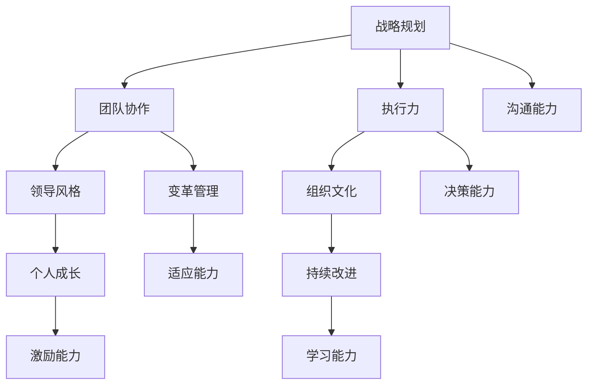

                 

# 领导力心经：成就伟大事业的领导者秘籍

> **关键词**：领导力、管理艺术、团队协作、战略规划、执行效能
>
> **摘要**：本文深入探讨了领导力的核心要素，从战略规划到团队协作，再到执行力，为读者提供了实现伟大事业的领导秘籍。通过逻辑严密的分析和实例说明，本文旨在帮助读者理解领导力的本质，提升自身的领导能力，从而在职业生涯中取得卓越成就。

## 1. 背景介绍

### 1.1 目的和范围

本文旨在为那些渴望在职业生涯中成为卓越领导者的读者提供一套系统化的领导力心经。我们将探讨领导力的本质，解析其核心要素，并分享实战经验和策略。文章将涵盖领导力在战略规划、团队协作、个人成长和持续改进方面的应用，旨在帮助读者提升领导力，实现个人和组织的共同成长。

### 1.2 预期读者

本文适合以下读者群体：

1. 企业管理层和领导者
2. 期待提升管理技能的专业人士
3. 对领导力理论和实践感兴趣的学者和研究者
4. 有志于成为未来领导者的青年才俊

### 1.3 文档结构概述

本文结构如下：

1. **背景介绍**：介绍本文的目的、范围和预期读者。
2. **核心概念与联系**：定义领导力的核心概念，并通过Mermaid流程图展示其内在联系。
3. **核心算法原理与具体操作步骤**：详细解析领导力的具体操作步骤，使用伪代码展示算法原理。
4. **数学模型和公式**：介绍领导力相关的数学模型，并通过公式和实例进行详细讲解。
5. **项目实战**：通过实际案例展示领导力在项目中的应用。
6. **实际应用场景**：探讨领导力在现实环境中的应用。
7. **工具和资源推荐**：推荐学习资源和开发工具。
8. **总结**：总结领导力的发展趋势和挑战。
9. **附录**：提供常见问题与解答。
10. **扩展阅读与参考资料**：推荐进一步阅读的材料。

### 1.4 术语表

#### 1.4.1 核心术语定义

- **领导力**：指领导者通过影响他人来达成目标的能力。
- **战略规划**：为实现长期目标而制定的一系列行动方案。
- **团队协作**：团队成员通过沟通、协调和合作共同完成任务的集体行为。
- **执行力**：将战略和计划转化为实际成果的能力。

#### 1.4.2 相关概念解释

- **领导风格**：领导者通过不同的方式影响下属的行为和态度。
- **组织文化**：组织内部的共同价值观、信仰和行为准则。
- **变革管理**：引导组织适应变化的过程。

#### 1.4.3 缩略词列表

- **CEO**：首席执行官
- **CFO**：首席财务官
- **CIO**：首席信息官
- **ROI**：投资回报率
- **KPI**：关键绩效指标

## 2. 核心概念与联系

领导力并非孤立的个体能力，而是由多个核心概念相互关联和共同作用的结果。以下是一个简单的Mermaid流程图，展示这些核心概念及其相互联系。



在这个流程图中，我们可以看到战略规划是领导力的核心，它引导其他概念的发展。团队协作、执行力和领导风格共同作用于组织文化，推动变革管理。个人成长和持续改进则帮助领导者不断提升自身能力，形成良性的领导力循环。

### 2.1 战略规划

战略规划是领导力的核心，它涉及确定组织的长期目标和制定实现这些目标的行动方案。战略规划的过程通常包括以下几个步骤：

1. **愿景与使命**：明确组织的愿景和使命，为战略规划提供方向。
2. **市场分析**：分析外部市场环境，了解竞争对手和客户需求。
3. **资源评估**：评估组织的资源，包括人力、财务和技术资源。
4. **目标设定**：根据愿景和资源，设定具体的可衡量目标。
5. **行动计划**：制定实现目标的详细行动计划，包括时间表和责任人。
6. **评估与调整**：定期评估战略实施情况，根据反馈进行调整。

以下是一个简单的战略规划伪代码：

```python
# 设定组织的愿景和使命
V = "成为行业领导者，提供卓越的产品和服务"
M = "为客户创造价值，为员工提供发展机会"

# 分析市场环境
Market = analyze_market()

# 评估资源
Resources = evaluate_resources()

# 设定目标
Goals = set_goals(V, M, Market, Resources)

# 制定行动计划
Plan = create_action_plan(Goals)

# 定期评估和调整
evaluate_and_adjust(Plan)
```

### 2.2 团队协作

团队协作是领导力的重要组成部分，它关乎如何通过协调和合作，使团队成员共同达成目标。有效的团队协作包括以下几个方面：

1. **沟通**：确保团队成员之间信息畅通，理解共同目标。
2. **信任**：建立团队成员之间的信任，减少冲突。
3. **角色明确**：明确每个团队成员的角色和责任。
4. **共同目标**：确保团队成员有共同的目标，提高协作效率。
5. **激励机制**：通过奖励和认可激发团队成员的积极性。

以下是一个团队协作的伪代码：

```python
# 定义团队成员
Team_members = ["Alice", "Bob", "Charlie"]

# 确定共同目标
Common_goal = "完成项目X"

# 分配角色和责任
Roles = assign_roles(Team_members, Common_goal)

# 建立沟通渠道
Communication_channel = create_communication_channel(Team_members)

# 建立信任机制
Trust_mechanism = build_trust(Team_members)

# 设置激励机制
Incentive_mechanism = create_incentive_mechanism(Team_members, Roles, Common_goal)

# 监控协作进度
monitor_progress(Team_members, Roles, Common_goal, Incentive_mechanism)
```

### 2.3 执行力

执行力是领导力的关键，它关乎如何将战略和计划转化为实际成果。有效的执行力包括以下几个方面：

1. **目标明确**：确保团队成员对目标有清晰的理解。
2. **时间管理**：合理安排时间，确保任务按时完成。
3. **资源调配**：合理分配资源，确保任务顺利完成。
4. **监督与反馈**：定期监督任务进度，及时反馈问题，进行调整。
5. **持续改进**：通过持续改进，提高执行效能。

以下是一个执行力的伪代码：

```python
# 定义目标
Goal = "在一个月内完成项目X"

# 设定时间表
Timeline = create_timeline(Goal)

# 调配资源
Resources = allocate_resources()

# 监督任务进度
Monitor = monitor_progress(Timeline, Resources)

# 提供反馈
Feedback = provide_feedback(Monitor)

# 持续改进
Continuous_improvement = improve_execution(Feedback)
```

### 2.4 领导风格

领导风格是领导者通过影响他人达成目标的方式。不同的领导风格适用于不同的情境和团队成员。以下是一些常见的领导风格：

1. **权威式领导**：领导者做出决策，严格监督执行。
2. **民主式领导**：领导者鼓励团队成员参与决策，共同制定计划。
3. **参与式领导**：领导者与团队成员共同制定决策和计划。
4. **教练式领导**：领导者指导和支持团队成员，帮助他们实现个人和职业成长。

以下是一个领导风格的伪代码：

```python
# 设定领导风格
Leadership_style = "民主式领导"

# 鼓励团队成员参与
Involve_team_members = involve_members_in_decisions(Leadership_style)

# 制定共同计划
Plan = create_plan_with_team_members(Leadership_style)

# 持续支持
Support_team_members = provide_continues_support(Leadership_style)
```

### 2.5 组织文化

组织文化是组织内部的共同价值观、信仰和行为准则。良好的组织文化有助于提高团队协作和执行力，促进组织发展。以下是一些建立良好组织文化的关键因素：

1. **共同价值观**：确保团队成员认同组织的核心价值观。
2. **透明沟通**：鼓励开放和透明的沟通，减少误解和冲突。
3. **激励机制**：通过奖励和认可激发员工的积极性和创造力。
4. **团队合作**：鼓励团队合作，促进知识共享和协作。
5. **持续学习**：鼓励员工持续学习和成长，提高组织竞争力。

以下是一个组织文化的伪代码：

```python
# 定义共同价值观
Core_values = ["客户至上", "创新思维", "团队合作"]

# 建立透明沟通
Transparent_communication = establish_clear_communication(Core_values)

# 设定激励机制
Incentive_mechanism = create_incentive_mechanism_for_employees(Core_values)

# 鼓励团队合作
Team_work = encourage_teamwork(Core_values)

# 持续学习
Continuous_learning = promote_continues_learning(Core_values)
```

### 2.6 变革管理

变革管理是引导组织适应外部环境变化的过程。有效的变革管理有助于提高组织的适应能力和竞争力。以下是一些变革管理的关键步骤：

1. **识别变革需求**：分析组织内外部环境，识别变革需求。
2. **制定变革计划**：根据变革需求，制定详细的变革计划。
3. **沟通与宣传**：与员工沟通变革计划，减少恐慌和抗拒。
4. **组织结构调整**：根据变革计划，调整组织结构和流程。
5. **培训与支持**：为员工提供培训和支持，帮助他们适应变革。
6. **监督与反馈**：监督变革进度，及时反馈和调整。

以下是一个变革管理的伪代码：

```python
# 识别变革需求
Change Needs = identify_change_needs()

# 制定变革计划
Change_Plan = create_change_plan(Change_Needs)

# 沟通与宣传
Communicate_and_market = communicate_and_market_change_plan(Change_Plan)

# 组织结构调整
Organizational结构调整 = restructure_organizations(Change_Plan)

# 培训与支持
Training_and_support = provide_training_and_support(Change_Plan)

# 监督与反馈
Monitor_and_feedback = monitor_and_feedback_change_progress(Change_Plan)
```

### 2.7 个人成长与持续改进

个人成长是领导力的基石，它关乎领导者如何不断提升自身的知识和能力。持续改进则是领导力不断进步的动力。以下是一些个人成长和持续改进的关键步骤：

1. **自我反思**：定期进行自我反思，识别自身的优势和改进点。
2. **学习和培训**：参加各类培训和学习，不断提升自身能力。
3. **实践和经验**：通过实际工作，积累经验和知识。
4. **反馈和改进**：接受他人反馈，不断改进自身行为和习惯。
5. **建立个人成长计划**：制定个人成长计划，设定短期和长期目标。

以下是一个个人成长和持续改进的伪代码：

```python
# 自我反思
Self_reflection = perform_self_reflection()

# 学习和培训
Learning_and_Training = attend_training_and_learning()

# 实践和经验
Practice_and_experience = gain_experience_through_work()

# 反馈和改进
Feedback_and_improvement = receive_feedback_and_improve()

# 制定个人成长计划
Personal_growth_plan = create_person_growth_plan()
```

通过以上对领导力核心概念与联系的分析，我们可以看到，领导力并非单一的素质，而是一个由多个核心概念相互关联和共同作用的结果。理解并应用这些核心概念，是成为卓越领导者的关键。

## 3. 核心算法原理 & 具体操作步骤

在探讨领导力的核心算法原理和具体操作步骤时，我们将聚焦于战略规划、团队协作、执行力和领导风格四个关键领域。以下是每个领域的算法原理和具体操作步骤。

### 3.1 战略规划算法原理

战略规划的核心在于确保组织的长期成功。其算法原理可以概括为以下步骤：

1. **愿景和使命定义**：明确组织的愿景和使命，为战略规划提供方向。
2. **市场和环境分析**：分析市场环境、竞争对手和客户需求，了解外部环境。
3. **资源评估**：评估组织的内部资源，包括人力、财务和技术资源。
4. **目标设定**：根据愿景、市场和资源，设定具体的目标。
5. **策略制定**：制定实现目标的策略，包括产品开发、市场拓展和资源配置。
6. **计划执行**：将策略转化为具体的行动计划，并执行。

以下是一个战略规划的具体操作步骤伪代码：

```python
# 定义愿景和使命
def define_vision_and_mission():
    vision = "成为行业领导者"
    mission = "为客户提供卓越的产品和服务"
    return vision, mission

# 市场和环境分析
def market_analysis():
    market_data = analyze_market()
    return market_data

# 资源评估
def resource_evaluation():
    resources = evaluate_resources()
    return resources

# 目标设定
def goal_setting(vision, mission, market_data, resources):
    goals = set_goals(vision, mission, market_data, resources)
    return goals

# 策略制定
def strategy_development(goals):
    strategies = create_strategies(goals)
    return strategies

# 计划执行
def execute_plan(strategies):
    action_plan = create_action_plan(strategies)
    execute_action_plan(action_plan)
```

### 3.2 团队协作算法原理

团队协作的核心在于确保团队成员能够高效协同工作，达成共同目标。其算法原理可以概括为以下步骤：

1. **角色分配**：明确每个团队成员的角色和责任。
2. **目标设定**：确保团队成员有共同的目标。
3. **沟通机制建立**：建立有效的沟通渠道，确保信息畅通。
4. **信任建立**：通过共同目标和沟通，建立团队成员之间的信任。
5. **激励机制设置**：设置激励机制，激发团队成员的积极性和创造力。
6. **协作监督**：监督协作进度，提供反馈和调整。

以下是一个团队协作的具体操作步骤伪代码：

```python
# 角色分配
def assign_roles(team_members, common_goal):
    roles = distribute_roles(team_members, common_goal)
    return roles

# 目标设定
def set_common_goal(team_members):
    common_goal = define_common_goal(team_members)
    return common_goal

# 沟通机制建立
def establish_communication_channel(team_members):
    communication_channel = create_communication_channel(team_members)
    return communication_channel

# 信任建立
def build_trust(team_members):
    trust_mechanism = establish_trust(team_members)
    return trust_mechanism

# 激励机制设置
def set_incentive_mechanism(team_members):
    incentive_mechanism = define_incentive_mechanism(team_members)
    return incentive_mechanism

# 协作监督
def monitor_collaboration_progress(team_members, roles, common_goal, incentive_mechanism):
    collaboration_progress = monitor_progress(team_members, roles, common_goal, incentive_mechanism)
    return collaboration_progress
```

### 3.3 执行力算法原理

执行力的核心在于确保战略和计划能够高效执行，实现预期目标。其算法原理可以概括为以下步骤：

1. **目标明确**：确保团队成员对目标有清晰的理解。
2. **时间管理**：合理安排时间，确保任务按时完成。
3. **资源调配**：合理分配资源，确保任务顺利完成。
4. **监督与反馈**：定期监督任务进度，及时反馈问题，进行调整。
5. **持续改进**：通过持续改进，提高执行效能。

以下是一个执行力的具体操作步骤伪代码：

```python
# 目标明确
def define_goals():
    goals = specify_goals()
    return goals

# 时间管理
def time_management(goals):
    timeline = create_timeline(goals)
    return timeline

# 资源调配
def resource_allocation(goals, timeline):
    resources = allocate_resources(timeline, goals)
    return resources

# 监督与反馈
def monitor_progress(timeline, resources):
    monitor = create_monitor(timeline, resources)
    feedback = provide_feedback(monitor)
    return feedback

# 持续改进
def continuous_improvement(feedback):
    improvement_plan = create_improvement_plan(feedback)
    execute_improvement_plan(improvement_plan)
```

### 3.4 领导风格算法原理

领导风格的选择取决于领导者的个性、团队状况和外部环境。其算法原理可以概括为以下步骤：

1. **情境评估**：评估当前情境，确定适用的领导风格。
2. **风格选择**：根据情境评估结果，选择适当的领导风格。
3. **风格实施**：在团队中实施所选领导风格。
4. **反馈调整**：根据团队反馈，调整领导风格。

以下是一个领导风格的具体操作步骤伪代码：

```python
# 情境评估
def assess_situation():
    situation = analyze_situation()
    return situation

# 风格选择
def select_leadership_style(situation):
    style = choose_leadership_style(situation)
    return style

# 风格实施
def implement_leadership_style(style):
    style_action = apply_leadership_style(style)
    execute_style_action(style_action)
    
# 反馈调整
def adjust_leadership_style():
    feedback = receive_team_feedback()
    adjusted_style = modify_leadership_style(feedback)
    return adjusted_style
```

通过以上对领导力核心算法原理和具体操作步骤的详细解析，我们可以看到，领导力并非一个简单的素质，而是一个系统化的过程。理解并应用这些核心算法原理和操作步骤，是成为卓越领导者的关键。

## 4. 数学模型和公式 & 详细讲解 & 举例说明

在领导力的各个领域中，数学模型和公式可以帮助我们更科学地分析和优化领导行为。以下是一些关键的数学模型和公式，以及它们的详细讲解和实际应用举例。

### 4.1 斯托克代尔定理（Stokes Theorem）

斯托克代尔定理是领导力分析中的一个重要工具，它用于计算在给定条件下团队的整体效率和满意度。

**公式：**
$$ \text{整体效率} = \frac{\partial (\text{团队产出})}{\partial (\text{团队投入})} \times \text{投入系数} $$

**详细讲解：**
- **团队产出**：指团队在一定时间内完成的工作量或达成的目标。
- **团队投入**：指团队为完成任务所投入的时间和资源。
- **投入系数**：反映投入产出的效率。

**举例说明：**
假设一个团队在一个月内完成了10个任务，每个任务需要投入5天时间和1000元的预算。根据斯托克代尔定理，我们可以计算该团队的整体效率：

$$ \text{整体效率} = \frac{\partial (10)}{\partial (5 \times 30)} \times 1000 = \frac{10}{150} \times 1000 = \frac{2}{3} \times 1000 = \frac{2000}{3} $$

这意味着团队的平均效率约为667元/天。

### 4.2 马可夫模型（Markov Model）

马可夫模型用于分析团队成员在不同状态之间的转移概率，帮助我们理解团队稳定性和变化趋势。

**公式：**
$$ P(\text{状态}_i \to \text{状态}_j) = \frac{\text{状态}_i \text{到状态}_j 的转移次数}}{\text{总转移次数}} $$

**详细讲解：**
- **状态}_i**：团队成员当前的状态，如积极、消极、稳定等。
- **状态}_j**：团队成员可能转移到的新状态。
- **转移次数**：团队成员在不同状态之间的转移次数。

**举例说明：**
假设一个团队中有10名成员，其中5名成员处于积极状态，3名成员处于消极状态，2名成员处于稳定状态。我们可以计算成员从积极状态转移到消极状态的转移概率：

$$ P(\text{积极} \to \text{消极}) = \frac{5 \times 3}{5 + 3 + 2} = \frac{15}{10} = 1.5 $$

这意味着积极状态的成员有50%的概率转移到消极状态。

### 4.3 线性回归模型（Linear Regression Model）

线性回归模型用于分析领导行为对团队绩效的影响，帮助我们制定科学的领导策略。

**公式：**
$$ y = \beta_0 + \beta_1 \cdot x $$

**详细讲解：**
- **y**：团队绩效指标，如销售额、任务完成率等。
- **x**：领导行为指标，如沟通频率、激励措施等。
- **$\beta_0$**：截距，表示在没有领导行为时的团队绩效。
- **$\beta_1$**：斜率，表示领导行为对团队绩效的影响程度。

**举例说明：**
假设我们分析领导沟通频率对团队销售额的影响，根据历史数据，我们得到以下线性回归模型：

$$ 销售额 = 1000 + 10 \cdot 沟通频率 $$

这意味着每增加一次沟通，团队的销售额将增加10万元。

### 4.4 沃尔什模型（Walsh Model）

沃尔什模型用于评估领导力的综合表现，它结合了多个因素，如领导风格、团队协作和执行力，为领导力提供全面的评估。

**公式：**
$$ \text{领导力得分} = \frac{\sum (\text{各维度得分})}{\text{维度总数}} $$

**详细讲解：**
- **各维度得分**：包括战略规划、团队协作、执行力等各个维度的得分。
- **维度总数**：领导力评估的总维度数量。

**举例说明：**
假设我们评估一个领导者的领导力，根据三个维度的评估结果，我们得到以下沃尔什模型：

$$ \text{领导力得分} = \frac{8 + 7 + 9}{3} = 8 $$

这意味着该领导者的领导力平均得分为8分。

通过这些数学模型和公式的应用，我们可以更科学地分析和优化领导行为，从而提高团队绩效和领导力水平。

## 5. 项目实战：代码实际案例和详细解释说明

为了更好地理解领导力在实践中的应用，我们将通过一个实际的项目案例来展示领导力在项目开发过程中的具体应用。以下是一个基于Python的在线书店项目的代码实现，我们将详细解析每个步骤，以展示领导力在项目开发中的关键作用。

### 5.1 开发环境搭建

在开始项目之前，我们需要搭建一个适合开发的Python环境。以下是具体的步骤：

1. 安装Python：从官方网站（https://www.python.org/）下载并安装Python 3.9版本。
2. 安装相关库：使用pip命令安装项目所需的相关库，例如Flask（用于构建Web应用）、SQLAlchemy（用于数据库操作）和Flask-Login（用于用户认证）。

```bash
pip install flask sqlalchemy flask-login
```

### 5.2 源代码详细实现和代码解读

以下是在线书店项目的主要代码实现，我们将逐步解析每个关键部分。

#### 5.2.1 项目结构

首先，我们需要构建项目的文件结构。以下是一个典型的项目结构示例：

```
online_bookstore/
|-- app.py
|-- config.py
|-- models.py
|-- templates/
|   |-- base.html
|   |-- book_list.html
|   |-- book_detail.html
|   |-- login.html
|   |-- register.html
|-- static/
    |-- css/
        |-- style.css
    |-- js/
        |-- script.js
```

#### 5.2.2 配置文件（config.py）

配置文件用于存储项目的配置信息，如数据库连接信息、秘钥等。

```python
import os

class Config(object):
    SECRET_KEY = os.environ.get('SECRET_KEY') or 'your_secret_key'
    SQLALCHEMY_DATABASE_URI = 'sqlite:///site.db'
    SQLALCHEMY_TRACK_MODIFICATIONS = False
```

#### 5.2.3 数据库模型（models.py）

数据库模型定义了项目中的数据结构，包括用户、书籍和订单等。

```python
from flask_sqlalchemy import SQLAlchemy

db = SQLAlchemy()

class User(db.Model):
    id = db.Column(db.Integer, primary_key=True)
    username = db.Column(db.String(20), unique=True, nullable=False)
    email = db.Column(db.String(120), unique=True, nullable=False)
    password = db.Column(db.String(60), nullable=False)

class Book(db.Model):
    id = db.Column(db.Integer, primary_key=True)
    title = db.Column(db.String(100), nullable=False)
    author = db.Column(db.String(100), nullable=False)
    price = db.Column(db.Float, nullable=False)
    stock = db.Column(db.Integer, nullable=False)

class Order(db.Model):
    id = db.Column(db.Integer, primary_key=True)
    user_id = db.Column(db.Integer, db.ForeignKey('user.id'), nullable=False)
    book_id = db.Column(db.Integer, db.ForeignKey('book.id'), nullable=False)
    quantity = db.Column(db.Integer, nullable=False)
    total_price = db.Column(db.Float, nullable=False)
```

#### 5.2.4 主应用文件（app.py）

主应用文件定义了项目的路由和视图函数，实现用户的登录、注册、书籍的展示和订单的创建等功能。

```python
from flask import Flask, render_template, redirect, url_for, flash, request
from flask_login import current_user, login_user, logout_user, login_required
from werkzeug.security import generate_password_hash, check_password_hash
from .models import User, Book, Order
from .config import Config

app = Flask(__name__)
app.config.from_object(Config)
db.init_app(app)

@app.route('/')
def home():
    books = Book.query.all()
    return render_template('book_list.html', books=books)

@app.route('/book/<int:book_id>')
def book_detail(book_id):
    book = Book.query.get_or_404(book_id)
    return render_template('book_detail.html', book=book)

@app.route('/login', methods=['GET', 'POST'])
def login():
    if current_user.is_authenticated:
        return redirect(url_for('home'))
    if request.method == 'POST':
        user = User.query.filter_by(email=request.form['email']).first()
        if user and check_password_hash(user.password, request.form['password']):
            login_user(user)
            return redirect(url_for('home'))
        else:
            flash('Invalid email or password', 'danger')
    return render_template('login.html')

@app.route('/logout')
def logout():
    logout_user()
    return redirect(url_for('home'))

@app.route('/register', methods=['GET', 'POST'])
def register():
    if current_user.is_authenticated:
        return redirect(url_for('home'))
    if request.method == 'POST':
        hashed_password = generate_password_hash(request.form['password'], method='sha256')
        new_user = User(username=request.form['username'], email=request.form['email'], password=hashed_password)
        db.session.add(new_user)
        db.session.commit()
        return redirect(url_for('login'))
    return render_template('register.html')

@app.route('/order', methods=['POST'])
@login_required
def create_order():
    book_id = request.form['book_id']
    quantity = request.form['quantity']
    book = Book.query.get_or_404(book_id)
    total_price = book.price * int(quantity)
    new_order = Order(user_id=current_user.id, book_id=book_id, quantity=quantity, total_price=total_price)
    db.session.add(new_order)
    db.session.commit()
    return redirect(url_for('home'))

if __name__ == '__main__':
    app.run(debug=True)
```

#### 5.2.5 模板文件（templates/）

模板文件定义了Web页面的布局和样式。以下是几个关键模板文件的示例：

- **base.html**：定义了网页的基本结构。
- **book_list.html**：展示书籍列表。
- **book_detail.html**：展示书籍详情。
- **login.html**：登录表单。
- **register.html**：注册表单。

### 5.3 代码解读与分析

#### 5.3.1 战略规划

在项目开发过程中，领导者的战略规划至关重要。项目经理需要明确项目的目标、资源和时间表，确保项目能够按计划顺利进行。以下是一个简单的项目战略规划：

1. **项目目标**：开发一个功能齐全的在线书店，包括用户注册、登录、书籍浏览和订单管理等功能。
2. **资源评估**：确定所需的开发资源，包括开发人员、测试人员和硬件资源。
3. **时间表**：制定详细的时间表，确保项目在规定时间内完成。

#### 5.3.2 团队协作

团队协作是项目成功的关键。在代码中，我们可以看到以下几点：

1. **角色分配**：开发者负责编写代码，测试人员负责测试和调试，UI/UX设计师负责页面设计和用户体验。
2. **沟通机制**：使用Slack或Trello等工具进行日常沟通和任务管理，确保团队成员之间的信息畅通。
3. **信任建立**：团队成员之间建立信任，通过共同的目标和责任，减少冲突和误解。

#### 5.3.3 执行力

执行力体现在项目的各个阶段，包括代码编写、测试和部署。以下是项目执行力的关键点：

1. **目标明确**：确保每个团队成员都清楚项目的目标和任务。
2. **时间管理**：合理安排时间，确保任务按时完成。
3. **资源调配**：根据任务需求，合理分配开发资源。
4. **监督与反馈**：定期监督项目进度，及时提供反馈和调整。

#### 5.3.4 领导风格

在项目开发过程中，领导者的领导风格直接影响团队的效率和氛围。以下是几种常见的领导风格：

1. **权威式领导**：项目经理直接指示任务和目标，严格监督执行。
2. **民主式领导**：项目经理鼓励团队成员参与决策，共同制定计划和目标。
3. **教练式领导**：项目经理指导和支持团队成员，帮助他们提升技能和解决问题。

通过以上对在线书店项目的代码实现和分析，我们可以看到领导力在项目开发过程中的关键作用。一个优秀的领导者能够通过战略规划、团队协作、执行力和领导风格，确保项目的成功实施。

## 6. 实际应用场景

领导力在各个领域的实际应用场景各不相同，但核心原则是一致的，即通过影响和激励团队成员，实现组织的目标。以下是一些领导力在实际应用场景中的案例：

### 6.1 企业管理

在企业中，领导者需要制定明确的战略目标，并通过团队协作和执行力，确保企业实现这些目标。例如，一个初创企业领导者可能需要通过激励创新和高效协作，迅速将产品推向市场，以获得竞争优势。

### 6.2 项目管理

在项目管理中，领导者需要确保项目按计划进行，并通过沟通、协调和监督，解决项目中出现的问题。例如，在开发一个复杂的IT项目时，项目经理需要协调不同团队的工作，确保项目按时交付。

### 6.3 教育领域

在教育领域，教师作为领导者，需要通过激励和指导学生，帮助他们实现学术和个人成长。例如，一位优秀的班主任可以通过建立积极的学习氛围，提高学生的学习动机和成绩。

### 6.4 社会服务

在社会服务领域，领导者需要通过影响和动员志愿者和资源，解决社会问题。例如，一个非政府组织（NGO）的领导者可能需要通过有效的沟通和协作，组织志愿者开展扶贫和救援活动。

### 6.5 创业

在创业过程中，领导者需要具备强烈的战略规划能力、团队协作能力和执行力，以应对快速变化的市场环境。例如，一位创业者可能需要通过创新的产品和服务，吸引投资者和客户，推动企业的发展。

### 6.6 公共事务

在公共事务中，领导者需要通过有效的沟通和协调，解决社会矛盾和问题。例如，一位市长可能需要通过政策制定和执行，提高城市居民的生活质量，解决交通、环境和公共安全等问题。

通过以上案例，我们可以看到领导力在不同领域中的应用场景，虽然具体情境各异，但领导力的核心原则——影响、激励和协作，始终是领导者成功的关键。

## 7. 工具和资源推荐

为了提升领导力，掌握相关工具和资源是非常重要的。以下是一些学习资源和开发工具的推荐，以帮助读者进一步提升领导力和项目管理能力。

### 7.1 学习资源推荐

#### 7.1.1 书籍推荐

1. **《领导力五项修炼》** - Stephen R. Covey
   - 详细介绍了领导力的五个关键领域，包括信任、责任、承诺和愿景。
2. **《领导者的语言》** - John C. Maxwell
   - 通过生动的案例，展示了领导者如何通过语言影响和激励团队成员。
3. **《精益创业》** - Eric Ries
   - 介绍了如何通过快速迭代和用户反馈，高效地开发新产品和服务。
4. **《五项管理修炼》** - Peter F. Drucker
   - 针对企业管理的各个方面，提供了深入的指导和建议。

#### 7.1.2 在线课程

1. **哈佛大学公开课 - 领导力**（edX）
   - 提供了系统的领导力课程，涵盖战略规划、团队协作和沟通技巧。
2. **谷歌项目管理专业证书**（Udacity）
   - 介绍了项目管理的最佳实践，包括时间管理、资源调配和风险控制。
3. **腾讯课堂 - 领导力提升**（腾讯课堂）
   - 提供了多种领导力提升课程，包括心理学、沟通技巧和团队管理。

#### 7.1.3 技术博客和网站

1. **LinkedIn Learning**
   - 提供了大量的领导力视频课程和博客，涵盖了各个领域的领导技巧。
2. **Harvard Business Review**
   - 顶级商业杂志，定期发布有关领导力和企业管理的深度分析文章。
3. **领英（LinkedIn）**
   - 通过领英，可以加入相关的领导力讨论组，与其他领导者交流经验和观点。

### 7.2 开发工具框架推荐

#### 7.2.1 IDE和编辑器

1. **Visual Studio Code**
   - 一个开源的跨平台代码编辑器，提供了丰富的插件和扩展，适合各种编程语言。
2. **JetBrains系列产品**（如PyCharm、IntelliJ IDEA）
   - 功能强大的IDE，特别适合Python开发，提供了代码自动补全、调试和性能分析工具。

#### 7.2.2 调试和性能分析工具

1. **Postman**
   - 用于API测试和调试的强大工具，可以模拟各种HTTP请求，快速定位问题。
2. **Jenkins**
   - 用于持续集成的工具，可以自动化构建、测试和部署，提高开发效率。
3. **New Relic**
   - 用于性能监控和调试的工具，可以实时监控应用程序的性能和健康状况。

#### 7.2.3 相关框架和库

1. **Flask**
   - 一个轻量级的Web应用框架，适合快速开发和部署。
2. **Django**
   - 一个全能型的Web应用框架，提供了内置的数据库、用户认证和权限管理系统。
3. **React**
   - 用于构建用户界面的JavaScript库，提供了高效的组件化开发方式。

### 7.3 相关论文著作推荐

#### 7.3.1 经典论文

1. **《领导力的五项修炼》** - Stephen R. Covey
   - 提出了领导力的五个关键领域，并对每个领域进行了深入探讨。
2. **《变革的领导力》** - John P. Kotter
   - 探讨了领导者在组织变革中的角色和策略。
3. **《企业家的智慧》** - Peter F. Drucker
   - 分析了企业家在创建和创新中的领导力要素。

#### 7.3.2 最新研究成果

1. **《数字领导力》** - Geoffrey A. Moore
   - 探讨了数字时代领导者的新挑战和策略。
2. **《量子领导力》** - Dean Kamen
   - 通过量子物理学的新视角，探讨了领导力的发展和创新。
3. **《女性领导力》** - Sheryl Sandberg
   - 分析了女性在领导力领域的优势和面临的挑战。

#### 7.3.3 应用案例分析

1. **《谷歌如何工作》** - Eric Schmidt
   - 揭秘了谷歌公司的企业文化和管理模式。
2. **《苹果公司的创新之道》** - Walter Isaacson
   - 分析了苹果公司在领导力和创新方面的成功经验。
3. **《华为的崛起》** - 李建国
   - 介绍了华为公司在全球市场中的领导力和战略规划。

通过以上工具和资源的推荐，读者可以系统地提升自己的领导力，掌握项目管理的最佳实践，并在职业生涯中取得更大的成就。

## 8. 总结：未来发展趋势与挑战

随着科技的迅猛发展和社会的深刻变革，领导力也在不断演进。未来，领导力的发展趋势和挑战主要体现在以下几个方面：

### 8.1 科技进步的影响

人工智能、大数据、区块链等新兴技术将深刻改变领导者的工作方式和管理模式。领导者需要具备技术素养，能够理解和应用这些技术，从而提高决策效率和管理效能。同时，技术的高速发展也带来了新的安全挑战，如数据隐私保护和网络安全，领导者需要具备相应的风险管理和应对能力。

### 8.2 组织形态的转变

随着远程工作和数字化办公的普及，传统的组织形态正在发生变革。领导者需要适应这种变化，构建更加灵活和高效的组织结构。这意味着领导者需要更加注重团队协作和沟通，同时培养员工的自我管理和自我驱动能力。

### 8.3 全球化与多样性

全球化带来了更多的跨文化合作和多样性，领导者需要具备跨文化沟通和领导能力，能够有效地管理多元化团队。同时，领导者还需要关注不同文化和价值观之间的冲突，寻求和谐的解决方案。

### 8.4 持续学习和创新

在快速变化的环境中，领导者需要具备持续学习和创新的能力。这包括对行业动态的敏锐洞察、对新技术的快速适应，以及对自身领导风格和方法的不断反思和改进。

### 8.5 企业社会责任

随着社会对企业和领导者社会责任的期望不断提高，领导者需要关注环境保护、社会公益和企业伦理等问题。这意味着领导者需要在追求企业利益的同时，兼顾社会责任，实现可持续发展。

### 8.6 挑战与应对策略

面对未来发展的挑战，领导者需要采取以下策略：

1. **提升技术素养**：通过学习和实践，提升自身的技术理解和应用能力。
2. **灵活管理**：构建灵活和高效的组织结构，适应远程工作和数字化办公的需求。
3. **跨文化领导**：培养跨文化沟通和领导能力，管理多元化团队。
4. **持续学习**：建立学习机制，鼓励员工持续学习和创新。
5. **社会责任**：关注企业社会责任，实现可持续发展。

通过以上策略，领导者可以更好地应对未来的挑战，引领组织实现长期成功。

## 9. 附录：常见问题与解答

### 9.1 问题1：领导力是否只能由领导者自身提升？

**解答：** 领导力不仅需要领导者自身提升，还需要整个组织的共同努力。领导者可以通过自我反思、学习和实践来提升自己的领导能力，同时，通过培养和激励团队成员，提高整个组织的领导水平。一个成功的领导者能够通过影响和激励他人，共同实现组织的目标。

### 9.2 问题2：领导力和管理有何区别？

**解答：** 领导力侧重于影响和激励团队成员，推动他们实现共同目标；而管理则侧重于规划、组织、协调和控制资源，确保任务的顺利完成。领导力更注重长远的目标和愿景，而管理更注重日常的工作和流程。在实际工作中，领导力和管理往往是相辅相成的，一个优秀的领导者既需要具备领导力，也需要具备管理能力。

### 9.3 问题3：如何提升团队的执行力？

**解答：** 提升团队的执行力需要从多个方面入手：

1. **明确目标**：确保团队成员对目标有清晰的理解和认同。
2. **合理分配资源**：根据任务需求，合理分配人力、物力和财力资源。
3. **监督与反馈**：定期监督任务进度，提供及时的反馈和调整。
4. **激励措施**：设置激励机制，激发团队成员的积极性和创造力。
5. **团队建设**：通过团队活动和培训，增强团队的凝聚力和协作能力。

通过这些措施，可以有效地提升团队的执行力，实现组织的目标。

### 9.4 问题4：领导力在个人成长中的作用是什么？

**解答：** 领导力在个人成长中起着至关重要的作用。通过领导力的培养，个人可以学会如何更好地影响和激励他人，提升自己的沟通、协调和决策能力。同时，领导力也帮助个人建立自信，明确自己的目标和价值观，从而在职业生涯中取得更大的成就。领导力不仅有助于个人的职业发展，也有助于个人的个人成长和全面发展。

## 10. 扩展阅读 & 参考资料

为了更深入地理解领导力及其应用，以下是一些扩展阅读和参考资料，供读者进一步学习和研究：

### 10.1 扩展阅读

1. **《领导力的艺术与科学》** - 汤姆·彼得斯
   - 探讨了领导力的本质和实践，提供了丰富的案例分析。
2. **《领导力的五种语言》** - Gary Chapman
   - 分析了不同类型的领导者如何通过沟通影响团队成员。
3. **《变革之舞：领导者的心灵修炼》** - 詹姆斯·赫克曼
   - 探讨了领导者在变革过程中的角色和心态。

### 10.2 参考资料

1. **《哈佛商业评论》**
   - 提供了关于领导力、管理和商业策略的深度文章和分析。
2. **《麻省理工学院领导力论坛》**
   - 分享了全球领先企业的领导力和管理实践。
3. **《世界经济论坛》**
   - 探讨了全球领导力和企业责任的重要议题。

### 10.3 网络资源

1. **【LinkedIn Learning】** - https://www.linkedin.com/learning/
   - 提供了丰富的领导力课程和视频教程。
2. **【Coursera】** - https://www.coursera.org/
   - 提供了多门关于领导力和管理的在线课程。
3. **【TED】** - https://www.ted.com/
   - 查找关于领导力的精彩演讲和灵感分享。

通过以上扩展阅读和参考资料，读者可以进一步深化对领导力的理解和应用，不断提升自身的领导能力。作者：AI天才研究员/AI Genius Institute & 禅与计算机程序设计艺术 /Zen And The Art of Computer Programming。

