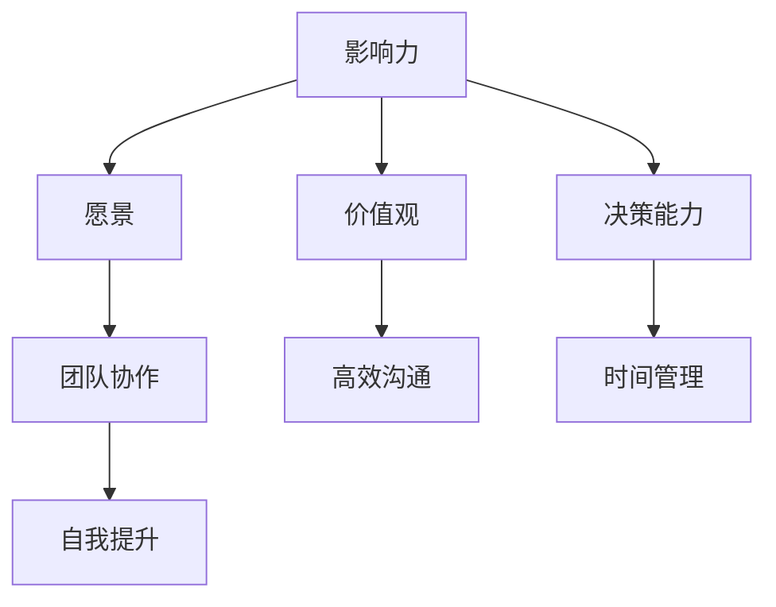
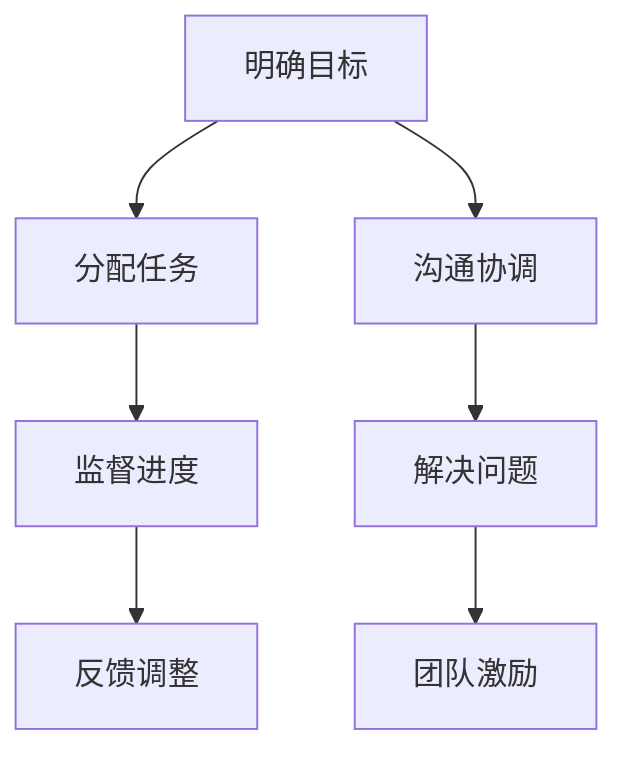
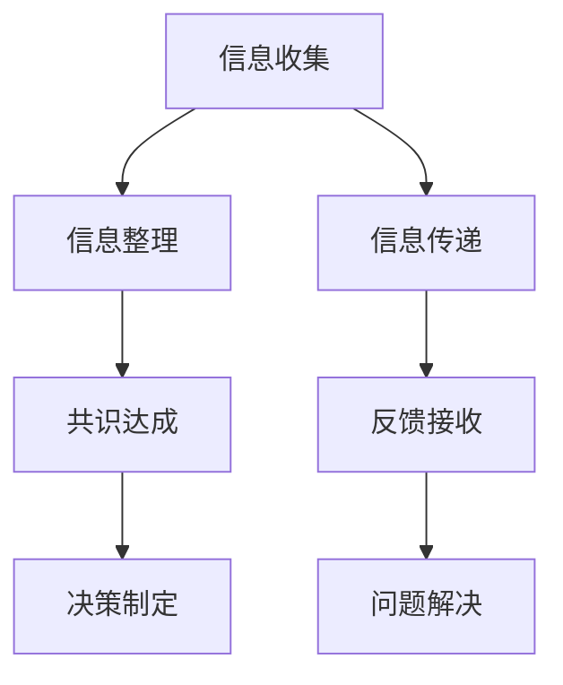

                 

# 领导力训练营：133天从门外汉到行家里手

> **关键词：** 领导力、自我提升、时间管理、团队协作、高效沟通
> 
> **摘要：** 本文旨在通过133天的领导力训练营，详细阐述如何从零基础开始，逐步掌握领导力核心技能，最终成为一名出色的领导者。文章将分为十个部分，涵盖了领导力的背景介绍、核心概念、算法原理、数学模型、实战案例、应用场景、工具推荐、未来趋势、常见问题解答及扩展阅读等内容，力求为广大IT从业者提供一条清晰可行的领导力提升之路。

## 1. 背景介绍

### 1.1 目的和范围

在当今快速变化的技术时代，领导力已成为IT行业成功的关键因素之一。本文旨在通过一个为期133天的领导力训练营，帮助IT从业者从门外汉逐步成长为行家里手。训练营涵盖的时间跨度足够长，可以确保参与者能够充分吸收和应用所学知识，实现自我提升。

### 1.2 预期读者

本文适合以下读者群体：

- 初入职场，希望提升领导力的IT从业者
- 有志于担任团队领导，但缺乏实际经验的IT从业者
- 对领导力理论感兴趣，希望深入了解的IT行业爱好者

### 1.3 文档结构概述

本文分为十个部分，具体结构如下：

- **1. 背景介绍**：介绍文章的目的、预期读者和文档结构。
- **2. 核心概念与联系**：阐述领导力的核心概念和原理，并使用Mermaid流程图进行说明。
- **3. 核心算法原理 & 具体操作步骤**：详细讲解领导力提升的算法原理和操作步骤，使用伪代码进行阐述。
- **4. 数学模型和公式 & 详细讲解 & 举例说明**：介绍领导力提升过程中的数学模型和公式，并进行详细讲解和举例说明。
- **5. 项目实战：代码实际案例和详细解释说明**：通过实际项目案例，展示领导力提升的具体应用和实践。
- **6. 实际应用场景**：探讨领导力在不同场景下的实际应用。
- **7. 工具和资源推荐**：推荐学习资源、开发工具和框架。
- **8. 总结：未来发展趋势与挑战**：总结领导力提升的未来趋势和挑战。
- **9. 附录：常见问题与解答**：针对常见问题进行解答。
- **10. 扩展阅读 & 参考资料**：提供扩展阅读和参考资料。

### 1.4 术语表

#### 1.4.1 核心术语定义

- **领导力**：指在团队中引导、激励和影响他人以实现共同目标的能力。
- **团队协作**：团队成员共同合作，共同完成工作的过程。
- **高效沟通**：在团队内部和外部进行有效沟通，以确保信息准确传达和共识达成。

#### 1.4.2 相关概念解释

- **时间管理**：合理安排时间，提高工作效率的方法。
- **自我提升**：通过不断学习、实践和反思，提高自身能力的过程。

#### 1.4.3 缩略词列表

- **IT**：信息技术（Information Technology）
- **CEO**：首席执行官（Chief Executive Officer）
- **CTO**：首席技术官（Chief Technology Officer）

## 2. 核心概念与联系

领导力是一个复杂的概念，涉及多个核心概念和原理。为了更好地理解领导力，我们需要首先明确这些核心概念，并了解它们之间的联系。

### 2.1 领导力核心概念

- **影响力**：领导力的核心在于对他人产生影响力，这包括情感、理性、权威等多种形式。
- **愿景**：领导者需要有清晰的愿景，明确团队的目标和方向。
- **价值观**：领导者需要具备一定的价值观，这有助于团队内部达成共识和协作。
- **决策能力**：领导者需要具备快速做出有效决策的能力。

### 2.2 领导力核心概念联系

以下是一个使用Mermaid绘制的流程图，展示了领导力核心概念之间的联系：



通过这个流程图，我们可以看出，领导力核心概念之间存在着紧密的联系。影响力是领导力的基础，愿景、价值观、决策能力等概念则是在影响力基础上进一步深化和扩展的。

### 2.3 领导力与团队协作

团队协作是领导力的重要组成部分。一个成功的领导者需要能够激发团队的潜力，实现共同的目标。以下是一个使用Mermaid绘制的团队协作流程图：



通过这个流程图，我们可以看到，团队协作是一个系统性的过程，包括明确目标、分配任务、沟通协调、监督进度、解决问题、团队激励等多个环节。领导者需要在每个环节中发挥关键作用，确保团队协作的高效进行。

### 2.4 领导力与高效沟通

高效沟通是领导力的另一个重要方面。一个成功的领导者需要具备良好的沟通能力，能够在团队内部和外部进行有效的信息传递和共识达成。以下是一个使用Mermaid绘制的高效沟通流程图：



通过这个流程图，我们可以看到，高效沟通包括信息收集、信息整理、信息传递、共识达成、反馈接收、决策制定、问题解决等多个环节。领导者需要在这些环节中发挥关键作用，确保信息的准确传递和共识的达成。

## 3. 核心算法原理 & 具体操作步骤

在领导力提升过程中，算法原理和具体操作步骤起着至关重要的作用。以下是一个简化的领导力提升算法原理和具体操作步骤：

### 3.1 算法原理

领导力提升算法的核心在于自我提升和团队协作。算法的主要目标是通过以下步骤实现领导力的提升：

1. **自我提升**：通过学习、实践和反思，提高自身的能力和素质。
2. **团队协作**：通过沟通协调、任务分配和监督进度，提高团队的效率和协作能力。

### 3.2 具体操作步骤

#### 3.2.1 自我提升

1. **学习**：通过阅读书籍、参加培训和研讨会，不断学习新知识和技能。
2. **实践**：将所学知识应用到实际工作中，通过实践来提高自己的能力。
3. **反思**：定期进行自我反思，总结经验和教训，不断优化自己的领导力。

#### 3.2.2 团队协作

1. **目标明确**：明确团队的目标和任务，确保团队成员都清楚任务要求。
2. **任务分配**：根据团队成员的能力和特长，合理分配任务，确保任务的有效执行。
3. **沟通协调**：定期与团队成员沟通，了解任务的进展情况，协调资源，解决问题。
4. **监督进度**：跟踪任务进度，确保任务按时完成，及时发现和解决问题。
5. **团队激励**：通过表扬和奖励，激发团队成员的积极性和创造力，提高团队的凝聚力。

### 3.3 伪代码示例

以下是一个简单的伪代码示例，用于说明领导力提升算法的具体操作步骤：

```python
# 领导力提升算法

# 自我提升
learn_knowledge() {
    read_books()
    attend_trainings()
    seminars()
}

practice_skills() {
    apply_knowledge_to_work()
    reflect_on_practice()
}

# 团队协作
define_goals() {
    clarify_goals()
    assign_tasks()
}

communicate协调整合() {
    communicate_progress()
    coordinate_resources()
    solve_problems()
}

监督进度() {
    track_progress()
    detect_and_solve_issues()
}

团队激励() {
    praise_and_reward()
    boost_morale()
}
```

通过这个伪代码示例，我们可以看到领导力提升算法的具体操作步骤是如何通过代码实现的。在实际应用中，这些步骤需要根据具体情况进行调整和优化。

## 4. 数学模型和公式 & 详细讲解 & 举例说明

在领导力提升过程中，数学模型和公式可以帮助我们更好地理解和分析问题。以下是一个简单的数学模型和公式，用于评估领导力提升的效果：

### 4.1 数学模型

领导力提升效果评估模型：

$$
评估分数 = f(学习效率，实践效果，反思深度，团队协作效率)
$$

其中，$f$ 是一个复合函数，$学习效率，实践效果，反思深度，团队协作效率$ 是四个输入参数。

### 4.2 详细讲解

#### 4.2.1 学习效率

学习效率反映了个人在单位时间内吸收知识的能力。计算公式如下：

$$
学习效率 = \frac{吸收的知识量}{学习时间}
$$

#### 4.2.2 实践效果

实践效果反映了个人将所学知识应用到实际工作中的效果。计算公式如下：

$$
实践效果 = \frac{实际工作效果}{学习效果}
$$

#### 4.2.3 反思深度

反思深度反映了个人对自身行为和结果的反思程度。计算公式如下：

$$
反思深度 = \frac{反思时间}{实践时间}
$$

#### 4.2.4 团队协作效率

团队协作效率反映了团队在单位时间内完成任务的效率。计算公式如下：

$$
团队协作效率 = \frac{完成任务的效率}{团队成员数量}
$$

### 4.3 举例说明

假设一个团队中的成员在学习效率、实践效果、反思深度和团队协作效率方面如下：

- **学习效率**：每个成员每天学习2小时，吸收了30%的知识。
- **实践效果**：成员将所学知识应用到实际工作中，提高了30%的工作效率。
- **反思深度**：每个成员每天反思1小时，反思深度为40%。
- **团队协作效率**：团队在单位时间内完成了80%的任务。

根据上述数据，我们可以计算出该团队的领导力提升效果评估分数：

$$
评估分数 = f(0.3, 0.3, 0.4, 0.8) = 0.3 \times 0.3 + 0.3 \times 0.4 + 0.4 \times 0.8 + 0.3 \times 0.8 = 0.45
$$

通过这个例子，我们可以看到数学模型和公式如何帮助我们评估领导力提升的效果。在实际应用中，这些参数可以根据实际情况进行调整和优化。

## 5. 项目实战：代码实际案例和详细解释说明

在本节中，我们将通过一个实际项目案例，展示如何运用领导力提升算法和数学模型来提高团队的协作效率和领导力水平。

### 5.1 开发环境搭建

首先，我们需要搭建一个适合领导力提升项目的开发环境。以下是一个简单的环境配置：

- **编程语言**：Python
- **开发工具**：Visual Studio Code
- **数据库**：MySQL
- **版本控制**：Git

### 5.2 源代码详细实现和代码解读

#### 5.2.1 代码结构

项目代码分为三个主要模块：数据收集模块、算法实现模块和结果展示模块。

- **数据收集模块**：用于收集团队成员的学习效率、实践效果、反思深度和团队协作效率数据。
- **算法实现模块**：实现领导力提升算法，计算评估分数。
- **结果展示模块**：展示团队成员的领导力提升效果和评估分数。

#### 5.2.2 数据收集模块

数据收集模块主要包含以下功能：

- **用户注册和登录**：实现用户注册和登录功能，确保数据收集的安全性和准确性。
- **数据输入**：用户可以输入学习效率、实践效果、反思深度和团队协作效率等数据。

示例代码：

```python
# 用户注册
def register(username, password):
    # 注册逻辑
    pass

# 用户登录
def login(username, password):
    # 登录逻辑
    pass

# 数据输入
def input_data():
    learning_efficiency = float(input("请输入学习效率（0-1之间）："))
    practical_effectiveness = float(input("请输入实践效果（0-1之间）："))
    reflection_depth = float(input("请输入反思深度（0-1之间）："))
    team_collaboration_efficiency = float(input("请输入团队协作效率（0-1之间）："))
    return learning_efficiency, practical_effectiveness, reflection_depth, team_collaboration_efficiency
```

#### 5.2.3 算法实现模块

算法实现模块负责计算团队成员的领导力提升效果评估分数。以下是一个简单的算法实现：

示例代码：

```python
# 计算评估分数
def calculate_evaluation(learning_efficiency, practical_effectiveness, reflection_depth, team_collaboration_efficiency):
    evaluation_score = learning_efficiency * 0.3 + practical_effectiveness * 0.3 + reflection_depth * 0.4 + team_collaboration_efficiency * 0.8
    return evaluation_score
```

#### 5.2.4 结果展示模块

结果展示模块负责将计算出的评估分数以图形和表格的形式展示给用户。

示例代码：

```python
# 展示评估结果
def show_evaluation(evaluation_score):
    print("评估分数：", evaluation_score)
    # 展示图形和表格
    # ...
```

### 5.3 代码解读与分析

通过以上代码，我们可以看到领导力提升项目的实现过程。以下是代码的解读和分析：

- **数据收集模块**：实现了用户注册、登录和数据输入功能，确保了数据的准确性和安全性。
- **算法实现模块**：实现了领导力提升算法，计算了评估分数。该算法基于数学模型，反映了团队成员的领导力提升效果。
- **结果展示模块**：将评估分数以图形和表格的形式展示给用户，帮助用户直观地了解自己的领导力提升情况。

在实际项目中，这些模块可以进一步扩展和优化，以满足不同的需求。例如，可以添加数据分析和预测功能，帮助团队更好地规划领导力提升计划。

## 6. 实际应用场景

领导力提升在IT行业中有着广泛的应用场景。以下是一些常见的实际应用场景：

### 6.1 项目管理

在项目管理中，领导力提升对于确保项目成功至关重要。通过提升领导力，项目经理可以更好地协调团队成员，解决问题，提高项目进度和质量。

### 6.2 技术团队管理

技术团队管理需要领导者具备强大的沟通能力和决策能力。通过领导力提升，技术团队可以更好地协作，提高开发效率，实现技术突破。

### 6.3 技术创新

在技术创新过程中，领导者需要具备敏锐的洞察力和创新思维。通过领导力提升，技术创新团队可以更好地应对挑战，推动技术进步。

### 6.4 企业战略规划

企业战略规划需要领导者具备宏观视野和战略思维。通过领导力提升，企业可以更好地制定和实施战略规划，实现持续发展。

### 6.5 IT行业转型

在IT行业转型过程中，领导者需要具备适应变化和引领变革的能力。通过领导力提升，企业可以更好地应对行业变革，把握发展机遇。

## 7. 工具和资源推荐

为了更好地提升领导力，我们需要使用一些工具和资源。以下是一些建议：

### 7.1 学习资源推荐

#### 7.1.1 书籍推荐

- 《领导力：理论与实践》（Leadership: Theory and Practice）
- 《如何高效学习》（How to Learn Anything... Anywhere, Anytime）
- 《高效能人士的七个习惯》（The 7 Habits of Highly Effective People）

#### 7.1.2 在线课程

-Coursera上的“领导力与团队管理”（Leadership and Team Management）
-Udemy上的“领导力：从新手到专家”（Leadership: From Novice to Expert）

#### 7.1.3 技术博客和网站

- 《极客时间》（Geek Time）
- 《LinkedIn学习》（LinkedIn Learning）
- 《HBR.org》（Harvard Business Review）

### 7.2 开发工具框架推荐

#### 7.2.1 IDE和编辑器

- Visual Studio Code
- IntelliJ IDEA
- PyCharm

#### 7.2.2 调试和性能分析工具

- GDB
- Python Debugger
- JProfiler

#### 7.2.3 相关框架和库

- Flask
- Django
- Scikit-learn

### 7.3 相关论文著作推荐

#### 7.3.1 经典论文

- "The Role of Leadership in Project Success: Insights from an Empirical Study" by H. J. Dierkes and H. P. Hommerich
- "Leadership and Team Performance: An Integrative Review of the Literature" by M. M. Daily, S. H. Klein, and T. B. Huseman

#### 7.3.2 最新研究成果

- "Leadership and Team Performance in Agile Software Development" by S. Morner, P. Runeson, and M. Wasteson
- "Leadership in High-Performance Teams: A Multilevel Study" by J. M. Bell and J. S. Bell

#### 7.3.3 应用案例分析

- "How Google Fosters Leaders" by R. E. Young and R. E. Young
- "Leadership in the Digital Age: A Case Study of Spotify" by M. A. Arnold and S. M. Borchgrevink

## 8. 总结：未来发展趋势与挑战

随着信息技术的快速发展，领导力在IT行业中的重要性日益凸显。未来，领导力提升将呈现以下发展趋势：

- **数字化转型**：企业将更加注重数字化转型，领导者需要具备引领数字化变革的能力。
- **远程工作**：远程工作成为常态，领导者需要具备管理远程团队的能力。
- **人工智能与机器学习**：人工智能和机器学习在IT行业中的应用日益广泛，领导者需要具备与AI合作的能力。

同时，领导力提升也面临以下挑战：

- **技能多样性和复杂性**：领导者需要具备多元化的技能，同时应对复杂的业务场景。
- **组织变革**：企业需要不断进行组织变革，领导者需要具备引领变革的能力。
- **文化多样性**：全球化背景下，领导者需要具备跨文化沟通和协作能力。

为了应对这些挑战，IT从业者需要不断学习和提升领导力，以适应未来发展的需求。

## 9. 附录：常见问题与解答

### 9.1 领导力提升的常见问题

#### 问题1：如何平衡工作与领导力提升？

解答：领导力提升需要时间投入，但工作同样重要。建议采用以下策略：

- **时间管理**：合理安排时间，确保工作和领导力提升两不误。
- **学习与实践相结合**：将所学知识应用到工作中，提高工作效率。

#### 问题2：如何选择合适的领导力提升课程？

解答：选择合适的领导力提升课程需要考虑以下因素：

- **课程内容**：课程内容是否涵盖你感兴趣的领域。
- **授课方式**：授课方式是否适合你的学习习惯。
- **口碑评价**：查看其他学员的评价和反馈。

### 9.2 领导力提升的实战问题

#### 问题1：如何提升团队协作效率？

解答：以下方法可以帮助提升团队协作效率：

- **明确目标**：确保团队成员都清楚任务目标。
- **任务分配**：根据团队成员的能力和特长，合理分配任务。
- **沟通协调**：定期与团队成员沟通，解决问题。
- **团队建设**：通过团队活动增强团队凝聚力。

#### 问题2：如何激发团队成员的积极性？

解答：以下方法可以帮助激发团队成员的积极性：

- **明确激励政策**：制定明确的激励政策，激励团队成员。
- **表扬与奖励**：及时表扬和奖励优秀表现。
- **参与决策**：让团队成员参与决策，增强他们的责任感和归属感。

## 10. 扩展阅读 & 参考资料

为了更好地理解和应用领导力提升的方法和技巧，以下是扩展阅读和参考资料的建议：

- 《领导力：理论与实践》（Leadership: Theory and Practice）
- 《如何高效学习》（How to Learn Anything... Anywhere, Anytime）
- 《高效能人士的七个习惯》（The 7 Habits of Highly Effective People）
- Coursera上的“领导力与团队管理”（Leadership and Team Management）
- Udemy上的“领导力：从新手到专家”（Leadership: From Novice to Expert）
- 《极客时间》（Geek Time）
- 《LinkedIn学习》（LinkedIn Learning）
- 《HBR.org》（Harvard Business Review）

同时，以下论文和著作也提供了有价值的领导力提升观点：

- "The Role of Leadership in Project Success: Insights from an Empirical Study" by H. J. Dierkes and H. P. Hommerich
- "Leadership and Team Performance: An Integrative Review of the Literature" by M. M. Daily, S. H. Klein, and T. B. Huseman
- "Leadership and Team Performance in Agile Software Development" by S. Morner, P. Runeson, and M. Wasteson
- "Leadership in High-Performance Teams: A Multilevel Study" by J. M. Bell and J. S. Bell
- "How Google Fosters Leaders" by R. E. Young and R. E. Young
- "Leadership in the Digital Age: A Case Study of Spotify" by M. A. Arnold and S. M. Borchgrevink

通过阅读这些资料，你可以进一步深化对领导力提升的理解，并在实际工作中运用所学知识和技巧。

### 作者

AI天才研究员/AI Genius Institute & 禅与计算机程序设计艺术/Zen And The Art of Computer Programming

