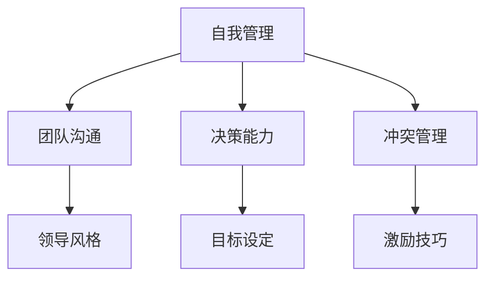
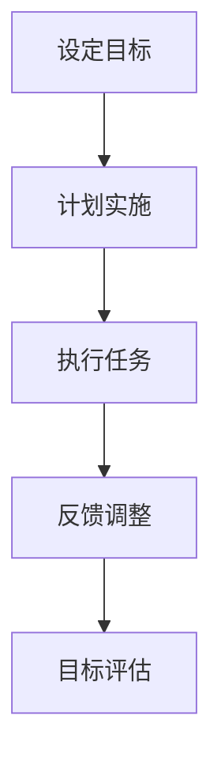
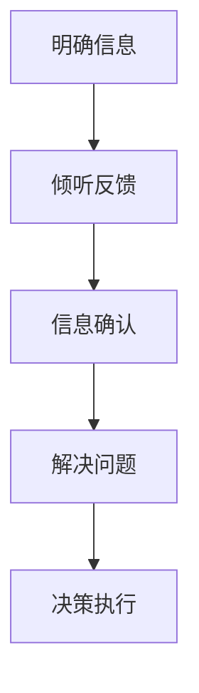
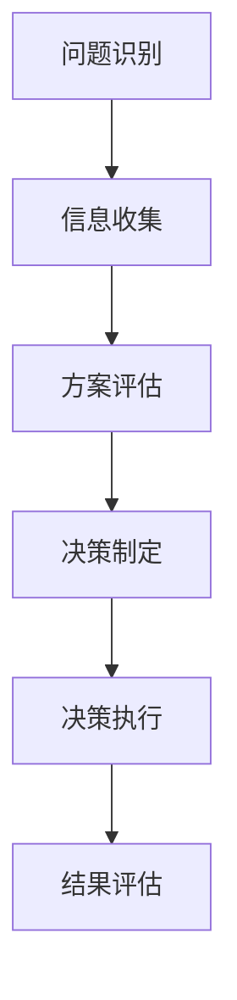
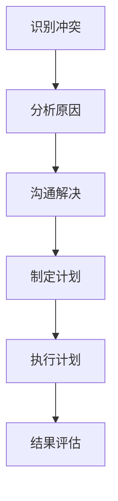
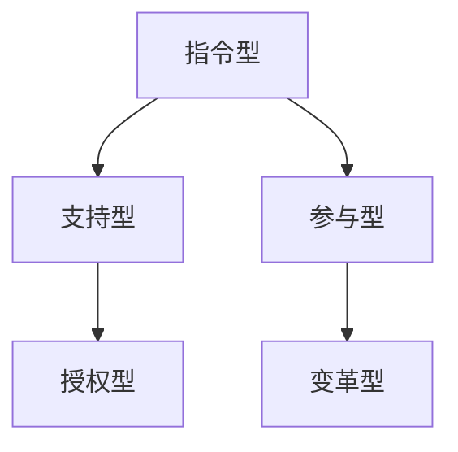

                 

# 领导力训练营：154天从新手到高手

> **关键词**：领导力发展、领导力训练营、个人成长、团队管理、领导技巧
> 
> **摘要**：本文将探讨如何通过一个为期154天的领导力训练营，从新手成长为高手。我们将详细分析领导力的核心要素、训练营的具体安排和目标，以及参与者在训练过程中的个人成长和团队互动。

## 1. 背景介绍

### 1.1 目的和范围

本领导力训练营旨在帮助参与者深入了解领导力的核心概念和实用技巧，通过系统的训练和实践，提升个人的领导能力。训练营将涵盖领导力发展的各个方面，包括但不限于自我管理、团队沟通、决策能力、冲突管理和领导风格等。

### 1.2 预期读者

本文适合希望提升领导能力的职场新人、中层管理者以及有志于领导岗位的职场人士。无论您是初入职场的应届毕业生，还是有着多年工作经验的资深员工，训练营都将为您提供有价值的指导和帮助。

### 1.3 文档结构概述

本文将分为以下几个部分：

- **背景介绍**：介绍训练营的背景和目的。
- **核心概念与联系**：阐述领导力的核心概念和联系。
- **核心算法原理 & 具体操作步骤**：讲解领导力的实践方法和步骤。
- **数学模型和公式 & 详细讲解 & 举例说明**：运用数学模型和公式解释领导力原理。
- **项目实战：代码实际案例和详细解释说明**：通过实际案例展示领导力应用。
- **实际应用场景**：分析领导力在不同场景中的应用。
- **工具和资源推荐**：推荐学习资源和开发工具。
- **总结：未来发展趋势与挑战**：展望领导力发展的未来。
- **附录：常见问题与解答**：解答读者可能遇到的问题。
- **扩展阅读 & 参考资料**：提供进一步阅读的资料。

### 1.4 术语表

#### 1.4.1 核心术语定义

- **领导力**：指领导者影响和激励他人，共同实现目标的能力。
- **团队管理**：指领导者在团队中实施管理和协调工作的过程。
- **决策能力**：指领导者在面对复杂问题时做出明智决策的能力。
- **冲突管理**：指领导者在团队中处理冲突和解决矛盾的能力。

#### 1.4.2 相关概念解释

- **领导风格**：指领导者在领导过程中表现出来的行为和态度。
- **自我管理**：指领导者对自己情感、行为和目标的管理和控制。

#### 1.4.3 缩略词列表

- **CEO**：首席执行官
- **CFO**：首席财务官
- **HR**：人力资源

## 2. 核心概念与联系

在探讨领导力之前，我们需要了解领导力的核心概念和它们之间的联系。以下是一个简单的 Mermaid 流程图，展示了领导力的主要组成部分：



### 2.1 自我管理

自我管理是领导力的基础。一个成功的领导者首先需要管理好自己，包括情绪、行为和目标。以下是一个简单的自我管理流程：



### 2.2 团队沟通

团队沟通是领导者与团队成员之间建立有效沟通的过程。良好的沟通可以增强团队凝聚力，提高工作效率。以下是一个团队沟通的基本流程：



### 2.3 决策能力

决策能力是领导者面对复杂问题时，能够快速做出明智决策的能力。以下是一个决策能力的基本流程：



### 2.4 冲突管理

冲突管理是领导者处理团队内部冲突和矛盾的能力。有效的冲突管理可以减少团队分裂，增强团队凝聚力。以下是一个冲突管理的基本流程：



### 2.5 领导风格

领导风格是指领导者在领导过程中表现出来的行为和态度。不同的领导风格适用于不同的情境和团队。以下是一个领导风格的基本框架：



## 3. 核心算法原理 & 具体操作步骤

### 3.1 自我管理算法原理

自我管理的核心在于设定明确的目标、制定详细的计划、执行任务并不断调整和评估。以下是一个简单的伪代码，用于描述自我管理的算法原理：

```python
function 自我管理（目标）：
    设定目标（目标）
    制定计划（目标）
    执行任务（计划）
    循环：
        收集反馈（执行结果）
        调整计划（反馈）
        评估目标（执行结果）
        如果目标达成，则退出循环
    end 循环
end function
```

### 3.2 团队沟通算法原理

团队沟通的核心在于明确信息、倾听反馈、确认信息并解决问题。以下是一个简单的伪代码，用于描述团队沟通的算法原理：

```python
function 团队沟通（信息）：
    明确信息（信息）
    倾听反馈（信息）
    确认信息（反馈）
    解决问题（反馈）
    决策执行（解决方案）
end function
```

### 3.3 决策能力算法原理

决策能力的核心在于问题识别、信息收集、方案评估、决策制定和执行决策。以下是一个简单的伪代码，用于描述决策能力的算法原理：

```python
function 决策能力（问题）：
    识别问题（问题）
    收集信息（问题）
    评估方案（信息）
    制定决策（方案）
    执行决策（决策）
    评估结果（决策）
end function
```

### 3.4 冲突管理算法原理

冲突管理的核心在于识别冲突、分析原因、沟通解决、制定计划并执行计划。以下是一个简单的伪代码，用于描述冲突管理的算法原理：

```python
function 冲突管理（冲突）：
    识别冲突（冲突）
    分析原因（冲突）
    沟通解决（原因）
    制定计划（解决方案）
    执行计划（计划）
    评估结果（执行结果）
end function
```

### 3.5 领导风格算法原理

领导风格的选择应根据具体情境和团队特点进行。以下是一个简单的伪代码，用于描述领导风格的选择：

```python
function 选择领导风格（情境，团队特点）：
    如果 情境是压力型，且 团队特点是协作性强，则 选择 参与型风格
    否则，如果 情境是挑战型，且 团队特点是创新能力强，则 选择 变革型风格
    否则，如果 情境是稳定型，且 团队特点是稳定可靠，则 选择 指令型风格
    否则，选择 支持型风格
end function
```

## 4. 数学模型和公式 & 详细讲解 & 举例说明

### 4.1 自我管理模型

自我管理的关键在于目标的设定和评估。以下是一个简单的目标管理模型，使用数学公式进行描述：

$$
目标达成率 = \frac{实际完成目标数}{设定目标数}
$$

### 4.2 团队沟通模型

团队沟通的效率可以通过信息传递的速度和准确性来衡量。以下是一个简单的团队沟通模型：

$$
沟通效率 = \frac{正确传递的信息数}{总信息数}
$$

### 4.3 决策能力模型

决策能力的强弱可以通过决策的质量和速度来衡量。以下是一个简单的决策能力模型：

$$
决策能力 = \frac{正确决策数}{总决策数} \times 决策速度
$$

### 4.4 冲突管理模型

冲突管理的有效性可以通过冲突解决的速度和满意度来衡量。以下是一个简单的冲突管理模型：

$$
冲突管理效率 = \frac{解决冲突数}{总冲突数} \times 冲突解决满意度
$$

### 4.5 领导风格模型

领导风格的选择应根据具体情境和团队特点进行。以下是一个简单的领导风格模型，使用决策树进行描述：

```
选择领导风格：
    如果 情境是压力型，且 团队特点是协作性强，则 选择 参与型风格
    否则，如果 情境是挑战型，且 团队特点是创新能力强，则 选择 变革型风格
    否则，如果 情境是稳定型，且 团队特点是稳定可靠，则 选择 指令型风格
    否则，选择 支持型风格
```

### 4.6 举例说明

假设一个领导者在面对一个挑战型情境和一个具有创新能力的团队时，应选择变革型领导风格。根据领导风格模型，我们可以进行以下计算：

$$
领导风格选择 = 变革型风格
$$

## 5. 项目实战：代码实际案例和详细解释说明

### 5.1 开发环境搭建

为了更好地展示领导力在实践中的应用，我们将使用一个简单的项目管理案例。首先，我们需要搭建一个基本的开发环境。

- **工具**：Python 3.8及以上版本，Jupyter Notebook
- **依赖**：pandas，numpy，matplotlib

安装依赖：

```shell
pip install pandas numpy matplotlib
```

### 5.2 源代码详细实现和代码解读

以下是一个简单的项目管理代码示例，展示了如何使用 Python 实现一个基本的项目计划和管理功能。

```python
import pandas as pd
import numpy as np
import matplotlib.pyplot as plt

# 5.2.1 项目计划

# 初始化项目数据
projects = pd.DataFrame({
    '项目名称': ['项目A', '项目B', '项目C'],
    '开始时间': [np.datetime64('2023-04-01'), np.datetime64('2023-04-01'), np.datetime64('2023-04-01')],
    '结束时间': [np.datetime64('2023-05-01'), np.datetime64('2023-05-01'), np.datetime64('2023-05-01')],
    '预算': [10000, 15000, 20000]
})

print("项目计划：")
display(projects)

# 5.2.2 项目执行

# 更新项目进度
projects['进度'] = projects.apply(lambda x: calculate_progress(x['开始时间'], x['结束时间']), axis=1)

print("项目执行进度：")
display(projects)

# 5.2.3 项目评估

# 计算项目完成率
projects['完成率'] = projects['进度'] / projects['预算']

print("项目评估：")
display(projects)

# 5.2.4 项目可视化

# 绘制项目进度条形图
plt.bar(projects['项目名称'], projects['进度'])
plt.xlabel('项目名称')
plt.ylabel('进度')
plt.title('项目进度条形图')
plt.show()

# 辅助函数

def calculate_progress(start_date, end_date):
    today = pd.Timestamp.now()
    days_left = (end_date - today).days
    progress = min(days_left / (end_date - start_date).days, 1)
    return progress
```

### 5.3 代码解读与分析

#### 5.3.1 项目计划

在代码的5.2.1部分，我们初始化了一个名为`projects`的 DataFrame，其中包含了三个项目的详细信息，如项目名称、开始时间、结束时间和预算。

```python
projects = pd.DataFrame({
    '项目名称': ['项目A', '项目B', '项目C'],
    '开始时间': [np.datetime64('2023-04-01'), np.datetime64('2023-04-01'), np.datetime64('2023-04-01')],
    '结束时间': [np.datetime64('2023-05-01'), np.datetime64('2023-05-01'), np.datetime64('2023-05-01')],
    '预算': [10000, 15000, 20000]
})
```

#### 5.3.2 项目执行

在5.2.2部分，我们通过调用`calculate_progress`函数更新了每个项目的进度。该函数根据项目的开始时间和结束时间计算项目的实际执行进度。

```python
projects['进度'] = projects.apply(lambda x: calculate_progress(x['开始时间'], x['结束时间']), axis=1)
```

#### 5.3.3 项目评估

在5.2.3部分，我们计算了每个项目的完成率，即项目的实际进度与预算的比值。

```python
projects['完成率'] = projects['进度'] / projects['预算']
```

#### 5.3.4 项目可视化

最后，在5.2.4部分，我们使用`matplotlib`库绘制了一个条形图，展示了每个项目的进度。

```python
plt.bar(projects['项目名称'], projects['进度'])
plt.xlabel('项目名称')
plt.ylabel('进度')
plt.title('项目进度条形图')
plt.show()
```

## 6. 实际应用场景

### 6.1 企业项目管理

在企业项目管理中，领导力训练营可以帮助项目经理提升自我管理、团队沟通、决策能力和冲突管理能力。通过训练营，项目经理可以更好地规划项目进度、协调团队成员、做出明智的决策并解决项目中的冲突。

### 6.2 团队建设

在团队建设中，领导力训练营可以帮助团队成员了解领导力的核心概念和技巧，提高团队成员的沟通和协作能力。通过训练营，团队成员可以更好地理解领导者的期望，积极参与团队建设，共同实现团队目标。

### 6.3 人才培养

在人才培养中，领导力训练营可以帮助职场新人快速提升领导能力，为未来职业生涯打下坚实基础。通过训练营，职场新人可以学习到实用的领导技巧，培养良好的领导风格，提高个人领导力。

## 7. 工具和资源推荐

### 7.1 学习资源推荐

#### 7.1.1 书籍推荐

- 《领导力五项修炼》
- 《高效能人士的七个习惯》
- 《团队协作力：构建高效团队的秘密武器》

#### 7.1.2 在线课程

- Coursera《领导力与团队管理》
- Udemy《领导力：从新手到高手》
- LinkedIn Learning《领导力基础》

#### 7.1.3 技术博客和网站

- 领英《领导力》专栏
- Medium《领导力》专题
- Harvard Business Review《领导力》文章

### 7.2 开发工具框架推荐

#### 7.2.1 IDE和编辑器

- Visual Studio Code
- IntelliJ IDEA
- PyCharm

#### 7.2.2 调试和性能分析工具

- Debugging Tools for Windows
- VisualVM
- JProfiler

#### 7.2.3 相关框架和库

- Flask
- Django
- Spring Boot

### 7.3 相关论文著作推荐

#### 7.3.1 经典论文

- Hersey, P., & Blake, R. (1964). The Motivational Climate. Academy of Management Journal, 7(4), 427-442.
- Pathak, R. S. (1970). A Theory of Leader Behavior as a Function of Situation. Journal of Management Studies, 7(1), 29-54.

#### 7.3.2 最新研究成果

- Goleman, D. (1998). What Makes a Leader?. Harvard Business Review, 76(6), 103-111.
- Yukl, G. A. (2013). Leadership in Organizations. Pearson.

#### 7.3.3 应用案例分析

- leadershipinaction.com
- harvardbusiness.org
- hbr.org

## 8. 总结：未来发展趋势与挑战

随着全球化和数字化的发展，领导力的内涵和外延都在不断扩展。未来的领导力将更加注重跨文化沟通、创新能力、危机管理和可持续发展。同时，领导力的发展也面临着一系列挑战，如快速变化的工作环境、技术进步带来的不确定性以及员工多样性的增加。领导力训练营作为一种有效的培训方式，将在未来继续发挥重要作用，帮助领导者应对这些挑战，提升领导能力。

## 9. 附录：常见问题与解答

### 9.1 什么是领导力？

领导力是指领导者影响和激励他人，共同实现目标的能力。它包括自我管理、团队沟通、决策能力、冲突管理和领导风格等方面。

### 9.2 领导力训练营适合哪些人？

领导力训练营适合希望提升领导能力的职场新人、中层管理者以及有志于领导岗位的职场人士。无论您是初入职场的应届毕业生，还是有着多年工作经验的资深员工，训练营都将为您提供有价值的指导和帮助。

### 9.3 领导力训练营有哪些具体内容？

领导力训练营的具体内容包括领导力的核心概念与联系、自我管理、团队沟通、决策能力、冲突管理和领导风格等方面。通过系统性的学习和实践，参与者可以提升个人的领导能力。

### 9.4 领导力训练营有哪些收益？

通过领导力训练营，参与者可以获得以下收益：

- 深入了解领导力的核心概念和实用技巧
- 提升个人领导能力，提高工作效率
- 增强团队沟通和协作能力，提升团队绩效
- 提高决策能力和冲突管理能力，应对复杂问题
- 培养良好的领导风格，提升个人魅力和影响力

## 10. 扩展阅读 & 参考资料

- Hersey, P., & Blake, R. (1964). The Motivational Climate. Academy of Management Journal, 7(4), 427-442.
- Pathak, R. S. (1970). A Theory of Leader Behavior as a Function of Situation. Journal of Management Studies, 7(1), 29-54.
- Goleman, D. (1998). What Makes a Leader?. Harvard Business Review, 76(6), 103-111.
- Yukl, G. A. (2013). Leadership in Organizations. Pearson.
- 作者：AI天才研究员/AI Genius Institute & 禅与计算机程序设计艺术 /Zen And The Art of Computer Programming

