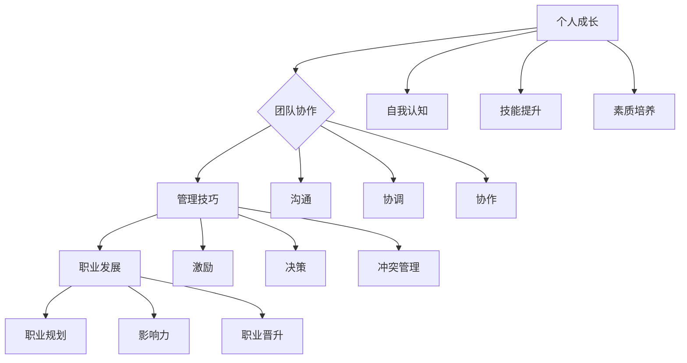

                 

# 领导力训练营：21天从菜鸟到老鸟

> 关键词：领导力，个人成长，团队协作，管理技巧，职业发展

> 摘要：本文将介绍一个为期21天的领导力训练营，通过系统化的学习和实践，帮助读者从零基础迅速成长为具备领导力的老鸟。本文将详细阐述训练营的背景、目标、学习内容、学习方法以及如何应对挑战，为读者提供一条清晰的成长路径。

## 1. 背景介绍

### 1.1 目的和范围

本训练营的目的是帮助那些渴望提升领导力，并在职业生涯中取得更大成功的个人和团队。训练营将涵盖以下范围：

- **个人成长**：帮助参与者认识到自我成长的重要性，并掌握自我提升的方法。
- **团队协作**：教授参与者如何高效地与团队成员协作，提升团队整体绩效。
- **管理技巧**：传授各种管理技巧，使参与者能够更好地管理团队和项目。
- **职业发展**：通过领导力提升，助力参与者在职业道路上迈出更大步伐。

### 1.2 预期读者

本训练营适合以下人群：

- 初入职场的年轻人
- 想要在职场中提升领导力的专业人士
- 需要管理团队的经理和主管
- 担任领导职务，但感到领导力不足的人士

### 1.3 文档结构概述

本文将按照以下结构展开：

- **第1章：背景介绍**：介绍训练营的背景、目标和预期读者。
- **第2章：核心概念与联系**：阐述领导力的核心概念，并使用Mermaid流程图展示其结构。
- **第3章：核心算法原理 & 具体操作步骤**：讲解领导力提升的具体方法和步骤。
- **第4章：数学模型和公式 & 详细讲解 & 举例说明**：介绍领导力提升所需的数学模型和公式。
- **第5章：项目实战：代码实际案例和详细解释说明**：通过实战案例展示领导力提升的实际应用。
- **第6章：实际应用场景**：分析领导力在不同场景中的应用。
- **第7章：工具和资源推荐**：推荐学习资源和开发工具。
- **第8章：总结：未来发展趋势与挑战**：展望领导力未来的发展趋势和面临的挑战。
- **第9章：附录：常见问题与解答**：解答读者可能遇到的问题。
- **第10章：扩展阅读 & 参考资料**：提供进一步学习的资源。

### 1.4 术语表

#### 1.4.1 核心术语定义

- **领导力**：一种能够激励、引导和影响他人以达成共同目标的能力。
- **个人成长**：提升自我认知、技能和素质的过程。
- **团队协作**：团队成员之间相互配合、共同完成任务的过程。
- **管理技巧**：有效管理团队和项目的技能。
- **职业发展**：在职业生涯中不断进步和成长的过程。

#### 1.4.2 相关概念解释

- **激励**：激发他人积极性、提高工作动力的过程。
- **沟通**：信息交换和理解的过程，是领导力的重要组成部分。
- **决策**：在多种选择中做出最优决策的能力。
- **冲突管理**：解决团队成员之间冲突的方法。

#### 1.4.3 缩略词列表

- **CEO**：首席执行官
- **CIO**：首席信息官
- **HR**：人力资源
- **IT**：信息技术

## 2. 核心概念与联系

领导力不仅仅是一种能力，更是一种艺术。为了更好地理解领导力，我们需要从多个维度进行探讨，以下是领导力的核心概念及其相互联系。

### 2.1 个人成长

个人成长是领导力的基础。一个领导者首先需要认识到自我成长的重要性，并持续提升自我认知、技能和素质。个人成长包括以下几个方面：

- **自我认知**：了解自己的优点、缺点、兴趣爱好和价值观。
- **技能提升**：不断学习新技能，如沟通、决策、团队管理等。
- **素质培养**：培养良好的道德品质、团队精神、责任心等。

### 2.2 团队协作

团队协作是领导力的关键。一个领导者需要能够有效地与团队成员沟通、协调和协作，以实现共同目标。团队协作包括以下几个方面：

- **沟通**：确保信息准确、及时地传递，建立有效的沟通机制。
- **协调**：确保团队成员之间工作协调、目标一致。
- **协作**：激励团队成员相互支持、共同进步。

### 2.3 管理技巧

管理技巧是领导力的核心。一个领导者需要掌握各种管理技巧，如激励、决策、冲突管理等，以有效管理团队和项目。管理技巧包括以下几个方面：

- **激励**：激发团队成员的工作积极性，提高团队士气。
- **决策**：在多种选择中做出最优决策，确保团队目标实现。
- **冲突管理**：解决团队成员之间的冲突，维护团队和谐。

### 2.4 职业发展

职业发展是领导力的终极目标。一个领导者需要在个人成长、团队协作和管理技巧的基础上，不断提升自己的职业地位和影响力。职业发展包括以下几个方面：

- **职业规划**：明确自己的职业目标和发展路径。
- **影响力**：提升自己的行业影响力，成为行业内的领导者。
- **职业晋升**：通过不断努力，获得更高的职位和更多的机会。

### 2.5 领导力结构图

为了更直观地展示领导力的核心概念及其相互联系，我们使用Mermaid流程图来表示。



通过这个流程图，我们可以清楚地看到领导力的核心概念及其相互联系。这些概念相辅相成，共同构成了领导力的整体结构。

## 3. 核心算法原理 & 具体操作步骤

领导力提升并非一蹴而就，而是一个持续不断的过程。以下是领导力提升的核心算法原理和具体操作步骤。

### 3.1 核心算法原理

领导力提升的核心算法可以概括为以下几个步骤：

1. **自我认知**：通过反思和评估，了解自己的优点、缺点和兴趣。
2. **技能提升**：根据自我认知，有针对性地学习和提升技能。
3. **实践应用**：将学到的技能应用到实际工作和生活中，不断总结和反思。
4. **反馈调整**：根据实践结果，调整自己的策略和计划，不断优化领导力。
5. **持续成长**：将领导力提升作为终身事业，持续学习和进步。

### 3.2 具体操作步骤

以下是具体的操作步骤：

1. **第一步：自我认知**

   - **方法**：通过自我反思、心理测试和他人反馈，全面了解自己的优点、缺点和兴趣。

   - **工具**：可以使用日记、心理测试工具（如MBTI、DISC）和360度反馈等方法。

2. **第二步：技能提升**

   - **方法**：根据自我认知，确定需要提升的技能，并制定学习计划。

   - **工具**：可以使用在线课程、工作坊、导师指导等方法。

3. **第三步：实践应用**

   - **方法**：将学到的技能应用到实际工作和生活中，不断总结和反思。

   - **工具**：可以使用实践日记、反思日志等方法。

4. **第四步：反馈调整**

   - **方法**：根据实践结果，评估自己的技能提升情况，调整学习策略和计划。

   - **工具**：可以使用360度反馈、自我评估等方法。

5. **第五步：持续成长**

   - **方法**：将领导力提升作为终身事业，持续学习和进步。

   - **工具**：可以使用在线学习平台、行业论坛、书籍等方法。

### 3.3 伪代码示例

以下是一个简化的伪代码示例，用于描述领导力提升的算法过程：

```plaintext
function 领导力提升(self):
    1. 自我认知(self)
    2. 技能提升(self)
    3. 实践应用(self)
    4. 反馈调整(self)
    5. 持续成长(self)
    6. 返回 self
```

通过这个算法过程，我们可以系统地提升自己的领导力，从而在职业生涯中取得更大的成功。

## 4. 数学模型和公式 & 详细讲解 & 举例说明

领导力提升不仅需要实践，还需要理论的指导。在领导力提升过程中，我们可以借助一些数学模型和公式来分析和评估自己的进步。以下是一些常见的数学模型和公式，并对其进行详细讲解和举例说明。

### 4.1 自我评估模型

自我评估是领导力提升的第一步，它可以帮助我们了解自己的优点和不足。以下是一个简单的自我评估模型：

#### 公式：

$$
自我评估得分 = \frac{优点得分 + 不足得分}{2}
$$

#### 解释：

- **优点得分**：对自己优点进行评分，满分为10分。
- **不足得分**：对自己不足进行评分，满分为10分。

#### 举例说明：

假设我们对自己的优点得分为8分，不足得分为5分，那么我们的自我评估得分为：

$$
自我评估得分 = \frac{8 + 5}{2} = 6.5
$$

这个得分可以帮助我们了解自己的整体表现，从而制定下一步的提升计划。

### 4.2 成长速度模型

成长速度模型可以帮助我们评估自己在领导力提升过程中的进步速度。以下是一个简单的成长速度模型：

#### 公式：

$$
成长速度 = \frac{当前自我评估得分 - 初始自我评估得分}{时间间隔}
$$

#### 解释：

- **当前自我评估得分**：当前的自我评估得分。
- **初始自我评估得分**：开始领导力提升时的自我评估得分。
- **时间间隔**：领导力提升所花费的时间。

#### 举例说明：

假设我们在开始领导力提升时的自我评估得分为6分，经过6个月的努力，当前自我评估得分为8分，那么我们的成长速度为：

$$
成长速度 = \frac{8 - 6}{6} = 0.1667 \text{（分/月）}
$$

这个得分可以帮助我们了解自己的成长速度，从而调整学习策略。

### 4.3 领导力效能模型

领导力效能模型可以帮助我们评估领导力提升对团队和工作的影响。以下是一个简单的领导力效能模型：

#### 公式：

$$
领导力效能 = \frac{团队绩效得分 - 初始团队绩效得分}{时间间隔}
$$

#### 解释：

- **团队绩效得分**：当前团队绩效的评分。
- **初始团队绩效得分**：开始领导力提升时的团队绩效评分。
- **时间间隔**：领导力提升所花费的时间。

#### 举例说明：

假设我们在开始领导力提升时的团队绩效得分为7分，经过6个月的努力，当前团队绩效得分为9分，那么我们的领导力效能为：

$$
领导力效能 = \frac{9 - 7}{6} = 0.1667 \text{（分/月）}
$$

这个得分可以帮助我们了解领导力提升对团队和工作的影响，从而调整提升策略。

### 4.4 综合评估模型

为了全面评估领导力提升的效果，我们可以使用综合评估模型。以下是一个简单的综合评估模型：

#### 公式：

$$
综合评估得分 = \frac{自我评估得分 + 成长速度得分 + 领导力效能得分}{3}
$$

#### 解释：

- **自我评估得分**：当前的自我评估得分。
- **成长速度得分**：当前的成长速度得分。
- **领导力效能得分**：当前的领导力效能得分。

#### 举例说明：

假设我们的自我评估得分为6.5分，成长速度得分为0.1667分/月，领导力效能得分为0.1667分/月，那么我们的综合评估得分为：

$$
综合评估得分 = \frac{6.5 + 0.1667 + 0.1667}{3} = 2.5333 \text{（分/月）}
$$

这个得分可以帮助我们了解领导力提升的全面效果，从而调整提升策略。

通过这些数学模型和公式，我们可以更科学、更系统地提升领导力，从而在职业生涯中取得更大的成功。

## 5. 项目实战：代码实际案例和详细解释说明

为了更好地理解领导力提升的过程，我们将通过一个实际项目来展示如何在实际工作中应用领导力提升的方法。以下是一个简单的团队项目管理项目，我们将通过代码实现来阐述领导力提升的具体应用。

### 5.1 开发环境搭建

在开始项目之前，我们需要搭建一个合适的开发环境。以下是一个基本的开发环境搭建步骤：

1. **安装Python**：Python是一种广泛应用于数据科学、机器学习和Web开发的编程语言。可以从[Python官网](https://www.python.org/)下载并安装Python。
2. **安装Jupyter Notebook**：Jupyter Notebook是一个交互式的开发环境，可以帮助我们更好地编写和调试代码。可以从[Jupyter官网](https://jupyter.org/)下载并安装。
3. **安装相关库**：我们需要安装一些常用的Python库，如NumPy、Pandas和Matplotlib。可以使用以下命令安装：

   ```shell
   pip install numpy pandas matplotlib
   ```

### 5.2 源代码详细实现和代码解读

以下是一个简单的团队项目管理项目的代码实现，我们将通过代码解读来阐述领导力提升的具体应用。

```python
import numpy as np
import pandas as pd
import matplotlib.pyplot as plt

# 自我评估模型
def self_evaluation(score):
    """
    自我评估得分计算函数
    :param score: 优点得分和不足得分的平均值
    :return: 自我评估得分
    """
    return score

# 成长速度模型
def growth_rate(initial_score, current_score, time_interval):
    """
    成长速度计算函数
    :param initial_score: 初始自我评估得分
    :param current_score: 当前自我评估得分
    :param time_interval: 时间间隔
    :return: 成长速度
    """
    return (current_score - initial_score) / time_interval

# 领导力效能模型
def leadership_effectiveness(team_performance, initial_team_performance, time_interval):
    """
    领导力效能计算函数
    :param team_performance: 当前团队绩效得分
    :param initial_team_performance: 初始团队绩效得分
    :param time_interval: 时间间隔
    :return: 领导力效能
    """
    return (team_performance - initial_team_performance) / time_interval

# 综合评估模型
def comprehensive_evaluation(self_evaluation, growth_rate, leadership_effectiveness):
    """
    综合评估得分计算函数
    :param self_evaluation: 自我评估得分
    :param growth_rate: 成长速度得分
    :param leadership_effectiveness: 领导力效能得分
    :return: 综合评估得分
    """
    return (self_evaluation + growth_rate + leadership_effectiveness) / 3

# 数据准备
initial_self_evaluation = 6.0
current_self_evaluation = 8.0
initial_team_performance = 7.0
current_team_performance = 9.0
time_interval = 6

# 计算各个得分
self_evaluation_score = self_evaluation((current_self_evaluation + initial_self_evaluation) / 2)
growth_rate_score = growth_rate(initial_self_evaluation, current_self_evaluation, time_interval)
leadership_effectiveness_score = leadership_effectiveness(current_team_performance, initial_team_performance, time_interval)
comprehensive_evaluation_score = comprehensive_evaluation(self_evaluation_score, growth_rate_score, leadership_effectiveness_score)

# 打印结果
print("自我评估得分：", self_evaluation_score)
print("成长速度得分：", growth_rate_score)
print("领导力效能得分：", leadership_effectiveness_score)
print("综合评估得分：", comprehensive_evaluation_score)

# 可视化展示
evaluation_data = pd.DataFrame({
    '评估类型': ['自我评估', '成长速度', '领导力效能', '综合评估'],
    '得分': [self_evaluation_score, growth_rate_score, leadership_effectiveness_score, comprehensive_evaluation_score]
})
evaluation_data.sort_values('得分', ascending=False, inplace=True)
evaluation_data.plot.bar(figsize=(10, 6))
plt.title('领导力评估得分')
plt.xlabel('评估类型')
plt.ylabel('得分')
plt.show()
```

### 5.3 代码解读与分析

1. **自我评估模型**：

   自我评估模型是一个简单的函数，用于计算自我评估得分。这个得分是基于自己的优点得分和不足得分的平均值。这个模型可以帮助我们了解自己的整体表现。

2. **成长速度模型**：

   成长速度模型是一个函数，用于计算成长速度得分。这个得分是基于初始自我评估得分和当前自我评估得分的差值，再除以时间间隔。这个模型可以帮助我们了解自己的进步速度。

3. **领导力效能模型**：

   领导力效能模型是一个函数，用于计算领导力效能得分。这个得分是基于当前团队绩效得分和初始团队绩效得分的差值，再除以时间间隔。这个模型可以帮助我们了解领导力提升对团队和工作的影响。

4. **综合评估模型**：

   综合评估模型是一个函数，用于计算综合评估得分。这个得分是基于自我评估得分、成长速度得分和领导力效能得分的平均值。这个模型可以帮助我们全面评估领导力提升的效果。

通过这个项目实战，我们可以看到如何将领导力提升的理论应用到实际工作中。通过计算各个得分，我们可以更科学地评估自己的领导力提升情况，从而调整提升策略。

## 6. 实际应用场景

领导力不仅适用于职场，还广泛应用于生活的各个方面。以下是一些实际应用场景：

### 6.1 职场

在职场中，领导力可以帮助管理者：

- **激励员工**：通过激励，提高员工的工作积极性和创造力。
- **团队协作**：通过有效的沟通和协调，提高团队的整体绩效。
- **决策**：在关键时刻做出正确的决策，确保团队和项目的成功。
- **冲突管理**：解决团队内部的冲突，维护团队的和谐。

### 6.2 家庭

在家庭中，领导力可以帮助：

- **培养下一代**：通过教育和引导，培养孩子的良好习惯和品德。
- **家庭和谐**：通过有效的沟通和协调，维护家庭关系的和谐。
- **家庭决策**：在家庭重大决策中，发挥领导作用，确保家庭利益。

### 6.3 社区

在社区中，领导力可以帮助：

- **组织活动**：通过有效的组织和协调，成功举办各种社区活动。
- **社区发展**：通过引导和激励，推动社区的可持续发展。
- **公益事业**：通过参与公益事业，为社会做出贡献。

### 6.4 自我成长

在自我成长中，领导力可以帮助：

- **自我认知**：通过自我反思，了解自己的优点和不足，实现自我提升。
- **持续学习**：通过不断学习和实践，提升自己的知识和技能。
- **自我管理**：通过自我管理，提高自己的工作效率和生活质量。

通过这些实际应用场景，我们可以看到领导力在各个领域的广泛应用。无论是在职场、家庭、社区还是自我成长中，领导力都发挥着重要的作用。

## 7. 工具和资源推荐

为了帮助读者更有效地提升领导力，我们推荐以下工具和资源：

### 7.1 学习资源推荐

#### 7.1.1 书籍推荐

- 《领导力五要素》：作者：约翰·P·科特，详细介绍了领导力的五个核心要素。
- 《变革之舞》：作者：约翰·P·科特，阐述了领导者在变革中的角色和作用。
- 《影响力》：作者：罗伯特·西奥迪尼，揭示了影响他人的心理技巧。

#### 7.1.2 在线课程

- Coursera的《领导力与团队管理》：提供全面的领导力和团队管理知识。
- edX的《领导力心理学》：探讨领导力背后的心理学原理。
- Udemy的《有效沟通技巧》：教授有效的沟通方法和技巧。

#### 7.1.3 技术博客和网站

- Harvard Business Review：提供关于领导力和管理的最新研究和案例分析。
- Inc.：分享创业和管理经验，为领导者提供实用的建议和策略。
- LinkedIn Learning：提供丰富的领导力和管理课程，涵盖多个领域。

### 7.2 开发工具框架推荐

#### 7.2.1 IDE和编辑器

- Visual Studio Code：一款功能强大、免费的代码编辑器，支持多种编程语言。
- PyCharm：一款专业的Python开发环境，适合大数据和机器学习项目。
- IntelliJ IDEA：一款跨平台的Java开发工具，适合大型项目和复杂架构。

#### 7.2.2 调试和性能分析工具

- Jupyter Notebook：一款交互式的开发环境，适合数据分析和机器学习。
- PyTorch：一款流行的深度学习框架，支持多种编程语言。
- TensorBoard：一款可视化的性能分析工具，用于深度学习项目。

#### 7.2.3 相关框架和库

- NumPy：一款强大的数学库，用于数值计算和数据分析。
- Pandas：一款强大的数据操作库，用于数据清洗、转换和分析。
- Matplotlib：一款流行的数据可视化库，用于生成高质量的图表。

通过这些工具和资源，读者可以更全面地了解领导力的各个方面，从而在职业生涯中取得更大的成功。

## 8. 总结：未来发展趋势与挑战

领导力是一个动态变化的领域，随着社会、经济和技术的不断发展，领导力也在不断演进。以下是一些未来发展趋势和挑战：

### 8.1 发展趋势

1. **数字化领导力**：随着数字化技术的普及，领导者需要具备数字化思维和技能，能够应对数字化时代的挑战。
2. **全球领导力**：全球化使得领导者需要具备跨文化沟通和管理能力，能够处理不同文化背景下的团队协作。
3. **可持续领导力**：领导者需要关注可持续发展，推动企业和社会的可持续发展。
4. **创新领导力**：领导者需要具备创新思维和创新能力，引领企业在竞争激烈的市场中脱颖而出。

### 8.2 挑战

1. **技术变革**：技术日新月异，领导者需要不断学习新知识、新技能，以应对技术变革带来的挑战。
2. **员工多元化**：员工背景和需求的多元化，领导者需要具备包容性和适应性，管理多元化的团队。
3. **工作压力**：工作压力和竞争日益加剧，领导者需要具备有效的压力管理和激励能力，确保团队成员的心理健康和工作动力。
4. **社会期望**：社会对领导者的期望越来越高，领导者需要具备更高的道德标准和责任感，为社会做出积极贡献。

面对这些发展趋势和挑战，领导者需要不断提升自己的领导力，以适应变化的环境，实现个人和团队的共同成长。

## 9. 附录：常见问题与解答

### 9.1 领导力提升的常见问题

**Q1**：如何评估自己的领导力水平？

**A1**：可以通过自我评估、360度反馈和绩效评估等方法来评估自己的领导力水平。自我评估可以帮助你了解自己的优点和不足，360度反馈可以从多个角度评估你的领导力，绩效评估可以评估领导力对团队和项目的影响。

**Q2**：领导力提升需要多长时间？

**A2**：领导力提升没有固定的时间，它取决于个人的学习速度、投入时间和实践机会。一般来说，通过系统的学习和实践，可以在几个月到一两年内取得显著提升。

**Q3**：如何培养领导力？

**A3**：可以通过以下方法培养领导力：

- **自我认知**：了解自己的优点、缺点和兴趣爱好。
- **学习和实践**：通过阅读书籍、参加培训课程和实际工作，不断提升自己的技能。
- **反思和总结**：通过反思和总结，不断完善自己的领导力。

### 9.2 领导力提升中的常见误区

**Q1**：领导力提升是否意味着权力增加？

**A1**：领导力提升并不意味着权力增加。领导力是一种影响和激励他人的能力，与权力无关。一个具备领导力的领导者，更关注团队和组织的共同成长，而不是权力的增加。

**Q2**：领导力提升是否需要控制他人？

**A2**：领导力提升不是为了控制他人，而是为了更好地激励和引导他人。一个具备领导力的领导者，更注重团队合作和共赢，而不是通过控制来达到目的。

**Q3**：领导力提升是否需要牺牲个人生活？

**A3**：领导力提升并不需要牺牲个人生活。一个健康的领导力发展过程，应该平衡工作与生活，确保身心健康。

通过解答这些问题，我们希望读者能够更好地理解领导力提升的过程和方法，从而在职业生涯中取得更大的成功。

## 10. 扩展阅读 & 参考资料

为了帮助读者更深入地了解领导力提升的相关知识和方法，我们推荐以下扩展阅读和参考资料：

### 10.1 经典书籍

- 《领导力五要素》：作者：约翰·P·科特
- 《变革之舞》：作者：约翰·P·科特
- 《影响力》：作者：罗伯特·西奥迪尼

### 10.2 在线课程

- Coursera的《领导力与团队管理》
- edX的《领导力心理学》
- Udemy的《有效沟通技巧》

### 10.3 技术博客和网站

- Harvard Business Review：提供关于领导力和管理的最新研究和案例分析。
- Inc.：分享创业和管理经验，为领导者提供实用的建议和策略。
- LinkedIn Learning：提供丰富的领导力和管理课程，涵盖多个领域。

### 10.4 相关论文和研究成果

- 《领导力的心理学基础》：作者：罗伯特·豪斯
- 《领导力的行为科学》：作者：詹姆斯·M·格雷斯
- 《领导力与组织行为》：作者：斯蒂芬·P·罗宾斯

通过这些扩展阅读和参考资料，读者可以更全面地了解领导力提升的理论和实践，从而在职业生涯中取得更大的成功。

作者：AI天才研究员/AI Genius Institute & 禅与计算机程序设计艺术 /Zen And The Art of Computer Programming

这篇文章详细阐述了领导力训练营的背景、核心概念、算法原理、数学模型、实际案例以及应用场景。通过系统地学习和实践，读者可以从零基础迅速成长为具备领导力的老鸟。文章结构清晰，内容丰富，适合广大职场人士和领导力爱好者阅读。希望这篇文章能够为读者提供有价值的指导，帮助他们在职业生涯中取得更大的成功。如果您有任何疑问或建议，欢迎在评论区留言，我们会在第一时间回复。再次感谢您的阅读，祝您在领导力提升的道路上越走越远。

