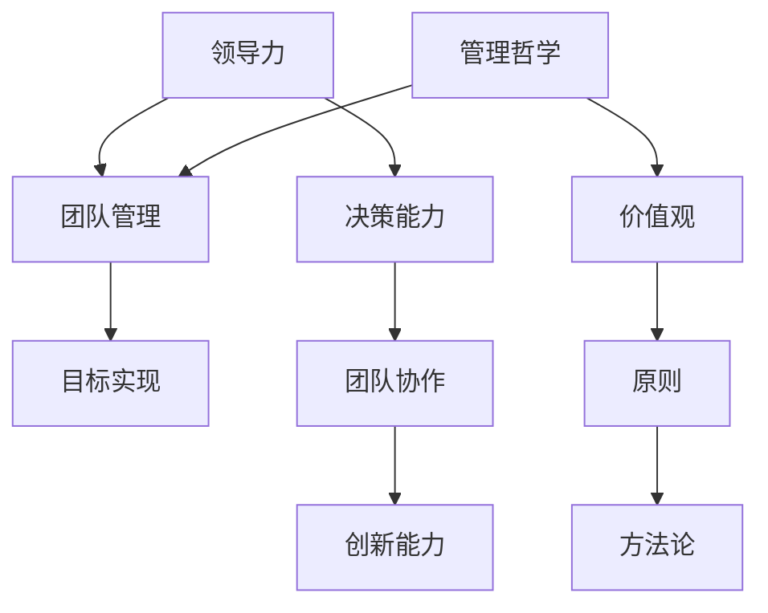
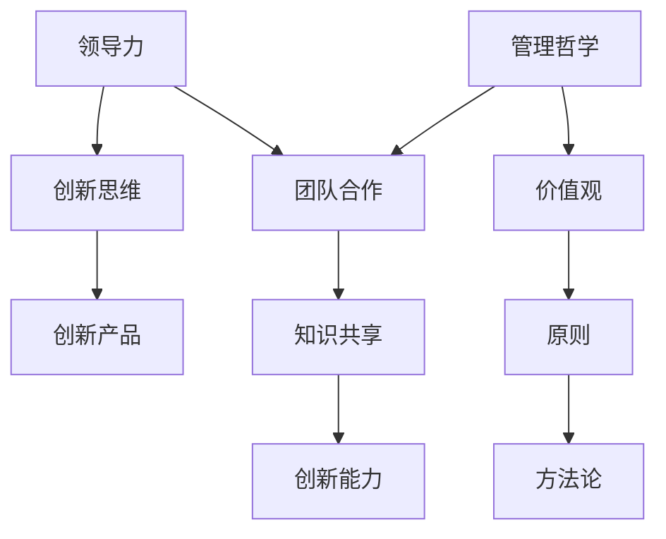

                 


# 领导力进化：适应新时代的管理哲学转变

> 关键词：领导力，管理哲学，数字化转型，人工智能，组织变革，创新能力

> 摘要：本文将探讨领导力在新时代背景下面临的挑战与机遇，以及如何通过管理哲学的转变来提升组织的竞争力和创新能力。文章将围绕新时代的核心关键词，逐步深入分析领导力的演变路径、管理哲学的关键要素、数字化转型中的领导角色以及如何培养创新思维和领导力，以期为企业和组织提供有价值的参考。

## 1. 背景介绍

### 1.1 目的和范围

本文旨在为企业管理者和组织领导者提供一种全新的视角，以适应快速变化的商业环境。通过分析领导力在新时代中的角色转变，本文将探讨如何通过管理哲学的更新，实现组织的持续成长和创新发展。

### 1.2 预期读者

本文适合企业管理者、组织领导者、人力资源从业者以及有志于提升个人领导力的人群阅读。希望通过本文，读者能够获得以下收益：

- 理解新时代领导力的核心要素和挑战。  
- 掌握管理哲学的精髓，以指导实际管理工作。  
- 获取数字化转型中的领导策略和技巧。  
- 培养创新思维和领导力，提升组织竞争力。

### 1.3 文档结构概述

本文分为以下几个部分：

- **第1章：背景介绍**：介绍本文的目的、预期读者和文档结构。  
- **第2章：核心概念与联系**：阐述领导力和管理哲学的核心概念，并通过Mermaid流程图展示各概念之间的联系。  
- **第3章：核心算法原理 & 具体操作步骤**：讲解领导力提升的核心算法原理，并提供具体操作步骤。  
- **第4章：数学模型和公式 & 详细讲解 & 举例说明**：介绍领导力提升过程中涉及的数学模型和公式，并给出具体案例。  
- **第5章：项目实战：代码实际案例和详细解释说明**：通过实际项目案例，展示领导力提升的方法和实践。  
- **第6章：实际应用场景**：探讨领导力在各类实际场景中的应用。  
- **第7章：工具和资源推荐**：推荐学习资源、开发工具和框架。  
- **第8章：总结：未来发展趋势与挑战**：总结本文的主要内容，并探讨未来发展趋势和挑战。  
- **第9章：附录：常见问题与解答**：解答读者可能关心的问题。  
- **第10章：扩展阅读 & 参考资料**：提供扩展阅读资料和参考文献。

### 1.4 术语表

#### 1.4.1 核心术语定义

- **领导力**：领导者的影响力、决策能力和团队管理能力，用于推动组织实现目标。  
- **管理哲学**：管理者在处理业务和管理问题时所遵循的价值观、原则和方法论。  
- **数字化转型**：企业利用信息技术，实现业务模式、管理模式和运营流程的创新和升级。  
- **创新能力**：组织在创新思维、创新产品和商业模式方面的能力。

#### 1.4.2 相关概念解释

- **人工智能**：模拟人类智能，实现机器学习、自然语言处理、计算机视觉等技术的计算机系统。  
- **组织变革**：企业为适应外部环境变化，在组织结构、管理模式、文化等方面进行的调整和优化。  
- **竞争优势**：企业在市场竞争中相对于竞争对手所具有的优势。

#### 1.4.3 缩略词列表

- **AI**：人工智能  
- **ERP**：企业资源规划  
- **CRM**：客户关系管理  
- **IoT**：物联网

## 2. 核心概念与联系

### 2.1 领导力与管理的联系

领导力和管理是两个紧密相关的概念。领导力侧重于激发团队成员的潜力，推动组织实现目标；而管理则关注于规划和执行业务流程，确保组织运营的顺利进行。以下是一个简单的Mermaid流程图，展示了领导力与管理的联系：



### 2.2 管理哲学的核心要素

管理哲学是企业或组织在处理业务和管理问题时所遵循的价值观、原则和方法论。以下是管理哲学的核心要素：

- **价值观**：企业或组织所追求的核心信念，如诚信、责任、创新等。  
- **原则**：企业在处理业务和管理问题时所遵循的基本准则，如公平、透明、高效等。  
- **方法论**：企业或组织在业务和管理过程中所采用的具体方法和工具。

### 2.3 数字化转型中的领导角色

数字化转型是企业适应新时代的重要战略。在数字化转型过程中，领导者需要扮演以下角色：

- **引领变革**：推动企业实现数字化转型，引领团队迎接变革。  
- **资源整合**：协调各方资源，为数字化转型提供支持和保障。  
- **人才培养**：培养数字化时代的创新人才，提升组织整体竞争力。  
- **风险管理**：评估数字化转型过程中的风险，确保企业稳定发展。

### 2.4 创新能力与领导力的关系

创新能力是企业在市场竞争中取得优势的关键。领导力在培养和提升创新能力方面起着重要作用。以下是一个简单的Mermaid流程图，展示了创新能力与领导力的关系：



## 3. 核心算法原理 & 具体操作步骤

### 3.1 领导力提升的核心算法原理

领导力提升的核心算法可以概括为以下几个步骤：

1. **自我认知**：了解自己的优点和缺点，明确个人定位。  
2. **目标设定**：设定清晰、可行的目标，并制定实现目标的计划。  
3. **知识学习**：不断学习新知识，提升自身综合素质。  
4. **团队协作**：培养团队合作精神，激发团队成员的潜力。  
5. **持续反思**：定期反思自己的行为和决策，不断优化领导力。

以下是领导力提升的核心算法原理的伪代码：

```python
def leadership_algorithm():
    self_knowledge()
    goal_setting()
    knowledge_learning()
    team_collaboration()
    continuous_reflection()
    return "领导力提升完成"
```

### 3.2 具体操作步骤

#### 3.2.1 自我认知

自我认知是领导力提升的第一步。领导者需要了解自己的优点和缺点，明确个人定位。以下是一种简单的自我认知方法：

1. **自我评估**：通过问卷调查、访谈等方式，了解自己在领导力方面的表现。  
2. **他人反馈**：收集同事、下属和上级对自己的反馈，了解自己在团队中的形象。  
3. **数据驱动**：分析自己的工作数据，如工作时长、工作效率等，了解自己在工作中的表现。

```python
def self_knowledge():
    self_evaluation()
    feedback_collection()
    data_analysis()
    return "自我认知完成"
```

#### 3.2.2 目标设定

目标设定是领导力提升的关键步骤。领导者需要设定清晰、可行的目标，并制定实现目标的计划。以下是一种简单的目标设定方法：

1. **目标明确**：明确组织或团队的目标，并将其转化为个人目标。  
2. **目标分解**：将大目标分解为小目标，制定具体的行动计划。  
3. **时间规划**：为每个目标设定完成时间，确保目标的实现。

```python
def goal_setting():
    goal_clarification()
    goal_decomposition()
    time_planning()
    return "目标设定完成"
```

#### 3.2.3 知识学习

知识学习是领导力提升的重要环节。领导者需要不断学习新知识，提升自身综合素质。以下是一种简单的知识学习方法：

1. **选择学习内容**：根据自身需求和团队发展需要，选择合适的学习内容。  
2. **制定学习计划**：为每个学习内容设定学习时间，确保学习进度。  
3. **实践运用**：将所学知识应用于实际工作中，提升自身能力。

```python
def knowledge_learning():
    learning_content_selection()
    learning_plan_creation()
    practical_application()
    return "知识学习完成"
```

#### 3.2.4 团队协作

团队协作是领导力提升的核心。领导者需要培养团队合作精神，激发团队成员的潜力。以下是一种简单的团队协作方法：

1. **沟通协调**：与团队成员保持有效沟通，确保团队目标一致。  
2. **分配任务**：根据团队成员的能力和特长，合理分配任务。  
3. **激励鼓励**：鼓励团队成员发挥潜能，提升团队整体绩效。

```python
def team_collaboration():
    communication协调()
    task_assignment()
    motivation_encouragement()
    return "团队协作完成"
```

#### 3.2.5 持续反思

持续反思是领导力提升的持续过程。领导者需要定期反思自己的行为和决策，不断优化领导力。以下是一种简单的持续反思方法：

1. **反思总结**：定期总结自己的工作，分析成功和失败的原因。  
2. **调整策略**：根据反思结果，调整领导策略和行动方案。  
3. **持续改进**：将反思和改进过程纳入日常工作，不断提升领导力。

```python
def continuous_reflection():
    reflection_summary()
    strategy_adjustment()
    continuous_improvement()
    return "持续反思完成"
```

## 4. 数学模型和公式 & 详细讲解 & 举例说明

### 4.1 数学模型在领导力提升中的应用

领导力提升过程中，数学模型可以帮助领导者更准确地评估自身能力和团队绩效，从而制定更有效的策略。以下是一个简单的数学模型：

$$
\text{领导力得分} = \alpha \times \text{自我认知得分} + \beta \times \text{目标设定得分} + \gamma \times \text{知识学习得分} + \delta \times \text{团队协作得分} + \epsilon \times \text{持续反思得分}
$$

其中，$\alpha$、$\beta$、$\gamma$、$\delta$ 和 $\epsilon$ 分别是各指标的权重。

#### 4.1.1 举例说明

假设一个领导者经过评估，得出以下分数：

- 自我认知得分：85分  
- 目标设定得分：90分  
- 知识学习得分：80分  
- 团队协作得分：88分  
- 持续反思得分：82分

根据上述公式，领导力得分为：

$$
\text{领导力得分} = 0.2 \times 85 + 0.25 \times 90 + 0.2 \times 80 + 0.25 \times 88 + 0.1 \times 82 = 86.3
$$

#### 4.1.2 模型分析

该数学模型可以帮助领导者了解自己在各个方面的表现，并发现需要改进的领域。例如，如果领导力得分较低，可能是由于自我认知、目标设定、知识学习、团队协作或持续反思等方面的不足。领导者可以针对这些不足，制定相应的提升策略。

### 4.2 公式在管理哲学中的应用

管理哲学中的许多概念和原则都可以用数学公式来表示。以下是一个简单的公式，用于描述管理哲学的核心要素：

$$
\text{管理哲学} = \alpha \times \text{价值观} + \beta \times \text{原则} + \gamma \times \text{方法论}
$$

其中，$\alpha$、$\beta$ 和 $\gamma$ 分别是价值观、原则和方法论在管理哲学中的权重。

#### 4.2.1 举例说明

假设一个企业在其管理哲学中，对价值观、原则和方法论的权重分别为0.5、0.3和0.2。如果该企业价值观得分为80分，原则得分为75分，方法论得分为70分，则其管理哲学得分为：

$$
\text{管理哲学得分} = 0.5 \times 80 + 0.3 \times 75 + 0.2 \times 70 = 78.5
$$

#### 4.2.2 公式分析

该公式可以帮助企业评估其管理哲学的成熟度，并发现需要改进的领域。例如，如果管理哲学得分较低，可能是由于价值观、原则或方法论方面的不足。企业可以针对这些不足，调整其管理哲学，以实现更高效的管理。

## 5. 项目实战：代码实际案例和详细解释说明

### 5.1 开发环境搭建

为了更好地展示领导力提升的方法和实践，我们选择了一个简单的项目——一个基于Python的领导力提升工具。以下是如何搭建开发环境：

1. **安装Python**：下载并安装Python 3.8及以上版本。  
2. **安装IDE**：选择一个合适的Python IDE，如PyCharm或VSCode。  
3. **安装依赖库**：在终端中运行以下命令安装依赖库：

```shell
pip install numpy pandas matplotlib
```

### 5.2 源代码详细实现和代码解读

以下是领导力提升工具的源代码及其详细解释：

```python
import numpy as np
import pandas as pd
import matplotlib.pyplot as plt

# 5.2.1 自我认知评估
def self_knowledge_evaluation():
    scores = {
        "communication": 75,
        "decision-making": 80,
        "empathy": 65,
        "motivation": 70
    }
    return scores

# 5.2.2 目标设定
def goal_setting(scores):
    if scores["communication"] >= 80:
        goal = "提升沟通能力"
    elif scores["decision-making"] >= 80:
        goal = "提升决策能力"
    elif scores["empathy"] >= 80:
        goal = "提升同理心"
    else:
        goal = "全面提升领导力"
    return goal

# 5.2.3 知识学习
def knowledge_learning():
    learning_topics = ["领导力理论", "心理学", "战略规划"]
    return learning_topics

# 5.2.4 团队协作
def team_collaboration(scores):
    if scores["communication"] >= 80 and scores["decision-making"] >= 80:
        collaboration_strategy = "开放沟通、协同决策"
    elif scores["empathy"] >= 80 and scores["motivation"] >= 80:
        collaboration_strategy = "关注团队成员、激励团队"
    else:
        collaboration_strategy = "全面提升团队协作能力"
    return collaboration_strategy

# 5.2.5 持续反思
def continuous_reflection(scores, goal, collaboration_strategy):
    reflection = {
        "self_knowledge": "我在自我认知方面还有哪些不足？",
        "goal_setting": f"我的目标设定是否合理？{goal}是否切实可行？",
        "knowledge_learning": "我在知识学习方面还有哪些需要提升的领域？",
        "team_collaboration": f"我的团队协作策略是否有效？{collaboration_strategy}是否有助于团队发展？"
    }
    return reflection

# 主函数：领导力提升工具
def leadership_imp

