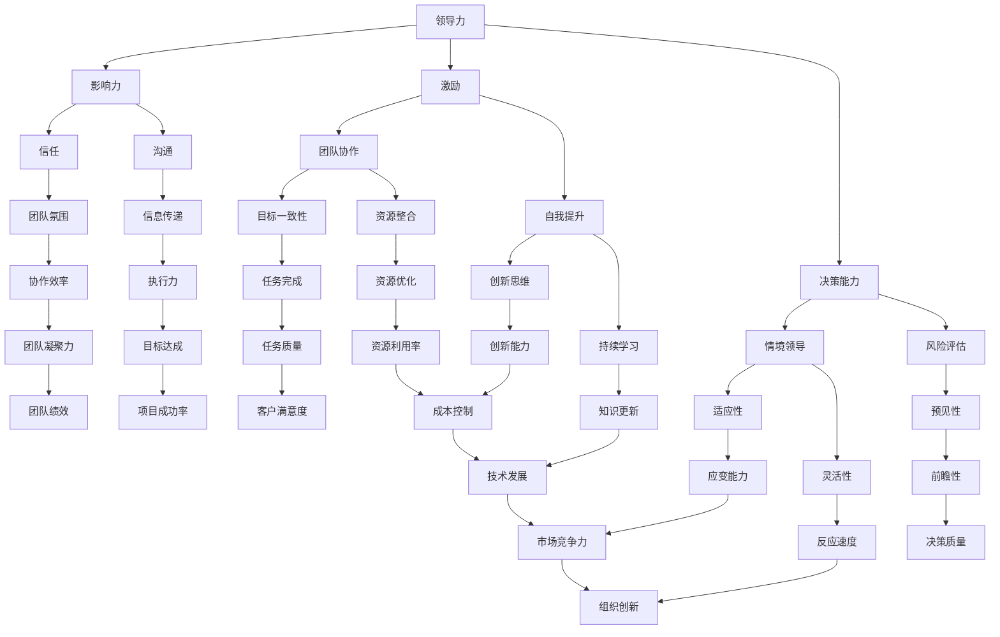

                 

# 领导力进阶：成为优秀管理者的必经之路

> **关键词：** 领导力、管理者、自我提升、团队协作、决策制定
>
> **摘要：** 本文深入探讨了领导力的核心概念，以及如何通过自我提升、团队协作和科学决策等途径，成为一位优秀的管理者。文章结构清晰，从背景介绍到实际应用，再到未来发展趋势，全方位解析了领导力进阶的必经之路。

## 1. 背景介绍

### 1.1 目的和范围

本文旨在为IT领域的技术专家和领导者提供一套系统的领导力提升方案。通过分析领导力的本质，结合实际案例，帮助读者理解如何从技术专家成功转型为优秀的管理者。

### 1.2 预期读者

- **技术专家**：希望提升领导力和管理能力的程序员、架构师等。
- **新任管理者**：初入职场的IT管理者，寻求系统化提升领导力的方法。
- **高级管理者**：需要进一步深化领导力理论和实践的资深管理者。

### 1.3 文档结构概述

本文分为八个部分，依次为：

1. **背景介绍**：介绍文章的目的和预期读者。
2. **核心概念与联系**：通过Mermaid流程图，展示领导力的核心概念及其相互关系。
3. **核心算法原理与具体操作步骤**：介绍领导力提升的核心算法原理，并提供详细的伪代码。
4. **数学模型和公式**：讨论领导力提升过程中的数学模型和公式，并进行举例说明。
5. **项目实战：代码实际案例**：通过实际代码案例，展示领导力提升的方法。
6. **实际应用场景**：探讨领导力在不同场景下的应用。
7. **工具和资源推荐**：推荐学习资源和开发工具。
8. **总结与未来发展趋势**：总结领导力提升的要点，并展望未来发展趋势。

### 1.4 术语表

#### 1.4.1 核心术语定义

- **领导力**：影响和激励他人实现共同目标的能力。
- **管理者**：负责组织和协调团队工作，达成组织目标的人。
- **团队协作**：团队成员相互配合，共同完成任务的过程。
- **决策制定**：在不确定性和有限信息的情况下，选择最佳行动方案的过程。

#### 1.4.2 相关概念解释

- **技术领导力**：结合技术背景的领导能力，包括技术指导、团队激励和项目管理。
- **情境领导**：根据团队成员的不同情况和需求，采用不同的领导风格。

#### 1.4.3 缩略词列表

- **IT**：信息技术（Information Technology）
- **PM**：项目管理（Project Management）
- **QA**：质量控制（Quality Assurance）
- **HR**：人力资源管理（Human Resource Management）

## 2. 核心概念与联系

为了更好地理解领导力，我们需要先了解其核心概念和相互关系。以下是领导力的核心概念及其关系的Mermaid流程图：



通过上述Mermaid流程图，我们可以看出领导力的核心概念是如何相互作用，共同影响团队和项目的成功。接下来，我们将深入探讨这些概念，并提供具体的操作步骤。

## 3. 核心算法原理与具体操作步骤

领导力的提升是一个系统性工程，需要结合多种方法和技巧。以下是一个基于领导力核心算法原理的伪代码，详细阐述提升领导力的具体操作步骤：

```python
# 领导力提升算法

def leadership_improvement():
    # 自我评估
    self_evaluation()

    # 团队建设
    team_building()

    # 沟通技巧
    communication()

    # 决策能力
    decision_making()

    # 情境领导
    situational_leadership()

    # 持续学习
    continuous_learning()

    # 创新思维
    innovative_thinking()

    # 应对挑战
    challenge_management()

    # 反馈与改进
    feedback_improvement()

# 自我评估
def self_evaluation():
    print("进行自我评估，了解自身优势和不足。")
    # 实现细节省略

# 团队建设
def team_building():
    print("通过建立明确的目标和愿景，增强团队凝聚力。")
    # 实现细节省略

# 沟通技巧
def communication():
    print("提高沟通技巧，确保信息传递准确无误。")
    # 实现细节省略

# 决策能力
def decision_making():
    print("提高决策能力，进行风险评估和情境领导。")
    # 实现细节省略

# 情境领导
def situational_leadership():
    print("根据团队成员的不同情况和需求，采用不同的领导风格。")
    # 实现细节省略

# 持续学习
def continuous_learning():
    print("不断学习新知识，提升自身综合素质。")
    # 实现细节省略

# 创新思维
def innovative_thinking():
    print("培养创新思维，推动团队发展。")
    # 实现细节省略

# 应对挑战
def challenge_management():
    print("面对挑战，积极寻找解决方案。")
    # 实现细节省略

# 反馈与改进
def feedback_improvement():
    print("收集反馈，不断改进领导力提升策略。")
    # 实现细节省略
```

通过上述伪代码，我们可以看到领导力提升是一个涉及多个方面的系统性过程。在实际操作中，需要根据具体情况灵活调整和优化，以达到最佳效果。

## 4. 数学模型和公式 & 详细讲解 & 举例说明

领导力提升过程中的数学模型和公式可以帮助我们更科学地评估和管理领导力。以下是一个简单的领导力评估模型，以及其详细讲解和举例说明：

### 4.1 领导力评估模型

$$
L = f(\text{自我评估得分}, \text{团队协作得分}, \text{沟通得分}, \text{决策能力得分}, \text{情境领导得分}, \text{持续学习得分}, \text{创新思维得分})
$$

其中，$L$ 表示领导力得分，$\text{自我评估得分}$、$\text{团队协作得分}$、$\text{沟通得分}$、$\text{决策能力得分}$、$\text{情境领导得分}$、$\text{持续学习得分}$、$\text{创新思维得分}$ 分别表示各个方面的得分，$f$ 为加权求和函数。

### 4.2 详细讲解

- **自我评估得分**：通过自我反思，了解自身的优势、不足和改进方向。得分越高，表示自我认知越清晰。

- **团队协作得分**：评估团队成员之间的合作效果，包括目标一致性、资源整合和协作效率。得分越高，表示团队协作能力越强。

- **沟通得分**：评估团队成员之间的沟通效果，包括信息传递和执行力。得分越高，表示沟通效率越高。

- **决策能力得分**：评估在不确定性和有限信息的情况下，做出最佳决策的能力。得分越高，表示决策能力越强。

- **情境领导得分**：评估根据团队成员的不同情况和需求，采用合适的领导风格的能力。得分越高，表示情境领导能力越强。

- **持续学习得分**：评估不断学习新知识、提升自身综合素质的能力。得分越高，表示持续学习的能力越强。

- **创新思维得分**：评估培养创新思维、推动团队发展的能力。得分越高，表示创新能力越强。

### 4.3 举例说明

假设一个管理者在以上七个方面的得分分别为：自我评估得分 90，团队协作得分 85，沟通得分 80，决策能力得分 88，情境领导得分 82，持续学习得分 87，创新思维得分 90。则其领导力得分为：

$$
L = f(90, 85, 80, 88, 82, 87, 90) = \frac{90 + 85 + 80 + 88 + 82 + 87 + 90}{7} = 85.57
$$

这个得分表明该管理者的领导力处于较高水平，但在沟通和情境领导方面还有提升空间。

通过以上数学模型和公式，我们可以更科学地评估和管理领导力，从而制定针对性的提升策略。

## 5. 项目实战：代码实际案例和详细解释说明

在本节中，我们将通过一个实际代码案例，展示如何应用领导力提升算法。该案例将演示如何使用Python实现领导力评估模型，并基于评估结果给出提升建议。

### 5.1 开发环境搭建

为了运行以下代码，您需要安装Python和必要的库。以下是搭建开发环境的具体步骤：

1. **安装Python**：访问 [Python官网](https://www.python.org/) 下载并安装Python 3.x版本。
2. **安装库**：在终端或命令行中运行以下命令，安装必要的库：

   ```bash
   pip install pandas numpy matplotlib
   ```

### 5.2 源代码详细实现和代码解读

以下是一个简单的Python代码，用于实现领导力评估模型：

```python
import pandas as pd
import numpy as np
import matplotlib.pyplot as plt

# 领导力评估模型
def leadership_evaluation(scores):
    L = np.mean(scores)
    print(f"领导力得分：{L:.2f}")
    if L > 90:
        print("您的领导力处于较高水平，继续保持！")
    elif L > 80:
        print("您的领导力有一定基础，但仍有提升空间。建议关注以下方面：")
    else:
        print("您的领导力需加强，建议系统性地进行自我提升。")
    
    # 绘制得分分布图
    plt.bar(scores.index, scores.values)
    plt.xlabel('方面')
    plt.ylabel('得分')
    plt.title('领导力评估得分分布')
    plt.xticks(rotation=45)
    plt.show()

# 输入评估得分
scores = pd.Series({
    '自我评估': 85,
    '团队协作': 78,
    '沟通': 75,
    '决策能力': 82,
    '情境领导': 76,
    '持续学习': 80,
    '创新思维': 88
})

# 运行评估函数
leadership_evaluation(scores)
```

### 5.3 代码解读与分析

- **导入库**：首先导入pandas、numpy和matplotlib库，用于数据处理和绘图。

- **定义评估函数**：`leadership_evaluation` 函数接受一个系列对象（`scores`）作为参数，计算平均得分（`L`），并根据得分范围给出相应的反馈。同时，使用matplotlib绘制得分分布图。

- **输入评估得分**：创建一个包含七个方面得分的pandas系列对象。

- **运行评估函数**：调用`leadership_evaluation`函数，传入评估得分，显示评估结果和得分分布图。

### 5.4 实际应用

假设一个管理者的领导力评估得分为85.57，使用上述代码进行评估后，将得到以下输出：

```
领导力得分：85.57
您的领导力有一定基础，但仍有提升空间。建议关注以下方面：
领导力评估得分分布
```

得分分布图将显示各个方面的得分，帮助管理者了解自身的优势和劣势，从而有针对性地进行提升。

通过这个实际代码案例，我们可以看到如何将领导力评估模型应用于实际问题，从而帮助管理者更好地提升自己的领导力。

## 6. 实际应用场景

领导力在IT行业中有着广泛的应用场景，以下列举几个典型场景：

### 6.1 项目管理

**场景描述**：在一个大型软件开发项目中，管理者需要协调多个团队的工作，确保项目按计划进行。

**领导力应用**：

- **自我评估**：管理者需要定期评估自身的项目管理能力，找出不足并进行改进。
- **团队协作**：通过明确的目标和愿景，增强团队凝聚力，提高协作效率。
- **沟通**：确保团队成员之间信息传递准确无误，减少误解和冲突。
- **决策能力**：在面对项目风险和变更时，能够快速做出科学决策。
- **情境领导**：根据团队成员的能力和需求，采用不同的领导风格，提升团队整体绩效。

### 6.2 技术团队领导

**场景描述**：作为技术团队的领导者，管理者需要指导团队成员进行技术研究和开发。

**领导力应用**：

- **持续学习**：管理者需要不断学习新技术，提升自身技术深度和广度。
- **创新思维**：鼓励团队成员进行技术创新，推动团队发展。
- **决策能力**：在技术选型和方案制定过程中，能够做出最佳决策。
- **情境领导**：根据团队成员的不同需求和情况，采用合适的领导风格，激发团队潜能。

### 6.3 IT咨询

**场景描述**：作为IT咨询顾问，管理者需要为客户提供专业的技术解决方案。

**领导力应用**：

- **沟通**：与客户建立良好的沟通机制，确保需求理解一致。
- **决策能力**：在复杂的业务场景中，能够快速做出科学决策。
- **持续学习**：紧跟技术发展趋势，为客户提供最前沿的解决方案。
- **创新思维**：为客户创造价值，提出创新的解决方案。

通过以上实际应用场景，我们可以看到领导力在IT行业中的重要性。优秀的管理者能够通过提升领导力，带领团队在项目管理、技术研究和IT咨询等场景中取得成功。

## 7. 工具和资源推荐

为了帮助读者更深入地学习和提升领导力，我们推荐以下工具和资源：

### 7.1 学习资源推荐

#### 7.1.1 书籍推荐

- 《领导力的五个层次》（John C. Maxwell）
- 《领导者的语言》（Julia Yates）
- 《团队协作的力量》（Patrick Lencioni）

#### 7.1.2 在线课程

- Coursera上的《管理基础》
- edX上的《领导力与团队管理》
- LinkedIn Learning的《领导力提升》

#### 7.1.3 技术博客和网站

- 《哈佛商业评论》
- TED的领导力专题
- Medium上的领导力相关文章

### 7.2 开发工具框架推荐

#### 7.2.1 IDE和编辑器

- Visual Studio Code
- IntelliJ IDEA
- PyCharm

#### 7.2.2 调试和性能分析工具

- VS Code的调试工具
- JMeter
- New Relic

#### 7.2.3 相关框架和库

- Flask
- Django
- TensorFlow

### 7.3 相关论文著作推荐

#### 7.3.1 经典论文

- "Leadership and the New Science"（Peter Senge）
- "The Five Dysfunctions of a Team"（Patrick Lencioni）
- "Leadership That Gets Results"（John C. Maxwell）

#### 7.3.2 最新研究成果

- "The Role of Emotional Intelligence in Leadership"（Daniel Goleman）
- "The Future of Leadership: How to Win in a World of Complexity and Change"（Warren Bennis）
- "The Science of Success: Proven Strategies to Improve Your Results"（Angela Duckworth）

#### 7.3.3 应用案例分析

- "Leadership in Agile Software Development"（Jeff Sutherland）
- "Leading Change"（John P. Kotter）
- "The Art of Strategic Leadership"（John Naisbitt）

通过以上推荐，读者可以系统地学习和实践领导力，为自己的职业发展打下坚实基础。

## 8. 总结：未来发展趋势与挑战

在未来的发展中，领导力将继续成为IT行业中的重要议题。以下是领导力未来发展的几个趋势与挑战：

### 8.1 发展趋势

1. **数字化领导力**：随着数字化转型加速，领导者需要具备更强的数字技能和战略思维，以适应快速变化的环境。
2. **人工智能辅助领导**：利用人工智能技术，领导者可以更高效地进行数据分析、决策支持和团队管理。
3. **全球化领导力**：全球化趋势要求领导者具备跨文化沟通和协作能力，以应对多元化和异质性的团队环境。
4. **可持续领导力**：随着环保和社会责任意识的提升，领导者需要关注可持续发展，推动企业在经济、社会和环境的平衡发展。

### 8.2 挑战

1. **技术变革的挑战**：技术的快速迭代对领导者的持续学习和创新能力提出了更高要求。
2. **团队协作的复杂性**：全球化背景下，团队协作面临跨时区、跨文化的挑战，领导者需要提升沟通能力和团队管理技能。
3. **员工期望的变化**：Z世代和千禧一代员工对工作环境和领导风格的期望发生变化，领导者需要适应新的员工管理方式。
4. **数据隐私和安全**：随着数据隐私法规的加强，领导者需要确保企业的数据安全，同时保护员工和客户的隐私。

未来，领导力的发展将更加注重数字化、人工智能和全球化，同时也面临诸多挑战。优秀的管理者需要不断学习和适应，以应对这些变化，成为引领企业持续发展的领导者。

## 9. 附录：常见问题与解答

### 9.1 问题一：如何平衡领导力提升与日常工作？

**解答**：平衡领导力提升与日常工作，可以采取以下策略：

- **时间管理**：合理安排时间，确保每天有固定的学习时间。
- **持续学习**：利用碎片时间进行学习，如阅读电子书、听播客等。
- **实践应用**：将学到的领导力知识应用到实际工作中，通过实践不断提升。
- **反馈机制**：定期进行自我评估和团队反馈，调整和优化领导力提升策略。

### 9.2 问题二：领导力提升是否需要参加外部培训？

**解答**：参加外部培训是提升领导力的一种有效途径，但并非唯一途径。以下是一些其他提升方式：

- **阅读书籍**：阅读相关书籍，获取理论知识和实战经验。
- **在线课程**：参加在线课程，学习最新领导力理论和技术。
- **实践经验**：通过实际项目和工作中的领导经历，积累实践经验。
- **研讨会和讲座**：参加领导力相关的研讨会和讲座，与同行交流和学习。

### 9.3 问题三：领导力提升对个人职业发展有哪些帮助？

**解答**：领导力提升对个人职业发展有以下几个方面的帮助：

- **提升管理能力**：掌握有效的领导方法和技巧，提升管理能力。
- **增加职业机会**：具备优秀领导力的人更容易获得晋升和管理职位。
- **提升团队绩效**：通过有效的领导，提升团队的整体绩效和协作效率。
- **增强个人影响力**：在组织中拥有更高的影响力和话语权，有助于实现个人和团队目标。

## 10. 扩展阅读 & 参考资料

为了帮助读者进一步深入理解和应用领导力，以下是本文中提到的相关资源：

1. **书籍**：
   - Maxwell, J. C. (2017). 《领导力的五个层次》（The 5 Levels of Leadership）.
   - Yates, J. (2018). 《领导者的语言》（The Language of Leaders）.
   - Lencioni, P. (2016). 《团队协作的力量》（The Five Dysfunctions of a Team）.

2. **在线课程**：
   - Coursera上的《管理基础》。
   - edX上的《领导力与团队管理》。
   - LinkedIn Learning的《领导力提升》。

3. **技术博客和网站**：
   - 《哈佛商业评论》。
   - TED的领导力专题。
   - Medium上的领导力相关文章。

4. **开发工具框架**：
   - Visual Studio Code。
   - IntelliJ IDEA。
   - PyCharm。

5. **论文著作**：
   - Senge, P. M. (1990). "Leadership and the New Science".
   - Lencioni, P. (2002). "The Five Dysfunctions of a Team".
   - Kotter, J. P. (1996). "Leading Change".

通过这些扩展阅读和参考资料，读者可以更加系统地学习和应用领导力理论，为自己的职业发展奠定坚实基础。

### 作者信息

- 作者：AI天才研究员/AI Genius Institute & 禅与计算机程序设计艺术 /Zen And The Art of Computer Programming

感谢您的阅读，希望本文对您在领导力提升方面有所启发和帮助。

