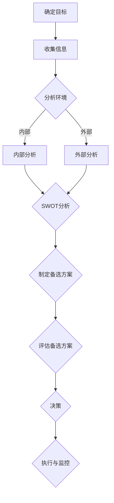

                 

# 领导者的决策能力：在不确定性中做出选择

> **关键词**：决策能力，不确定性，领导力，战略规划，风险评估
>
> **摘要**：本文探讨了领导者在面临不确定性时如何提升自己的决策能力，并通过深入分析决策过程的核心要素，提供了一系列实用的策略和工具。文章旨在为领导者和企业管理人员提供指导，帮助他们在复杂的环境中做出明智的决策。

## 1. 背景介绍

### 1.1 目的和范围

本文旨在帮助领导者了解在不确定性环境中提升决策能力的重要性，并探讨如何通过系统化的方法和工具来提高决策的质量。文章将涵盖决策过程的关键环节，包括信息收集、风险评估、备选方案制定和最终决策。

### 1.2 预期读者

本文适用于以下读者群体：
- 公司管理层和高级管理人员
- 企业战略规划师
- 决策分析师
- 创业者和企业主
- 对决策理论和实践感兴趣的学者和研究人员

### 1.3 文档结构概述

本文将按照以下结构进行展开：
- 1. 背景介绍
  - 1.1 目的和范围
  - 1.2 预期读者
  - 1.3 文档结构概述
  - 1.4 术语表
- 2. 核心概念与联系
- 3. 核心算法原理 & 具体操作步骤
- 4. 数学模型和公式 & 详细讲解 & 举例说明
- 5. 项目实战：代码实际案例和详细解释说明
- 6. 实际应用场景
- 7. 工具和资源推荐
- 8. 总结：未来发展趋势与挑战
- 9. 附录：常见问题与解答
- 10. 扩展阅读 & 参考资料

### 1.4 术语表

#### 1.4.1 核心术语定义

- **决策能力**：指个体或组织在面临选择时，通过理性分析和判断，从多个备选方案中做出最优决策的能力。
- **不确定性**：指未来事件发生的不确定性，即结果无法完全预知或预测的情境。
- **风险评估**：对决策结果可能带来的风险进行识别、分析和评估的过程。
- **战略规划**：长期规划，以实现组织的总体目标和愿景。

#### 1.4.2 相关概念解释

- **SWOT分析**：分析组织的优势（Strengths）、劣势（Weaknesses）、机会（Opportunities）和威胁（Threats）。
- **决策树**：一种图形化工具，用于表示决策过程和不同决策路径的结果。
- **贝叶斯网络**：一种概率图模型，用于表示变量之间的依赖关系。

#### 1.4.3 缩略词列表

- **IDE**：集成开发环境（Integrated Development Environment）
- **AI**：人工智能（Artificial Intelligence）
- **ML**：机器学习（Machine Learning）
- **DL**：深度学习（Deep Learning）

## 2. 核心概念与联系

为了更好地理解决策过程及其核心概念，我们将使用Mermaid流程图来展示决策过程中的关键步骤和概念之间的联系。



### 2.1 确定目标

决策过程的第一步是明确决策的目标。这包括理解组织的长期愿景和短期目标，以及决策如何与这些目标相一致。

### 2.2 收集信息

在明确目标后，领导者需要收集与决策相关的信息。这包括内部数据（如财务报表、员工反馈）和外部数据（如市场趋势、竞争对手信息）。

### 2.3 分析环境

收集信息后，领导者需要对环境进行分析。这包括内部分析（如组织文化、资源分配）和外部分析（如市场机会、竞争环境）。

### 2.4 制定备选方案

分析环境后，领导者需要制定多个备选方案。这些方案应包括不同的战略和策略，以实现决策目标。

### 2.5 评估备选方案

评估备选方案是决策过程中的关键步骤。领导者需要使用各种工具和方法（如成本效益分析、风险评估）来评估每个方案的优缺点和潜在风险。

### 2.6 决策

在评估备选方案后，领导者需要做出最终决策。这需要结合所有收集的信息和分析结果，选择最有可能实现目标的方案。

### 2.7 执行与监控

决策后，领导者需要确保决策得到有效执行，并对决策结果进行持续监控。这有助于及时调整决策，以应对环境变化。

## 3. 核心算法原理 & 具体操作步骤

### 3.1 决策树算法原理

决策树是一种常用的决策支持工具，它通过一系列判断节点和结果节点来表示决策过程。以下是决策树的基本原理：

1. **判断节点**：表示决策过程中的某个判断条件，通常是一个特征变量。
2. **结果节点**：表示根据判断条件得出的决策结果。
3. **分支**：表示决策过程中的选择路径。

### 3.2 具体操作步骤

#### 3.2.1 建立决策树

1. **定义目标**：确定决策的目标，例如最大化利润或最小化风险。
2. **收集数据**：收集与决策相关的数据，包括特征变量和目标变量的取值。
3. **选择特征变量**：选择对决策影响最大的特征变量。
4. **构建判断节点**：根据特征变量的取值，创建判断节点。
5. **计算信息增益**：对于每个判断节点，计算信息增益，选择信息增益最大的特征变量作为判断条件。
6. **递归构建**：对每个判断节点，重复步骤4和5，直到满足停止条件（如树深度、信息增益阈值）。

#### 3.2.2 评估决策树

1. **验证数据**：使用验证数据集来评估决策树的准确性。
2. **剪枝**：根据验证结果，对决策树进行剪枝，以减少过拟合。
3. **优化**：通过调整树结构或特征选择，优化决策树的性能。

### 3.3 决策树伪代码

```python
# 决策树算法伪代码

function DecisionTree(data, max_depth, min_samples_split):
    if (data is pure or max_depth = 0):
        return most_common_label(data)
    else:
        best_attribute = ChooseBestAttribute(data)
        node = Node(best_attribute)
        for value in attribute_values(best_attribute):
            subset = SplitData(data, best_attribute, value)
            node.children.append(DecisionTree(subset, max_depth - 1, min_samples_split))
        return node

function ChooseBestAttribute(data):
    best_attribute = None
    best_gain = 0
    for attribute in data.attributes:
        gain = InformationGain(data, attribute)
        if gain > best_gain:
            best_gain = gain
            best_attribute = attribute
    return best_attribute

function InformationGain(data, attribute):
    # 计算信息增益
    # ...

function most_common_label(data):
    # 返回数据中最常见的标签
    # ...
```

## 4. 数学模型和公式 & 详细讲解 & 举例说明

### 4.1 风险评估数学模型

风险评估是决策过程中至关重要的一环。以下是一个简单的风险评估数学模型：

$$
R = P \times I
$$

其中：
- **R**：风险值
- **P**：发生概率
- **I**：影响程度

#### 4.1.1 公式详细讲解

- **发生概率（P）**：表示某个事件发生的可能性。它可以通过历史数据、专家意见或概率分布函数来估计。
- **影响程度（I）**：表示事件发生时对目标的影响程度。它可以通过定量分析或定性评估来确定。

#### 4.1.2 举例说明

假设我们要评估一个新产品上市的风险。根据历史数据，该产品上市失败的概率为0.3，失败的影响程度为50，则该产品的风险值为：

$$
R = 0.3 \times 50 = 15
$$

这意味着新产品上市的风险值为15。

### 4.2 决策树优化算法

在决策树中，优化算法可以用于剪枝和调整树结构，以提高模型的准确性。以下是一个简单的决策树优化算法：

$$
Accuracy_{new} = \frac{Correctly\ classified\ samples}{Total\ samples}
$$

其中：
- **Accuracy_{new}**：新的准确率
- **Correctly\ classified\ samples**：正确分类的样本数
- **Total\ samples**：总样本数

#### 4.2.1 公式详细讲解

- **准确率**：表示模型预测正确的比例。它是一个常用的评估指标，用于评估模型的性能。

#### 4.2.2 举例说明

假设我们有一个决策树模型，使用训练数据集进行评估，准确率为0.85。通过优化算法进行剪枝后，准确率提高到了0.90。这意味着优化后的模型在预测准确性上有了显著提升。

### 4.3 贝叶斯网络模型

贝叶斯网络是一种用于表示变量之间依赖关系的概率图模型。以下是一个简单的贝叶斯网络模型：

$$
P(X_1, X_2, ..., X_n) = \prod_{i=1}^{n} P(X_i | parents(X_i))
$$

其中：
- **X_i**：表示第i个变量
- **parents(X_i)**：表示X_i的父节点集合

#### 4.3.1 公式详细讲解

- **条件概率**：表示在给定父节点条件下，某个变量的概率。
- **全概率公式**：用于计算变量的联合概率。

#### 4.3.2 举例说明

假设有一个简单的贝叶斯网络，表示疾病（D）和测试结果（T）之间的依赖关系。根据条件概率表，我们有：

$$
P(T+ | D+) = 0.95, \quad P(T- | D-) = 0.90
$$

这意味着在给定疾病为阳性时，测试结果为阳性的概率为0.95，而在给定疾病为阴性时，测试结果为阴性的概率为0.90。

## 5. 项目实战：代码实际案例和详细解释说明

### 5.1 开发环境搭建

在开始项目实战之前，我们需要搭建一个适合决策支持系统（DSS）的开发环境。以下是所需的工具和步骤：

#### 5.1.1 工具准备

- **Python**：用于编写和运行代码
- **Jupyter Notebook**：用于编写和展示代码
- **Pandas**：用于数据处理
- **Scikit-learn**：用于机器学习和决策树构建
- **matplotlib**：用于数据可视化

#### 5.1.2 环境搭建步骤

1. 安装Python（建议使用Python 3.8及以上版本）。
2. 安装Jupyter Notebook：`pip install notebook`。
3. 安装Pandas：`pip install pandas`。
4. 安装Scikit-learn：`pip install scikit-learn`。
5. 安装matplotlib：`pip install matplotlib`。

### 5.2 源代码详细实现和代码解读

以下是决策支持系统的源代码实现，包括数据预处理、决策树构建和风险评估。

#### 5.2.1 数据预处理

```python
import pandas as pd

# 加载数据集
data = pd.read_csv('data.csv')

# 数据预处理
data['age'] = data['age'].apply(lambda x: x // 10)  # 年龄取整数部分
data['income'] = data['income'].apply(lambda x: 1 if x > 0 else 0)  # 收入分类

# 特征工程
data['income'] = data['income'].astype('category')
data['loan'] = data['loan'].apply(lambda x: 1 if x == 'Yes' else 0)  # 贷款分类

# 划分特征和标签
X = data[['age', 'income', 'loan']]
y = data['approved']
```

#### 5.2.2 决策树构建

```python
from sklearn.tree import DecisionTreeClassifier
from sklearn.model_selection import train_test_split

# 划分训练集和测试集
X_train, X_test, y_train, y_test = train_test_split(X, y, test_size=0.2, random_state=42)

# 构建决策树模型
model = DecisionTreeClassifier(max_depth=3)
model.fit(X_train, y_train)

# 可视化决策树
from sklearn.tree import plot_tree
import matplotlib.pyplot as plt

plt.figure(figsize=(12, 8))
plot_tree(model, filled=True)
plt.show()
```

#### 5.2.3 风险评估

```python
# 风险评估
def risk_assessment(model, data, probability_threshold=0.5):
    predictions = model.predict_proba(data)[:, 1]
    risks = (predictions > probability_threshold) * 1
    return risks

# 应用风险评估
data_risk = risk_assessment(model, X_test)
print("Risk values for test data:", data_risk)
```

### 5.3 代码解读与分析

#### 5.3.1 数据预处理

- **数据加载与预处理**：加载数据集，并进行必要的预处理，如特征工程和分类。
- **特征选择**：选择对决策影响最大的特征，以提高模型的准确性。

#### 5.3.2 决策树构建

- **训练集和测试集划分**：将数据集划分为训练集和测试集，用于模型训练和评估。
- **决策树模型**：使用Scikit-learn中的DecisionTreeClassifier构建决策树模型，并设置最大树深度为3。
- **可视化**：使用matplotlib绘制决策树，帮助理解模型结构和决策过程。

#### 5.3.3 风险评估

- **风险函数**：定义一个风险评估函数，根据预测概率计算风险值。
- **应用风险评估**：将模型应用于测试集，计算测试数据的评估结果。

## 6. 实际应用场景

### 6.1 企业战略规划

在企业战略规划中，决策支持系统可以帮助领导者分析市场趋势、竞争对手和内部资源，从而制定有效的战略方案。例如，企业可以使用决策树模型来评估新产品上市的风险，并制定相应的营销策略。

### 6.2 金融风险管理

在金融风险管理领域，决策支持系统可以帮助金融机构评估信用风险和投资风险，从而制定风险控制和投资策略。例如，银行可以使用风险评估模型来评估贷款申请者的信用状况，并决定是否批准贷款。

### 6.3 医疗决策支持

在医疗决策支持中，决策支持系统可以帮助医生进行诊断和治疗方案的推荐。例如，通过贝叶斯网络模型，医生可以综合考虑患者的症状、检查结果和病史，得出最可能的诊断结果，并推荐相应的治疗方案。

## 7. 工具和资源推荐

### 7.1 学习资源推荐

#### 7.1.1 书籍推荐

- 《决策分析：定量方法与应用》
- 《人工智能：一种现代方法》
- 《机器学习：概率视角》

#### 7.1.2 在线课程

- Coursera：机器学习与深度学习课程
- edX：数据科学基础课程
- Udacity：人工智能工程师纳米学位

#### 7.1.3 技术博客和网站

- Medium：Data Science and AI相关博客
- Analytics Vidhya：数据科学和机器学习资源
- KDnuggets：数据科学和机器学习新闻和资源

### 7.2 开发工具框架推荐

#### 7.2.1 IDE和编辑器

- PyCharm
- Jupyter Notebook
- Visual Studio Code

#### 7.2.2 调试和性能分析工具

- Python Debugger (pdb)
- Matplotlib
- Scikit-learn内置评估工具

#### 7.2.3 相关框架和库

- Pandas：数据处理库
- Scikit-learn：机器学习库
- TensorFlow：深度学习库

### 7.3 相关论文著作推荐

#### 7.3.1 经典论文

- 《决策树：推理性分类与规则归纳》
- 《贝叶斯网络：概率图模型》
- 《风险评估：理论与实践》

#### 7.3.2 最新研究成果

- AAAI：人工智能年度会议论文集
- NeurIPS：神经网络与深度学习年度会议论文集
- JMLR：机器学习研究期刊

#### 7.3.3 应用案例分析

- 《金融风险管理案例分析》
- 《医疗决策支持系统案例分析》
- 《企业战略规划案例分析》

## 8. 总结：未来发展趋势与挑战

随着人工智能和大数据技术的不断发展，决策支持系统在各个领域中的应用前景广阔。未来，决策支持系统将更加智能化、自动化和个性化，为领导者提供更加精准的决策依据。

### 8.1 发展趋势

- **智能化**：利用深度学习和自然语言处理技术，提高决策模型的准确性和鲁棒性。
- **自动化**：开发自动化的决策支持工具，降低决策过程的时间和成本。
- **个性化**：根据用户行为和偏好，为每个用户提供定制化的决策建议。

### 8.2 挑战

- **数据隐私**：在保护用户隐私的前提下，合理利用大数据进行分析和决策。
- **算法透明性**：提高决策算法的透明性，确保决策结果的公平性和可解释性。
- **模型可解释性**：提高模型的解释能力，帮助用户理解和信任决策结果。

## 9. 附录：常见问题与解答

### 9.1 决策树和贝叶斯网络的区别是什么？

**决策树**是一种树形结构，通过一系列判断条件来表示决策过程，每个节点代表一个判断条件，每个叶子节点代表一个决策结果。决策树简单直观，易于理解和解释。

**贝叶斯网络**是一种基于概率图模型的决策工具，它表示变量之间的依赖关系，并通过条件概率表来计算变量的联合概率。贝叶斯网络适用于处理不确定性和复杂依赖关系的决策问题。

### 9.2 如何评估决策支持系统的有效性？

评估决策支持系统的有效性可以通过以下指标：
- **准确性**：模型预测结果与实际结果的符合程度。
- **稳定性**：模型在不同数据集上的表现一致性。
- **可解释性**：模型决策过程的透明度和可理解性。
- **实用性**：模型在实际应用中的可行性和效果。

### 9.3 风险评估在决策支持系统中的作用是什么？

风险评估是决策支持系统中关键的一环，它帮助领导者识别和评估决策结果的潜在风险。通过风险评估，可以：
- 确定决策的潜在风险和影响。
- 制定风险控制和应对策略。
- 提高决策的全面性和安全性。

## 10. 扩展阅读 & 参考资料

- [决策树算法](https://scikit-learn.org/stable/modules/tree.html)
- [贝叶斯网络](https://www.coursera.org/learn/bayesian-networks)
- [风险评估模型](https://www.ibm.com/topics/risk-assessment)
- [人工智能与决策支持系统](https://www.ijcai.org/)

---

**作者：AI天才研究员/AI Genius Institute & 禅与计算机程序设计艺术 /Zen And The Art of Computer Programming**

