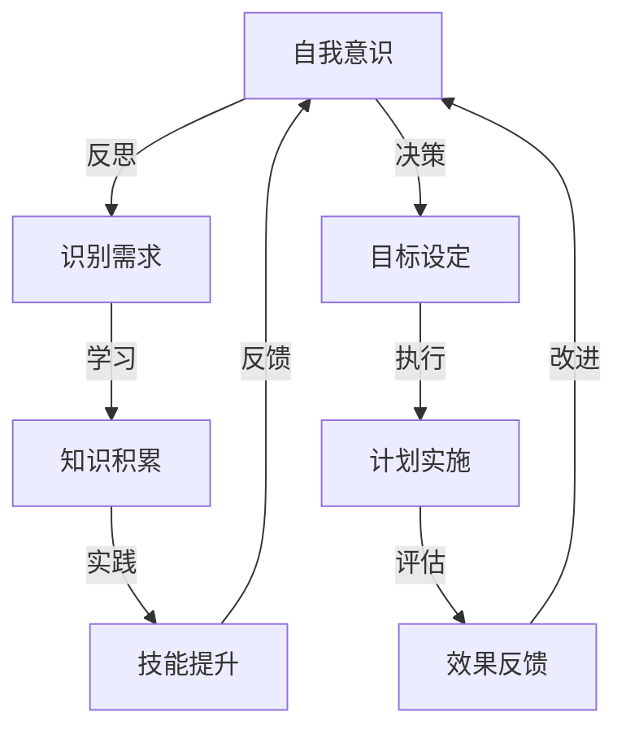

                 

# 领导者的自我成长：持续学习的重要性

> 关键词：领导者、自我成长、持续学习、个人发展、团队建设、技术领导力

> 摘要：本文将深入探讨领导者自我成长的核心要素——持续学习的重要性。通过分析自我成长在领导力发展中的作用，结合实际案例，我们将揭示持续学习如何帮助领导者提升个人能力，推动团队进步，并在快速变化的技术环境中保持竞争力。

## 1. 背景介绍

### 1.1 目的和范围

本文旨在为领导者提供一种自我成长的方法论，强调持续学习在领导力提升中的关键作用。我们将探讨以下内容：

- 自我成长的定义及其对领导者的意义
- 持续学习的理念与实际操作
- 自我成长与团队建设的关系
- 如何在技术领域保持竞争力

### 1.2 预期读者

- 担任或希望成为技术领导者的专业人士
- 对领导力和个人成长有浓厚兴趣的读者
- 从事IT行业的职场人士，特别是希望提升自我和团队效能的人

### 1.3 文档结构概述

本文将按照以下结构展开：

- 背景介绍：概述文章的目的、读者对象和结构
- 核心概念与联系：介绍自我成长和持续学习的核心概念，并展示相关流程图
- 核心算法原理 & 具体操作步骤：解释持续学习的过程及其在领导力中的应用
- 数学模型和公式 & 详细讲解 & 举例说明：运用数学和算法工具来深化理解
- 项目实战：提供实际案例，展示持续学习的具体应用
- 实际应用场景：分析持续学习在现实环境中的影响
- 工具和资源推荐：推荐相关学习资源和工具
- 总结：对未来发展趋势和挑战的思考
- 附录：常见问题与解答
- 扩展阅读 & 参考资料：提供进一步的阅读材料

### 1.4 术语表

#### 1.4.1 核心术语定义

- **自我成长**：指个体通过学习、反思和实践，不断提升自身能力，实现个人价值的过程。
- **持续学习**：指不断获取新知识、技能和经验，适应变化，持续提升个人能力的过程。
- **领导力**：指领导者通过影响、激励和指导他人，实现组织目标的能力。

#### 1.4.2 相关概念解释

- **技术领导力**：指在技术领域内，领导者通过技术洞察、创新能力和团队管理，推动技术发展和团队效能的能力。
- **团队建设**：指通过成员之间的互动和协作，提高团队整体绩效和凝聚力的过程。

#### 1.4.3 缩略词列表

- **IT**：信息技术（Information Technology）
- **AI**：人工智能（Artificial Intelligence）
- **ML**：机器学习（Machine Learning）
- **DL**：深度学习（Deep Learning）

## 2. 核心概念与联系

持续学习和自我成长是领导者不可或缺的能力。为了更好地理解这一核心概念，我们将使用Mermaid流程图来展示自我成长和持续学习之间的联系。



在这个流程图中，我们可以看到自我成长和持续学习是如何相互促进的。领导者通过自我意识识别需求，然后通过学习、实践和反馈不断循环，提升个人能力和实现目标。

### 2.1 自我成长的动力机制

自我成长的动力机制主要包括以下几个方面：

- **内在动机**：领导者对个人成长和发展的强烈愿望。
- **外部压力**：来自市场变化、技术进步和团队需求的压力。
- **学习氛围**：组织内部鼓励学习、分享和创新的文化氛围。
- **反馈机制**：通过绩效评估、同事反馈和自我反思来识别改进点。

### 2.2 持续学习的价值

持续学习对领导者的价值体现在以下几个方面：

- **提升个人能力**：通过不断学习，领导者可以掌握新的知识和技能，提升自身专业水平。
- **增强团队效能**：领导者的持续学习可以带动团队成员一起成长，提高团队整体绩效。
- **适应变化**：在快速变化的技术环境中，持续学习可以帮助领导者更好地适应新环境，应对挑战。

### 2.3 持续学习的方法

为了实现持续学习，领导者可以采取以下几种方法：

- **主动学习**：通过阅读书籍、参加培训和在线课程，主动获取新知识。
- **实践应用**：将所学知识应用于实际工作中，通过实践提升技能。
- **反思总结**：定期进行自我反思，总结经验教训，不断改进。
- **知识分享**：与他人分享学习心得和经验，促进知识传播和团队协作。

## 3. 核心算法原理 & 具体操作步骤

持续学习的过程可以看作是一个迭代优化算法，其核心原理是基于反馈进行持续调整。以下是持续学习的过程及其具体操作步骤：

### 3.1 初始设定

- **目标设定**：明确个人成长和发展的目标，如提升技术能力、改善团队协作等。
- **知识积累**：通过学习获取初始的知识和技能。

### 3.2 反馈收集

- **自我反思**：定期进行自我反思，识别自身在知识和技能方面的不足。
- **绩效评估**：通过工作绩效评估，了解自己在团队中的表现。
- **同事反馈**：收集同事和下属的反馈，了解自己在工作中的优缺点。

### 3.3 学习调整

- **知识更新**：根据反馈结果，更新和补充新知识。
- **技能强化**：通过实践和培训，强化和提高技能水平。
- **策略调整**：根据反馈结果，调整个人成长策略，如改变学习方式或加强实践。

### 3.4 反馈循环

- **效果评估**：评估调整后的效果，如个人能力和团队绩效的提升。
- **持续迭代**：根据效果评估结果，进行下一轮的反馈和学习调整。

### 3.5 伪代码表示

```plaintext
初始化目标、知识和技能
while（持续成长目标未达成）：
    收集反馈
    根据反馈更新知识和技能
    调整成长策略
    评估效果
    if（效果评估达成目标）：
        结束循环
```

通过上述算法原理和操作步骤，领导者可以有效地进行持续学习，不断提升个人能力和团队效能。

## 4. 数学模型和公式 & 详细讲解 & 举例说明

在领导者的自我成长过程中，数学模型和公式可以用来量化个人成长和团队绩效的提升。以下是几个关键的数学模型和公式的详细讲解及举例说明：

### 4.1 成长曲线模型

成长曲线模型描述了个人能力随时间增长的过程。假设个人能力增长符合指数函数：

\[ A(t) = A_0 \cdot e^{kt} \]

其中，\( A(t) \) 表示时间 \( t \) 时的个人能力，\( A_0 \) 表示初始能力，\( k \) 表示成长速率。

**举例说明**：

一个领导者在开始时具备基础的技术能力 \( A_0 = 100 \)，成长速率 \( k = 0.1 \)。一年后，他的个人能力将增加到：

\[ A(1) = 100 \cdot e^{0.1 \cdot 1} \approx 110.5 \]

### 4.2 持续学习率模型

持续学习率模型描述了个人通过学习提升能力的速度。假设学习率与学习时间成正比：

\[ \Delta A(t) = r \cdot A(t) \cdot dt \]

其中，\( \Delta A(t) \) 表示在时间间隔 \( dt \) 内的能力提升，\( r \) 表示学习率。

**举例说明**：

一个领导者的学习率为 \( r = 0.05 \)，如果他在一个月内每天学习 1 小时，那么他的能力提升为：

\[ \Delta A(30) = 0.05 \cdot A(0) \cdot 30 \]

其中，\( A(0) \) 为初始能力。

### 4.3 团队绩效模型

团队绩效可以通过团队整体能力和协作效率来衡量。假设团队绩效 \( P \) 与团队整体能力 \( A_{team} \) 和协作效率 \( E \) 相关：

\[ P = A_{team} \cdot E \]

**举例说明**：

一个团队的总能力为 \( A_{team} = 500 \)，协作效率为 \( E = 0.8 \)，那么团队绩效为：

\[ P = 500 \cdot 0.8 = 400 \]

### 4.4 反馈机制模型

反馈机制模型描述了通过反馈进行持续学习和改进的过程。假设反馈力度与反馈频率成正比：

\[ \Delta A(t) = f \cdot \Delta t \cdot A(t) \]

其中，\( \Delta A(t) \) 表示在时间间隔 \( \Delta t \) 内的能力提升，\( f \) 表示反馈力度。

**举例说明**：

一个领导者在一个月内收到 10 次反馈，每次反馈力度为 0.1，那么他的能力提升为：

\[ \Delta A(30) = 10 \cdot 0.1 \cdot A(0) \]

通过这些数学模型和公式，领导者可以量化个人成长和团队绩效的提升，从而更好地进行决策和优化。

## 5. 项目实战：代码实际案例和详细解释说明

### 5.1 开发环境搭建

为了更好地展示持续学习在领导力提升中的应用，我们使用一个简单的代码案例来解释。首先，我们需要搭建一个Python开发环境。

#### 5.1.1 安装Python

在Windows或macOS上，可以通过以下命令安装Python：

```bash
# 对于Windows
python -m pip install python
# 对于macOS
brew install python
```

#### 5.1.2 安装Jupyter Notebook

Jupyter Notebook是一个交互式开发环境，可以方便地编写和运行Python代码。安装Jupyter Notebook：

```bash
pip install notebook
```

启动Jupyter Notebook：

```bash
jupyter notebook
```

### 5.2 源代码详细实现和代码解读

以下是用于演示持续学习在领导力提升中应用的Python代码。

```python
# 持续学习演示代码

# 导入所需库
import numpy as np
import matplotlib.pyplot as plt

# 初始设定
A_0 = 100  # 初始能力
k = 0.1    # 成长速率
r = 0.05   # 学习率
f = 0.1    # 反馈力度
t_max = 30 # 时间间隔

# 成长曲线计算
t = np.arange(0, t_max+1)
A = A_0 * np.exp(k * t)

# 持续学习计算
Delta_A = r * A * t

# 反馈机制计算
Delta_A_feedback = f * t * A

# 总能力计算
A_total = A + Delta_A + Delta_A_feedback

# 绘图
plt.plot(t, A, label='初始能力')
plt.plot(t, Delta_A, label='持续学习')
plt.plot(t, Delta_A_feedback, label='反馈机制')
plt.plot(t, A_total, label='总能力')
plt.legend()
plt.xlabel('时间')
plt.ylabel('能力')
plt.title('持续学习在领导力提升中的应用')
plt.show()
```

### 5.3 代码解读与分析

这段代码演示了持续学习在领导力提升中的应用，包括成长曲线、持续学习和反馈机制。以下是代码的详细解读：

- **库导入**：首先导入numpy和matplotlib两个库，用于数学计算和绘图。
- **初始设定**：设定初始能力 \( A_0 \)、成长速率 \( k \)、学习率 \( r \) 和反馈力度 \( f \)。
- **成长曲线计算**：使用指数函数计算个人能力随时间增长的过程。
- **持续学习计算**：计算个人通过持续学习提升能力的速度。
- **反馈机制计算**：计算个人通过反馈机制进行持续改进的能力提升。
- **总能力计算**：计算个人总能力的增长，包括初始能力、持续学习和反馈机制的影响。
- **绘图**：使用matplotlib库绘制成长曲线、持续学习曲线和反馈机制曲线，并显示总能力的变化。

通过这个简单的代码案例，我们可以看到持续学习在领导力提升中的重要作用。领导者通过不断学习、实践和反馈，可以显著提升个人能力和团队绩效。

## 6. 实际应用场景

持续学习在领导者的实际应用场景中扮演着至关重要的角色。以下是一些具体的应用场景：

### 6.1 技术领导者的成长

技术领导者需要不断学习新的技术趋势和工具，以便在团队中推动创新和保持竞争力。例如，一位CTO可能会通过学习机器学习和深度学习来推动公司的人工智能战略。

### 6.2 团队建设

领导者通过持续学习可以提升自身的团队管理能力，如沟通技巧、冲突解决和团队激励。这种能力的提升有助于构建一个高效、协作的团队。

### 6.3 应对变化

在快速变化的市场环境中，领导者需要具备快速学习和适应变化的能力。通过持续学习，领导者可以更好地预测市场趋势，制定有效的战略和应对措施。

### 6.4 个人品牌建设

持续学习可以帮助领导者建立强大的个人品牌，提升在行业内的认可度和影响力。这有助于领导者在职业发展中获得更多的机会。

### 6.5 持续创新

持续学习为领导者提供了创新的源泉。通过学习新的技术和方法，领导者可以推动团队进行持续创新，保持竞争优势。

## 7. 工具和资源推荐

### 7.1 学习资源推荐

#### 7.1.1 书籍推荐

- 《深度学习》（Deep Learning）—— Ian Goodfellow、Yoshua Bengio和Aaron Courville 著
- 《人工智能：一种现代的方法》（Artificial Intelligence: A Modern Approach）—— Stuart Russell和Peter Norvig 著
- 《领导力与新科学》（Leadership and the New Science）—— Peter Senge 著

#### 7.1.2 在线课程

- Coursera上的“机器学习”课程
- edX上的“深度学习”课程
- Udacity的“人工智能工程师纳米学位”

#### 7.1.3 技术博客和网站

- Medium上的技术博客
- arXiv.org上的最新科研成果
- Stack Overflow上的技术问答社区

### 7.2 开发工具框架推荐

#### 7.2.1 IDE和编辑器

- PyCharm
- Visual Studio Code
- Jupyter Notebook

#### 7.2.2 调试和性能分析工具

- GDB
- Valgrind
- Py-Spy

#### 7.2.3 相关框架和库

- TensorFlow
- PyTorch
- Scikit-learn

### 7.3 相关论文著作推荐

#### 7.3.1 经典论文

- “A Mathematical Theory of Communication”（香农信息论基础）
- “Learning Representations for Visual Recognition”（视觉识别中的深度学习）
- “The Structure and Function of Complex Networks”（复杂网络的结构与功能）

#### 7.3.2 最新研究成果

- arXiv.org上的最新论文
- NeurIPS、ICML等顶级会议的最新论文

#### 7.3.3 应用案例分析

- “Google Brain Team的深度学习应用案例”
- “Netflix Prize大赛的应用案例分析”
- “金融科技领域的机器学习应用案例”

## 8. 总结：未来发展趋势与挑战

### 8.1 发展趋势

- **技术加速变革**：随着人工智能、大数据和物联网等技术的快速发展，领导者需要具备更广泛的技术视野和快速适应能力。
- **团队协作升级**：未来团队协作将更加注重个体差异和多元化，领导者需要培养团队合作精神和创新能力。
- **持续学习常态化**：持续学习将成为领导者的基本素质，组织也将更加重视员工的持续成长。

### 8.2 挑战

- **信息过载**：在大量信息面前，领导者需要学会筛选和利用有效信息，避免陷入信息过载的困境。
- **时间管理**：领导者需要在繁忙的工作中合理安排时间，确保有足够的时间进行学习和实践。
- **心理压力**：持续学习和成长过程中，领导者可能会面临心理压力，需要保持积极的心态和良好的心理素质。

## 9. 附录：常见问题与解答

### 9.1 问题1

**问题**：如何平衡工作和学习？

**解答**：领导者可以采取以下策略来平衡工作和学习：

- **时间管理**：合理安排时间，确保每天有固定的学习时间。
- **目标设定**：设定明确的学习目标，确保学习活动与工作目标相结合。
- **任务分解**：将学习任务分解成小块，逐步完成，避免一次性投入过多精力。
- **优先级排序**：将工作和学习任务进行优先级排序，确保关键任务得到优先处理。

### 9.2 问题2

**问题**：如何确保持续学习的成果？

**解答**：为了确保持续学习的成果，领导者可以采取以下措施：

- **实践应用**：将所学知识应用于实际工作中，通过实践来巩固和提升技能。
- **定期反思**：定期进行自我反思，总结学习过程中的得失，及时调整学习策略。
- **知识分享**：与他人分享学习心得和经验，通过交流来巩固和拓展知识。
- **持续投入**：保持对学习的热情和投入，不断提升自我成长的动力。

## 10. 扩展阅读 & 参考资料

本文探讨了领导者自我成长的重要性，特别是持续学习在领导力提升中的作用。以下是进一步的扩展阅读和参考资料：

- 《领导者的品质：如何成为一个优秀的领导者》（Leadership and How to Influence People）—— Dale Carnegie 著
- “The Science of Learning: How to Learn Anything Quickly”（学习科学：如何快速学习任何东西）
- “The Impact of Continuous Learning on Team Performance”（持续学习对团队绩效的影响）
- “The Role of Continuous Learning in Personal Development”（持续学习在个人发展中的作用）

通过这些进一步阅读材料，领导者可以更深入地了解持续学习的重要性和具体实施方法。

